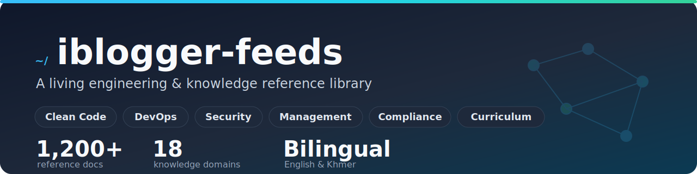

<div align="center">



# iblogger-feeds

**A living engineering &amp; knowledge reference library** — clean code, DevOps, security, project management, compliance, curriculum, language, and the habits that hold it all together.

[](https://github.com/iblogger855/iblogger-feeds/commits/main)
[](LICENSE)
[](INDEX.md)
[](#)
[](https://github.com/iblogger855/iblogger-feeds/pulls)

</div>

---

## What this is

`iblogger-feeds` is a structured, long-form reference library — not a blog feed, but a curated knowledge base that explains real-world topics in depth, often in **both English and Khmer**, with diagrams, worked examples, and a recurring "explain it many ways" style (first-principles, ELI5, Socratic, storyteller, and more).

> **At a glance:** 1,200+ documents · ~18 knowledge domains · bilingual (English &amp; ខ្មែរ) · Mermaid diagrams &amp; worked examples throughout.

---

## Start here

| File | Purpose |
| :--- | :--- |
| **[INDEX.md](INDEX.md)** | Browse everything by category |
| **[QUICK_START.md](QUICK_START.md)** | Get oriented in under 5 minutes |
| **[STRUCTURE.md](STRUCTURE.md)** | Repository layout &amp; naming conventions |
| **[CONTRIBUTING.md](.github/CONTRIBUTING.md)** | How to draft, review, and merge a doc |
| **[CODE_OF_CONDUCT.md](CODE_OF_CONDUCT.md)** | Community standards |

---

## Knowledge domains

| Domain | What's inside |
| :--- | :--- |
| 💡 **[Concepts](feeds/concepts/)** | Mental models, design-pattern explanations (12 teaching styles), parables, career paths — the largest collection in the repo |
| 💻 **[Clean Code](feeds/clean-code/)** | GoF design patterns with Java, data structures &amp; algorithms, refactoring, frontend architecture |
| ☁️ **[DevOps](feeds/devops/)** | Reverse proxies (NGINX/HAProxy/Traefik), CI/CD, network protocols &amp; API architectures, observability |
| 🛡️ **[Security](feeds/security/)** | OAuth 2.1, OIDC, SAML, WebAuthn/passkeys, DDoS defense, OWASP/ASVS |
| 📊 **[Management](feeds/management/)** | Agile &amp; SDLC, sign-off procedures, Functional Specs (with a full worked POS example), DoR/DoD |
| ⚖️ **[Compliance](feeds/compliances/)** | Data privacy, healthcare, identity &amp; KYC, EU-specific regulation |
| 📋 **[Procedures](feeds/procedures/)** | Operational runbooks — payments &amp; revenue, domain workflows, accounts, open source |
| 🎓 **[Colleges &amp; Curriculum](feeds/colleges/)** | Full university-style curricula (Denison, RKC) — 200+ structured learning files |
| 🏫 **[Schools](feeds/schools/)** | Grade-level educational material |
| 🗣️ **[English](feeds/english/)** | Professional English, idioms, daily practice |
| 🎯 **[Developer Habits](feeds/developer-habits/)** | Workflows, Model Context Protocol (MCP), visual communication |
| ⚡ **[Productivity](feeds/productivity/)** | Documentation workflows, AI-with-TDD, team-lead practices |
| 🧠 **[Mental Health](feeds/mental-health/)** | Burnout prevention, resilience |
| 🧩 **[Templates](feeds/templates/)** | Reusable document skeletons |

---

## Featured deep-dives

- 🧭 **[Leadership Playbooks](feeds/procedures/leadership-playbooks.md)** — first-90-days guides (Listen → Assess → Plan → Execute) for ten roles: Business Owner, Product Owner, PM, Engineering Manager, Team Lead, Scrum Master, QA Lead, Designer Lead, Data/Analytics Lead, and Support/CS Lead — each with assessment frameworks, swimlane diagrams, and fill-in templates.
- 📊 **[Functional Spec — full POS example](feeds/management/agile/fs/pos-fullexample/README.md)** — a comprehensive, build-ready FS for a cross-border social-commerce business: 15 modules, user stories, acceptance criteria, NFRs, data dictionary, and wireframes.
- ✅ **[Agile sign-off procedures](feeds/management/agile/procedure/)** — ticket lifecycle, deployment, and ADR sign-off, with ownership/RACI and diagrams.
- 💻 **[Design patterns, 12 ways](feeds/concepts/design-patterns/)** — each GoF pattern explained as a first-principles lecture, ELI5, Socratic dialogue, parable, and more.
- 🛡️ **[Authentication &amp; identity](feeds/security/)** — OAuth 2.0 / PKCE handshakes, OIDC, SAML, passkeys.
- ☁️ **[Network protocols &amp; API architectures](feeds/devops/)** — REST, GraphQL, gRPC, WebSockets compared.
- 🎓 **[Business &amp; sustainability curriculum](feeds/colleges/)** — a full multi-year program with bilingual parables and AI self-learning prompts.

---

## Repository structure

```
iblogger-feeds/
├── README.md            ← you are here
├── INDEX.md             ← global index of all docs
├── QUICK_START.md       ← 5-minute onboarding
├── STRUCTURE.md         ← layout & naming conventions
│
├── feeds/               ← the knowledge base (~1,200 docs)
│   ├── concepts/        ← mental models, patterns (12 styles), parables, careers
│   ├── clean-code/      ← patterns, DSA, refactoring, frontend architecture
│   ├── devops/          ← proxies, CI/CD, protocols, observability
│   ├── security/        ← auth, OWASP, DDoS, session security
│   ├── management/      ← agile, SDLC, sign-off procedures, Functional Specs
│   ├── compliances/     ← privacy, healthcare, KYC, EU regulation
│   ├── procedures/      ← operational runbooks
│   ├── colleges/        ← university-style curricula (200+ files)
│   ├── schools/         ← grade-level material
│   ├── english/         ← professional English, idioms, daily
│   ├── developer-habits/← workflows, MCP, visual communication
│   ├── productivity/    ← documentation, AI+TDD, team leadership
│   ├── mental-health/   ← well-being & burnout prevention
│   └── templates/       ← reusable document skeletons
│
├── assets/              ← repo assets (banner, etc.)
├── _templates/          ← article skeleton for new drafts
└── .github/             ← contributing guide & issue templates
```

---

## Contributing

```bash
# 1. Clone
git clone https://github.com/iblogger855/iblogger-feeds.git
cd iblogger-feeds

# 2. Branch
git checkout -b article/your-topic-here

# 3. Start from the template, in the right category folder
cp _templates/article-template.md feeds/<domain>/NN-your-topic.md

# 4. Write it — diagrams (Mermaid), worked examples, and (where relevant) a Khmer version

# 5. Link it from the category README and INDEX.md

# 6. Push and open a PR
git add . && git commit -m "Add: <your topic>"
git push origin article/your-topic-here
```

See [STRUCTURE.md](STRUCTURE.md) for style, diagram, and cross-link conventions, and [CONTRIBUTING.md](.github/CONTRIBUTING.md) for the review workflow.

---

<div align="center">

Maintained by [guidestack](https://guidestack.github.io/iblogger-player/) · [@iblogger855](https://github.com/iblogger855)

</div>
