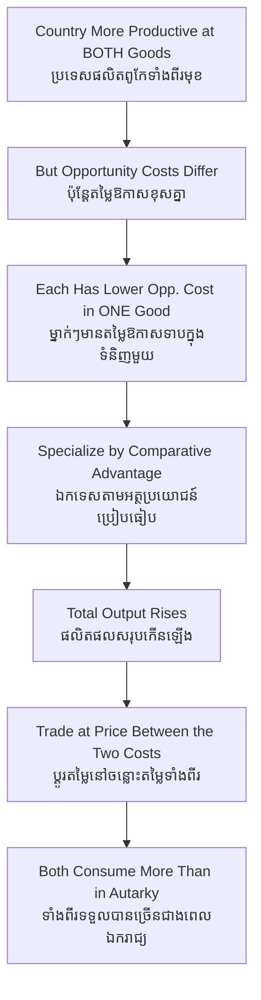

# Comparative Advantage — First-Principles Derivation
# អត្ថប្រយោជន៍ប្រៀបធៀប — ការស្រាយបញ្ជាក់ពីគោលការណ៍ដំបូង

*Author: ichamrong | Date: 2026-05-31*

---

## Foundational Scholar / អ្នកសិក្សាស្ថាបនិក

**David Ricardo** set out the law of comparative advantage in Chapter 7 of *On the Principles of Political Economy and Taxation* (1817), using his famous England–Portugal, cloth–wine example. Ricardo's insight overturned the intuition of *absolute* advantage (Adam Smith): he showed that two parties gain from trade *even when one is more efficient at producing everything*. What governs profitable trade is not who is better in absolute terms, but who gives up less to produce a given good — that is, **opportunity cost**. The result is among the few propositions in economics that is both non-obvious and rigorously true.

---

## Core Problem / បញ្ហាស្នូល

**English:** If one country (or person, or firm) is more productive than another at *every* good, why would it ever trade with the weaker producer rather than make everything itself? The naive answer — "the strong producer should do it all" — is wrong, and seeing why is the whole problem. The resolution requires distinguishing absolute efficiency (output per worker) from opportunity cost (what you sacrifice to make one more unit of a good), and showing that specialization according to opportunity cost expands total output for everyone.

**ខ្មែរ:** ប្រសិនបើប្រទេសមួយ (ឬបុគ្គល ឬក្រុមហ៊ុន) មានផលិតភាពខ្ពស់ជាងប្រទេសមួយទៀតក្នុងការផលិត *ទំនិញគ្រប់មុខ* ហេតុអ្វីបានជាវាត្រូវធ្វើពាណិជ្ជកម្មជាមួយអ្នកផលិតខ្សោយជាង ជំនួសឲ្យការផលិតអ្វីៗទាំងអស់ដោយខ្លួនឯង? ចម្លើយឆោតល្ងង់ — "អ្នកផលិតខ្លាំងគួរធ្វើទាំងអស់" — គឺខុស។ ដំណោះស្រាយទាមទារការបែងចែករវាងប្រសិទ្ធភាពដាច់ខាត និងតម្លៃឱកាស (អ្វីដែលអ្នកលះបង់ដើម្បីផលិតមួយឯកតាបន្ថែម) ហើយបង្ហាញថា ការឯកទេសកម្មតាមតម្លៃឱកាសពង្រីកផលិតផលសរុបសម្រាប់មនុស្សគ្រប់គ្នា។

---

## First Principles Derivation / ការស្រាយបញ្ជាក់ពីគោលការណ៍ដំបូង

**Setup (ការរៀបចំ):** Two countries, A and B; two goods, rice and cloth. Labor is the only input. Suppose country A is more productive at *both* goods (absolute advantage in both).

**Axiom 1 — Opportunity cost is the true price (អ័ក្សទ 1 — តម្លៃឱកាសគឺជាតម្លៃពិត):**
To make one more unit of cloth, a country must move workers off rice. The rice forgone is the *opportunity cost* of that cloth. This ratio, not raw productivity, is what matters.

**Axiom 2 — Opportunity costs differ across countries (អ័ក្សទ 2 — តម្លៃឱកាសខុសគ្នា):**
Even if A is better at both goods, the *amount* by which it is better usually differs between rice and cloth. So A's opportunity cost of cloth differs from B's.

**Derivation Chain (ខ្សែសង្វាក់ការស្រាយ):**

1. Each country has a *comparative* advantage in the good for which its opportunity cost is lower — and this is true even for the country that is absolutely worse at both, since opportunity costs must differ unless they are identical.
2. Let each country specialize in its lower-opportunity-cost good.
3. Total world output of both goods rises, because labor is reallocated to its most efficient use *relative to alternatives*.
4. Countries trade at a price ratio lying *between* their two opportunity costs.
5. Both end up consuming more than under self-sufficiency (autarky). **Gains from trade are mutual.**

**Numerical sketch:** If A gives up 2 rice per cloth and B gives up 4 rice per cloth, then A is the low-cost cloth producer and B the low-cost rice producer — regardless of A being better at both in absolute output. Trade at, say, 3 rice per cloth makes both richer.

---

## Why Nations Trade / ហេតុអ្វីប្រជាជាតិធ្វើពាណិជ្ជកម្ម

Comparative advantage is the theoretical core of why a tiny economy (Cambodia) can profitably trade with a giant (China or the US) even when the giant is more productive in absolute terms. Cambodia need not be *best* at anything; it need only have a *lower opportunity cost* in something — historically, labor-intensive garments and footwear — to gain from specialization and exchange.

---

## Visual Derivation / ការបង្ហាញដោយមើលឃើញ

---

## Relevance and Critiques for Sustainability / ភាពពាក់ព័ន្ធ និងការរិះគន់សម្រាប់និរន្តរភាព

Ricardo's model assumed away exactly the things sustainability now foregrounds:

- **Carbon leakage (ការលេចធ្លាយកាបូន):** If specialization shifts dirty production to the country with the lowest opportunity cost *because* it has the weakest environmental rules, global emissions can rise even as each country "gains." The model prices labor, not pollution.
- **Race to the bottom (ការប្រណាំងទៅបាត):** Comparative advantage built on lax labor or environmental standards is not a true efficiency advantage — it is an *uncosted externality* masquerading as one.
- **Static comparative advantage trap:** A country locked into low-wage assembly may never climb to higher-value production. Modern development economics treats comparative advantage as something to be *upgraded*, not merely accepted.

The theory remains true within its assumptions; sustainability critiques attack the assumptions, not the logic.

---

## Related Posts / អត្ថបទដែលទាក់ទង

- [02 — Feynman Technique](./02-feynman.md)
- [03 — Socratic Dialogue](./03-socratic.md)
- [04 — Analogy Bridge](./04-analogy.md)
- [05 — Narrative Story](./05-storyteller.md)
- [06 — Journalist Interview](./06-interview.md)
- [Course: International Trade and Supply Chains](../../year-3/01-international-trade-and-supply-chains.md)
- [Parable: The Trader Who Learned Three Languages](../../year-1/parables/265-the-trader-who-learned-three-languages.md)
