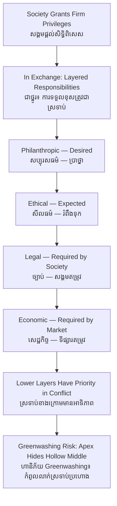

# Corporate Social Responsibility — First-Principles Derivation
# ការទទួលខុសត្រូវសង្គមសាជីវកម្ម — ការស្រាយបញ្ជាក់ពីគោលការណ៍ដំបូង

*Author: ichamrong | Date: 2026-05-31*

---

## Foundational Scholar / អ្នកសិក្សាស្ថាបនិក

**Archie B. Carroll** (University of Georgia) gave Corporate Social Responsibility (CSR) its most durable structure in his 1991 article *The Pyramid of Corporate Social Responsibility*, building on his 1979 four-part model. Carroll's contribution was to resolve a long-standing confusion — does CSR *replace* the profit motive, or *supplement* it? — by arranging a firm's responsibilities into an ordered hierarchy of four layers: economic, legal, ethical, and philanthropic. The earlier debate had been framed by Milton Friedman (1970), who argued the only social responsibility of business is to increase its profits within the rules. Carroll's pyramid absorbs Friedman's claim as its *base* rather than rejecting it.

---

## Core Problem / បញ្ហាស្នូល

**English:** Society grants firms enormous privileges — limited liability, legal personhood, access to public infrastructure and labor. In exchange, society holds expectations that exceed mere legality. But "be responsible to society" is hopelessly vague as a management instruction. Which responsibilities? In what order when they conflict? Carroll's problem was to convert a moral intuition into an operational hierarchy a manager can actually act on, without collapsing into either pure profit-maximization or unbounded obligation.

**ខ្មែរ:** សង្គមផ្ដល់ឲ្យក្រុមហ៊ុននូវសិទ្ធិពិសេសដ៏ច្រើន — ការទទួលខុសត្រូវមានកំណត់ បុគ្គលភាពច្បាប់ ការចូលប្រើហេដ្ឋារចនាសម្ព័ន្ធសាធារណៈ និងកម្លាំងពលកម្ម។ ជាថ្នូរ សង្គមមានការរំពឹងទុកលើសពីត្រឹមការគោរពច្បាប់។ ប៉ុន្តែ "ត្រូវទទួលខុសត្រូវចំពោះសង្គម" គឺមិនច្បាស់លាស់ជាការណែនាំគ្រប់គ្រងឡើយ។ ការទទួលខុសត្រូវមួយណា? តាមលំដាប់ណាពេលវាប៉ះទង្គិចគ្នា? បញ្ហារបស់ Carroll គឺបម្លែងវិចារណញាណសីលធម៌ទៅជាឋានានុក្រមដែលអ្នកគ្រប់គ្រងអាចអនុវត្តន៍ពិតប្រាកដ។

---

## First Principles Derivation / ការស្រាយបញ្ជាក់ពីគោលការណ៍ដំបូង

**Axiom 1 — A firm must first survive (អ័ក្សទ 1 — ក្រុមហ៊ុនត្រូវរស់រានជាមុនសិន):**
Without economic viability — revenue exceeding cost — a firm cannot fulfill any other obligation. A bankrupt firm helps no one.

**Axiom 2 — A firm operates inside a legal order (អ័ក្សទ 2 — ក្រុមហ៊ុនដំណើរការក្នុងសណ្ដាប់ធ្នាប់ច្បាប់):**
Profit must be earned within the law; law is society's codified minimum of acceptable conduct.

**Axiom 3 — Law lags ethics (អ័ក្សទ 3 — ច្បាប់យឺតជាងសីលធម៌):**
Many harms are not yet illegal. A firm that does only what is legal can still act in ways society regards as wrong.

**Axiom 4 — Surplus enables contribution (អ័ក្សទ 4 — អតិរេកអនុញ្ញាតឲ្យចូលរួម):**
Beyond ethics, a firm may *voluntarily* return resources to society — philanthropy — which society desires but does not require.

**Derivation Chain → Carroll's Pyramid (ខ្សែសង្វាក់ → ពីរ៉ាមីដ Carroll):**

1. **Economic (be profitable)** — the foundation; *required* by the market.
2. **Legal (obey the law)** — built on the base; *required* by society.
3. **Ethical (be fair, avoid harm beyond the law)** — *expected* by society.
4. **Philanthropic (be a good corporate citizen)** — *desired*, voluntary.

The layers are ordered but simultaneous: a firm should satisfy all four at once, with lower layers having priority when they conflict, since you cannot give away (philanthropy) what you must first earn (economic) and protect lawfully (legal).

---

## CSR vs ESG vs Shared Value / CSR ធៀប ESG ធៀប Shared Value

- **CSR** is the broad obligation concept (Carroll). It often sits *beside* core business — a foundation, a donation program.
- **ESG** (Environmental, Social, Governance) is the *measurement and investor* lens: it turns responsibility into rated, disclosed metrics for capital markets.
- **Creating Shared Value** (Porter & Kramer, 2011) argues responsibility should be *inside* the business model — solving social problems profitably — rather than philanthropy bolted on afterward.

The trajectory is from CSR-as-add-on → ESG-as-disclosure → shared value-as-strategy.

---

## The Greenwashing Critique / ការរិះគន់អំពី Greenwashing

Because the philanthropic and ethical layers are voluntary and hard to verify, CSR is vulnerable to **greenwashing**: spending more on *communicating* responsibility than on *practicing* it. A firm can run a tree-planting photo campaign (philanthropic theater) while violating the ethical layer (underpaying workers) — using the visible top of the pyramid to distract from a hollow middle. Carroll's hierarchy is itself the antidote: philanthropy at the apex cannot legitimately substitute for failures at the ethical or legal layers below it.

---

## Visual Derivation / ការបង្ហាញដោយមើលឃើញ

---

## Cambodian Application / ការអនុវត្តន៍ក្នុងបរិបទកម្ពុជា

**A telecom operator's school-building program:**
A Cambodian mobile operator funds rural schools and publicizes them widely — a clear philanthropic-layer act. Carroll's framework asks the harder question: is the *ethical* layer beneath it sound? Are tower-site land acquisitions fair to villagers? Are call-center workers' hours lawful and humane? If the schools are built while the ethical layer is neglected, the program is the apex of the pyramid resting on a hollow middle — precisely the greenwashing pattern. The genuinely responsible firm gets the economic, legal, and ethical layers right *first*, and treats philanthropy as a surplus, not a cover.

**Contrast — a social enterprise** (see the course link below) builds responsibility into the economic layer itself: it profits *by* solving a social problem — employing rural artisans at fair wages to make exportable handicrafts — so there is no hollow middle to hide.

---

## Related Posts / អត្ថបទដែលទាក់ទង

- [02 — Feynman Technique](./02-feynman.md)
- [03 — Socratic Dialogue](./03-socratic.md)
- [04 — Analogy Bridge](./04-analogy.md)
- [05 — Narrative Story](./05-storyteller.md)
- [06 — Journalist Interview](./06-interview.md)
- [Course: Social Entrepreneurship](../../sustainability-advanced/04-social-entrepreneurship.md)
- [Parable: The Monk Who Built a School](../../sustainability-advanced/parables/255-the-monk-who-built-a-school.md)
