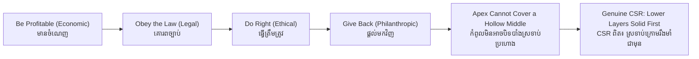

# Corporate Social Responsibility — Socratic Dialogue
# ការទទួលខុសត្រូវសង្គមសាជីវកម្ម — ការសន្ទនាបែប Socratic

*Author: ichamrong | Date: 2026-05-31*

---

**Professor:** Vichea, a beverage company in Cambodia spends $200,000 sponsoring a children's hospital and puts its logo on every wall. Is this company socially responsible?

**Vichea:** It seems so. It gave a lot of money to a good cause.

**Professor:** Let me add a fact. The same company underpays its delivery drivers, who work twelve-hour days with no contracts. Now is it socially responsible?

**Vichea:** That complicates it. The hospital gift is good, but mistreating the drivers is not.

**Professor:** So responsibility is not a single act we can point to. It has parts. Can we order those parts? Which comes first — treating the drivers fairly, or donating to the hospital?

**Vichea:** Treating the drivers fairly, surely. They're part of the company every day. The hospital gift is extra.

**Professor:** Good. And before either of those — should the company first be a viable, profitable business at all?

**Vichea:** Yes. If it goes bankrupt, it can neither pay drivers nor help any hospital.

**Professor:** And must its profit be earned lawfully — taxes paid, licenses held?

**Vichea:** Of course. Profit by breaking the law isn't legitimate.

**Professor:** Then you have just built a hierarchy. Lay it out for me from bottom to top.

**Vichea:** First, be profitable. Second, obey the law. Third, treat people ethically. Fourth, give back through charity.

**Professor:** You have reconstructed Archie Carroll's 1991 pyramid of CSR almost exactly: economic, legal, ethical, philanthropic. Now — which layer was our beverage company loudly performing?

**Vichea:** The top one. Philanthropy. The hospital.

**Professor:** And which layer was it failing?

**Vichea:** The ethical one. The drivers.

**Professor:** So it was decorating the apex while the middle was hollow. Does the hospital donation cancel out the unfair treatment of drivers?

**Vichea:** No. They're different layers. You can't pay your way out of treating people badly by giving to charity.

**Professor:** There is a name for using a visible good deed to distract from an invisible bad one. Do you know it?

**Vichea:** Greenwashing. Or just... responsibility theater.

**Professor:** Precisely. Now a sharper question. Friedman argued the only responsibility of business is to make profit within the law. Does Carroll reject Friedman?

**Vichea:** Not entirely. Friedman's claim — profit within the law — is just the bottom two layers of Carroll's pyramid. Carroll keeps them. He only says there are two more layers above.

**Professor:** Well seen. Now, people use three terms: CSR, ESG, and shared value. Are they the same?

**Vichea:** Related, but different. CSR is the duty itself. ESG sounds like a way to *measure* it — a score for investors. And shared value... I'm not sure.

**Professor:** Shared value, from Porter and Kramer, asks: instead of making profit and *then* giving back, can the profit-making activity itself solve the social problem? Give me an example.

**Vichea:** A company that earns its profit by employing poor rural workers at fair wages to make products for export. The business *is* the good deed. There's no separate charity bolted on.

**Professor:** And in that model, is greenwashing easier or harder?

**Vichea:** Harder. There's no hollow middle to hide, because the social good and the profit are the same activity. You can't fake what the business literally does.

**Professor:** So what, finally, is the test of genuine corporate social responsibility?

**Vichea:** Whether the lower layers — fair, lawful, ethical conduct — are solid *before* the company points to its donations. Charity on top of a hollow pyramid is theater. Charity on top of a solid one is real.

**Professor:** A complete answer.

---

## Insight Chain / ខ្សែសង្វាក់ការយល់ដឹង

---

## Related Posts / អត្ថបទដែលទាក់ទង

- [01 — MIT Professor](./01-mit-professor.md)
- [02 — Feynman Technique](./02-feynman.md)
- [04 — Analogy Bridge](./04-analogy.md)
- [05 — Narrative Story](./05-storyteller.md)
- [06 — Journalist Interview](./06-interview.md)
- [Course: Social Entrepreneurship](../../sustainability-advanced/04-social-entrepreneurship.md)
- [Parable: The Monk Who Built a School](../../sustainability-advanced/parables/255-the-monk-who-built-a-school.md)
