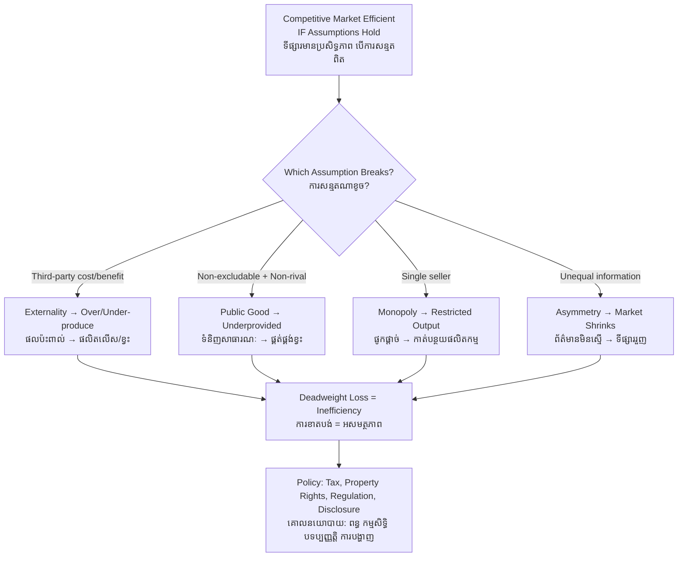

# Market Failure — First-Principles Derivation
# បរាជ័យទីផ្សារ — ការស្រាយបញ្ជាក់ពីគោលការណ៍ដំបូង

*Author: ichamrong | Date: 2026-05-31*

---

## Foundational Scholars / អ្នកសិក្សាស្ថាបនិក

The concept descends from **Arthur Cecil Pigou** (University of Cambridge), whose 1920 *The Economics of Welfare* formalized externalities and the tax that bears his name. **Paul Samuelson** (MIT) gave the theory of public goods its modern formal statement in 1954. **Kenneth Arrow** and **Gérard Debreu** (1954) proved the conditions under which competitive markets *are* efficient — and thereby defined precisely when they are not. **George Akerlof, Michael Spence, and Joseph Stiglitz** (Nobel 2001) established information asymmetry as a distinct source of failure. This course, [Principles of Microeconomics](../../year-1/01-principles-of-microeconomics.md), builds the efficiency benchmark these scholars then qualified.

---

## Core Problem / បញ្ហាស្នូល

**English:** The first welfare theorem says a competitive market reaches an efficient allocation — no one can be made better off without making another worse off. But this proof rests on strong assumptions: prices reflect all costs and benefits, goods are excludable and rival, there are many buyers and sellers, and everyone is fully informed. When any assumption breaks, the market still reaches an equilibrium, but that equilibrium is *inefficient* — it produces too much of some things and too little of others. We must identify the precise points of breakdown.

**ខ្មែរ:** ទ្រឹស្ដីបទសុខុមាលភាពទីមួយ និយាយថា ទីផ្សារប្រកួតប្រជែងឈានដល់ការបែងចែកប្រកបដោយប្រសិទ្ធភាព — គ្មាននរណាម្នាក់អាចទទួលបានប្រសើរជាងមុនដោយមិនធ្វើឱ្យអ្នកដទៃអាក្រក់ជាងមុនឡើយ។ ប៉ុន្តែការបញ្ជាក់នេះផ្អែកលើការសន្មតរឹងមាំ៖ ថ្លៃឆ្លុះបញ្ចាំងពីចំណាយ និងផលប្រយោជន៍ទាំងអស់ ទំនិញអាចបដិសេធ និងប្រកួត មានអ្នកទិញ និងអ្នកលក់ច្រើន ហើយគ្រប់គ្នាដឹងព័ត៌មានពេញលេញ។ នៅពេលការសន្មតណាមួយខូច ទីផ្សារនៅតែឈានដល់លំនឹង ប៉ុន្តែលំនឹងនោះ *គ្មានប្រសិទ្ធភាព*។

---

## First Principles Derivation / ការស្រាយបញ្ជាក់ពីគោលការណ៍ដំបូង

**Axiom — Efficiency requires prices to carry full information (អ័ក្ស — ប្រសិទ្ធភាពទាមទារឱ្យថ្លៃផ្ទុកព័ត៌មានពេញលេញ):**
A market allocates efficiently only if the price a buyer pays equals the full marginal social cost, and the price reflects the full marginal social benefit. When the price diverges from true social cost or benefit, decisions made on that price are wrong from society's standpoint.

**The Four Canonical Failures (បរាជ័យបួនយ៉ាង):**

1. **Externalities (ផលប៉ះពាល់ខាងក្រៅ):** A cost or benefit falls on a third party not in the transaction. A factory's price omits the cost of its smoke, so its social cost exceeds its private cost → the market **overproduces** the polluting good. (Positive externalities, e.g. education, are *underproduced*.)
2. **Public goods (ទំនិញសាធារណៈ):** Goods that are non-excludable and non-rival (clean air, national defense). Because no one can be charged, the free-rider problem means the market **underprovides** them — often to zero. See the related keyword [public-goods](../public-goods/01-mit-professor.md).
3. **Market power / monopoly (អំណាចទីផ្សារ):** A single seller restricts quantity to raise price above marginal cost, creating deadweight loss → the market **underproduces** relative to the competitive ideal.
4. **Information asymmetry (ភាពមិនស្មើនៃព័ត៌មាន):** When one party knows more than the other (used cars, insurance, lending), adverse selection and moral hazard can shrink or collapse the market entirely.

**Derivation of the externality wedge (ការស្រាយ​បន្ទះ​ផលប៉ះពាល់):**

1. Let private marginal cost = PMC; external marginal cost (e.g. pollution damage) = EMC.
2. Social marginal cost SMC = PMC + EMC.
3. The market equilibrates where price = PMC, ignoring EMC.
4. Therefore market quantity Q\_market satisfies demand = PMC, which lies to the *right* of the efficient quantity Q\_efficient, where demand = SMC.
5. The gap Q\_market − Q\_efficient is overproduction; the welfare loss is the **deadweight loss** — the triangle of units whose social cost exceeds their social benefit but which get produced anyway.

---

## Visual Derivation / ការបង្ហាញដោយមើលឃើញ

---

## Sustainability Note / ចំណាំអំពីនិរន្តរភាព

Environmental degradation is the paradigmatic market failure. Pollution is a negative externality; clean air and biodiversity are public goods; over-fished rivers are the tragedy of the commons (a rivalry-without-excludability failure). Almost every environmental policy instrument — carbon taxes, cap-and-trade, fishing quotas, emissions standards — is an attempt to correct one of these four failures so that prices once again tell the ecological truth.

---

## Cambodian Application / ការអនុវត្តន៍ក្នុងបរិបទកម្ពុជា

**Mekong sand dredging:** The market price of construction sand reflects the dredger's fuel and labour but omits the external costs — riverbank collapse, lost fisheries, damaged homes downstream. PMC sits far below SMC, so the market overproduces dredged sand exactly as the externality model predicts. **Anlong Pi landfill and informal e-waste burning** around Phnom Penh similarly impose health externalities on neighboring communities never compensated in any price. Each is a textbook case where private equilibrium and social efficiency diverge.

---

## Related Posts / អត្ថបទដែលទាក់ទង

- [02 — Feynman Technique](./02-feynman.md)
- [03 — Socratic Dialogue](./03-socratic.md)
- [04 — Analogy Bridge](./04-analogy.md)
- [05 — Narrative Story](./05-storyteller.md)
- [06 — Journalist Interview](./06-interview.md)
- [Course: Principles of Microeconomics](../../year-1/01-principles-of-microeconomics.md)
- [Parable: The King Who Banned the Smoke](../../year-1/parables/263-the-king-who-banned-the-smoke.md)
