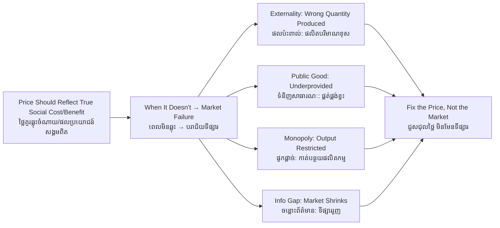

# Market Failure — Socratic Dialogue
# បរាជ័យទីផ្សារ — ការសន្ទនាបែប Socratic

*Author: ichamrong | Date: 2026-05-31*

---

**Professor:** Maly, we have established that a competitive market produces an efficient outcome. Do you believe that is always true?

**Maly:** It seems to work for most things — rice, clothes, phones. The price settles where supply meets demand.

**Professor:** Then let me press on it. A brick kiln outside Kampong Cham burns waste rubber and tires for fuel because it is cheap. The bricks sell at a competitive price. Is anything missing from that price?

**Maly:** The smoke. The families nearby breathe it. They get sick, but they are not paid for it.

**Professor:** So the kiln's *private* cost — fuel, clay, labour — is lower than the *full* cost to society?

**Maly:** Yes. Society's cost includes the health damage. The price only counts the kiln's own costs.

**Professor:** If the price is lower than the true social cost, are the bricks too cheap or too dear?

**Maly:** Too cheap.

**Professor:** And when something is too cheap, do we get too much of it or too little?

**Maly:** Too much. People build more, the kiln burns more tires, more smoke.

**Professor:** So the market reached an equilibrium, but is that equilibrium good for society?

**Maly:** No. It produces more pollution than society would choose if the price told the truth. The market succeeded mechanically but failed socially.

**Professor:** You have just described a **market failure** through a **negative externality**. Now, is pollution the only way a market can fail? Consider clean air itself. Could a private company sell clean air over the city?

**Maly:** Not really. You cannot stop someone from breathing it, and one person breathing does not use it up for others.

**Professor:** So if no one can be excluded and no one's use diminishes another's, can a seller charge for it?

**Maly:** No — everyone would just use it for free. Nobody would pay.

**Professor:** And if nobody pays, how much clean air will private firms produce?

**Maly:** Almost none. There is no money in it.

**Professor:** That is the **public good** failure. Two failures, opposite directions: pollution overproduced, clean air underproduced. What do they share?

**Maly:** In both, the price does not capture the real social value. The cost or benefit lands on people outside the transaction.

**Professor:** Sharp. Now consider one seller controlling all the cement in a region. Does the price tell the truth there?

**Maly:** No — the seller can hold back cement to push the price up. Too little is made, and it costs too much. Another failure.

**Professor:** And a lender who cannot tell a reliable borrower from a risky one?

**Maly:** They will charge everyone a high rate to cover the risk, which drives the reliable borrowers away, leaving the risky ones. The market could shrink or collapse. Information asymmetry.

**Professor:** Four failures, one diagnosis. State it.

**Maly:** A market fails whenever the price stops reflecting the true social costs and benefits — through externalities, public goods, monopoly, or hidden information. The market still clears, but at the wrong quantity.

**Professor:** And the remedy is never "abolish the market." It is...?

**Maly:** Repair the price. Tax the pollution so its price rises to the true cost. Have the state provide the public good. Break up the monopoly. Force disclosure. Make the price honest, then let the market work again.

**Professor:** That sentence is the entire bridge from microeconomics to environmental policy.

---

## Insight Chain / ខ្សែសង្វាក់ការយល់ដឹង

---

## Related Posts / អត្ថបទដែលទាក់ទង

- [01 — MIT Professor](./01-mit-professor.md)
- [02 — Feynman Technique](./02-feynman.md)
- [04 — Analogy Bridge](./04-analogy.md)
- [05 — Narrative Story](./05-storyteller.md)
- [06 — Journalist Interview](./06-interview.md)
- [Course: Principles of Microeconomics](../../year-1/01-principles-of-microeconomics.md)
- [Parable: The King Who Banned the Smoke](../../year-1/parables/263-the-king-who-banned-the-smoke.md)
