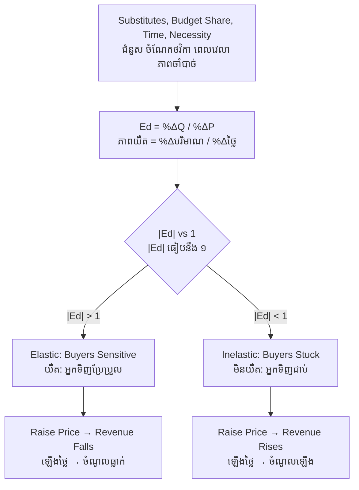

# Price Elasticity — First-Principles Derivation
# ភាពយឺតនៃថ្លៃ — ការស្រាយបញ្ជាក់ពីគោលការណ៍ដំបូង

*Author: ichamrong | Date: 2026-05-31*

---

## Foundational Scholar / អ្នកសិក្សាស្ថាបនិក

**Alfred Marshall** (University of Cambridge) introduced the concept of *elasticity of demand* in his 1890 *Principles of Economics*, borrowing the word from physics. He wanted a measure of responsiveness that did not depend on the units (kilos, litres, riel) in which a good happened to be measured. His solution — comparing *percentage* changes rather than absolute changes — remains the definition used in every microeconomics course, including [Principles of Microeconomics](../../year-1/01-principles-of-microeconomics.md).

---

## Core Problem / បញ្ហាស្នូល

**English:** We know from supply and demand that raising a price reduces quantity demanded. But *by how much*? A 10% price rise might cut sales by 1% for one product and by 40% for another. Without a unit-free measure of this responsiveness, we cannot predict how a tax, a subsidy, or a price change will affect quantity, revenue, or welfare. We need to derive that measure from first principles.

**ខ្មែរ:** យើងដឹងពីតម្រូវការ និងការផ្គត់ផ្គង់ថា ការដំឡើងថ្លៃកាត់បន្ថយបរិមាណតម្រូវការ។ ប៉ុន្តែ *ប៉ុន្មាន*? ការដំឡើងថ្លៃ ១០% អាចកាត់ការលក់ ១% សម្រាប់ផលិតផលមួយ និង ៤០% សម្រាប់ផលិតផលមួយទៀត។ បើគ្មានរង្វាស់នៃការឆ្លើយតបដែលឯករាជ្យពីឯកតា យើងមិនអាចទស្សន៍ទាយពីរបៀបដែលពន្ធ ឧបត្ថម្ភធន ឬការផ្លាស់ប្ដូរថ្លៃ ប៉ះពាល់ដល់បរិមាណ ចំណូល ឬសុខុមាលភាពបានឡើយ។

---

## First Principles Derivation / ការស្រាយបញ្ជាក់ពីគោលការណ៍ដំបូង

**Axiom 1 — Responsiveness varies (អ័ក្សទ ១ — ការឆ្លើយតបខុសគ្នា):**
Different goods respond differently to the same proportional price change, depending on buyers' alternatives and the good's role in their lives.

**Axiom 2 — Units must not matter (អ័ក្សទ ២ — ឯកតាមិនត្រូវប៉ះពាល់):**
A meaningful measure of responsiveness must give the same answer whether we measure rice in kilos or tonnes, price in riel or dollars.

**Derivation Chain (ខ្សែសង្វាក់ការស្រាយ):**

1. To strip out units, compare **percentage** changes, not absolute ones.
2. Define **price elasticity of demand**: `Ed = (% change in quantity demanded) / (% change in price)`.
3. Because demand slopes down, Ed is negative; by convention we discuss its absolute value |Ed|.
4. Classify:
   - **|Ed| > 1 → elastic**: quantity responds *more* than proportionally. Buyers are sensitive.
   - **|Ed| < 1 → inelastic**: quantity responds *less* than proportionally. Buyers are stuck.
   - **|Ed| = 1 → unit elastic**: quantity and price change in equal proportion.
5. **Revenue corollary** (Revenue = Price × Quantity): if demand is elastic, raising price *lowers* total revenue (quantity falls faster than price rises); if inelastic, raising price *raises* revenue. The two effects exactly cancel at unit elasticity, which is where total revenue is maximized.

**Determinants of elasticity (កត្តាកំណត់ភាពយឺត):**

1. **Substitutes** — more and closer substitutes → more elastic (Pepsi vs. all soft drinks).
2. **Necessity vs. luxury** — necessities (rice, medicine) inelastic; luxuries elastic.
3. **Share of budget** — goods taking a large budget share are more elastic.
4. **Time horizon** — demand is more elastic in the long run, when buyers can adjust habits and find alternatives.
5. **Definition breadth** — narrowly defined goods (one brand) are more elastic than broad categories (all food).

---

## Visual Derivation / ការបង្ហាញដោយមើលឃើញ

---

## Sustainability Note / ចំណាំអំពីនិរន្តរភាព

Elasticity is the hinge of environmental tax policy. A carbon or fuel tax reduces consumption *only to the extent demand is elastic*. Petrol demand is highly **inelastic in the short run** — people still must commute — so a fuel tax raises lots of revenue but cuts little consumption immediately. Over the long run demand becomes elastic as people buy efficient vehicles or relocate, so the same tax cuts consumption far more. This long-run/short-run elasticity gap is central to designing effective environmental tax policy — the kind used to correct the failures analyzed in [market-failure](../market-failure/01-mit-professor.md).

---

## Cambodian Application / ការអនុវត្តន៍ក្នុងបរិបទកម្ពុជា

**Tobacco taxation:** Cambodia's relatively low cigarette taxes reflect, in part, the inelastic demand of established smokers — a tax raises revenue but reduces smoking only modestly among adults. Public-health economists note, however, that *youth* demand is far more elastic (tight budgets, not yet addicted), so even a tax that barely moves adult consumption can sharply reduce uptake among the young — a precise elasticity argument with real policy stakes.

---

## Related Posts / អត្ថបទដែលទាក់ទង

- [02 — Feynman Technique](./02-feynman.md)
- [03 — Socratic Dialogue](./03-socratic.md)
- [04 — Analogy Bridge](./04-analogy.md)
- [05 — Narrative Story](./05-storyteller.md)
- [06 — Journalist Interview](./06-interview.md)
- [Course: Principles of Microeconomics](../../year-1/01-principles-of-microeconomics.md)
- [Parable: The Farmer Who Raised the Price](../../year-1/parables/260-the-farmer-who-raised-the-price.md)
