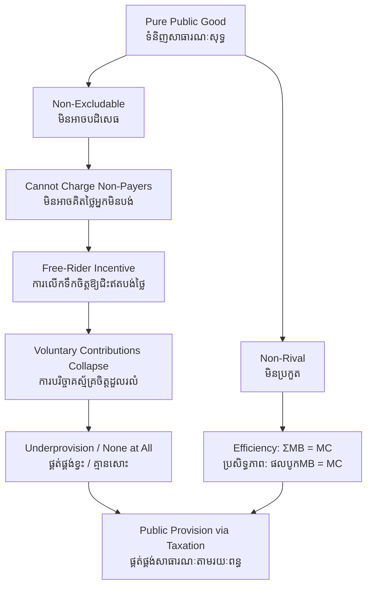

# Public Goods — First-Principles Derivation
# ទំនិញសាធារណៈ — ការស្រាយបញ្ជាក់ពីគោលការណ៍ដំបូង

*Author: ichamrong | Date: 2026-05-31*

---

## Foundational Scholar / អ្នកសិក្សាស្ថាបនិក

**Paul Samuelson** (MIT) gave public goods their formal definition in two short, decisive papers — "The Pure Theory of Public Expenditure" (1954) and "Diagrammatic Exposition of a Theory of Public Expenditure" (1955). He distinguished a "collective consumption good" — one that "all enjoy in common in the sense that each individual's consumption leads to no subtraction from any other individual's consumption" — from an ordinary private good. Building on him, **Richard Musgrave** systematized public finance and **Mancur Olson** (*The Logic of Collective Action*, 1965) explained why rational individuals fail to provide such goods voluntarily. This course, [Principles of Microeconomics](../../year-1/01-principles-of-microeconomics.md), treats public goods as a leading case of market failure.

---

## Core Problem / បញ្ហាស្នូល

**English:** Markets allocate private goods well because a buyer who does not pay can be excluded, and one person's consumption uses up the unit. But some goods — clean air, national defense, a lighthouse, biodiversity, a stable climate — have neither property. You cannot exclude non-payers, and one person's enjoyment does not diminish another's. For such goods, the price mechanism that makes markets work simply has nothing to grip. We must derive *why* markets underprovide them and *what* fills the gap.

**ខ្មែរ:** ទីផ្សារបែងចែកទំនិញឯកជនបានល្អ ព្រោះអ្នកទិញដែលមិនបង់ប្រាក់អាចត្រូវបានបដិសេធ ហើយការប្រើប្រាស់របស់មនុស្សម្នាក់ប្រើអស់ឯកតានោះ។ ប៉ុន្តែទំនិញខ្លះ — ខ្យល់បរិសុទ្ធ ការការពារជាតិ ភ្លើងបង្ហាញផ្លូវ ជីវចម្រុះ អាកាសធាតុមានស្ថិរភាព — គ្មានលក្ខណៈទាំងពីរនេះឡើយ។ អ្នកមិនអាចបដិសេធអ្នកមិនបង់ប្រាក់ ហើយការរីករាយរបស់មនុស្សម្នាក់មិនកាត់បន្ថយរបស់អ្នកដទៃ។ យើងត្រូវស្រាយបញ្ជាក់ថា ហេតុអ្វីទីផ្សារផ្គត់ផ្គង់ទំនិញទាំងនេះមិនគ្រប់គ្រាន់ និងអ្វីដែលបំពេញចន្លោះនោះ។

---

## First Principles Derivation / ការស្រាយបញ្ជាក់ពីគោលការណ៍ដំបូង

**Defining the two properties (លក្ខណៈពីរ):**

1. **Excludability (ភាពអាចបដិសេធ):** can a provider prevent non-payers from consuming the good? A cinema can; clean air cannot.
2. **Rivalry (ភាពប្រកួត):** does one person's consumption reduce what is available to others? A loaf of bread is rival; a radio broadcast is not.

**The 2×2 taxonomy (តារាង ២×២):**

| | **Rival** | **Non-rival** |
|---|---|---|
| **Excludable** | Private good (rice, shoes) | Club good (toll road, cinema) |
| **Non-excludable** | Common resource (ocean fish) | **Pure public good (clean air, defense)** |

**Derivation of underprovision (ការស្រាយ​ផ្គត់ផ្គង់ខ្វះ):**

1. A profit-seeking firm supplies a good only if it can charge for it.
2. Charging requires the ability to exclude non-payers.
3. A pure public good is **non-excludable** → the firm cannot exclude → cannot reliably charge.
4. Each individual, knowing they will enjoy the good whether or not they pay, has a private incentive to **free-ride** (Olson).
5. If everyone free-rides, total contributions fall far below the cost → the good is provided at far below the efficient level, often **not at all**.

**The efficiency condition (Samuelson condition):** For a private good, efficiency requires each consumer's marginal benefit to equal the price. For a public good — because everyone consumes the *same* unit simultaneously — efficiency requires the **sum** of all consumers' marginal benefits to equal the marginal cost: ΣMB = MC. Markets equate individual MB to price, not the sum, and so stop far short.

---

## Visual Derivation / ការបង្ហាញដោយមើលឃើញ

---

## Sustainability Note / ចំណាំអំពីនិរន្តរភាព

The greatest public goods of our time are environmental: **clean air, a stable climate, and biodiversity**. Each is non-excludable (you cannot fence the atmosphere) and non-rival (my breathing clean air leaves yours intact). This is precisely why they are chronically underprovided by markets and why their protection requires collective action — national parks, emissions treaties, protected-area funding. Climate stability is the largest public good in human history, which is exactly why the free-rider problem among nations makes it so hard to secure. Note the contrast with a **common resource** like ocean fish (rival but non-excludable), whose distinct failure is the tragedy of the commons.

---

## Cambodian Application / ការអនុវត្តន៍ក្នុងបរិបទកម្ពុជា

**The Tonle Sap and protected forests:** A healthy Tonle Sap ecosystem provides flood regulation and fish-stock replenishment that benefit millions and that no one can be excluded from — a public good. No private firm will fund its protection because it cannot charge the beneficiaries. Hence protection falls to public institutions and, increasingly, to **payment-for-ecosystem-services** schemes and donor-funded conservation, which are deliberate institutional substitutes for the missing market. The Prey Lang forest's carbon-storage and biodiversity services are public goods of exactly this kind.

---

## Related Posts / អត្ថបទដែលទាក់ទង

- [02 — Feynman Technique](./02-feynman.md)
- [03 — Socratic Dialogue](./03-socratic.md)
- [04 — Analogy Bridge](./04-analogy.md)
- [05 — Narrative Story](./05-storyteller.md)
- [06 — Journalist Interview](./06-interview.md)
- [Course: Principles of Microeconomics](../../year-1/01-principles-of-microeconomics.md)
- [Parable: The River That Fed the Village](../../year-1/parables/262-the-river-that-fed-the-village.md)
