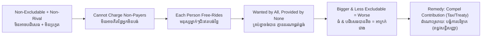

# Public Goods — Socratic Dialogue
# ទំនិញសាធារណៈ — ការសន្ទនាបែប Socratic

*Author: ichamrong | Date: 2026-05-31*

---

**Professor:** Vuthy, when you buy a bowl of kuy teav, can the seller refuse you if you don't pay?

**Vuthy:** Of course. No money, no noodles.

**Professor:** And once you eat that bowl, can someone else eat the same bowl?

**Vuthy:** No, it's gone.

**Professor:** So that good has two features: the seller can exclude non-payers, and consuming it uses it up. Now think about the light from a streetlamp on your corner. Can anyone be excluded from its light?

**Vuthy:** No. It just shines on the street for everyone.

**Professor:** And when you walk under it, is there less light for the next person?

**Vuthy:** No, the light is the same for everyone.

**Professor:** So this good has the *opposite* of both features. We call those two features excludability and rivalry. The streetlamp light is non-excludable and non-rival. What might we call such a good?

**Vuthy:** A public good?

**Professor:** Yes. Now here is the puzzle. Everyone on your dark street wants a lamp. Suppose a neighbor passes a collection box. Will you put money in?

**Vuthy:** I should... but honestly, if the others pay, the lamp gets built and I get the light anyway. So I might keep my money.

**Professor:** Be honest about what *everyone* on the street is thinking at that moment.

**Vuthy:** The same thing. Everyone hopes the others will pay.

**Professor:** And if everyone hopes that, what gets collected?

**Vuthy:** Almost nothing. The lamp never gets bought.

**Professor:** So a good that *everyone wants* is provided by *no one*. Is that because people don't value it?

**Vuthy:** No — they value it a lot. It's because each person is better off not paying, as long as they can't be shut out.

**Professor:** You have just described the free-rider problem. Now, does this puzzle ever arise for the bowl of noodles?

**Vuthy:** No. You can't free-ride on noodles — if you don't pay, you don't eat. The exclusion solves it.

**Professor:** So which property is doing the damage for the public good — the non-rivalry or the non-excludability?

**Vuthy:** The non-excludability. Because we can't exclude non-payers, we can't charge, so the free-riding happens.

**Professor:** Excellent. Now scale up. Is clean air over Phnom Penh excludable?

**Vuthy:** No, you can't fence the air.

**Professor:** Non-rival?

**Vuthy:** Yes — my breathing clean air doesn't reduce yours.

**Professor:** So clean air is...?

**Vuthy:** A public good. And the same free-rider problem applies — no company will produce clean air because it can't sell it.

**Professor:** And a stable climate for the whole planet — who is the "neighbor with the collection box" there?

**Vuthy:** Every country. And every country is tempted to free-ride on the others' emission cuts while enjoying the stable climate.

**Professor:** Which is why the hardest public-good problem in history is...?

**Vuthy:** Climate change. The biggest, most non-excludable public good, so the biggest free-rider problem.

**Professor:** Last question. If markets cannot provide public goods, what can?

**Vuthy:** Something that removes the choice to free-ride. If everyone is required to contribute — through taxes, or a binding treaty — then no one can dodge, and the good gets built.

**Professor:** So the streetlamp, the clean air, and the climate all need the same medicine: a collective decision to compel what voluntary action will not deliver. That is the economic justification for public provision.

---

## Insight Chain / ខ្សែសង្វាក់ការយល់ដឹង

---

## Related Posts / អត្ថបទដែលទាក់ទង

- [01 — MIT Professor](./01-mit-professor.md)
- [02 — Feynman Technique](./02-feynman.md)
- [04 — Analogy Bridge](./04-analogy.md)
- [05 — Narrative Story](./05-storyteller.md)
- [06 — Journalist Interview](./06-interview.md)
- [Course: Principles of Microeconomics](../../year-1/01-principles-of-microeconomics.md)
- [Parable: The River That Fed the Village](../../year-1/parables/262-the-river-that-fed-the-village.md)
