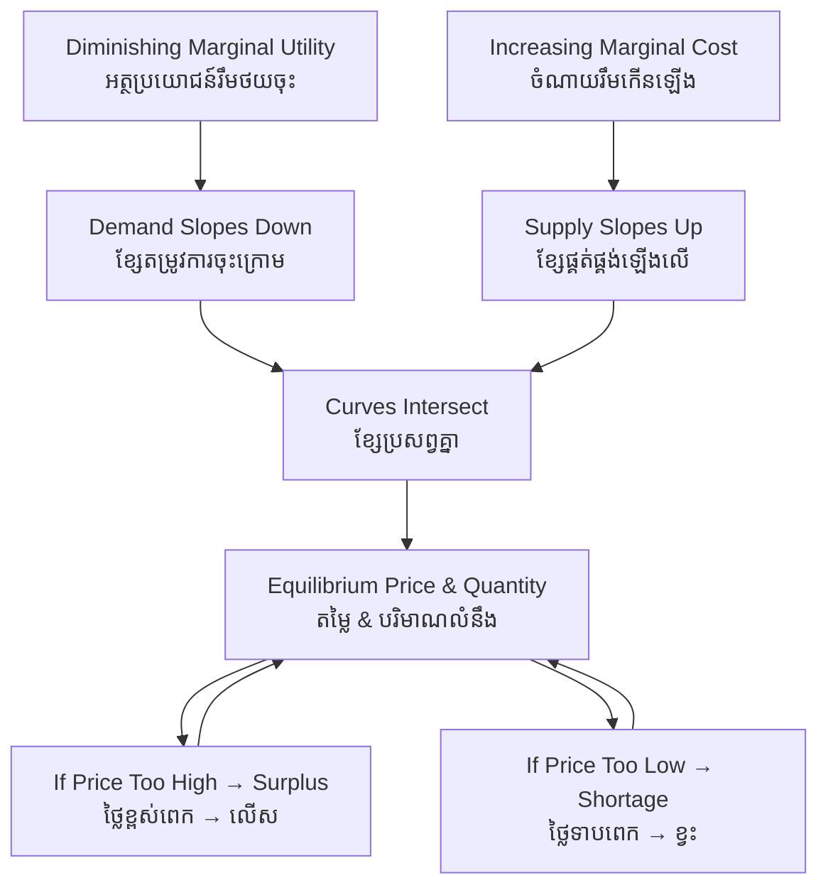

# Supply and Demand — First-Principles Derivation
# តម្រូវការ និងការផ្គត់ផ្គង់ — ការស្រាយបញ្ជាក់ពីគោលការណ៍ដំបូង

*Author: ichamrong | Date: 2026-05-31*

---

## Foundational Scholars / អ្នកសិក្សាស្ថាបនិក

**Alfred Marshall** (University of Cambridge), in his 1890 *Principles of Economics*, gave supply and demand the scissors metaphor that defines the model today: "We might as reasonably dispute whether it is the upper or the under blade of a pair of scissors that cuts a piece of paper, as whether value is governed by utility or cost of production." Marshall synthesized the demand side (marginal utility, developed by Jevons, Menger, and Walras) with the supply side (cost of production, from the classical economists Smith and Ricardo) into a single equilibrium framework. This course, *Principles of Microeconomics* (see [../../year-1/01-principles-of-microeconomics.md](../../year-1/01-principles-of-microeconomics.md)), treats this model as its analytical bedrock.

---

## Core Problem / បញ្ហាស្នូល

**English:** In a market with no central planner, how does a price get set? Millions of buyers each have private willingness to pay; thousands of sellers each have private costs. No one announces the "correct" price. Yet markets routinely converge on a price at which the quantity buyers wish to purchase equals the quantity sellers wish to supply. We need to derive how this coordination happens from the behavior of individual agents — and to identify when it fails.

**ខ្មែរ:** នៅក្នុងទីផ្សារដែលគ្មានអ្នករៀបចំផែនការកណ្ដាល តើតម្លៃត្រូវបានកំណត់យ៉ាងដូចម្តេច? អ្នកទិញរាប់លាននាក់ម្នាក់ៗមានឆន្ទៈបង់ប្រាក់ផ្ទាល់ខ្លួន។ អ្នកលក់រាប់ពាន់នាក់ម្នាក់ៗមានចំណាយផ្ទាល់ខ្លួន។ គ្មាននរណាប្រកាសតម្លៃ "ត្រឹមត្រូវ" ឡើយ។ ប៉ុន្តែទីផ្សារតែងតែប្រសព្វនៅតម្លៃមួយ ដែលបរិមាណអ្នកទិញចង់ទិញ ស្មើនឹងបរិមាណអ្នកលក់ចង់ផ្គត់ផ្គង់។ យើងត្រូវស្រាយបញ្ជាក់ពីរបៀបដែលការសម្របសម្រួលនេះកើតឡើង ចេញពីឥរិយាបថរបស់ភ្នាក់ងារនីមួយៗ — និងកំណត់ពេលដែលវាបរាជ័យ។

---

## First Principles Derivation / ការស្រាយបញ្ជាក់ពីគោលការណ៍ដំបូង

**Axiom 1 — Diminishing marginal utility (អ័ក្សទ ១ — អត្ថប្រយោជន៍រឹមថយចុះ):**
Each additional unit a consumer buys yields less added satisfaction than the previous one. Therefore a consumer will only buy more units at a lower price. This generates a **downward-sloping demand curve**.

**Axiom 2 — Increasing marginal cost (អ័ក្សទ ២ — ចំណាយរឹមកើនឡើង):**
Producing each additional unit eventually costs more (scarce inputs, capacity limits). Therefore sellers will only supply more units at a higher price. This generates an **upward-sloping supply curve**.

**Axiom 3 — Mutually beneficial exchange clears (អ័ក្សទ ៣ — ការផ្លាស់ប្ដូរផលប្រយោជន៍រួមត្រូវបានបញ្ចប់):**
Any buyer whose willingness to pay exceeds a seller's cost can trade and both gain. Trades continue until no such pair remains.

**Derivation Chain (ខ្សែសង្វាក់ការស្រាយ):**

1. Define quantity demanded *Qd(P)* — falling in price; quantity supplied *Qs(P)* — rising in price.
2. At any price where *Qd > Qs* → a **shortage**; unsatisfied buyers bid the price up.
3. At any price where *Qs > Qd* → a **surplus**; unsold sellers cut the price down.
4. The only price with no pressure to change is where *Qd(P\*) = Qs(P\*)* → **equilibrium price P\*** and **equilibrium quantity Q\***.
5. This equilibrium is *allocatively efficient* under ideal conditions: it maximizes the sum of consumer and producer surplus, and no costless reallocation can make anyone better off without harming another (Pareto efficiency).

**Movements vs. shifts (ចលនា ទល់នឹង ការផ្លាស់ប្ដូរខ្សែ):** A change in the good's own price moves you *along* a fixed curve. A change in any other determinant (income, tastes, input costs, technology, expectations, number of buyers/sellers) **shifts the entire curve** to a new position, producing a new equilibrium.

---

## Visual Derivation / ការបង្ហាញដោយមើលឃើញ

---

## Sustainability Note / ចំណាំអំពីនិរន្តរភាព

The model's efficiency claim holds *only* when prices reflect all costs. When production emits pollution or depletes a shared resource, the market price omits the social cost, and equilibrium quantity is too high — the foundation of the market-failure analysis explored in the related keyword [market-failure](../market-failure/01-mit-professor.md).

---

## Cambodian Application / ការអនុវត្តន៍ក្នុងបរិបទកម្ពុជា

**Rice prices at Phsar Thmei:** When the 2010–2011 export surge raised global rice demand, Cambodian paddy prices rose sharply — a rightward demand shift, not a movement along the curve. Farmers in Battambang who could expand acreage moved *along* their supply curve in response. But supply could not adjust within a single season, so the short-run shortage cleared through higher prices rather than higher quantity — a textbook illustration of inelastic short-run supply meeting a demand shift.

---

## Related Posts / អត្ថបទដែលទាក់ទង

- [02 — Feynman Technique](./02-feynman.md)
- [03 — Socratic Dialogue](./03-socratic.md)
- [04 — Analogy Bridge](./04-analogy.md)
- [05 — Narrative Story](./05-storyteller.md)
- [06 — Journalist Interview](./06-interview.md)
- [Course: Principles of Microeconomics](../../year-1/01-principles-of-microeconomics.md)
- [Parable: The Farmer Who Raised the Price](../../year-1/parables/260-the-farmer-who-raised-the-price.md)
