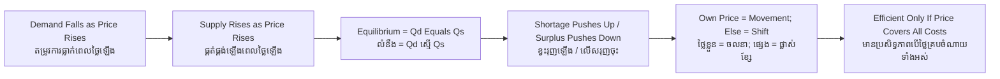

# Supply and Demand — Socratic Dialogue
# តម្រូវការ និងការផ្គត់ផ្គង់ — ការសន្ទនាបែប Socratic

*Author: ichamrong | Date: 2026-05-31*

---

**Professor:** Sophea, when the price of petrol rises in Phnom Penh, do people buy more of it or less?

**Sophea:** Less, normally. It costs more, so they drive less or share rides.

**Professor:** Good. And if petrol became extremely cheap?

**Sophea:** People would drive more, take more trips. They would buy more.

**Professor:** So can you state, as a rule, the relationship between price and the quantity people wish to buy?

**Sophea:** As price goes up, quantity demanded goes down. They move in opposite directions.

**Professor:** Now flip to the seller. If the price a station can charge for petrol rises, what does the importer want to do?

**Sophea:** Import and sell more, because each litre earns more.

**Professor:** So for the seller, price and quantity supplied move...?

**Sophea:** In the same direction. Higher price, more supplied.

**Professor:** We now have two forces pulling opposite ways. Buyers want a low price, sellers a high one. Can both get exactly what they want?

**Sophea:** No. There has to be a compromise somewhere in between.

**Professor:** Where, precisely? Is there a special price?

**Sophea:** The price where the amount buyers want equals the amount sellers offer. Nothing is left over and nothing runs out.

**Professor:** You have named the **equilibrium**. Now test it. Suppose the government fixed petrol below that price. What happens?

**Sophea:** Buyers would want a lot at the cheap price, but sellers would not supply enough. There would be a shortage. Queues, maybe a black market.

**Professor:** And above the equilibrium?

**Sophea:** A surplus. Fuel sitting unsold. Sellers would have to cut the price to clear it.

**Professor:** So what forces the market back to equilibrium when it strays?

**Sophea:** Shortages push the price up; surpluses push it down. The pressure only stops at equilibrium.

**Professor:** Excellent. Now a subtle one. Last year people bought more electric scooters even though scooter prices did not fall. The quantity rose without the price falling. Does this break our rule that lower price means more bought?

**Sophea:** No... I think the whole demand changed. People wanted scooters more — maybe fuel got expensive, or tastes changed. So at every price they wanted more.

**Professor:** What do we call that — the whole relationship changing, versus sliding along a fixed line?

**Sophea:** A shift of the curve, versus a movement along the curve.

**Professor:** And what kinds of things shift demand, rather than move along it?

**Sophea:** Income, tastes, prices of substitutes and complements, expectations, the number of buyers. Anything except the good's own price.

**Professor:** Now the question this whole course circles back to. Our equilibrium was supposed to be efficient. But imagine a coal plant selling electricity. Its price covers fuel and wages — but not the health damage from the smoke. Is the market price the "true" price?

**Sophea:** No. The smoke is a cost too, but nobody pays it in the price. So the price is too low and people buy too much electricity from coal.

**Professor:** So the elegant equilibrium can be efficient and still wrong?

**Sophea:** Yes — efficient for the buyers and sellers in the deal, but wrong for everyone breathing the smoke who was never in the deal.

**Professor:** Hold onto that. It is the doorway from supply and demand into market failure.

---

## Insight Chain / ខ្សែសង្វាក់ការយល់ដឹង

---

## Related Posts / អត្ថបទដែលទាក់ទង

- [01 — MIT Professor](./01-mit-professor.md)
- [02 — Feynman Technique](./02-feynman.md)
- [04 — Analogy Bridge](./04-analogy.md)
- [05 — Narrative Story](./05-storyteller.md)
- [06 — Journalist Interview](./06-interview.md)
- [Course: Principles of Microeconomics](../../year-1/01-principles-of-microeconomics.md)
- [Parable: The Farmer Who Raised the Price](../../year-1/parables/260-the-farmer-who-raised-the-price.md)
