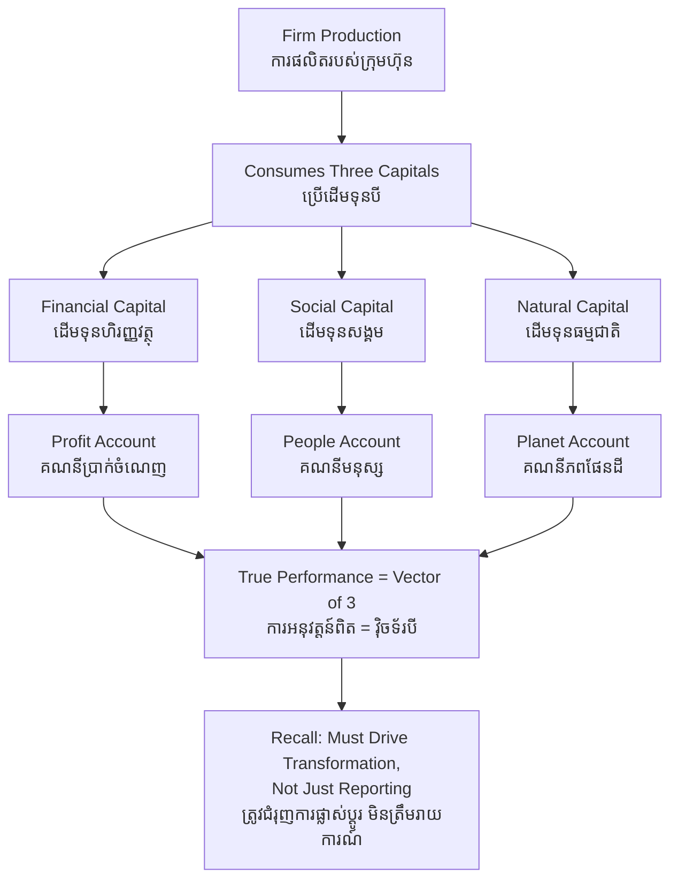

# Triple Bottom Line — First-Principles Derivation
# បាតបន្ទាត់ទាំងបី — ការស្រាយបញ្ជាក់ពីគោលការណ៍ដំបូង

*Author: ichamrong | Date: 2026-05-31*

---

## Foundational Scholar / អ្នកសិក្សាស្ថាបនិក

**John Elkington** coined the term *Triple Bottom Line* (TBL, or "3Ps" — People, Planet, Profit) in 1994 and developed it in his 1997 book *Cannibals with Forks: The Triple Bottom Line of 21st Century Business*. Elkington's intervention targeted a specific accounting convention: that the only "bottom line" worth measuring is net financial profit. He argued that a firm's true performance is a vector of three results — economic, social, and environmental — and that collapsing them into a single monetary figure systematically hides value destruction. In 2018 Elkington published a now-famous "product recall" of his own concept, warning that TBL had been captured as an accounting trick rather than used as a tool for deep transformation.

---

## Core Problem / បញ្ហាស្នូល

**English:** Conventional accounting recognizes only transactions that pass through markets at a price. But many of a firm's most consequential outputs — carbon emissions, watershed degradation, worker injury, community displacement — are *externalities*: real costs imposed on third parties that never appear on the income statement. A firm can therefore report rising profit while simultaneously destroying social and ecological capital. The question is: how do we construct a performance measure that makes those hidden costs visible and forces managers to account for them?

**ខ្មែរ:** គណនេយ្យបែបប្រពៃណីទទួលស្គាល់តែប្រតិបត្តិការដែលឆ្លងកាត់ទីផ្សារដោយមានតម្លៃប៉ុណ្ណោះ។ ប៉ុន្តែលទ្ធផលសំខាន់ៗជាច្រើនរបស់ក្រុមហ៊ុន — ការបញ្ចេញកាបូន ការបំផ្លាញអាងទឹក របួសកម្មករ ការផ្លាស់ទីសហគមន៍ — គឺជា *ផលប៉ះពាល់ខាងក្រៅ* (externalities)៖ ការចំណាយពិតប្រាកដដែលដាក់លើភាគីទីបី ប៉ុន្តែមិនដែលបង្ហាញនៅលើរបាយការណ៍ចំណូល។ ដូច្នេះក្រុមហ៊ុនអាចរាយការណ៍ប្រាក់ចំណេញកើនឡើង ខណៈពេលដែលកំពុងបំផ្លាញដើមទុនសង្គម និងបរិស្ថាន។ សំណួរគឺ៖ តើយើងបង្កើតរង្វាស់ការអនុវត្តន៍យ៉ាងណាដែលធ្វើឲ្យការចំណាយលាក់ទាំងនោះមើលឃើញ?

---

## First Principles Derivation / ការស្រាយបញ្ជាក់ពីគោលការណ៍ដំបូង

**Axiom 1 — A firm consumes three kinds of capital (អ័ក្សទ 1 — ក្រុមហ៊ុនប្រើដើមទុនបីប្រភេទ):**
Production draws down financial capital (money), social capital (trust, labor, community license), and natural capital (water, air, soil, biodiversity). All three are scarce.

**Axiom 2 — Single-metric accounting only meters one of the three (អ័ក្សទ 2 — គណនេយ្យរង្វាស់តែមួយ វាស់តែមួយក្នុងបី):**
Standard financial accounting prices financial capital precisely and the other two at (approximately) zero. What is priced at zero is consumed without limit.

**Axiom 3 — Unmetered drawdown is unsustainable (អ័ក្សទ 3 — ការប្រើដែលមិនវាស់ មិនអាចនិរន្តរ):**
A capital stock consumed faster than it regenerates eventually collapses, taking the firm's economic returns with it.

**Derivation Chain (ខ្សែសង្វាក់ការស្រាយ):**

1. Define performance as the simultaneous net effect on all three capitals — not financial profit alone.
2. Construct three accounts: **Profit** (economic value added), **People** (net social value — wages, safety, community), **Planet** (net environmental value — emissions, resource use, ecosystem impact).
3. Measure each in its own appropriate units; resist the temptation to force all three into one monetary number.
4. A genuinely successful firm produces a *positive* result on all three lines — or at minimum does not destroy one to inflate another.
5. TBL is therefore not "profit plus charity." It is a redefinition of what counts as a firm's actual output.

---

## Elkington's Self-Critique / ការរិះគន់ខ្លួនឯងរបស់ Elkington

In 2018 Elkington argued that TBL had been hollowed out: firms used it to *report* three numbers while changing nothing material. He called for a "recall" — not abandonment, but a demand that TBL drive system-level transformation (regenerative business, science-based targets) rather than serve as a glossy accounting label. This self-critique is itself a first-principles move: a metric is only as good as the decisions it changes.

---

## Visual Derivation / ការបង្ហាញដោយមើលឃើញ

---

## Cambodian Application / ការអនុវត្តន៍ក្នុងបរិបទកម្ពុជា

**A rice-milling exporter in Battambang:**
Consider an exporter reporting record profit on milled rice sold to the EU. A single-line account looks excellent. A TBL account reveals the rest: husks burned in the open (Planet — air quality), seasonal millers paid below a living wage with no contracts (People), and groundwater drawn down for parboiling (Planet). When the EU buyer later demands a sustainability audit under its own ESG disclosure rules, the previously invisible People and Planet lines become hard financial liabilities — exactly the externality that TBL was designed to surface in advance.

**Contrast — a community-owned palm-sugar cooperative in Kampong Speu** measures all three from the start: profit per member, fair wages and training (People), and replanting of sugar palms with no chemical inputs (Planet). It cannot match the exporter on raw margin, but its three-line result is positive and durable — the kind of regenerative model Elkington's "recall" was pointing toward.

---

## Related Posts / អត្ថបទដែលទាក់ទង

- [02 — Feynman Technique](./02-feynman.md)
- [03 — Socratic Dialogue](./03-socratic.md)
- [04 — Analogy Bridge](./04-analogy.md)
- [05 — Narrative Story](./05-storyteller.md)
- [06 — Journalist Interview](./06-interview.md)
- [Course: ESG Reporting and GRI Standards](../../sustainability-advanced/01-esg-reporting-and-gri-standards.md)
- [Parable: The Village That Ate Its Own Forest](../../sustainability-advanced/parables/253-the-village-that-ate-its-own-forest.md)
