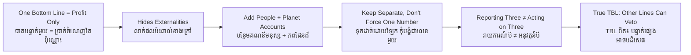

# Triple Bottom Line — Socratic Dialogue
# បាតបន្ទាត់ទាំងបី — ការសន្ទនាបែប Socratic

*Author: ichamrong | Date: 2026-05-31*

---

**Professor:** Sophea, suppose a beverage company in Phnom Penh reports a 20% increase in profit this year. Was it a good year for the company?

**Sophea:** It sounds like it. Higher profit usually means a good year.

**Professor:** And how did we measure that "good"?

**Sophea:** By the profit figure — the bottom line.

**Professor:** One number, then. Tell me, can a single number ever hide something important?

**Sophea:** I suppose it can. The 20% might come from cutting something that mattered.

**Professor:** Such as?

**Sophea:** Such as... using cheaper packaging that pollutes, or pumping more groundwater, or cutting worker benefits.

**Professor:** So the profit rose, but other things may have fallen. If those other things are real, why do they not appear in the bottom line?

**Sophea:** Because the bottom line only counts money that passes through the company's accounts. The polluted water and the strained workers are costs paid by other people.

**Professor:** We have a word for a cost paid by someone outside the transaction. Do you recall it?

**Sophea:** An externality.

**Professor:** Good. Now, if these externalities are real costs, would a complete accounting include them?

**Sophea:** It should. Otherwise the picture is incomplete — even dishonest.

**Professor:** Then how many "bottom lines" do we actually need to tell the truth about this company?

**Sophea:** More than one. We'd need profit, but also something for the people affected, and something for the environment.

**Professor:** You have just reconstructed John Elkington's 1994 idea. He named those three: People, Planet, Profit. Tell me — could we simply convert the river pollution into dollars and add it to the profit line?

**Sophea:** We could try. But how do you put a dollar value on a river that a thousand families fish from? Any number we pick seems arbitrary.

**Professor:** So should we force all three into one currency, or keep them as three separate accounts?

**Sophea:** Keeping them separate seems more honest. If we squeeze them into one number, we can hide a bad Planet result behind a good Profit result.

**Professor:** Precisely Elkington's concern. Now here is a harder question. Suppose a company publishes a beautiful report with all three numbers — but its factory operates exactly as before. Has it adopted the Triple Bottom Line?

**Sophea:** It has *reported* a triple bottom line. But it hasn't *acted* on one. Nothing changed.

**Professor:** Elkington himself said the same in 2018 — he issued a "recall" of his own concept. Why would the inventor of an idea want to recall it?

**Sophea:** Because it was being used as decoration, not as a tool for change. The measure was supposed to change decisions. If it only changes the report, it has failed.

**Professor:** So what, finally, would convince you that a company truly uses the Triple Bottom Line?

**Sophea:** If a bad People or Planet result actually stopped a decision the profit number would have approved. That's the test — when the other two lines have the power to say "no."

**Professor:** A precise answer. The Triple Bottom Line is not three numbers in a report. It is three numbers with the authority to veto.

---

## Insight Chain / ខ្សែសង្វាក់ការយល់ដឹង

---

## Related Posts / អត្ថបទដែលទាក់ទង

- [01 — MIT Professor](./01-mit-professor.md)
- [02 — Feynman Technique](./02-feynman.md)
- [04 — Analogy Bridge](./04-analogy.md)
- [05 — Narrative Story](./05-storyteller.md)
- [06 — Journalist Interview](./06-interview.md)
- [Course: ESG Reporting and GRI Standards](../../sustainability-advanced/01-esg-reporting-and-gri-standards.md)
- [Parable: The Company That Reported Nothing](../../sustainability-advanced/parables/252-the-company-that-reported-nothing.md)
