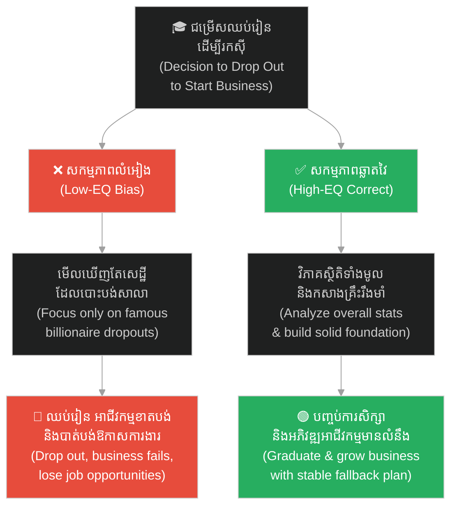
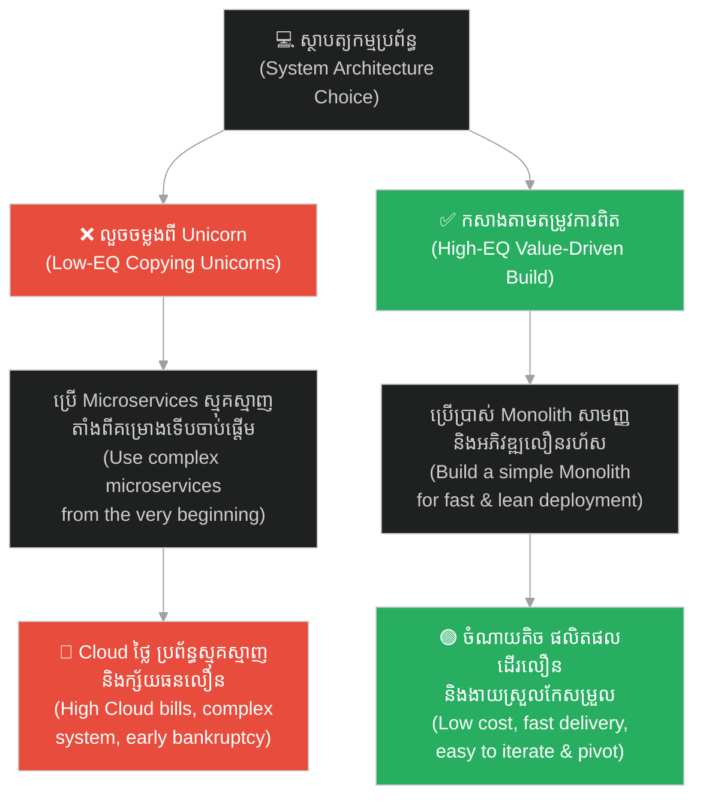
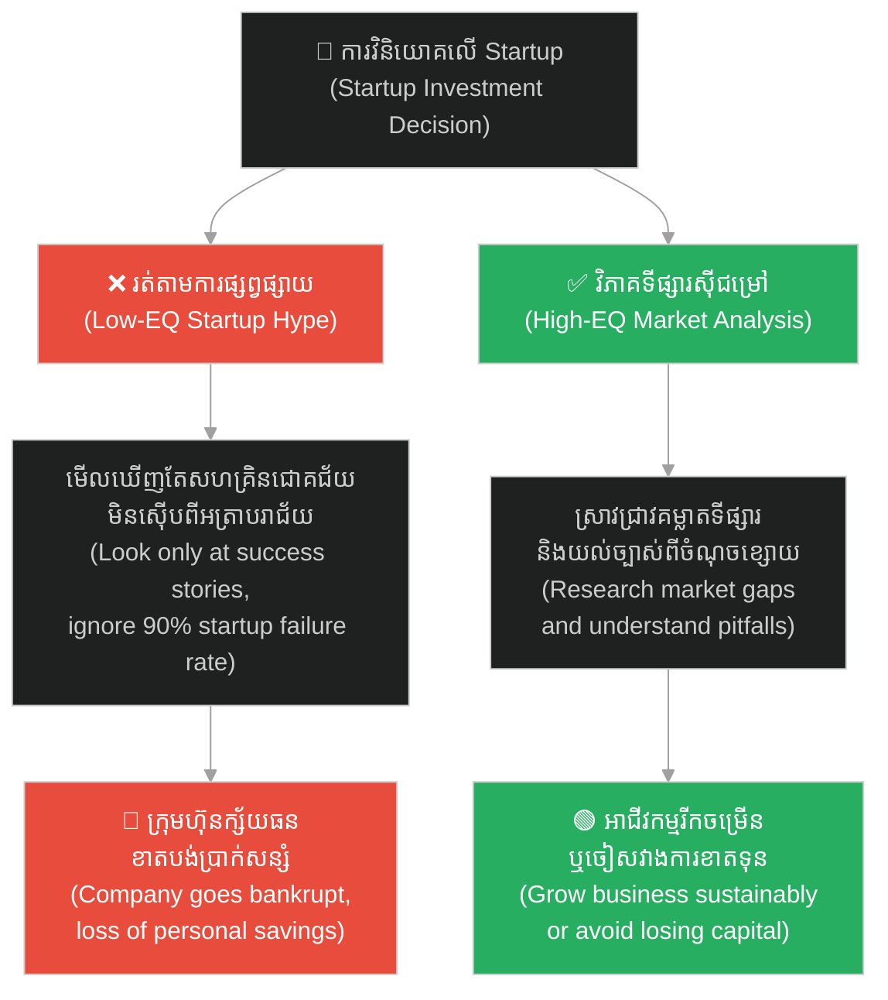
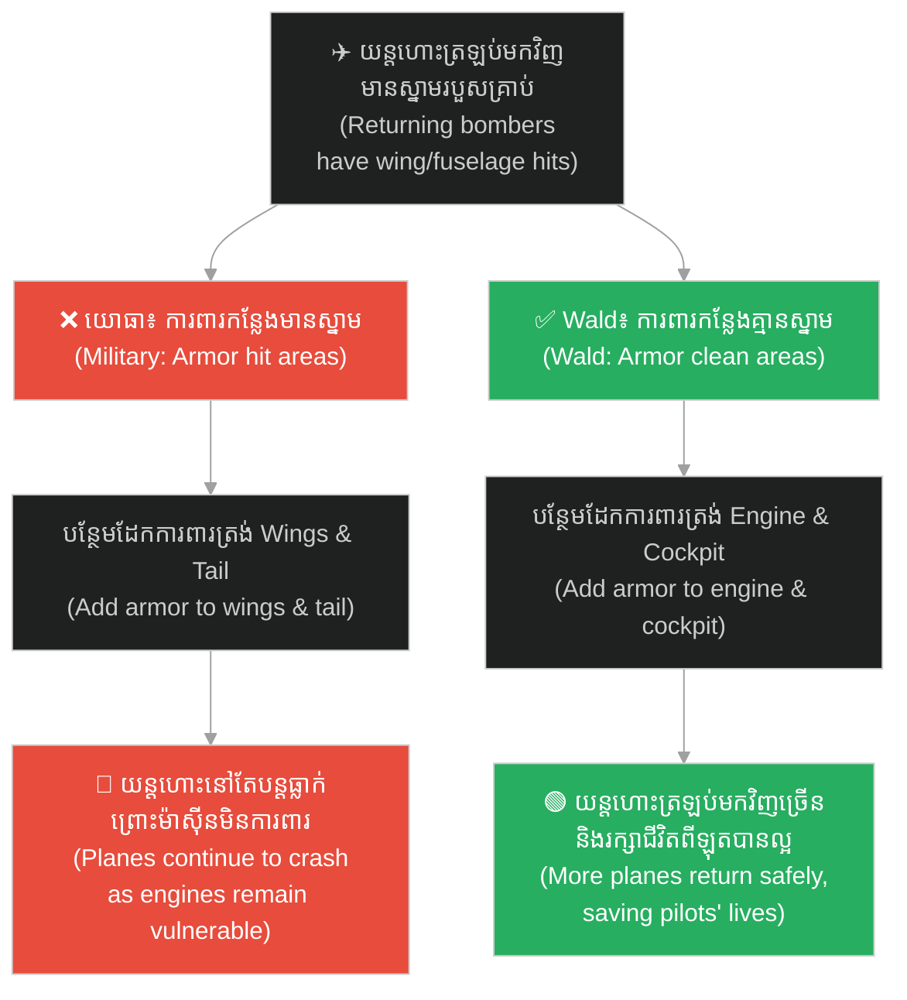
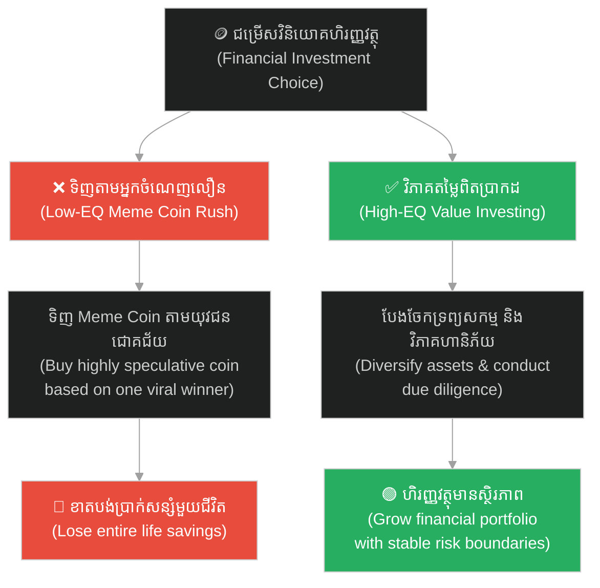

# Survivorship Bias (លំអៀងដោយសារការរស់រានមានជីវិត)៖ អន្ទាក់ផ្លូវចិត្តដែលមើលឃើញតែអ្នកឈ្នះ (Survivorship Bias: The Cognitive Trap of Looking Only at Winners)

**Author:** ichamrong  
**Date:** 2026-06-04  
**Tags:** #survivorship-bias #statistics #cognitive-bias #critical-thinking #mental-models #decision-making  
**Category:** Concepts  
**Read Time:** ~20 min  

---

## 📌 មាតិកា (Table of Contents)
- [អន្ទាក់ផ្លូវចិត្ត (The Trap)](#0)
- [១. បញ្ហា៖ ទីលានបញ្ចុះសពស្ងប់ស្ងាត់ និងការវិភាគតែលើអ្នករស់រាន (The Issue: The Silent Graveyard)](#1)
- [២. ឧទាហរណ៍ជាក់ស្តែងក្នុងពិភពពិត (Real World Examples)](#2)
  - [ឧទាហរណ៍ទី ១ — កម្រិតស្រាល៖ ទេវកថានៃការបោះបង់ការសិក្សា (Example 1: The Dropout Myth)](#2-1)
  - [ឧទាហរណ៍ទី ២ — កម្រិតមធ្យម (បច្ចេកទេស)៖ ការលួចចម្លងស្ថាបត្យកម្មរបស់ Unicorn (Example 2: Copying Unicorn Architecture)](#2-2)
  - [ឧទាហរណ៍ទី ៣ — កម្រិតមធ្យម (ធុរកិច្ច)៖ រឿងរ៉ាវជោគជ័យរបស់ Startup (Example 3: The Startup Hype)](#2-3)
  - [ឧទាហរណ៍ទី ៤ — កម្រិតធ្ងន់៖ យន្តហោះសឹករបស់ Abraham Wald (Example 4: Abraham Wald's WWII Armor Problem)](#2-4)
  - [ឧទាហរណ៍ទី ៥ — កម្រិតមធ្យម (ការវិនិយោគ)៖ ការវិនិយោគលើភាគហ៊ុន/គ្រីបតូតាមអ្នកជោគជ័យ (Example 5: Crypto/Stock Investment Bias)](#2-5)
- [៣. កត្តាជម្រុញ៖ ការផ្សព្វផ្សាយរបស់ប្រព័ន្ធផ្សព្វផ្សាយ និងការខ្វះទិន្នន័យអវិជ្ជមាន (The Aggravator: Media Hype & Missing Negative Data)](#3)
- [៤. ដំណោះស្រាយទូទៅ (The General Solution)](#4)
- [សេចក្តីសន្និដ្ឋាន (Conclusion)](#5)
- [ឯកសារយោង (References)](#6)
- [Related Posts](#7)

---

<a id="0"></a>
## អន្ទាក់ផ្លូវចិត្ត (The Trap)

តើអ្នកធ្លាប់អានសម្រង់សម្តីជម្រុញទឹកចិត្ត ឬរឿងរ៉ាវរបស់មហាសេដ្ឋីលំដាប់ពិភពលោកដូចជា Steve Jobs, Bill Gates ឬ Mark Zuckerberg ដែរឬទេ?

Have you ever read the inspiring quotes or success stories of world-class billionaires like Steve Jobs, Bill Gates, or Mark Zuckerberg?

រឿងរ៉ាវទាំងនោះតែងតែមានរូបមន្តស្រដៀងគ្នា៖ *«ពួកគេបានសម្រេចចិត្តបោះបង់ការសិក្សានៅសកលវិទ្យាល័យលំដាប់កំពូល ចាប់ផ្តើមបង្កើតក្រុមហ៊ុននៅក្នុងយានដ្ឋានឡានដ៏កខ្វក់ ជឿជាក់លើក្តីស្រមៃខ្លួនឯង ប្រថុយប្រថានគ្រប់បែបយ៉ាង ហើយចុងក្រោយក៏ក្លាយជាមហាសេដ្ឋីលំដាប់ពិភពលោក។»*

Those stories always follow a similar formula: *"They decided to drop out of top-tier universities, started their company in a dirty garage, believed in their dreams, risked everything, and eventually became world-class billionaires."*

បន្ទាប់ពីអានរួច អ្នកប្រហែលជាមានអារម្មណ៍ថា៖ *«ដើម្បីទទួលបានជោគជ័យដ៏អស្ចារ្យ ខ្ញុំត្រូវតែបោះបង់សាលាចោល ហើយប្រថុយប្រថានគ្រប់បែបយ៉ាងដូចពួកគេដែរ!»*

After reading, you might feel: *"To achieve great success, I must drop out of school and risk everything just like them!"*

ប៉ុន្តែ នេះគឺជាការគិតដ៏គ្រោះថ្នាក់បំផុតដែលបណ្តាលមកពី **Survivorship Bias (លំអៀងដោយសារការរស់រានមានជីវិត)**។ អ្នកកំពុងវាយតម្លៃសកលលោកទាំងមូលដោយមើលឃើញតែ «អ្នកឈ្នះ» ម្នាក់គត់ ខណៈពេលដែលមើលមិនឃើញ «អ្នកចាញ់» រាប់សែននាក់ផ្សេងទៀតឡើយ។

However, this is a highly dangerous line of thinking caused by **Survivorship Bias**. You are evaluating the entire universe by looking only at the "winners" while completely ignoring the hundreds of thousands of "losers."

ដើម្បីងាយស្រួលតាមដាន នេះជាផែនទីបង្ហាញផ្លូវសម្រាប់អត្ថបទនេះ៖
1. **បញ្ហា (The Issue)** — តើការផ្តោតលើតែអ្នករស់រាននាំឱ្យការសម្រេចចិត្តខុសឆ្គងដូចម្តេច?
2. **ឧទាហរណ៍ជាក់ស្តែង (Real World Examples)** — ឧទាហរណ៍ចំនួន ៥ ចាប់ពីជីវិតប្រចាំថ្ងៃ រហូតដល់យន្តហោះសឹក WWII និងស្ថាបត្យកម្មប្រព័ន្ធ។
3. **កត្តាជម្រុញ (The Aggravator)** — ហេតុអ្វីបានជាប្រព័ន្ធផ្សព្វផ្សាយលាក់បាំងទិន្នន័យបរាជ័យ?
4. **ដំណោះស្រាយទូទៅ (The General Solution)** — របៀបស្វែងរកទិន្នន័យដែលបាត់បង់ និងការវិភាគ Post-Mortem។

Roadmap for this article:
1. **The Issue** — How does focusing only on survivors distort our decision-making?
2. **Real World Examples** — Five examples ranging from daily life to WWII aircraft and software architecture.
3. **The Aggravator** — Why does the media hide failure data?
4. **The General Solution** — How to seek missing data and run Post-Mortem analyses.

---

<a id="1"></a>
## ១. បញ្ហា៖ ទីលានបញ្ចុះសពស្ងប់ស្ងាត់ និងការវិភាគតែលើអ្នករស់រាន (The Issue: The Silent Graveyard)

**Survivorship Bias** គឺជាកំហុសតក្កវិទ្យា និងលំអៀងស្ថិតិមួយ ដែលយើងផ្តោតការវិភាគតែទៅលើ **«បុគ្គល ឬវត្ថុដែលបានរស់រានមានជីវិត ឬទទួលបានជោគជ័យ (The Survivors)»** ហើយមើលរំលងទាំងស្រុងនូវ **«បុគ្គល ឬវត្ថុដែលបានបរាជ័យ (The Failures)»** ដោយសារតែពួកគេលែងមានលទ្ធភាពបង្ហាញខ្លួន ឬនិយាយឱ្យយើងឮបាន។

**Survivorship Bias** is a logical fallacy and statistical bias where we focus our analysis exclusively on **"individuals or things that survived or succeeded (The Survivors)"** while completely overlooking **"those that failed (The Failures),"** simply because they are no longer visible or vocal.

និយាយឱ្យសាមញ្ញ៖
* **ទីលានបញ្ចុះសពស្ងប់ស្ងាត់ (The Silent Graveyard)៖** ចំពោះរាល់អ្នកបោះបង់ការសិក្សាម្នាក់ដែលបានក្លាយជាមហាសេដ្ឋី មានមនុស្សរាប់សែននាក់ផ្សេងទៀតដែលបានបោះបង់ការសិក្សាដូចគ្នា ហើយបានបញ្ចប់ជីវិតការងារដោយការជំពាក់បំណុលសាលា និងធ្វើការងារដែលមានចំណូលទាបបំផុត។ ប៉ុន្តែគ្មានសារព័ត៌មានណាទៅសម្ភាសន៍មនុស្សដែលបរាជ័យនៅក្នុង Graveyard ទាំងនោះឡើយ។
* ផ្លូវនៃការសម្រេចចិត្តរបស់យើងប្រែជាខុសឆ្គងទាំងស្រុង ព្រោះយើងយកតែរូបមន្តរបស់ **«ករណីពិសេស (The Exception)»** មកធ្វើជា **«ច្បាប់ទូទៅ (The Rule)»**។

To put it simply:
* **The Silent Graveyard:** For every dropout who became a billionaire, there are hundreds of thousands of others who dropped out, only to end up burdened with student debt and working low-wage jobs. Yet, no media outlet interviews the failures in that graveyard.
* Our decision-making path becomes completely distorted because we treat the **"exception"** as the **"general rule."**

```
❌ ការគិតខុស៖ "Steve Jobs បោះបង់សាលាហើយជោគជ័យ ដូច្នេះការបោះបង់សាលា = ផ្លូវទៅរកភាពមានបាន។"
(Wrong Thinking: "Steve Jobs dropped out and succeeded, so dropping out is the path to wealth.")

✅ ការពិត៖ "Steve Jobs គឺជាករណីពិសេស ១ ក្នុងចំណោមមនុស្សរាប់លាននាក់។ ៩៩.៩% នៃអ្នកបោះបង់សាលា មិនអាចបង្កើត Apple បានឡើយ។"
(The Reality: "Steve Jobs is an anomaly—1 in a million. 99.9% of dropouts never build an Apple.")
```

---

<a id="2"></a>
## ២. ឧទាហរណ៍ជាក់ស្តែងក្នុងពិភពពិត (Real World Examples)

សូមពិនិត្យមើល **ឧទាហរណ៍ជាក់ស្តែងចំនួន ៥** ចាប់ពីការរស់នៅប្រចាំថ្ងៃ រហូតដល់យុទ្ធសាស្ត្រសរសេរកូដ និងប្រវត្តិសាស្ត្រពិភពលោក៖

Here are **five real-world examples** ranging from daily life to software engineering and world history:

---

<a id="2-1"></a>
### ឧទាហរណ៍ទី ១ — កម្រិតស្រាល៖ ទេវកថានៃការបោះបង់ការសិក្សា (Example 1: The Dropout Myth)

**ស្ថានភាព៖** ការជជែកវែកញែករបស់យុវជនម្នាក់ដែលចង់ឈប់រៀនដើម្បីចាប់ផ្តើមអាជីវកម្ម។

**Scenario:** A young person debating whether to drop out of school to start a business.

* **សកម្មភាព Low EQ / Bias (ទម្លាប់/លំអៀង)៖** យុវជននោះមើលឃើញតែ Bill Gates, Mark Zuckerberg, និង Steve Jobs — សុទ្ធតែជា Dropouts ដែលល្បីល្បាញបំផុត។ ពួកគេសន្និដ្ឋានថាឈប់រៀននាំឱ្យជោគជ័យ រួចសម្រេចចិត្តឈប់រៀនភ្លាម។ មួយឆ្នាំក្រោយមក អាជីវកម្មលក់ដូរអនឡាញរបស់ពួកគេបរាជ័យ ហើយពួកគេមិនអាចរកការងារសរសេរកូដល្អធ្វើបាន ព្រោះគ្មានសញ្ញាបត្រ និងគ្មានមូលដ្ឋានវិទ្យាសាស្ត្រកុំព្យូទ័ររឹងមាំ។
* **Low-EQ/Bias Action:** The youth looks only at Bill Gates, Mark Zuckerberg, and Steve Jobs—all famous dropouts. They conclude that dropping out leads to success and leave school immediately. A year later, their online retail business fails, and they cannot find a good coding job because they lack a degree and a solid computer science foundation.
* **សកម្មភាព High EQ / Correct (ដំណោះស្រាយ)៖** វិភាគស្ថិតិទាំងមូលនៃទីផ្សារការងារ។ យល់ដឹងថាការរៀនសូត្រជាគ្រឹះសុវត្ថិភាព និងជាបង្អែករឹងមាំសម្រាប់ទ្រទ្រង់ការរកស៊ី ឬការងារបច្ចេកវិទ្យាកម្រិតខ្ពស់។
* **High-EQ/Correct Action:** Analyze the overall job market statistics. Recognize that education provides a safety net and a solid foundation to support entrepreneurship or high-level technical roles.
* **លទ្ធផល៖** បញ្ចប់ការសិក្សា មានជំនាញរឹងមាំ និងអាចអភិវឌ្ឍអាជីវកម្មប្រកបដោយផែនការច្បាស់លាស់។
* **The Result:** Graduate with strong skills, allowing sustainable business development with a reliable backup plan.



---

<a id="2-2"></a>
### ឧទាហរណ៍ទី ២ — កម្រិតមធ្យម (បច្ចេកទេស)៖ ការលួចចម្លងស្ថាបត្យកម្មរបស់ Unicorn (Example 2: Copying Unicorn Architecture)

**ស្ថានភាព៖** ក្រុមហ៊ុន Startup តូចមួយដែលមានសមាជិកតែ ៥ នាក់ និងទើបតែមាន User ១,០០០ នាក់។

**Scenario:** A small startup with only 5 team members and 1,000 active users.

* **សកម្មភាព Low EQ / Bias (ទម្លាប់/លំអៀង)៖** ថ្នាក់ដឹកនាំបច្ចេកវិទ្យាអានប្លក់បច្ចេកទេសរបស់ Netflix, Spotify និង Uber ឃើញថាពួកគេប្រើប្រាស់ Microservices ស្មុគស្មាញ, Kubernetes, Event-driven architecture ជាមួយ Kafka និង Distributed DBs។ ពួកគេសន្មត់ថាដើម្បីជោគជ័យត្រូវតែធ្វើដូច Netflix តាំងពីថ្ងៃដំបូង។ ពួកគេចំណាយពេល ១ ឆ្នាំ និងថវិការាប់ម៉ឺនដុល្លារ setup ហេដ្ឋារចនាសម្ព័ន្ធដ៏ស្មុគស្មាញ។ ដល់ពេល Release ផលិតផល ពួកគេត្រូវកកស្ទះព្រោះតែ Network Latency ស្មុគស្មាញ, Bug ពិបាករក Root Cause និងត្រូវចំណាយថ្លៃ Cloud ខ្ពស់កប់ពពក រហូតដល់ក្រុមហ៊ុនត្រូវក្ស័យធន។
* **Low-EQ/Bias Action:** Tech leaders read tech blogs from Netflix, Spotify, and Uber showcasing complex Microservices, Kubernetes, and event-driven architectures with Kafka. Assuming they must mirror Netflix to succeed, they spend a year and tens of thousands of dollars setting up a complex infrastructure. Upon release, they get bogged down by network latency, hard-to-debug code, and skyrocketing cloud bills, leading to bankruptcy.
* **សកម្មភាព High EQ / Correct (ដំណោះស្រាយ)៖** កសាងប្រព័ន្ធឱ្យសាមញ្ញបំផុត (Simple Monolith) ផ្អែកលើតម្រូវការបច្ចុប្បន្ន ដើម្បីឱ្យផលិតផលដើរលឿន ចំណាយតិច និងងាយកែតម្រូវ។
* **High-EQ/Correct Action:** Build the simplest system possible (Simple Monolith) based on current requirements, ensuring fast product deployment, minimal cost, and easy iteration.
* **លទ្ធផល៖** ចំណាយតិច ផលិតផលដាក់លក់លើទីផ្សារលឿន និងរក្សាបានស្ថិរភាពហិរញ្ញវត្ថុរបស់ Startup។
* **The Result:** Low overhead, rapid time-to-market, and financial stability for the startup.



---

<a id="2-3"></a>
### ឧទាហរណ៍ទី ៣ — កម្រិតមធ្យម (ធុរកិច្ច)៖ រឿងរ៉ាវជោគជ័យរបស់ Startup (Example 3: The Startup Hype)

**ស្ថានភាព៖** សហគ្រិនម្នាក់កំពុងពិចារណាបោះទុនវិនិយោគសន្សំទាំងអស់របស់ខ្លួនដើម្បីបើកអាជីវកម្មបង្កើតកម្មវិធីដឹកជញ្ជូន និងចែកចាយអាហារ (Food Delivery App) ថ្មីមួយ។

**Scenario:** An entrepreneur is considering investing all their savings to launch a new food delivery app.

* **សកម្មភាព Low EQ / Bias (ទម្លាប់/លំអៀង)៖** សហគ្រិនអានតែ Tech news ដែលចុះផ្សាយពីក្រុមហ៊ុនជោគជ័យ ដូចជា Grab ឬ Foodpanda រួចសន្មត់ថាទីផ្សារងាយស្រួលរកចំណូល។ ពួកគេបោះទុនរាប់ម៉ឺនដុល្លារបង្កើត App ដោយមិនដឹងពីការពិតថា ៩០% នៃ Startup ទាំងអស់បានបរាជ័យនៅក្នុងរយៈពេល ២ ឆ្នាំដំបូង (Silent Graveyard) ឡើយ។ App របស់ពួកគេមិនអាចប្រកួតប្រជែងតម្លៃបាន ក្ស័យធនក្នុងរយៈពេល ១ ឆ្នាំ និងខាតបង់ប្រាក់សន្សំទាំងអស់។
* **Low-EQ/Bias Action:** The entrepreneur reads only tech news celebrating Grab or Foodpanda, assuming the food delivery market is easy to monetize. They sink tens of thousands of dollars into a new app, unaware that 90% of all startups fail within the first two years. Their app cannot compete with established giants, leading to bankruptcy within a year and total loss of savings.
* **សកម្មភាព High EQ / Correct (ដំណោះស្រាយ)៖** សិក្សាប្រព័ន្ធស្ថិតិទីផ្សារទាំងមូល ស្រាវជ្រាវពីមូលហេតុដែលគម្រោងភាគច្រើនបរាជ័យ រៀបចំផែនការហិរញ្ញវត្ថុប្រុងប្រយ័ត្ន និងស្វែងរកទីផ្សារពិសេស (Niche Market)។
* **High-EQ/Correct Action:** Study overall market statistics, research why most projects fail, prepare a conservative financial plan, and locate a viable niche market.
* **លទ្ធផល៖** អាជីវកម្មលូតលាស់ដោយមានផែនការការពារហានិភ័យ ឬចៀសវាងការបាត់បង់ទុនដោយគ្មានការគិតគូរ។
* **The Result:** The business grows with solid risk management, or capital loss is prevented upfront through strategic decision-making.



---

<a id="2-4"></a>
### ឧទាហរណ៍ទី ៤ — កម្រិតធ្ងន់៖ យន្តហោះសឹករបស់ Abraham Wald (Example 4: Abraham Wald's WWII Armor Problem)

**ស្ថានភាព៖** នៅក្នុងសម័យសង្គ្រាមលោកលើកទី ២ កងទ័ពអាកាសអាមេរិកចង់ដំឡើងដែកខែលការពារ (Armor) លើផ្នែកយន្តហោះសឹកដែលត្រឡប់មកពីសមរភូមិ ដើម្បីកាត់បន្ថយអត្រាយន្តហោះត្រូវគេបាញ់ធ្លាក់។

**Scenario:** During World War II, the US Air Force wants to add armor to bomber planes to minimize the rate of aircraft shot down.

* **សកម្មភាព Low EQ / Bias (ទម្លាប់/លំអៀង)៖** កងទ័ពអាកាសពិនិត្យមើលរលាយន្តហោះដែលហោះត្រឡប់មកវិញ ឃើញមានស្នាមរន្ធគ្រាប់កាំភ្លើងធ្ងន់ធ្ងរត្រង់ស្លាប តួកណ្តាល និងកន្ទុយ។ ពួកគេសន្និដ្ឋានថាត្រូវបន្ថែមដែកខែលការពារនៅត្រង់កន្លែងរន្ធគ្រាប់ទាំងនោះ។ ជាលទ្ធផល យន្តហោះនៅតែបន្តធ្លាក់ក្នុងអត្រាដដែល ព្រោះកន្លែងរងគ្រោះថ្នាក់បំផុតមិនត្រូវបានការពារ។
* **Low-EQ/Bias Action:** The military examines returning bombers and finds bullet holes concentrated on the wings, fuselage, and tail. They conclude they should add armor to these specific hit areas. As a result, planes continue to crash at the same rate because the most vulnerable parts are left unprotected.
* **សកម្មភាព High EQ / Correct (ដំណោះស្រាយ)៖** គិតគូរដិតដល់ដូចអ្នកគណិតវិទ្យា Abraham Wald។ យល់ឃើញថាយន្តហោះដែលរងការបាញ់ប្រហារចំម៉ាស៊ីន (Engine) និងកាប៊ីនពីឡុត (Cockpit) គឺបានធ្លាក់បាត់ទៅហើយ និងមិនអាចត្រឡប់មកឱ្យយើងឃើញទេ។ ត្រូវបន្ថែមដែកខែលការពារនៅត្រង់ម៉ាស៊ីន និងកាប៊ីនពីឡុត ដែលជាកន្លែងគ្មានស្នាមគ្រាប់កាំភ្លើងនៅលើគោលដៅត្រឡប់មកវិញ។
* **High-EQ/Correct Action:** Adopt the mathematical insight of Abraham Wald. Realize that planes hit in the engines or cockpit crashed in enemy territory and never returned. Add armor to the engines and cockpit—the clean areas with no bullet holes on the returning survivors.
* **លទ្ធផល៖** យន្តហោះសឹកអាចហោះត្រឡប់មកមូលដ្ឋានវិញបានច្រើន និងរក្សាជីវិតពីឡុតបានល្អ។
* **The Result:** More planes return safely, saving pilots' lives and improving mission success rates.



---

<a id="2-5"></a>
### ឧទហរណ៍ទី ៥ — កម្រិតមធ្យម (ការវិនិយោគ)៖ ការវិនិយោគលើភាគហ៊ុន/គ្រីបតូតាមអ្នកជោគជ័យ (Example 5: Crypto/Stock Investment Bias)

**ស្ថានភាព៖** វិនិយោគិនថ្មីថ្មោងម្នាក់ចង់វិនិយោគទុនលើរូបិយប័ណ្ណឌីជីថល (Cryptocurrency)។

**Scenario:** A novice investor wants to invest in cryptocurrency.

* **សកម្មភាព Low EQ / Bias (ទម្លាប់/លំអៀង)៖** ពួកគេឃើញព័ត៌មានពីយុវជនម្នាក់ទិញ Meme Coin រួចក្លាយជាសេដ្ឋីក្នុង ១ សប្តាហ៍។ ពួកគេយកប្រាក់សន្សំទាំងអស់ទៅទិញ Meme Coin នោះដែរ ដោយមិនបានដឹងពីការពិតថា ៩៩.៩% នៃអ្នកទិញ Meme Coin គឺខាតបង់លុយទាំងអស់ (Silent Graveyard) ព្រោះគ្មាននរណាចុះផ្សាយពីអ្នកខាតឡើយ។ ពីរថ្ងៃក្រោយមក តម្លៃកាក់ធ្លាក់ចុះដល់សូន្យ (Rug Pull) និងខាតបង់ប្រាក់សន្សំមួយជីវិត។
* **Low-EQ/Bias Action:** They see viral news of a youth who bought a meme coin and made millions in a week, and invest their entire savings in the same coin. They are unaware that 99.9% of meme coin buyers lose everything, as failures go unreported. Two days later, the coin collapses to zero (Rug Pull), and their life savings vanish.
* **សកម្មភាព High EQ / Correct (ដំណោះស្រាយ)៖** ស្រាវជ្រាវគម្រោងឱ្យបានច្បាស់លាស់ វិភាគលើគម្រោងដែលមានសក្តានុពល និងមូលដ្ឋានគ្រឹះពិតប្រាកដ បែងចែកទុនវិនិយោគប្រុងប្រយ័ត្ន និងចៀសវាងការដើរតាម «ករណីពិសេស»។
* **High-EQ/Correct Action:** Research projects thoroughly, analyze utility and fundamentals, allocate capital carefully, and avoid chasing anomalies driven purely by luck.
* **លទ្ធផល៖** ប្រព័ន្ធហិរញ្ញវត្ថុមានស្ថិរភាព និងមិនងាយធ្លាក់ចូលក្នុងអន្ទាក់បាត់បង់ទ្រព្យសម្បត្តិដោយសារការលោភលន់។
* **The Result:** Stable financial health and prevention of capital loss driven by greed and hype.



---

<a id="3"></a>
## ៣. កត្តាជម្រុញ៖ ការផ្សព្វផ្សាយរបស់ប្រព័ន្ធផ្សព្វផ្សាយ និងការខ្វះទិន្នន័យអវិជ្ជមាន (The Aggravator: Media Hype & Missing Negative Data)

ហេតុអ្វីបានជាយើងតែងតែធ្លាក់ចូលទៅក្នុងអន្ទាក់ផ្លូវចិត្តនេះ?

Why do we constantly fall into this psychological trap?

1. **ការផ្សព្វផ្សាយរបស់ប្រព័ន្ធផ្សព្វផ្សាយ (Media Asymmetry)៖** សារព័ត៌មាន និងបណ្តាញសង្គមលក់បានតែរឿងរ៉ាវ «រំភើបរីករាយ និងភាពជោគជ័យដ៏អស្ចារ្យ» ប៉ុណ្ណោះ។ គ្មាននរណាចង់ទិញកាសែតដែលសរសេរចំណងជើងថា៖ *«បុរសម្នាក់បានព្យាយាមបង្កើតហាងកាហ្វេអស់រយៈពេល ៥ ឆ្នាំ ចុងក្រោយត្រូវខាតបង់លុយ និងត្រឡប់ទៅធ្វើការងារធម្មតាវិញ»* ឡើយ។
2. **Media Asymmetry:** Media outlets and social platforms only sell stories of excitement and monumental success. No one wants to buy a newspaper with the headline: *"A man tried to run a coffee shop for 5 years, failed, and went back to his regular job."*

2. **ភាពងាយស្រួលក្នុងការទទួលបានទិន្នន័យឈ្នះ (Availability of Win Data)៖** អ្នកឈ្នះមានលុយ មានអំណាច និងមានវេទិកាដើម្បីសរសេរសៀវភៅ និងផ្សព្វផ្សាយពីខ្លួនឯង។ ចំណែកអ្នកចាញ់បាត់បង់ទាំងលុយកាក់ និងឱកាស បិទបាំងភាពបរាជ័យរបស់ខ្លួនដោយភាពអៀនខ្មាស ធ្វើឱ្យទិន្នន័យបរាជ័យកាន់តែបាត់បង់ទាំងស្រុងពីប្រព័ន្ធព័ត៌មាន។
3. **Availability of Win Data:** Winners have the money, power, and platforms to write books and promote themselves. Failures lose resources, hide their failures out of shame, and disappear from the information ecosystem.

---

<a id="4"></a>
## ៤. ដំណោះស្រាយទូទៅ (The General Solution)

តើយើងអាចបំបែកអន្ទាក់លំអៀងផ្លូវចិត្តនេះដោយរបៀបណា?

How can we break this cognitive bias trap?

### សួររកទិន្នន័យដែលមើលមិនឃើញ (Look for the Missing Data)

នៅពេលណាដែលនរណាម្នាក់បង្ហាញ «រូបមន្តជោគជ័យ» ដល់អ្នក ជានិច្ចកាលត្រូវចោទសួរថា៖
* *«តើមានមនុស្សប៉ុន្មាននាក់ដែលបានសាកល្បងរូបមន្តដូចគ្នានេះ ហើយបានបរាជ័យ?»*
* *«តើយន្តហោះដែលបាត់បង់ (The Non-Survivors) ស្ថិតនៅត្រង់ណាខ្លះ?»*

Whenever someone presents a "success formula," ask:
* *"How many people tried this formula and failed?"*
* *"Where are the non-surviving planes?"*

### សិក្សាពីការបរាជ័យជាជាងជោគជ័យ (Study Failures)

ការសិក្សាពីភាពជោគជ័យអាចនឹងផ្តល់នូវទំនុកចិត្តខុសឆ្គង ព្រោះជារឿយៗវាពោរពេញទៅដោយកត្តាសំណាង និងពេលវេលាដែលមិនអាចចម្លងបាន។ ផ្ទុយទៅវិញ **ការសិក្សាពីភាពបរាជ័យ (Post-Mortem Analysis)** នឹងផ្តល់ឱ្យអ្នកនូវរាល់ «មីនគ្រាប់» និង «ចំណុចខ្សោយរចនាសម្ព័ន្ធ» ពិតប្រាកដដែលអ្នកត្រូវចៀសវាង។ ការចៀសវាងកំហុសឆ្គង គឺងាយស្រួលជាងការប្រឹងប្រែងបង្កើតភាពល្អឥតខ្ចោះ។

Studying success can breed false confidence due to luck and unrepeatable timing. Instead, conduct **Post-Mortem Analyses of failures**. It reveals the actual landmines and structural flaws you must avoid. Avoiding errors is much easier than creating perfection.

### ស្វែងយល់ពីតួនាទីនៃសំណាង (Acknowledge Luck and Circumstance)

ត្រូវទទួលស្គាល់ថា ភាពជោគជ័យដ៏អស្ចារ្យជារឿយៗគឺជាការរួមផ្សំគ្នានៃសំណាង ពេលវេលា និងបរិបទសង្គម។ កុំយកករណីពិសេសរបស់មហាសេដ្ឋីម្នាក់មកធ្វើជាគ្រឹះក្នុងការរៀបចំផែនការជីវិតរបស់អ្នកដោយមិនបានគិតគូរពីសុវត្ថិភាពផ្ទាល់ខ្លួនឡើយ។

Accept that extreme success is often a combination of luck, timing, and social context. Never build your life plans around an anomaly without securing your own fallback safety net.

---

## 🐇 ធ្លាក់ចូលក្នុងរន្ធទន្សាយ (Enter the Rabbit Hole)

ដើម្បីស្វែងយល់កាន់តែស៊ីជម្រៅអំពីការវិភាគទិន្នន័យដែលបាត់បង់ និងការប្រឡងប្រជែងការរស់រានមានជីវិតតាមរយៈរឿងព្រេងក្អមដីប្រេះ ឬរឿងព្រេងអារ៉ាប់បុរាណ សូមចាប់ផ្តើមដំណើររុករករបស់អ្នកដោយចុចលើតំណភ្ជាប់ខាងក្រោម៖

To delve deeper into the analysis of missing data and survivorship biases through parabolic stories, begin your journey by clicking below:

* 🚀 **[ចាប់ផ្តើមដំណើររុករក (Start the Journey) ➔ The Camel and Survivorship Bias (សត្វអូដ្ឋ និងលំអៀងនៃការរស់រាន)](../parables/12-the-camel-and-survivorship-bias.md)**

---

<a id="5"></a>
## សេចក្តីសន្និដ្ឋាន (Conclusion)

Survivorship Bias រំលឹកយើងថា ការគិតបែបវិទ្យាសាស្ត្រពិតប្រាកដ គឺការពិនិត្យមើលរូបភាពទាំងមូលនៃប្រព័ន្ធទិន្នន័យ — ទាំងអ្នកឈ្នះដែលកំពុងឈរនៅលើឆាក និងអ្នកបរាជ័យដែលកំពុងដេកស្ងប់ស្ងាត់នៅក្នុងទីលានបញ្ចុះសព។ នៅពេលយើងឈប់មើលរំលងទិន្នន័យដែលបាត់បង់ នោះការសម្រេចចិត្តរបស់យើងនឹងកាន់តែរឹងមាំ និងមានប្រសិទ្ធភាពជារៀងរហូត។

Survivorship Bias reminds us that true scientific thinking requires examining the entire dataset—both the winners standing on stage and the failures resting silently in the graveyard. When we stop ignoring missing data, our decisions become robust and effective for a lifetime.

---

<a id="6"></a>
## ឯកសារយោង (References)

* **Wald, A.** — *A Method of Estimating Plane Vulnerability Based on Damage of Survivors* (1943)។ ឯកសារអនុស្សរណៈយោធាប្រវត្តិសាស្ត្រដែលបានបង្កើតការវិភាគលំអៀងនៃការរស់រាន។
* **Wald, A.** — *A Method of Estimating Plane Vulnerability Based on Damage of Survivors* (1943). The landmark WWII military research memorandum that founded survivorship bias analysis.
* **Kahneman, D.** — *Thinking, Fast and Slow* (2011)។ ពន្យល់ពីយន្តការយល់ដឹង System 1 ដែលងាយស្រួលទទួលយកតែទិន្នន័យ Availability Bias។
* **Kahneman, D.** — *Thinking, Fast and Slow* (2011). Explaining System 1 cognitive mechanisms that default to availability bias and overlook missing records.
* **Taleb, N. N.** — *Fooled by Randomness* (2001)។ វិភាគយ៉ាងស៊ីជម្រៅលើតួនាទីនៃសំណាង និងលំអៀងរស់រានក្នុងទីផ្សារហិរញ្ញវត្ថុ និងធុរកិច្ច។
* **Taleb, N. N.** — *Fooled by Randomness* (2001). Analyzing the role of luck, probability, and survivorship bias in business and financial markets.

---

<a id="7"></a>
## Related Posts

* **[01-confirmation-bias.md](./01-confirmation-bias.md)** — Confirmation Bias (ការលំអៀងបញ្ជាក់អំណះអំណាង)៖ អន្ទាក់ចិត្តដែលបង្ខំយើងឱ្យស្តាប់តែអ្វីដែលយើងចង់ឮ។
* **[Survivorship Bias (លំអៀងដោយសារការរស់រានមានជីវិត)](../parables/07-survivorship-bias.md)** — រឿងព្រេងប្រវត្តិសាស្ត្រចិនរវាងចុងភៅ មីងជឺ និងម្ចាស់ភោជនីយដ្ឋាន ស៊ូយាន។
* **[The Camel and Survivorship Bias (សត្វអូដ្ឋ និងលំអៀងនៃការរស់រាន)](../parables/12-the-camel-and-survivorship-bias.md)** — រឿងព្រេងអារ៉ាប់បុរាណពីការធ្វើដំណើរឆ្លងកាត់វាលខ្សាច់ដ៏គ្រោះថ្នាក់។
