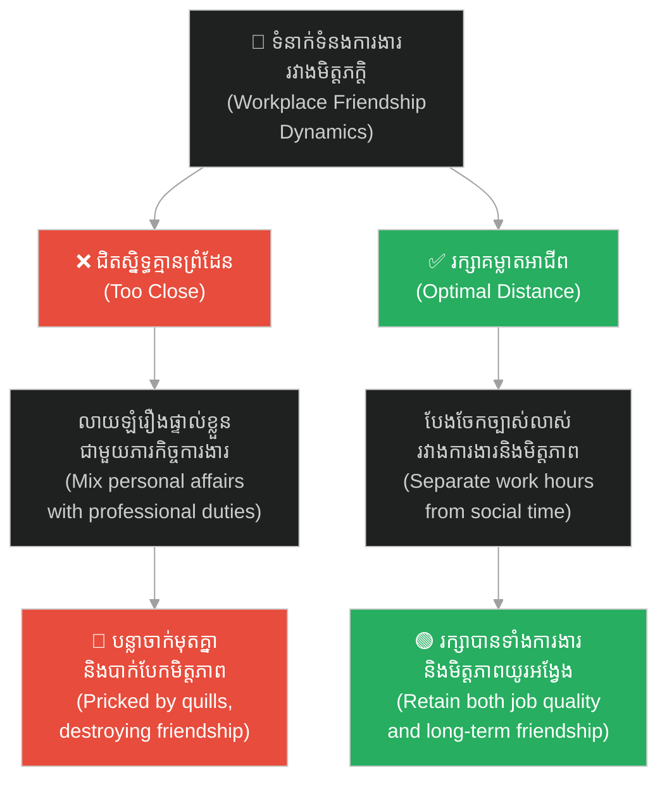
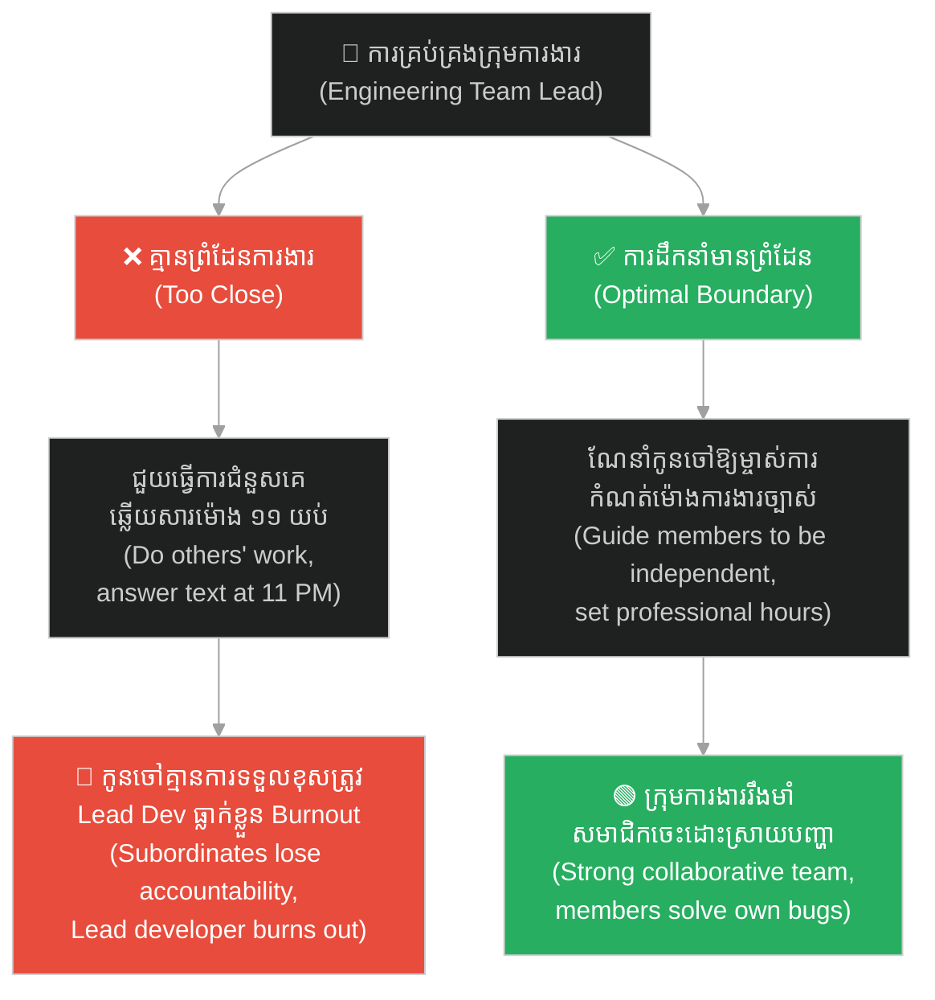
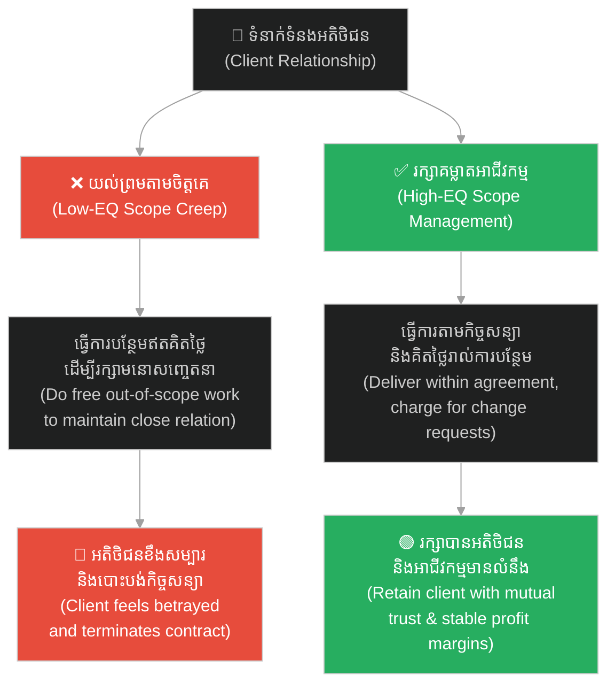
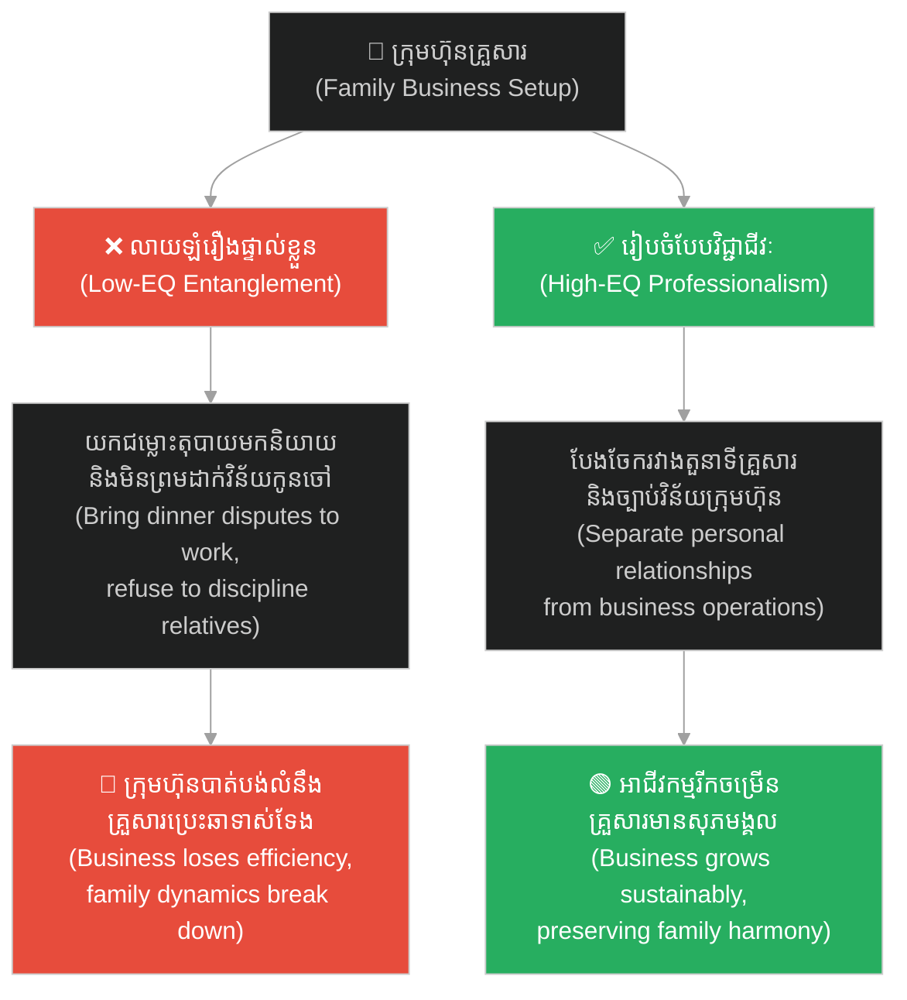
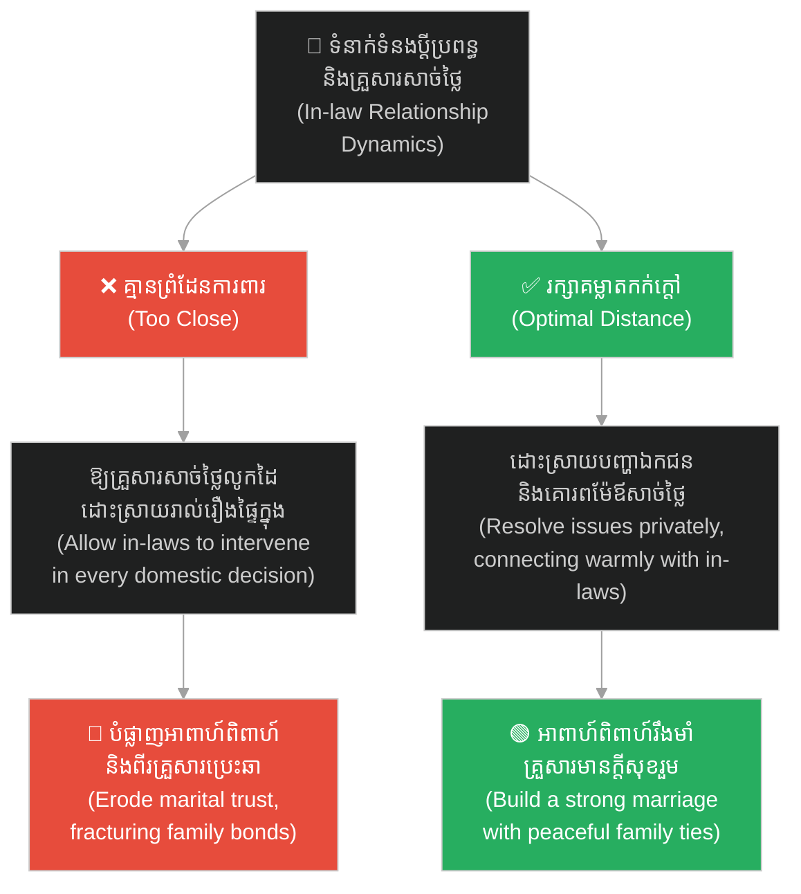

# The Hedgehog Dilemma (បញ្ហាលំបាកនៃសត្វប្រមា)៖ ការរក្សាតុល្យភាពរវាងភាពស្និទ្ធស្នាល និងព្រំដែនទំនាក់ទំនង (The Hedgehog Dilemma: Balancing Closeness and Relationship Boundaries)

**Author:** ichamrong  
**Date:** 2026-06-04  
**Tags:** #hedgehog-dilemma #boundaries #relationship #psychology #mental-models #leadership #team-collaboration  
**Category:** Concepts  
**Read Time:** ~20 min  

---

## 📌 មាតិកា (Table of Contents)
- [អន្ទាក់ផ្លូវចិត្ត (The Trap)](#0)
- [១. បញ្ហា៖ ភាពរងា និងបន្លាមុត (The Issue: Coldness and Quills)](#1)
- [២. ឧទាហរណ៍ជាក់ស្តែងក្នុងពិភពពិត (Real World Examples)](#2)
  - [ឧទាហរណ៍ទី ១ — កម្រិតស្រាល៖ ជម្លោះមិត្តភាពក្នុងក្រុមការងារ (Example 1: The Workspace Friendship Trap)](#2-1)
  - [ឧទាហរណ៍ទី ២ — កម្រិតមធ្យម (បច្ចេកទេស)៖ ការគ្រប់គ្រងគ្មានព្រំដែន (Example 2: Boundary-less Engineering Lead)](#2-2)
  - [ឧទាហរណ៍ទី ៣ — កម្រិតមធ្យម (ធុរកិច្ច)៖ ការប្រាស្រ័យទាក់ទងជាមួយអតិថិជន (Example 3: Client Relationship Management)](#2-3)
  - [ឧទាហរណ៍ទី ៤ — កម្រិតធ្ងន់៖ គ្រួសារធុរកិច្ច និងជម្លោះផលប្រយោជន៍ (Example 4: Family Business Entanglement)](#2-4)
  - [ឧទាហរណ៍ទី ៥ — កម្រិតស្រាល (ទំនាក់ទំនងផ្ទាល់ខ្លួន)៖ ព្រំដែនទំនាក់ទំនងរវាងប្តីប្រពន្ធ និងគ្រួសារសាច់ថ្លៃ (Example 5: In-law Relationship Dynamics)](#2-5)
- [៣. កត្តាជម្រុញ៖ ការភ័យខ្លាចភាពឯកោ និងការចង់បានការយល់ព្រម (The Aggravator: Fear of Loneliness & Need for Approval)](#3)
- [៤. ដំណោះស្រាយទូទៅ (The General Solution)](#4)
- [សេចក្តីសន្និដ្ឋាន (Conclusion)](#5)
- [ឯកសារយោង (References)](#6)
- [Related Posts](#7)

---

## អន្ទាក់ផ្លូវចិត្ត (The Trap)

តើអ្នកធ្លាប់ព្យាយាមកសាងទំនាក់ទំនងជិតស្និទ្ធខ្លាំងជាមួយមិត្តរួមការងារ ឬកូនចៅក្រោមបង្គាប់ ដោយសង្ឃឹមថានឹងបង្កើតបរិយាកាសការងារដូចជា «គ្រួសារតែមួយ» ដែរឬទេ?

Have you ever tried to build an extremely close relationship with coworkers or subordinates, hoping to create a workplace environment that feels like "one family"?

ដំបូងឡើយ អ្វីៗគ្រប់យ៉ាងពិតជាល្អណាស់។ អ្នកទាំងពីរចែករំលែករឿងរ៉ាវផ្ទាល់ខ្លួន ទៅញ៉ាំអាហារ និងដើរលេងជាមួយគ្នាក្រៅម៉ោងការងារ។ ប៉ុន្តែប៉ុន្មានខែក្រោយមក នៅពេលដែលការងាររបស់ពួកគេចាប់ផ្តើមមានកំហុសឆ្គង ឬធ្លាក់ចុះ ហើយអ្នកត្រូវបង្ខំចិត្តធ្វើការស្តីបន្ទោស ឬវាយតម្លៃការងាររបស់ពួកគេយ៉ាងតឹងរ៉ឹង៖

Initially, everything goes exceptionally well. You share personal stories, dine together, and hang out after hours. However, months later, when their performance slips and you are forced to deliver tough feedback or strict evaluations:

* ពួកគេមានអារម្មណ៍ថាអ្នកក្បត់មិត្តភាពរបស់ពួកគេ។
* អ្នកមានអារម្មណ៍ពិបាកចិត្ត និងស្ទាក់ស្ទើរក្នុងការកែតម្រូវការងាររបស់ពួកគេ ព្រោះខ្លាចខូចទំនាក់ទំនងផ្ទាល់ខ្លួន។
* មិត្តភាពជិតស្និទ្ធនោះស្រាប់តែប្រែជាមានជាតិពុល ការអាក់អន់ចិត្ត និងភាពមិនស្រណុកចិត្តរៀងរាល់ពេលជជែកគ្នានៅក្នុងអគារការងារ។

* They feel you betrayed their friendship.
* You hesitate to correct their work, fearing it will damage the relationship.
* That close friendship suddenly morphs into toxicity, resentment, and awkwardness every time you cross paths in the office.

នេះគឺជាសកម្មភាពនៃ **The Hedgehog Dilemma (បញ្ហាលំបាកនៃសត្វប្រមា)**។

This is the Hedgehog Dilemma at work.

ដើម្បីងាយស្រួលតាមដាន នេះជាផែនទីបង្ហាញផ្លូវសម្រាប់អត្ថបទនេះ៖
1. **បញ្ហា (The Issue)** — តើគំនិតនៃបន្លាមុត និងភាពត្រជាក់នៃសត្វប្រមាបង្ហាញពីអ្វីខ្លះ?
2. **ឧទាហរណ៍ជាក់ស្តែង (Real World Examples)** — ឧទាហរណ៍ចំនួន ៥ ពីជីវិតការងារ ទំនាក់ទំនងអតិថិជន និងជីវិតគ្រួសារ។
3. **កត្តាជម្រុញ (The Aggravator)** — ហេតុអ្វីបានជាយើងតែងតែលុបចោលព្រំដែនការពារខ្លួនឯង?
4. **ដំណោះស្រាយទូទៅ (The General Solution)** — របៀបស្វែងរកគម្លាតសុវត្ថិភាពដ៏ល្អប្រសើរ និងភាពកក់ក្តៅអាជីព។

Roadmap for this article:
1. **The Issue** — What do the hedgehogs' quills and the freezing cold represent?
2. **Real World Examples** — Five examples from work life, client relations, and family dynamics.
3. **The Aggravator** — Why do we constantly compromise our boundaries?
4. **The General Solution** — How to find the optimal distance and maintain warm professionalism.

---

## ១. បញ្ហា៖ ភាពរងា និងបន្លាមុត (The Issue: Coldness and Quills)

**Hedgehog Dilemma** (ឬ **Porcupine Dilemma**) គឺជាគំនិតចិត្តសាស្ត្រ និងទស្សនវិជ្ជាដ៏ល្បីល្បាញមួយ ដែលលើកឡើងដំបូងដោយលោក **Arthur Schopenhauer** និងក្រោយមកសម្របសម្រួលដោយលោក **Sigmund Freud**។ វាបង្ហាញពីឧបសគ្គផ្លូវចិត្តរបស់មនុស្សក្នុងការស្វែងរកភាពស្និទ្ធស្នាល៖

The **Hedgehog Dilemma** (or **Porcupine Dilemma**) is a famous psychological and philosophical concept first proposed by **Arthur Schopenhauer** and later adopted by **Sigmund Freud**. It illustrates the human challenge of seeking intimacy:

> **«នៅក្នុងរដូវរងាដ៏ត្រជាក់ខ្លាំង ក្រុមសត្វប្រមា (Hedgehogs) ប្រមូលផ្តុំគ្នាជិតស្និទ្ធដើម្បីកម្តៅគ្នាទៅវិញទៅមក ការពារកុំឱ្យកកស្លាប់។ ប៉ុន្តែនៅពេលពួកវាខិតចូលជិតគ្នាពេក បន្លាដ៏មុតស្រួចនៅលើខ្លួនរបស់ពួកវា (Quills) ក៏ចាប់ផ្តើមមុតចាក់គ្នាទៅវិញទៅមក បង្កការឈឺចាប់ជាខ្លាំង។ ពួកវាក៏បង្ខំចិត្តដើរថយក្រោយចេញឆ្ងាយពីគ្នាវិញដើម្បីកុំឱ្យឈឺចាប់ តែភាពរងាដ៏ត្រជាក់ក៏ចាប់ផ្តើមយាយីពួកវាដដែល។ ពួកវាក៏ត្រូវព្យាយាមរំកិលចុះឡើងម្តងហើយម្តងទៀត រហូតដល់រកឃើញ «គម្លាតដ៏សមស្របមួយ (Optimal Distance)» ដែលពួកគេអាចទទួលបានភាពកក់ក្តៅផង និងចៀសវាងការចាក់មុតពីបន្លាផង។»**
> 
> *"On a cold winter's day, a group of hedgehogs huddled close together for warmth to keep from freezing. But as they drew nearer, their sharp quills began to prick one another, causing pain. Forced apart by discomfort, they scattered, only to shiver in the freezing cold once more. They drifted back and forth, shifting repeatedly, until they discovered an **optimal distance** where they could share warmth without pricking each other."*

និយាយឱ្យសាមញ្ញ៖
* ❌ ការគ្មានព្រំដែន (ចង់ស្និទ្ធស្នាលពេក) = រងការចាក់មុត និងឈឺចាប់។
* ❌ ការដកខ្លួនដាច់ឆ្ងាយ (ចង់សុវត្ថិភាពពេក) = រងា និងឯកោខ្លាំង។
* ✅ ដំណោះស្រាយពិត = ស្វែងរកគម្លាតសុវត្ថិភាពដែលមានទាំងភាពកក់ក្តៅ និងព្រំដែនការពារ។

To put it simply:
* ❌ No boundaries (seeking too much closeness) = pricked and hurt.
* ❌ Complete withdrawal (seeking too much safety) = cold and lonely.
* ✅ Optimal solution = finding the optimal distance that offers both warmth and protective boundaries.

---

## ២. ឧទាហរណ៍ជាក់ស្តែងក្នុងពិភពពិត (Real World Examples)

សូមពិនិត្យមើល **ឧទាហរណ៍ជាក់ស្តែងចំនួន ៥** បង្ហាញពីរបៀបដែលគម្លាតទំនាក់ទំនងមានសារៈសំខាន់ក្នុងការងារ និងជីវិត៖

Here are **five real-world examples** demonstrating the importance of maintaining an appropriate distance in work and life:

---

### ឧទាហរណ៍ទី ១ — កម្រិតស្រាល៖ ជម្លោះមិត្តភាពក្នុងក្រុមការងារ (Example 1: The Workspace Friendship Trap)

**ស្ថានភាព៖** ទំនាស់ការងាររវាងមិត្តភក្តិជិតស្និទ្ធពីរនាក់ដែលធ្វើការងារក្នុងនាយកដ្ឋានតែមួយ។

**Scenario:** Workplace conflict between two close friends working in the same department.

* **សកម្មភាព Low EQ / Bias (ទម្លាប់/លំអៀង)៖** ពួកគេលាយឡំរឿងផ្ទាល់ខ្លួនជាមួយភារកិច្ចការងារ ដោយដឹងរាល់អាថ៌កំបាំងគ្នា និងសហការរហូតគ្មានព្រំដែន។ នៅពេលម្នាក់ឡើងជា Lead និងត្រូវបែងចែកការងារពិបាកៗ ម្នាក់ទៀតមានអារម្មណ៍អន់ចិត្ត និងចោទប្រកាន់ថាគ្មានការយោគយល់មិត្តភាព។ ក្រោយមកទំនាស់កាន់តែធំ ពួកគេឈប់និយាយគ្នា និងឈប់សហការ បង្កើតភាពត្រជាក់ស្រេប ធ្វើឱ្យការងារក្រុមការងាររាំងស្ទះ។
* **Low-EQ/Bias Action:** They blend personal lives with work, sharing every secret without boundaries. When one is promoted to lead and has to assign difficult tasks, the other feels hurt and accuses them of betraying their friendship. As conflict escalates, they stop speaking and collaborating, creating a freezing distance that stalls team productivity.
* **សកម្មភាព High EQ / Correct (ដំណោះស្រាយ)៖** បែងចែកតួនាទីឱ្យច្បាស់លាស់រវាង «តួនាទីអាជីពក្នុងម៉ោងការងារ» និង «មិត្តភាពក្រៅម៉ោងការងារ» ដោយមានការយល់ព្រម និងព្រមព្រៀងគ្នាជាមុន។
* **High-EQ/Correct Action:** Clearly separate "professional roles during work hours" from "personal friendship after hours" through mutual agreement and proactive alignment.
* **លទ្ធផល៖** រក្សាបានទាំងស្ថិរភាពការងារ និងមិត្តភាពល្អយូរអង្វែង។
* **The Result:** Retain both work performance and a healthy, long-term friendship.

---

### ឧទាហរណ៍ទី ២ — កម្រិតមធ្យម (បច្ចេកទេស)៖ ការគ្រប់គ្រងគ្មានព្រំដែន (Example 2: Boundary-less Engineering Lead)

**ស្ថានភាព៖** Lead Developer ចង់ឱ្យសមាជិកក្រុមទាំងអស់ស្រឡាញ់ខ្លួនខ្លាំង ពួកគេក៏ចាប់ផ្តើមលុបចោលរាល់ព្រំដែនការងារ។

**Scenario:** A Lead Developer wants to be liked by everyone on the team, so they remove all professional boundaries.

* **សកម្មភាព Low EQ / Bias (ទម្លាប់/លំអៀង)៖** Lead Dev ជួយធ្វើការងារជំនួសសមាជិក និងអនុញ្ញាតឱ្យផ្ញើសារសួរការងារផ្ទាល់ខ្លួនរហូតដល់ម៉ោង ១១ យប់ ព្រមទាំងយោគយល់ការខកខាន Deadline ជានិច្ច។ ជាលទ្ធផល កូនចៅលែងមានការទទួលខុសត្រូវ រំពឹងឱ្យជួយរាល់បញ្ហាតូចតាច ហើយ Lead Dev ត្រូវធ្លាក់ក្នុងស្ថានភាពបាក់កម្លាំង (Burnout) ធ្ងន់ធ្ងរ ឯផលិតភាពក្រុមទាំងមូលធ្លាក់ចុះ។
* **Low-EQ/Bias Action:** The Lead Dev does work for members, allows them to send work messages as late as 11 PM, and continuously excuses missed deadlines. Consequently, team members lose accountability, relying on the Lead to solve minor issues. The Lead Dev suffers from severe burnout, and overall team productivity drops.
* **សកម្មភាព High EQ / Correct (ដំណោះស្រាយ)៖** ណែនាំកូនចៅឱ្យម្ចាស់ការ និងដោះស្រាយបញ្ហាដោយខ្លួនឯង បង្កើតម៉ោងការងារច្បាស់លាស់ និងគោរពពេលវេលាផ្ទាល់ខ្លួនរបស់គ្នាទៅវិញទៅមក។
* **High-EQ/Correct Action:** Coach team members to be independent and solve problems on their own, establish clear working hours, and respect each other's personal time.
* **លទ្ធផល៖** វិស្វករមានការលូតលាស់ សមត្ថភាពក្រុមរឹងមាំ និង Lead Dev ចៀសវាងបាននូវសម្ពាធការងារហួសកម្រិត។
* **The Result:** Engineers grow, team capability strengthens, and the Lead Dev avoids excessive work pressure.

---

### ឧទាហរណ៍ទី ៣ — កម្រិតមធ្យម (ធុរកិច្ច)៖ ការប្រាស្រ័យទាក់ទងជាមួយអតិថិជន (Example 3: Client Relationship Management)

**ស្ថានភាព៖** ក្រុមហ៊ុនសេវាកម្មចង់កសាងទំនាក់ទំនងជិតស្និទ្ធជាមួយអតិថិជនលំដាប់ VIP ម្នាក់។

**Scenario:** A service agency wants to build a close relationship with a VIP client.

* **សកម្មភាព Low EQ / Bias (ទម្លាប់/លំអៀង)៖** គណនេយ្យករគម្រោង (Account Manager) យល់ព្រមធ្វើការងារបន្ថែមក្រៅកិច្ចសន្យា (Scope Creep) រាប់សិបមុខដោយឥតគិតថ្លៃដើម្បីតែចង់បង្ហាញ «ភាពស្និទ្ធស្នាល និងមនោសញ្ចេតនាល្អ»។ ដល់ចំណុចមួយដែលក្រុមហ៊ុនលែងមានលទ្ធភាពទ្រទ្រង់ការងារឥតគិតថ្លៃនោះបានទៀតហើយ ហើយសុំដកខ្លួន ឬសុំគិតថ្លៃបន្ថែម។ អតិថិជនមានអារម្មណ៍ខឹងសម្បារ និងចោទថាអាត្មានិយម រួចបោះបង់កិច្ចសន្យាចោលទាំងស្រុង។
* **Low-EQ/Bias Action:** The Account Manager accepts dozens of out-of-scope requests (Scope Creep) for free just to maintain "goodwill and closeness." When the agency runs out of capacity to support the free labor and requests additional fees, the client feels offended, accuses them of being selfish, and cancels the contract entirely.
* **សកម្មភាព High EQ / Correct (ដំណោះស្រាយ)៖** ធ្វើការងារឱ្យមានព្រំដែនច្បាស់លាស់តាមកិច្ចសន្យា និងគិតថ្លៃរាល់ការងារបន្ថែម (Scope Management) ប្រកបដោយតម្លាភាព។
* **High-EQ/Correct Action:** Deliver work strictly within contract boundaries and charge transparently for all additional change requests (Scope Management).
* **លទ្ធផល៖** រក្សាបាននូវកម្រិតចំណេញរបស់ក្រុមហ៊ុន ទំនុកចិត្ត និងការគោរពគ្នាទៅវិញទៅមកជាដៃគូអាជីវកម្ម។
* **The Result:** Maintain profit margins, mutual respect, and trust as healthy business partners.

---

### ឧទាហរណ៍ទី ៤ — កម្រិតធ្ងន់៖ គ្រួសារធុរកិច្ច និងជម្លោះផលប្រយោជន៍ (Example 4: Family Business Entanglement)

**ស្ថានភាព៖** ក្រុមហ៊ុនលក្ខណៈគ្រួសារ (Family Business) ដែលមានឪពុកម្តាយ បងប្អូនបង្កើត និងសាច់ញាតិធ្វើការងាររួមគ្នាដោយគ្មានរចនាសម្ព័ន្ធការងារច្បាស់លាស់។

**Scenario:** A family business where parents, siblings, and relatives work together without a clear organizational structure.

* **សកម្មភាព Low EQ / Bias (ទម្លាប់/លំអៀង)៖** សមាជិកលាយឡំរឿងផ្ទាល់ខ្លួនជាមួយការងារក្រុមហ៊ុន ដោយយកជម្លោះតុអាហារពេលល្ងាចរបស់គ្រួសារមកសម្រេចចិត្តការងារបន្ទប់ប្រជុំ និងមិនព្រមដាក់វិន័យសាច់ញាតិដែលខកខានការងារព្រោះតែខ្លាចប៉ះពាល់មនោសញ្ចេតនា។ ជាលទ្ធផល ក្រុមហ៊ុនគ្មានប្រសិទ្ធភាព បាត់បង់លទ្ធភាពប្រកួតប្រជែង សមាជិកឈ្លោះទាស់ទែងគ្នាខ្លាំង និងបំផ្លាញទាំងអាជីវកម្ម និងទំនាក់ទំនងគ្រួសារ។
* **Low-EQ/Bias Action:** Members entangle personal lives with business operations, bringing family dinner arguments into the boardroom and refusing to discipline relatives to avoid hurting family ties. Consequently, the business loses efficiency, competitiveness drops, conflicts worsen, and both the business and family relationships are damaged.
* **សកម្មភាព High EQ / Correct (ដំណោះស្រាយ)៖** បែងចែករចនាសម្ព័ន្ធការងារឱ្យបានច្បាស់លាស់ ដាច់ស្រឡះរវាង «តួនាទីគ្រួសារ» និង «ច្បាប់វិន័យក្រុមហ៊ុន» (Professionalization)។
* **High-EQ/Correct Action:** Establish a clear organizational structure, separating "family roles" from "company discipline" (Professionalization) entirely.
* **លទ្ធផល៖** អាជីវកម្មលូតលាស់ប្រកបដោយចីរភាព និងរក្សាបាននូវភាពសុខដុមរមនាក្នុងគ្រួសារ។
* **The Result:** The business grows sustainably, and family harmony is preserved.

---

### ឧទាហរណ៍ទី ៥ — កម្រិតស្រាល (ទំនាក់ទំនងផ្ទាល់ខ្លួន)៖ ព្រំដែនទំនាក់ទំនងរវាងប្តីប្រពន្ធ និងគ្រួសារសាច់ថ្លៃ (Example 5: In-law Relationship Dynamics)

**ស្ថានភាព៖** ទំនាក់ទំនងប្តីប្រពន្ធថ្មីថ្មោងដែលរស់នៅក្បែរ ឬជាមួយគ្រួសារសាច់ថ្លៃ (In-laws)។

**Scenario:** A newly married couple living close to or with their in-laws.

* **សកម្មភាព Low EQ / Bias (ទម្លាប់/លំអៀង)៖** ប្តីប្រពន្ធចែករំលែករាល់ទំនាស់ រឿងរ៉ាវហិរញ្ញវត្ថុ និងអាថ៌កំបាំងផ្ទាល់ខ្លួនទៅឱ្យឪពុកម្តាយសាច់ថ្លៃដឹងឮទាំងអស់ និងអនុញ្ញាតឱ្យពួកគេលូកដៃចូលរួមសម្រេចចិត្តរាល់រឿងផ្ទៃក្នុងក្នុងផ្ទះ ដើម្បីតែចង់បង្ហាញភាពស្និទ្ធស្នាល។ ជាលទ្ធផល គ្រួសារសាច់ថ្លៃលូកដៃចូលដោះស្រាយរឿងផ្ទៃក្នុង បង្កើតទំនាស់ពីរគ្រួសារ បំផ្លាញទំនុកចិត្តប្តីប្រពន្ធ និងឈានដល់ការបែកបាក់អាពាហ៍ពិពាហ៍។
* **Low-EQ/Bias Action:** The couple shares every conflict, financial detail, and personal secret with in-laws, allowing them to make domestic decisions to show closeness. Consequently, in-laws intervene deeply, causing conflict between the two families, destroying trust between spouses, and leading to marital breakdown.
* **សកម្មភាព High EQ / Correct (ដំណោះស្រាយ)៖** រក្សាភាពជាឯកជន និងភាពម្ចាស់ការរបស់ប្តីប្រពន្ធ ដោះស្រាយរាល់បញ្ហារវាងគ្នាដោយសន្តិវិធីជាឯកជន ប៉ុន្តែនៅតែរក្សាទំនាក់ទំនងល្អ និងការគោរពជាមួយឪពុកម្តាយសាច់ថ្លៃ។
* **High-EQ/Correct Action:** Maintain privacy and independence as a couple. Resolve conflicts privately without involving in-laws, while maintaining a warm, respectful connection with them.
* **លទ្ធផល៖** អាពាហ៍ពិពាហ៍រឹងមាំ គ្មានសម្ពាធពីខាងក្រៅ ហើយគ្រួសារទាំងសងខាងរក្សាបាននូវភាពកក់ក្តៅ និងការគោរពព្រំដែនគ្នាទៅវិញទៅមក។
* **The Result:** The marriage is strong, free from external pressure, and both families connect warmly while respecting boundaries.

---

## ៣. កត្តាជម្រុញ៖ ការភ័យខ្លាចភាពឯកោ និងការចង់បានការយល់ព្រម (The Aggravator: Fear of Loneliness & Need for Approval)

ហេតុអ្វីបានជាយើងតែងតែពិបាកក្នុងការរក្សាព្រំដែនទំនាក់ទំនង?

Why do we struggle to maintain relationship boundaries?

1. **ការភ័យខ្លាចភាពឯកោ (Fear of Exclusion)៖** មនុស្សគឺជាសត្វសង្គម។ យើងភ័យខ្លាចខ្លាំងណាស់ចំពោះភាពឯកោ និងការដកខ្លួនចេញពីក្រុម។ ការភ័យខ្លាចនេះជម្រុញឱ្យយើងព្យាយាម «រំលាយព្រំដែនខ្លួនឯង» ដើម្បីចូលទៅជិតស្និទ្ធជាមួយអ្នកដទៃឱ្យបានលឿនបំផុត។
2. **Fear of Exclusion:** Humans are social creatures. We deeply fear loneliness and exclusion. This fear drives us to dissolve our personal boundaries to fit in as quickly as possible.

2. **ការភ័យខ្លាចជម្លោះ (Conflict Avoidance)៖** ការបង្កើតព្រំដែន (និយាយពាក្យថា «ទេ») ជារឿយៗបង្កើតឱ្យមានការមិនពេញចិត្ត ឬការខកចិត្តបណ្តោះអាសន្នពីអ្នកដទៃ។ ដើម្បីចៀសវាងភាពមិនស្រណុកចិត្តទាំងនេះ យើងសុខចិត្តអនុញ្ញាតឱ្យគេចាក់មុតនឹងបន្លាម្តងហើយម្តងទៀត។
3. **Conflict Avoidance:** Setting boundaries (saying "no") often creates temporary discomfort or disappointment for others. To avoid this awkwardness, we let ourselves get pricked by quills repeatedly.

---

## ៤. ដំណោះស្រាយទូទៅ (The General Solution)

តើយើងអាចអនុវត្តមេរៀនរបស់សត្វប្រមាដើម្បីកសាងទំនាក់ទំនងការងារដែលមានសុខភាពល្អយ៉ាងដូចម្តេច?

How can we apply the hedgehogs' lesson to build healthy professional relationships?

### ស្វែងរកគម្លាតសុវត្ថិភាពដ៏ល្អប្រសើរ (The Optimal Distance)

ត្រូវទទួលស្គាល់ថា គម្លាតសុវត្ថិភាពមិនមែនជាការ «ស្អប់ខ្ពើម ឬព្រងើយកន្តើយ» នោះឡើយ ប៉ុន្តែវាជាសកម្មភាពនៃការផ្តល់ **សេចក្តីថ្លៃថ្នូរ និងសេរីភាពផ្ទាល់ខ្លួន** ឱ្យគ្នាទៅវិញទៅមក៖
* នៅក្នុងការងារ៖ ស្និទ្ធស្នាលគ្រប់គ្រាន់ដើម្បីយល់ចិត្ត និងសហការគ្នាបានល្អ ប៉ុន្តែរក្សាគម្លាតគ្រប់គ្រាន់ដើម្បីអាចធ្វើការសម្រេចចិត្តប្រកបដោយវិជ្ជាជីវៈ និងតម្លាភាព។

Recognize that optimal distance is not coldness or avoidance, but rather the act of offering mutual respect, dignity, and personal freedom:
* At work: Remain close enough to empathize and cooperate, yet distant enough to make professional, unbiased decisions.

### បង្កើត និងគោរពព្រំដែនច្បាស់លាស់ (Define Clear Boundaries)

កុំរង់ចាំរហូតដល់មានទំនាស់ទើបបង្កើតព្រំដែន។ ត្រូវនិយាយគ្នាឱ្យច្បាស់តាំងពីថ្ងៃដំបូង៖
* *«យើងជាមិត្តភក្តិល្អនឹងគ្នា ប៉ុន្តែនៅក្នុងម៉ោងការងារ និងចំពោះរាល់គម្រោង យើងត្រូវអនុវត្តតាមច្បាប់ការងារ និង Metric របស់ក្រុមហ៊ុនជាធំ។ នេះគឺជាការការពារមិត្តភាពរបស់យើងកុំឱ្យខូចខាតនាពេលអនាគត។»*

Do not wait for conflict to arise. Communicate boundaries from day one:
* *"We are good friends, but during work hours and on projects, we must abide by team rules and metrics. This is to protect our friendship from any future friction."*

### ភាពកក់ក្តៅប្រកបដោយវិជ្ជាជីវៈ (Warm Professionalism)

ចៀសវាងភាពត្រជាក់ស្រេប (Coldness) ដោយការអនុវត្តការស្តាប់ដោយការយល់ចិត្ត (Active Listening) គាំទ្រ និងកោតសរសើរការងារសមាជិកក្រុម។ ប៉ុន្តែត្រូវទប់ស្កាត់បន្លាមុតដោយរក្សាភាពហ្មត់ចត់ ការគោរពច្បាប់វិន័យ និងការវាយតម្លៃដោយស្មើភាព។

Avoid coldness by practicing active listening, supporting, and appreciating team members. Prevent quill pricks by maintaining rigor, respecting rules, and evaluating equitably.

---

## 🐇 ធ្លាក់ចូលក្នុងរន្ធទន្សាយ (Enter the Rabbit Hole)

ដើម្បីស្វែងយល់កាន់តែស៊ីជម្រៅអំពីការកសាងគម្លាតសុវត្ថិភាព និងព្រំដែនការពារខ្លួនតាមរយៈរឿងព្រេងសត្វប្រមាពីរនាក់គឺ សូកូ និង គីគី នៅក្នុងរដូវរងា សូមចាប់ផ្តើមដំណើររុករករបស់អ្នកដោយចុចលើតំណភ្ជាប់ខាងក្រោម៖

To delve deeper into establishing optimal distance and protective boundaries through the parable of the two hedgehogs Soko and Kiki during a cold winter, begin your journey by clicking below:

* 🚀 **[ចាប់ផ្តើមដំណើររុករក (Start the Journey) ➔ The Hedgehog Dilemma (បញ្ហាលំបាកនៃសត្វប្រមា)](../parables/08-the-hedgehog-dilemma.md)**

---

## សេចក្តីសន្និដ្ឋាន (Conclusion)

> **«ព្រំដែនមិនមែនដើម្បីដកខ្លួនចេញពីគេទេ គឺដើម្បីរក្សាខ្លួនយើងឱ្យនៅល្អជាមួយគេជានិរន្តរ៍។»**  
> 
> **“Boundaries are not to shut others out; they are to keep ourselves healthy so we can stay close to them forever.”**  

Hedgehog Dilemma រំលឹកយើងថា ទំនាក់ទំនងដែលរឹងមាំ និងយូរអង្វែងបំផុត មិនមែនជាទំនាក់ទំនងដែលរលាយចូលគ្នាជាតែមួយគ្មានព្រំដែននោះឡើយ។ ប៉ុន្តែវាគឺជាទំនាក់ទំនងដែលមនុស្សពីរនាក់ អាចរស់នៅក្បែរគ្នា ផ្តល់ភាពកក់ក្តៅ និងការគាំទ្រឱ្យគ្នាទៅវិញទៅមក ដោយគោរពនូវព្រំដែន និងភាពជាម្ចាស់ការរបស់រៀងៗខ្លួនជារៀងរហូត។

The Hedgehog Dilemma reminds us that the strongest, most enduring relationships are not those where boundaries dissolve. Rather, they are those where two individuals live close enough to share warmth and support, while respecting each other's boundaries and autonomy forever.

---

## ឯកសារយោង (References)

* **Schopenhauer, A.** — *Parerga und Paralipomena* (1851)។ ទស្សនវិជ្ជាដំបូងបង្អស់ដែលបានបង្កើតប្រស្នាសត្វប្រមា (Porcupine Parable)។
* **Schopenhauer, A.** — *Parerga und Paralipomena* (1851). The original philosophical essays containing the famous porcupine parable.
* **Freud, S.** — *Group Psychology and the Analysis of the Ego* (1921)។ ការវិភាគចិត្តសាស្ត្រស្នូលស្តីពីឧបសគ្គនៃការស្វែងរកទំនាក់ទំនងជិតស្និទ្ធរបស់មនុស្ស។
* **Freud, S.** — *Group Psychology and the Analysis of the Ego* (1921). The psychological analysis of human intimacy and relationship challenges.
* **Cloud, H. & Townsend, J.** — *Boundaries: When to Say Yes, How to Say No* (1992)។ ការណែនាំស្តីពីរបៀបបង្កើតព្រំដែនជីវិតផ្ទាល់ខ្លួន និងទំនាក់ទំនង។
* **Cloud, H. & Townsend, J.** — *Boundaries: When to Say Yes, How to Say No* (1992). The comprehensive guide on setting healthy personal and relationship boundaries.

---

## Related Posts

* **[05-relative-deprivation-effect.md](./05-relative-deprivation-effect.md)** — Relative Deprivation Effect (ឥទ្ធិពលនៃការដកហូតដោយការប្រៀបធៀប)៖ ការឈឺចាប់នៃការប្រៀបធៀបដែលមិនស្មើភាព។
* **[The Hedgehog Dilemma (បញ្ហាលំបាកនៃសត្វប្រមា)](../parables/08-the-hedgehog-dilemma.md)** — រឿងព្រេងក្រិកបុរាណរវាងសត្វប្រមាពីរនាក់គឺ សូកូ និង គីគី នៅក្នុងរដូវរងា។
