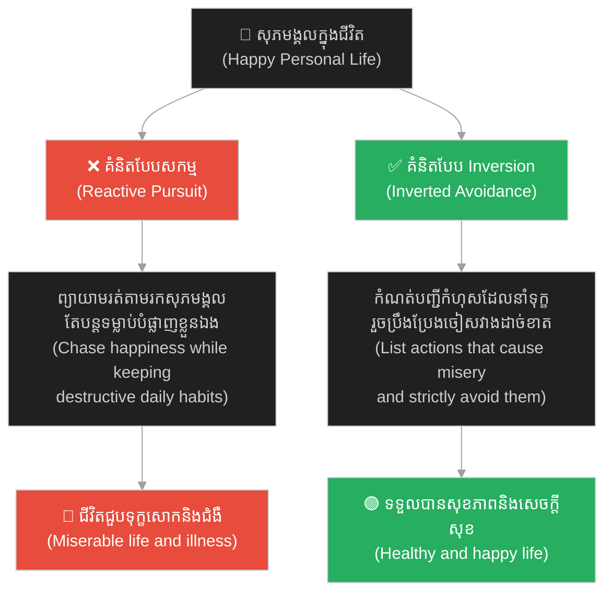
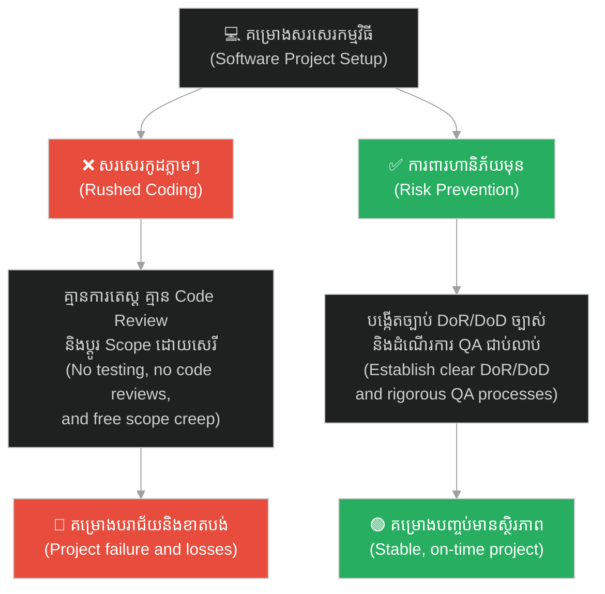
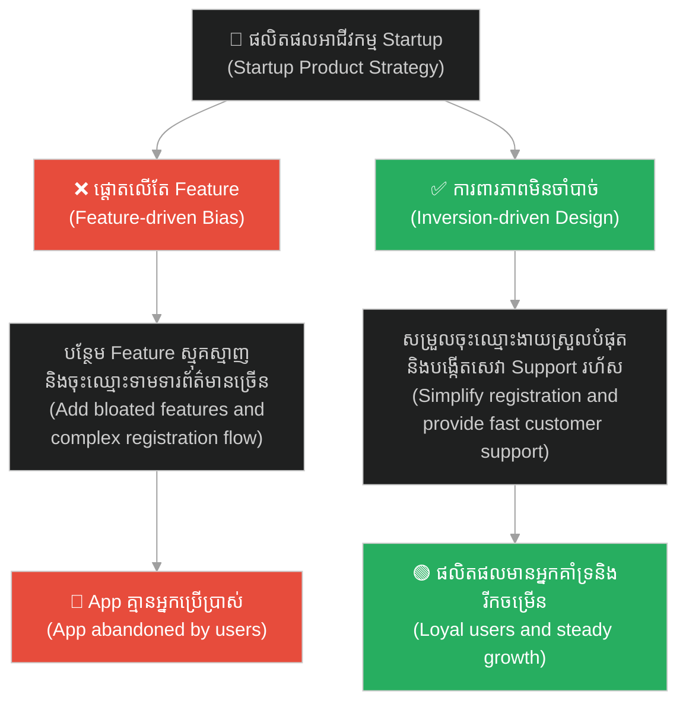
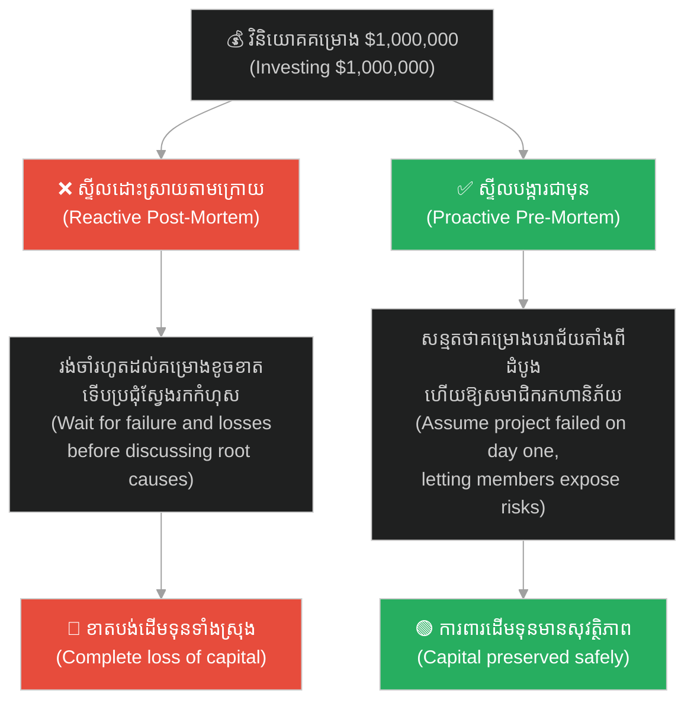
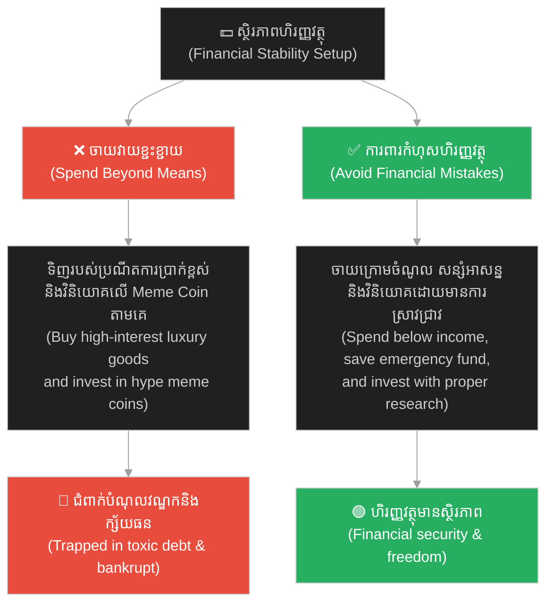

# The Principle of Inversion (គោលការណ៍ត្រឡប់បញ្ច្រាស)៖ ការធានាភាពជោគជ័យដោយការកម្ទេចរាល់ភាពបរាជ័យ (The Principle of Inversion: Ensuring Success by Eliminating Failure)

**Author:** ichamrong  
**Date:** 2026-06-04  
**Tags:** #inversion-principle #mental-models #decision-making #charlie-munger #pre-mortem #problem-solving  
**Category:** Concepts  
**Read Time:** ~20 min  

---

## 📌 មាតិកា (Table of Contents)
- [អន្ទាក់ផ្លូវចិត្ត (The Trap)](#0)
- [១. បញ្ហា៖ គិតបញ្ច្រាសជានិច្ច (The Issue: Always Invert)](#1)
- [២. ឧទាហរណ៍ជាក់ស្តែងក្នុងពិភពពិត (Real World Examples)](#2)
  - [ឧទាហរណ៍ទី ១ — កម្រិតស្រាល៖ របៀបរៀបចំជីវិតឱ្យមានទុក្ខសោក (Example 1: How to Ruin Your Personal Life)](#2-1)
  - [ឧទាហរណ៍ទី ២ — កម្រិតមធ្យម (បច្ចេកទេស)៖ របៀបធ្វើឱ្យគម្រោង IT បរាជ័យ (Example 2: How to Build a Failed Software Project)](#2-2)
  - [ឧទាហរណ៍ទី ៣ — កម្រិតមធ្យម (ធុរកិច្ច)៖ របៀបកម្ទេចផលិតផលអាជីវកម្ម (Example 3: How to Kill Your Startup Product)](#2-3)
  - [ឧទាហរណ៍ទី ៤ — កម្រិតធ្ងន់៖ ការធ្វើវិភាគមុនស្លាប់ (Example 4: The Pre-Mortem Exercise)](#2-4)
  - [ឧទាហរណ៍ទី ៥ — កម្រិតមធ្យម (ការគ្រប់គ្រងហិរញ្ញវត្ថុផ្ទាល់ខ្លួន)៖ របៀបធ្វើឱ្យខ្លួនឯងធ្លាក់ខ្លួនក្រីក្រ និងជំពាក់បំណុលគេ (Example 5: How to Bankrupt Yourself)](#2-5)
- [៣. កត្តាជម្រុញ៖ លំអៀងនៃការចង់បាន និងការមើលរំលងការដកចេញ (The Aggravator: Optimism Bias & Subtraction Bias)](#3)
- [៤. ដំណោះស្រាយទូទៅ (The General Solution)](#4)
- [សេចក្តីសន្និដ្ឋាន (Conclusion)](#5)
- [ឯកសារយោង (References)](#6)
- [Related Posts](#7)

---

<a id="0"></a>
## អន្ទាក់ផ្លូវចិត្ត (The Trap)

ស្រមៃថាអ្នកចង់ចាប់ផ្តើមគម្រោងសរសេរកម្មវិធី (Software Project) ថ្មីមួយឱ្យជោគជ័យ។ កិច្ចប្រជុំដំបូងត្រូវបានរៀបចំឡើងយ៉ាងរំភើប។ គ្រប់គ្នាចោទសួរសំណួរធម្មតា៖ *«តើយើងត្រូវធ្វើអ្វីខ្លះដើម្បីឱ្យគម្រោងនេះជោគជ័យខ្លាំង? តើត្រូវបន្ថែម Feature អស្ចារ្យអ្វីខ្លះ? តើត្រូវរៀបចំ Marketing ដ៏អស្ចារ្យបែបណា?»*

Imagine you want to start a new software project successfully. The kickoff meeting is held with high excitement. Everyone asks the standard questions: *"What must we do to make this project a massive success? What amazing features should we add? What grand marketing strategy should we implement?"*

សមាជិកគ្រប់គ្នាបញ្ចេញគំនិតវិជ្ជមានរាប់សិបមុខ។ ផែនការដ៏ធំមួយត្រូវបានបង្កើតឡើងដោយពោរពេញទៅដោយការសន្មត់ដ៏ល្អឥតខ្ចោះ។

Everyone pitches dozens of positive ideas. A grand plan is built, loaded with flawless assumptions.

ប៉ុន្តែ ៦ ខែក្រោយមក គម្រោងនោះស្រាប់តែដួលរលំទាំងស្រុង៖
* កូដមាន Bug ច្រើន ព្រោះតែប្រញាប់ប្រញាល់ Deploy លឿនពេក។
* សមាជិកក្រុមឈ្លោះគ្នា ព្រោះគ្មានការបែងចែកតួនាទីច្បាស់លាស់។
* ថវិកាគម្រោងបានអស់រលីង ព្រោះតែចំណាយលើសកម្រិត។

Yet, six months later, the project completely collapses:
* The code is riddled with bugs due to rushed deployment.
* Team members are in conflict because roles were never clearly defined.
* The project budget is exhausted due to uncontrolled spending.

ហេតុអ្វីបានជារឿងនេះកើតឡើង ទោះបីជាយើងមានផែនការជោគជ័យដ៏ល្អក៏ដោយ? ពីព្រោះខួរក្បាលរបស់យើងគិតតែលើ **«ផ្លូវឆ្ពោះទៅរកជោគជ័យ»** ហើយមើលរំលងទាំងស្រុងនូវ **«ការការពាររាល់ផ្លូវដែលនាំទៅរកបរាជ័យ»**។

Why did this happen despite having a solid plan for success? Because our minds focus solely on the "path to success" while completely ignoring the "prevention of all paths to failure."

ដើម្បីចៀសវាងគ្រោះមហន្តរាយនេះ យើងត្រូវតែអនុវត្ត **The Principle of Inversion (គោលការណ៍ត្រឡប់បញ្ច្រាស)**។

To avoid this disaster, we must practice the **Principle of Inversion**.

ដើម្បីងាយស្រួលតាមដាន នេះជាផែនទីបង្ហាញផ្លូវសម្រាប់អត្ថបទនេះ៖
1. **បញ្ហា (The Issue)** — តើគំនិតនៃការគិតបញ្ច្រាសជានិច្ចបង្ហាញពីអ្វីខ្លះ?
2. **ឧទាហរណ៍ជាក់ស្តែង (Real World Examples)** — ឧទាហរណ៍ចំនួន ៥ ពីជីវិតផ្ទាល់ខ្លួន ការងារបច្ចេកវិទ្យា ធុរកិច្ច ការវិភាគហានិភ័យ និងការគ្រប់គ្រងហិរញ្ញវត្ថុ។
3. **កត្តាជម្រុញ (The Aggravator)** — ហេតុអ្វីបានជាយើងតែងតែមើលរំលងការគិតបញ្ច្រាស?
4. **ដំណោះស្រាយទូទៅ (The General Solution)** — របៀបស្វែងរក និងកម្ទេចរាល់ច្រកផ្លូវនៃភាពបរាជ័យជាមុន។

Roadmap for this article:
1. **The Issue** — What does "always invert" represent?
2. **Real World Examples** — Five examples across personal life, software projects, startup products, risk analysis, and financial management.
3. **The Aggravator** — Why do we consistently ignore this model?
4. **The General Solution** — How to identify and eliminate failure paths beforehand.

---

<a id="1"></a>
## ១. បញ្ហា៖ គិតបញ្ច្រាសជានិច្ច (The Issue: Always Invert)

**Principle of Inversion** គឺជាគំរូផ្នត់គំនិត (Mental Model) ដ៏មានអំណាចបំផុតមួយ ដែលមានប្រភពដើមពីអ្នកគណិតវិទ្យាអាឡឺម៉ង់លោក **Carl Jacobi** ដែលចូលចិត្តនិយាយពាក្យស្លោកថា៖ *«Man muss immer umkehren»* (**គិតបញ្ច្រាសជានិច្ច - Always Invert**)។ ក្រោយមក គោលការណ៍នេះត្រូវបានផ្សព្វផ្សាយយ៉ាងខ្លាំងដោយលោក **Charlie Munger** (ដៃគូអាជីវកម្មរបស់ Warren Buffett)៖

The **Principle of Inversion** is a powerful mental model originating from the German mathematician **Carl Jacobi**, who popularized the maxim: *"Man muss immer umkehren"* (**"Always Invert"**). Later, this principle was heavily advocated by **Charlie Munger** (Warren Buffett's business partner):

> **«ប្រសិនបើអ្នកចង់ជួយកសិករម្នាក់ឱ្យទទួលបានជោគជ័យ កុំចំណាយពេលគិតពីរបៀបជួយពួកគេ។ ផ្ទុយទៅវិញ ត្រូវចំណាយពេលគិតពីរឿងដែលធ្វើឱ្យកសិករម្នាក់ត្រូវក្ស័យធន និងបរាជ័យ ហើយត្រូវប្រឹងប្រែងចៀសវាងរឿងទាំងនោះឱ្យបាន Pres. ប្រសិនបើខ្ញុំដឹងថាខ្ញុំនឹងស្លាប់នៅត្រង់កន្លែងណា ខ្ញុំនឹងមិនទៅជាន់ទីនោះដាច់ខាតជារៀងរហូត។»**
> 
> *"If you want to help a farmer succeed, don't spend time thinking about how to help them. Instead, spend time thinking about what causes a farmer to go bankrupt and fail, and try your best to avoid those things. If I knew where I was going to die, I would never go there."*

និយាយឱ្យសាមញ្ញ៖
* ❌ កុំសួរថា៖ *«តើខ្ញុំត្រូវធ្វើដូចម្តេចដើម្បីឱ្យជោគជ័យ?»*
* ✅ ត្រូវសួរថា៖ ***«តើខ្ញុំត្រូវធ្វើដូចម្តេចទើបប្រាកដជាជួបបរាជ័យធ្ងន់ធ្ងរ? ហើយតើខ្ញុំត្រូវការពារ និងចៀសវាងវាដោយរបៀបណា?»***

To put it simply:
* ❌ Do not ask: *"How do I achieve success?"*
* ✅ Instead, ask: *"How do I ensure absolute failure? And how do I systematically prevent and avoid it?"*

```
❌ វិធីគិតធម្មតា៖ "គំនិតល្អៗ -> ផែនការជោគជ័យ -> ជួបឧបសគ្គដែលមិនបានរំពឹងទុក -> បរាជ័យ"
❌ Standard Thinking: "Good ideas -> Success plan -> Unexpected obstacles -> Failure"

✅ វិធីគិតបញ្ច្រាស៖ "គិតរកផ្លូវបរាជ័យទាំងអស់ -> កម្ទេច/ការពារផ្លូវទាំងនោះជាមុន -> ជោគជ័យដោយស្វ័យប្រវត្ត"
✅ Inverted Thinking: "Identify all failure paths -> Destroy/prevent those paths first -> Automatic success"
```

---

<a id="2"></a>
## ២. ឧទាហរណ៍ជាក់ស្តែងក្នុងពិភពពិត (Real World Examples)

សូមពិនិត្យមើល **ឧទាហរណ៍ជាក់ស្តែងចំនួន ៥** បង្ហាញពីអំណាចនៃការគិតបញ្ច្រាស៖

Here are **five real-world examples** demonstrating the power of inverted thinking:

---

<a id="2-1"></a>
### ឧទាហរណ៍ទី ១ — កម្រិតស្រាល៖ របៀបរៀបចំជីវិតឱ្យមានទុក្ខសោក (Example 1: How to Ruin Your Personal Life)

**ស្ថានភាព៖** អ្នកចង់មានជីវិតរស់នៅប្រចាំថ្ងៃប្រកបដោយសុភមង្គល និងសុខភាពល្អ។

**Scenario:** You want to live a happy, healthy daily life.

* **គំនិតបញ្ច្រាស (Inversion)៖** សួរខ្លួនឯងថា *«តើខ្ញុំត្រូវរស់នៅបែបណាដើម្បីឱ្យជីវិតខ្ញុំធ្លាក់ក្នុងទុក្ខសោក និងជំងឺរ៉ាំរ៉ៃលឿនបំផុត?»*
* **Inversion Question:** Ask yourself: *"How should I live to guarantee my life becomes miserable and plagued by chronic illness as quickly as possible?"*
* **បញ្ជីបរាជ័យ (The Target List)៖**
  1. គេងមិនឱ្យគ្រប់គ្រាន់ ចូលគេងម៉ោង ២ ឬ ៣ ភ្លឺរាល់យប់។
  2. ផឹកស្រា និងញ៉ាំអាហារផ្អែម ឬខ្លាញ់កប់ពពកជារៀងរាល់ថ្ងៃ។
  3. អង្គុយលេងទូរស័ព្ទពេញមួយថ្ងៃ មិនព្រមធ្វើលំហាត់ប្រាណសោះ។
  4. រក្សាគំនុំ និងខឹងសម្បារនឹងមនុស្សជុំវិញខ្លួនឥតឈប់ឈរ។
* **The Failure List:**
  1. Sleep deprivation—going to bed at 2 AM or 3 AM every night.
  2. Alcohol consumption and eating high-sugar or greasy foods daily.
  3. Lead a sedentary lifestyle, staring at screens all day without exercise.
  4. Harbor grudges and maintain constant anger toward people.
* **សកម្មភាពពិត៖** ពិនិត្យមើលបញ្ជីខាងលើ ហើយប្រឹងប្រែង**ចៀសវាងការធ្វើរឿងទាំងនោះឱ្យបានដាច់ខាត**។ ជីវិតដែលមានសុខភាពល្អ និងសុភមង្គលនឹងកើតឡើងដោយស្វ័យប្រវត្ត។
* **The Correct Action:** Review the list above and make absolute efforts to **avoid doing these things**. A healthy, happy life will naturally follow.



---

<a id="2-2"></a>
### ឧទហរណ៍ទី ២ — កម្រិតមធ្យម (បច្ចេកទេស)៖ របៀបធ្វើឱ្យគម្រោង IT បរាជ័យ (Example 2: How to Build a Failed Software Project)

**ស្ថានភាព៖** ក្រុមការងារត្រៀមអភិវឌ្ឍប្រព័ន្ធ Mobile App ថ្មីមួយសម្រាប់អតិថិជន។

**Scenario:** A team is preparing to develop a new mobile application for a client.

* **គំនិតបញ្ច្រាស (Inversion)៖** *«តើយើងត្រូវធ្វើរបៀបណាខ្លះ ដើម្បីឱ្យគម្រោងនេះត្រូវខូចខាត យឺតយ៉ាវ និងខាតបង់លុយទាំងស្រុង?»*
* **Inversion Question:** *"How can we ensure this project is delivered late, over budget, and completely buggy?"*
* **បញ្ជីកំហុស IT (The IT Failure List)៖**
  1. ឈប់និយាយ ឬសួរនាំជាមួយអតិថិជន និង User ពិតប្រាកដចោលទាំងអស់។
  2. សរសេរកូដភ្លាមៗដោយគ្មានការរៀបចំ Architecture និងគ្មានការធ្វើ Code Review ឡើយ។
  3. ឈប់តេស្តប្រព័ន្ធ (No QA) រហូតដល់ថ្ងៃចុងក្រោយទើបបាញ់ឡើង Production។
  4. អនុញ្ញាតឱ្យសមាជិកផ្លាស់ប្តូរ Scope គម្រោង mid-sprint ដោយសេរីគ្មានការត្រួតពិនិត្យ។
* **The Failure List:**
  1. Never talk to the client or end-users.
  2. Start coding immediately with no architecture design and zero code reviews.
  3. Avoid testing (no QA) until the day before launching to production.
  4. Let members change project scope mid-sprint freely without tracking.
* **សកម្មភាពការពារ៖** បង្កើតវិន័យការងារយ៉ាងម៉ត់ចត់៖ ត្រូវមាន DoR/DoD ច្បាស់លាស់, ត្រូវធ្វើ Code Review រាល់ថ្ងៃ, ត្រូវមាន QA តេស្តរាល់ Feature, និងបង្កើតដំណើរការគ្រប់គ្រង Change Request យ៉ាងហ្មត់ចត់។
* **The Correct Action:** Establish rigorous work discipline: enforce clear DoR/DoD, conduct daily code reviews, ensure QA tests every feature, and implement a strict change request management process.



---

<a id="2-3"></a>
### ឧទាហរណ៍ទី ៣ — កម្រិតមធ្យម (ធុរកិច្ច)៖ របៀបកម្ទេចផលិតផលអាជីវកម្ម (Example 3: How to Kill Your Startup Product)

**ស្ថានភាព៖** Startup ចង់កសាង App មួយដើម្បីវាយលុកទីផ្សារ។

**Scenario:** A startup wants to build an app to disrupt the market.

* **គំនិតបញ្ច្រាស (Inversion)៖** *«តើធ្វើយង់ណាឱ្យ App របស់យើងគ្មានអ្នកប្រើប្រាស់ និងក្ស័យធនលឿនបំផុត?»*
* **Inversion Question:** *"How can we ensure our app gets zero users and goes bankrupt as fast as possible?"*
* **បញ្ជីកំហុសអាជីវកម្ម៖**
  1. បង្កើត Feature ដែលយើងស្រឡាញ់ម្នាក់ឯង ដោយមិនបាច់ខ្វល់ពីតម្រូវការទីផ្សារពិតប្រាកដ។
  2. ធ្វើឱ្យលំហូរចុះឈ្មោះ (Sign-up flow) មានភាពស្មុគស្មាញ និងទាមទារព័ត៌មានច្រើនកប់ពពក។
  3. មិនបាច់ផ្តល់សេវាគាំទ្រអតិថិជន (Customer Support) ឡើយ ពេលពួកគេសួរ ត្រូវព្រងើយកន្តើយ។
* **The Failure List:**
  1. Build complex features we love, ignoring actual market demand.
  2. Make the registration process complicated, requiring endless personal fields.
  3. Ignore customer support queries completely, leaving users in the dark.
* **សកម្មភាព៖** រៀបចំលំហូរ Sign-up ឱ្យសាមញ្ញបំផុតក្នុងរយៈពេល ៣ វិនាទី, ដំណើរការទិន្នន័យស្រាវជ្រាវទីផ្សារជានិច្ច និងបង្កើតក្រុម Support ដែលឆ្លើយតបលឿនបំផុត។
* **The Correct Action:** Streamline the registration flow to take under 3 seconds, validate market demand with user research, and build a highly responsive customer support channel.



---

<a id="2-4"></a>
### ឧទាហរណ៍ទី ៤ — កម្រិតធ្ងន់៖ ការធ្វើវិភាគមុនស្លាប់ (Example 4: The Pre-Mortem Exercise)

**ស្ថានភាព៖** ក្រុមហ៊ុនសហគ្រាសកំពុងត្រៀមបោះទុនវិនិយោគទឹកប្រាក់ $1,000,000 ទៅលើគម្រោងថ្មីមួយ។

**Scenario:** An enterprise is preparing to invest $1,000,000 in a major new initiative.

* **វិធីសាស្ត្រគិតធម្មតា (Post-Mortem)៖** រង់ចាំរហូតដល់គម្រោងបរាជ័យ និងខាតបង់លុយអស់ ទើបហៅសមាជិកប្រជុំគ្នាដេញដោលរក Root Cause នៃភាពបរាជ័យ។ (នេះហៅថាការធ្វើកោសល្យវិច័យសាកសព - យឺតពេលហើយ)។
* **Post-Mortem Method:** Wait until the project fails and loses all capital, then gather the team to debrief the root cause. (This is conducting an autopsy on a corpse—too late).
* **វិធីសាស្ត្រគិតបញ្ច្រាស (Pre-Mortem)៖** មុនពេលបោះទុន សមាជិកទាំងអស់ត្រូវអង្គុយជុំគ្នា ហើយប្រធានប្រជុំប្រកាសថា៖ *«សូមស្រមៃថាឥឡូវនេះយើងស្ថិតនៅក្នុងពេលអនាគត ៥ ឆ្នាំក្រោយ។ គម្រោងតម្លៃ ១ លានដុល្លាររបស់យើងបានដួលរលំ និងបរាជ័យទាំងស្រុង។ ឥឡូវនេះ ខ្ញុំសុំឱ្យអ្នកម្នាក់ៗសរសេររឿងរ៉ាវប្រវត្តិសាស្ត្រមួយ ទាក់ទងនឹង មូលហេតុអ្វីខ្លះដែលធ្វើឱ្យវាបរាជ័យបែបនេះ ឱ្យបានលម្អិតបំផុត។»*
* **Pre-Mortem Method:** Before investing, gather the stakeholders. The facilitator declares: *"Imagine we are 5 years in the future. Our million-dollar project has collapsed in complete disaster. I want everyone to write a detailed history of exactly how and why it failed."*
* **លទ្ធផល៖** សមាជិកទាំងអស់លែងមានការភ័យខ្លាចក្នុងការនិយាយពី «ចំណុចខ្សោយ ឬបញ្ហានយោបាយផ្ទៃក្នុង» ទៀតហើយ។ ពួកគេនឹងសរសេរការពិតដ៏គួរឱ្យខ្លាចជាច្រើនចេញមក ដែលជួយឱ្យថ្នាក់ដឹកនាំអាចកែសម្រួលយុទ្ធសាស្ត្រ និងបិទរាល់ប្រហោងធ្លាយគ្រោះថ្នាក់ជាមុន។
* **The Result:** The team is liberated from the pressure to be overly optimistic. They will surface uncomfortable truths, politics, and hidden risks, allowing leadership to seal vulnerabilities beforehand.



---

<a id="2-5"></a>
### ឧទាហរណ៍ទី ៥ — កម្រិតមធ្យម (ការគ្រប់គ្រងហិរញ្ញវត្ថុផ្ទាល់ខ្លួន)៖ របៀបធ្វើឱ្យខ្លួនឯងធ្លាក់ខ្លួនក្រីក្រ និងជំពាក់បំណុលគេ (Example 5: How to Bankrupt Yourself)

**ស្ថានភាព៖** វិភាក្សាពីការគ្រប់គ្រងហិរញ្ញវត្ថុផ្ទាល់ខ្លួន ដើម្បីធានាបាននូវស្ថិរភាព និងសេរីភាពហិរញ្ញវត្ថុ។

**Scenario:** Managing personal finance to secure long-term stability and financial freedom.

* **គំនិតបញ្ច្រាស (Financial Inversion)៖** សួរខ្លួនឯងថា *«តើខ្ញុំត្រូវធ្វើយ៉ាងណា ដើម្បីឱ្យខ្លួនឯងធ្លាក់ខ្លួនក្រីក្រ ជំពាក់បំណុលវណ្ឌក និងក្ស័យធនហិរញ្ញវត្ថុលឿនបំផុត?»*
* **Financial Inversion:** Ask yourself: *"How can I guarantee I fall into poverty, get trapped in massive debt, and bankrupt myself as quickly as possible?"*
* **បញ្ជីកំហុសហិរញ្ញវត្ថុ៖**
  1. ចាយវាយខ្ជះខ្ជាយលើសពីចំណូលដែលរកបានរៀងរាល់ខែ។
  2. ទិញរបស់ប្រណីតៗមិនចាំបាច់ដោយប្រើកាតឥណទាន (Credit Card) ឬបង់រំលស់ក្នុងអត្រាការប្រាក់ខ្ពស់។
  3. មិនបាច់សន្សំប្រាក់សម្រាប់ពេលមានអាសន្ន (Emergency Fund) ឡើយ។
  4. យកប្រាក់សន្សំទាំងអស់ទៅវិនិយោគលើភាគហ៊ុន ឬកាក់គ្រីបតូដែលគ្មានមូលដ្ឋានច្បាស់លាស់តាមគេដោយគ្មានការស្រាវជ្រាវ។
* **The Failure List:**
  1. Spend more than earned every single month.
  2. Buy luxury, non-essential goods using high-interest credit cards or installments.
  3. Keep zero savings for emergency funds.
  4. Invest all savings into volatile crypto meme coins based on hype without research.
* **សកម្មភាពការពារ៖** ពិនិត្យមើលបញ្ជីខាងលើ រួចបង្កើតគោលការណ៍ហ្មត់ចត់៖ ចាយវាយក្រោមចំណូល, គ្មានការបង្កើតបំណុលអាក្រក់, បង្កើតកញ្ចប់លុយសន្សំអាសន្ន និងវិនិយោគលើប្រព័ន្ធសុវត្ថិភាពច្បាស់លាស់។ ស្ថិរភាពហិរញ្ញវត្ថុនឹងកើតឡើងដោយស្វ័យប្រវត្ត។
* **The Correct Action:** Review the failure list, then establish strict financial principles: spend below income, avoid toxic debt, build a solid emergency fund, and invest in verified assets based on research. Financial stability will follow automatically.



---

<a id="3"></a>
## ៣. កត្តាជម្រុញ៖ លំអៀងនៃការចង់បាន និងការមើលរំលងការដកចេញ (The Aggravator: Optimism Bias & Subtraction Bias)

ហេតុអ្វីបានជាយើងតែងតែមើលរំលងការគិតបញ្ច្រាស?

Why do we constantly overlook inverted thinking?

1. **លំអៀងនៃការចង់បាន (Optimism Bias)៖** មនុស្សចូលចិត្តរឿងរ៉ាវវិជ្ជមាន និងការសរសើរ។ ការនិយាយពី «ភាពបរាជ័យ ឬហានិភ័យ» នៅក្នុងការប្រជុំដំបូង ជារឿយៗត្រូវបានគេចាត់ទុកថាជាមនុស្ស *«គិតអវិជ្ជមាន គ្មានទឹកចិត្ត ឬចង់បង្អាក់ទឹកចិត្តក្រុមការងារ»*។
2. **Optimism Bias:** Humans naturally gravitate toward positive narratives. Highlighting "failure points or risks" during kickoff meetings is often criticized as being *“negative, unsupportive, or dampening team morale.”*

2. **លំអៀងនៃការមើលរំលងការដកចេញ (Subtraction Bias)៖** ពេលដោះស្រាយបញ្ហា ខួរក្បាលរបស់យើងចូលចិត្ត **«បន្ថែម (Add)»** របស់ថ្មីៗជានិច្ច (បន្ថែម Feature, បន្ថែមមនុស្ស, បន្ថែមច្បាប់) ជាងការ **«ដកចេញ (Subtract)»** នូវប្រភពនៃកំហុសឆ្គង ឬភាពស្មុគស្មាញចោល។
2. **Subtraction Bias:** When resolving issues, our brains default to **"adding"** something new (adding features, adding headcount, adding rules) rather than **"subtracting"** the source of error or complexity.

---

<a id="4"></a>
## ៤. ដំណោះស្រាយទូទៅ (The General Solution)

តើយើងអាចអនុវត្តគោលការណ៍ត្រឡប់បញ្ច្រាសដើម្បីធានាជោគជ័យយ៉ាងដូចម្តេច?

How can we apply the Principle of Inversion to guarantee success?

### អនុវត្តលំហាត់ប្រាណ Pre-Mortem ជានិច្ច (Conduct Pre-Mortems)

ធ្វើឱ្យការគិតបញ្ច្រាសក្លាយជាផ្នែកមួយនៃដំណើរការការងារផ្លូវការ។ មុននឹងសម្រេចចិត្ត ឬចាប់ផ្តើមយុទ្ធសាស្ត្រថ្មី ត្រូវដំណើរការលំហាត់ប្រាណ **Pre-Mortem** ដើម្បីអនុញ្ញាតឱ្យសមាជិកបញ្ចេញមតិយោបល់ពីហានិភ័យដោយសេរី និងគ្មានការភ័យខ្លាច។

Make inversion a formal part of your workflow. Before finalizing any strategy or launching a project, run a **Pre-Mortem** session to empower members to raise failure scenarios without fear of backlash.

### ផ្តោតលើការកាត់បន្ថយកំហុសជាជាងការបង្កើតភាពល្អឥតខ្ចោះ (Avoid Stupidity)

ដូចដែលលោក Charlie Munger ធ្លាប់បាននិយាយ៖
> **«វាជាការគួរឱ្យភ្ញាក់ផ្អើលណាស់ដែលឃើញអាជីវកម្មរយៈពេលវែង ទទួលបានអត្ថប្រយោជន៍ដ៏មហាសាល គ្រាន់តែមកពីការប្រឹងប្រែងរក្សាខ្លួនកុំឱ្យធ្វើរឿងឆោតល្ងង់ (Avoid Stupidity) ជំនួសឱ្យការប្រឹងប្រែងធ្វើខ្លួនឱ្យឆ្លាតវៃអស្ចារ្យ (Try to be Brilliant)។»**

As Charlie Munger famously noted:
> *"It is remarkable how much long-term advantage people like us have gotten by trying to be consistently not stupid, instead of trying to be very intelligent."*

ចៀសវាងការខាតបង់ គឺសាមញ្ញ និងមានសុវត្ថិភាពជាងការរត់តាមរកប្រាក់ចំណេញកម្រិតខ្ពស់។

Avoiding mistakes is simpler, safer, and highly protective of your efforts compared to chasing high-risk breakthroughs.

### ច្បាប់ដកចេញ (Via Negativa)

ដោះស្រាយបញ្ហាដោយការ **ដកចេញនូវឧបសគ្គ ឬប្រភពកំហុសឆ្គងចោល**៖
* ជំនួសឱ្យការបន្ថែមប្រព័ន្ធលក់ថ្មីដើម្បីជម្រុញការលក់៖ ត្រូវដកចោលនូវរាល់ជំហានស្មុគស្មាញនៅក្នុង App ដែលធ្វើឱ្យ User ធុញទ្រាន់មិនព្រមទិញ។

Solve problems by **subtracting barriers and error sources** first:
* Instead of adding a complex loyalty system to boost sales: Subtract the friction points and redundant steps in your app's checkout flow that make users quit.

---

## 🐇 ធ្លាក់ចូលក្នុងរន្ធទន្សាយ (Enter the Rabbit Hole)

ដើម្បីស្វែងយល់កាន់តែស៊ីជម្រៅអំពីរបៀបការពារកំហុស និងការដោះស្រាយភាពស្មុគស្មាញតាមរយៈគោលការណ៍ត្រឡប់បញ្ច្រាស នៅក្នុងរឿងព្រេងនៃការស្ថាបនាស្ពានរបស់ជាងឈើ ស៊ីនជី សូមចាប់ផ្តើមដំណើររុករករបស់អ្នកដោយចុចលើតំណភ្ជាប់ខាងក្រោម៖

To delve deeper into failure prevention and simplifying workflows using the Inversion Principle through the parable of the carpenter Shinji and the bridge building, begin your journey by clicking below:

* 🚀 **[ចាប់ផ្តើមដំណើររុករក (Start the Journey) ➔ The Principle of Inversion (គោលការណ៍ត្រឡប់បញ្ច្រាស)](../parables/15-the-broken-bridge-and-the-art-of-inversion.md)**

---

<a id="5"></a>
## សេចក្តីសន្និដ្ឋាន (Conclusion)

> **«ការព្យាយាមធ្វើរឿងធម្មតាកុំឱ្យខុស គឺងាយស្រួល និងល្អជាងការប្រឹងប្រែងធ្វើរឿងឆ្លាតវៃហួសកម្រិត។»**  
> 
> **“Consistently avoiding mistakes yields a far higher return than attempting to perform stroke-of-genius actions.”**  

The Principle of Inversion រំលឹកយើងថា ការពារគឺប្រសើរជាងព្យាបាល។ នៅពេលយើងមានភាពក្លាហាន និងប្រាជ្ញាក្នុងការប្រឈមមុខនឹងភាពបរាជ័យជាមុន ព្រមទាំងបិទរាល់ច្រកផ្លូវគ្រោះថ្នាក់ទាំងអស់ នោះផ្លូវដែលនៅសេសសល់តែមួយគត់សម្រាប់យើង គឺផ្លូវឆ្ពោះទៅរកភាពជោគជ័យដ៏រឹងមាំជារៀងរហូត។

The Principle of Inversion reminds us that defense is the best offense. When we have the courage and foresight to face potential failures first, closing down every path to ruin, the only remaining road is the path of enduring success.

---

<a id="6"></a>
## ឯកសារយោង (References)

* **Munger, C.** — *Poor Charlie's Almanack* (2005)។ សៀវភៅសង្ខេបទស្សនវិជ្ជា គំរូផ្នត់គំនិត និងគោលការណ៍ត្រឡប់បញ្ច្រាសរបស់លោក Charlie Munger។
* **Munger, C.** — *Poor Charlie's Almanack* (2005). The compilation of Charlie Munger's talks, explaining mental models and the "always invert" principle.
* **Klein, G.** — *Performing a Project Premortem* (2007)។ ការសិក្សាចិត្តសាស្ត្រគ្លីនិកស្តីពីការវាយតម្លៃហានិភ័យមុនពេលចាប់ផ្តើមគម្រោង។
* **Klein, G.** — *Performing a Project Premortem* (2007). The Harvard Business Review guide outlining how pre-mortems help identify project risks early.
* **Taleb, N. N.** — *Antifragile: Things That Gain from Disorder* (2012)។ គំនិតស្តីពី Via Negativa (ការដោះស្រាយបញ្ហាតាមរយៈការដកចេញកំហុស)។
* **Taleb, N. N.** — *Antifragile: Things That Gain from Disorder* (2012). Explaining Via Negativa—the concept of achieving success by subtracting failure.

---

<a id="7"></a>
## Related Posts

* **[01-confirmation-bias.md](./01-confirmation-bias.md)** — Confirmation Bias (លំអៀងនៃការបញ្ជាក់)៖ របៀបដែលយើងសម្លឹងមើលតែព័ត៌មានដែលយើងចង់ឃើញ។
* **[02-five-whys-technique.md](./02-five-whys-technique.md)** — Five Whys Technique (បច្ចេកទេសសួរ «ហេតុអ្វី» ៥ ដង)៖ ស្វែងរកឫសគល់នៃបញ្ហាក្នុងដំណើរការការងារ។
