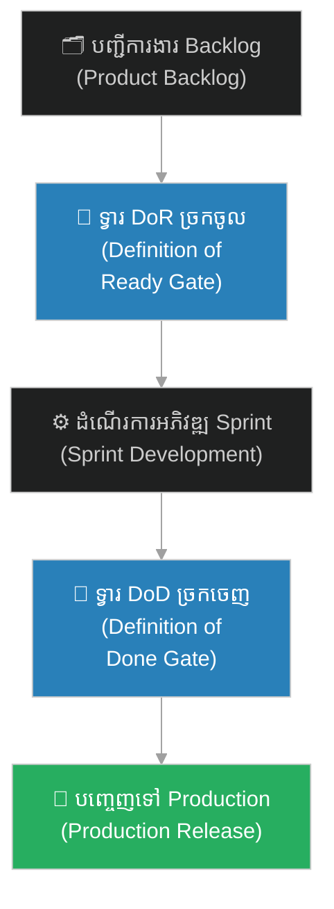
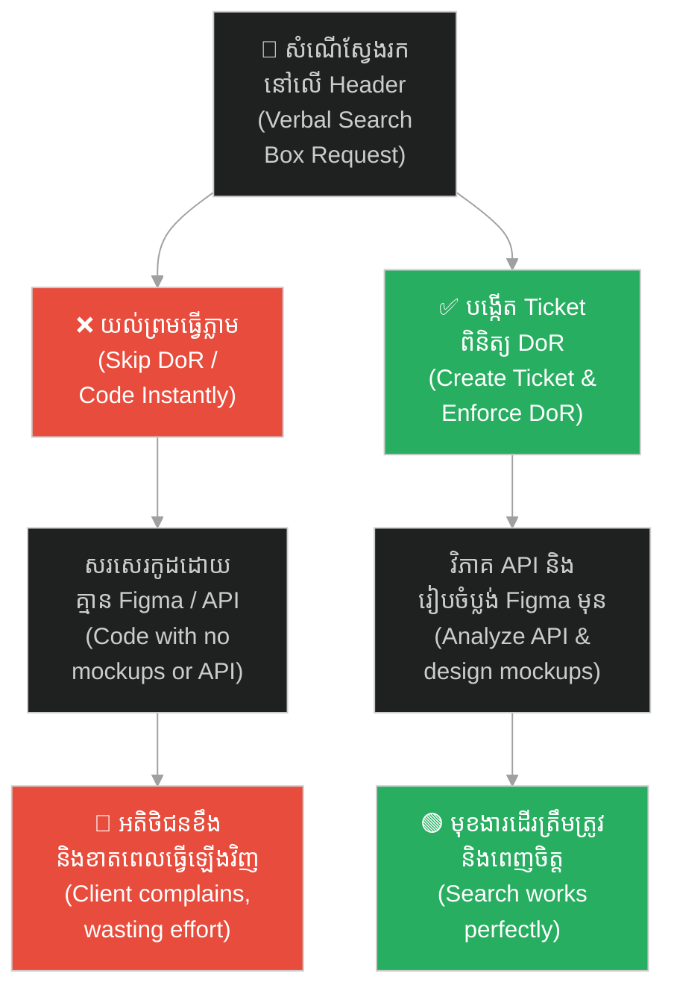
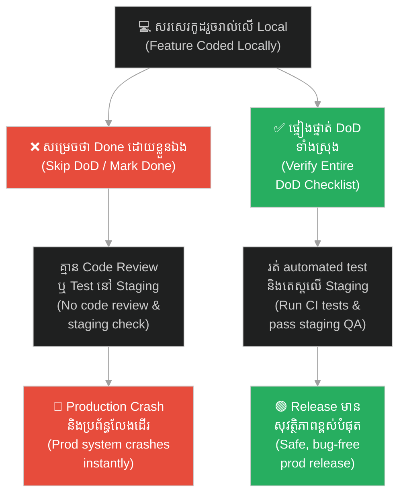
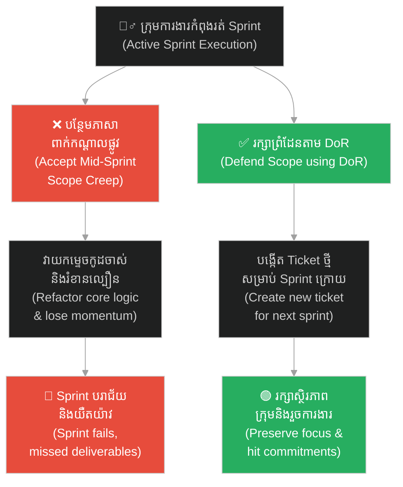
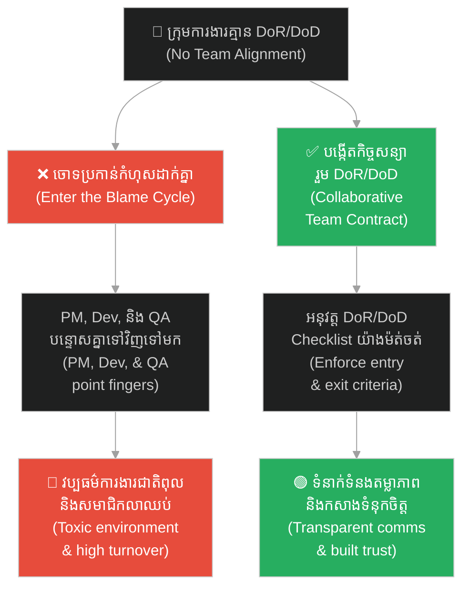
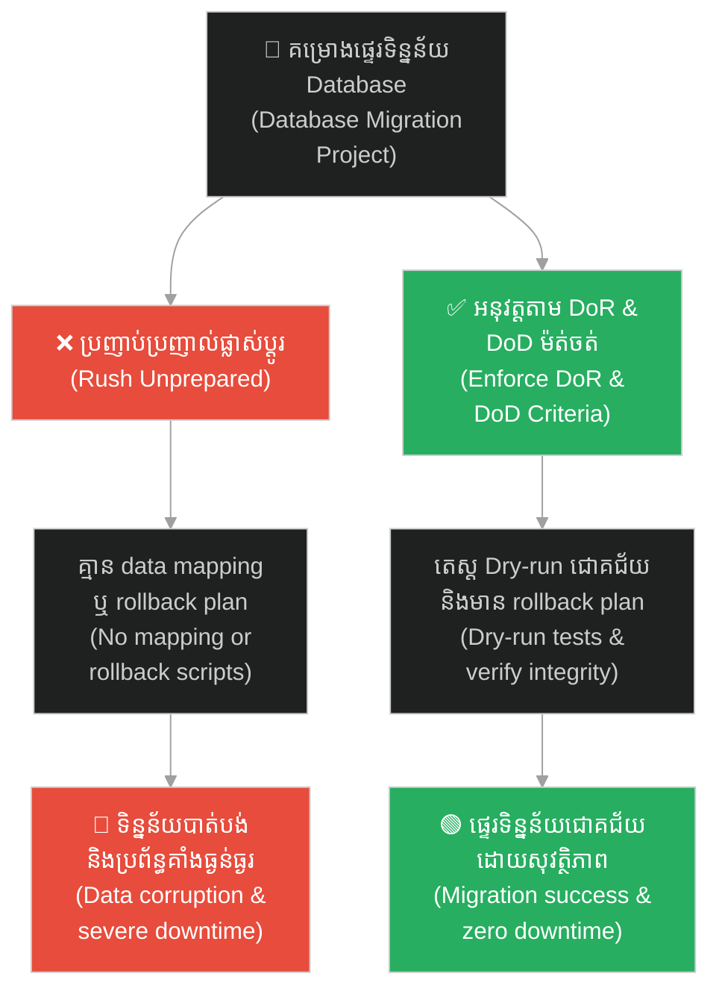

# Definition of Ready (DoR) & Definition of Done (DoD)៖ កិច្ចសន្យា DoR និង DoD ក្នុងការគ្រប់គ្រងគម្រោង (Definition of Ready (DoR) & Definition of Done (DoD): Team Contracts in Project Management)

**Author:** ichamrong  
**Date:** 2026-06-04  
**Tags:** #scrum #agile #project-management #definition-of-ready #definition-of-done #team-collaboration #quality-management  
**Category:** Concepts  
**Read Time:** ~20 min  

---

## 📌 មាតិកា (Table of Contents)
- [អន្ទាក់ការងារ (The Trap)](#0)
- [១. បញ្ហា៖ ទ្វារទ្វេភាគីនៃសូហ្វវែរអាជីព (The Issue: The Two Gates of Professional Software Engineering)](#1)
- [២. ឧទាហរណ៍ជាក់ស្តែងក្នុងពិភពពិត (Real World Examples)](#2)
  - [ឧទាហរណ៍ទី ១ — កម្រិតស្រាល៖ អន្ទាក់ណែនាំដោយសម្តីទទេ (Example 1: The "Oral Instruction" Trap)](#2-1)
  - [ឧទាហរណ៍ទី ២ — កម្រិតមធ្យម (បច្ចេកទេស)៖ ការដោះលែងកូដ "ដំណើរការលើម៉ាស៊ីនខ្ញុំ" (Example 2: The "Works on My Machine" Release)](#2-2)
  - [ឧទាហរណ៍ទី ៣ — កម្រិតមធ្យម (ធុរកិច្ច)៖ ការលួចបន្ថែមការងារពាក់កណ្តាលផ្លូវ (Example 3: The Mid-Sprint Scope Creep)](#2-3)
  - [ឧទាហរណ៍ទី ៤ — កម្រិតធ្ងន់៖ វដ្តនៃការចោទប្រកាន់គ្នាក្នុងក្រុម (Example 4: The Total Team Blame Cycle)](#2-4)
  - [ឧទាហរណ៍ទី ៥ — កម្រិតធ្ងន់ (បច្ចេកទេស)៖ ការផ្លាស់ប្តូរប្រព័ន្ធទិន្នន័យដោយគ្មានផែនការ (Example 5: Unplanned Integration & Migration)](#2-5)
- [៣. កត្តាជម្រុញ៖ សម្ពាធល្បឿន និងការសន្មត់ «រឿងសាមញ្ញ» (The Aggravator: Speed Pressure & The Assumption of Common Sense)](#3)
- [៤. ដំណោះស្រាយទូទៅ (The General Solution)](#4)
- [សេចក្តីសន្និដ្ឋាន (Conclusion)](#5)
- [ឯកសារយោង (References)](#6)
- [Related Posts](#7)

---

## អន្ទាក់ការងារ (The Trap)

តើអ្នកធ្លាប់អង្គុយនៅក្នុងកិច្ចប្រជុំរៀបចំផែនការការងារ (Sprint Planning) ហើយស្រាប់តែ Product Manager (PM) ទាញសន្លឹកការងារ (Ticket) មួយមកបង្ហាញដែលមានសរសេរតែពាក្យខ្លីៗថា៖ *«សូមភ្ជាប់ប្រព័ន្ធទូទាត់ប្រាក់ Stripe។ ធ្វើយ៉ាងណាឱ្យវាដំណើរការរលូនល្អ។»* ដែរឬទេ?

Have you ever sat in a Sprint Planning meeting only to have the Product Manager (PM) pull up a ticket that briefly states: *"Please integrate Stripe payment. Make it work smoothly"*?

គ្មានគំរូរចនាប្លង់ Figma ភ្ជាប់មកជាមួយ, គ្មានឯកសារណែនាំ API ផ្លូវការ, ហើយរចនាសម្ព័ន្ធទិន្នន័យ (Database Schema) ក៏មិនទាន់ត្រូវបានកំណត់។ PM និយាយថា៖ *«អូ! វាងាយស្រួលណាស់ គ្រាន់តែមើលឯកសារលើគេហទំព័រផ្លូវការរបស់ពួកគេទៅ។ យើងត្រូវការប្រព័ន្ធនេះបញ្ចប់ក្នុង Sprint នេះដាច់ខាត!»*

There are no Figma designs attached, no API documentation provided, and the database schema is undefined. The PM says: *"Oh, it's very simple. Just read Stripe's official docs. We absolutely need this done by the end of the Sprint!"*

Developer ចាប់ផ្តើមសរសេរកូដដោយផ្អែកលើការស្មាន។ បីថ្ងៃក្រោយមក នៅពេលពួកគេយក UI ទៅបង្ហាញ PM បែរជាស្រែកថា៖ *«ទេ! នេះមើលទៅអាក្រក់ណាស់! ជម្រើសបង់ប្រាក់ត្រូវតែបង្ហាញជាផ្ទាំង Modal Window មិនមែនជាទំព័រថ្មីដាច់ដោយឡែកឡើយ! ហើយចុះប៊ូតុងទាញយកវិក្កយបត្រនៅឯណា?»*

The developer starts coding based on pure guesswork. Three days later, when they demo the UI, the PM reacts: *"No! This looks terrible! The payment option must be displayed as a Modal Window, not a separate page! And where is the invoice download button?"*

Developer ត្រូវបង្ខំចិត្តវាយកម្ទេចកូដចាស់ចោល និងសរសេរឡើងវិញទាំងអស់ពីដំបូង។ ដល់ថ្ងៃបញ្ចប់ Sprint សន្លឹកការងារនោះនៅតែមិនទាន់បញ្ចប់ គម្រោងត្រូវពន្យារពេល ហើយសមាជិកគ្រប់គ្នាមានការខឹងសម្បារ និងធុញទ្រាន់ខ្លាំង។

The developer is forced to throw away their code and rewrite everything from scratch. By the end of the Sprint, the ticket remains unfinished, the project gets delayed, and the entire team is frustrated.

នេះគឺជាលទ្ធផលនៃការចូលរួមការងារ Sprint ដោយគ្មាន **Definition of Ready (DoR - និយមន័យនៃការត្រៀមខ្លួនរួចរាល់)**។

This is the consequence of entering a Sprint without a clear **Definition of Ready (DoR)**.

ដើម្បីងាយស្រួលតាមដាន នេះជាផែនទីបង្ហាញផ្លូវសម្រាប់អត្ថបទនេះ៖
1. **បញ្ហា (The Issue)** — តើគំនិតនៃទ្វារច្រកចូល និងច្រកចេញនៃសូហ្វវែរអាជីពបង្ហាញពីអ្វីខ្លះ?
2. **ឧទាហរណ៍ជាក់ស្តែង (Real World Examples)** — ឧទាហរណ៍ចំនួន ៥ ពីការគ្រប់គ្រងតម្រូវការ, ការ release កូដ, ទំនាស់ scope គម្រោង, ការចោទប្រកាន់កំហុស, និងការផ្លាស់ប្តូរទិន្នន័យ។
3. **កត្តាជម្រុញ (The Aggravator)** — ហេតុអ្វីបានជាយើងតែងតែមើលរំលងការកំណត់ DoR និង DoD?
4. **ដំណោះស្រាយទូទៅ (The General Solution)** — របៀបចងក្រងបញ្ជី DoR/DoD checklist និងការការពារទ្វារទាំងពីរយ៉ាងតឹងរ៉ឹង។

Roadmap for this article:
1. **The Issue** — What do the entrance and exit gates of professional software represent?
2. **Real World Examples** — Five examples spanning requirements management, code releases, mid-sprint scope creep, team blame cycles, and system integration.
3. **The Aggravator** — Why do teams constantly bypass DoR and DoD?
4. **The General Solution** — How to compile team checklists and strictly enforce the gates.

---

## ១. បញ្ហា៖ ទ្វារទ្វេភាគីនៃសូហ្វវែរអាជីព (The Issue: The Two Gates of Professional Software Engineering)

នៅក្នុងការអភិវឌ្ឍសូហ្វវែរប្រកបដោយវិជ្ជាជីវៈ គុណភាព និងភាពច្បាស់លាស់នៃការងារត្រូវបានរក្សាការពារដោយ «កិច្ចសន្យាផ្លូវការ» ពីរច្បាប់ដែលយល់ព្រមរួមគ្នាដោយសមាជិកក្រុមទាំងមូល៖

In professional software development, quality and operational clarity are preserved through two formal "team contracts" agreed upon by the entire team:

1. **Definition of Ready (DoR)៖** ទ្វារច្រកចូល (The Entrance Gate)។ វាបកស្រាយពីរាល់លក្ខខណ្ឌដែលសន្លឹកការងារ (User Story) ត្រូវតែមាន **«មុនពេល»** ត្រូវបានអនុញ្ញាតឱ្យយកចូលទៅអភិវឌ្ឍនៅក្នុង Sprint។
1. **Definition of Ready (DoR):** The Entrance Gate. It outlines all requirements a User Story must meet **before** it is allowed to enter a Sprint for active development.

2. **Definition of Done (DoD)៖** ទ្វារច្រកចេញ (The Exit Gate)។ វាបកស្រាយពីរាល់លក្ខខណ្ឌដែលសន្លឹកការងារត្រូវតែបំពេញបានជោគជ័យ **«មុនពេល»** ត្រូវបានចាត់ទុកថាបានបញ្ចប់ជាស្ថាពរ និងរួចរាល់ក្នុងការ Release ទៅកាន់ Production។
2. **Definition of Done (DoD):** The Exit Gate. It outlines all quality criteria a User Story must satisfy **before** it is marked complete and ready for production release.

ប្រសិនបើគ្មានទ្វារទាំងពីរនេះទេ ការសហការគ្នានៅក្នុងក្រុមនឹងធ្លាក់ចូលទៅក្នុងការសន្មត់ ការផ្លាស់ប្តូរគោលដៅពាក់កណ្តាលផ្លូវ និងវប្បធម៌ការងារចោទប្រកាន់កំហុសដាក់គ្នាទៅវិញទៅមកជានិច្ច។

Without these two gates, team collaboration descends into constant assumptions, shifting targets mid-sprint, and a finger-pointing culture.

---

## ២. ឧទាហរណ៍ជាក់ស្តែងក្នុងពិភពពិត (Real World Examples)

សូមពិនិត្យមើល **ឧទាហរណ៍ជាក់ស្តែងចំនួន ៥** បង្ហាញពីរបៀបដែល DoR និង DoD បង្កើតព្រំដែនការងារប្រកបដោយវិជ្ជាជីវៈ៖

Here are **five real-world examples** demonstrating how DoR and DoD establish professional boundaries and safeguard product quality:

---

### ឧទាហរណ៍ទី ១ — កម្រិតស្រាល៖ អន្ទាក់ណែនាំដោយសម្តីទទេ (Example 1: The "Oral Instruction" Trap)

**ស្ថានភាព៖** អតិថិជនសាកសួរ Developer ផ្ទាល់តាម Slack Call ថា៖ *«តើអ្នកអាចជួយបន្ថែមប្រអប់ស្វែងរក (Search Box) តូចមួយនៅលើ Header នៃ Dashboard បានទេ?»*

**Scenario:** A client verbally asks a developer over a Slack call: *"Can you quickly add a small search box on the dashboard header?"*

* **សកម្មភាព Low EQ / Bias (ទម្លាប់/លំអៀង)៖** Developer យល់ព្រមភ្លាម និងចំណាយពេលមួយថ្ងៃពេញដើម្បីសរសេរកូដ ដោយមិនបានបង្កើតសន្លឹកការងារ (Ticket) និងមិនបានពិនិត្យថា API គាំទ្រការស្វែងរកឬអត់ឡើយ។ ស្អែកឡើង ពេលអតិថិជនតេស្ត ពួកគេវាយពាក្យស្វែងរកខ្លីៗ តែប្រព័ន្ធមិនបង្ហាញលទ្ធផល ពួកគេខឹងភ្លាម៖ *«ហេតុអ្វីមិនបង្ហាញ Fuzzy Match? ហើយវាមើលទៅអាក្រក់ណាស់នៅលើទូរស័ព្ទ!»*
* **Low-EQ/Bias Action:** The developer agrees instantly and spends a full day writing code without creating a ticket or verifying if the backend API supports searching. The next day, when the client tests it, they search with keywords and find no results, complaining: *"Why doesn't it support fuzzy matching? And it looks terrible on mobile!"*
* **សកម្មភាព High EQ / Correct (ដំណោះស្រាយ)៖** អនុវត្តច្បាប់ DoR៖ គ្មានសន្លឹកការងារផ្លូវការ គ្មានការអភិវឌ្ឍ (No ticket, no code)។ ត្រូវសរសេរតម្រូវការច្បាស់លាស់ ផ្ទៀងផ្ទាត់លទ្ធភាព API និងគំរូប្លង់ Figma ជាមុន ទើបអនុញ្ញាតឱ្យយកទៅសរសេរកូដ។
* **High-EQ/Correct Action:** Enforce the DoR rule: No ticket, no code. Insist on writing down the user story, validating API compatibility, and designing Figma wireframes before writing any code.
* **លទ្ធផល៖** រក្សាបាននូវទិសដៅការងារត្រឹមត្រូវ សន្សំពេលវេលា និងប្រគល់លទ្ធផលប្រកបដោយស្ថិរភាព។
* **The Result:** Keep development aligned with expectations, saving time and delivering stable features.

---

### ឧទាហរណ៍ទី ២ — កម្រិតមធ្យម (បច្ចេកទេស)៖ ការដោះលែងកូដ "ដំណើរការលើម៉ាស៊ីនខ្ញុំ" (Example 2: The "Works on My Machine" Release)

**ស្ថានភាព៖** Developer ម្នាក់ផ្លាស់ប្តូរសន្លឹកការងារទៅជា "Done" ព្រោះតែសរសេរកូដរួចរាល់នៅលើម៉ាស៊ីនខ្លួនឯង។

**Scenario:** A developer moves a ticket to "Done" simply because the feature runs successfully on their local computer.

* **សកម្មភាព Low EQ / Bias (ទម្លាប់/លំអៀង)៖** Developer រុញ (Push) កូដផ្ទាល់ទៅកាន់ Main Branch ដោយមិនបានរត់ Unit Test, គ្មានការ Review កូដពីសមាជិកដទៃ, និងមិនបាន Deploy ទៅកាន់ Staging Server ដើម្បីតេស្តឡើយ។ ពេលប្រព័ន្ធ CI/CD បាញ់កូដឡើង Production Server ស្រាប់តែប្រព័ន្ធទាំងមូលត្រូវ Crash ព្រោះតែខ្វះ Environment Variables។ Developer ការពារខ្លួនភ្លាម៖ *«វាដើរធម្មតាតើនៅលើម៉ាស៊ីនខ្ញុំ!»*
* **Low-EQ/Bias Action:** The developer pushes code directly to the main branch without running unit tests, getting a peer review, or deploying to a staging server. When CI/CD triggers the production deploy, the entire system crashes due to missing environment variables. The developer defends themselves: *"But it works perfectly on my machine!"*
* **សកម្មភាព High EQ / Correct (ដំណោះស្រាយ)៖** អនុវត្ត DoD ដាច់ខាត៖ កូដត្រូវតែឆ្លងកាត់ការ Review ពីប្រធានក្រុម (Pull Request Approved), ត្រូវឆ្លងកាត់ Pipeline Test ជោគជ័យ, និងត្រូវ Deploy តេស្តដោយគ្មានកំហុសនៅលើ Staging Server ទើបអនុញ្ញាតឱ្យប្តូរទៅជា "Done"។
* **High-EQ/Correct Action:** Strictly enforce the Definition of Done (DoD): Code must pass peer reviews (PR approved), complete all automated CI pipeline tests successfully, and be verified in staging before the ticket can be marked "Done."
* **លទ្ធផល៖** ធានារាល់ការ Release មានសុវត្ថិភាពខ្ពស់ និងចៀសវាងការគាំងប្រព័ន្ធ Production។
* **The Result:** Secure production deployments with zero unexpected server crashes.

---

### ឧទាហរណ៍ទី ៣ — កម្រិតមធ្យម (ធុរកិច្ច)៖ ការលួចបន្ថែមការងារពាក់កណ្តាលផ្លូវ (Example 3: The Mid-Sprint Scope Creep)

**ស្ថានភាព៖** ក្រុមការងារកំពុងដំណើរការ Sprint មកដល់សប្តាហ៍ទី ២។ ស្រាប់តែ PM បន្ថែមលក្ខខណ្ឌថ្មីពាក់កណ្តាលផ្លូវ៖ *«អូ! យើងត្រូវការប៊ូតុង PDF Export នេះឱ្យគាំទ្រការបកប្រែ ៣ ភាសា (ខ្មែរ អង់គ្លេស ចិន) ផងដែរ!»*

**Scenario:** The team is in the second week of a Sprint when the PM suddenly inserts a new requirement: *"Oh, we need this PDF Export button to support 3 languages (Khmer, English, Chinese) as well!"*

* **សកម្មភាព Low EQ / Bias (ទម្លាប់/លំអៀង)៖** យល់ព្រមទទួលយកការងារភ្លាមៗ។ ការបន្ថែមភាសាពាក់កណ្តាលផ្លូវបង្ខំឱ្យពួកគេវាយកម្ទេចរចនាសម្ព័ន្ធកូដស្នូលចាស់ ដែលធ្វើឱ្យការងារដែលបានសន្យាដទៃទៀតក្នុង Sprint ត្រូវខកខាន Deadline ទាំងស្រុង។
* **Low-EQ/Bias Action:** Accept the change immediately. Forcing language localization mid-sprint disrupts the core architecture code, causing the team to miss deadlines on all other committed Sprint goals.
* **សកម្មភាព High EQ / Correct (ដំណោះស្រាយ)៖** Developer ប្រើប្រាស់ DoR ជាខែលការពារ៖ *«រាល់ការផ្លាស់ប្តូរលក្ខខណ្ឌការងារពាក់កណ្តាលផ្លូវ គឺជាការរំលោភលើច្បាប់ DoR រួមរបស់យើង។ មុខងារ Localization នេះត្រូវតែបង្កើតជាសន្លឹកការងារថ្មីដាច់ដោយឡែក យកទៅវិភាគក្នុង backlog refinement សម្រាប់ Sprint ក្រោយ។»*
* **High-EQ/Correct Action:** Developers use the DoR agreement as a shield: *"Altering requirements mid-sprint violates our shared DoR contract. This localization request must be captured in a separate ticket, refined, and scheduled for the next Sprint."*
* **លទ្ធផល៖** ការពារស្ថិរភាពការងាររបស់ក្រុម និងប្រគល់ការងារដែលបានសន្យាបានទាន់ពេល។
* **The Result:** Protect team focus, ensuring all committed Sprint goals are delivered on schedule.

---

### ឧទាហរណ៍ទី ៤ — កម្រិតធ្ងន់៖ វដ្តនៃការចោទប្រកាន់គ្នាក្នុងក្រុម (Example 4: The Total Team Blame Cycle)

**ស្ថានភាព៖** ក្រុមការងារបច្ចេកវិទ្យាដែលគ្មានការកំណត់ច្បាប់ DoR និង DoD ច្បាស់លាស់ កំពុងរងសម្ពាធការងារធ្ងន់ធ្ងរ។

**Scenario:** A software engineering team with no clear DoR or DoD guidelines experiences severe delivery pressures.

* **សកម្មភាព Low EQ / Bias (ទម្លាប់/លំអៀង)៖** សមាជិកចោទប្រកាន់កំហុសដាក់គ្នាទៅវិញទៅមក៖ PM ស្តីបន្ទោស Developer ថាធ្វើការយឺតយ៉ាវ និងមាន Bug ច្រើន; Developer វាយបកទៅ PM ថាផ្តល់ព័ត៌មានមិនច្បាស់លាស់ និងផ្លាស់ប្តូរចិត្តរាល់ថ្ងៃ; QA ស្តីបន្ទោស Developer ថាបោះកូដខូចៗមកឱ្យតេស្តនៅថ្ងៃចុងក្រោយ។
* **Low-EQ/Bias Action:** Members pass blame around: The PM accuses developers of slow shipping and high bug rates; developers accuse the PM of providing vague specs and changing priorities daily; QA blames developers for pushing broken code at the last minute.
* **សកម្មភាព High EQ / Correct (ដំណោះស្រាយ)៖** ជួបជុំសមាជិកក្រុមដើម្បីបង្កើតកិច្ចសន្យារួម DoR និង DoD។ អនុវត្តយន្តការត្រួតពិនិត្យតឹងរ៉ឹង៖ គ្មានការងារណាត្រូវបានអនុញ្ញាតឱ្យចូល ឬចេញពីបន្ទាត់អភិវឌ្ឍឡើយ បើមិនទាន់ឆ្លងកាត់ DoR/DoD checklist ជោគជ័យ។
* **High-EQ/Correct Action:** Run a retro meeting to establish DoR and DoD. Implement strict verification: No story enters development without satisfying the DoR checklist, and no code is released without meeting the DoD.
* **លទ្ធផល៖** បំបែកវដ្តចោទប្រកាន់គ្នា បង្កើតតម្លាភាព ទំនុកចិត្ត និងការសហការរឹងមាំរវាងក្រុមការងារឡើងវិញ។
* **The Result:** Break the blame cycle, establishing transparency, mutual trust, and strong collaboration across roles.

---

### ឧទាហរណ៍ទី ៥ — កម្រិតធ្ងន់ (បច្ចេកទេស)៖ ការផ្លាស់ប្តូរប្រព័ន្ធទិន្នន័យដោយគ្មានផែនការ (Example 5: Unplanned Integration & Migration)

**ស្ថានភាព៖** ក្រុមហ៊ុនចង់ផ្លាស់ប្តូរប្រព័ន្ធទិន្នន័យអតិថិជន (Database Migration) ទៅកាន់ Cloud Server ថ្មីមួយ។

**Scenario:** A company plans to migrate its core customer database to a new cloud server.

* **សកម្មភាព Low EQ / Bias (ទម្លាប់/លំអៀង)៖** ដោយសារតែសម្ពាធពេលវេលា PM បង្ខំឱ្យក្រុមការងាររុញគម្រោងនេះចោលដោយគ្មាន DoR (គ្មានការ mapping រចនាសម្ព័ន្ធទិន្នន័យច្បាស់លាស់, គ្មាន rollback plan ផ្លូវការ) និងគ្មាន DoD (គ្មានការរត់តេស្ត Dry-run លើទិន្នន័យសាកល្បង, គ្មានការផ្ទៀងផ្ទាត់ទិន្នន័យចុងក្រោយ)។ ប្រព័ន្ធគាំងទាំងស្រុង និងបាត់បង់ទិន្នន័យអតិថិជនមួយចំនួនធំ។
* **Low-EQ/Bias Action:** Under time pressure, the PM pushes the migration to proceed without DoR (no data mapping docs, no rollback strategy) or DoD (no dry-run test, no post-migration data integrity checks). The migration fails, corrupting data and causing a severe system outage.
* **សកម្មភាព High EQ / Correct (ដំណោះស្រាយ)៖** អនុវត្ត DoR និង DoD តឹងរ៉ឹង៖ DoR តម្រូវឱ្យមានឯកសារ data mapping រួចរាល់ និងផែនការត្រលប់ក្រោយ (Rollback Strategy) ច្បាស់លាស់។ DoD តម្រូវឱ្យមានការសាកល្បង Dry-run ជោគជ័យ ១០០% លើ Staging Server និងមានការផ្ទៀងផ្ទាត់ភាពត្រឹមត្រូវនៃទិន្នន័យពី QA។
* **High-EQ/Correct Action:** Enforce strict DoR and DoD: DoR demands documented schema mappings and a proven rollback script. DoD requires a 100% successful dry-run on staging and complete data verification by the QA team.
* **លទ្ធផល៖** ដំណើរការផ្ទេរទិន្នន័យទទួលបានជោគជ័យ សុវត្ថិភាព និងមិនប៉ះពាល់ដល់សេវាកម្មអតិថិជនឡើយ។
* **The Result:** The database migration completes successfully, secure and with zero service disruption to active users.

---

## ៣. កត្តាជម្រុញ៖ សម្ពាធល្បឿន និងការសន្មត់ «រឿងសាមញ្ញ» (The Aggravator: Speed Pressure & The Assumption of Common Sense)

ហេតុអ្វីបានជាក្រុមការងារតែងតែរំលងច្បាប់ DoR និង DoD?
Why do teams constantly bypass DoR and DoD?

1. **ការយល់ច្រឡំពីល្បឿន (The Illusion of Speed)៖** យើងតែងតែគិតថាការចំណាយពេលអង្គុយសរសេរបញ្ជីផ្ទៀងផ្ទាត់ គូរ Figma ឬសរសេរលក្ខខណ្ឌការងារ Acceptance Criteria គឺជា *«ភាពការិយាធិបតេយ្យយឺតយ៉ាវ»*។ យើងចង់ចាប់ផ្តើមសរសេរកូដភ្លាមៗ។ យើងច្រឡំការធ្វើចលនាវឹកវរ ថាជាការរីកចម្រើនការងារ។
1. **The Illusion of Speed:** We often think that writing checklists, drawing Figma wireframes, or drafting acceptance criteria is just "slow bureaucracy." We want to start coding immediately, confusing chaotic movement with actual progress.

2. **ការសន្មត់រឿងសាមញ្ញ (The "Common Sense" Fallacy)៖** PM សន្មត់ថា Developer *«ច្បាស់ជាដឹង»* ថារចនាសម្ព័ន្ធប៊ូតុងត្រូវធ្វើបែបណា។ Developer សន្មត់ថា QA *«ច្បាស់ជាចេះ»* រៀបចំតេស្តដោយខ្លួនឯង។ នៅក្នុងពិភពសូហ្វវែរ **«រឿងសាមញ្ញ (Common Sense) គឺគ្មានតម្លៃឡើយ»**។ ប្រសិនបើវាមិនត្រូវបានសរសេរច្បាស់លាស់ជាលាយលក្ខណ៍អក្សរទេ វានឹងត្រូវយល់ច្រឡំជាមិនខាន។
2. **The "Common Sense" Fallacy:** The PM assumes the developer *"obviously knows"* how the button should layout. The developer assumes QA *"obviously knows"* how to prepare the tests. In software engineering, **common sense has no value**. If it isn't documented explicitly, it will be misunderstood.

---

## ៤. ដំណោះស្រាយទូទៅ (The General Solution)

តើយើងអាចកសាងទ្វារទាំងពីរការពារក្រុមការងារយ៉ាងដូចម្តេច?
How can we build the two gates to protect our team's performance?

### ការចងក្រងបញ្ជីផ្ទៀងផ្ទាត់ DoR របស់ក្រុម (Drafting Your Team's DoR Checklist)

សន្លឹកការងារមួយ ត្រូវបានអនុញ្ញាតឱ្យយកចូល Sprint លុះត្រាតែបំពេញលក្ខខណ្ឌទាំងនេះ៖
* **Clear Value៖** មានការបញ្ជាក់ច្បាស់លាស់ពី «តួនាទី, អ្វីដែលចង់បាន, និងផលប្រយោជន៍» (As a... I want to... So that...)។
* **Explicit Acceptance Criteria៖** មានលក្ខខណ្ឌទទួលយកការងារច្បាស់លាស់ (Given/When/Then scenarios)។
* **Designs Attached៖** មានភ្ជាប់ប្លង់គំរូ Figma រួចរាល់ (ប្រសិនបើប៉ះពាល់ UI/UX)។
* **Technical Agreement៖** រចនាសម្ព័ន្ធទិន្នន័យ ឬ API Specification ត្រូវបានយល់ព្រមរួមគ្នាដោយក្រុម backend/frontend។
* **No Blockers៖** គ្មានការពឹងផ្អែកទៅលើក្រុមការងារខាងក្រៅដែលមិនទាន់រួចរាល់ឡើយ។

A User Story is only allowed to enter a Sprint if it meets these criteria:
* **Clear Value:** Follows the standard structure: *"As a... I want to... So that..."*
* **Explicit Acceptance Criteria:** Outlines clear scenarios using the *"Given/When/Then"* syntax.
* **Designs Attached:** Has Figma design mockups attached (if UI/UX is affected).
* **Technical Agreement:** Backend/Frontend APIs and schemas are pre-aligned and documented.
* **No Blockers:** Free of dependencies on external teams that are not ready.

### ការចងក្រងបញ្ជីផ្ទៀងផ្ទាត់ DoD របស់ក្រុម (Drafting Your Team's DoD Checklist)

សន្លឹកការងារមួយ ត្រូវបានចាត់ទុកថា "Done" លុះត្រាតែបំពេញលក្ខខណ្ឌទាំងនេះ៖
* **Code Implemented៖** កូដត្រូវបានសរសេរស្អាតត្រឹមត្រូវតាមស្ដង់ដារបច្ចេកទេស។
* **Tests Passed៖** Automated Unit/Integration tests ត្រូវបានរត់ជោគជ័យ ១០០%។
* **Code Reviewed៖** ឆ្លងកាត់ការ Review និង Approve ពីសមាជិកដទៃ (PR Approved)។
* **Self-Tested៖** Developer បានតេស្តសាកល្បងដោយផ្ទាល់ទាំង happy និង unhappy paths។
* **Deployed to Staging៖** កូដត្រូវបានបាញ់ឡើង និងតេស្តជោគជ័យដោយគ្មានកំហុសនៅលើ Staging Server ដោយក្រុម QA។

A User Story is only marked "Done" once it satisfies these conditions:
* **Code Implemented:** Written cleanly according to the team's coding guidelines.
* **Tests Passed:** Automated Unit and Integration tests run 100% successfully.
* **Code Reviewed:** The Pull Request is reviewed and approved by a peer.
* **Self-Tested:** Tested locally by the developer covering happy and edge-case paths.
* **Deployed to Staging:** Pushed to staging, verified by QA, and passes sanity tests.

### ការការពារទ្វារទាំងពីរយ៉ាងតឹងរ៉ឹង (Enforce the Gates)

Scrum Master ឬ Lead Developer ត្រូវធ្វើជាអ្នកយាមទ្វារដ៏ហ្មត់ចត់បំផុត៖
* ប្រសិនបើសន្លឹកការងារមិនទាន់បំពេញតាមច្បាប់ DoR **ហាមទាញយកចូល Sprint ដាច់ខាត** ទោះបីជា PM អង្វរករយ៉ាងណាក៏ដោយ។
* ប្រសិនបើមុខងារការងារមិនទាន់បំពេញតាមច្បាប់ DoD **ហាមបាញ់ឡើង Production ដាច់ខាត** ទោះបីជាមានការប្រញាប់ប្រញាល់យ៉ាងណាក៏ដោយ។

The Scrum Master or Lead Developer must act as a strict gatekeeper:
* If a ticket fails the DoR, **do not pull it into the Sprint**, no matter how much the PM begs.
* If a feature fails the DoD, **do not deploy it to production**, no matter how urgent the release is.

---

## 🐇 ធ្លាក់ចូលក្នុងរន្ធទន្សាយ (Enter the Rabbit Hole)

ដើម្បីស្វែងយល់កាន់តែស៊ីជម្រៅអំពីការកសាងកិច្ចសន្យា DoR និង DoD តាមរយៈរឿងព្រេងនៃការស្ថាបនាវិមានសំណង់របស់មេជាងសំណង់ លីអូណាដូ និង ម៉ាកូ នៅក្នុងសតវត្សរ៍ទី ១៥ នៅប្រទេសអ៊ីតាលី សូមចាប់ផ្តើមដំណើររុករករបស់អ្នកដោយចុចលើតំណភ្ជាប់ខាងក្រោម៖

To delve deeper into establishing DoR and DoD contracts through the parable of the master masons Leonardo and Marco in 15th-century Italy, begin your journey by clicking below:

* 🚀 **[ចាប់ផ្តើមដំណើររុករក (Start the Journey) ➔ DoR and DoD Scrum Contracts (កិច្ចសន្យា DoR និង DoD ក្នុងការគ្រប់គ្រងគម្រោង)](../parables/18-the-master-mason-and-the-readiness-contracts.md)**

---

## សេចក្តីសន្និដ្ឋាន (Conclusion)

> **« DoR ការពារល្បឿននៃការចាប់ផ្តើម; DoD ធានាគុណភាពនៃការបញ្ចប់។»**  
> 
> **“DoR protects starting speed; DoD guarantees finishing quality.”**  

ការបង្កើតច្បាប់ DoR និង DoD ច្បាស់លាស់ គឺជាការរៀបចំគ្រឹះទំនាក់ទំនងប្រកបដោយតម្លាភាព និងវិជ្ជាជីវៈខ្ពស់។ វាមិនមែនជាការបង្អាក់ល្បឿនការងារនោះឡើយ ប៉ុន្តែវាជាការធានាថា រាល់ជំហានដែលក្រុមការងារបោះទៅមុខ គឺជាជំហានដ៏រឹងមាំ និងគ្មានការថយក្រោយ ដែលជួយបំផ្លាញវដ្តនៃការចោទប្រកាន់គ្នា និងនាំមកនូវភាពជោគជ័យពិតប្រាកដជារៀងរហូត។

Establishing clear DoR and DoD rules sets a transparent, highly professional foundation for team communication. Instead of slowing down delivery, it ensures that every step forward is solid, eliminating the blame cycle and driving true project success.

---

## ឯកសារយោង (References)

* **Schwaber, K. & Beedle, M.** — *Agile Software Development with Scrum* (2001)។ សៀវភៅគ្រឹះណែនាំពីគោលការណ៍ Scrum, Sprint, និងការកំណត់ Definition of Done។
* **Schwaber, K. & Beedle, M.** — *Agile Software Development with Scrum* (2001). The foundational guide detailing Scrum practices, sprints, and the definition of done.
* **Cohn, M.** — *User Stories Applied: For Agile Software Development* (2004)។ គោលការណ៍សរសេរ User Stories និងលក្ខខណ្ឌត្រៀមខ្លួន Ready (DoR)។
* **Cohn, M.** — *User Stories Applied: For Agile Software Development* (2004). Illustrating user story specifications and readiness standards.

---

## Related Posts

* **[02-five-whys-technique.md](./02-five-whys-technique.md)** — Five Whys Technique (បច្ចេកទេសសួរ «ហេតុអ្វី» ៥ ដង)៖ ស្វែងរកឫសគល់នៃបញ្ហាក្នុងដំណើរការការងារ។
* **[10-technical-debt-and-refactoring.md](./10-technical-debt-and-refactoring.md)** — Technical Debt & Refactoring (បំណុលបច្ចេកវិទ្យា និងការកែលម្អកូដឡើងវិញ)៖ របៀបដែលការបណ្តោយឱ្យកូដគ្មានគុណភាពឆ្លងផុតទ្វារ DoD បង្កើតជាបំណុលបច្ចេកវិទ្យា។
* **[The Master Mason and the Readiness Contracts (មេជាងសំណង់ និងកិច្ចសន្យា DoR/DoD)](../parables/18-the-master-mason-and-the-readiness-contracts.md)** — រឿងប្រៀបធៀបប្រវត្តិសាស្ត្រអ៊ីតាលីរវាងជាងសំណង់ Leonardo, Marco និង សេដ្ឋី Giovanni។
