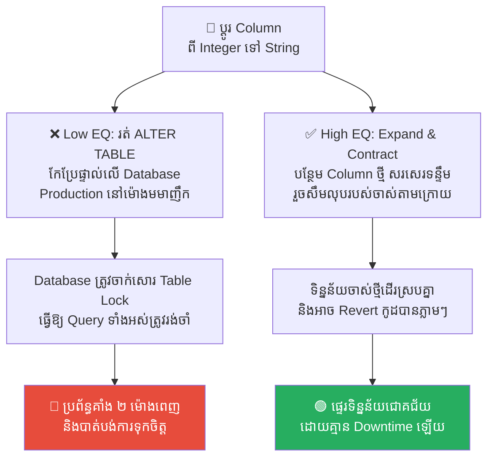
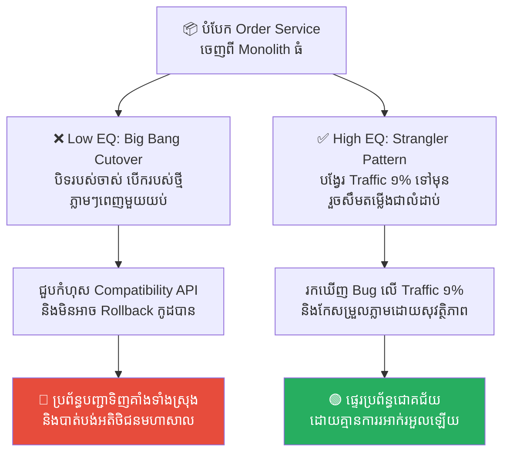
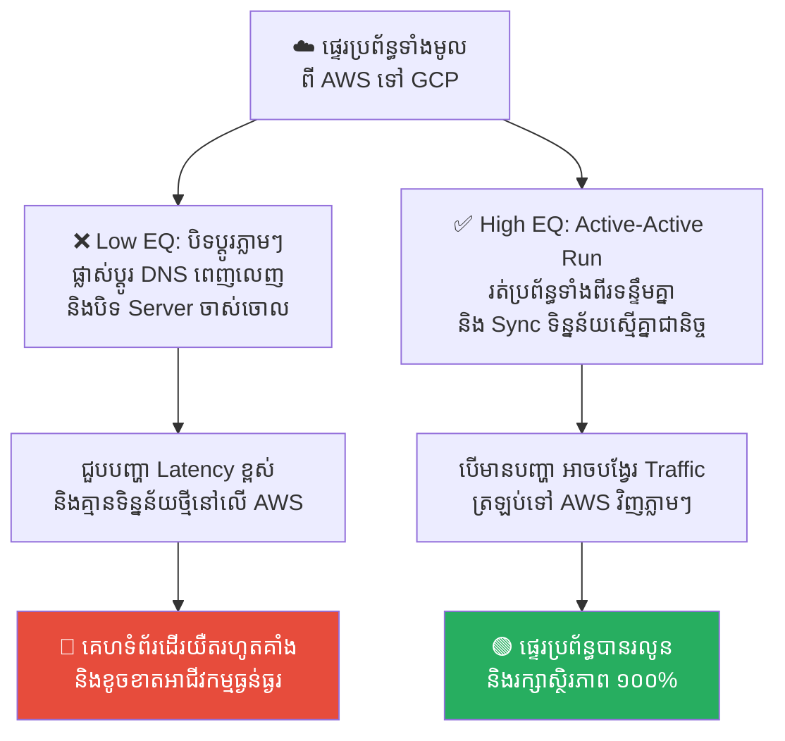
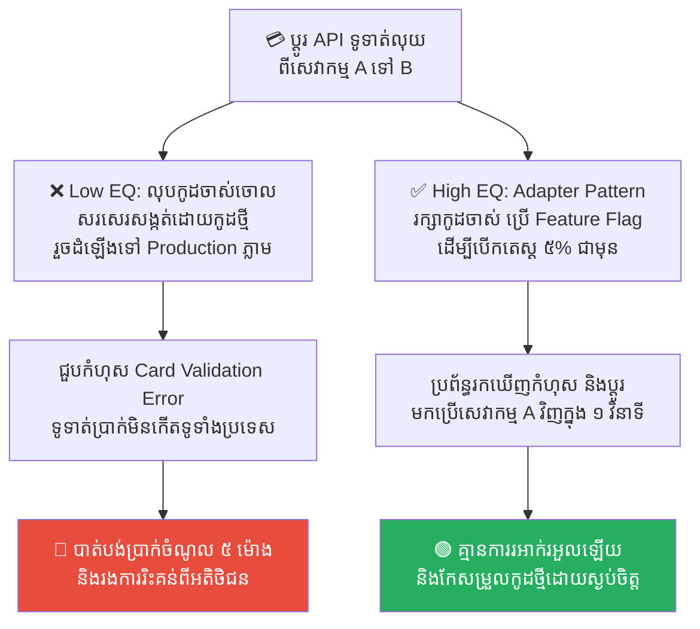
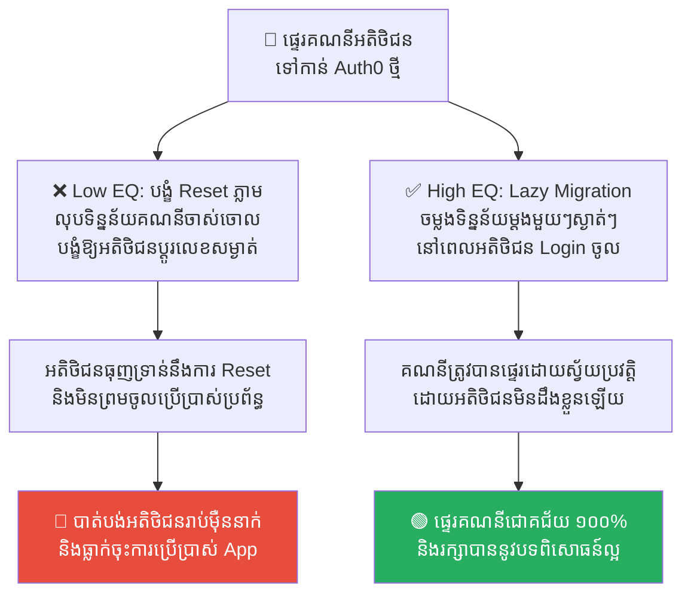

# Crossing the Rubicon: Irreversible Migrations and System Architecture (ឆ្លងទន្លេរូប៊ីខន៖ ការផ្លាស់ប្តូរប្រព័ន្ធដែលមិនអាចត្រឡប់ក្រោយបាន)

**Author:** ichamrong  
**Date:** 2026-05-17  
**Tags:** #system-architecture #database-migration #decision-making #julius-caesar #rubicon  
**Category:** Concepts  
**Read Time:** ~15 min  

---

## 📌 មាតិកា (Table of Contents)
- [លំនាំបញ្ហា (The Pattern)](#លំនាំបញ្ហា-the-pattern)
- [១. បញ្ហា៖ ហេតុអ្វីបានជាការសម្រេចចិត្តខ្លះមិនអាចថយក្រោយបាន? (The Issue: One-Way Doors vs. Reversibility)](#១-បញ្ហា-ហេតុអ្វីបានជាការសម្រេចចិត្តខ្លះមិនអាចថយក្រោយបាន-the-issue-one-way-doors-vs-reversibility)
- [២. ឧទាហរណ៍ជាក់ស្តែងក្នុងពិភពពិត (Real World Examples)](#២-ឧទាហរណ៍ជាក់ស្តែងក្នុងពិភពពិត)
  - [ឧទាហរណ៍ទី ១ — ការប្តូរ Schema ក្នុង Database ដែលមានទិន្នន័យធំ (Live Database Schema Migration)](#ឧទាហរណ៍ទី-១--ការប្តូរ-schema-ក្នុង-database-ដែលមានទិន្នន័យធំ-live-database-schema-migration)
  - [ឧទាហរណ៍ទី ២ — ការបំបែក Monolith ទៅ Microservices (Monolith to Microservices Cutover)](#ឧទាហរណ៍ទី-២--ការបំបែក-monolith-ទៅ-microservices-monolith-to-microservices-cutover)
  - [ឧទាហរណ៍ទី ៣ — ការប្តូរ Cloud Provider (Cloud Infrastructure Migration)](#ឧទាហរណ៍ទី-៣--ការប្តូរ-cloud-provider-cloud-infrastructure-migration)
  - [ឧទាហរណ៍ទី ៤ — ការផ្លាស់ប្តូរប្រព័ន្ធទូទាត់ប្រាក់ពី API មួយ ទៅ API មួយទៀត (Third-Party Payment API Transition)](#ឧទាហរណ៍ទី-៤--ការផ្លាស់ប្តូរប្រព័ន្ធទូទាត់ប្រាក់ពី-api-មួយ-ទៅ-api-មួយទៀត-third-party-payment-api-transition)
  - [ឧទាហរណ៍ទី ៥ — ការប្តូរប្រព័ន្ធគ្រប់គ្រងសិទ្ធិ និងគណនីអ្នកប្រើប្រាស់ (Identity Provider Migration)](#ឧទាហរណ៍ទី-៥--ការប្តូរប្រព័ន្ធគ្រប់គ្រងសិទ្ធិ-និងគណនីអ្នកប្រើប្រាស់-identity-provider-migration)
- [៣. កត្តាជម្រុញ៖ ភាពប្រញាប់ប្រញាល់ និងការមើលរំលងហានិភ័យ (The Aggravator: Haste and Lack of Risk Analysis)](#៣-កត្តាជម្រុញ-ភាពប្រញាប់ប្រញាល់-និងការមើលរំលងហានិភ័យ-the-aggravator-haste-and-lack-of-risk-analysis)
- [៤. ដំណោះស្រាយទូទៅ៖ យុទ្ធសាស្ត្រមុនពេលឆ្លងទន្លេ (The General Solution: Strategies Before Crossing the Rubicon)](#៤-ដំណោះស្រាយទូទៅ-យុទ្ធសាស្ត្រមុនពេលឆ្លងទន្លេ-the-general-solution-strategies-before-crossing-the-rubicon)
- [សេចក្តីសន្និដ្ឋាន (Conclusion)](#សេចក្តីសន្និដ្ឋាន-conclusion)
- [Related Posts](#related-posts)

---

## លំនាំបញ្ហា (The Pattern)

នៅក្នុងប្រវត្តិសាស្ត្រចក្រភពរ៉ូម នៅឆ្នាំ ៤៩ មុនគស មានច្បាប់ដ៏តឹងរ៉ឹងមួយចែងថា៖ **«គ្មានមេទ័ពណាអាចដឹកនាំកងទ័ពប្រដាប់អាវុធឆ្លងកាត់ទន្លេរូប៊ីខន (The Rubicon) ចូលមកកាន់ដែនដីអ៊ីតាលីឡើយ»**។ ការបំពានច្បាប់នេះ ត្រូវបានចាត់ទុកថាជាអំពើក្បត់ជាតិ និងជាការប្រកាសសង្គ្រាមស៊ីវិលជាផ្លូវការ។ 

នៅពេលយូលីសេស សេសារ (Julius Caesar) ដឹកនាំកងទ័ពមកដល់ច្រាំងទន្លេនេះ ទ្រង់បានផ្អាក និងពិចារណាយ៉ាងម៉ឺងម៉ាត់។ ទ្រង់ដឹងច្បាស់ថា បើទ្រង់នៅស្ងៀម ទ្រង់នឹងត្រូវគេដកហូតអំណាច។ ប៉ុន្តែបើទ្រង់បោះជំហានឆ្លងកាត់ទន្លេដ៏តូចមួយនេះ នោះវានឹងក្លាយជាការសម្រេចចិត្តដែលមិនអាចត្រឡប់ក្រោយបានឡើយ។ ទីបំផុត សេសារបានសម្រេចចិត្តឆ្លងទន្លេ រួចបន្លឺពាក្យស្លោកដ៏ល្បីល្បាញថា៖ **«Alea iacta est» (គ្រាប់ឡុកឡាក់ត្រូវបានបោះចេញហើយ — The die is cast)**។

នៅក្នុងការរចនាប្រព័ន្ធបច្ចេកវិទ្យា (System Architecture) និងការគ្រប់គ្រងគម្រោង យើងតែងតែជួបប្រទះនឹង «ទន្លេរូប៊ីខន» ផ្ទាល់ខ្លួនរបស់យើងជានិច្ច៖
*   ការសម្រេចចិត្តខ្លះ បើខុស យើងគ្រាន់តែចុចប៊ូតុង Undo ឬ Revert Code គឺរួចរាល់។
*   ប៉ុន្តែការសម្រេចចិត្តខ្លះទៀត ដូចជាការផ្លាស់ប្តូរ Database ធំ ឬរចនាសម្ព័ន្ធស្នូល ពេលដែលវាត្រូវបានដំណើរការហើយ គឺ **«គ្មានផ្លូវត្រឡប់ក្រោយឡើយ (The Point of No Return)»**។ ប្រសិនបើមានកំហុស ប្រព័ន្ធនឹងដួលរលំទាំងស្រុង ហើយអាជីវកម្មនឹងត្រូវរងការខូចខាតភ្លាមៗ។

---

## ១. បញ្ហា៖ ហេតុអ្វីបានជាការសម្រេចចិត្តខ្លះមិនអាចថយក្រោយបាន? (The Issue: One-Way Doors vs. Reversibility)

ស្ថាបនិកក្រុមហ៊ុន Amazon លោក Jeff Bezos បានបែងចែកការសម្រេចចិត្តជាពីរប្រភេទ៖

1.  **ទ្វារផ្លូវពីរ (Two-Way Doors):** ជាការសម្រេចចិត្តដែលអាចបកក្រោយបាន (Reversible)។ ឧទាហរណ៍៖ ការផ្លាស់ប្តូរ UI បន្តិចបន្តួច ឬការសាកល្បង Library ថ្មី។ បើវាមានបញ្ហា អ្នកគ្រាន់តែបិទវា ឬ Revert ត្រឡប់មកវិញគឺចប់។ ចំពោះរឿងទាំងនេះ អ្នកត្រូវសម្រេចចិត្តឱ្យលឿនបំផុត ដើម្បីរក្សាល្បឿនការងារ។
2.  **ទ្វារផ្លូវមួយ (One-Way Doors / The Rubicon):** ជាការសម្រេចចិត្តដែលមិនអាចត្រឡប់ក្រោយបាន ឬបើថយក្រោយ ត្រូវចំណាយធនធាន និងពេលវេលាច្រើនមហាសាល។ ឧទាហរណ៍៖ ការផ្លាស់ប្តូរប្រភេទ Database ពី SQL ទៅ NoSQL ឬការផ្លាស់ប្តូរស្ថាបត្យកម្មប្រព័ន្ធទាំងមូល។ ពេលដែលប្រព័ន្ធថ្មីចាប់ផ្តើមដំណើរការ ទិន្នន័យនឹងត្រូវសរសេរចូលក្នុងទម្រង់ថ្មី ដែលធ្វើឱ្យការដកថយក្រោយវិញស្ទើរតែមិនអាចទៅរួច។

គ្រោះថ្នាក់ដ៏ធំបំផុតនៅក្នុងវិស្វកម្ម គឺនៅពេលដែលក្រុមការងារ **«ប្រព្រឹត្តចំពោះទ្វារផ្លូវមួយ ដូចជាទ្វារផ្លូវពីរ»** — ពោលគឺធ្វើការសម្រេចចិត្តដ៏សំខាន់ និងមិនអាចកែប្រែបាន ដោយភាពប្រញាប់ប្រញាល់ ខ្វះការវិភាគហានិភ័យ និងគ្មានផែនការរៀបចំយុទ្ធសាស្ត្រការពារច្បាស់លាស់។

---

## ២. ឧទាហរណ៍ជាក់ស្តែងក្នុងពិភពពិត

សូមពិនិត្យមើល **ឧទាហរណ៍ជាក់ស្តែងចំនួន ៥** បង្ហាញពីភាពខុសគ្នារវាងការធ្វើ Migration បែបប្រថុយប្រថាន និងវិធីសាស្ត្រផ្លាស់ប្តូរដោយសុវត្ថិភាព៖

---

### ឧទាហរណ៍ទី ១ — ការប្តូរ Schema ក្នុង Database ដែលមានទិន្នន័យធំ (Live Database Schema Migration)

**ស្ថានភាព៖** ក្រុមហ៊ុនចង់ផ្លាស់ប្តូរ Column ប្រភេទទិន្នន័យគណនីអតិថិជនពី Integer (លេខ) ទៅជា String (អក្សរ) នៅក្នុង Database ដែលមានទិន្នន័យរាប់លានជួរ។

*   **សកម្មភាពអសកម្ម / Low EQ / កំហុសឆ្គង (ឆ្លងទន្លេដោយបង្ខំ)៖** វិស្វករសម្រេចចិត្តរត់ពាក្យបញ្ជា `ALTER TABLE` ផ្ទាល់នៅលើ Production Database នៅម៉ោងធ្វើការ ព្រោះយល់ថាវាងាយស្រួល និងលឿន។ ពាក្យបញ្ជានេះបានធ្វើការចាក់សោរតារាងទិន្នន័យទាំងស្រុង (Table Lock) រយៈពេល ២ ម៉ោង ធ្វើឱ្យរាល់សេវាកម្មទាំងអស់ដែលត្រូវការអាន ឬសរសេរទិន្នន័យអតិថិជនត្រូវគាំងទាំងស្រុង (Downtime)។
*   **សកម្មភាពស្ថាបនា / High EQ / ដំណោះស្រាយ (យុទ្ធសាស្ត្រឆ្លាក់ជាជំហាន)៖** អនុវត្តវិធីសាស្ត្រ **Expand and Contract Pattern (Three-Phase Migration)**។ 
    1. *Expand:* បន្ថែម Column ថ្មី (String) ដោយរក្សា Column ចាស់ (Integer) ដដែល។
    2. *Transition:* កែកូដកម្មវិធីឱ្យសរសេរទិន្នន័យចូលទាំងពីរ Columns ព្រមគ្នា និងសរសេរ Script រត់ពីក្រោយ (Backfill) ដើម្បីបំប្លែងទិន្នន័យចាស់ពី Integer ទៅ String។
    3. *Contract:* នៅពេលទិន្នន័យទាំងអស់បំប្លែងរួចរាល់ កែកូដឱ្យអានពី Column ថ្មីទាំងស្រុង រួចលុប Column ចាស់ចេញដោយសុវត្ថិភាព។
*   **លទ្ធផល៖** ការរត់ពាក្យបញ្ជាផ្ទាល់ធ្វើឱ្យប្រព័ន្ធគាំង និងខាតបង់ចំណូល។ វិធីសាស្ត្រ Expand and Contract ជួយឱ្យការផ្លាស់ប្តូរប្រព្រឹត្តទៅដោយគ្មាន Downtime និងអាចដកថយមកវិញបានគ្រប់ពេលមុនការលុបចោល។

---

### ឧទាហរណ៍ទី ២ — ការបំបែក Monolith ទៅ Microservices (Monolith to Microservices Cutover)

**ស្ថានភាព៖** ក្រុមហ៊ុនចង់បំបែកប្រព័ន្ធគ្រប់គ្រងការបញ្ជាទិញ (Order Processing) ចេញពីប្រព័ន្ធ Monolith ដ៏ធំ ទៅជា Microservice ថ្មីមួយដាច់ដោយឡែក។

*   **សកម្មភាពអសកម្ម / Low EQ / កំហុសឆ្គង (ឆ្លងទន្លេដោយបង្ខំ)៖** ក្រុមការងារសម្រេចចិត្តបិទមុខងារបញ្ជាទិញនៅលើ Monolith ទាំងស្រុង ហើយបើកដំណើរការ Microservice ថ្មីភ្លាមៗតែម្តង (Big Bang Cutover)។ នៅពេលដំណើរការ ស្រាប់តែមានកំហុស Network ស្មុគស្មាញ និងបញ្ហា API Compatibility ធ្វើឱ្យអតិថិជនមិនអាចទិញទំនិញបាន ហើយការថយក្រោយ (Rollback) មិនអាចធ្វើទៅបានឡើយ ព្រោះទិន្នន័យខ្លះបានចូលទៅក្នុងប្រព័ន្ធថ្មីបាត់ទៅហើយ។
*   **សកម្មភាពស្ថាបនា / High EQ / ដំណោះស្រាយ (យុទ្ធសាស្ត្រឆ្លាក់ជាជំហាន)៖** អនុវត្ត **Strangler Fig Pattern** និង **Canary Deployments**។ បង្កើត API Gateway ដើម្បីបង្វែរចរាចរណ៍អ្នកប្រើប្រាស់ (Traffic) ត្រឹមតែ ១% ទៅកាន់ Microservice ថ្មី រួចសង្កេតមើលកំហុស និងស្ថិរភាពប្រព័ន្ធ។ ប្រសិនបើគ្មានបញ្ហា ទើបបង្កើនចរាចរណ៍បន្តិចម្តងៗ (៥%, ២៥%, ១០០%) ក្នុងរយៈពេលប៉ុន្មានសប្តាហ៍។
*   **លទ្ធផល៖** ការប្តូរប្រព័ន្ធភ្លាមៗ (Big Bang) បង្កជាមហន្តរាយ និងបាត់បង់ការលក់ដូរ។ ការប្តូរបែបសន្សឹមៗជួយការពារហានិភ័យ និងអនុញ្ញាតឱ្យក្រុមការងារដោះស្រាយបញ្ហាទាន់ពេលវេលាដោយមិនរំខានដល់អ្នកប្រើប្រាស់រួម។

---

### ឧទាហរណ៍ទី ៣ — ការប្តូរ Cloud Provider (Cloud Infrastructure Migration)

**ស្ថានភាព៖** ក្រុមហ៊ុនចង់ផ្លាស់ប្តូរហេដ្ឋារចនាសម្ព័ន្ធ និង Database ទាំងអស់ពី AWS ទៅកាន់ Google Cloud Platform (GCP) ដើម្បីកាត់បន្ថយការចំណាយ។

*   **សកម្មភាពអសកម្ម / Low EQ / កំហុសឆ្គង (ឆ្លងទន្លេដោយបង្ខំ)៖** ក្រុមការងារកំណត់ម៉ោងបិទប្រព័ន្ធ (Maintenance Window) រួចប្តូរ DNS ទៅកាន់ GCP ភ្លាមៗ និងបិទ Server នៅ AWS តែម្តង ដោយសង្ឃឹមថាការផ្ទេរទិន្នន័យដែលបានធ្វើឡើងមុននោះគឺគ្រប់គ្រាន់ហើយ។ ពេលដំណើរការ ពួកគេជួបបញ្ហា latency ខ្ពស់រវាង Database ថ្មី និងសេវាកម្មចាស់ៗ ដែលធ្វើឱ្យប្រព័ន្ធដំណើរការយឺតខ្លាំង រហូតដល់គាំង។
*   **សកម្មភាពស្ថាបនា / High EQ / ដំណោះស្រាយ (យុទ្ធសាស្ត្រឆ្លាក់ជាជំហាន)៖** អនុវត្ត **Hybrid Cloud and Parallel Run**។ ដំណើរការប្រព័ន្ធនៅលើ Cloud ទាំងពីរទន្ទឹមគ្នា (Active-Active) ដោយប្រើប្រាស់ DNS Weighted Routing ដើម្បីសាកល្បងបញ្ជូន Traffic ខ្លះទៅប្រព័ន្ធថ្មី។ រៀបចំប្រព័ន្ធចម្លងទិន្នន័យទ្វិទិស (Bi-directional Data Replication) ដើម្បីឱ្យទិន្នន័យរវាង AWS និង GCP ដូចគ្នាជានិច្ច មុននឹងបិទ AWS ទាំងស្រុង។
*   **លទ្ធផល៖** ការបិទប្រព័ន្ធចាស់លឿនពេក នាំឱ្យគ្មានផ្លូវថយក្រោយពេលជួបបញ្ហាធ្ងន់ធ្ងរ។ ការរត់ Parallel ជួយធានាថា បើប្រព័ន្ធថ្មីមានបញ្ហា យើងអាចបង្វែរ Traffic ត្រឡប់ទៅ AWS វិញភ្លាមៗក្នុងរយៈពេលប៉ុន្មានវិនាទី។

---

### ឧទាហរណ៍ទី ៤ — ការផ្លាស់ប្តូរប្រព័ន្ធទូទាត់ប្រាក់ពី API មួយ ទៅ API មួយទៀត (Third-Party Payment API Transition)

**ស្ថានភាព៖** ក្រុមហ៊ុនចង់ផ្លាស់ប្តូរ API ទូទាត់ប្រាក់ពីសេវាកម្ម A (ចាស់) ទៅសេវាកម្ម B (ថ្មី) ដែលមានតម្លៃសេវាកម្មធូរថ្លៃជាង។

*   **សកម្មភាពអសកម្ម / Low EQ / កំហុសឆ្គង (ឆ្លងទន្លេដោយបង្ខំ)៖** វិស្វករសរសេរកូដលុប Integration របស់សេវាកម្ម A ចោលទាំងអស់ ហើយជំនួសដោយកូដសេវាកម្ម B ទាំងស្រុង រួចដំឡើងទៅ Production តែម្តង។ ពេលអតិថិជនចូលទូទាត់ប្រាក់ ស្រាប់តែមានកំហុសទាក់ទងនឹងការផ្ទៀងផ្ទាត់កាតធនាគារ (Card Validation Error) ធ្វើឱ្យការទូទាត់ប្រាក់បរាជ័យទូទាំងប្រទេស។ ក្រុមការងារត្រូវចំណាយពេល ៥ ម៉ោងដើម្បីសរសេរកូដចាស់ឡើងវិញ និង Deploy ឡើងវិញទាំងស្របច្បាប់ និងស្ត្រេស។
*   **សកម្មភាពស្ថាបនា / High EQ / ដំណោះស្រាយ (យុទ្ធសាស្ត្រឆ្លាក់ជាជំហាន)៖** អនុវត្ត **Adapter Design Pattern** និង **Feature Flags**។ បង្កើត Interface រួមមួយដែលគាំទ្រទាំងសេវាកម្ម A និង B។ ប្រើប្រាស់ Feature Flag (កុងតាក់បិទបើកស្វ័យប្រវត្ត) ដើម្បីបើកឱ្យដំណើរការសេវាកម្ម B សម្រាប់តែអតិថិជន ៥% ប៉ុណ្ណោះ។ បើជួបបញ្ហាកំហុស ប្រព័ន្ធនឹងបិទសេវាកម្ម B និងប្តូរមកប្រើសេវាកម្ម A វិញដោយស្វ័យប្រវត្តិភ្លាមៗ (Auto-Fallback)។
*   **លទ្ធផល៖** ការលុបកូដចាស់ចោលនាំឱ្យគ្មានខែលការពារពេលប្រព័ន្ធថ្មីជួបបញ្ហា។ ការប្រើប្រាស់ Feature Flags និង Adapter Pattern ជួយឱ្យការផ្លាស់ប្តូរមានភាពបត់បែន និងមានប្រព័ន្ធការពារសុវត្ថិភាពជានិច្ច។

---

### ឧទាហរណ៍ទី ៥ — ការប្តូរប្រព័ន្ធគ្រប់គ្រងសិទ្ធិ និងគណនីអ្នកប្រើប្រាស់ (Identity Provider Migration)

**ស្ថានភាព៖** ក្រុមហ៊ុនចង់ផ្លាស់ប្តូរប្រព័ន្ធចុះឈ្មោះ និងផ្ទៀងផ្ទាត់គណនី (Identity Provider) ពី Custom Database ទៅកាន់សេវាកម្ម Cloud Identity (ដូចជា Auth0)។

*   **សកម្មភាពអសកម្ម / Low EQ / កំហុសឆ្គង (ឆ្លងទន្លេដោយបង្ខំ)៖** ក្រុមការងារបង្ខំឱ្យអតិថិជនទាំងអស់ត្រូវកំណត់លេខសម្ងាត់ថ្មី (Force Password Reset) នៅពេលចូលប្រើប្រាស់កម្មវិធីលើកក្រោយ ព្រោះពួកគេមិនអាចចម្លងទិន្នន័យលេខសម្ងាត់ដែលបាន Encrypt រួចទៅកាន់ប្រព័ន្ធថ្មីបានឡើយ។ ការសម្រេចចិត្តនេះធ្វើឱ្យអតិថិជនរាប់ម៉ឺននាក់មានភាពធុញទ្រាន់ និងបោះបង់ចោលកម្មវិធី។
*   **សកម្មភាពស្ថាបនា / High EQ / ដំណោះស្រាយ (យុទ្ធសាស្ត្រឆ្លាក់ជាជំហាន)៖** អនុវត្ត **Lazy Migration (Just-in-Time Migration)**។ នៅពេលអតិថិជនវាយបញ្ចូលលេខសម្ងាត់ Login ចូលប្រព័ន្ធចាស់ ប្រព័ន្ធនឹងយកលេខសម្ងាត់នោះទៅផ្ទៀងផ្ទាត់ រួចចម្លងព័ត៌មាន និងលេខសម្ងាត់នោះទៅកាន់ Auth0 ដោយស្វ័យប្រវត្ត។ ដំណើរការនេះប្រព្រឹត្តទៅជាលំដាប់រាល់ពេលដែលអ្នកប្រើប្រាស់ចូលមកលេង ដោយគ្មានការបង្ខំឱ្យ Reset លេខសម្ងាត់ឡើយ។
*   **លទ្ធផល៖** ការបង្ខំឱ្យផ្លាស់ប្តូរលឿនពេក បំផ្លាញបទពិសោធន៍អ្នកប្រើប្រាស់ និងបាត់បង់អតិថិជន។ ការប្រើ Lazy Migration ធានាបាននូវដំណើរការផ្ទេរទិន្នន័យដោយរលូន ស្ងាត់ស្ងៀម និងគ្មានការរំខានដល់អ្នកប្រើប្រាស់ឡើយ។

---

## ៣. កត្តាជម្រុញ៖ ភាពប្រញាប់ប្រញាល់ និងការមើលរំលងហានិភ័យ (The Aggravator: Haste and Lack of Risk Analysis)

ហេតុអ្វីបានជាវិស្វករ និងថ្នាក់ដឹកនាំងាយនឹងធ្លាក់ចូលទៅក្នុង «ការឆ្លងទន្លេរូប៊ីខនដោយបង្ខំ» ខ្លាំងម្ល៉េះ? កត្តាជម្រុញរួមមាន៖

1.  **សម្ពាធពេលវេលា និងល្បឿន (Haste and Deadline Pressure)៖** នៅពេលដែលក្រុមហ៊ុនមានអាសន្ន ឬចង់បញ្ចេញមុខងារឱ្យទាន់គូប្រជែង ក្រុមការងារច្រើនតែជ្រើសរើសផ្លូវកាត់ដែលលឿនបំផុត (Big Bang) ដោយសង្ឃឹមថាគ្មានបញ្ហាកើតឡើង។
2.  **ការគិតថា «រឿងនេះសាមញ្ញណាស់» (Overconfidence and Underestimating Complexity)៖** វិស្វករតែងតែយល់ច្រឡំថាការផ្លាស់ប្តូររបស់ខ្លួនគឺសាមញ្ញ គ្មានអ្វីត្រូវបារម្ភឡើយ ដោយមើលរំលងភាពស្មុគស្មាញនៃទិន្នន័យ និងទំនាក់ទំនងរវាងប្រព័ន្ធចាស់និងថ្មី។
3.  **កង្វះការយល់ដឹងពីប្រភេទការសម្រេចចិត្ត (Ignorance of Decision Types)៖** ក្រុមការងារមិនបានបែងចែកឱ្យច្បាស់រវាង «ទ្វារផ្លូវពីរ» និង «ទ្វារផ្លូវមួយ» ឡើយ។ ពួកគេប្រព្រឹត្តចំពោះរាល់ការសម្រេចចិត្តទាំងអស់ស្មើៗគ្នា ដែលនាំឱ្យចំណាយពេលច្រើនលើរឿងមិនសំខាន់ ប៉ុន្តែបែរជាធ្វេសប្រហែសលើរឿងដែលមានហានិភ័យខ្ពស់បំផុតទៅវិញ។

---

## ៤. ដំណោះស្រាយទូទៅ៖ យុទ្ធសាស្ត្រមុនពេលឆ្លងទន្លេ (The General Solution: Strategies Before Crossing the Rubicon)

ដើម្បីធ្វើការផ្លាស់ប្តូរប្រព័ន្ធធំៗដោយជោគជ័យ និងមានស្ថិរភាពខ្ពស់ ចូរអនុវត្តយុទ្ធសាស្ត្រខាងក្រោមមុនពេលសម្រេចចិត្តឆ្លងទន្លេ៖

1.  ** Shadow Run (ការរត់ស្រមោល)៖** ដំណើរការប្រព័ន្ធចាស់ និងប្រព័ន្ធថ្មីទន្ទឹមគ្នា។ បញ្ជូនទិន្នន័យដូចគ្នាទៅកាន់ប្រព័ន្ធទាំងពីរ ហើយធ្វើការផ្ទៀងផ្ទាត់ភាពត្រឹមត្រូវនៃលទ្ធផល (Data Parity Test) រយៈពេលប៉ុន្មានសប្តាហ៍ មុននឹងសម្រេចចិត្តបិទប្រព័ន្ធចាស់។
2.  ** Feature Flags & Circuit Breakers៖** បង្កើតប្រព័ន្ធគ្រប់គ្រងការបើកបិទមុខងារ (Feature Flags) ដើម្បីឱ្យអ្នកអាចបិទប្រព័ន្ធថ្មី និងត្រឡប់ទៅប្រព័ន្ធចាស់វិញភ្លាមៗក្នុងរយៈពេល ១ វិនាទី បើរកឃើញកំហុស។
3.  ** យុទ្ធសាស្ត្រ Fix-Forward (ការដើរទៅមុខជានិច្ច)៖** នៅពេលអ្នកសម្រេចចិត្តឆ្លងទន្លេពិតប្រាកដ (ដូចជាការលុប Database ចាស់) ក្រុមការងារត្រូវតែយល់ព្រមទទួលយកហានិភ័យ និងរៀបចំយុទ្ធសាស្ត្រដោះស្រាយបញ្ហាភ្លាមៗនៅខាងមុខ (Fix Forward) ព្រោះគ្មានផ្លូវថយក្រោយទៀតឡើយ។
4.  ** ផែនការដកថយ (Rollback Plan)៖** មុននឹងចាប់ផ្តើមការដំឡើងប្រព័ន្ធណាមួយ ត្រូវតែសរសេរជំហានដកថយឱ្យបានច្បាស់លាស់ (Step-by-step Rollback Plan) និងធានាថា ផែនការនេះត្រូវបានសាកល្បងដោយជោគជ័យនៅលើ Staging Environment រួចរាល់។

---

## សេចក្តីសន្និដ្ឋាន (Conclusion)

**ការឆ្លងទន្លេរូប៊ីខន និងស្ថាបត្យកម្មប្រព័ន្ធ (Irreversible Migrations)** បង្រៀនយើងថា វិស្វករដ៏ឆ្នើមមិនមែនជាអ្នកដែលសម្រេចចិត្តលឿនបំផុត ឬហ៊ានប្រថុយប្រថានបំផុតនោះទេ ប៉ុន្តែជាអ្នកដែលចេះ **«បែងចែកប្រភេទនៃការសម្រេចចិត្ត និងគ្រប់គ្រងហានិភ័យយ៉ាងហ្មត់ចត់បំផុត»**។ 

នៅពេលប្រឈមមុខនឹងការសម្រេចចិត្តដែលមិនអាចត្រឡប់ក្រោយបាន ចូរវិភាគ រៀបចំផែនការតេស្តឱ្យបានគ្រប់ជ្រុងជ្រោយ និងអនុវត្តជាជំហានតូចៗជានិច្ច។ កុំគ្រាន់តែសង្ឃឹមលើសំណាងល្អ ព្រោះនៅពេលដែល «គ្រាប់ឡុកឡាក់ត្រូវបានបោះចេញហើយ» នោះលទ្ធផលគឺមានតែការឈ្នះសង្គ្រាម ឬការរលំរលាយប្រព័ន្ធការងារទាំងស្រុងប៉ុណ្ណោះ។

---

## Related Posts

*   **[19 The Domino Effect and Systemic Failures](./19-the-domino-effect-and-systemic-failures.md)** — របៀបដែលការធ្វេសប្រហែសមួយចំណុច អាចបង្កជាការដួលរលំប្រព័ន្ធការងារទាំងស្រុងជាសង្វាក់។
*   **[25 The Sword of Damocles: The Hidden Burden of Leadership](./25-the-sword-of-damocles-and-risk-management.md)** — ហានិភ័យលាក់កំបាំង និងការគ្រប់គ្រងហានិភ័យប្រព័ន្ធការងាររបស់ថ្នាក់ដឹកនាំ។

---

*Last updated: 2026-05-26*
