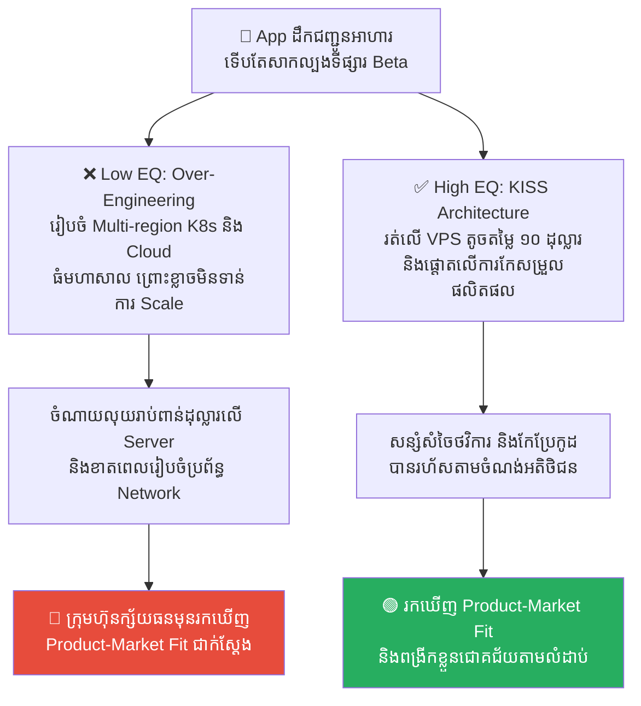
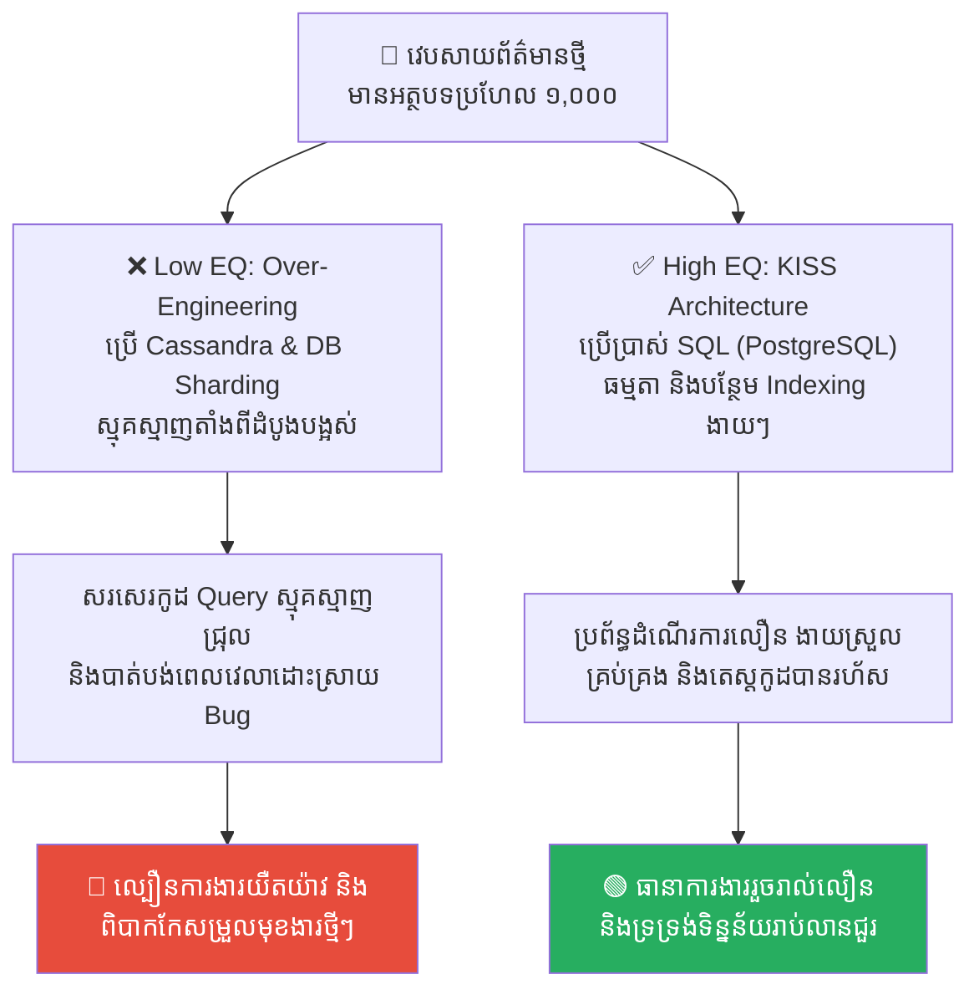
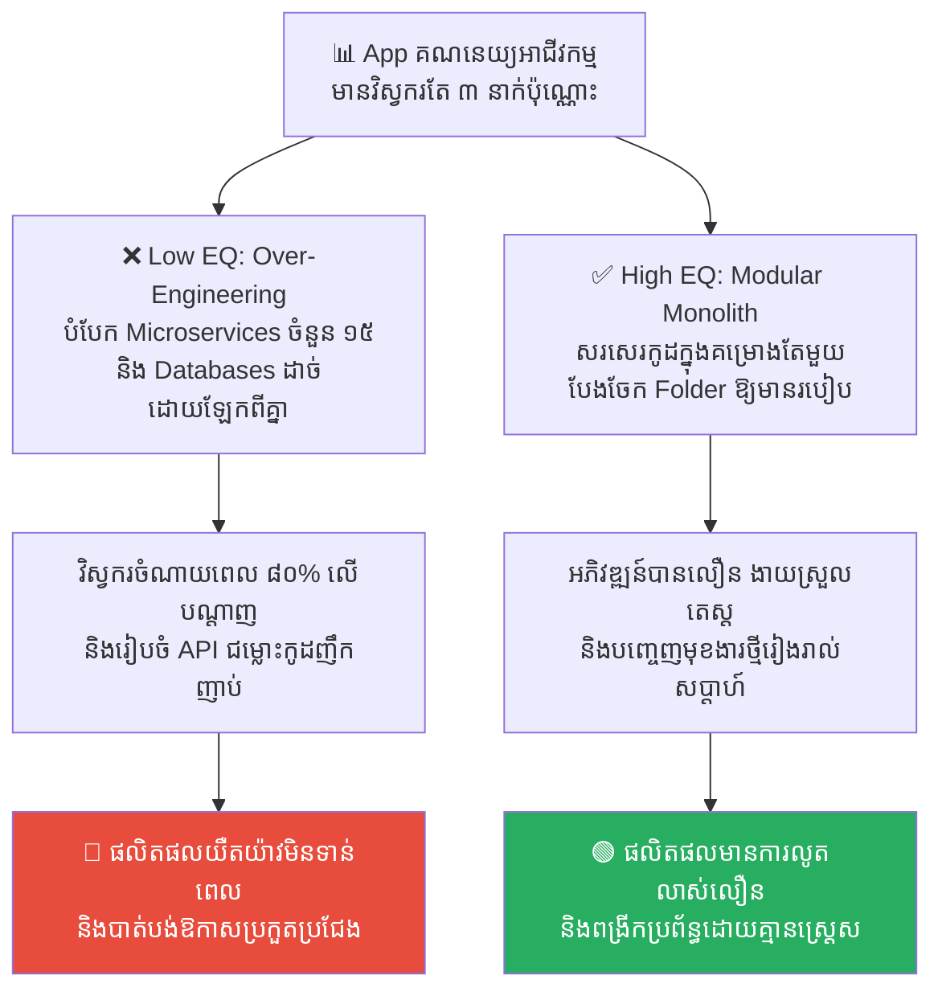
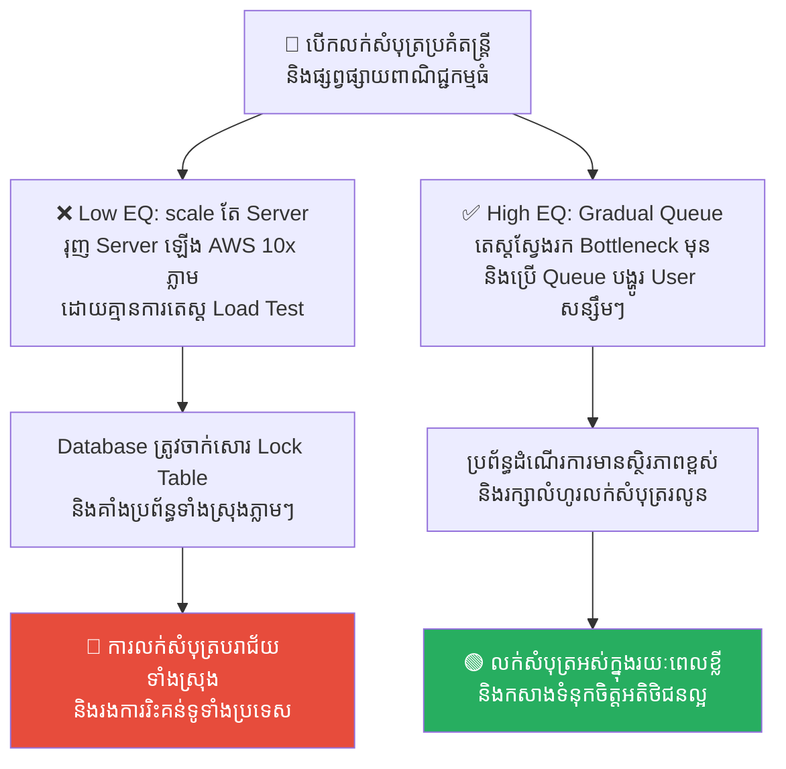
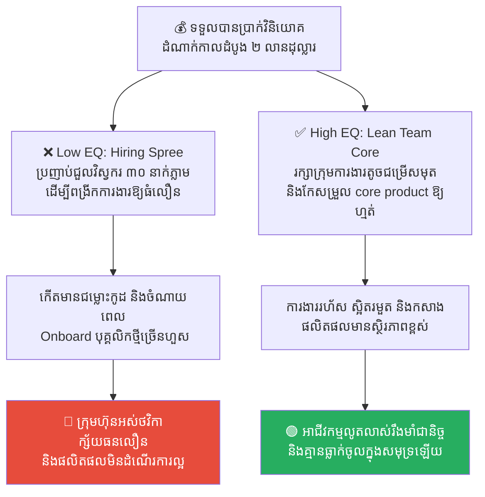

# Icarus: Premature Scaling and the Dangers of Hypergrowth (អ៊ីការុស៖ ការទាញពង្រីកប្រព័ន្ធលឿនពេក និងគ្រោះថ្នាក់នៃកំណើនហួសកម្រិត)

**Author:** ichamrong  
**Date:** 2026-05-17  
**Tags:** #icarus #premature-scaling #hypergrowth #monolith #microservices #startup  
**Category:** Concepts  
**Read Time:** ~15 min  

---

## 📌 មាតិកា (Table of Contents)
- [លំនាំបញ្ហា (The Pattern)](#លំនាំបញ្ហា-the-pattern)
- [១. បញ្ហា៖ ការហោះខ្ពស់ពេក និងការទាញពង្រីកប្រព័ន្ធមុនកាលកំណត់ (The Issue: Premature Scaling and Premature Optimization)](#១-បញ្ហា-ការហោះខ្ពស់ពេក-និងការទាញពង្រីកប្រព័ន្ធមុនកាលកំណត់-the-issue-premature-scaling-and-premature-optimization)
- [២. ឧទាហរណ៍ជាក់ស្តែងក្នុងពិភពពិត (Real World Examples)](#២-ឧទាហរណ៍ជាក់ស្តែងក្នុងពិភពពិត)
  - [ឧទាហរណ៍ទី ១ — ការរៀបចំប្រព័ន្ធធំសម្រាប់ App ដែលទើបតែសាកល្បង (Multi-Region K8s vs. Single VM VPS Deployment)](#ឧទាហរណ៍ទី-១--ការរៀបចំប្រព័ន្ធធំសម្រាប់-app-ដែលទើបតែសាកល្បង-multi-region-k8s-vs-single-vm-vps-deployment)
  - [ឧទាហរណ៍ទី ២ — ការប្រើប្រាស់ Database ស្មុគស្មាញតាំងពីដំបូង (Cassandra/Sharding vs. Relational PostgreSQL with Indexing)](#ឧទាហរណ៍ទី-២--ការប្រើប្រាស់-database-ស្មុគស្មាញតាំងពីដំបូង-cassandrasharding-vs-relational-postgresql-with-indexing)
  - [ឧទាហរណ៍ទី ៣ — ការបំបែក Microservices ទាំងដែលក្រុមការងារមានមនុស្សតិច (Microservices vs. Modular Monolith)](#ឧទាហរណ៍ទី-៣--ការបំបែក-microservices-ទាំងដែលក្រុមការងារមានមនុស្សតិច-microservices-vs-modular-monolith)
  - [ឧទាហរណ៍ទី ៤ — ការផ្សព្វផ្សាយពាណិជ្ជកម្មគំហុកមុនពេលប្រព័ន្ធមានលំនឹង (Ad Campaign Load Spike vs. Load Testing & Queue Management)](#ឧទាហរណ៍ទី-៤--ការផ្សព្វផ្សាយពាណិជ្ជកម្មគំហុកមុនពេលប្រព័ន្ធមានលំនឹង-ad-campaign-load-spike-vs-load-testing--queue-management)
  - [ឧទាហរណ៍ទី ៥ — ការពង្រីកទំហំក្រុមការងារលឿនពេក (Hiring Spree vs. Small High-Performing Core Team)](#ឧទាហរណ៍ទី-៥--ការពង្រីកទំហំក្រុមការងារលឿនពេក-hiring-spree-vs-small-high-performing-core-team)
- [៣. កត្តាជម្រុញ៖ ការរំពឹងទុកខុស និងអំនួតចង់អស្ចារ្យ (The Aggravator: False Expectations & Ego-Driven Growth)](#៣-កត្តាជម្រុញ-ការរំពឹងទុកខុស-និងអំនួតចង់អស្ចារ្យ-the-aggravator-false-expectations--ego-driven-growth)
- [៤. ដំណោះស្រាយទូទៅ៖ ការដើរតាមផ្លូវកណ្តាល និងការ Scale តាមតម្រូវការពិត (The General Solution: Embracing the Middle Path & Just-in-Time Scaling)](#៤-ដំណោះស្រាយទូទៅ-ការដើរតាមផ្លូវកណ្តាល-និងការ-scale-តាមតម្រូវការពិត-the-general-solution-embracing-the-middle-path--just-in-time-scaling)
- [សេចក្តីសន្និដ្ឋាន (Conclusion)](#សេចក្តីសន្និដ្ឋាន-conclusion)
- [Related Posts](#related-posts)

---

## លំនាំបញ្ហា (The Pattern)

នៅក្នុងទេវកថាឡាតាំង និងក្រិកបុរាណ មានរឿងព្រេងដ៏ល្បីល្បាញមួយនិយាយអំពី **អ៊ីការុស (Icarus)** និងឪពុករបស់គាត់គឺ Daedalus ដែលជាអ្នកបង្កើតដ៏ពូកែម្នាក់។ ដើម្បីគេចចេញពីការឃុំឃាំងនៅលើកោះ Crete លោក Daedalus បានបង្កើតស្លាបដ៏អស្ចារ្យមួយគូសម្លាប់ពីស្លាបបក្សី និងភ្ជាប់គ្នាដោយក្រមួនឃ្មុំ។

មុនពេលហោះហើរ Daedalus បានផ្តល់ដំបូន្មានយ៉ាងម៉ឺងម៉ាត់ដល់កូនប្រុសរបស់គាត់ថា៖ **«ចូរហោះហើរតាម "ផ្លូវកណ្តាល"។ កុំហោះទាបពេក ព្រោះសំណើមសមុទ្រនឹងធ្វើឱ្យស្លាបធ្ងន់ធ្លាក់ទឹក ហើយកុំហោះខ្ពស់ពេក ព្រោះកម្តៅព្រះអាទិត្យនឹងធ្វើឱ្យក្រមួនឃ្មុំរលាយ បណ្តាលឱ្យធ្លាក់ចុះស្លាប់ឡើយ។»**

ប៉ុន្តែ នៅពេលដែលអ៊ីការុសហោះឡើងខ្ពស់ ភាពរំភើប និងអំនួតចង់ហោះឱ្យខ្ពស់អស្ចារ្យ បានធ្វើឱ្យគាត់ភ្លេចរាល់ការព្រមានទាំងអស់។ គាត់បានហោះហើរកាន់តែខ្ពស់ទៅៗ ជិតព្រះអាទិត្យខ្លាំងឡើងៗ។ ទីបំផុត កម្តៅដ៏ក្តៅគគុករបស់ព្រះអាទិត្យបានរំលាយក្រមួនឃ្មុំដែលភ្ជាប់ស្លាប។ ស្លាបរបស់អ៊ីការុសបានរបេះចេញពីខ្លួន ហើយគាត់បានធ្លាក់ចុះយ៉ាងលឿនចូលទៅក្នុងសមុទ្រ និងបាត់បង់ជីវិតភ្លាមៗ។

នៅក្នុងពិភពធុរកិច្ចថ្មី (Startup) និងវិស្វកម្មប្រព័ន្ធបច្ចេកវិទ្យា (System Engineering) សោកនាដកម្មរបស់អ៊ីការុសនេះ កើតឡើងញឹកញាប់បំផុត ដែលត្រូវបានគេហៅថា **Premature Scaling (ការទាញពង្រីកប្រព័ន្ធមុនកាលកំណត់)**៖
*   ការរីកលូតលាស់លឿនពេក និងការរៀបចំហេដ្ឋារចនាសម្ព័ន្ធធំទូលាយជ្រុល មុនពេលផលិតផលមានស្ថិរភាព និង Product-Market Fit។
*   ស្លាបក្រមួន គឺប្រៀបដូចជា ស្ថាបត្យកម្មដ៏ស្មុគស្មាញ និងការចំណាយខ្ពស់ (High Burn Rate) ដែលត្រៀមនឹងរលាយរលត់នៅពេលដែលក្រុមហ៊ុនអស់លុយ មុនពេលទទួលបានអតិថិជនពិតប្រាកដ។

---

## ១. បញ្ហា៖ ការហោះខ្ពស់ពេក និងការទាញពង្រីកប្រព័ន្ធមុនកាលកំណត់ (The Issue: Premature Scaling and Premature Optimization)

អ្នកវិទ្យាសាស្ត្រកុំព្យូទ័រដ៏ល្បីល្បាញលោក Donald Knuth បានមានប្រសាសន៍ថា៖
> 💡 **«Premature optimization is the root of all evil.» (ការខិតខំធ្វើឱ្យប្រព័ន្ធល្អឥតខ្ចោះមុនពេលកំណត់ គឺជាឫសគល់នៃបញ្ហាអាក្រក់ទាំងអស់នៅក្នុងការសរសេរកូដ។)**

នៅក្នុងអាជីវកម្មបច្ចេកវិទ្យា គ្រោះថ្នាក់ដ៏ធំបំផុតរបស់ Startup គឺ **Premature Scaling**។ វាកើតឡើងនៅពេលដែលស្ថាបនិក ឬវិស្វករមានក្តីសង្ឃឹម និងអំនួតហួសហេតុថា គម្រោងរបស់ពួកគេនឹងមានមនុស្សចូលប្រើរាប់លាននាក់នៅខែក្រោយ ទាំងដែលសព្វថ្ងៃមានតែ ១០០ នាក់ប៉ុណ្ណោះ។

ដោយសារតែគំនិតចង់ហោះខ្ពស់ដូចអ៊ីការុសនេះ ពួកគេបានចំណាយពេលវេលារាប់ខែ និងថវិការាប់ម៉ឺនដុល្លារ ដើម្បី៖
*   ដំឡើងស្ថាបត្យកម្មប្រព័ន្ធ Microservices ចំនួន ២០ ផ្សេងគ្នា ទាំងដែលមានវិស្វករតែ ៣ នាក់។
*   ជួលម៉ាស៊ីន Cloud Servers ធំៗ និងប្រព័ន្ធ Kubernetes Clusters ដ៏ស្មុគស្មាញ។
*   ពង្រីកទំហំក្រុមការងារ និងជួលបុគ្គលិកយ៉ាងច្រើនសន្ធឹកសន្ធាប់ មុនពេលកំណត់ទិសដៅអាជីវកម្មច្បាស់លាស់។

លទ្ធផលគឺ ភាពស្មុគស្មាញហួសហេតុនេះ បានក្លាយជាបន្ទុកដ៏ធ្ងន់ធ្ងរ (ស្លាបក្រមួន) ដែលធ្វើឱ្យក្រុមហ៊ុនបាត់បង់ល្បឿនក្នុងការកែប្រែកូដ និងចំណាយប្រាក់យ៉ាងលឿន (Burn rate ខ្ពស់) រហូតដល់ក្ស័យធន និងធ្លាក់ចូលទៅក្នុងសមុទ្របច្ចេកវិទ្យា មុនពេលរកឃើញអតិថិជនពិតប្រាកដ។

---

## ២. ឧទាហរណ៍ជាក់ស្តែងក្នុងពិភពពិត

សូមពិនិត្យមើល **ឧទាហរណ៍ជាក់ស្តែងចំនួន ៥** បង្ហាញពីគ្រោះថ្នាក់នៃ Premature Scaling និងវិធីសាស្ត្រផ្លាស់ប្តូរដោយសុវត្ថិភាព៖

---

### ឧទាហរណ៍ទី ១ — ការរៀបចំប្រព័ន្ធធំសម្រាប់ App ដែលទើបតែសាកល្បង (Multi-Region K8s vs. Single VM VPS Deployment)

**ស្ថានភាព៖** ក្រុមហ៊ុន Startup បង្កើតកម្មវិធីដឹកជញ្ជូនអាហារថ្មីមួយ ដែលទើបតែចាប់ផ្តើមសាកល្បងទីផ្សារ (Beta Testing) នៅក្នុងសង្កាត់មួយ ដែលមានអ្នកប្រើប្រាស់ប្រហែល ២០ នាក់ក្នុងមួយថ្ងៃ។

*   **សកម្មភាពអសកម្ម / Low EQ / កំហុសឆ្គង (ស្លាបក្រមួនរបស់អ៊ីការុស)៖** CTO សម្រេចចិត្តដំឡើងហេដ្ឋារចនាសម្ព័ន្ធធំទូលាយ ដូចជា Multi-region AWS Setup, Kubernetes clusters, auto-scaling groups, and Elastic Load Balancers ព្រោះ៖ *«យើងត្រូវរៀបចំប្រព័ន្ធឱ្យលឿន និងធំធេងស្របតាមការរំពឹងទុកថានឹងពង្រីកទូទាំងប្រទេសក្នុងពេលឆាប់ៗ!»*។
*   **សកម្មភាពស្ថាបនា / High EQ / ដំណោះស្រាយ (ការហោះផ្លូវកណ្តាល)៖** អនុវត្ត **Simple Monolithic VM Deployment ( VPS តែមួយ ដូចជា DigitalOcean/Render)**។ ដំណើរការ App ទាំងមូលនៅលើម៉ាស៊ីន VPS តូចមួយក្នុងតម្លៃ ១០ ដុល្លារក្នុងមួយខែ ដែលងាយស្រួល Setup និងកែប្រែកូដរហ័ស ទុកពេលវេលា និងថវិកាដើម្បីកសាងមុខងារតម្រូវការអតិថិជន។
*   **លទ្ធផល៖** ការរៀបចំប្រព័ន្ធធំហួសនាំឱ្យចំណាយថ្លៃ AWS រាប់ពាន់ដុល្លារក្នុងមួយខែ និងខាតបង់ពេលវេលាគ្រប់គ្រង Network/K8s រហូតដល់ក្រុមហ៊ុនអស់លុយ (Burn rate ខ្ពស់) មុនពេលរកឃើញ Product-Market Fit។ ដំណោះស្រាយសាមញ្ញ ជួយសន្សំសំចៃលុយ និងពេលវេលា និងជួយឱ្យគម្រោងលូតលាស់ដោយមានស្ថិរភាព។

---

### ឧទាហរណ៍ទី ២ — ការប្រើប្រាស់ Database ស្មុគស្មាញតាំងពីដំបូង (Cassandra/Sharding vs. Relational PostgreSQL with Indexing)

**ស្ថានភាព៖** វេបសាយព័ត៌មានថ្មីមួយ ទើបតែចាប់ផ្តើមដំណើរការ ដែលមានអត្ថបទព័ត៌មានប្រហែល ១,០០០ អត្ថបទ និងមានការអានតិចតួចពីអ្នកប្រើប្រាស់។

*   **សកម្មភាពអសកម្ម / Low EQ / កំហុសឆ្គង (ស្លាបក្រមួនរបស់អ៊ីការុស)៖** វិស្វករសម្រេចចិត្តប្រើប្រាស់ Cassandra/DynamoDB និងអនុវត្តប្រព័ន្ធបំបែកទិន្នន័យ (Database Sharding & Partitioning) ដ៏ស្មុគស្មាញ តាំងពីថ្ងៃដំបូង ព្រោះ៖ *«ទិន្នន័យយើងនឹងកើនឡើងដូច Facebook នាពេលអនាគត!»*។
*   **សកម្មភាពស្ថាបនា / High EQ / ដំណោះស្រាយ (ការហោះផ្លូវកណ្តាល)៖** ប្រើប្រាស់ **Relational Database (PostgreSQL/MySQL) with Indexing** ធម្មតា។ ដំណើរការទិន្នន័យលើ PostgreSQL តែមួយគត់ និងបន្ថែម Indexing លើ Column ណាដែលត្រូវ Query ញឹកញាប់។
*   **លទ្ធផល៖** ការប្រើ Cassandra/Sharding នាំឱ្យការសរសេរកូដ Query ស្មុគស្មាញជ្រុល ពិបាករកកំហុស និងបាត់បង់មុខងារ Relation សំខាន់ៗ។ ការប្រើ PostgreSQL ធម្មតា ជួយឱ្យការងារលឿន សាមញ្ញ និងអាចទ្រទ្រង់ទិន្នន័យរហូតដល់រាប់លានជួរដោយគ្មានបញ្ហាឡើយ។

---

### ឧទាហរណ៍ទី ៣ — ការបំបែក Microservices ទាំងដែលក្រុមការងារមានមនុស្សតិច (Microservices vs. Modular Monolith)

**ស្ថានភាព៖** ក្រុមហ៊ុន Startup បង្កើតកម្មវិធីគ្រប់គ្រងគណនេយ្យសម្រាប់អាជីវកម្មខ្នាតតូច ដែលមានវិស្វករតែ ៣ នាក់ប៉ុណ្ណោះ។

*   **សកម្មភាពអសកម្ម / Low EQ / កំហុសឆ្គង (ស្លាបក្រមួនរបស់អ៊ីការុស)៖** Lead developer បំបែក App ទៅជា Microservices ចំនួន ១៥ ផ្សេងគ្នាភ្លាមៗ ដោយមាន Database ដាច់ដោយឡែកពីគ្នា ព្រោះយល់ថា៖ *«យើងត្រូវរៀបចំប្រព័ន្ធឱ្យមានលំនឹង ដាច់ដោយឡែកពីគ្នា ដើម្បីងាយស្រួល Scale ថ្ងៃក្រោយ!»*។
*   **សកម្មភាពស្ថាបនា / High EQ / ដំណោះស្រាយ (ការហោះផ្លូវកណ្តាល)៖** ប្រើប្រាស់ **Modular Monolith Architecture**។ សរសេរកូដទាំងអស់នៅក្នុងគម្រោង Monolith តែមួយ ប៉ុន្តែបែងចែក Folder និង Modules ឱ្យមានរបៀបរៀបរយ និងដាច់ដោយឡែកពីគ្នា (Separation of Concerns) ដើម្បីងាយស្រួលបំបែកទៅជា Microservices នាពេលក្រោយបើត្រូវការ។
*   **លទ្ធផល៖** ការរៀបចំ Microservices តាំងពីដំបូង ធ្វើឱ្យវិស្វករទាំង ៣ នាក់ត្រូវចំណាយពេល ៨០% លើការគ្រប់គ្រង API, Network, latency, and deployment pipeline ធ្វើឱ្យការបញ្ចេញ Feature ថ្មីមានភាពយឺតយ៉ាវបំផុត។ ស្ថាបត្យកម្ម Monolith ជួយឱ្យការអភិវឌ្ឍន៍រហ័ស និងងាយស្រួលកែកូដរវាង modules។

---

### ឧទាហរណ៍ទី ៤ — ការផ្សព្វផ្សាយពាណិជ្ជកម្មគំហុកមុនពេលប្រព័ន្ធមានលំនឹង (Ad Campaign Load Spike vs. Load Testing & Queue Management)

**ស្ថានភាព៖** App លក់សំបុត្រប្រគំតន្ត្រីមួយ ត្រៀមនឹងបើកលក់សំបុត្រធំ។

*   **សកម្មភាពអសកម្ម / Low EQ / កំហុសឆ្គង (ស្លាបក្រមួនរបស់អ៊ីការុស)៖** ថ្នាក់ដឹកនាំជួលអ្នកមានឥទ្ធិពល (Influencers) ផ្សព្វផ្សាយពាណិជ្ជកម្មយ៉ាងគំហុក និងបញ្ជាឱ្យវិស្វករ Scale server ឡើងឱ្យធំ AWS 10x ភ្លាមៗ ដោយគ្មានការសាកល្បងតេស្តសមត្ថភាពប្រព័ន្ធ (Load Testing) ឡើយ ព្រោះគិតថា Server ធំ គឺមិនងាយគាំងឡើយ។
*   **សកម្មភាពស្ថាបនា / High EQ / ដំណោះស្រាយ (ការហោះផ្លូវកណ្តាល)៖** អនុវត្ត **Load Testing, Caching, & Gradual Queue Release**។ ធ្វើការតេស្តសមត្ថភាពប្រព័ន្ធ (Load Test) ដើម្បីរកចំណុចដប (Bottlenecks) រៀបចំប្រព័ន្ធ Caching លើ Redis និងប្រើប្រាស់ប្រព័ន្ធ Queue ដើម្បីបញ្ចេញឱ្យអ្នកប្រើប្រាស់ចូលទិញម្តងមួយៗ (Gradual Release)។
*   **លទ្ធផល៖** ការពឹងផ្អែកលើការ Scale server ធំតែម្យ៉ាង មិនបានជួយអ្វីឡើយ ព្រោះប្រព័ន្ធគាំងត្រង់ចំណុច Database Lock ធ្វើឱ្យអតិថិជនរាប់សែននាក់ដែលសម្រុកចូលមកព្រមគ្នាមិនអាចទិញបាន និងខឹងសម្បារមហាសាល។ ដំណោះស្រាយ Load Testing និង Queue ជួយឱ្យការលក់សំបុត្រមានស្ថិរភាព និងមិនរអាក់រអួល។

---

### ឧទាហរណ៍ទី ៥ — ការពង្រីកទំហំក្រុមការងារលឿនពេក (Hiring Spree vs. Small High-Performing Core Team)

**ស្ថានភាព៖** ក្រុមហ៊ុន Startup ទទួលបានថវិកាវិនិយោគដំណាក់កាលដំបូង (Seed Funding) ចំនួន ២ លានដុល្លារ។

*   **សកម្មភាពអសកម្ម / Low EQ / កំហុសឆ្គង (ស្លាបក្រមួនរបស់អ៊ីការុស)៖** ស្ថាបនិកប្រញាប់ប្រញាល់ធ្វើការជួលវិស្វករចំនួន ៣០ នាក់បន្ថែមភ្លាមៗក្នុងរយៈពេល ១ ខែ ព្រោះគិតថាកាលណាមានមនុស្សច្រើន ផលិតផលនឹងបញ្ចេញបានលឿន និងរីកលូតលាស់ខ្លាំង (Hypergrowth)។
*   **សកម្មភាពស្ថាបនា / High EQ / ដំណោះស្រាយ (ការហោះផ្លូវកណ្តាល)៖** រក្សា **Small, High-Performing Core Team** (មនុស្ស ៥-៧ នាក់) ដើម្បីផ្តោតលើការកសាង និងកែសម្រួល core product ឱ្យមានស្ថិរភាព និង Product-Market Fit ជាមុនសិន រួចទើបពង្រីកក្រុមការងារជាលំដាប់នៅពេលអាជីវកម្មលូតលាស់ពិតប្រាកដ។
*   **លទ្ធផល៖** ការពង្រីកក្រុមការងារលឿនពេក ធ្វើឱ្យកើតមានបញ្ហាច្របូកច្របល់ផ្នែកទំនាក់ទំនង (Communication Overhead) វិស្វករថ្មីគ្មានការងារច្បាស់លាស់ ជម្លោះកូដញឹកញាប់ និងចំណាយលុយក្រុមហ៊ុនលឿនរហូតដល់ក្ស័យធន។ ក្រុមការងារតូច មានភាពបត់បែនខ្ពស់ ងាយស្រួលសម្រេចចិត្ត និងបញ្ចេញការងារបានលឿនជាង។

---

## ៣. កត្តាជម្រុញ៖ ការរំពឹងទុកខុស និងអំនួតចង់អស្ចារ្យ (The Aggravator: False Expectations & Ego-Driven Growth)

ហេតុអ្វីបានជាយើងងាយនឹងធ្លាក់ចូលទៅក្នុងជំងឺ Premature Scaling ដូចអ៊ីការុសខ្លាំងម្ល៉េះ? កត្តាជម្រុញរួមមាន៖

1.  **សម្ពាធពីម្ចាស់ភាគហ៊ុន និងអ្នកវិនិយោគ (Investor & Stakeholder Pressure)៖** អ្នកវិនិយោគតែងតែចង់ឃើញកំណើនល្បឿនលឿន (Hypergrowth) និងការដំឡើងប្រព័ន្ធធំៗ ដើម្បីទាក់ទាញការវិនិយោគដំណាក់កាលបន្ទាប់ ដែលបង្ខំឱ្យ Startup ត្រូវហោះខ្ពស់ជ្រុល។
2.  ** អំនួតចង់បង្ហាញសមត្ថភាពបច្ចេកវិទ្យា (Ego-Driven Engineering)៖** វិស្វករច្រើនតែចង់ប្រើបច្ចេកវិទ្យាដែលពិបាកៗ ស្មុគស្មាញ និងទំនើបបំផុត (ដូចជា Microservices, K8s, NoSQL) ដើម្បីបង្ហាញថាខ្លួនជាវិស្វករកម្រិតខ្ពស់ ទោះបីជាអាជីវកម្មមិនត្រូវការវាក៏ដោយ។
3.  ** ជំនឿខុសឆ្គងលើការ «ស្មាន» (Optimism Bias and Scale Illusion)៖** ការយល់ច្រឡំថា *«ប្រសិនបើយើងសាងសង់ប្រព័ន្ធធំ អតិថិជននឹងមកប្រើប្រាស់ដោយឯកឯង (Build it and they will come)»* ដែលជាការគិតខុសឆ្គងទាំងស្រុងក្នុងធុរកិច្ចពិត។

---

## ៤. ដំណោះស្រាយទូទៅ៖ ការដើរតាមផ្លូវកណ្តាល និងការ Scale តាមតម្រូវការពិត (The General Solution: Embracing the Middle Path & Just-in-Time Scaling)

ដើម្បីការពារគម្រោងរបស់អ្នកកុំឱ្យជួបវាសនាដូចអ៊ីការុស ចូរអនុវត្តយុទ្ធសាស្ត្រ **«ការហោះផ្លូវកណ្តាល»** ដូចខាងក្រោម៖

1.  ** អនុវត្តគោលការណ៍ «ចាប់ផ្តើមពីតូច គិតឱ្យធំ» (Start Small, Think Big)៖** នៅក្នុងដំណាក់កាលដំបូង ចូរប្រើប្រាស់ស្ថាបត្យកម្មដែលសាមញ្ញបំផុត (ដូចជា Modular Monolith) និងប្រើប្រាស់សេវាកម្ម Hosting សាមញ្ញ។ ធានាថាប្រព័ន្ធដំណើរការបានល្អ (Make it work) និងដោះស្រាយតម្រូវការអតិថិជនបានជាមុនសិន។
2.  ** អនុវត្តយុទ្ធសាស្ត្រ «Scale តែពេលណាមានការឈឺចាប់ពិតប្រាកដ» (Scale When It Hurts)៖** កុំព្យាយាម Scale ប្រព័ន្ធ ឬបំបែក Microservices មុនពេលកំណត់។ ចូរធ្វើការ Scale តែនៅពេលណាដែលប្រព័ន្ធ Monolith របស់អ្នកចាប់ផ្តើមដំណើរការយឺត ឬជួបប្រទះបញ្ហាដប (Bottleneck) ពិតប្រាកដដែលមិនអាចដោះស្រាយបានតាមវិធីធម្មតា។
3.  ** ផ្តោតលើភាពបត់បែននៃកូដ (Maintain Loose Coupling)៖** ក្នុងកូដ Monolith ចូររៀបចំរចនាសម្ព័ន្ធកូដឱ្យមានលក្ខណៈដាច់ដោយឡែកពីគ្នា (Modular Monolith) ដើម្បីឱ្យអ្នកអាចបំបែកមុខងារណាដែលមមាញឹកជាងគេ ទៅជា Microservice ថ្មីបានយ៉ាងងាយស្រួល និងចំណាយពេលតិចបំផុតនាពេលអនាគត។
4.  ** រក្សាទំហំក្រុមការងារឱ្យមានប្រសិទ្ធភាពខ្ពស់៖** កុំប្រញាប់ជួលមនុស្សច្រើនជ្រុល។ ក្រុមការងារតូចដែលមានសមត្ថភាពខ្ពស់ អាចបញ្ចេញការងារបានលឿនជាង និងមានភាពបត់បែនខ្ពស់ជាងក្រុមការងារធំដែលមានការិយាធិបតេយ្យច្រើន។

---

## សេចក្តីសន្និដ្ឋាន (Conclusion)

**អ៊ីការុស និងការទាញពង្រីកប្រព័ន្ធមុនកាលកំណត់ (Premature Scaling)** បង្រៀនយើងថា ភាពជោគជ័យពិតប្រាកដនៅក្នុងវិស័យវិស្វកម្ម និងធុរកិច្ច មិនមែនកើតឡើងពីការហោះហើរឱ្យខ្ពស់បំផុត ឬការរៀបចំប្រព័ន្ធធំស្មុគស្មាញបំផុតតាំងពីថ្ងៃដំបូងនោះទេ ប៉ុន្តែវាគឺកើតឡើងចេញពី **«ការដើរតាមផ្លូវកណ្តាល ការយល់ដឹងពីដែនកំណត់ និងសមត្ថភាពជាក់ស្តែង និងការរីកលូតលាស់ជាលំដាប់ដោយមានស្ថិរភាពខ្ពស់ ដែលធានាថាស្លាបការពាររបស់យើងមិនងាយរលាយនៅពេលប្រឈមមុខនឹងកម្តៅព្រះអាទិត្យឡើយ»**។

ចងចាំថា៖ **«ចូរហោះហើរតាមផ្លូវកណ្តាលឱ្យមានស្ថិរភាពជាមុនសិន មុនពេលអ្នកចង់ហោះហើរទៅកាន់ព្រះអាទិត្យ។»**

---

## Related Posts

*   **[36 The Gordian Knot: Over-Engineering and the KISS Principle](./36-the-gordian-knot-and-overengineering.md)** — សារៈសំខាន់នៃការរក្សាភាពសាមញ្ញ និងការដោះស្រាយបញ្ហាដោយគ្មាន Over-engineering។
*   **[10 Technical Debt and Refactoring](./10-technical-debt-and-refactoring.md)** — របៀបគ្រប់គ្រងស្ថិរភាព និងការកែសម្រួលប្រព័ន្ធការងារឱ្យមានលំនឹងជានិច្ច។

---

*Last updated: 2026-05-26*
