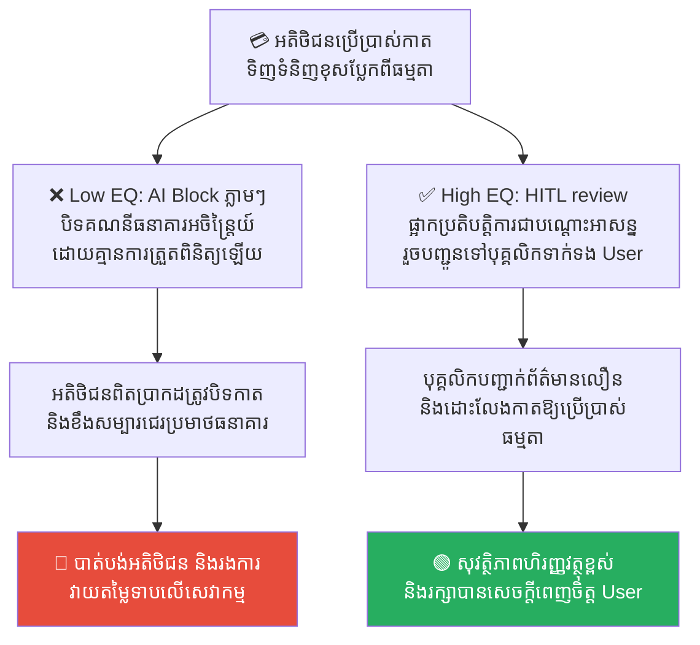
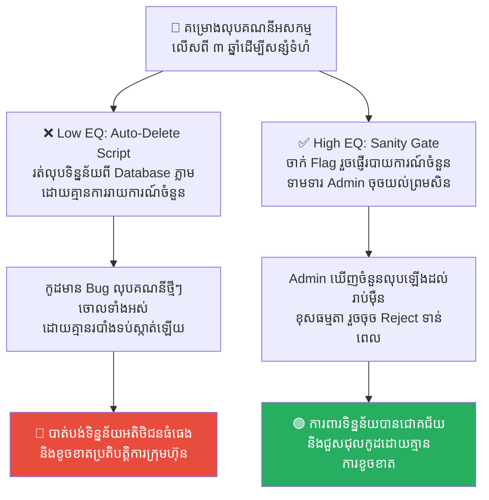
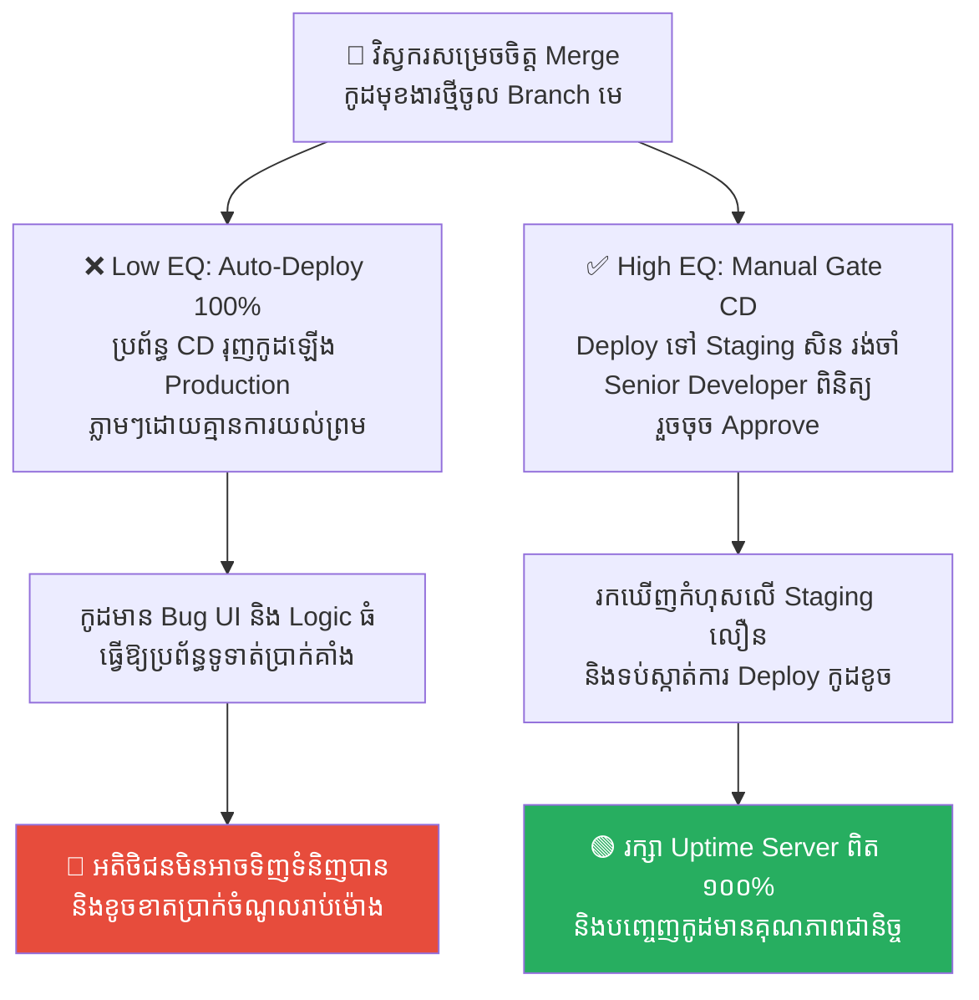
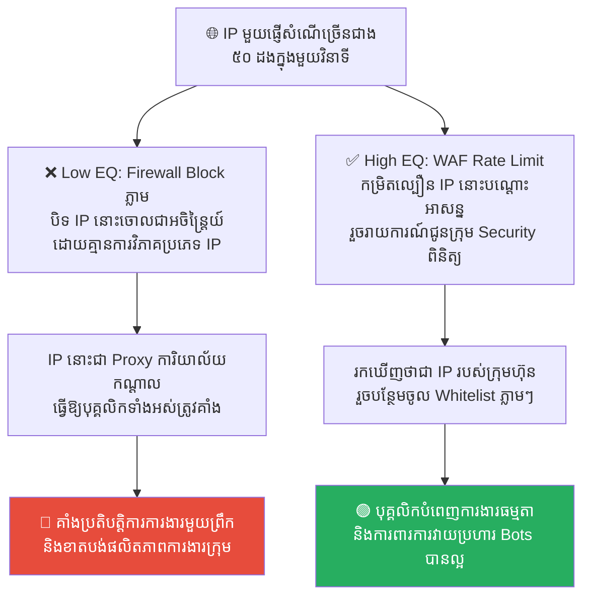
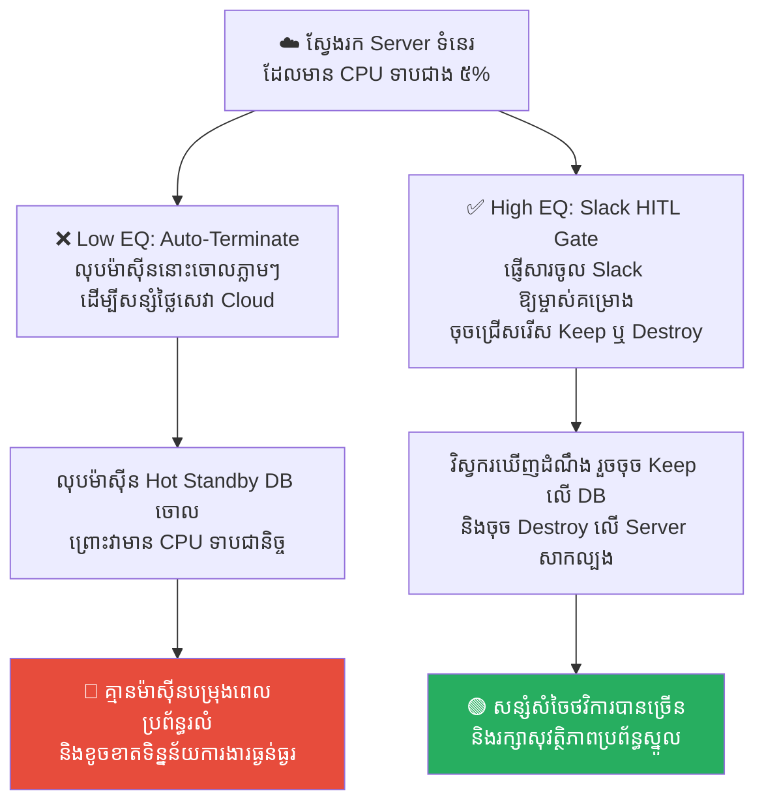

# Stanislav Petrov: Human-in-the-Loop and Automated Systems (ស្តានីស្លាវ ប៉េត្រូវ៖ តួនាទីរបស់មនុស្សក្នុងប្រព័ន្ធស្វ័យប្រវត្តិ)

**Author:** ichamrong  
**Date:** 2026-05-17  
**Tags:** #cold-war #automation #human-in-the-loop #ci-cd #system-design  
**Category:** Concepts  
**Read Time:** ~15 min  

---

## 📌 មាតិកា (Table of Contents)
- [លំនាំបញ្ហា (The Pattern)](#លំនាំបញ្ហា-the-pattern)
- [១. បញ្ហា៖ គ្រោះថ្នាក់នៃស្វ័យប្រវត្តិកម្ម ១០០% និងចន្លោះប្រហោងគ្មានបរិបទ (The Issue: The Danger of 100% Automation and Lack of Context)](#១-បញ្ហា-គ្រោះថ្នាក់នៃស្វ័យប្រវត្តិកម្ម-១០០-និងចន្លោះប្រហោងគ្មានបរិបទ-the-issue-the-danger-of-100-automation-and-lack-of-context)
- [២. ឧទាហរណ៍ជាក់ស្តែងក្នុងពិភពពិត (Real World Examples)](#២-ឧទាហរណ៍ជាក់ស្តែងក្នុងពិភពពិត)
  - [ឧទាហរណ៍ទី ១ — ការបិទគណនីអតិថិជនសង្ស័យបោកប្រាស់ (Fully Automated AI Suspension vs. Human-in-the-Loop Review)](#ឧទាហរណ៍ទី-១--ការបិទគណនីអតិថិជនសង្ស័យបោកប្រាស់-fully-automated-ai-suspension-vs-human-in-the-loop-review)
  - [ឧទាហរណ៍ទី ២ — ការសម្អាតទិន្នន័យចាស់ៗក្នុង Database (Cron Job Auto-Purge vs. Flagging with Human Command Confirmation)](#ឧទាហរណ៍ទី-២--ការសម្អាតទិន្នន័យចាស់ៗក្នុង-database-cron-job-auto-purge-vs-flagging-with-human-command-confirmation)
  - [ឧទាហរណ៍ទី ៣ — ការដំឡើងកូដទៅ Production (100% Automated Deployment vs. Manual Promotion Gate Approval)](#ឧទាហរណ៍ទី-៣--ការដំឡើងកូដទៅ-production-100-automated-deployment-vs-manual-promotion-gate-approval)
  - [ឧទាហរណ៍ទី ៤ — ការទប់ស្កាត់ការវាយប្រហារបណ្តាញ (Fully Automated IP Blocking vs. WAF Rate Limiting & Escalation Alert)](#ឧទាហរណ៍ទី-៤--ការទប់ស្កាត់ការវាយប្រហារបណ្តាញ-fully-automated-ip-blocking-vs-waf-rate-limiting--escalation-alert)
  - [ឧទាហរណ៍ទី ៥ — ការលុប Server ទំនេរដើម្បីសន្សំសំចៃ (Auto-Destroying Cloud Server vs. Pre-destruction Slack Authorization)](#ឧទាហរណ៍ទី-៥--ការលុប-server-ទំនេរដើម្បីសន្សំសំចៃ-auto-destroying-cloud-server-vs-pre-destruction-slack-authorization)
- [៣. កត្តាជម្រុញ៖ ការជឿជាក់លើកូដហួសហេតុ និងភាពខ្ជិលច្រអូស (The Aggravator: Over-Reliance on Code & Cognitive Laziness)](#៣-កត្តាជម្រុញ-ការជឿជាក់លើកូដហួសហេតុ-និងភាពខ្ជិលច្រអូស-the-aggravator-over-reliance-on-code--cognitive-laziness)
- [៤. ដំណោះស្រាយទូទៅ៖ ការបញ្ចូលមនុស្សទៅក្នុងរង្វិលជុំសម្រាប់ការសម្រេចចិត្តធំៗ (The General Solution: Implementing Human-in-the-Loop & Sanity Check Gates)](#៤-ដំណោះស្រាយទូទៅ-ការបញ្ចូលមនុស្សទៅក្នុងរង្វិលជុំសម្រាប់ការសម្រេចចិត្តធំៗ-the-general-solution-implementing-human-in-the-loop--sanity-check-gates)
- [សេចក្តីសន្និដ្ឋាន (Conclusion)](#សេចក្តីសន្និដ្ឋាន-conclusion)
- [Related Posts](#related-posts)

---

## លំនាំបញ្ហា (The Pattern)

នៅពាក់កណ្តាលយប់ថ្ងៃទី ២៦ ខែកញ្ញា ឆ្នាំ ១៩៨៣ ក្នុងកំឡុងពេលកំពូលនៃសង្គ្រាមត្រជាក់ (Cold War) ប្រព័ន្ធកុំព្យូទ័រការពារដែនអាកាសស្វ័យប្រវត្តិរបស់សហភាពសូវៀត ស្រាប់តែបន្លឺសំឡេងរោទិ៍ក្រហមខ្លាំងៗ និងលោតពាក្យព្រមានថា៖ **«LAUNCH» (ការបាញ់មីស៊ីល)**។ ប្រព័ន្ធបានប្រកាសថា សហរដ្ឋអាមេរិកបានបាញ់មីស៊ីលនុយក្លេអ៊ែរចម្ងាយឆ្ងាយ (ICBM) ចំនួន **៥ គ្រាប់** សម្រុកមកកាន់ទឹកដីសូវៀត។

យោងតាមពិធីសារបច្ចេកទេស និងបទបញ្ជាយោធា ប្រព័ន្ធស្វ័យប្រវត្តិនេះតម្រូវឱ្យកងទ័ពសូវៀត បាញ់មីស៊ីលនុយក្លេអ៊ែររាប់ពាន់គ្រាប់តបតទៅកាន់អាមេរិកភ្លាមៗ ដោយគ្មានការរង់ចាំ ដើម្បីការពារខ្លួន។ មន្ត្រីយោធា On-Call ដែលកំពុងកាន់វេនបញ្ជាការនៅយប់នោះ គឺលោកវរសេនីយ៍ទោ **ស្តានីស្លាវ ប៉េត្រូវ (Stanislav Petrov)**។ 

ស្ថិតក្រោមសម្ពាធដ៏ខ្លាំងក្លា និងពេលវេលាត្រឹមតែប៉ុន្មាននាទី ប៉េត្រូវ បានធ្វើការសម្រេចចិត្តដ៏ក្លាហានបំផុតក្នុងប្រវត្តិសាស្ត្រមនុស្សជាតិ គឺ៖ **«ទ្រង់មិនព្រមជឿជាក់លើប្រព័ន្ធកុំព្យូទ័រស្វ័យប្រវត្តិនោះឡើយ»**។ ទ្រង់បានធ្វើការត្រួតពិនិត្យដោយវិចារណញាណ (Sanity Check) និងគិតថា៖
> 💡 **«ប្រសិនបើសហរដ្ឋអាមេរិកពិតជាចង់ចាប់ផ្តើមសង្គ្រាមនុយក្លេអ៊ែរមែន ពួកគេមិនបាញ់មីស៊ីលតែ ៥ គ្រាប់នោះឡើយ។ ពួកគេច្បាស់ជាសម្រុកបាញ់រាប់ពាន់គ្រាប់ដើម្បីបំផ្លាញយើងក្នុងពេលព្រមគ្នា។ ដូច្នេះ នេះច្បាស់ជាកំហុសប្រព័ន្ធកុំព្យូទ័រ (System Bug) ហើយ!»**

ប៉េត្រូវ បានរាយការណ៍ទៅថ្នាក់លើថាវាជាកំហុសប្រព័ន្ធ (False Alarm) និងរារាំងការបាញ់មីស៊ីលតបត។ ក្រោយមក ទើបគេរកឃើញថា ប្រព័ន្ធកុំព្យូទ័ររបស់សូវៀតពិតជាមាន Bug មែន ដោយសារវាអានចំណាំងផ្លាតពន្លឺព្រះអាទិត្យនៅលើពពក ជារូបភាពមីស៊ីល។ ការសម្រេចចិត្តរបស់ ប៉េត្រូវ បានជួយសង្គ្រោះពិភពលោកពីសង្គ្រាមលោកលើកទី ៣។

នៅក្នុងការរចនា និងគ្រប់គ្រងប្រព័ន្ធបច្ចេកវិទ្យាទំនើប យើងតែងតែជួបប្រទះស្ថានភាពស្រដៀងគ្នានេះជានិច្ច៖
*   ការជឿជាក់ និងការផ្ទេរការសម្រេចចិត្តដ៏គ្រោះថ្នាក់ទៅឱ្យកូដស្វ័យប្រវត្តិ (Automation) ១០០%។
*   ការខ្វះប្រព័ន្ធការពារ ឬយន្តការផ្ទៀងផ្ទាត់ដោយមនុស្ស (Human-in-the-Loop) ដែលនាំទៅរកគ្រោះមហន្តរាយនៅពេលដែលម៉ាស៊ីនផ្តល់សញ្ញាខុស (False Positives)។

---

## ១. បញ្ហា៖ គ្រោះថ្នាក់នៃស្វ័យប្រវត្តិកម្ម ១០០% និងចន្លោះប្រហោងគ្មានបរិបទ (The Issue: The Danger of 100% Automation and Lack of Context)

នៅក្នុងវិស័យវិស្វកម្ម ស្វ័យប្រវត្តិកម្ម (Automation) គឺជាគោលដៅដ៏អស្ចារ្យដែលជួយសម្រាលការងារមនុស្ស និងបង្កើនល្បឿនយ៉ាងខ្លាំង។ ប៉ុន្តែ ម៉ាស៊ីន ឬកូដ (Algorithms) មានចំណុចខ្សោយដ៏ធំមួយគឺ៖ **«ពួកវាគ្មានបរិបទ (Context) និងវិចារណញាណ (Intuition) ដូចមនុស្សឡើយ»**។

កំហុសឆ្គងដ៏ធំបំផុតនៅក្នុងការរចនាប្រព័ន្ធ គឺការបង្កើតស្វ័យប្រវត្តិកម្ម ១០០% ចំពោះសកម្មភាពដែលមានលក្ខណៈបំផ្លិចបំផ្លាញ (Destructive Actions) ដូចជា៖
*   ការលុបទិន្នន័យ (Data Deletion) ដោយគ្មានការផ្ទៀងផ្ទាត់ជាមុន។
*   ការបិទ ឬ Lock គណនីអតិថិជនរាប់ម៉ឺននាក់ដោយស្វ័យប្រវត្តិ ពេលរកឃើញសកម្មភាពខុសប្រក្រតីបន្តិចបន្តួច។
*   ការដំឡើងកូដទៅ Production System ភ្លាមៗដោយគ្មានការយល់ព្រមពីអ្នកជំនាញ។

នៅពេលដែលម៉ាស៊ីនផ្តល់សញ្ញាខុស (False Positive) ហើយគ្មាន «មនុស្សនៅក្នុងរង្វិលជុំ» (Human-in-the-Loop) ដើម្បីចុចបដិសេធ (Reject) ឬផ្អាកនោះទេ ម៉ាស៊ីននឹងបំពេញការងារបំផ្លាញអាជីវកម្មរបស់ក្រុមហ៊ុនឱ្យរលាយត្រឹមតែមួយវិនាទី។

---

## ២. ឧទាហរណ៍ជាក់ស្តែងក្នុងពិភពពិត

សូមពិនិត្យមើល **ឧទាហរណ៍ជាក់ស្តែងចំនួន ៥** បង្ហាញពីគ្រោះថ្នាក់នៃស្វ័យប្រវត្តិកម្មគ្មានការគ្រប់គ្រង និងដំណោះស្រាយ HITL៖

---

### ឧទាហរណ៍ទី ១ — ការបិទគណនីអតិថិជនសង្ស័យបោកប្រាស់ (Fully Automated AI Suspension vs. Human-in-the-Loop Review)

**ស្ថានភាព៖** ធនាគារឌីជីថល ចង់ទប់ស្កាត់ការប្រើប្រាស់គណនីបោកប្រាស់ និងសកម្មភាពហិរញ្ញវត្ថុមិនស្របច្បាប់។

*   **សកម្មភាពអសកម្ម / Low EQ / កំហុសឆ្គង (ស្វ័យប្រវត្តិកម្ម ១០០% គ្មានបរិបទ)៖** វិស្វករកំណត់ឱ្យ AI/Algorithm ធ្វើការបិទ (Block) គណនីអតិថិជនទាំងស្រុងជាអចិន្ត្រៃយ៍ដោយស្វ័យប្រវត្ត ប្រសិនបើរាវរកឃើញសកម្មភាពទូទាត់គួរឱ្យសង្ស័យ (ដូចជា អតិថិជនធ្វើដំណើរទៅក្រៅប្រទេសហើយប្រើកាតទិញទំនិញច្រើនខុសពីធម្មតា)។
*   **សកម្មភាពស្ថាបនា / High EQ / ដំណោះស្រាយ (មនុស្សនៅក្នុងរង្វិលជុំ)៖** អនុវត្ត **Human-in-the-Loop (HITL) Fraud Flags**។ កំណត់ឱ្យប្រព័ន្ធស្វ័យប្រវត្តធ្វើការផ្អាកប្រតិបត្តិការបណ្តោះអាសន្ន (Temporary Hold) រួចផ្ញើទិន្នន័យគួរឱ្យសង្ស័យនោះទៅកាន់ក្រុមការងារ Security ឱ្យត្រួតពិនិត្យ និងទាក់ទងទៅអតិថិជនផ្ទាល់ ដើម្បីបញ្ជាក់មុននឹងបិទគណនីជាស្ថាពរ។
*   **លទ្ធផល៖** ការបិទគណនីស្វ័យប្រវត្តធ្វើឱ្យអតិថិជនពិតប្រាកដរាប់ពាន់នាក់ (False Positives) ត្រូវរងការរំខាន បង្កជាកំហឹង និងការប្តឹងផ្តល់ធ្ងន់ធ្ងរ។ វិធីសាស្ត្រ HITL ជួយធានាសុវត្ថិភាពផង និងផ្ដល់បទពិសោធន៍ដ៏ល្អដល់អតិថិជនផង។

---

### ឧទាហរណ៍ទី ២ — ការសម្អាតទិន្នន័យចាស់ៗក្នុង Database (Cron Job Auto-Purge vs. Flagging with Human Command Confirmation)

**ស្ថានភាព៖** កម្មវិធីចង់សម្អាតគណនីដែលលែងដំណើរការ (Inactive Accounts) ដែលមិនដែលធ្លាប់បាន Login សោះលើសពី ៣ ឆ្នាំ ដើម្បីសន្សំទំហំផ្ទុកទិន្នន័យ Database។

*   **សកម្មភាពអសកម្ម / Low EQ / កំហុសឆ្គង (ស្វ័យប្រវត្តិកម្ម ១០០% គ្មានបរិបទ)៖** វិស្វករសរសេរកូដ Script ស្វ័យប្រវត្ត (Cron Job) ឱ្យដំណើរការរត់លុប (DELETE) រាល់គណនីទាំងនោះចោលពី Database ជារៀងរាល់យប់ថ្ងៃចន្ទ ដោយគ្មានការផ្ទៀងផ្ទាត់ឡើយ។
*   **សកម្មភាពស្ថាបនា / High EQ / ដំណោះស្រាយ (មនុស្សនៅក្នុងរង្វិលជុំ)៖** អនុវត្ត **Automated Purge Flagging with Human Sanity Check Gates**។
    1. កំណត់ឱ្យ Script ស្វ័យប្រវត្តគ្រាន់តែវាយ Flag សម្គាល់គណនីដែលត្រូវលុប (ឧទាហរណ៍ `status = 'pending_delete'`)។
    2. ផ្ញើរបាយការណ៍សរុប (Summary Report) ទៅកាន់ Admin Dashboard (ឧទាហរណ៍៖ *«មានគណនីចំនួន ១,២០០ ដែលត្រូវលុប»*)។
    3. ទាមទារឱ្យប្រធានផ្នែកបច្ចេកវិទ្យា (CTO) ពិនិត្យបញ្ជី និងចុចប៊ូតុង [Approve] ទើបប្រព័ន្ធធ្វើការលុបពិតប្រាកដ។
*   **លទ្ធផល៖** កំហុសកូដ (Bug in Date comparison) ធ្វើឱ្យ Script ស្វ័យប្រវត្តលុបគណនីអតិថិជនដែលទើបតែចុះឈ្មោះថ្មីៗទាំងអស់ចោល ធ្វើឱ្យបាត់បង់ទិន្នន័យធំធេង។ ការមាន HITL ជួយឱ្យរកឃើញកំហុសចំនួនទិន្នន័យ (Sanity Check) មុនការលុប និងការពារគ្រោះថ្នាក់។

---

### ឧទាហរណ៍ទី ៣ — ការដំឡើងកូដទៅ Production (100% Automated Deployment vs. Manual Promotion Gate Approval)

**ស្ថានភាព៖** ក្រុមហ៊ុនចង់បញ្ចេញមុខងារថ្មីៗទៅកាន់គេហទំព័រឱ្យបានលឿនបំផុត ដើម្បីប្រកួតប្រជែងទីផ្សារ។

*   **សកម្មភាពអសកម្ម / Low EQ / កំហុសឆ្គង (ស្វ័យប្រវត្តិកម្ម ១០០% គ្មានបរិបទ)៖** វិស្វកររៀបចំប្រព័ន្ធ CD ឱ្យរុញកូដទៅកាន់ Production Server ដោយស្វ័យប្រវត្តិភ្លាមៗរាល់ពេលកូដត្រូវបាន Merge ចូល Branch មេ ព្រោះយល់ថា៖ *«យើងមាន Unit Tests ល្អហើយ មិនបាច់រង់ចាំមនុស្សឡើយ!»*។
*   **សកម្មភាពស្ថាបនា / High EQ / ដំណោះស្រាយ (មនុស្សនៅក្នុងរង្វិលជុំ)៖** អនុវត្ត **Mandatory Manual Gate in CI/CD (Production Promotion Gate)**។ កូដត្រូវបានតេស្ត និងដំឡើងទៅកាន់ Staging Environment (បរិយាកាសតេស្ត) ដោយស្វ័យប្រវត្តិ ប៉ុន្តែប្រព័ន្ធទាមទារឱ្យ Senior Developer ឬ Product Manager ចុចប៊ូតុង [Approve Production Deploy] ជាមុនសិន បន្ទាប់ពីបានចុះតេស្តមើលដោយភ្នែកផ្ទាល់រួចរាល់។
*   **លទ្ធផល៖** ពេល Unit tests មិនបានគ្របដណ្តប់ Bug សោភ័ណភាព UI ឬកូដ error logic ធ្វើឱ្យប្រព័ន្ធគាំងភ្លាមៗនៅពេលឡើង Production ធ្លាក់ដល់ដៃអតិថិជន។ ការប្រើ HITL Gate ជួយធានាសុវត្ថិភាព និងភាពត្រឹមត្រូវនៃផលិតផលចុងក្រោយ។

---

### ឧទាហរណ៍ទី ៤ — ការទប់ស្កាត់ការវាយប្រហារបណ្តាញ (Fully Automated IP Blocking vs. WAF Rate Limiting & Escalation Alert)

**ស្ថានភាព៖** ប្រព័ន្ធការពារវេបសាយ (WAF - Web Application Firewall) ត្រូវការទប់ស្កាត់ការវាយប្រហារបដិសេធសេវាកម្ម (DDoS/Bots)។

*   **សកម្មភាពអសកម្ម / Low EQ / កំហុសឆ្គង (ស្វ័យប្រវត្តិកម្ម ១០០% គ្មានបរិបទ)៖** កំណត់ឱ្យ Firewall ធ្វើការ Block (បិទចោល) រាល់ IP Address ណាដែលផ្ញើសំណើ (Requests) លើសពី ៥០ ដងក្នុងមួយវិនាទីដោយស្វ័យប្រវត្តិ និងជាអចិន្ត្រៃយ៍ ដើម្បីការពារ Server។
*   **សកម្មភាពស្ថាបនា / High EQ / ដំណោះស្រាយ (មនុស្សនៅក្នុងរង្វិលជុំ)៖** អនុវត្ត **Automated Rate Limiting and Threat Escalation to Security Team**។ កំណត់ឱ្យប្រព័ន្ធធ្វើការកម្រិតល្បឿនបណ្តោះអាសន្ន (Throttling/Rate Limiting) រួចផ្ញើ Alert ទៅកាន់ក្រុមការងារ Security ឱ្យត្រួតពិនិត្យ។ ប្រសិនបើ IP នោះជា Office IP របស់ក្រុមហ៊ុន ឬជា VPN របស់បុគ្គលិក ពួកគេអាចបន្ថែមទៅក្នុង Whitelist។
*   **លទ្ធផល៖** Firewall ស្វ័យប្រវត្តបាន Block IP របស់ការិយាល័យកណ្តាលរបស់ក្រុមហ៊ុនទាំងស្រុង ធ្វើឱ្យបុគ្គលិករាប់ពាន់នាក់មិនអាចចូលបំពេញការងារបានពេញមួយព្រឹក។ ដំណោះស្រាយ Throttling & Human review ជួយទប់ស្កាត់ Bots ផង និងមិនរំខានដល់ប្រតិបត្តិការផ្ទៃក្នុងឡើយ។

---

### ឧទាហរណ៍ទី ៥ — ការលុប Server ទំនេរដើម្បីសន្សំសំចៃ (Auto-Destroying Cloud Server vs. Pre-destruction Slack Authorization)

**ស្ថានភាព៖** ក្រុមហ៊ុនចង់កាត់បន្ថយការចំណាយថ្លៃ Cloud Servers ដោយការស្វែងរក និងលុបចោលរាល់ម៉ាស៊ីន Servers ណាដែលទំនេរ លែងមានសកម្មភាព (Idle Resources)។

*   **សកម្មភាពអសកម្ម / Low EQ / កំហុសឆ្គង (ស្វ័យប្រវត្តិកម្ម ១០០% គ្មានបរិបទ)៖** វិស្វករដំឡើង Script ស្វ័យប្រវត្តឱ្យស្វែងរក និងលុប (Terminate) គ្រប់ច្បាប់ចម្លង Server ណាដែលមាន CPU usage ក្រោម ៥% រយៈពេលមួយសប្តាហ៍ ដោយគ្មានការជូនដំណឹងជាមុនឡើយ។
*   **សកម្មភាពស្ថាបនា / High EQ / ដំណោះស្រាយ (មនុស្សនៅក្នុងរង្វិលជុំ)៖** អនុវត្ត **Automated Inspection with Slack Notification & Human Authorization Gate**។ Script ស្វ័យប្រវត្តស្វែងរក resources គួរឱ្យសង្ស័យ រួចផ្ញើបញ្ជីឈ្មោះចូល Slack channel គួបផ្សំនឹងប៊ូតុង `[Keep]` ឬ `[Destroy]` ដើម្បីឱ្យម្ចាស់គម្រោងនីមួយៗជ្រើសរើសដោយខ្លួនឯង។
*   **លទ្ធផល៖** Script ស្វ័យប្រវត្តបានលុប Server បម្រុង (Standby Server) ដ៏សំខាន់របស់ក្រុមហ៊ុនចោល ព្រោះវាជាម៉ាស៊ីនបម្រុងដែលមាន CPU ទាបជានិច្ច ធ្វើឱ្យប្រព័ន្ធរងគ្រោះអសមត្ថភាពពេលមានអាសន្ន។ វិធីសាស្ត្រ HITL ធានាបាននូវការសន្សំសំចៃផង និងការពារស្ថិរភាពស្នូលរបស់ប្រព័ន្ធ។

---

## ៣. កត្តាជម្រុញ៖ ការជឿជាក់លើកូដហួសហេតុ និងភាពខ្ជិលច្រអូស (The Aggravator: Over-Reliance on Code & Cognitive Laziness)

ហេតុអ្វីបានជាយើងងាយនឹងផ្ទេរការសម្រេចចិត្តដ៏គ្រោះថ្នាក់ទៅឱ្យកូដស្វ័យប្រវត្ត ១០០% ខ្លាំងម្ល៉េះ? កត្តាជម្រុញរួមមាន៖

1.  **ការទុកចិត្តម៉ាស៊ីនហួសកម្រិត (Automation Bias)៖** ផ្នត់គំនិតរបស់មនុស្សដែលតែងតែយល់ថា៖ *«កុំព្យូទ័រ ឬ AI គឺមិនចេះខុសឡើយ ពួកវាច្បាស់ជាសម្រេចចិត្តត្រឹមត្រូវជាងមនុស្ស!»* ដោយមើលរំលងភាពស្មុគស្មាញនៃជីវិតពិត។
2.  ** ភាពខ្ជិលច្រអូសផ្នែកស្មារតី (Cognitive Laziness)៖** ការយល់ព្រមឱ្យកូដសម្រេចចិត្តជំនួស ជួយឱ្យយើងមិនបាច់នឿយហត់ក្នុងការអង្គុយពិនិត្យទិន្នន័យ និងសម្រេចចិត្តដោយខ្លួនឯង ដែលជាការគេចវេសពីការទទួលខុសត្រូវ។
3.  ** សម្ពាធចង់បានល្បឿន និងប្រសិទ្ធភាព (Speed & Friction Reduction Pressure)៖** ការចង់បានដំណើរការការងារដែលលឿន និងគ្មានការរាំងស្ទះ (Frictionless) ធ្វើឱ្យក្រុមហ៊ុនសម្រេចចិត្តដក «មនុស្ស» ចេញពីប្រព័ន្ធទាំងស្រុង ដើម្បីកុំឱ្យខាតពេលវេលាចុចយល់ព្រម។

---

## ៤. ដំណោះស្រាយទូទៅ៖ ការបញ្ចូលមនុស្សទៅក្នុងរង្វិលជុំសម្រាប់ការសម្រេចចិត្តធំៗ (The General Solution: Implementing Human-in-the-Loop & Sanity Check Gates)

ដើម្បីរចនាប្រព័ន្ធការងារដែលមានសុវត្ថិភាពខ្ពស់ និងជៀសវាងមហន្តរាយពីស្វ័យប្រវត្តិកម្ម ចូរអនុវត្តគោលការណ៍ **Human-in-the-Loop (HITL)** ដូចខាងក្រោម៖

1.  ** បែងចែកកម្រិតហានិភ័យនៃការសម្រេចចិត្ត (Categorize Decision Risk)៖**
    *   *Low Risk (ហានិភ័យទាប):* ទុកឱ្យស្វ័យប្រវត្តិកម្មដំណើរការ ១00% (ដូចជា ការបង្កើត logs, ការផ្ញើ email ស្វាគមន៍)។
    *   *High Risk / Destructive (ហានិភ័យខ្ពស់/បំផ្លិចបំផ្លាញ):* ត្រូវតែមាន **Human-in-the-Loop** ជានិច្ច (ដូចជា ការលុបទិន្នន័យ, ការបិទគណនី, ការដំឡើងកូដទៅ Production)។
2.  ** បង្កើត Sanity Check Gates ស្វ័យប្រវត្តិ៖** មុននឹងអនុញ្ញាតឱ្យសកម្មភាពណាមួយដំណើរការ ចូរឱ្យកុំព្យូទ័រធ្វើការផ្ទៀងផ្ទាត់ចំនួនទិន្នន័យ (ដូចជា៖ *ប្រសិនបើចំនួនគណនីដែលត្រូវលុបលើសពី ១០% នៃគណនីសរុប ត្រូវកាត់ផ្តាច់ Pipeline និងផ្ញើសារប្រកាសអាសន្នភ្លាមៗ*)។
3.  ** ផ្តល់ព័ត៌មាន និងបរិបទគ្រប់គ្រាន់ដល់មនុស្ស (Rich Context Alerts)៖** នៅពេលប្រព័ន្ធទាមទារការយល់ព្រមពីមនុស្ស (Approve/Reject) ត្រូវធានាថាសារ Alert នោះផ្តល់ព័ត៌មានលម្អិត និងបរិបទគ្រប់គ្រាន់ ដើម្បីជួយឱ្យមនុស្សអាចធ្វើការសម្រេចចិត្តបានត្រឹមត្រូវក្នុងរយៈពេលខ្លី (ដូចជា៖ បង្ហាញឈ្មោះ Server, មូលហេតុសង្ស័យ, ដែនប៉ះពាល់)។
4.  ** កសាងវប្បធម៌ «ហ៊ានសង្ស័យលើម៉ាស៊ីន»៖** បណ្តុះបណ្តាលវិស្វករឱ្យចេះធ្វើការត្រួតពិនិត្យដោយវិចារណញាណ (Sanity Check) ជានិច្ចនៅពេលដែល Monitoring System លោតសារចម្លែកៗ។ កុំប្រញាប់អនុវត្តតាមបញ្ជារបស់កុំព្យូទ័រទាំងងងឹតងងុល។

---

## សេចក្តីសន្និដ្ឋាន (Conclusion)

**ស្តានីស្លាវ ប៉េត្រូវ និងតួនាទីរបស់មនុស្សក្នុងប្រព័ន្ធស្វ័យប្រវត្តិ (Human-in-the-Loop)** បង្រៀនយើងថា នៅក្នុងយុគសម័យបច្ចេកវិទ្យាទំនើប និង AI ស្វ័យប្រវត្តិកម្មដ៏ឆ្លាតវៃពិតប្រាកដមិនមែនជាការលុបបំបាត់តួនាទីរបស់មនុស្សទាំងស្រុងនោះឡើយ។ សុវត្ថិភាព និងស្ថិរភាពប្រព័ន្ធពិតប្រាកដ កើតឡើងចេញពី **«ការរួមបញ្ចូលគ្នាដ៏ល្អឥតខ្ចោះរវាងល្បឿន និងភាពទៀងទាត់របស់កុំព្យូទ័រ គួបផ្សំនឹងបរិបទ វិចារណញាណ និងការទទួលខុសត្រូវខ្ពស់របស់មនុស្សជាតិ»**។

ចងចាំជានិច្ចថា៖ **«ចូរទុកឱ្យកុំព្យូទ័រជាអ្នករាយការណ៍ និងស៊ើបអង្កេត ប៉ុន្តែចូររក្សាតួនាទីចុចកុងតាក់ចុងក្រោយសម្រាប់មនុស្សជាតិ។»**

---

## Related Posts

*   **[22 The Black Swan and Unexpected Failures](./22-the-black-swan.md)** — របៀបដែលម៉ាស៊ីនមិនអាចទស្សន៍ទាយ ឬគ្រប់គ្រងព្រឹត្តិការណ៍ដែលមិនធ្លាប់កើតមានពីមុនមក។
*   **[38 Apollo 13: Incident Response and Blameless Post-Mortems](./38-apollo-13-and-incident-response.md)** — របៀបដោះស្រាយវិបត្តិប្រព័ន្ធដោយផ្អែកលើការត្រួតពិនិត្យ និងការងារក្រុមច្បាស់លាស់។

---

*Last updated: 2026-05-26*
