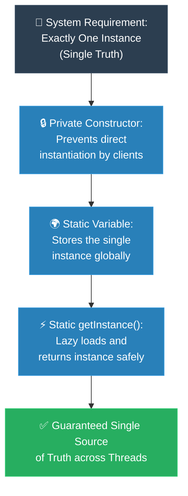

# MIT Professor: Singleton (គោល​ការ​ណ៍គ្រឹះដំបូង​នៃ Singleton)

**Author:** ichamrong  
**Date:** 2026-05-18  
**Tags:** #mit-professor #first-principles #design-patterns #singleton #clean-code  
**Category:** Concepts / MIT Professor  
**Read Time:** ~5 min  

---

## 📌 មាតិកា (Table of Contents)
- [១. បញ្ហា​ស្នូល (The Core Problem)](#១-បញ្ហាស្នូល-the-core-problem)
- [២. ការ​ទាញហេតុផល​ពី​គោល​ការ​ណ៍គ្រឹះ (First Principles Derivation)](#២-ការទាញហេតុផលពីគោលការណ៍គ្រឹះ-first-principles-derivation)
- [៣. ស្ថាបត្យកម្​មក​ូដគំរូ (Code Architecture)](#៣-ស្ថាបត្យកម្មកូដគំរូ-code-architecture)
- [៤. ដ្យាក្រាមលំហូរ (Visual Derivation)](#៤-ដ្យាក្រាមលំហូរ-visual-derivation)
- [៥. Related Posts](#៥-related-posts)

---

## ១. បញ្ហា​ស្នូល (The Core Problem)

ខ្ញុំសូមចាប់ផ្​តើ​ម​ដោយ​សំណួរមួយ។ ស្រមៃថា​កម្មវិធី​របស់​អ្នក​មាន Printer Spooler តែ​មួយ មាន Database Connection Pool តែ​មួយ ឬ​មាន​ឯកសារ Configuration ដែល​ផ្ទុក​ក្នុង​អង្គចងចាំ​តែ​មួយ។ ផ្នែកមួយ​នៃ​ប្រព័ន្ធ​ស្នើសុំវា ហើយមួយភ្លែត​ក្រោយ​មក — នៅកន្លែងផ្សេងទៀតទាំងស្រុង — ផ្នែកមួយទៀតក៏ស្នើសុំវាដែរ។ តើ​អ្នក​ធានា​ដោយ​របៀបណាថា ផ្នែកទាំង​ពី​រ​នេះ​កំពុងនិយាយអំ​ពី​វត្ថុ (Object) *ដូចគ្នា* មិន​មែនច្បាប់ចម្លង​ពី​រផ្សេងគ្នា ដែល​ត្រូវ​បាន​បង្កើត​ឡើង​ដោយ​ស្ងាត់ ៗ នោះ​ទេ?

សូមចងចាំសំណួរ​នេះ​ទុក ព្រោះ​បញ្ហា​នេះ​មាន​ភាពលាក់កំបាំង និង​គ្រោះថ្នាក់បំផុត។ នៅ​ពេល​ដែល​កូដ​ពី​រផ្នែក​បង្កើត​ច្បាប់ចម្លងផ្ទាល់ខ្លួន​របស់ «the» connection pool នោះ គ្មាន​អ្វីខូចភ្លាម ៗ ឡើយ។ កម្មវិធី​ដំណើរ​ការ។ Unit Test ក៏​ជា​ប់ (Pass)។ ប៉ុន្តែ​បន្ទាប់​មក​នៅក្នុង​បរិស្ថាន Production ក្រោម​បន្ទុកប្រតិបត្តិ​ការ (Load) ធ្ងន់ អ្នក​នឹងជួបនូវកំហុស (Bug) ដែល​ធ្វើ​ឱ្យសប្តាហ៍​របស់​អ្នក​វឹកវរ៖ មេម៉ូរីហូរហៀរ (Memory Exhaustion), Port Hardware ជា​ប់គាំង (Deadlock), ឬ Cache ពី​រ​ដែល​ផ្ទុយគ្នាអំ​ពី​ការ​ពិត។ គ្មាន​នរណាម្នាក់​សរសេរ​កំហុស​នេះ​ដោយ​ផ្ទាល់​ឡើយ។ កំហុស​នេះ​គឺជា​បញ្ហា *រចនាសម្ព័ន្ធ (Structural Bug)* — វាកើតចេញ​ពី​ការ​ពិត​ដែល​ថា ភាសា​សរសេរ​កម្មវិធី​បាន​អនុញ្ញាតឱ្យ​ការ​បង្កើត​ច្បាប់ចម្លងអាច​មាន​វត្ត​មាន​តាំង​ពី​ដំបូង។

ដូច្​នេះ យើង​ចង់​គ្រប់​គ្រងធនធានរួមគ្នា (Shared Resources) (ដូចជា Database Connection Pool ឬ Hardware Port) ដែល​ការ​បង្កើត Object ច្រើននឹងបណ្តាលឱ្យខ្ជះខ្​ជា​យធនធាន ការ​ជា​ប់គាំងខ្សែស្រឡាយដំណើរ​ការ (Thread Lockups) ឬ​ស្ថានភាព​ទិន្នន័យ​មិន​ស៊ីសង្វាក់គ្នា (Inconsistent State)។ យើង​ត្រូវ​ការ "ប្រភព​នៃ​ការ​ពិត​តែ​មួយគត់" (Single Source of Truth)។

---

## ២. ការ​ទាញហេតុផល​ពី​គោល​ការ​ណ៍គ្រឹះ (First Principles Derivation)

យើង​កុំ​ទន្ទេញ​ដំណោះស្រាយ​ឡើយ។ ចូរយើង *ទាញវាចេញ* ដោយ​ចាប់ផ្​តើ​ម​ពី​របៀប​ដែល​ម៉ាស៊ីន​ពិត​ជា​ដំណើរ​ការ ហើយមើលថា តើ​ទម្រង់​នេះ (Pattern) ត្រូវ​បាន​បង្ខំឱ្យកើតឡើង​លើ​យើង​ឬ​អត់។

**ចាប់ផ្​តើ​ម​ពី​ការ​ពិត​មួយអំ​ពី​ម៉ាស៊ីន (The Axiom of Instantiation)៖** រាល់​ពេល​ដែល​អ្នក​សរសេរ​ពាក្យគន្លឹះ `new` កុំ​ព្យូទ័រកាត់យកប្លុកមេម៉ូរី​ថ្មី​មួយ ដែល​ដាច់ដោយឡែក​ពី​គ្នាទាំងស្រុងនៅ​លើ Heap Memory។ នេះ​មិន​មែន​ជា​ជម្រើសរចនាបថ​ឡើយ — វា​ជា *អត្ថន័យដាច់ខាត* របស់​ពាក្យ `new`។ ដូច្​នេះ ប្រសិនបើតម្រូវ​ការ​របស់​យើង​គឺ «ត្រូវ​មាន​វត្ថុ​នេះ​តែ​មួយគត់» នោះ​រាល់​ការ​ហៅ `new` ដោយ​សេរី គឺជា​ការ​គំរា​មក​ំហែងផ្ទាល់ដល់តម្រូវ​ការ​នោះ។ គ្រោះថ្នាក់​នេះ​មិន​មែន​ជា​រឿងស្​មាន​នោះ​ទេ — វា​បាន​កប់ខ្លួន​យ៉ាង​ជ្រៅ​នៅក្នុង​ពាក្យគន្លឹះ​នេះ​តែ​ម្តង។

**ឥឡូវ​នេះ សូមសួរសំណួរ​ដែល​ធ្វើ​ឱ្យយើង​មិន​ស្រួល​ក្នុង​ចិត្ត៖** តើ​មាន​អ្វីបច្ចុប្បន្ន​នេះ ដែល​រារាំង Developer ណាម្នាក់ នៅកន្លែងណាមួយ​ក្នុង​កូដ (Codebase) មិន​ឱ្យវាយ `new ConnectionPool()` ជា​លើ​កទី​ពី​រ? និយាយឱ្យត្រង់​ទៅ — ចម្​លើ​យ​គឺ *គ្មាន​អ្វីទាល់​តែ​សោះ*។ Constructor គឺ `public` ដូច្​នេះ​ទ្វារនៅបើកចំហរ​ជា​និច្ច។ ដរាបណាទ្វារ​នោះ​នៅបើកចំហ គ្មាន​វិន័យ (Discipline) ឬ​ឯកសារណែនាំ (Documentation) ណាមួយអាចសង្គ្រោះយើង​បាន​ឡើយ — នឹង​មាន​នរណាម្នាក់ នៅថ្ងៃណាមួយ ដើរចូល​តាម​ទ្វារ​នោះ​ជា​មិន​ខាន។

**ដូច្​នេះ តម្រូវ​ការ​នេះ​ក៏​សរសេរ​ខ្លួនវាឡើងវិញ​ដោយ​ស្ងាត់ ៗ ៖** «ធានាឱ្យ​មាន Instance តែ​មួយ» តាម​ពិត​មាន​ន័យថា «ដកចេញ​ពី​អ្នក​ដទៃ​ទាំងអស់​នូវ *អំណាច* ក្នុង​ការ​បង្កើត Instance»។ យើង​មិន​សុំអង្វរឱ្យគេ​កុំ​ហៅ `new` ឡើយ — យើង​ធ្វើ​ឱ្យវា​មិន​អាច​ទៅ​រួច​តែ​ម្តង។ យើង​ត្រូវ​ចាក់សោ Constructor៖ ផ្លាស់ប្តូរវា​ទៅ​ជា `private`។

**ប៉ុន្តែ​ឥឡូវ​នេះ យើង​បាន​បង្កើត​បញ្ហា​ថ្មី​មួយ មែនទេ?** បើទ្វារ​ត្រូវ​បាន​ចាក់សោរ តើ​នរណាអាចទាញយក Object នោះ​មក​ប្រើ​បាន? យើង​បាន​ការ​ពារធនធាន​នេះ​យ៉ាង​ជិតស្និទ្ធ រហូតដល់​គ្មាន​នរណាម្នាក់អាចចូលដល់វា​បាន។ ដំណោះស្រាយ​នេះ​ហើយ ជា​គន្លឹះ​ទាំងស្រុង៖ ប្រសិនបើ Class នោះ ជា​អ្នក​តែ​មួយគត់​ដែល​ត្រូវ​បាន​អនុញ្ញាតឱ្យ​បង្កើត​ខ្លួនឯង នោះ *Class នោះ​ផ្ទាល់* ត្រូវតែ​ជា​អ្នក​ប្រគល់ Instance ចេញ​មក​ក្រៅ។ យើងបន្ថែមច្រកទ្វារ​ដែល​គ្រប់​គ្រង​បាន​មួយ — គឺ​មុខងារ `public static` (ជា​ទូ​ទៅ​ដាក់ឈ្មោះថា `getInstance()`) — ដែល​ធ្វើ​ការ​ងារកត់ត្រា ដែល​គ្មាន​នរណាផ្សេងអាចទុកចិត្ត​បាន៖ ពេល​ហៅ​លើ​កដំបូង វា​បង្កើត Instance តែ​មួយ​នោះ រួចរក្សាទុក​ក្នុង Static Variable; រាល់​ពេល​ក្រោយ ៗ មក វាប្រគល់ Instance ដ​ដែល​នោះ​ត្រឡប់​ទៅ​វិញ។

នេះ​ហើយ គឺជា Pattern ដែល​ត្រូវ​បាន *ទាញចេញ (Derived)* មិន​មែនទន្ទេញ៖ ចាក់សោរ​ការ​បង្កើត​កុំ​ឱ្យសេរី រួចបើកច្រកទ្វារ​តែ​មួយគត់ ដែល​ធានាភាពដូចគ្នា។ សូ​មក​ត់សម្គាល់ថា យើង​មិន​ដែល *ជ្រើសរើស* Singleton ឡើយ — អាកប្បកិរិយា​របស់​កុំ​ព្យូទ័រ បូកនឹងតម្រូវ​ការ​របស់​យើង បាន​បិទផ្លូវរហូតយើង​គ្មាន​ជម្រើសអ្វីផ្សេងទៀត​ឡើយ។

---

## ៣. ស្ថាបត្យកម្​មក​ូដគំរូ (Code Architecture)

ខាងក្រោម​នេះ គឺជា​ការ​ទាញហេតុផល​របស់​យើង ដែល​ត្រូវ​បាន​បកប្រែ​ទៅ​ជា​ភាសា Java៖ ចាក់សោ Constructor រួចបើកច្រក `getInstance()` តែ​មួយ ដែល​មាន​សុវត្ថិភាពចំពោះ Thread (Thread-Safe)។ យើងប្រើបច្ចេកទេស **Double-Checked Locking (DCL)** ជា​មួយ `volatile` ដើម្បី​ឱ្យ Thread ច្រើន​មិន​បង្កើត Instance ច្រើន​ក្នុង​ពេល​តែ​មួយ ខណៈ​ពេល​ដែល​នៅ​តែ​រក្សា​បាន​នូវល្បឿន​លឿន (Performance)។

```java
public final class ConnectionPool {

    // volatile ធានាថា thread ទាំងអស់ឃើញ instance ដូចគ្នាភ្លាមៗ (ទប់ស្កាត់បញ្ហា CPU Cache ទិន្នន័យចាស់)
    private static volatile ConnectionPool instance;

    // ចាក់សោទ្វារ៖ គ្មាននរណាអាចហៅ new ConnectionPool() ពីខាងក្រៅបានឡើយ
    private ConnectionPool() {
        // ការពារការប្រើប្រាស់ Reflection API ដើម្បីបំបែកសោ
        if (instance != null) {
            throw new IllegalStateException("ប្រើ getInstance() ជំនួសវិញ");
        }
        // ... ការរៀបចំ (Initialization) ដ៏ស្មុគស្មាញរបស់ Connection Pool ...
    }

    // ច្រកទ្វារតែមួយគត់ ដែលគ្រប់គ្រងបាន
    public static ConnectionPool getInstance() {
        if (instance == null) {                 // ការត្រួតពិនិត្យលើកទី ១ (មិនចាក់សោ — លឿន)
            synchronized (ConnectionPool.class) { // ចាក់សោ Thread (Thread-Safe)
                if (instance == null) {         // ការត្រួតពិនិត្យលើកទី ២ (នៅក្នុងបន្ទប់ចាក់សោ)
                    instance = new ConnectionPool();
                }
            }
        }
        return instance;
    }
}
```

### កំណត់សម្គាល់ — វិធី​សាមញ្ញ និង​ល្អ​បំផុត​ក្នុង Java (The Enum Singleton)៖

តាម​ការ​ណែនាំ​របស់​អ្នក​ជំនាញ​សរសេរ​កូដ (ដូចជា​នៅក្នុង​សៀវភៅ *Effective Java* របស់ Joshua Bloch) វិធីដ៏រឹងមាំបំផុត និង​ឆើតឆាយបំផុត​ក្នុង​ការ​បង្កើត Singleton ក្នុង Java គឺ​ប្រើ `enum` ដែល​មាន​ធាតុ​តែ​មួយ។ ម៉ាស៊ីន JVM ធានា​បាន​នូវសុវត្ថិភាព Thread (Thread Safety) ការ​បង្កើត​តែ​ម្តងគត់ និង​ការ​ការ​ពារ​ពី​ការ​បំបែក​ដោយ Reflection ឬ Serialization ដោយ​ស្វ័យប្រវត្តិ៖

```java
public enum ConnectionPool {
    INSTANCE;

    public void query(String sql) {
        // ... ប្រើ ConnectionPool.INSTANCE.query(...) ...
    }
}
```

`enum` ខ្លី​ជា​ង សុវត្ថិភាព​ជា​ង ហើយ​លុបបំបាត់​រាល់​ការ​លំបាក​នៃ Double-Checked Locking។ ប្រើ DCL តែ​នៅ​ពេល​ដែល​អ្នក​ត្រូវ​ការ​ការ​រៀបចំ (Initialization) ដ៏ស្មុគស្មាញ ដែល​ទាមទារ​ការ​ពន្យារ​ពេល (Lazy Loading) យ៉ាង​តឹងរ៉ឹងបំផុតប៉ុណ្ណោះ។

---

## ៤. ដ្យាក្រាមលំហូរ (Visual Derivation)



---

## ៥. Related Posts

### 🔗 Explore All Viewpoints:
* 📖 **Read the Parable:** [The Bank's Only Vault (ទូដែក​តែ​មួយគត់​របស់​ធនាគារ)](../../parables/75-the-banks-only-vault.md) — Explains the emotional core of shared truth.
* 🧠 **Read the First Principles Derivation:** [MIT Professor Strategy: Singleton (គោល​ការ​ណ៍គ្រឹះដំបូង​នៃ Singleton)](../01-mit-professor/01-singleton.md) — Derives the pattern from fundamental computer axioms.
* 👶 **Read the Feynman Simplification:** [Feynman Technique: Singleton (ការ​ពន្យល់​ពី Singleton ដោយ​គ្មាន​ពាក្យបច្ចេកទេស)](../02-feynman-technique/04-singleton.md) — Breaks it down using the central clock tower.
* 👦 **Read the ELI5 Metaphor:** [ELI5: Singleton (ម៉ាស៊ីនខួងខ្មៅដៃ​តែ​មួយគត់​ក្នុង​ថ្នាក់រៀន)](../03-eli5/04-singleton.md) — Teaches it to a five-year-old using classroom pencil sharpeners.
* 🌉 **Read the Analogy Bridge:** [Analogy Bridge: Singleton (ស្ពានប្រៀបធៀប​នៃ​ប្រភព​ពិត​តែ​មួយគត់)](../04-analogy-bridge/04-singleton.md) — Maps it to a hotel front desk and shows where physical limits fail compared to code threads.
* 🧐 **Read the Socratic Discovery:** [Socratic Method: Singleton (ការ​បង្កើត​ប្រព័ន្ធ​ការ​ពិត​តែ​មួយគត់​តាម​វិធីសាស្ត្រសូក្រាត)](../05-socratic-method/04-singleton.md) — Guide your self-discovery through mentor-student dialogue.
* 📰 **Read the Journalist Summary:** [Journalist: Singleton (ការ​ធានាឱ្យ​មាន​ការ​ពិត​តែ​មួយគត់​ក្នុង​ប្រព័ន្ធ​ទាំងមូល)](../06-journalist-inverted-pyramid/04-singleton.md) — Get the high-impact lede, volatile visibility, and thread-safety details first.
* 🎭 **Read the Storyteller Narrative:** [Storyteller: Singleton (អាណាព្យាបាល​នៃ​សេចក្តី​ពិត និង​កងទ័ពក្លូនបង្កចលាចល)](../07-storyteller-narrative-arc/04-singleton.md) — Follow Kiri's heroic journey to vanquish the duplicate logger clone army.
* ⚙️ **Read the Engineer Spec:** [Engineer: Singleton (ការ​សម្របសម្រួល​ប្រភព​ពិត​តែ​មួយគត់ និង​ទប់ស្កាត់​ការ​ខ្ជះខ្​ជា​យធនធាន)](../08-engineer-requirements-constraints-solution/03-singleton.md) — Read the rigorous engineering specification, DCL performance details, and candidate elimination.
* 📊 **Read the Pros & Cons:** [Pros & Cons Compared: Singleton (ការ​ប្រៀបធៀបគុណសម្បត្តិ និង​គុណវិបត្តិ​នៃ Singleton)](../09-pros-and-cons-compared/01-singleton.md) — Full trade-off analysis and decision matrix.
* 🛠️ **Read the Code Implementation:** [Creational Patterns: The Art of Instantiation](../../../clean-code/design-patterns/01-creational-patterns.md#the-singleton) — Production-grade Java with double-checked locking and thread safety.
