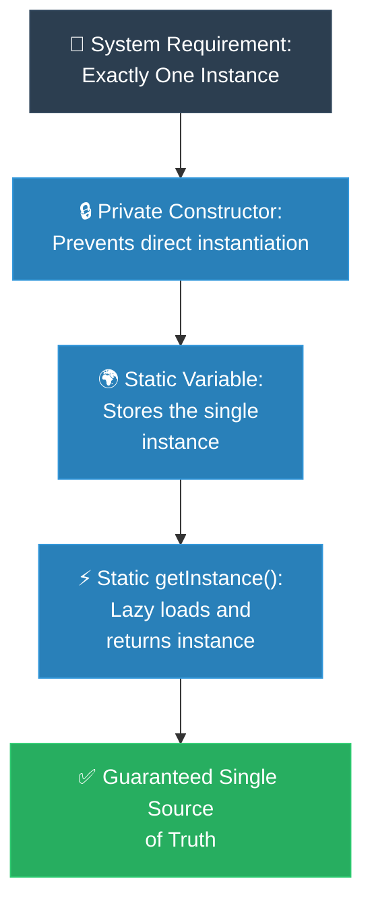

# MIT Professor: Singleton (គោលការណ៍គ្រឹះដំបូងនៃ Singleton)

**Author:** ichamrong  
**Date:** 2026-05-18  
**Tags:** #mit-professor #first-principles #design-patterns #singleton #clean-code  
**Category:** Concepts / MIT Professor  
**Read Time:** ~5 min  

---

## 📌 មាតិកា (Table of Contents)
- [១. បញ្ហាស្នូល (The Core Problem)](#១-បញ្ហាស្នូល-the-core-problem)
- [២. ការទាញហេតុផលពីគោលការណ៍គ្រឹះ (First Principles Derivation)](#២-ការទាញហេតុផលពីគោលការណ៍គ្រឹះ-first-principles-derivation)
- [៣. ស្ថាបត្យកម្មកូដគំរូ (Code Architecture)](#៣-ស្ថាបត្យកម្មកូដគំរូ-code-architecture)
- [៤. ដ្យាក្រាមលំហូរ (Visual Derivation)](#៤-ដ្យាក្រាមលំហូរ-visual-derivation)
- [៥. Related Posts](#៥-related-posts)

---

## ១. បញ្ហាស្នូល (The Core Problem)

ខ្ញុំសូមចាប់ផ្តើមដោយសំណួរមួយ។ ស្រមៃថាកម្មវិធីរបស់អ្នកមាន printer តែមួយ មាន database connection pool តែមួយ ឬមានឯកសារ config ដែលផ្ទុកក្នុងមេម៉ូរីតែមួយ។ ផ្នែកមួយនៃប្រព័ន្ធស្នើសុំវា ហើយមួយភ្លែតក្រោយមក — នៅកន្លែងផ្សេងទៀតទាំងស្រុង — ផ្នែកមួយទៀតក៏ស្នើសុំវាដែរ។ តើអ្នកធានាដោយរបៀបណាថា ផ្នែកទាំងពីរនេះកំពុងនិយាយអំពីវត្ថុ *ដូចគ្នា* មិនមែនច្បាប់ចម្លងពីរ ដែលបានញែកចេញពីគ្នាដោយស្ងាត់ៗ?

សូមចងចាំសំណួរនេះទុក ព្រោះបញ្ហានេះមានភាពលាក់កំបាំង។ នៅពេលដែលកូដពីរផ្នែកបង្កើតច្បាប់ចម្លងផ្ទាល់ខ្លួនរបស់ «the» connection pool នោះ គ្មានអ្វីខូចភ្លាមៗឡើយ។ កម្មវិធីដំណើរការ។ Test ក៏ជាប់។ ប៉ុន្តែបន្ទាប់មកនៅក្នុង production ក្រោមបន្ទុកធ្ងន់ អ្នកនឹងជួបនូវ bug ដែលធ្វើឱ្យសប្តាហ៍របស់អ្នកវឹកវរ៖ មេម៉ូរីហូរហៀរ (Memory Exhaustion) port hardware ជាប់គាំង ឬ cache ពីរដែលផ្ទុយគ្នាអំពីការពិត។ គ្មាននរណាសរសេរ bug នេះទេ។ bug នេះគឺជា bug *រចនាសម្ព័ន្ធ (structural)* — វាកើតចេញពីការពិតដែលថា ភាសាសរសេរកម្មវិធីបានអនុញ្ញាតឱ្យច្បាប់ចម្លងពីរអាចមានវត្តមានតាំងពីដំបូង។

ដូច្នេះ យើងចង់គ្រប់គ្រងធនធានរួមគ្នា (ដូចជា Database Connection Pool ឬ Hardware Port) ដែលការបង្កើត Object ច្រើននឹងបណ្តាលឱ្យហូរហៀរមេម៉ូរី (Memory Exhaustion) ការជាប់គាំងខ្សែស្រឡាយដំណើរការ (Thread Lockups) ឬស្ថានភាពទិន្នន័យមិនស៊ីសង្វាក់គ្នា (Inconsistent State)។

---

## ២. ការទាញហេតុផលពីគោលការណ៍គ្រឹះ (First Principles Derivation)

យើងកុំទន្ទេញដំណោះស្រាយឡើយ។ ចូរយើង *ទាញវាចេញ* ដោយចាប់ផ្តើមពីរបៀបដែលម៉ាស៊ីនពិតជាដំណើរការ ហើយមើលថា តើ pattern នេះត្រូវបានបង្ខំឱ្យកើតឡើងលើយើងឬអត់។

**ចាប់ផ្តើមពីការពិតមួយអំពីម៉ាស៊ីន។** រាល់ពេលដែលអ្នកសរសេរ `new` កុំព្យូទ័រកាត់យកប្លុកមេម៉ូរីថ្មីមួយ ដែលដាច់ដោយឡែកពីគ្នាទាំងស្រុង។ នេះមិនមែនជាជម្រើសរចនាបថឡើយ — វាជា *អត្ថន័យ* របស់ពាក្យ `new`។ ដូច្នេះ ប្រសិនបើតម្រូវការរបស់យើងគឺ «ត្រូវមានវត្ថុនេះ តែមួយគត់» នោះរាល់ការប្រើ `new` ដោយរសាត់ គឺជាការគំរាមកំហែងផ្ទាល់ដល់តម្រូវការនោះ។ គ្រោះថ្នាក់នេះមិនមែនជារឿងស្មាននោះទេ — វាបានកប់ខ្លួននៅក្នុងពាក្យគន្លឹះនេះតែម្តង។

**ឥឡូវនេះ សូមសួរសំណួរដែលធ្វើឱ្យយើងមិនស្រួលក្នុងចិត្ត។** តើមានអ្វីបច្ចុប្បន្ននេះ ដែលរារាំង developer ណាម្នាក់ នៅកន្លែងណាមួយក្នុង codebase មិនឱ្យវាយ `new ConnectionPool()` ជាលើកទីពីរ? និយាយឱ្យត្រង់ទៅ — ចម្លើយគឺ *គ្មានអ្វីទាល់តែសោះ*។ Constructor គឺ public ដូច្នេះទ្វារនៅបើកចំហ។ ដរាបណាទ្វារនោះនៅបើកចំហ គ្មានវិន័យ ឬឯកសារណាមួយអាចសង្គ្រោះយើងបានឡើយ — នឹងមាននរណាម្នាក់ នៅថ្ងៃណាមួយ ដើរចូលតាមទ្វារនោះជាមិនខាន។

**ដូច្នេះ តម្រូវការនេះក៏សរសេរខ្លួនវាឡើងវិញដោយស្ងាត់ៗ។** «ធានាឱ្យមាន instance តែមួយ» តាមពិតមានន័យថា «ដកចេញពីអ្នកដទៃទាំងអស់នូវ *អំណាច* ក្នុងការបង្កើត instance»។ យើងមិនសុំឱ្យគេកុំហៅ `new` ឡើយ — យើងធ្វើឱ្យវាមិនអាចទៅរួច។ យើងចាក់សោ Constructor៖ ប្តូរវាទៅជា `private`។

**ប៉ុន្តែឥឡូវនេះ យើងបានបង្កើតបញ្ហាថ្មីមួយ មែនទេ?** បើទ្វារត្រូវបានចាក់សោ តើនរណាអាចទាញយក Object នោះមកប្រើបាន? យើងបានការពារធនធាននេះយ៉ាងជិតស្និទ្ធ រហូតដល់គ្មាននរណាម្នាក់អាចចូលដល់វាបាន។ ដំណោះស្រាយនេះហើយ ជាគន្លឹះទាំងស្រុង៖ ប្រសិនបើ Class នោះ ជាអ្នកតែមួយគត់ដែលត្រូវបានអនុញ្ញាតឱ្យបង្កើតខ្លួនឯង នោះ *Class នោះផ្ទាល់* ត្រូវតែជាអ្នកប្រគល់ instance ចេញ។ យើងបន្ថែមច្រកទ្វារដែលគ្រប់គ្រងបានមួយ — គឺមុខងារ `public static` ឈ្មោះ `getInstance()` — ដែលធ្វើការងារកត់ត្រា ដែលគ្មាននរណាផ្សេងអាចទុកចិត្តបាន៖ ពេលហៅលើកដំបូង វាបង្កើត instance តែមួយនោះ; រាល់ពេលក្រោយៗមក វាប្រគល់ instance ដដែលនោះត្រឡប់ទៅវិញ។

ហើយនេះហើយ គឺជា pattern ដែលត្រូវបាន *ទាញចេញ* មិនមែនទន្ទេញ៖ ចាក់សោការបង្កើត រួចបើកច្រកទ្វារតែមួយ ដែលធានាភាពដូចគ្នា។ សូមកត់សម្គាល់ថា យើងមិនដែល *ជ្រើសរើស* Singleton ឡើយ — អាកប្បកិរិយារបស់ម៉ាស៊ីន បូកនឹងតម្រូវការរបស់យើង បានទុកឱ្យយើងគ្មានទ្វារផ្សេងណាមួយឡើយ។

---

## ៣. ស្ថាបត្យកម្មកូដគំរូ (Code Architecture)

ខាងក្រោមនេះ គឺជាការទាញហេតុផលរបស់យើង បកប្រែទៅជា Java៖ ចាក់សោ Constructor រួចបើកច្រក `getInstance()` តែមួយ ដែលមានសុវត្ថិភាពចំពោះ thread។ យើងប្រើ **double-checked locking** ជាមួយ `volatile` ដើម្បីឱ្យ thread ច្រើនមិនបង្កើត instance ច្រើនក្នុងពេលតែមួយ៖

```java
public final class ConnectionPool {

    // volatile ធានាថា thread ទាំងអស់ឃើញ instance ដូចគ្នា (មិនមាន cache ខូស)
    private static volatile ConnectionPool instance;

    // ចាក់សោទ្វារ៖ គ្មាននរណាអាចហៅ new ConnectionPool() ពីខាងក្រៅបានឡើយ
    private ConnectionPool() {
        if (instance != null) {
            throw new IllegalStateException("ប្រើ getInstance() ជំនួសវិញ");
        }
        // ... initialize the pool ...
    }

    // ច្រកទ្វារតែមួយគត់ ដែលគ្រប់គ្រងបាន
    public static ConnectionPool getInstance() {
        if (instance == null) {                 // ការត្រួតពិនិត្យលើកទី ១ (មិនចាក់សោ — លឿន)
            synchronized (ConnectionPool.class) {
                if (instance == null) {         // ការត្រួតពិនិត្យលើកទី ២ (ចាក់សោ — សុវត្ថិភាព)
                    instance = new ConnectionPool();
                }
            }
        }
        return instance;
    }
}
```

**កំណត់សម្គាល់ — វិធីសាមញ្ញ និងល្អបំផុតក្នុង Java៖** តាមការណែនាំក្នុងសៀវភៅ *Effective Java* វិធីដ៏រឹងមាំបំផុតគឺប្រើ `enum` ដែលមានធាតុតែមួយ។ JVM ធានាសុវត្ថិភាព thread ការបង្កើតតែម្តង និងការការពារ reflection/serialization ដោយស្វ័យប្រវត្តិ៖

```java
public enum ConnectionPool {
    INSTANCE;

    public void query(String sql) {
        // ... ប្រើ ConnectionPool.INSTANCE.query(...) ...
    }
}
```

`enum` ខ្លីជាង សុវត្ថិភាពជាង ហើយលុបបំបាត់រាល់ការលំបាកនៃ double-checked locking។ ប្រើ DCL តែនៅពេលដែលអ្នកត្រូវការការ initialize ដ៏ស្មុគស្មាញ ដែល enum មិនអាចបង្ហាញបានស្រួល។

---

## ៤. ដ្យាក្រាមលំហូរ (Visual Derivation)



---

## ៥. Related Posts

### 🔗 Explore All Viewpoints:
* 📖 **Read the Parable:** [The Bank's Only Vault (ទូដែកតែមួយគត់របស់ធនាគារ)](../../parables/75-the-banks-only-vault.md) — Explains the emotional core of shared truth.
* 🧠 **Read the First Principles Derivation:** [MIT Professor Strategy: Singleton (គោលការណ៍គ្រឹះដំបូងនៃ Singleton)](../01-mit-professor/01-singleton.md) — Derives the pattern from fundamental computer axioms.
* 👶 **Read the Feynman Simplification:** [Feynman Technique: Singleton (ការពន្យល់ពី Singleton ដោយគ្មានពាក្យបច្ចេកទេស)](../02-feynman-technique/04-singleton.md) — Breaks it down using the central clock tower.
* 👦 **Read the ELI5 Metaphor:** [ELI5: Singleton (ម៉ាស៊ីនខួងខ្មៅដៃតែមួយគត់ក្នុងថ្នាក់រៀន)](../03-eli5/04-singleton.md) — Teaches it to a five-year-old using classroom pencil sharpeners.
* 🌉 **Read the Analogy Bridge:** [Analogy Bridge: Singleton (ស្ពានប្រៀបធៀបនៃប្រភពពិតតែមួយគត់)](../04-analogy-bridge/04-singleton.md) — Maps it to a hotel front desk and shows where physical limits fail compared to code threads.
* 🧐 **Read the Socratic Discovery:** [Socratic Method: Singleton (ការបង្កើតប្រព័ន្ធការពិតតែមួយគត់តាមវិធីសាស្ត្រសូក្រាត)](../05-socratic-method/04-singleton.md) — Guide your self-discovery through mentor-student dialogue.
* 📰 **Read the Journalist Summary:** [Journalist: Singleton (ការធានាឱ្យមានការពិតតែមួយគត់ក្នុងប្រព័ន្ធទាំងមូល)](../06-journalist-inverted-pyramid/04-singleton.md) — Get the high-impact lede, volatile visibility, and thread-safety details first.
* 🎭 **Read the Storyteller Narrative:** [Storyteller: Singleton (អាណាព្យាបាលនៃសេចក្តីពិត និងកងទ័ពក្លូនបង្កចលាចល)](../07-storyteller-narrative-arc/04-singleton.md) — Follow Kiri's heroic journey to vanquish the duplicate logger clone army.
* ⚙️ **Read the Engineer Spec:** [Engineer: Singleton (ការសម្របសម្រួលប្រភពពិតតែមួយគត់ និងទប់ស្កាត់ការខ្ជះខ្ជាយធនធាន)](../08-engineer-requirements-constraints-solution/03-singleton.md) — Read the rigorous engineering specification, DCL performance details, and candidate elimination.
* 📊 **Read the Pros & Cons:** [Pros & Cons Compared: Singleton (ការប្រៀបធៀបគុណសម្បត្តិ និងគុណវិបត្តិនៃ Singleton)](../09-pros-and-cons-compared/01-singleton.md) — Full trade-off analysis and decision matrix.
* 🛠️ **Read the Code Implementation:** [Creational Patterns: The Art of Instantiation](../../../clean-code/design-patterns/01-creational-patterns.md#the-singleton) — Production-grade Java with double-checked locking and thread safety.
