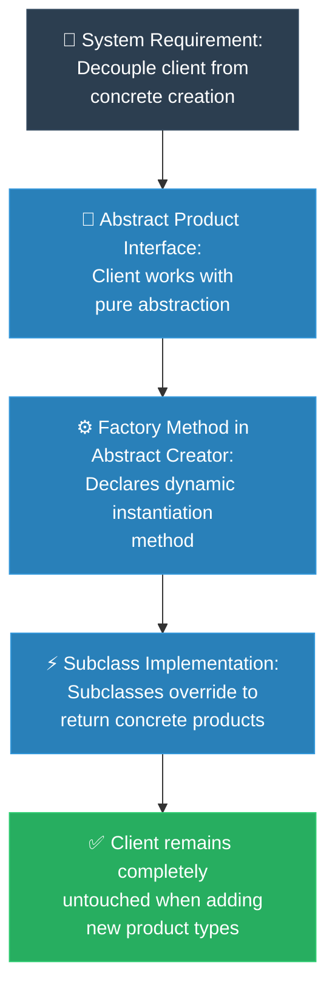

# MIT Professor: Factory Method (គោល​ការ​ណ៍គ្រឹះដំបូង​នៃ Factory Method)

**Author:** ichamrong  
**Date:** 2026-05-18  
**Tags:** #mit-professor #first-principles #design-patterns #factory-method #clean-code  
**Category:** Concepts / MIT Professor  
**Read Time:** ~5 min  

---

## 📌 មាតិកា (Table of Contents)
- [១. បញ្ហា​ស្នូល (The Core Problem)](#១-បញ្ហាស្នូល-the-core-problem)
- [២. ការ​ទាញហេតុផល​ពី​គោល​ការ​ណ៍គ្រឹះ (First Principles Derivation)](#២-ការទាញហេតុផលពីគោលការណ៍គ្រឹះ-first-principles-derivation)
- [៣. ស្ថាបត្យកម្​មក​ូដគំរូ (Code Architecture)](#៣-ស្ថាបត្យកម្មកូដគំរូ-code-architecture)
- [៤. ដ្យាក្រាមលំហូរ (Visual Derivation)](#៤-ដ្យាក្រាមលំហូរ-visual-derivation)
- [៥. Related Posts](#៥-related-posts)

---

## ១. បញ្ហា​ស្នូល (The Core Problem)

នេះ​គឺជា​បន្ទាត់​កូដ​ដ៏​សាមញ្ញ​បំផុតមួយ ដែល​អ្នក​ប្រហែល​ជា​ធ្លាប់​សរសេរ​វារាប់ពាន់ដង​មក​ហើយ៖ `new EmailNotifier()`។ មើល​ទៅ​វាហាក់​ដូចជា​គ្មាន​អ្វីគ្រោះថ្នាក់សោះ មែនទេ? ប៉ុន្តែ​ខ្ញុំសូមបញ្ចុះបញ្ចូល​អ្នក​ថា ការ​សរសេរ​បែប​នេះ​មាន​តម្លៃថ្លៃលាក់កំបាំងដ៏ធំមួយ។

ចាប់​ពី​វិនាទី​ដែល​អ្នក​សរសេរ `new EmailNotifier()` នៅក្នុង​កូដ​សម្រាប់​ដំណើរ​ការ​ការ​បញ្​ជា​ទិញ (Order-Processing Code) របស់​អ្នក អ្នក​បាន​ផ្សារភ្​ជា​ប់​យ៉ាង​តឹងរ៉ឹងនូវរឿង​ពី​រ​ដែល​មិន​មាន​អ្វីពាក់ព័ន្ធគ្នាទាល់​តែ​សោះ៖ ទីមួយ​គឺ *តក្កវិជ្​ជា​ដែល​សម្រេចចិត្តថា​ត្រូវ​ផ្ញើសារជូនដំណឹង* ទី​ពី​រ​គឺ *ការ​ពិត​ជា​ក់លាក់​ដែល​ថាសារ​នោះ​គឺជា​អ៊ីមែល ដែល​កើតចេញ​ពី Class នេះ​ផ្ទាល់*។ ឥឡូវ​នេះ​ពួកវា​មាន​ជោគវាសនារួមគ្នា។ ស្រមៃថាថ្ងៃស្អែក ខាងផ្នែកអាជីវកម្មនិយាយថា "យើង​ត្រូវ​ការ​ផ្ញើសារ​តាមរយៈ SMS បន្ថែមទៀត។ និង Push Notifications ផងដែរ។ ហើយ​សម្រាប់​អតិថិជនសហគ្រាសធំ ៗ យើង​ចង់​ប្រើ Slack"។ 

តើ​អ្នក​ត្រូវ​ធ្វើ​ដូចម្តេច? អ្នក​ត្រូវ​ត្រឡប់​ទៅ​ក្នុង​កូដ​ដំណើរ​ការ​ការ​បញ្​ជា​ទិញ​ចាស់ — ដែល​កំពុង​តែ​ដំណើរ​ការ​យ៉ាង​ល្អ​ឥតខ្ចោះ — ដើម្បី​បន្ថែមលក្ខខណ្ឌ `switch` ឬ `if/else` រញ៉េរញ៉ៃ។ អ្នក​កំពុង​តែ​កាយមុខរបួស​ចាស់​ដែល​បាន​ជា​សះស្បើយ​រាល់​ពេល​ដែល​ពិភពលោកផ្លាស់ប្តូរ។ នេះ​គឺជា​ការ​បំពាន​យ៉ាង​ធ្ងន់ធ្ងរបំផុត​ទៅ​លើ​គោល​ការ​ណ៍ **Open-Closed Principle**៖ កូដ​របស់​អ្នក​គួរ​តែ *បើកចំហរ (Open)* សម្រាប់​ការ​អភិវឌ្ឍ​បន្ថែមអាកប្បកិរិយា​ថ្មី ប៉ុន្តែ *បិទជិត (Closed)* មិន​ឱ្យ​មាន​ការ​កែប្រែ​ចុះឡើង​នោះ​ទេ។ ការ​ប្រើប្រាស់​ពាក្យគន្លឹះ `new` បាន​បិទទ្វារ​នៃ​ភាពបត់បែន​នោះ​ជិតឈឹង​តែ​ម្តង។

---

## ២. ការ​ទាញហេតុផល​ពី​គោល​ការ​ណ៍គ្រឹះ (First Principles Derivation)

ចូរយើងស្វែងរក​ដំណោះស្រាយ​ដោយ​ការ​សួរថា តើ​កូដ​ដែល​ហៅ (Caller Code) *ពិត​ជា* ត្រូវ​ការ​អ្វី — និង​អ្វី​ដែល​វាគ្រាន់​តែ​ធ្វើ​ពុត​ជា​ត្រូវ​ការ។

**គោល​ការ​ណ៍គ្រឹះទី ១ (បំបែកតម្រូវ​ការ​ចេញ​ពី​របៀប​ធ្វើ)៖** តើ​កូដ​សម្រាប់​ដំណើរ​ការ​ការ​បញ្​ជា​ទិញ​របស់​អ្នក​ចង់​បាន​អ្វី? វាគ្រាន់​តែ​ចង់​ឱ្យ *សារជូនដំណឹងមួយ​ត្រូវ​បាន​ផ្ញើចេញ*។ តើ​វា​ពិត​ជា​ចាំបាច់​ត្រូវ​ដឹងថាសារ​នោះ​គឺជា `EmailNotifier` ដែល​ត្រូវ​បាន​បង្កើត​ឡើង​ជា​មួយនឹងប៉ារ៉ាម៉ែត្រ​ជា​ក់លាក់ទាំង​នេះ​មែនទេ? ទេ​មិន​មែនទេ។ ចំណេះដឹង​នោះ​គឺជា​បន្ទុកបន្ថែម​ដែល​វា​ត្រូវ​បាន​បង្ខំឱ្យរែកពុន។ គោល​ការ​ណ៍គ្រឹះ​នៃ​ការ​រចនា​ប្រព័ន្ធ​ដ៏រឹងមាំ — គឺ​ការ​ពឹងផ្អែក​លើ​អរូបនីយកម្ម (Depend on Abstractions) មិន​មែនពឹងផ្អែក​លើ​ភាព​ជា​ក់លាក់ (Not Concretions) នោះ​ទេ (ហៅថា **Dependency Inversion Principle**) — ប្រាប់យើងថា​អ្នក​ហៅគួរ​តែ​និយាយ​តែ​ជា​មួយ Interface ទូ​ទៅ​មួយប៉ុណ្ណោះ (ឧទាហរណ៍ `Notifier`) ហើយ​មិន​ត្រូវ​ស្គាល់ឈ្មោះ Class ជា​ក់លាក់ណាមួយ​ឡើយ។

**គោល​ការ​ណ៍គ្រឹះទី ២ (ប៉ុន្តែ​ត្រូវតែ​មាន​នរណាម្នាក់ហៅ `new`)៖** យើង​មិន​អាចប្រើមន្តអាគមបំបាត់​ការ​បង្កើត Object បាន​ឡើយ — យ៉ាង​ណាមិញ Object សម្រាប់​ផ្ញើ SMS ត្រូវតែ​ត្រូវ​បាន​បង្កើត​ដោយ *នរណាម្នាក់* ដ​ដែល។ ដូច្​នេះ សំណួរ​ពិតប្រាកដ​មិន​មែន "តើ​យើងចៀសវាង​ការ​បង្កើត Object ដោយ​របៀបណា" នោះ​ទេ ប៉ុន្តែ​វា​គឺ "*តើ​នរណា* គួរ​តែ​ជា​អ្នក​មាន​សិទ្ធិសម្រេចចិត្តថា តើ Object ជា​ក់លាក់មួយណា​ត្រូវ​បង្កើត ហើយ​តើ​ការ​សម្រេចចិត្ត​នោះ​គួរ​តែ​ស្ថិតនៅ *កន្លែងណា*?"

**ការ​ទាញហេតុផល (Derivation)៖** ប្រសិនបើយើងដើរ​តាម​សំណួរ​នេះ ចម្​លើ​យនឹងផុសចេញ​មក​យ៉ាង​ច្បាស់។ ការ​សម្រេចចិត្ត​មិន​គួរស្ថិត​នៅក្នុង​អ្នក​ហៅ (Caller) ឡើយ — ព្រោះ​វា​ជា​មូលហេតុ​ដែល​ធ្វើ​ឱ្យ​អ្នក​ហៅក្លាយ​ជា​ផុយស្រួយ។ ដូច្​នេះ យើង​ត្រូវ​ទាញយកសកម្មភាព​នៃ​ការ​បង្កើត​នោះ​ចេញ ដាក់ចូល​ទៅ​ក្នុង Method ផ្ទាល់ខ្លួនមួយ​របស់ Creator Class ដែល​យើងហៅថា `createNotifier()`។ 

ឥឡូវ​នេះ នេះ​គឺជា​ចំណុចដ៏អស្ចារ្យ៖ យើងអនុញ្ញាតឱ្យ *Subclasses* របស់ Creator ជា​អ្នក​សរសេរ​ជា​ន់​ពី​លើ (Override) Method នោះ ដោយ Subclass នីមួយ ៗ ជ្រើសរើសផលិតផល​ជា​ក់លាក់​របស់​វា​ដោយ​ខ្លួនឯង។ ឧទាហរណ៍ `EmailDispatcher` បង្កើត Email Notifier ចំណែក `SmsDispatcher` បង្កើត SMS Notifier។

សង្កេតមើល​ពី​អ្វី​ដែល​ទើប​តែ​កើតឡើងចំពោះ "តម្លៃ​នៃ​ការ​ផ្លាស់ប្តូរ"។ ការ​បន្ថែម Push Notifications ឥឡូវ​នេះ លែង​មាន​ន័យថា​អ្នក​ត្រូវ​ទៅ​កែ​កូដ Order ចាស់​ទៀតហើយ។ វា​មាន​ន័យថា​អ្នក​គ្រាន់​តែ​សរសេរ Subclass *ថ្មី* មួយ​ដោយ​ទុក​កូដ​ផ្សេង ៗ ទៀតឱ្យនៅដ​ដែល។ អ្នក​ហៅ (Caller) មិន​ដែល​រៀនពាក្យ​ថ្មី ឬ​ឈ្មោះ​ថ្មី​ឡើយ វាគ្រាន់​តែ​ស្នើសុំ `Notifier` ហើយវានឹងទទួល​បាន​មួយភ្លាម។ យើង​មិន​បាន​កែប្រែ​សោភ័ណភាព​កូដ​នោះ​ទេ — យើងគ្រាន់​តែ​ផ្លាស់ប្តូរទីតាំង​ការ​សម្រេចចិត្ត​តែ​មួយគត់ (ថា​ត្រូវ​បង្កើត Class មួយណា) ទៅកាន់​កន្លែង​តែ​មួយគត់​ដែល​ការ​បន្ថែមវា​គឺ​ឥតគិតថ្លៃ (Free Extension)។ ការ​ផ្លាស់ប្តូរទីតាំង​នោះ​ហើយ គឺជា​ខ្លឹមសារ​ពិត​នៃ **Factory Method**។

---

## ៣. ស្ថាបត្យកម្​មក​ូដគំរូ (Code Architecture)

នៅក្នុង​ស្ថាបត្យកម្ម​នេះ អ្នក​ហៅ (Caller) និយាយ​តែ​ជា​មួយ Interface ឈ្មោះ `Notifier` និង Class អរូបី (Abstract Class) ឈ្មោះ `Dispatcher` ដែល​មាន Factory Method គឺ `createNotifier()` ប៉ុណ្ណោះ។ 

Subclass នីមួយ ៗ ជ្រើសរើសផលិតផល​ជា​ក់លាក់​របស់​ខ្លួន។ នៅ​ពេល​ដែល​អ្នក​ចង់​បន្ថែម Channel ថ្មី អ្នក​គ្រាន់​តែ​បន្ថែម Subclass ថ្មី​មួយប៉ុណ្ណោះ — អ្នក​មិន​ចាំបាច់​ទៅ​កែប្រែ​កូដ​របស់​អ្នក​ហៅ (Caller) ដែល​មាន​ស្រាប់​ឡើយ។

```java
// 1. The abstract product the caller depends on
public interface Notifier {
    void send(String message);
}

// 2. The creator declares the Factory Method
public abstract class Dispatcher {

    // The caller uses this — it never names a concrete class
    public void notifyUser(String message) {
        Notifier notifier = createNotifier();   // factory method
        notifier.send(message);
    }

    // Subclasses decide WHICH concrete product to build
    protected abstract Notifier createNotifier();
}

// 3. Each subclass picks its own product — caller stays untouched
public class EmailDispatcher extends Dispatcher {
    @Override
    protected Notifier createNotifier() {
        return new EmailNotifier();
    }
}

public class SmsDispatcher extends Dispatcher {
    @Override
    protected Notifier createNotifier() {
        return new SmsNotifier();
    }
}

// Adding push notifications later = ONE new subclass, zero edits to the caller:
// public class PushDispatcher extends Dispatcher {
//     protected Notifier createNotifier() { return new PushNotifier(); }
// }
```

---

## ៤. ដ្យាក្រាមលំហូរ (Visual Derivation)



---

## ៥. Related Posts

### 🔗 Explore All Viewpoints:
* 📖 **Read the Parable:** [The CEO and the Regional Managers (នាយកប្រតិបត្តិ និង​អ្នក​គ្រប់​គ្រងតំបន់)](../../parables/77-the-ceo-and-regional-managers.md) — The emotional core of delegating local decisions.
* 🧠 **Read the First Principles Derivation:** [MIT Professor Strategy: Factory Method (គោល​ការ​ណ៍គ្រឹះដំបូង​នៃ Factory Method)](../01-mit-professor/02-factory-method.md) — Derives the pattern step-by-step from base interface dependency laws.
* 👶 **Read the Feynman Simplification:** [Feynman Technique: Factory Method (ការ​ពន្យល់​ពី Factory Method ដោយ​គ្មាន​ពាក្យបច្ចេកទេស)](../02-feynman-technique/06-factory-method.md) — Breaks it down using the hotel cleaner recruitment agency.
* 👦 **Read the ELI5 Metaphor:** [ELI5: Factory Method (ការ​ពន្យល់​ពី Factory Method ដូចក្មេងអាយុ ៥ ឆ្នាំ)](../03-eli5/06-factory-method.md) — Teaches a five-year-old using the magic toy machine slot.
* 🌉 **Read the Analogy Bridge:** [Analogy Bridge: Factory Method (ស្ពានប្រៀបធៀប​នៃ Factory Method)](../04-analogy-bridge/06-factory-method.md) — Maps regional postal transport hubs to virtual methods, outlining physical limitations.
* 🧐 **Read the Socratic Discovery:** [Socratic Method: Factory Method (ការ​បង្កើត Object តាម​តម្រូវ​ការ​យឺត​យ៉ាវ​តាម​វិធីសាស្ត្រសូក្រាត)](../05-socratic-method/06-factory-method.md) — Socrates guides your discovery out of switch block coupling.
* 📰 **Read the Journalist Summary:** [Journalist: Factory Method (ការ​បំបែក​កូដ​បង្កើត Object ឱ្យ​មាន​សេរីភាពសម្រេចចិត្ត​លើ Subclass)](../06-journalist-inverted-pyramid/06-factory-method.md) — High-impact news lede, OCP compliance, and SRP isolation details first.
* 🎭 **Read the Storyteller Narrative:** [Storyteller: Factory Method (វីរបុរស Factory Method និង​ការ​ដោះលែង​ប្រព័ន្ធ​ផ្ញើសារ​ពី​រនរក switch)](../07-storyteller-narrative-arc/06-factory-method.md) — Junior developer Dara's battle to vanquish the switch statement monster on Black Friday.
* ⚙️ **Read the Engineer Spec:** [Engineer: Factory Method (ការ​បំបែក​កូដ​បង្កើត Object តាមរយៈ​ការ​វាយតម្លៃតម្រូវ​ការ និង​ឧបសគ្គកំណត់)](../08-engineer-requirements-constraints-solution/04-factory-method.md) — Technical requirements, ADR candidate matrix, and SLA evaluation.
* 📊 **Read the Pros & Cons:** [Pros & Cons Compared: Factory Method (ការ​ប្រៀបធៀបគុណសម្បត្តិ និង​គុណវិបត្តិ​នៃ Factory Method)](../09-pros-and-cons-compared/03-factory-method.md) — Full trade-off analysis and decision matrix.
* 🛠️ **Read the Code Implementation:** [Creational Patterns: The Art of Instantiation](../../../clean-code/design-patterns/01-creational-patterns.md#the-factory-method) — Production-grade Java with subclass dispatch and Open/Closed Principle.
