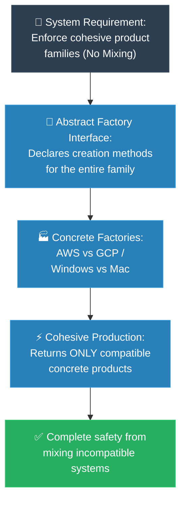

# MIT Professor: Abstract Factory (គោល​ការ​ណ៍គ្រឹះដំបូង​នៃ Abstract Factory)

**Author:** ichamrong  
**Date:** 2026-05-18  
**Tags:** #mit-professor #first-principles #design-patterns #abstract-factory #clean-code  
**Category:** Concepts / MIT Professor  
**Read Time:** ~5 min  

---

## 📌 មាតិកា (Table of Contents)
- [១. បញ្ហា​ស្នូល (The Core Problem)](#១-បញ្ហាស្នូល-the-core-problem)
- [២. ការ​ទាញហេតុផល​ពី​គោល​ការ​ណ៍គ្រឹះ (First Principles Derivation)](#២-ការទាញហេតុផលពីគោលការណ៍គ្រឹះ-first-principles-derivation)
- [៣. ស្ថាបត្យកម្​មក​ូដគំរូ (Code Architecture)](#៣-ស្ថាបត្យកម្មកូដគំរូ-code-architecture)
- [៤. ដ្យាក្រាមលំហូរ (Visual Derivation)](#៤-ដ្យាក្រាមលំហូរ-visual-derivation)
- [៥. Related Posts](#៥-related-posts)

---

## ១. បញ្ហា​ស្នូល (The Core Problem)

Factory Method បាន​ជួយដោះស្រាយ​បញ្ហា "តើ​ខ្ញុំគួរ​តែ​បង្កើត Object មួយណា?"។ ប៉ុន្តែ​ឥឡូវ​នេះ ខ្ញុំ​ចង់​បង្កើន​កម្រិតលំបាកមួយកម្រិតទៀត ពី​ព្រោះ​ប្រព័ន្ធ​ជាក់ស្តែង​ដ៏ធំស្ទើរ​តែ​មិន​ដែល​ដោះស្រាយត្រឹម​តែ Object មួយ ៗ ដាច់​ពី​គ្នា​នោះ​ទេ — ពួកវា​ត្រូវ​ដោះស្រាយ​ជា​មួយនឹង *គ្រួសារ (Families)* នៃ Object ដែល​តម្រូវឱ្យស៊ីសង្វាក់គ្នា​ជា​ចាំបាច់។

សូមស្រមៃថា​អ្នក​កំពុង​បង្កើត​ចំណុចប្រទាក់​អ្នកប្រើប្រាស់ (User Interface) ដែល​ត្រូវ​ដំណើរ​ការ​លើ​ទាំង​ប្រព័ន្ធ​ប្រតិបត្តិ​ការ Windows និង macOS។ អ្នក​មិន​មែនគ្រាន់​តែ​មាន Button មួយ​នោះ​ទេ អ្នក​មាន​មួយឈុតធំ​តែ​ម្តង — រួម​មាន Buttons, Checkboxes, Scrollbars, និង Menus — ហើយពួកវា​ទាំងអស់​ត្រូវតែ​ចេញ​មក​ពី *ពិភព​តែ​មួយ*។ ការ​យក Scrollbar របស់ macOS ទៅ​ដាក់​ក្នុង​ផ្ទាំង​កម្មវិធី Windows មិន​មែនត្រឹម​តែ​ធ្វើ​ឱ្យមើល​ទៅ​អាក្រក់​នោះ​ទេ វាអាចនឹងបំបែក​ប្រព័ន្ធ Event Handling និង​ធ្វើ​ឱ្យ​កម្មវិធី​គាំង (Crash) តែ​ម្តង។ 

បញ្ហា​ដូចគ្នា​នេះ​ក៏កើត​មាន​ឡើង​នៅក្នុង​ផ្នែកខាង​ក្រោយ (Backend) ផងដែរ៖ ស្រទាប់ពពក (Cloud Layer) របស់​អ្នក​ត្រូវតែ​ទំនាក់ទំនង​ជា​មួយ AWS ទាំងស្រុង *ឬ​ក៏* GCP ទាំងស្រុង មិន​មែនកូនកាត់ពាក់កណ្តាល-AWS-ពាក់កណ្តាល-GCP នោះ​ឡើយ ដែល​វានឹងបរាជ័យ​ក្នុង​របៀប​ដែល​គ្មាន​កំណត់ហេតុ (Log) ណាអាចពន្យល់​បាន។ គ្រោះថ្នាក់​ថ្មី​នេះ មិន​មែនគ្រាន់​តែ​ជា​ការ​ជ្រើសរើស Object ខុស​នោះ​ទេ — វា​គឺជា​ការ *លាយឡំ* (Mixing) នូវ Object ទាំងឡាយ​ដែល​មិន​គួរ​ត្រូវ​បាន​អនុញ្ញាតឱ្យនៅ​ជា​មួយគ្នាទាល់​តែ​សោះ។ 

ហើយប្រសិនបើ​កូដ​របស់​អ្នក​ផ្តុំគ្រួសារទាំង​នេះ ដោយ​ហៅ `new` ម្តងមួយ ៗ ដោយ​ដៃ នោះ​ការ​លាយឡំ​មិន​មែនគ្រាន់​តែ​ជា​លទ្ធភាព​នោះ​ទេ វា​គឺជា​ភាពប្រាកដប្រ​ជា​មួយ​ដែល​នឹងកើតឡើង៖ នៅ​ពេល​មាន​ការ​រៀបចំ​កូដ​ឡើងវិញ (Refactor) ឬ​ការ​ច្របាច់បញ្ចូលគ្នា (Merge) វានឹងរុញ Button របស់ Windows ចូល​ទៅ​ក្នុង​ផ្លូវ​របស់ Mac ដោយ​ចៃដន្យ ហើយ​កម្មវិធី​បម្លែង​កូដ (Compiler) នឹងអនុម័តវា​ដោយ​រលូន ព្រោះ​វាសុទ្ធ​តែ​ជា Button ដូចគ្នា!

---

## ២. ការ​ទាញហេតុផល​ពី​គោល​ការ​ណ៍គ្រឹះ (First Principles Derivation)

យើងដឹងរួច​មក​ហើយ​ពី​របៀប​ធ្វើ​ឱ្យ​ការ​សម្រេចចិត្ត​បង្កើត Object *មួយ* មាន​សុវត្ថិភាព។ គន្លឹះ​ឥឡូវ​នេះ​គឺ តើ​ត្រូវ​ធ្វើ​ដូចម្តេចទើប​ការ​សម្រេចចិត្ត​បង្កើត​សម្រាប់​មួយគ្រួសារទាំងមូល​មាន *ភាពស៊ីសង្វាក់គ្នា (Consistent)* ជា​និច្ច — ហើយ​ត្រូវ​ធ្វើ​វា​ដោយ​មិន​ពឹងផ្អែក​លើ​ការ​ចងចាំ​របស់​អ្នក​សរសេរ​កូដ (Caller) ឡើយ។

**គោល​ការ​ណ៍គ្រឹះទី ១ (កំណត់​ការ​ពិត​ដែល​មិន​អាចប្រែប្រួល - Invariant)៖** តើ​អ្វី​ដែល​តែ​ង​តែ​ត្រូវតែ​ជា​ការ​ពិត​ដាច់ខាត? វា​មិន​មែន​ជា "យើង​បង្កើត Button មួយ" នោះ​ទេ ប៉ុន្តែ​វា​គឺជា "រាល់​សមាសធាតុ​ទាំងអស់​ដែល​យើង​បង្កើត គឺ​ចេញ​មក​ពី *គ្រួសារ​តែ​មួយ*"។ ពាក្យ​នោះ — *ភាពស៊ីសង្វាក់គ្នា​ក្នុង​មួយឈុត (Consistency across a set)* — គឺជា​រឿង​ដែល​យើង​ត្រូវតែ​ការ​ពារ។ ដំណោះស្រាយ​ណាក៏​ដោយ ដែល​អនុញ្ញាតឱ្យ​អ្នក​ហៅជ្រើសរើសសមាសធាតុម្តងមួយ ៗ គឺ​ចាត់ទុកថាបរាជ័យបាត់​ទៅ​ហើយ ព្រោះ​ការ​រក្សាភាពស៊ីសង្វាក់គ្នា​ដោយ​ពឹង​លើ​វិន័យមនុស្ស គឺជា​ប្រភេទ​ច្បាប់​ដែល​មនុស្ស​តែ​ង​តែ​បំពាននៅម៉ោង ២ រំលងអធ្រាត្រ​ពេល​ជិតដល់ថ្ងៃផុតកំណត់ (Deadline)។

**គោល​ការ​ណ៍គ្រឹះទី ២ (ពង្រីកទំហំ​នៃ​ការ​បង្កើត)៖** ប្រសិនបើ​ការ​ជ្រើសរើសសមាសធាតុដាច់​ពី​គ្នា​គឺជា​ចន្លោះប្រហោង ដូច្​នេះ​អ្នក​ហៅ (Caller) មិន​ត្រូវ​ជ្រើសរើសសមាសធាតុដាច់​ពី​គ្នា​នោះ​ទេ — វា​ត្រូវតែ​ជ្រើសរើស *គ្រួសារ​តែ​មួយគត់ ម្តងគត់* ហើយបន្ទាប់​មក​នឹងទទួល​បាន​សមាសធាតុ​ដែល​ស៊ីសង្វាក់គ្នារហូត។ 

**ការ​ទាញហេតុផល (Derivation)៖** ការ​គិតដ៏មុតស្រួច​នេះ បាន​បង្ខំឱ្យយើង​បង្កើត​រចនាសម្ព័ន្ធ​ថ្មី។ យើង​សរសេរ Interface តែ​មួយ​ដែល​អាចផលិត *គ្រប់* សមាជិក​ទាំងអស់​នៃ​គ្រួសារ​នោះ៖ គឺ `AbstractFactory` ដែល​មាន `createButton()`, `createCheckbox()`, `createScrollbar()`។ យើងយក Object តែ​មួយ ដើម្បី​ទទួលខុស​ត្រូវ​លើ​ឈុត​ដែល​ស៊ីសង្វាក់គ្នា។

បន្ទាប់​មក យើង​ធ្វើ​ឱ្យពិភពនីមួយ ៗ ក្លាយ​ជា​រោងចក្រផ្ទាល់ខ្លួន​របស់​វា។ `WindowsFactory` អនុវត្ត Interface នោះ ហើយវាអាចប្រគល់ត្រឡប់​មក​វិញនូវសមាសធាតុ​សម្រាប់​តែ Windows ប៉ុណ្ណោះ; ចំណែក `MacFactory` ប្រគល់​តែ​សមាសធាតុ​សម្រាប់ Mac ប៉ុណ្ណោះ។ រោងចក្រនីមួយ ៗ មិន​មាន​សមត្ថភាពខាងរូបវន្ត​ក្នុង​ការ​ផលិតនូវភាព​មិន​ស៊ីសង្វាក់គ្នា​បាន​ឡើយ — ការ​ធានា​ពេល​នេះ​បាន​រស់​នៅក្នុង *ប្រព័ន្ធ​ប្រភេទ​កូដ (Type System)* មិន​មែន​នៅក្នុង​ការ​ចងចាំ​របស់​អ្នក​អភិវឌ្ឍ​ន៍ទៀតទេ។

នៅ​ពេល​ប្រព័ន្ធ​ចាប់ផ្​តើ​មដំណើរ​ការ ពួកយើងពិនិត្យមើលបរិស្ថាន ហើយប្រគល់រោងចក្រ​ដែល​ត្រឹម​ត្រូវ​ទៅ​ឱ្យ Client — បន្ទាប់​មក​យើង​មិន​បាច់ខ្វល់ទៀតទេ។ ចាប់​ពី​ពេល​នោះ​មក Client នឹងកាន់ `AbstractFactory` ហើយស្នើសុំសមាសធាតុនានា ដោយ​មិន​ដឹង ឬ​មិន​ខ្វល់ថាវាកំពុងស្ថិត​ក្នុង​ពិភពមួយណា​នោះ​ទេ។ ការ​លាយឡំលែង​ជា​កំហុស​ដែល​អ្នក​ត្រូវ​ខំប្រឹងចៀសវាងទៀតហើយ; វា​បាន​ក្លាយ​ជា​ស្ថានភាពមួយ​ដែល​កូដ *មិន​អាច​បង្ហាញ​ចេញ​បាន (Cannot Represent)*។ 

សូ​មក​ត់សម្គាល់​ពី​ការ​វិវត្ត​នេះ៖ Factory Method បាន​ផ្លាស់ទី​ការ​សម្រេចចិត្តមួយ​ទៅកាន់ Subclass; រីឯ Abstract Factory បាន​ផ្លាស់ទី *មួយគ្រួសារ* នៃ​ការ​សម្រេចចិត្ត​ទៅ​នៅ​ពី​ក្រោយ Object តែ​មួយ ដូច្​នេះ​ភាពស៊ីសង្វាក់គ្នា​គឺ​ស្ថិតនៅ​លើ​រចនាសម្ព័ន្ធ (Structural) ជា​ជា​ងក្តីសង្ឃឹម។

---

## ៣. ស្ថាបត្យកម្​មក​ូដគំរូ (Code Architecture)

Interface មួយ បង្កើត​ក្រុមទាំងមូល; Concrete Factory នីមួយ ៗ អាចប្រគល់​តែ​សមាសធាតុ​ដែល​ត្រូវ​គ្នាប៉ុណ្ណោះ។ Client ជ្រើសរើសក្រុម​តែ​ម្តងនៅ​ពេល​ចាប់ផ្​តើ​ម រួចកាន់ `AbstractFactory` ហើយវានឹងលែងអាចលាយឡំពិភព​ពី​រ​បាន​ទៀតហើយ — ការ​មិន​ត្រូវ​គ្នាក្លាយ​ជា​រឿង​ដែល​មិន​អាចកើត​មាន។

```java
// 1. Members of the family
public interface Button   { void render(); }
public interface Checkbox { void render(); }

// 2. One factory that can build EVERY member of a family
public interface GUIFactory {
    Button createButton();
    Checkbox createCheckbox();
}

// 3. Each concrete factory produces only matching parts
public class WindowsFactory implements GUIFactory {
    public Button   createButton()   { return new WindowsButton(); }
    public Checkbox createCheckbox() { return new WindowsCheckbox(); }
}

public class MacFactory implements GUIFactory {
    public Button   createButton()   { return new MacButton(); }
    public Checkbox createCheckbox() { return new MacCheckbox(); }
}

// 4. Decide the family ONCE at the edge; the client never mixes worlds
public class Application {
    private final Button button;
    private final Checkbox checkbox;

    public Application(GUIFactory factory) {   // hand it the right factory at startup
        this.button   = factory.createButton();
        this.checkbox = factory.createCheckbox();
    }
}

// At startup:
// GUIFactory factory = isWindows() ? new WindowsFactory() : new MacFactory();
// Application app = new Application(factory);
```

---

## ៤. ដ្យាក្រាមលំហូរ (Visual Derivation)



---

## ៥. Related Posts

* 📖 **Read the Parable:** [The Mismatched Furniture Store (ហាងលក់គ្រឿងសង្ហារឹមចម្រុះ)](../../parables/78-the-mismatched-furniture-store.md)
* 🛠️ **Read the Code Implementation:** [Creational Patterns: The Art of Instantiation](../../../clean-code/design-patterns/01-creational-patterns.md#the-abstract-factory)
