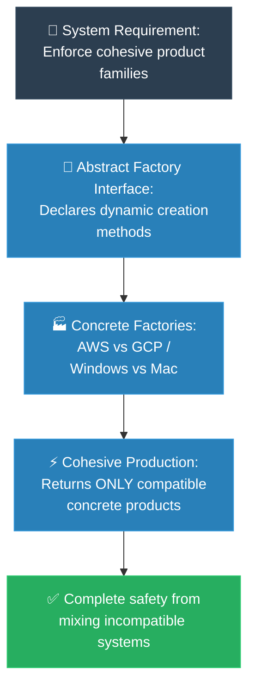

# MIT Professor: Abstract Factory (គោលការណ៍គ្រឹះដំបូងនៃ Abstract Factory)

**Author:** ichamrong  
**Date:** 2026-05-18  
**Tags:** #mit-professor #first-principles #design-patterns #abstract-factory #clean-code  
**Category:** Concepts / MIT Professor  
**Read Time:** ~5 min  

---

## 📌 មាតិកា (Table of Contents)
- [១. បញ្ហាស្នូល (The Core Problem)](#១-បញ្ហាស្នូល-the-core-problem)
- [២. ការទាញហេតុផលពីគោលការណ៍គ្រឹះ (First Principles Derivation)](#២-ការទាញហេតុផលពីគោលការណ៍គ្រឹះ-first-principles-derivation)
- [៣. ស្ថាបត្យកម្មកូដគំរូ (Code Architecture)](#៣-ស្ថាបត្យកម្មកូដគំរូ-code-architecture)
- [៤. ដ្យាក្រាមលំហូរ (Visual Derivation)](#៤-ដ្យាក្រាមលំហូរ-visual-derivation)
- [៥. Related Posts](#៥-related-posts)

---

## ១. បញ្ហាស្នូល (The Core Problem)

The Factory Method solved "which one object should I create." Now I want to raise the stakes, because real systems rarely deal in single objects — they deal in *families* that must match.

Picture a user interface that runs on both Windows and macOS. You don't have one widget; you have a whole set — buttons, checkboxes, scrollbars, menus — and they must all come from the *same world*. A macOS scrollbar inside a Windows window isn't just ugly; it can break event handling and crash. The same shape appears far from the screen: a cloud layer that must talk to either AWS *or* GCP, never a half-AWS-half-GCP mongrel that fails in ways no log explains. The new danger isn't picking the wrong object — it's *mixing* objects that were never meant to meet. And if your code assembles these families one `new` at a time, that mixing is not a possibility, it's an eventual certainty: some refactor, some merge, will slip a Windows button into the Mac path, and it will compile cleanly.

ស្រមៃថាអ្នកកំពុងព្យាយាមបង្កើតបទពិសោធន៍មួយដែលគ្របដណ្តប់លើពិភពលោកខុសៗគ្នាទាំងស្រុង — ដូចជាការរចនា UI Controls សម្រាប់ Windows និង macOS ព្រមៗគ្នា ឬការដាក់ឱ្យដំណើរការសេវាកម្មនៅលើ AWS និង GCP ជាដើម។ ទាំងនេះគឺជាក្រុមនៃ Object ដែលត្រូវតែនៅជាមួយគ្នា។ ប្រសិនបើយើងបណ្តោយឱ្យកូដរបស់យើងផ្គុំសមាសធាតុទាំងនេះដោយដៃម្តងមួយៗ នោះកំហុសរបស់មនុស្សច្បាស់ជានឹងកើតមានឡើងជាមិនខាន។ យើងអាចនឹងច្រឡំដាក់ប៊ូតុងរបស់ Windows ទៅក្នុងផ្ទាំងដ៏ស្រស់ស្អាតរបស់ macOS ដោយអចេតនា។ វាមិនត្រឹមតែមើលទៅអាក្រក់ប៉ុណ្ណោះទេ ថែមទាំងអាចបណ្តាលឱ្យប្រព័ន្ធគាំង និងមានបញ្ហាធ្ងន់ធ្ងរដែលយើងនឹកស្មានមិនដល់ទៀតផង។

---

## ២. ការទាញហេតុផលពីគោលការណ៍គ្រឹះ (First Principles Derivation)

### English

We already know how to make *one* creation decision safe. The trick now is to make a whole family's worth of decisions *consistent* — and to do it without trusting the caller to remember the rules.

**Name the real invariant.** What must always be true? Not "we create a button," but "every piece we create comes from the *same family*." That word — *consistency across a set* — is the thing we must protect. Any solution that lets the caller pick pieces one at a time has already lost, because consistency-by-discipline is the kind of rule humans break at 2 a.m. on a deadline.

**So raise the unit of creation.** If choosing pieces individually is the hole, then the caller must never choose pieces individually — it must choose *the family, once*, and receive matching pieces from then on. That single insight forces the structure. We write one interface that can produce *every* member of the family: `AbstractFactory`, with `createButton()`, `createCheckbox()`, `createScrollbar()`. One object, responsible for a coherent set.

**Then make each world its own factory.** `WindowsFactory` implements that interface and can only ever return Windows parts; `MacFactory` only Mac parts. Each factory is physically incapable of producing a mismatch — the guarantee now lives in the *type system*, not in a developer's memory.

**And decide the family exactly once, at the edge.** At startup we look at the environment and hand the client the correct factory — then walk away. From that moment the client holds an `AbstractFactory` and asks it for parts, never knowing or caring which world it's in. Mixing is no longer a mistake you have to avoid; it has become a state the code *cannot represent*. Notice the progression: Factory Method moved one decision to a subclass; Abstract Factory moves an entire *family* of decisions behind one object, so consistency is structural rather than hoped-for.

### Khmer
* **គោលការណ៍គ្រឹះ ១៖** ប្រព័ន្ធដែលល្អឥតខ្ចោះពិតប្រាកដ ត្រូវតែមានឯករាជ្យភាព។ វាមិនគួរខ្វាយខ្វល់ពីព័ត៌មានលម្អិតដ៏ស្មុគស្មាញ អំពីរបៀបដែលសមាសធាតុនីមួយៗត្រូវបានបង្កើត ផ្គុំចូលគ្នា ឬបង្ហាញចេញមកក្រៅនោះទេ។
* **គោលការណ៍គ្រឹះ ២៖** នៅពេលដែល Object ទាំងឡាយស្ថិតនៅក្នុងក្រុមតែមួយ ពួកវាត្រូវបានកំណត់ឱ្យធ្វើការរួមគ្នាយ៉ាងចុះសម្រុង។ យើងត្រូវតែការពារទំនាក់ទំនងនេះឱ្យបានតឹងរ៉ឹងបំផុត ដើម្បីធានាថាផ្នែកដែលពាក់ព័ន្ធទាំងនេះមិនត្រូវបានបំបែកចេញពីគ្នា ឬលាយឡំជាមួយនឹងសមាសធាតុដែលមិនត្រូវគ្នាឡើយ។
* **ការទាញហេតុផល៖** ដោយសារហេតុនេះហើយ យើងត្រូវលើកកម្ពស់ការគិតរបស់យើង ដោយធ្វើអរូបនីយកម្ម (Abstract) លើការបង្កើត *ក្រុមទាំងមូល* ក្នុងពេលតែមួយ។ យើងបង្កើតប្លង់គោលមួយ — គឺ Interface `AbstractFactory` — ដែលផ្ទុកនូវមុខងារជាក់លាក់សម្រាប់រាល់សមាសធាតុទាំងអស់ក្នុងក្រុម (ដូចជា `createButton()` ឬ `createCheckbox()`)។ បន្ទាប់មក យើងបង្កើតរោងចក្រជំនាញ (ដូចជា `WindowsFactory`, `MacFactory`) ដែលមានតួនាទីតែមួយគត់ គឺបង្កើតសមាសធាតុដែលត្រូវគ្នាយ៉ាងល្អឥតខ្ចោះ។ នៅពេលប្រព័ន្ធចាប់ផ្តើមដំណើរការ យើងគ្រាន់តែប្រគល់រោងចក្រដែលត្រឹមត្រូវទៅឱ្យកូនកូដ (Client)។ ចាប់ពីពេលនោះមក កូនកូដនឹងពឹងផ្អែកទាំងស្រុងលើរោងចក្រនោះ ដែលធានាបាននូវបរិស្ថានដ៏ល្អឥតខ្ចោះ គ្មានការលាយឡំ ហើយអ្វីៗគ្រប់យ៉ាងដំណើរការជាមួយគ្នាយ៉ាងស៊ីសង្វាក់។

---

## ៣. ស្ថាបត្យកម្មកូដគំរូ (Code Architecture)

One interface produces the whole family; each concrete factory can only ever return matching parts. The client picks the family once at startup, then holds an `AbstractFactory` and can no longer mix worlds — a mismatch becomes impossible to express.

Interface មួយ បង្កើតក្រុមទាំងមូល; concrete factory នីមួយៗ អាចប្រគល់តែសមាសធាតុដែលត្រូវគ្នាប៉ុណ្ណោះ។ Client ជ្រើសរើសក្រុមតែម្តងនៅពេលចាប់ផ្តើម រួចកាន់ `AbstractFactory` ហើយលែងអាចលាយឡំពិភពពីរបាន — ការមិនត្រូវគ្នាក្លាយជារឿងដែលមិនអាចបង្ហាញចេញបាន។

```java
// 1. Members of the family
public interface Button   { void render(); }
public interface Checkbox { void render(); }

// 2. One factory that can build EVERY member of a family
public interface GUIFactory {
    Button createButton();
    Checkbox createCheckbox();
}

// 3. Each concrete factory produces only matching parts
public class WindowsFactory implements GUIFactory {
    public Button   createButton()   { return new WindowsButton(); }
    public Checkbox createCheckbox() { return new WindowsCheckbox(); }
}

public class MacFactory implements GUIFactory {
    public Button   createButton()   { return new MacButton(); }
    public Checkbox createCheckbox() { return new MacCheckbox(); }
}

// 4. Decide the family ONCE at the edge; the client never mixes worlds
public class Application {
    private final Button button;
    private final Checkbox checkbox;

    public Application(GUIFactory factory) {   // hand it the right factory at startup
        this.button   = factory.createButton();
        this.checkbox = factory.createCheckbox();
    }
}

// At startup:
// GUIFactory factory = isWindows() ? new WindowsFactory() : new MacFactory();
// Application app = new Application(factory);
```

---

## ៤. ដ្យាក្រាមលំហូរ (Visual Derivation)



---

## ៥. Related Posts

* 📖 **Read the Parable:** [The Mismatched Furniture Store (ហាងលក់គ្រឿងសង្ហារឹមចម្រុះ)](../../parables/78-the-mismatched-furniture-store.md)
* 🛠️ **Read the Code Implementation:** [Creational Patterns: The Art of Instantiation](../../../clean-code/design-patterns/01-creational-patterns.md#the-abstract-factory)
