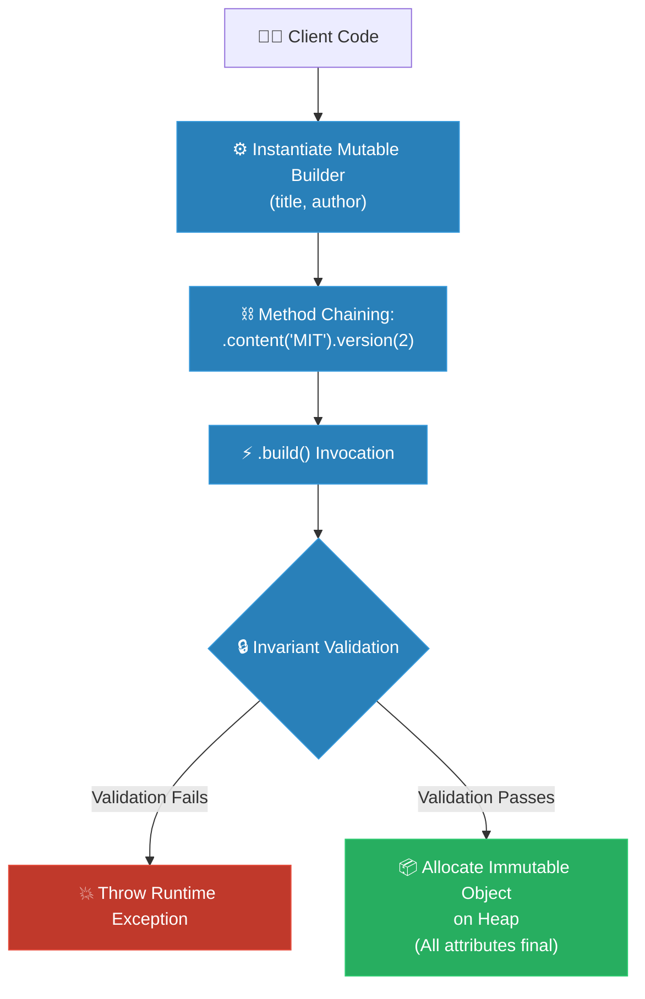

# MIT Professor: Builder (គោលការណ៍គ្រឹះដំបូងនៃ Builder)

**Author:** ichamrong  
**Date:** 2026-05-18  
**Tags:** #mit-professor #first-principles #design-patterns #builder #clean-code  
**Category:** Concepts / MIT Professor  
**Read Time:** ~7 min  

---

## 📌 មាតិកា (Table of Contents)
- [១. គោលការណ៍គ្រឹះដំបូង (Axiomatic Foundations)](#១-គោលការណ៍គ្រឹះដំបូង-axiomatic-foundations)
- [២. ការទាញរកលក្ខណៈបច្ចេកទេស (The Derivation)](#២-ការទាញរកលក្ខណៈបច្ចេកទេស-the-derivation)
- [៣. ស្ថាបត្យកម្មកូដគំរូ (Mathematical & Code Architecture)](#៣-ស្ថាបត្យកម្មកូដគំរូ-mathematical-code-architecture)
- [៤. ដ្យាក្រាមលំហូរ (Visual Flowchart)](#៤-ដ្យាក្រាមលំហូរ-visual-flowchart)
- [៥. Related Posts](#៥-related-posts)

---

## ១. គោលការណ៍គ្រឹះដំបូង (Axiomatic Foundations)

Before we look at any solution, let me put three facts on the table — not opinions, but things that are simply *true* about how code runs. Everything about the Builder pattern falls out of these. If you accept the three, you'll find you've already invented Builder by the end.

1. **Positional arguments are blind.** When you call `new Document("Report", "Sokha", true, false, 3, ...)`, the language matches those values to parameters purely by *position*. It has no idea what you *meant*. Swap two booleans — `isDraft` and `isArchived` — and the compiler says nothing, the program runs, and the bug ships. The more parameters of the same type you have, the more certain this silent error becomes. This isn't carelessness; it's the calling convention itself working against you.
2. **An object should be born valid.** From the very instant an object exists in memory, it ought to be whole and obeying its own rules — a `Document` with no title is not a "mostly fine Document," it's a contradiction that shouldn't be allowed to exist, even for a millisecond. If we let objects come into the world incomplete, every piece of code that touches them afterward has to wonder, "is this one actually finished?"
3. **The simplest way to be thread-safe is to never change.** When many threads read the same object at once, coordinating them with locks is slow and easy to get wrong. But notice: if an object *cannot be modified after creation*, there is nothing to coordinate — every thread sees the same frozen truth. Immutability isn't just tidy; it's the cheapest concurrency guarantee there is.

1. **គោលការណ៍នៃកំហុសមនុស្ស៖** នៅពេលដែលយើងហៅ Constructor ដែលមានប៉ារ៉ាម៉ែត្រវែងអន្លាយ ពួកវានឹងត្រូវបានបញ្ជូនទៅក្នុងអង្គចងចាំតាមលំដាប់លំដោយយ៉ាងតឹងរ៉ឹង។ ប្រសិនបើយើងមានប៉ារ៉ាម៉ែត្រប្រភេទដូចគ្នាច្រើន (ដូចជាលេខ ឬ true/false បន្តបន្ទាប់គ្នា) កម្មវិធីបម្លែងកូដ (Compiler) នឹងងងឹតភ្នែកទាំងស្រុង ហើយមិនអាចដឹងថាយើងបានច្រឡំផ្លាស់ប្តូរទីតាំងពួកវាឬអត់នោះទេ។ នេះគឺជាអន្ទាក់ដ៏ស្ងាត់ស្ងៀមនិងគ្រោះថ្នាក់បំផុតសម្រាប់កំហុសរបស់មនុស្ស។
2. **គោលការណ៍នៃស្ថានភាពមាស (Golden State)៖** ចាប់ពីវិនាទីដែល Object មួយត្រូវបានផ្តល់ជីវិតនៅក្នុងអង្គចងចាំ វាត្រូវតែពេញលេញ ត្រឹមត្រូវ និងត្រៀមខ្លួនរួចជាស្រេចដើម្បីការពារច្បាប់ផ្ទាល់ខ្លួនរបស់វាភ្លាមៗ។ យើងមិនអាចបណ្តោយឱ្យ Object ណាមួយស្ថិតក្នុងស្ថានភាព "ពាក់កណ្តាលទី" ឬមិនទាន់ត្រឹមត្រូវឡើយ សូម្បីតែមួយមីលីវិនាទីក៏ដោយ។
3. **គោលការណ៍នៃសន្តិភាពមិនប្រែប្រួល (Immutable Peace)៖** នៅក្នុងពិភពលោកដែល Thread ជាច្រើនតែងតែប្រណាំងប្រជែង និងអានទិន្នន័យក្នុងពេលតែមួយ ការព្យាយាមសម្របសម្រួលពួកវាដោយប្រើសោ (Locks) គឺជារឿងដែលហត់នឿយ និងយឺតយ៉ាវបំផុត។ វិធីដ៏ស្រស់ស្អាតបំផុតដើម្បីធានាបាននូវសន្តិភាព និងសុវត្ថិភាពដាច់ខាត គឺការធ្វើឱ្យ Object នោះ "មិនអាចកែប្រែបាន" (Immutable) នៅពេលដែលវាបានកើតមក។

---

## ២. ការទាញរកលក្ខណៈបច្ចេកទេស (The Derivation)

### The Problem: two tempting answers, both wrong

Take a `Document` with a dozen properties — two required (title, author), the rest optional. Watch our three facts collide with the two "obvious" solutions, and watch both fail.

**Tempting answer #1: just add more constructors.** One for title+author, one that also takes content, one that also takes a version… You end up with a tower of near-identical constructors covering every combination — the *telescoping constructor*. It's unreadable, and it walks straight into Fact #1: a caller staring at `new Document(a, b, c, true, false, 2)` cannot tell which boolean is which, and neither can the compiler. We've multiplied the surface area for silent, positional mistakes.

**Tempting answer #2: build it empty, then use setters.** `Document d = new Document(); d.setTitle(...); d.setAuthor(...);`. Cleaner to read — and it violates *two* of our facts at once. It breaks Fact #2, because between line one and line three the document exists with no title: a half-built, invalid object that other code might grab. And it breaks Fact #3, because an object you fill in with setters is an object that can be *changed* forever after — mutable, and unsafe the moment a second thread reads it mid-assembly.

So we're cornered. We need the readable, name-each-field assembly that setters gave us, but we also need the object to spring into existence *all at once, complete and frozen*. Assembly is gradual; validity must be instant. Those two demands seem contradictory — until you realize the way out is to **separate the gathering of parts from the birth of the object**. Let one helper collect the ingredients over several friendly, named steps; then, in a single final act, validate everything and construct one immutable object. That helper is the Builder — and the solution below shows exactly how it keeps all three facts satisfied.

### ដំណោះស្រាយ៖ ជម្រកសុវត្ថិភាពរបស់ Builder

ដើម្បីគោរពតាមគោលការណ៍គ្រឹះទាំងបីរបស់យើង យើងត្រូវយល់ថា *ការប្រមូលផ្តុំសម្ភារៈ* គឺជាដំណើរការដែលខុសគ្នាស្រឡះពី *ការបង្កើតស្នាដៃចុងក្រោយ*។ យើងត្រូវតែបំបែកវាចេញពីគ្នា។

```
1. យើងណែនាំនូវជំនួយការបណ្តោះអាសន្នដ៏អត់ធ្មត់ម្នាក់ — គឺ Class `Builder` — ដែលផ្ទុកនូវលក្ខណៈសម្បត្តិដូចគ្នាទាំងអស់។
2. Builder នេះមានភាពបត់បែនខ្លាំងណាស់។ វាអនុញ្ញាតឱ្យយើងកំណត់លក្ខណៈសម្បត្តិនីមួយៗយ៉ាងប្រុងប្រយ័ត្ន និងច្បាស់លាស់ម្តងមួយៗ ដែលអានទៅពិតជាពិរោះដូចជាភាសាធម្មជាតិអញ្ចឹង។
3. យើងចាក់សោរ Target Class យ៉ាងតឹងរ៉ឹងដោយប្តូរ Constructor របស់វាទៅជា `private`។ កូនសោតែមួយគត់របស់វាគឺ Builder ដែលបានរៀបចំរួចរាល់តែប៉ុណ្ណោះ។
4. នៅខាងក្នុងទីជម្រកដ៏ស្ងាត់កំបាំងនេះ Target Class នឹងត្រួតពិនិត្យការងាររបស់ Builder យ៉ាងល្អិតល្អន់ ដោយធានាថារាល់ច្បាប់ទាំងអស់ត្រូវបានបំពេញ មុនពេលដែលវាផ្តល់ជីវិតដល់ Object ចុងក្រោយ។
5. នៅពេលដែលត្រូវបានត្រួតពិនិត្យត្រឹមត្រូវ Target Object នឹងត្រូវបានបង្កើតឡើងជាមួយនឹងលក្ខណៈសម្បត្តិ `final`។ វាចាប់កំណើតមកយ៉ាងល្អឥតខ្ចោះ មិនអាចកែប្រែបាន និងមានសុវត្ថិភាពជារៀងរហូត។
```

---

## ៣. ស្ថាបត្យកម្មកូដគំរូ (Mathematical & Code Architecture)

Here is the mathematical derivation mapped to safe Java memory structures:

```java
public final class ImmutableDocument {
    private final String title;       // Required
    private final String author;      // Required
    private final String content;     // Optional
    private final boolean isDraft;    // Optional
    private final int version;        // Optional

    // Private constructor enforces Axiom 2 and 3
    private ImmutableDocument(Builder builder) {
        // Enforce invariants before memory assignment
        if (builder.title == null || builder.author == null) {
            throw new IllegalStateException("Required fields title and author must not be null");
        }
        this.title = builder.title;
        this.author = builder.author;
        this.content = builder.content;
        this.isDraft = builder.isDraft;
        this.version = builder.version;
    }

    public static class Builder {
        private final String title;    // Immutable inside builder if required
        private final String author;   // Immutable inside builder if required
        private String content = "";   // Default values
        private boolean isDraft = true;
        private int version = 1;

        public Builder(String title, String author) {
            this.title = title;
            this.author = author;
        }

        public Builder content(String content) {
            this.content = content;
            return this; // Return self for fluent chaining
        }

        public Builder isDraft(boolean isDraft) {
            this.isDraft = isDraft;
            return this;
        }

        public Builder version(int version) {
            this.version = version;
            return this;
        }

        // Atomic materialized transaction
        public ImmutableDocument build() {
            return new ImmutableDocument(this);
        }
    }
}
```

---

## ៤. ដ្យាក្រាមលំហូរ (Visual Flowchart)



---

## ៥. Related Posts

### 🔗 Explore All Viewpoints:
* 📖 **Read the Parable:** [The 47-Question Waiter (អ្នករត់តុសួរ ៤៧ សំណួរ)](../../parables/76-the-overwhelmed-sandwich-shop.md) — The emotional story of a chaotic customer experience.
* 🧠 **Read the First Principles Derivation:** [MIT Professor Strategy: Builder (គោលការណ៍គ្រឹះដំបូងនៃ Builder)](../01-mit-professor/04-builder.md) — Derives the pattern from stack frame layouts and thread safety laws.
* 👶 **Read the Feynman Simplification:** [Feynman Technique: Builder (ការពន្យល់ពី Builder ដោយគ្មានពាក្យបច្ចេកទេស)](../02-feynman-technique/05-builder.md) — Breaks it down using a simple cafe menu checklist.
* 👦 **Read the ELI5 Metaphor:** [ELI5: Builder (ការពន្យល់ពី Builder ដូចក្មេងអាយុ ៥ ឆ្នាំ)](../03-eli5/05-builder.md) — Teaches a five-year-old using Lego spaceship construction books.
* 🌉 **Read the Analogy Bridge:** [Analogy Bridge: Builder (ស្ពានប្រៀបធៀបនៃ Builder)](../04-analogy-bridge/05-builder.md) — Maps real sandwich ticks to fluent Java methods, outlining physical limitations.
* 🧐 **Read the Socratic Discovery:** [Socratic Method: Builder (ការបង្កើត Object ស្មុគស្មាញតាមវិធីសាស្ត្រសូក្រាត)](../05-socratic-method/05-builder.md) — Probes yourself via a mentor-student constructor debate.
* 📰 **Read the Journalist Summary:** [Journalist: Builder (ការបង្កើត Object ស្មុគស្មាញជាជំហានៗ)](../06-journalist-inverted-pyramid/05-builder.md) — Quick news lede, telescoping prevention, and step-by-step assembly validation.
* 🎭 **Read the Storyteller Narrative:** [Storyteller: Builder (វីរបុរស Builder និងសង្គ្រាមប៉ារ៉ាម៉ែត្ររញ៉េរញ៉ៃ)](../07-storyteller-narrative-arc/05-builder.md) — Sopheap's battle against a production parameter bomb catastrophe on Black Friday.
* ⚙️ **Read the Engineer Spec:** [Engineer: Builder (ការបង្កើត Object ស្មុគស្មាញជាជំហានៗ)](../08-engineer-requirements-constraints-solution/01-builder.md) — Read the formal engineering requirements and candidate evaluation table.
* 📊 **Read the Pros & Cons:** [Pros & Cons Compared: Builder (ការប្រៀបធៀបគុណសម្បត្តិ និងគុណវិបត្តិនៃ Builder)](../09-pros-and-cons-compared/02-builder.md) — Full trade-off analysis and decision matrix.
* 🛠️ **Read the Code Implementation:** [Creational Patterns: The Art of Instantiation](../../../clean-code/design-patterns/01-creational-patterns.md#the-builder) — Production-grade Java with fluent chaining and immutable object construction.
