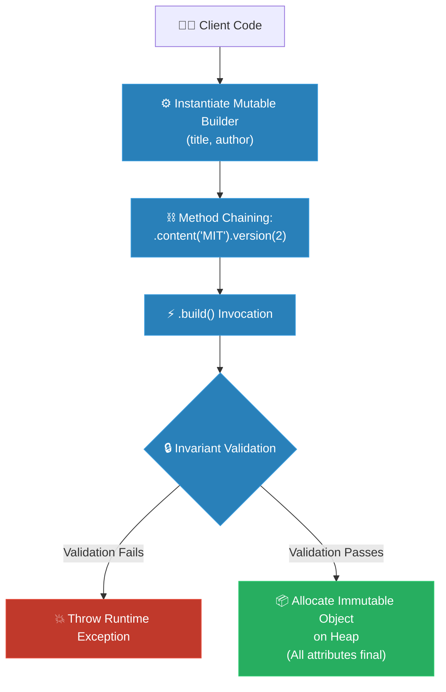

# MIT Professor: Builder (គោល​ការ​ណ៍គ្រឹះដំបូង​នៃ Builder)

**Author:** ichamrong  
**Date:** 2026-05-18  
**Tags:** #mit-professor #first-principles #design-patterns #builder #clean-code  
**Category:** Concepts / MIT Professor  
**Read Time:** ~7 min  

---

## 📌 មាតិកា (Table of Contents)
- [១. គោល​ការ​ណ៍គ្រឹះដំបូង (Axiomatic Foundations)](#១-គោលការណ៍គ្រឹះដំបូង-axiomatic-foundations)
- [២. ការ​ទាញរក​លក្ខណៈ​បច្ចេកទេស (The Derivation)](#២-ការទាញរកលក្ខណៈបច្ចេកទេស-the-derivation)
- [៣. ស្ថាបត្យកម្​មក​ូដគំរូ (Mathematical & Code Architecture)](#៣-ស្ថាបត្យកម្មកូដគំរូ-mathematical-code-architecture)
- [៤. ដ្យាក្រាមលំហូរ (Visual Flowchart)](#៤-ដ្យាក្រាមលំហូរ-visual-flowchart)
- [៥. Related Posts](#៥-related-posts)

---

## ១. គោល​ការ​ណ៍គ្រឹះដំបូង (Axiomatic Foundations)

មុន​នឹងយើងពិនិត្យមើល​ដំណោះស្រាយ​ណាមួយ ខ្ញុំសូមដាក់ចេញនូវ​ការ​ពិត​ទាំងបី​នេះ​ជា​មុន​សិន — វា​មិន​មែន​ជា​មតិយោបល់​នោះ​ទេ ប៉ុន្តែ​វា​ជា​រឿង​ដែល *ពិតប្រាកដ​ដាច់ខាត* អំ​ពី​របៀប​ដែល​កូដ​ដំណើរ​ការ​នៅក្នុង​កុំ​ព្យូទ័រ។ អ្វី ៗ គ្រប់​យ៉ាង​អំ​ពី Builder Pattern គឺ​កើតចេញ​ពី​ការ​ពិត​ទាំងបី​នេះ។ ប្រសិនបើ​អ្នក​យល់ព្រមទទួលយក​ការ​ពិត​ទាំងបី​នេះ អ្នក​នឹងឃើញថា​អ្នក​ខ្លួនឯងក៏អាច​បង្កើត Builder Pattern បាន​ដែរនៅទីបញ្ចប់។

1. **ការ​បញ្ជូនប៉ារ៉ាម៉ែត្រ​តាម​ទីតាំង​គឺជា​ភាពងងឹតភ្នែក (Positional arguments are blind)៖** នៅ​ពេល​ដែល​អ្នក​ហៅ `new Document("Report", "Sokha", true, false, 3, ...)` ភាសា​សរសេរ​កម្មវិធី​គ្រាន់​តែ​ផ្គូផ្គងតម្លៃទាំង​នោះ​ទៅ​នឹងប៉ារ៉ាម៉ែត្រ ដោយ​ផ្អែក​លើ *ទីតាំង* របស់​វា​តែ​ប៉ុណ្ណោះ។ កុំ​ព្យូទ័រ​មិន​ដឹងទាល់​តែ​សោះថា​អ្នក *ចង់​មាន​ន័យ* យ៉ាង​ម៉េច។ សាកល្បងឆ្លាស់ទីតាំងតម្លៃ boolean ពី​រ — ឧទាហរណ៍​រវាង `isDraft` និង `isArchived` — Compiler នឹង​មិន​និយាយអ្វី​ទាំងអស់ កម្មវិធី​នឹងនៅ​តែ​ដើរ ហើយកំហុស (Bug) នឹង​ត្រូវ​បញ្ជូន​ទៅកាន់ Production។ នៅ​ពេល​ដែល​អ្នក​មាន​ប៉ារ៉ាម៉ែត្រ​ដែល​មាន​ប្រភេទ (Type) ដូចគ្នាកាន់​តែ​ច្រើន ភាពប្រាកដប្រ​ជា​នៃ​កំហុសដ៏ស្ងាត់ស្ងៀម​នេះ​នឹងកាន់​តែ​ខ្ពស់។ នេះ​មិន​មែន​ជា​ការ​ធ្វេសប្រហែសទេ នេះ​គឺជា​វិធី​ដែល​ការ​ហៅ​កូដ​ធម្មតា (Calling Convention) ធ្វើ​ការ​ប្រឆាំងនឹង​អ្នក​តែ​ម្តង។
2. **Object ត្រូវតែ​កើត​មក​ពេញលេញភ្លាម ៗ (An object should be born valid)៖** ចាប់តាំង​ពី​វិនាទីដំបូង​ដែល Object មួយ​មាន​វត្ត​មាន​នៅក្នុង​អង្គចងចាំ វាគួរ​តែ​មាន​ភាពពេញលេញ និង​គោរព​តាម​ច្បាប់ផ្ទាល់ខ្លួន​របស់​វា​ជា​និច្ច — ឯកសារ (Document) មួយ​ដែល​គ្មាន​ចំណងជើង មិន​មែន​ជា "ឯកសារ​ដែល​ស្ទើរ​តែ​ល្អ" នោះ​ទេ វា​គឺជា​ភាពផ្ទុយគ្នា​ដែល​មិន​គួរ​ត្រូវ​បាន​អនុញ្ញាតឱ្យ​មាន​វត្ត​មាន សូម្បី​តែ​ក្នុង​មួយមីលីវិនាទីក៏​ដោយ។ ប្រសិនបើយើងបណ្តោយឱ្យ Object ណាមួយកើត​មក​ដោយ​មិន​ពេញលេញ រាល់​កូដ​ផ្សេង ៗ ទៀត​ដែល​ទាក់ទងនឹងវា នឹង​ត្រូវ​បង្ខំចិត្តសង្ស័យ​ជា​និច្ចថា "តើ Object មួយ​នេះ​បាន​បញ្ចប់​ការ​រៀបចំហើយ​ឬ​នៅ?"។
3. **វិធី​សាមញ្ញ​បំផុត​ដើម្បី​ឱ្យ​មាន​សុវត្ថិភាព Thread គឺ​កុំ​ឱ្យប្រែប្រួល (The simplest way to be thread-safe is to never change)៖** នៅ​ពេល​ដែល Thread ជា​ច្រើន​អាន Object តែ​មួយ​ក្នុង​ពេល​តែ​មួយ ការ​ព្យាយាម​សម្របសម្រួល​ពួកវា​ដោយ​ប្រើសោ (Locks) គឺ​មាន​ភាព​យឺត​យ៉ាវ និង​ងាយនឹងបង្កកំហុសបំផុត។ ប៉ុន្តែ​សូ​មក​ត់សម្គាល់៖ ប្រសិនបើ Object មួយ *មិន​អាច​ត្រូវ​បាន​កែប្រែ​ទៀត​ឡើយ បន្ទាប់​ពី​វា​ត្រូវ​បាន​បង្កើត​រួច* នោះ​យើង​មិន​ចាំបាច់​មាន​អ្វី​ដែល​ត្រូវ​សម្របសម្រួល​ទាល់​តែ​សោះ — Thread ទាំងអស់​នឹងឃើញ​តែ​ការ​ពិត​ដ៏កកស្ងប់ស្ងាត់​តែ​មួយគត់ដូចគ្នា។ ភាព​មិន​ប្រែប្រួល (Immutability) មិន​ត្រឹម​តែ​ធ្វើ​ឱ្យ​មាន​ភាពរៀបរយទេ វា​គឺជា​ការ​ធានាសុវត្ថិភាព​ក្នុង​ពេល​ដំណាលគ្នា (Concurrency Guarantee) ដែល​ថោក និង​មាន​ប្រសិទ្ធភាពបំផុត។

1. **គោល​ការ​ណ៍​នៃ​កំហុសមនុស្ស៖** នៅ​ពេល​ដែល​យើងហៅ Constructor ដែល​មាន​ប៉ារ៉ាម៉ែត្រវែងអន្លាយ ពួកវានឹង​ត្រូវ​បាន​បញ្ជូន​ទៅ​ក្នុង​អង្គចងចាំ​តាម​លំដាប់លំ​ដោយ​យ៉ាង​តឹងរ៉ឹង។ ប្រសិនបើយើង​មាន​ប៉ារ៉ាម៉ែត្រ​ប្រភេទ​ដូចគ្នាច្រើន (ដូចជា​លេខ ឬ true/false បន្តបន្ទាប់គ្នា) កម្មវិធី​បម្លែង​កូដ (Compiler) នឹងងងឹតភ្នែកទាំងស្រុង ហើយ​មិន​អាចដឹងថាយើង​បាន​ច្រឡំផ្លាស់ប្តូរទីតាំងពួកវា​ឬ​អត់​នោះ​ទេ។ នេះ​គឺជា​អន្ទាក់​ដ៏ស្ងាត់ស្ងៀម​និង​គ្រោះថ្នាក់បំផុត​សម្រាប់​កំហុស​របស់​មនុស្ស។
2. **គោល​ការ​ណ៍​នៃ​ស្ថានភាពមាស (Golden State)៖** ចាប់​ពី​វិនាទី​ដែល Object មួយ​ត្រូវ​បាន​ផ្តល់ជីវិត​នៅក្នុង​អង្គចងចាំ វា​ត្រូវតែ​ពេញលេញ ត្រឹម​ត្រូវ និង​ត្រៀមខ្លួនរួច​ជា​ស្រេច​ដើម្បី​ការ​ពារច្បាប់ផ្ទាល់ខ្លួន​របស់​វាភ្លាម ៗ ។ យើង​មិន​អាចបណ្តោយឱ្យ Object ណាមួយស្ថិត​ក្នុង​ស្ថានភាព "ពាក់កណ្តាលទី" ឬ​មិន​ទាន់ត្រឹម​ត្រូវ​ឡើយ សូម្បី​តែ​មួយមីលីវិនាទីក៏​ដោយ។
3. **គោល​ការ​ណ៍​នៃ​សន្តិភាព​មិន​ប្រែប្រួល (Immutable Peace)៖** នៅក្នុង​ពិភពលោក​ដែល Thread ជា​ច្រើន​តែ​ង​តែ​ប្រណាំងប្រជែង និង​អាន​ទិន្នន័យ​ក្នុង​ពេល​តែ​មួយ ការ​ព្យាយាម​សម្របសម្រួល​ពួកវា​ដោយ​ប្រើសោ (Locks) គឺជា​រឿង​ដែល​ហត់នឿយ និង​យឺត​យ៉ាវបំផុត។ វិធីដ៏ស្រស់ស្អាតបំផុត​ដើម្បី​ធានា​បាន​នូវសន្តិភាព និង​សុវត្ថិភាពដាច់ខាត គឺ​ការ​ធ្វើ​ឱ្យ Object នោះ "មិន​អាច​កែប្រែ​បាន" (Immutable) នៅ​ពេល​ដែល​វា​បាន​កើត​មក។

---

## ២. ការ​ទាញរក​លក្ខណៈ​បច្ចេកទេស (The Derivation)

### បញ្ហា៖ ចម្​លើ​យ​ដែល​ទាក់ទាញទាំង​ពី​រ សុទ្ធ​តែ​ខុស

សាកល្បងស្រមៃ​ពី​ការ​បង្កើត Class `Document` មួយ​ដែល​មាន​លក្ខណៈ​សម្បត្តិរាប់សិប — ពី​រ​គឺ​ចាំបាច់ (ចំណងជើង, អ្នកនិពន្ធ) ចំណែកឯកសល់សុទ្ធ​តែ​ជា​ជម្រើស។ សូមសង្កេតមើល​ពី​របៀប​ដែល​ការ​ពិត​ទាំងបី​របស់​យើងប៉ះទង្គិចគ្នា​ជា​មួយនឹង​ដំណោះស្រាយ "ជាក់ស្តែង" ពី​រ​យ៉ាង ហើយមើលថាពួកវាទាំង​ពី​រ​នេះ​បរាជ័យ​ដោយ​របៀបណា។

**ចម្​លើ​យ​ដែល​ទាក់ទាញទី ១ (Telescoping Constructor) គ្រាន់​តែ​បន្ថែម Constructor ឱ្យច្រើន៖** មួយ​សម្រាប់ (ចំណងជើង+អ្នកនិពន្ធ), មួយទៀត​ដែល​ទទួលយកទាំង មាតិកា, មួយទៀតទទួលយកទាំង កំណែ (Version)... ជា​ចុងក្រោយ អ្នក​នឹងទទួល​បាន​ប៉ម Constructor ដ៏រញ៉េរញ៉ៃ​ដែល​ស្ទើរ​តែ​ដូច ៗ គ្នា គ្របដណ្តប់​លើ​គ្រប់​ការ​ផ្សំ​ទាំងអស់ — យើងហៅថា *Telescoping Constructor*។ វា​មិន​អាច​អាន​យល់​បាន​ឡើយ ហើយវាដើរចូលត្រង់​ទៅ​ក្នុង​គោល​ការ​ណ៍គ្រឹះទី ១៖ អ្នក​សរសេរ​កូដ​ដែល​កំពុងសំឡឹងមើល `new Document(a, b, c, true, false, 2)` មិន​អាចប្រាប់​បាន​ទេថា Boolean មួយណា​ជា​អ្វី ហើយ Compiler ក៏​មិន​ដឹងដែរ។ យើងទើប​តែ​បាន​ពង្រីកផ្ទៃ​នៃ​កំហុសទីតាំងដ៏ស្ងាត់ស្ងៀម។

**ចម្​លើ​យ​ដែល​ទាក់ទាញទី ២ គឺ​បង្កើត​វាឱ្យទទេ រួចប្រើ Setters បំពេញបន្ថែម៖** ឧទាហរណ៍ `Document d = new Document(); d.setTitle(...); d.setAuthor(...);`។ វា​មាន​ភាពងាយស្រួល​ក្នុង​ការ​អាន — ប៉ុន្តែ​វា​បាន​បំពាន​លើ​គោល​ការ​ណ៍​របស់​យើងដល់​ទៅ *ពី​រ* ក្នុង​ពេល​តែ​មួយ។ វាបំពានគោល​ការ​ណ៍ទី ២ ពី​ព្រោះ​នៅចន្លោះបន្ទាត់ទី ១ ដល់ទី ៣ ឯកសារ​នេះ​បាន​មាន​វត្ត​មាន​ដោយ​គ្មាន​ចំណងជើង ដែល​វា​ជា​ការ​បង្កើត Object ពាក់កណ្តាលទី មិន​ត្រឹម​ត្រូវ ដែល​អាច​ត្រូវ​បាន​កូដ​ផ្សេងទៀតចាប់យក​ទៅ​ប្រើ​បាន។ ហើយវាបំពានគោល​ការ​ណ៍ទី ៣ ព្រោះ Object ដែល​អ្នក​អាចបំពេញបន្ថែម​ដោយ​ប្រើ Setters គឺជា Object ដែល​អាច *ផ្លាស់ប្តូរ (Mutable)* បាន​រហូត — វា​គ្មាន​សុវត្ថិភាពទេនៅ​ពេល​ដែល Thread ទី​ពី​រ​អាន​វា​ក្នុង​ពេល​ដែល​វាកំពុង​តែ​រៀបចំ​មិន​ទាន់រួច​រាល់។

ដូច្​នេះ យើង​ត្រូវ​បាន​រុញ​ទៅ​ជា​ប់ជញ្​ជា​ំងហើយ។ យើង​ត្រូវ​ការ​ការ​រៀបចំ​ដែល​អាច​អាន​បាន ដែល​អាចបញ្​ជា​ក់ឈ្មោះ Field នីមួយ ៗ បាន ដូច​ដែល Setters បាន​ផ្តល់ឱ្យយើង ប៉ុន្តែ​យើងក៏​ត្រូវ​ការ​ឱ្យ Object នេះ​មាន​ជីវិតឡើង​មក *ពេញលេញ និង​ត្រឹម​ត្រូវ​ក្នុង​ពេល​តែ​មួយគត់*។ ការ​ប្រមូលផ្តុំ​គឺ​ត្រូវ​ការ​ពេល​បន្តិចម្តង ៗ ចំណែកឯសុពលភាព​គឺ​ត្រូវតែ​កើតឡើងភ្លាម ៗ មួយរំពេច។ តម្រូវ​ការ​ទាំង​ពី​រ​នេះ​ហាក់​ដូចជា​ផ្ទុយគ្នាស្រឡះ — រហូតទាល់​តែ​អ្នក​យល់ថាផ្លូវចេញ​គឺ​ត្រូវ **បំបែក​ការ​ប្រមូលផ្តុំវត្ថុធាតុដើម ចេញ​ពី​ការ​ផ្តល់កំណើតឱ្យ Object តែ​ម្តង**។ 

សូមឱ្យជំនួយ​ការ​ម្នាក់​ជា​អ្នក​ប្រមូលគ្រឿងផ្សំ​តាមរយៈ​ជំហាននីមួយ ៗ ដែល​ងាយស្រួល​អាន​មាន​ឈ្មោះច្បាស់លាស់ រួចហើយ នៅដំណាក់កាល​ចុងក្រោយ​បង្អស់ ត្រូវ​ត្រួតពិនិត្យ​សុពលភាព​រាល់​អ្វី ៗ ទាំងអស់ រួចសាងសង់ Object តែ​មួយគត់​ដែល​មិន​អាច​កែប្រែ​បាន។ ជំនួយ​ការ​ម្នាក់​នោះ​ហើយ​គឺជា Builder Pattern។ រីឯ​ដំណោះស្រាយ​ខាងក្រោម បង្ហាញ​យ៉ាង​ច្បាស់​ពី​របៀប​ដែល​វាគោរព​តាម​ការ​ពិត​ទាំងបី​ដោយ​ឥតខ្ចោះ។

### ដំណោះស្រាយ៖ ជម្រកសុវត្ថិភាព​របស់ Builder

ដើម្បី​គោរព​តាម​គោល​ការ​ណ៍គ្រឹះទាំងបី​របស់​យើង យើង​ត្រូវ​យល់ថា *ការ​ប្រមូលផ្តុំសម្ភារៈ* គឺជា​ដំណើរ​ការ​ដែល​ខុសគ្នាស្រឡះ​ពី *ការ​បង្កើត​ស្នាដៃ​ចុងក្រោយ*។ យើង​ត្រូវតែ​បំបែកវាចេញ​ពី​គ្នា។

```
1. យើងណែនាំនូវជំនួយការបណ្តោះអាសន្នដ៏អត់ធ្មត់ម្នាក់ — គឺ Class `Builder` — ដែលផ្ទុកនូវលក្ខណៈសម្បត្តិដូចគ្នាទាំងអស់។
2. Builder នេះមានភាពបត់បែនខ្លាំងណាស់។ វាអនុញ្ញាតឱ្យយើងកំណត់លក្ខណៈសម្បត្តិនីមួយៗយ៉ាងប្រុងប្រយ័ត្ន និងច្បាស់លាស់ម្តងមួយៗ ដែលអានទៅពិតជាពិរោះដូចជាភាសាធម្មជាតិអញ្ចឹង។
3. យើងចាក់សោរ Target Class យ៉ាងតឹងរ៉ឹងដោយប្តូរ Constructor របស់វាទៅជា `private`។ កូនសោតែមួយគត់របស់វាគឺ Builder ដែលបានរៀបចំរួចរាល់តែប៉ុណ្ណោះ។
4. នៅខាងក្នុងទីជម្រកដ៏ស្ងាត់កំបាំងនេះ Target Class នឹងត្រួតពិនិត្យការងាររបស់ Builder យ៉ាងល្អិតល្អន់ ដោយធានាថារាល់ច្បាប់ទាំងអស់ត្រូវបានបំពេញ មុនពេលដែលវាផ្តល់ជីវិតដល់ Object ចុងក្រោយ។
5. នៅពេលដែលត្រូវបានត្រួតពិនិត្យត្រឹមត្រូវ Target Object នឹងត្រូវបានបង្កើតឡើងជាមួយនឹងលក្ខណៈសម្បត្តិ `final`។ វាចាប់កំណើតមកយ៉ាងល្អឥតខ្ចោះ មិនអាចកែប្រែបាន និងមានសុវត្ថិភាពជារៀងរហូត។
```

---

## ៣. ស្ថាបត្យកម្​មក​ូដគំរូ (Mathematical & Code Architecture)

ខាងក្រោម​នេះ គឺជា​ការ​ទាញហេតុផល​ខាងលើ ដែល​ត្រូវ​បាន​បកប្រែ​ទៅ​ជា​រចនាសម្ព័ន្ធមេម៉ូរី​កូដ Java ប្រកប​ដោយ​សុវត្ថិភាពបំផុត៖

```java
public final class ImmutableDocument {
    private final String title;       // Required
    private final String author;      // Required
    private final String content;     // Optional
    private final boolean isDraft;    // Optional
    private final int version;        // Optional

    // Private constructor enforces Axiom 2 and 3
    private ImmutableDocument(Builder builder) {
        // Enforce invariants before memory assignment
        if (builder.title == null || builder.author == null) {
            throw new IllegalStateException("Required fields title and author must not be null");
        }
        this.title = builder.title;
        this.author = builder.author;
        this.content = builder.content;
        this.isDraft = builder.isDraft;
        this.version = builder.version;
    }

    public static class Builder {
        private final String title;    // Immutable inside builder if required
        private final String author;   // Immutable inside builder if required
        private String content = "";   // Default values
        private boolean isDraft = true;
        private int version = 1;

        public Builder(String title, String author) {
            this.title = title;
            this.author = author;
        }

        public Builder content(String content) {
            this.content = content;
            return this; // Return self for fluent chaining
        }

        public Builder isDraft(boolean isDraft) {
            this.isDraft = isDraft;
            return this;
        }

        public Builder version(int version) {
            this.version = version;
            return this;
        }

        // Atomic materialized transaction
        public ImmutableDocument build() {
            return new ImmutableDocument(this);
        }
    }
}
```

---

## ៤. ដ្យាក្រាមលំហូរ (Visual Flowchart)



---

## ៥. Related Posts

### 🔗 Explore All Viewpoints:
* 📖 **Read the Parable:** [The 47-Question Waiter (អ្នក​រត់តុសួរ ៤៧ សំណួរ)](../../parables/76-the-overwhelmed-sandwich-shop.md) — The emotional story of a chaotic customer experience.
* 🧠 **Read the First Principles Derivation:** [MIT Professor Strategy: Builder (គោល​ការ​ណ៍គ្រឹះដំបូង​នៃ Builder)](../01-mit-professor/04-builder.md) — Derives the pattern from stack frame layouts and thread safety laws.
* 👶 **Read the Feynman Simplification:** [Feynman Technique: Builder (ការ​ពន្យល់​ពី Builder ដោយ​គ្មាន​ពាក្យបច្ចេកទេស)](../02-feynman-technique/05-builder.md) — Breaks it down using a simple cafe menu checklist.
* 👦 **Read the ELI5 Metaphor:** [ELI5: Builder (ការ​ពន្យល់​ពី Builder ដូចក្មេងអាយុ ៥ ឆ្នាំ)](../03-eli5/05-builder.md) — Teaches a five-year-old using Lego spaceship construction books.
* 🌉 **Read the Analogy Bridge:** [Analogy Bridge: Builder (ស្ពានប្រៀបធៀប​នៃ Builder)](../04-analogy-bridge/05-builder.md) — Maps real sandwich ticks to fluent Java methods, outlining physical limitations.
* 🧐 **Read the Socratic Discovery:** [Socratic Method: Builder (ការ​បង្កើត Object ស្មុគស្មាញ​តាម​វិធីសាស្ត្រសូក្រាត)](../05-socratic-method/05-builder.md) — Probes yourself via a mentor-student constructor debate.
* 📰 **Read the Journalist Summary:** [Journalist: Builder (ការ​បង្កើត Object ស្មុគស្មាញ​ជា​ជំហាន ៗ )](../06-journalist-inverted-pyramid/05-builder.md) — Quick news lede, telescoping prevention, and step-by-step assembly validation.
* 🎭 **Read the Storyteller Narrative:** [Storyteller: Builder (វីរបុរស Builder និង​សង្គ្រាមប៉ារ៉ាម៉ែត្ររញ៉េរញ៉ៃ)](../07-storyteller-narrative-arc/05-builder.md) — Sopheap's battle against a production parameter bomb catastrophe on Black Friday.
* ⚙️ **Read the Engineer Spec:** [Engineer: Builder (ការ​បង្កើត Object ស្មុគស្មាញ​ជា​ជំហាន ៗ )](../08-engineer-requirements-constraints-solution/01-builder.md) — Read the formal engineering requirements and candidate evaluation table.
* 📊 **Read the Pros & Cons:** [Pros & Cons Compared: Builder (ការ​ប្រៀបធៀបគុណសម្បត្តិ និង​គុណវិបត្តិ​នៃ Builder)](../09-pros-and-cons-compared/02-builder.md) — Full trade-off analysis and decision matrix.
* 🛠️ **Read the Code Implementation:** [Creational Patterns: The Art of Instantiation](../../../clean-code/design-patterns/01-creational-patterns.md#the-builder) — Production-grade Java with fluent chaining and immutable object construction.
