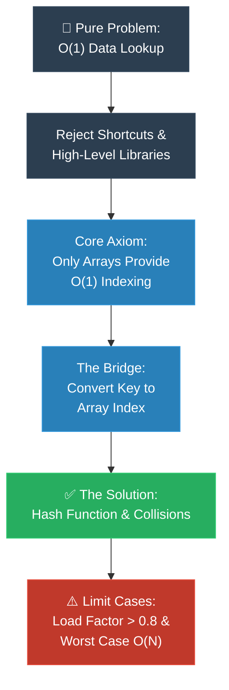

# Strategy 01: The MIT Professor (First Principles / គោល​ការ​ណ៍គ្រឹះដំបូង)

**Author:** ichamrong  
**Date:** 2026-05-18  
**Tags:** #explanation-strategies #mit-professor #first-principles #pedagogy  
**Category:** Concepts / Explanation Strategies  
**Read Time:** ~5 min  

---

## 📌 មាតិកា (Table of Contents)
- [សេចក្តី​ផ្​តើ​ម (Introduction)](#សេចក្តីផ្តើម-introduction)
- [រូបមន្ត​នៃ​ការ​ដោះស្រាយ (The Formula)](#រូបមន្តនៃការដោះស្រាយ-the-formula)
- [ដ្យាក្រាមលំហូរ (Visual Flowchart)](#ដ្យាក្រាមលំហូរ-visual-flowchart)
- [ឧទាហរណ៍​ជាក់ស្តែង៖ ហេτώអ្វី​ត្រូវ​មាន Hash Table? (Practical Example)](#ឧទាហរណ៍ជាក់ស្តែង៖-ហេតុអ្វីត្រូវមាន-hash-table-practical-example)
- [មេរៀន និង​ដែនកំណត់ (When to Use & Limitations)](#មេរៀន-និងដែនកំណត់-when-to-use--limitations)

---

## សេចក្តី​ផ្​តើ​ម (Introduction)

The **MIT Professor** strategy is crafted for curious, capable minds who crave more than just surface-level answers—they demand to know *why* systems are built the way they are. It boldly strips away the shortcuts, the fluff, and the confusing early analogies. Instead, it invites you on a profound journey, walking with you step-by-step from absolute, undeniable truths (axioms) down to the final solution. By the end, you won't just memorize a pattern; you'll feel the inevitable logic that makes the final code the *only* beautiful conclusion.

យុទ្ធសាស្ត្រ **MIT Professor (គោល​ការ​ណ៍គ្រឹះដំបូង)** ត្រូវ​បាន​ច្​នៃ​ប្រឌិតឡើង​សម្រាប់​អ្នក​រៀន​ដែល​មាន​ភាព​ចង់​ដឹង​ចង់​ឃើញ និង​មាន​សមត្ថភាព ដែល​ចង់​បាន​លើ​ស​ពី​ចម្​លើ​យ​សាមញ្ញ ៗ — ពួកគេ​ចង់​យល់ដឹងឱ្យស៊ីជម្រៅថា *ហេតុអ្វី* បាន​ជា​ប្រព័ន្ធ​ទាំង​នោះ​ត្រូវ​រចនាឡើងបែប​នេះ។ វិធីសាស្ត្រ​នេះ​ហ៊ានកាត់ចោលទាំងស្រុងនូវផ្លូវកាត់ ការ​ពន្យល់រាក់ ៗ និង​ការ​ប្រៀបធៀប​ដែល​ធ្វើ​ឱ្យស្មុគស្មាញនៅដំណាក់កាលដំបូង។ ផ្ទុយ​ទៅ​វិញ វាអញ្ជើញ​អ្នក​ឱ្យ​ចូលរួម​ក្នុង​ដំណើរដ៏អស្ចារ្យមួយ ដោយ​ដើរ​ជា​មួយ​អ្នក​មួយជំហានម្តង ៗ ចាប់​ពី​ការ​ពិត​ដែល​មិន​អាចប្រ​កែ​ក​បាន (Axioms) រហូតដល់​ការ​រកឃើញ​ដំណោះស្រាយ​ចុងក្រោយ។ នៅទីបញ្ចប់ អ្នក​មិន​ត្រឹម​តែ​ទន្ទេញចាំនូវទម្រង់​កូដ​ប៉ុណ្ណោះទេ តែ​អ្នក​នឹង​មាន​អារម្មណ៍ដឹង​ពី​តក្កវិជ្​ជា​ដ៏រឹងមាំ ដែល​ធ្វើ​ឱ្យ​កូដ​ចុងក្រោយ​ក្លាយ​ជា​ការ​សន្និដ្ឋានដ៏ស្រស់ស្អាត​តែ​មួយគត់។

---

## រូបមន្ត​នៃ​ការ​ដោះស្រាយ (The Formula)

```
1. ប្រឈមមុខនឹងបញ្ហា (Confront the Problem) យ៉ាងក្លាហាន ក្នុងទម្រង់ដ៏បរិសុទ្ធ និងគ្មានការលើកលែងបំផុតរបស់វា។
2. បំបាត់ភាពរំខាន (Strip away the noise)៖ ទប់ស្កាត់ការចង់លោតផ្លោះទៅរកដំណោះស្រាយរហ័ស ឬការប្រៀបធៀបដែលងាយស្រួលពេក។
3. ឈរលើការពិត (Ground yourself in truth)៖ កសាងដំណោះស្រាយយ៉ាងទន់ភ្លន់ មួយជំហានម្តងៗ ចេញពីគោលការណ៍គ្រឹះ (Axioms) ដែលមិនអាចរង្គោះរង្គើបាន។
4. បង្ហាញពីតក្កវិជ្ជាដែលមិនអាចគេចផុត (Reveal the inevitable logic)៖ បង្ហាញថាតើហេតុអ្វីបានជាផ្លូវមួយនេះគឺជាផ្លូវពិតតែមួយគត់សម្រាប់ឆ្ពោះទៅមុខ។
5. ផ្សារភ្ជាប់គម្លាត (Bridge the gap)៖ នាំយកការប្រៀបធៀបក្នុងពិភពពិតដែលងាយស្រួលយល់ ដើម្បីធ្វើឱ្យគោលគំនិតនោះមានអារម្មណ៍ថាស៊ាំដូចជាធម្មជាតិទីពីរ។
6. ទទួលស្គាល់ដែនកំណត់ (Acknowledge boundaries)៖ ស្វែងយល់ដោយស្មោះត្រង់នូវចំណុចខ្សោយ និងដែនកំណត់នៃការបង្កើតរបស់អ្នក។
```

---

## ដ្យាក្រាមលំហូរ (Visual Flowchart)



---

## ឧទាហរណ៍​ជាក់ស្តែង៖ ហេតុអ្វី​ត្រូវ​មាន Hash Table? (Practical Example)

### The First Principles Derivation (English)
> *"Imagine the ultimate goal: we want instant, zero-delay access to our data, mathematically known as O(1) lookup. When we look closely at how computer memory actually physically operates, there is only one true way to achieve this magic: direct array indexing. So, the profound question we face is this: how do we take something chaotic and unpredictable—like a person's name or a complex object—and gracefully transform it into a neat, valid array index? That beautiful transformation is the essence of hashing. The hash function is our bridge, and every other complex decision we make downstream (handling collisions, managing load, expanding the space) naturally blossoms from this one simple, powerful need."*

### ការ​ទាញហេតុផល​ពី​គោល​ការ​ណ៍គ្រឹះ (Khmer)
> *«ស្រមៃមើល​ពី​គោលដៅដ៏ខ្ពង់ខ្ពស់​របស់​យើង៖ យើង​ចង់​ទាញយក​ទិន្នន័យ​មក​ប្រើប្រាស់​បាន​ភ្លាម ៗ ដោយ​គ្មាន​ការ​ពន្យារ​ពេល ដែល​តាម​ភាសាគណិតវិទ្យាហៅថា O(1) Lookup។ នៅ​ពេល​ដែល​យើងក្រឡេកមើលឱ្យជិត​ពី​របៀប​ដែល​អង្គចងចាំ​កុំ​ព្យូទ័រ​ធ្វើ​ការ​ជាក់ស្តែង គឺ​មាន​វិធី​ពិតប្រាកដ​តែ​មួយគត់​ដើម្បី​សម្រេចនូវភាពអស្ចារ្យ​នេះ៖ នោះ​គឺ​ការ​ចង្អុលទីតាំង​ដោយ​ផ្ទាល់ (Direct Array Indexing)។ ដូច្​នេះ សំណួរដ៏ស៊ីជម្រៅ​ដែល​យើង​ត្រូវ​ប្រឈមមុខ​គឺ៖ តើ​យើងអាចយកអ្វីមួយ​ដែល​គ្មាន​សណ្តាប់ធ្នាប់ និង​ពិបាកទាយទុក — ដូចជា​ឈ្មោះមនុស្ស ឬ Object ដ៏ស្មុគស្មាញ — មក​បំប្លែង​យ៉ាង​ទន់ភ្លន់ឱ្យក្លាយ​ជា Index ដ៏រៀបរយ​និង​ត្រឹម​ត្រូវ​មួយ​ដោយ​របៀបណា? ការ​បំប្លែងដ៏ស្រស់ស្អាត​នោះ​ហើយ គឺជា​បេះដូង​នៃ Hashing។ មុខងារ Hash Function គឺជា​ស្ពានចម្លង​របស់​យើង ហើយ​រាល់​ការ​សម្រេចចិត្តដ៏ស្មុគស្មាញផ្សេង ៗ ទៀត​ដែល​កើត​មាន​តាម​ក្រោយ (ការ​ដោះស្រាយ​ការ​ជា​ន់គ្នា, ការ​គ្រប់​គ្រងទំហំផ្ទុក, ការ​ពង្រីកទំហំ) គឺ​សុទ្ធ​តែ​លេចចេញ​ជា​រូបរាង​យ៉ាង​ធម្ម​ជា​តិ ចេញ​ពី​តម្រូវ​ការ​ដ៏​សាមញ្ញ និង​មាន​ឥទ្ធិពល​តែ​មួយ​នេះ​ប៉ុណ្ណោះ។»*

---

## មេរៀន និង​ដែនកំណត់ (When to Use & Limitations)

### 📈 Best For (សាកសមបំផុត​សម្រាប់)
* **ឯកសារបច្ចេកទេស (Technical Documentation)៖** ការ​សរសេរ​ការ​បញ្​ជា​ក់ API, មគ្គុទ្ទេសក៍ស្ថាបត្យកម្ម, ឬ​ការ​រចនា​ប្រព័ន្ធ។
* **ការ​ណែនាំវិស្វករ​ថ្មី (Onboarding Engineers)៖** ការ​នាំ​អ្នក​អភិវឌ្ឍ​ន៍​ជា​ន់ខ្ពស់ (Senior Developers) ចូល​ទៅ​ក្នុង​កូដ​ដ៏ស្មុគស្មាញ និង​ត្រូវ​បាន​សាងសង់​តាម​តម្រូវ​ការ​ជា​ក់លាក់។
* **អត្ថបទសិក្សាស្រាវជ្រាវ (Academic & High-Authority Posts)៖** ការ​សរសេរ​ឯកសារ ឬ​អត្ថបទប្លុកកម្រិតខ្ពស់​ដែល​បង្កើត​នូវភាព​ជា​អ្នក​ជំនាញ (Authority)។

### ⚠️ Limitations (ដែនកំណត់)
* **បន្ទុកគិតខ្ពស់ (High Cognitive Load)៖** ទាមទារឱ្យទស្សនិកជនយកចិត្តទុកដាក់ខ្ពស់បំផុត។
* **មិន​សាកសម​សម្រាប់​អ្នក​ចាប់ផ្​តើ​ម (Not for Beginners)៖** នឹង​ធ្វើ​ឱ្យ​អ្នក​ដែល​គ្មាន​មូលដ្ឋានគ្រឹះបច្ចេកទេស​ពី​មុន មាន​អារម្មណ៍ថាស្មុគស្មាញពេក។
* **ទាមទារ​ពេល​វេលា (Requires Time)៖** មិន​អាចបង្រួម​ទៅ​ជា​ការ​រៀបរាប់ត្រឹម ៣០ វិនាទី​បាន​ទេ។

---

---

## 📚 Implemented Patterns (គំរូស្ថាបត្យកម្ម​ដែល​បាន​អនុវត្ត)

Here are the design patterns explained in depth using the **MIT Professor (First Principles)** strategy:

* **[01. Singleton (គោល​ការ​ណ៍គ្រឹះដំបូង​នៃ Singleton)](./01-singleton.md)** — Axiom 1: A single database/resource coordinator must guarantee a single source of truth. Axiom 2: Global state is dangerous unless strictly locked. Derivation: Private constructor, static instance, thread-safe lazy loading.
* **[02. Factory Method (គោល​ការ​ណ៍គ្រឹះដំបូង​នៃ Factory Method)](./02-factory-method.md)** — Axiom 1: Direct instantiation couples clients to concrete classes. Axiom 2: Clients only care about abstract products. Derivation: Defer instantiation to subclasses via abstract virtual factory method.
* **[03. Abstract Factory (គោល​ការ​ណ៍គ្រឹះដំបូង​នៃ Abstract Factory)](./03-abstract-factory.md)** — Axiom 1: System must be independent of how its products are created. Axiom 2: Enforce cohesive family of objects. Derivation: Abstract factory interface containing multiple virtual factory methods.
* **[04. Builder (គោល​ការ​ណ៍គ្រឹះដំបូង​នៃ Builder)](./04-builder.md)** — Axiom 1: Positional parameters on call stack cause compile-time swap bugs. Axiom 2: Objects must initialize to valid state atomically. Axiom 3: Multi-threading requires immutability. Derivation: Nested mutable builder class that materializes immutable products safely.

---

## Related
* [← Back to Concepts](../README.md)
* [Strategy 02: Feynman Technique](../02-feynman-technique/README.md)
* [Strategy 08: The Engineer Strategy](../08-engineer-requirements-constraints-solution/README.md)
