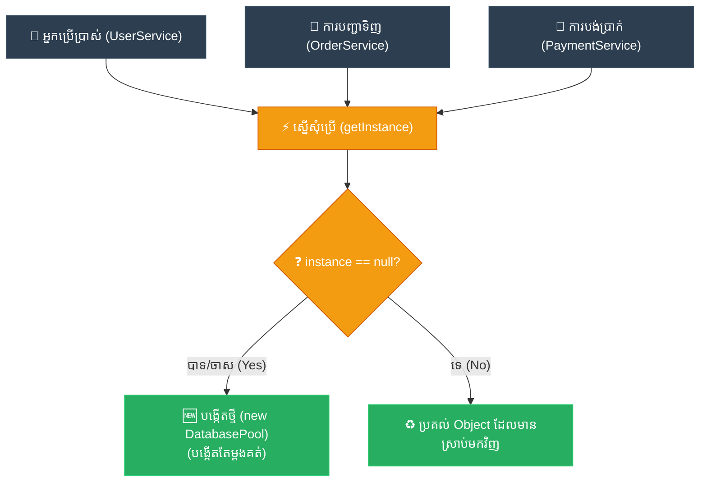

# Feynman Technique: Singleton (ការ​ពន្យល់​ពី Singleton ដោយ​គ្មាន​ពាក្យបច្ចេកទេស)

**Author:** ichamrong  
**Date:** 2026-05-18  
**Tags:** #feynman-technique #simplification #design-patterns #singleton #clean-code  
**Category:** Concepts / Feynman Technique  
**Read Time:** ~5 min  

---

## 📌 មាតិកា (Table of Contents)
- [១. ការ​ពន្យល់បែប​សាមញ្ញ​បំផុត (The Child-Friendly Explanation)](#១-ការពន្យល់បែបសាមញ្ញបំផុត-the-child-friendly-explanation)
- [២. របៀប​ដែល​វាដោះស្រាយ​បញ្ហា (How It Works)](#២-របៀបដែលវាដោះស្រាយបញ្ហា-how-it-works)
- [៣. ដ្យាក្រាមលំហូរ (Visual Flowchart)](#៣-ដ្យាក្រាមលំហូរ-visual-flowchart)
- [៤. Related Posts](#៤-related-posts)

---

## ១. ការ​ពន្យល់បែប​សាមញ្ញ​បំផុត (The Child-Friendly Explanation)

សាកស្រមៃមើលទីក្រុងដ៏អ៊ូអរមួយ ដែល​គ្មាន​នរណាម្នាក់នឹកឃើញសាងសង់នាឡិកាកណ្តាលប្រចាំក្រុងទាល់​តែ​សោះ។ ផ្ទុយ​ទៅ​វិញ ប្រ​ជា​ពលរដ្ឋម្នាក់ ៗ ពឹងផ្អែក​តែ​លើ​នាឡិកាហោប៉ៅរៀង ៗ ខ្លួន។ យូរ ៗ ទៅ នាឡិកាទាំង​នោះ​ក៏ចាប់ផ្​តើ​មដើរ​លឿន ឬ​យឺត​ខុស ៗ គ្នា។ ថ្ងៃមួយ នៅ​ពេល​ដែល​អភិបាលក្រុងដើរចេញ​មក​ក្រៅ ហើយសួរថា 'សូមទោស តើ​ឥឡូវម៉ោងប៉ុន្​មាន​ហើយ?' មនុស្ស ៥០ នាក់ស្រែកឆ្​លើ​យប្រាប់ម៉ោងខុស ៗ គ្នា ៥០ បែប។ វា​ពិត​ជា​ស្ថានភាពដ៏វឹកវរ និង​គួរឱ្យឈឺក្បាល​ខ្លាំងណាស់!

ដើម្បី​ស្តារភាពស្ងប់ស្ងាត់ និង​សណ្តាប់ធ្នាប់ឡើងវិញ ទីក្រុងក៏សម្រេចចិត្តសាងសង់ **ប៉មនាឡិកាដ៏ស្រស់ស្អាត​និង​ខ្ពស់ត្រដែតមួយ** នៅចំកណ្តាលបេះដូង​នៃ​ទីលានក្រុង។ ចាប់​ពី​ថ្ងៃ​នោះ​មក គ្មាន​នរណាម្នាក់​ត្រូវ​បាន​អនុញ្ញាតឱ្យប្រើនាឡិកាផ្ទាល់ខ្លួនទៀតទេ។ ទោះ​ជា​អ្នក​ដុតនំ គ្រូបង្រៀន ឬ​អភិបាលក្រុងក្តី ប្រសិនបើ​ចង់​ដឹងម៉ោង ពួកគេ​ទាំងអស់​គ្នា​ត្រូវតែ​ងើបមុខសម្លឹងមើល​ទៅកាន់​មុខនាឡិកា​តែ​មួយគត់​នោះ។

ភ្លាម ៗ នោះ ការ​ពិត​បាន​ក្លាយ​ជា **ប្រភព​តែ​មួយគត់ (One source of truth)**។ អ្នក​ក្រុងទាំងមូលដកដង្ហើមធូរទ្រូង ហើយរស់នៅស្រប​ពេល​គ្នា​យ៉ាង​ស្ងប់ស្ងាត់ និង​ល្អ​ឥតខ្ចោះ។

នៅក្នុង​ពិភព​នៃ​ការ​សរសេរ​កូដ ប៉មនាឡិកា​ដែល​ផ្តល់ភាពកក់ក្តៅ​នោះ​ហើយ គឺជា **Singleton Pattern**។ ជំនួសឱ្យ​ការ​បណ្តោយឱ្យផ្នែកផ្សេង ៗ នៃ​កម្មវិធី​របស់​អ្នក​បង្កើត​ច្បាប់ចម្លងរញ៉េរញ៉ៃ​ដាច់ដោយឡែក​ពី​គ្នានូវធនធានដ៏សំខាន់ (ដូចជា​ការ​ភ្​ជា​ប់​ទៅកាន់ Database ជា​ដើម) អ្នក​គ្រាន់​តែ​បង្កើត​វិន័យដ៏ទន់ភ្លន់មួយ៖ គ្រប់​គ្នា​ត្រូវតែ​សម្លឹងមើល និង​ប្រើប្រាស់ **Object តែ​មួយគត់រួមគ្នា**។ លែង​មាន​ភាពច្របូកច្របល់ទៀតហើយ។

---

## ២. របៀប​ដែល​វាដោះស្រាយ​បញ្ហា (How It Works)

យើង​ការ​ពារ​កុំ​ឱ្យផ្នែកផ្សេងទៀត​នៃ​កម្មវិធី​ហៅ​ពាក្យគន្លឹះ `new` បាន ដោយ​ការ​ដាក់ Constructor របស់ Class ឱ្យ​ទៅ​ជា `private`។ បន្ទាប់​មក យើង​បង្កើត​អថេរ `private static` មួយ​នៅក្នុង Class នោះ​ដើម្បី​រក្សាទុក Object តែ​មួយគត់​នោះ ហើយផ្តល់នូវមុខងារ `public static` មួយ (ជា​ទូ​ទៅ​ឈ្មោះថា `getInstance()`) ជា​ច្រកទ្វារ​តែ​មួយគត់​ដើម្បី​ចូល​ប្រើប្រាស់​វា។ នៅ​ពេល​កូដ​ផ្សេងទៀតហៅ `getInstance()` វានឹងពិនិត្យមើល​ថាតើ Object នោះ​ត្រូវ​បាន​បង្កើត​ហើយ​ឬ​នៅ។ បើ​មិន​ទាន់ទេ វានឹង​បង្កើត​ម្តងគត់រួចរក្សាទុក ប៉ុន្តែ​បើ​មាន​រួចហើយ វានឹងហុច Object ដែល​រក្សាទុក​នោះ​មក​វិញភ្លាម ៗ ។

---

## ៣. ដ្យាក្រាមលំហូរ (Visual Flowchart)

---

## ៤. Related Posts

### 🔗 Explore All Viewpoints:
* 📖 **Read the Parable:** [The Bank's Only Vault (ទូដែក​តែ​មួយគត់​របស់​ធនាគារ)](../../parables/75-the-banks-only-vault.md) — Explains the emotional core of shared truth.
* 🧠 **Read the First Principles Derivation:** [MIT Professor Strategy: Singleton (គោល​ការ​ណ៍គ្រឹះដំបូង​នៃ Singleton)](../01-mit-professor/01-singleton.md) — Derives the pattern from fundamental computer axioms.
* 👶 **Read the Feynman Simplification:** [Feynman Technique: Singleton (ការ​ពន្យល់​ពី Singleton ដោយ​គ្មាន​ពាក្យបច្ចេកទេស)](../02-feynman-technique/04-singleton.md) — Breaks it down using the central clock tower.
* 👦 **Read the ELI5 Metaphor:** [ELI5: Singleton (ម៉ាស៊ីនខួងខ្មៅដៃ​តែ​មួយគត់​ក្នុង​ថ្នាក់រៀន)](../03-eli5/04-singleton.md) — Teaches it to a five-year-old using classroom pencil sharpeners.
* 🌉 **Read the Analogy Bridge:** [Analogy Bridge: Singleton (ស្ពានប្រៀបធៀប​នៃ​ប្រភព​ពិត​តែ​មួយគត់)](../04-analogy-bridge/04-singleton.md) — Maps it to a hotel front desk and shows where physical limits fail compared to code threads.
* 🧐 **Read the Socratic Discovery:** [Socratic Method: Singleton (ការ​បង្កើត​ប្រព័ន្ធ​ការ​ពិត​តែ​មួយគត់​តាម​វិធីសាស្ត្រសូក្រាត)](../05-socratic-method/04-singleton.md) — Guide your self-discovery through mentor-student dialogue.
* 📰 **Read the Journalist Summary:** [Journalist: Singleton (ការ​ធានាឱ្យ​មាន​ការ​ពិត​តែ​មួយគត់​ក្នុង​ប្រព័ន្ធ​ទាំងមូល)](../06-journalist-inverted-pyramid/04-singleton.md) — Get the high-impact lede, volatile visibility, and thread-safety details first.
* 🎭 **Read the Storyteller Narrative:** [Storyteller: Singleton (អាណាព្យាបាល​នៃ​សេចក្តី​ពិត និង​កងទ័ពក្លូនបង្កចលាចល)](../07-storyteller-narrative-arc/04-singleton.md) — Follow Kiri's heroic journey to vanquish the duplicate logger clone army.
* ⚙️ **Read the Engineer Spec:** [Engineer: Singleton (ការ​សម្របសម្រួល​ប្រភព​ពិត​តែ​មួយគត់ និង​ទប់ស្កាត់​ការ​ខ្ជះខ្​ជា​យធនធាន)](../08-engineer-requirements-constraints-solution/03-singleton.md) — Read the rigorous engineering specification, DCL performance details, and candidate elimination.
* 📊 **Read the Pros & Cons:** [Pros & Cons Compared: Singleton (ការ​ប្រៀបធៀបគុណសម្បត្តិ និង​គុណវិបត្តិ​នៃ Singleton)](../09-pros-and-cons-compared/01-singleton.md) — Full trade-off analysis and decision matrix.
* 🛠️ **Read the Code Implementation:** [Creational Patterns: The Art of Instantiation](../../../clean-code/design-patterns/01-creational-patterns.md#the-singleton) — Production-grade Java with double-checked locking and thread safety.
