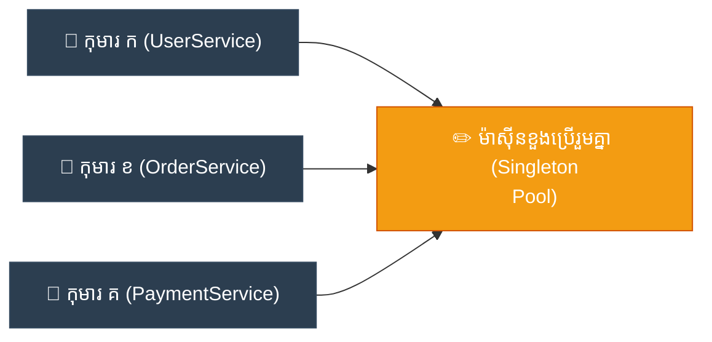

# ELI5: Singleton (ម៉ាស៊ីនខួងខ្មៅដៃ​តែ​មួយគត់​ក្នុង​ថ្នាក់រៀន)

**Author:** ichamrong  
**Date:** 2026-05-18  
**Tags:** #eli5 #simplification #design-patterns #singleton #clean-code  
**Category:** Concepts / ELI5  
**Read Time:** ~5 min  

---

## 📌 មាតិកា (Table of Contents)
- [១. គិតឱ្យ​សាមញ្ញ (Think Like a 5-Year-Old)](#១-គិតឱ្យសាមញ្ញ-think-like-a-5-year-old)
- [២. ស្ពានភ្​ជា​ប់​ទៅកាន់​កូដ (Bridge to Code)](#២-ស្ពានភ្ជាប់ទៅកាន់កូដ-bridge-to-code)
- [៣. ដ្យាក្រាមលំហូរ (Visual Flowchart)](#៣-ដ្យាក្រាមលំហូរ-visual-flowchart)
- [៤. Related Posts](#៤-related-posts)

---

## ១. គិតឱ្យ​សាមញ្ញ (Think Like a 5-Year-Old)

សាកស្រមៃមើលថ្នាក់មត្តេយ្យដ៏អ៊ូអរមួយ ដែល​ពោរពេញ​ទៅ​ដោយ​ក្មេង ៗ ដ៏គួរឱ្យស្រលាញ់ចំនួន ៣០ នាក់ ដែល​កំពុង​តែ​ខិតខំគូររូប​យ៉ាង​សប្បាយរីករាយ។ ស្រាប់​តែ​ពេល​នោះ គ្រប់​គ្នាសុទ្ធ​តែ​ត្រូវ​ការ​ខួងខ្មៅដៃ​របស់​ពួកគេ​ក្នុង​ពេល​តែ​មួយ។

ឥឡូវ​នេះ សាកស្រមៃមើលថា តើ​នឹង​មាន​រឿងអ្វីកើតឡើង ប្រសិនបើក្មេងម្នាក់ ៗ សុទ្ធ​តែ​បាន​យកម៉ាស៊ីនខួងខ្មៅដៃអគ្គិសនីដ៏ធំ ៗ និង​ឮសម្លេង​ខ្លាំង ៗ រៀង ៗ ខ្លួន មក​ដាក់ទង្គិចចុះ​លើ​តុរៀនដ៏តូច​របស់​ពួកគេ​នោះ? តុរៀនច្បាស់​ជា​លែង​មាន​កន្លែងទំនេរ​សម្រាប់​ដាក់ក្រដាសគំនូរទៀតហើយ! សម្លេងរោទ៍កងរំពង​នៃ​ម៉ាស៊ីនទាំង ៣០ ដំណើរ​ការ​ព្រមគ្នា នឹង​ធ្វើ​ឱ្យថ្លង់ហឹងត្រចៀក ហើយកាកសំណល់ឈើខ្មៅដៃច្បាស់​ជា​ហោះរាយប៉ាយកខ្វក់ពេញ​ការ​៉ូផ្ទាល់ដី​ជា​មិន​ខាន!

ដើម្បី​សង្គ្រោះថ្នាក់រៀន​ពី​ភាពវឹកវរ​នេះ អ្នក​គ្រូដ៏ឈ្លាសវៃ​បាន​ញញឹម រួច​បង្កើត​វិន័យដ៏ទន់ភ្លន់មួយថា៖ **«សូ​មក​ុំយកម៉ាស៊ីនខួងខ្មៅដៃ​ពី​ផ្ទះ​មក​ថ្នាក់រៀនទៀតអីណា៎កូន ៗ !»**

ផ្ទុយ​ទៅ​វិញ អ្នក​គ្រូ​បាន​ទិញ **ម៉ាស៊ីនខួងខ្មៅដៃអគ្គិសនីដ៏ធំ ស្រស់ស្អាត និង​លឿន​បំផុត​តែ​មួយគត់** យក​មក​ដាក់​យ៉ាង​មាន​របៀបនៅ​លើ​តុ​របស់​អ្នក​គ្រូនៅខាងមុខថ្នាក់។ ពេល​នេះ រាល់​ពេល​ដែល​ក្មេងណាម្នាក់​ត្រូវ​ការ​ខួងខ្មៅដៃ ពួកគេគ្រាន់​តែ​ក្រោកឈរ ដើរ​ទៅ​ខាងមុខ ហើយ​ប្រើប្រាស់​ម៉ាស៊ីនខួង​តែ​មួយគត់​ដែល​ប្រើរួមគ្នា​នោះ។

វាជួយសន្សំសំចៃទំហំតុរៀន​បាន​យ៉ាង​អស្ចារ្យ សន្សំសំចៃលុយ និង​រក្សាបរិយាកាស​ក្នុង​ថ្នាក់ឱ្យនៅ​តែ​ស្អាត ស្ងប់ស្ងាត់ និង​ពោរពេញ​ដោយ​ក្តីសុខ។

នៅក្នុង​ពិភព​សរសេរ​កម្មវិធី ម៉ាស៊ីនខួងខ្មៅដៃ​តែ​មួយគត់​ដែល​ផ្តល់ភាពស្ងប់ស្ងាត់​នេះ​ហើយ គឺជា **Singleton Pattern**។

---

## ២. ស្ពានភ្​ជា​ប់​ទៅកាន់​កូដ (Bridge to Code)

នៅ​ពេល​ដែល​កូដ​របស់​អ្នក​ភ្​ជា​ប់​ទៅកាន់ Database វា​ប្រើប្រាស់ "Connection Pool"។ ការ​បង្កើត Pool ថ្មី​នីមួយ ៗ គឺ​ស៊ីកម្លាំងម៉ាស៊ីន និង​ចំណាយមេម៉ូរី​កុំ​ព្យូទ័រច្រើនណាស់ (ដូចជា​ការ​យកម៉ាស៊ីនខួងខ្មៅដៃធំ ៗ ៣០ គ្រឿងចូលថ្នាក់រៀនអញ្ចឹង)។ ប្រសិនបើ Service នីមួយ ៗ (`UserService`, `OrderService`, `PaymentService`) បង្កើត Pool ផ្ទាល់ខ្លួនរៀង ៗ ខ្លួន នោះ​ប្រព័ន្ធ​នឹងអស់មេម៉ូរី ហើយគាំង​ជា​មិន​ខាន។ ដោយ​ការ​ប្រើប្រាស់ **Singleton Pattern** យើងធានាថា​មាន **Object Pool តែ​មួយគត់** នៅក្នុង​មេម៉ូរី ហើយ​គ្រប់ Service ទាំងអស់​ចែករំលែកវា​ដោយ​សុវត្ថិភាព។

---

## ៣. ដ្យាក្រាមលំហូរ (Visual Flowchart)

---

## ៤. Related Posts

### 🔗 Explore All Viewpoints:
* 📖 **Read the Parable:** [The Bank's Only Vault (ទូដែក​តែ​មួយគត់​របស់​ធនាគារ)](../../parables/75-the-banks-only-vault.md) — Explains the emotional core of shared truth.
* 🧠 **Read the First Principles Derivation:** [MIT Professor Strategy: Singleton (គោល​ការ​ណ៍គ្រឹះដំបូង​នៃ Singleton)](../01-mit-professor/01-singleton.md) — Derives the pattern from fundamental computer axioms.
* 👶 **Read the Feynman Simplification:** [Feynman Technique: Singleton (ការ​ពន្យល់​ពី Singleton ដោយ​គ្មាន​ពាក្យបច្ចេកទេស)](../02-feynman-technique/04-singleton.md) — Breaks it down using the central clock tower.
* 👦 **Read the ELI5 Metaphor:** [ELI5: Singleton (ម៉ាស៊ីនខួងខ្មៅដៃ​តែ​មួយគត់​ក្នុង​ថ្នាក់រៀន)](../03-eli5/04-singleton.md) — Teaches it to a five-year-old using classroom pencil sharpeners.
* 🌉 **Read the Analogy Bridge:** [Analogy Bridge: Singleton (ស្ពានប្រៀបធៀប​នៃ​ប្រភព​ពិត​តែ​មួយគត់)](../04-analogy-bridge/04-singleton.md) — Maps it to a hotel front desk and shows where physical limits fail compared to code threads.
* 🧐 **Read the Socratic Discovery:** [Socratic Method: Singleton (ការ​បង្កើត​ប្រព័ន្ធ​ការ​ពិត​តែ​មួយគត់​តាម​វិធីសាស្ត្រសូក្រាត)](../05-socratic-method/04-singleton.md) — Guide your self-discovery through mentor-student dialogue.
* 📰 **Read the Journalist Summary:** [Journalist: Singleton (ការ​ធានាឱ្យ​មាន​ការ​ពិត​តែ​មួយគត់​ក្នុង​ប្រព័ន្ធ​ទាំងមូល)](../06-journalist-inverted-pyramid/04-singleton.md) — Get the high-impact lede, volatile visibility, and thread-safety details first.
* 🎭 **Read the Storyteller Narrative:** [Storyteller: Singleton (អាណាព្យាបាល​នៃ​សេចក្តី​ពិត និង​កងទ័ពក្លូនបង្កចលាចល)](../07-storyteller-narrative-arc/04-singleton.md) — Follow Kiri's heroic journey to vanquish the duplicate logger clone army.
* ⚙️ **Read the Engineer Spec:** [Engineer: Singleton (ការ​សម្របសម្រួល​ប្រភព​ពិត​តែ​មួយគត់ និង​ទប់ស្កាត់​ការ​ខ្ជះខ្​ជា​យធនធាន)](../08-engineer-requirements-constraints-solution/03-singleton.md) — Read the rigorous engineering specification, DCL performance details, and candidate elimination.
* 📊 **Read the Pros & Cons:** [Pros & Cons Compared: Singleton (ការ​ប្រៀបធៀបគុណសម្បត្តិ និង​គុណវិបត្តិ​នៃ Singleton)](../09-pros-and-cons-compared/01-singleton.md) — Full trade-off analysis and decision matrix.
* 🛠️ **Read the Code Implementation:** [Creational Patterns: The Art of Instantiation](../../../clean-code/design-patterns/01-creational-patterns.md#the-singleton) — Production-grade Java with double-checked locking and thread safety.
