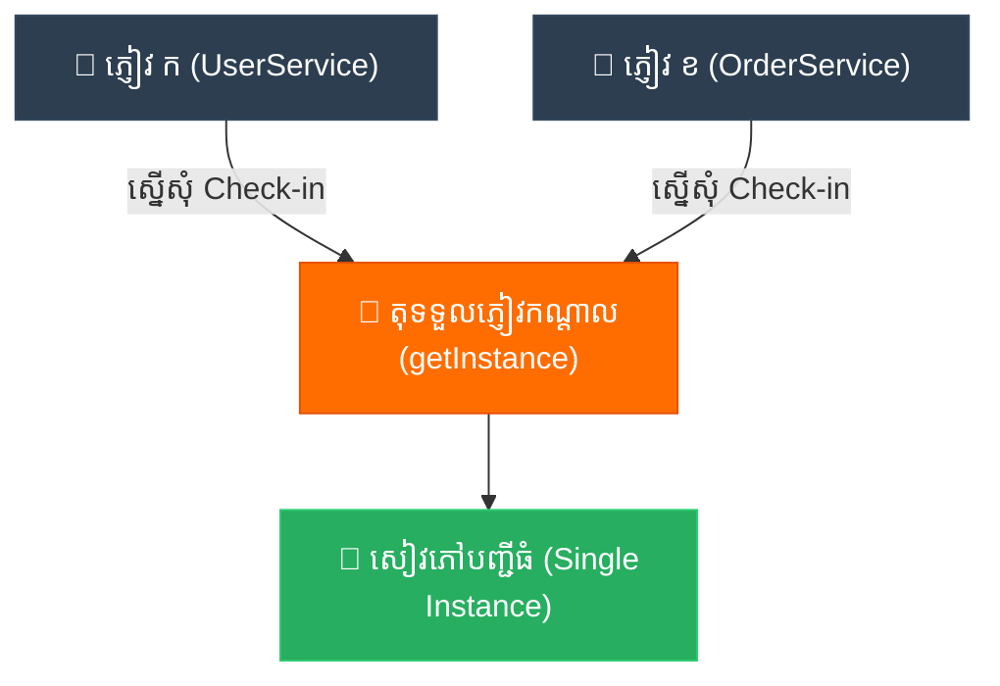

# Analogy Bridge: Singleton (ស្ពានប្រៀបធៀប​នៃ​ប្រភព​ពិត​តែ​មួយគត់)

**Author:** ichamrong  
**Date:** 2026-05-18  
**Tags:** #analogy-bridge #analogy #design-patterns #singleton #clean-code  
**Category:** Concepts / Analogy Bridge  
**Read Time:** ~5 min  

---

## 📌 មាតិកា (Table of Contents)
- [១. ស្ពានភ្​ជា​ប់គំនិត (The Analogy Bridge)](#១-ស្ពានភ្ជាប់គំនិត-the-analogy-bridge)
- [២. ព្រំដែន​នៃ​ភាពដូចគ្នា (Where the Analogy Breaks)](#២-ព្រំដែននៃភាពដូចគ្នា-where-the-analogy-breaks)
- [៣. ដ្យាក្រាមលំហូរ (Visual Flowchart)](#៣-ដ្យាក្រាមលំហូរ-visual-flowchart)
- [៤. Related Posts](#៤-related-posts)

---

## ១. ស្ពានភ្​ជា​ប់គំនិត (The Analogy Bridge)

* **ដែនដឹងស្គាល់ (ពិភពពិត):** ស្រមៃថា​អ្នក​កំពុងបោះជំហានចូល​ទៅ​ក្នុង​សណ្ឋាគារដ៏ធំទូលាយ និង​ស្រស់ស្អាតមួយ​ដែល​មាន​បន្ទប់រាប់រយ។ ប្រសិនបើ​គ្មាន​តុទទួលភ្ញៀវកណ្តាលទេ ភាពវឹកវរនឹងបំផ្លាញសន្តិភាពនៅទី​នោះ​ភ្លាម ៗ ។ ភ្ញៀវនឹងព្យាយាមសុំ Check-in ជា​មួយ​អ្នក​ឆុងស្រា អ្នក​យួរវ៉ាលី ឬ​អ្នក​អនាម័យ។ គ្រួសារ​ដែល​កំពុងហត់នឿយ​ពី​រគ្រួសារអាចនឹង​ត្រូវ​គេបញ្ជូន​ទៅកាន់​បន្ទប់​តែ​មួយ ដែល​បង្ក​ជា​ការ​ភ័ន្តច្រឡំ ទឹកភ្នែក និង​បំផ្លាញភាពសប្បាយរីករាយ​ក្នុង​ថ្ងៃឈប់សម្រាក។ ដើម្បី​រក្សាបរិយាកាសស្ងប់ស្ងាត់ និង​កក់ក្តៅ សណ្ឋាគារ​បាន​តម្រង់ទិស​អ្នក​គ្រប់​គ្នា​ទៅកាន់ **តុទទួលភ្ញៀវកណ្តាល​តែ​មួយគត់** ដែល​ជា​អ្នក​កាន់សៀវភៅបញ្ជីធំ ដើម្បី​ធានាថាគ្រួសារនីមួយ ៗ ទទួល​បាន​ការ​ស្នាក់នៅ​យ៉ាង​ល្អ​ឥតខ្ចោះ។
* **ដែន​មិន​ស្គាល់ (ស្ថាបត្យកម្​មក​ូដ):** នៅក្នុង​កូដ ធនធានសំខាន់ ៗ ដូចជា Database Connection, System Logger ឬ Configuration Manager ប្រៀប​បាន​នឹងបេះដូង​នៃ​កម្មវិធី​របស់​អ្នក។ ប្រសិនបើផ្នែកនីមួយ ៗ នៃ​កម្មវិធី (`UserService`, `PaymentService`) ព្យាយាម​បង្កើត​បេះដូងរៀង ៗ ខ្លួន ពួកវានឹងដណ្​តើ​មធនធានគ្នា សរសេរ​ជា​ន់​លើ​ទិន្នន័យ​គ្នា​ទៅ​វិញ​ទៅ​មក ហើយទីបំផុតនឹង​ធ្វើ​ឱ្យ​ប្រព័ន្ធ​ទាំងមូលដួលរលំ​ដោយសារ​ការ​ទាញព្រ័ត្រដ៏វឹកវរ​នេះ។
* **ស្ពានតភ្​ជា​ប់ (The Bridge):** Singleton Pattern ដើរតួប្រៀប​ដូចជា **តុទទួលភ្ញៀវដ៏កក់ក្តៅ និង​ផ្តល់​ការ​ណែនាំ** នោះ​អញ្ចឹង។ វាបិទទ្វារ​យ៉ាង​ថ្នម ៗ មិន​ឱ្យ​មាន​ការ​បង្កើត​ច្បាប់ចម្លងរញ៉េរញ៉ៃច្រើន (តាមរយៈ private constructor) និង​បើកច្រកទ្វារ​តែ​មួយគត់​ជា​និច្ច (`getInstance()`)។ រាល់​ពេល​ដែល Service ណាមួយ​ត្រូវ​ការ​ជំនួយ វាគ្រាន់​តែ​សួរ​ទៅកាន់​អ្នក​សម្របសម្រួល​ដ៏ឈ្លាសវៃ​តែ​មួយគត់​នេះ ដែល​ធានា​បាន​នូវភាពចុះសម្រុងគ្នា និង​ប្រភព​នៃ​ការ​ពិត​តែ​មួយគត់​នៅក្នុង​កម្មវិធី​ទាំងមូល។

---

## ២. ព្រំដែន​នៃ​ភាពដូចគ្នា (Where the Analogy Breaks)

នៅក្នុង​សណ្ឋាគារ​ពិតប្រាកដ តុទទួលភ្ញៀវកណ្តាល​គឺជា​កន្លែង​ជាក់ស្តែង​ដែល​ភ្ញៀវ​ត្រូវ​តម្រង់ជួររង់ចាំម្តងម្នាក់ ៗ ដែល​បង្កើត​ឱ្យ​មាន​ការ​កក​ស្ទះ (Bottleneck)។ នៅក្នុង​ការ​សរសេរ​កូដ នៅ​ពេល​ដែល Object Singleton ត្រូវ​បាន​បង្កើត​រួច​រាល់ នោះ​ខ្សែស្រឡាយ​ការ​ងារ (Threads) ច្រើនអាចចូល​ប្រើប្រាស់ Object តែ​មួយ​នោះ​ក្នុង​ពេល​ដំណាលគ្នា​បាន​យ៉ាង​លឿន​បំផុត​តាម​ល្បឿនមេម៉ូរី។ Singleton នឹង​ធ្វើ​ឱ្យ​ស្ទះ​ការ​ងារ​តែ​ក្នុង​អំឡុង​ពេល​បង្កើត​ដំបូងប៉ុណ្ណោះ (ប្រសិនបើប្រើ Synchronization) ប៉ុន្តែ​បន្ទាប់​ពី​នោះ វានឹងបម្រើ​ការ​ងារ​អាន និង​សរសេរ​ក្នុង​ពេល​ដំណាលគ្នា​ដោយ​គ្មាន​ការ​ស្ទះ​ឡើយ ដរាបណាមុខងារ​ខាងក្នុង​របស់​វា​ត្រូវ​បាន​រចនាឡើង​ដោយ​មាន​សុវត្ថិភាព (Thread-safe)។

---

## ៣. ដ្យាក្រាមលំហូរ (Visual Flowchart)

---

## ៤. Related Posts

### 🔗 Explore All Viewpoints:
* 📖 **Read the Parable:** [The Bank's Only Vault (ទូដែក​តែ​មួយគត់​របស់​ធនាគារ)](../../parables/75-the-banks-only-vault.md) — Explains the emotional core of shared truth.
* 🧠 **Read the First Principles Derivation:** [MIT Professor Strategy: Singleton (គោល​ការ​ណ៍គ្រឹះដំបូង​នៃ Singleton)](../01-mit-professor/01-singleton.md) — Derives the pattern from fundamental computer axioms.
* 👶 **Read the Feynman Simplification:** [Feynman Technique: Singleton (ការ​ពន្យល់​ពី Singleton ដោយ​គ្មាន​ពាក្យបច្ចេកទេស)](../02-feynman-technique/04-singleton.md) — Breaks it down using the central clock tower.
* 👦 **Read the ELI5 Metaphor:** [ELI5: Singleton (ម៉ាស៊ីនខួងខ្មៅដៃ​តែ​មួយគត់​ក្នុង​ថ្នាក់រៀន)](../03-eli5/04-singleton.md) — Teaches it to a five-year-old using classroom pencil sharpeners.
* 🌉 **Read the Analogy Bridge:** [Analogy Bridge: Singleton (ស្ពានប្រៀបធៀប​នៃ​ប្រភព​ពិត​តែ​មួយគត់)](../04-analogy-bridge/04-singleton.md) — Maps it to a hotel front desk and shows where physical limits fail compared to code threads.
* 🧐 **Read the Socratic Discovery:** [Socratic Method: Singleton (ការ​បង្កើត​ប្រព័ន្ធ​ការ​ពិត​តែ​មួយគត់​តាម​វិធីសាស្ត្រសូក្រាត)](../05-socratic-method/04-singleton.md) — Guide your self-discovery through mentor-student dialogue.
* 📰 **Read the Journalist Summary:** [Journalist: Singleton (ការ​ធានាឱ្យ​មាន​ការ​ពិត​តែ​មួយគត់​ក្នុង​ប្រព័ន្ធ​ទាំងមូល)](../06-journalist-inverted-pyramid/04-singleton.md) — Get the high-impact lede, volatile visibility, and thread-safety details first.
* 🎭 **Read the Storyteller Narrative:** [Storyteller: Singleton (អាណាព្យាបាល​នៃ​សេចក្តី​ពិត និង​កងទ័ពក្លូនបង្កចលាចល)](../07-storyteller-narrative-arc/04-singleton.md) — Follow Kiri's heroic journey to vanquish the duplicate logger clone army.
* ⚙️ **Read the Engineer Spec:** [Engineer: Singleton (ការ​សម្របសម្រួល​ប្រភព​ពិត​តែ​មួយគត់ និង​ទប់ស្កាត់​ការ​ខ្ជះខ្​ជា​យធនធាន)](../08-engineer-requirements-constraints-solution/03-singleton.md) — Read the rigorous engineering specification, DCL performance details, and candidate elimination.
* 📊 **Read the Pros & Cons:** [Pros & Cons Compared: Singleton (ការ​ប្រៀបធៀបគុណសម្បត្តិ និង​គុណវិបត្តិ​នៃ Singleton)](../09-pros-and-cons-compared/01-singleton.md) — Full trade-off analysis and decision matrix.
* 🛠️ **Read the Code Implementation:** [Creational Patterns: The Art of Instantiation](../../../clean-code/design-patterns/01-creational-patterns.md#the-singleton) — Production-grade Java with double-checked locking and thread safety.
