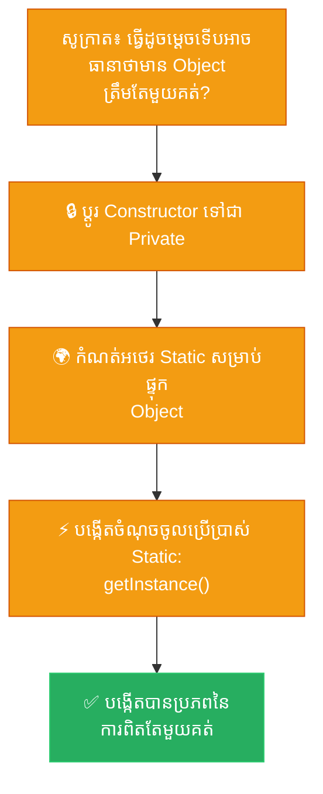

# Socratic Method: Singleton (ការ​បង្កើត​ប្រព័ន្ធ​ការ​ពិត​តែ​មួយគត់​តាម​វិធីសាស្ត្រសូក្រាត)

**Author:** ichamrong  
**Date:** 2026-05-18  
**Tags:** #socratic-method #dialogue #design-patterns #singleton #clean-code  
**Category:** Concepts / Socratic Method  
**Read Time:** ~5 min  

---

## 📌 មាតិកា (Table of Contents)
- [១. កិច្ចសន្ទនាស្វែងរក​ការ​ពិត (The Socratic Dialogue)](#១-កិច្ចសន្ទនាស្វែងរកការពិត-the-socratic-dialogue)
- [២. សេចក្តីសន្និដ្ឋាន​នៃ​ស្ថាបត្យកម្ម (Architectural Conclusion)](#២-សេចក្តីសន្និដ្ឋាននៃស្ថាបត្យកម្ម-architectural-conclusion)
- [៣. ដ្យាក្រាមលំហូរ (Visual Flowchart)](#៣-ដ្យាក្រាមលំហូរ-visual-flowchart)
- [៤. Related Posts](#៤-related-posts)

---

## ១. កិច្ចសន្ទនាស្វែងរក​ការ​ពិត (The Socratic Dialogue)

* **សូក្រាត៖** «គ្លូខុន សម្លាញ់​របស់​ខ្ញុំ នៅ​ពេល​កម្មវិធី​ដ៏ស្រស់ស្អាត​របស់​អ្នក​បើកដំណើរ​ការ​ដើម្បី​បម្រើពិភពលោក តើ Service ដ៏ឧស្សាហ៍ព្យាយាម​របស់​អ្នក​ចូល​ទៅ​មើល​ការ​កំណត់រួម (Global Configs) ដោយ​របៀបណា?»
* **គ្លូខុន៖** «វាហាក់​ដូចជា​សាមញ្ញ​ណាស់ សូក្រាត។ នៅ​ពេល Service ណាមួយ — ដូចជា Payment Gateway ដ៏មមាញឹក ឬ Emailer ដ៏ឧស្សាហ៍ — ត្រូវ​ការ​ការ​កំណត់ ពួកវាគ្រាន់​តែ​បង្កើត Object `ConfigReader` ផ្ទាល់ខ្លួន​របស់​វាភ្លាម៖ `new ConfigReader()`។»
* **សូក្រាត៖** «ខ្ញុំយល់ហើយ។ ចុះបើ​អ្នក​គ្រប់​គ្រង​ប្រព័ន្ធ​ត្រូវ​ផ្លាស់ប្តូរ​ការ​កំណត់បន្ទាន់​ដើម្បី​បញ្ឈប់​បញ្ហា​ណាមួយ? តើ Service ដ៏កំសត់​ទាំងអស់​នោះ​នឹងដឹង​ពី​ការ​ផ្លាស់ប្តូរដ៏សំខាន់​នេះ​ដោយ​របៀបណា?»
* **គ្លូខុន៖** «អូព្រះអើយ... Service ដែល​ធ្វើ​ការ​កែប្រែ គឺ​បាន​កែប្រែ​តែ​លើ `ConfigReader` ផ្ទាល់ខ្លួន​របស់​វាប៉ុណ្ណោះ! Service កំសត់ផ្សេងទៀត​គឺ​ងងឹតភ្នែកឈឹង ដោយ​នៅ​តែ​កាន់ឱប​យ៉ាង​តឹងនូវ​ការ​កំណត់​ចាស់ ៗ ដែល​ហួសសម័យ!»
* **សូក្រាត៖** «ចុះ​កម្មវិធី​របស់​អ្នក​កំពុងរងទុក្ខ​ដោយសារ​ជំងឺបែកបាក់បុគ្គលិក​លក្ខណៈ​មែនទេ? ផ្នែកមួយគិតថាពិភពលោក​មាន​សុវត្ថិភាព ចំណែកមួយផ្នែកទៀតកំពុងរត់​ទៅ​រកគ្រោះថ្នាក់​ដោយ​ងងឹតងងល់?»
* **គ្លូខុន៖** «ពិត​មែនហើយ សូក្រាត! វាបង្កឱ្យ​មាន Bug ដ៏ស្ងៀមស្ងាត់​ដែល​បំផ្លាញ​ទិន្នន័យ​អ្នកប្រើប្រាស់​របស់​យើង។ វា​ជា​សុបិន្ត​អាក្រក់​ពិត ៗ ។»
* **សូក្រាត៖** «ចុះបើ​មាន​អ្នកប្រើប្រាស់ ១០,០០០ នាក់សម្រុកចូលគេហ​ទំព័រ​របស់​អ្នក​ក្នុង​ពេល​តែ​មួយ? តើ​អ្នក​បង្ខំឱ្យ Server បង្កើត `ConfigReader` ដែល​ស៊ីកម្លាំង និង​ស្ទួនគ្នាបេះបិទចំនួន ១០,០០០ ដងមែនទេ?»
* **គ្លូខុន៖** «យើងច្បាស់​ជា​ធ្វើ​បែប​នោះ​ហើយ។ មេម៉ូរីនឹងឡើងប៉ោង​យ៉ាង​ខ្លាំង ប្រព័ន្ធ​បោសសម្អាតនឹង​ស្ទះ​ដង្ហើម ហើយ​កម្មវិធី​ដ៏​ជា​ទីស្រលាញ់​របស់​យើងនឹងដួលរលំ​ក្រោម​ទម្ងន់​នៃ​រូបតំណាងក្លែងក្លាយ​របស់​វាផ្ទាល់។»
* **សូក្រាត៖** «សោកនាដកម្ម​នេះ​កើតឡើង​ដោយសារ​យើងបណ្តោយឱ្យផ្នែកនីមួយ ៗ បង្កើត​សេចក្តី​ពិត​ដ៏ឯកកោរៀង ៗ ខ្លួន។ តើ​យើងអាចណែនាំពួកគេ​យ៉ាង​ថ្នម ៗ ឱ្យ​មក​ប្រើប្រាស់​ប្រភព​នៃ​ការ​ពិត​តែ​មួយរួមគ្នា​បាន​ដោយ​របៀបណា?»
* **គ្លូខុន៖** «យើង​ត្រូវ​បញ្ឈប់ពួកគេ​មិន​ឱ្យហៅ `new` ទៀត! យើងអាចចាក់សោទ្វារ​ដោយ​ប្តូរ Constructor របស់ `ConfigReader` ឱ្យ​ទៅ​ជា private!»
* **សូក្រាត៖** «ប៉ុន្តែ គ្លូខុន អើយ បើទ្វារ​ត្រូវ​បាន​ចាក់សោ​ពី​ខាងក្រៅ តើ​ពួកគេអាចទទួល​បាន​ការ​ណែនាំ​ដែល​ពួកគេកំពុង​ត្រូវ​ការ​យ៉ាង​ខ្លាំង​នេះ​ដោយ​របៀបណា?»
* **គ្លូខុន៖** «អូហូ! Class នោះ​ត្រូវតែ​ជា​អ្នក​ផ្តល់​ការ​ណែនាំ​ដោយ​ខ្លួនឯង​យ៉ាង​ទន់ភ្លន់! យើង​បង្កើត Object តែ​មួយគត់​ដែល​ត្រូវ​បាន​ថែរក្សា​យ៉ាង​ល្អ (`private static`) នៅក្នុង Class នោះ។ បន្ទាប់​មក យើងបើកបង្អួចដ៏​មាន​សុវត្ថិភាពមួយ — គឺ​មុខងារ `public static getInstance()` — ដើម្បី​ហុច Object តែ​មួយគត់​នោះ​ទៅ​ឱ្យ​អ្នក​ណា​ដែល​ត្រូវ​ការ​វា!»
* **សូក្រាត៖** «ត្រឹម​ត្រូវ​ហើយ គ្លូខុន។ ពេល​នេះ​ភាពសុខដុមរមនា​បាន​កើត​មាន​ហើយ។ Service ទាំងអស់​ទទួលទានទឹក​ពី​អណ្តូង​នៃ​ការ​ពិត​តែ​មួយ។ ពេល​ការ​ពិត​ប្រែប្រួល គ្រប់​គ្នានឹងដឹងភ្លាម ៗ ។ អ្នក​បាន​នាំសន្តិភាព​មក​កាន់​ប្រព័ន្ធ​តាមរយៈ​ការ​រកឃើញ Singleton ហើយ។»

---

## ២. សេចក្តីសន្និដ្ឋាន​នៃ​ស្ថាបត្យកម្ម (Architectural Conclusion)

Singleton Pattern ធានាថា Class មួយ​មាន Object ត្រឹម​តែ​មួយគត់ និង​ផ្តល់នូវចំណុចចូល​ប្រើប្រាស់​ជា​សកល​ទៅកាន់​វា។ វាដោះស្រាយ​បញ្ហា​ពី​រ​ក្នុង​ពេល​តែ​មួយ៖ បញ្ហា​ទិន្នន័យ​មិន​ស៊ីសង្វាក់គ្នា (ធានាឱ្យ​មាន​ប្រភព​ពិត​តែ​មួយគត់) និង​ការ​ខាតបង់ធនធាន (ការ​ពារ​ការ​បង្កើត Object ស្ទួន ៗ គ្នា​ដែល​ស៊ីមេម៉ូរី​ខ្លាំង)។

---

## ៣. ដ្យាក្រាមលំហូរ (Visual Flowchart)

---

## ៤. Related Posts

### 🔗 Explore All Viewpoints:
* 📖 **Read the Parable:** [The Bank's Only Vault (ទូដែក​តែ​មួយគត់​របស់​ធនាគារ)](../../parables/75-the-banks-only-vault.md) — Explains the emotional core of shared truth.
* 🧠 **Read the First Principles Derivation:** [MIT Professor Strategy: Singleton (គោល​ការ​ណ៍គ្រឹះដំបូង​នៃ Singleton)](../01-mit-professor/01-singleton.md) — Derives the pattern from fundamental computer axioms.
* 👶 **Read the Feynman Simplification:** [Feynman Technique: Singleton (ការ​ពន្យល់​ពី Singleton ដោយ​គ្មាន​ពាក្យបច្ចេកទេស)](../02-feynman-technique/04-singleton.md) — Breaks it down using the central clock tower.
* 👦 **Read the ELI5 Metaphor:** [ELI5: Singleton (ម៉ាស៊ីនខួងខ្មៅដៃ​តែ​មួយគត់​ក្នុង​ថ្នាក់រៀន)](../03-eli5/04-singleton.md) — Teaches it to a five-year-old using classroom pencil sharpeners.
* 🌉 **Read the Analogy Bridge:** [Analogy Bridge: Singleton (ស្ពានប្រៀបធៀប​នៃ​ប្រភព​ពិត​តែ​មួយគត់)](../04-analogy-bridge/04-singleton.md) — Maps it to a hotel front desk and shows where physical limits fail compared to code threads.
* 🧐 **Read the Socratic Discovery:** [Socratic Method: Singleton (ការ​បង្កើត​ប្រព័ន្ធ​ការ​ពិត​តែ​មួយគត់​តាម​វិធីសាស្ត្រសូក្រាត)](../05-socratic-method/04-singleton.md) — Guide your self-discovery through mentor-student dialogue.
* 📰 **Read the Journalist Summary:** [Journalist: Singleton (ការ​ធានាឱ្យ​មាន​ការ​ពិត​តែ​មួយគត់​ក្នុង​ប្រព័ន្ធ​ទាំងមូល)](../06-journalist-inverted-pyramid/04-singleton.md) — Get the high-impact lede, volatile visibility, and thread-safety details first.
* 🎭 **Read the Storyteller Narrative:** [Storyteller: Singleton (អាណាព្យាបាល​នៃ​សេចក្តី​ពិត និង​កងទ័ពក្លូនបង្កចលាចល)](../07-storyteller-narrative-arc/04-singleton.md) — Follow Kiri's heroic journey to vanquish the duplicate logger clone army.
* ⚙️ **Read the Engineer Spec:** [Engineer: Singleton (ការ​សម្របសម្រួល​ប្រភព​ពិត​តែ​មួយគត់ និង​ទប់ស្កាត់​ការ​ខ្ជះខ្​ជា​យធនធាន)](../08-engineer-requirements-constraints-solution/03-singleton.md) — Read the rigorous engineering specification, DCL performance details, and candidate elimination.
* 📊 **Read the Pros & Cons:** [Pros & Cons Compared: Singleton (ការ​ប្រៀបធៀបគុណសម្បត្តិ និង​គុណវិបត្តិ​នៃ Singleton)](../09-pros-and-cons-compared/01-singleton.md) — Full trade-off analysis and decision matrix.
* 🛠️ **Read the Code Implementation:** [Creational Patterns: The Art of Instantiation](../../../clean-code/design-patterns/01-creational-patterns.md#the-singleton) — Production-grade Java with double-checked locking and thread safety.
