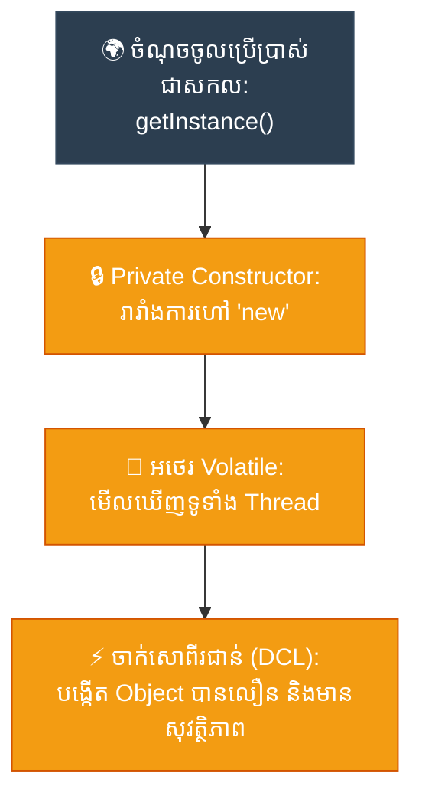

# Journalist: Singleton (ការ​ធានាឱ្យ​មាន​ការ​ពិត​តែ​មួយគត់​ក្នុង​ប្រព័ន្ធ​ទាំងមូល)

**Author:** ichamrong  
**Date:** 2026-05-18  
**Tags:** #journalist #inverted-pyramid #design-patterns #singleton #clean-code  
**Category:** Concepts / Journalist  
**Read Time:** ~5 min  

---

## 📌 មាតិកា (Table of Contents)
- [១. សេចក្តី​សង្ខេបព្រឹត្តិ​ការ​ណ៍ (The Lede)](#១-សេចក្តីសង្ខេបព្រឹត្តិការណ៍-the-lede)
- [២. ព័ត៌មាន​លម្អិតស្នូល (Core Details)](#២-ព័ត៌មានលម្អិតស្នូល-core-details)
- [៣. ដ្យាក្រាមលំហូរ (Visual Flowchart)](#៣-ដ្យាក្រាមលំហូរ-visual-flowchart)
- [៤. Related Posts](#៤-related-posts)

---

## ១. សេចក្តី​សង្ខេបព្រឹត្តិ​ការ​ណ៍ (The Lede)

**Singleton Pattern** កំណត់​ការ​បង្កើត Object ពី Class មួយឱ្យនៅសល់ត្រឹម​តែ **មួយគត់​ជា​និច្ច** និង​ផ្តល់នូវច្រកចូល​ប្រើប្រាស់​ជា​សកល​ទៅកាន់​វា។ គំរូស្ថាបត្យកម្ម​នេះ​ដើរតួ​ជា​អ្នក​សម្របសម្រួល​ដាច់ខាត និង​ជា «ប្រភព​នៃ​ការ​ពិត​តែ​មួយគត់» សម្រាប់​ធនធានរួមគ្នាទូទាំង​កម្មវិធី​ទាំងមូល ដោយ​លុបបំបាត់​ទាំងស្រុងនូវ​ការ​បង្កើត Object ស្ទួន ៗ គ្នា​នៅក្នុង Memory និង​ស្ថានភាព​ទិន្នន័យ​មិន​ស៊ីសង្វាក់គ្នា។

---

## ២. ព័ត៌មាន​លម្អិតស្នូល (Core Details)

* **យន្ត​ការ​ការ​ងារ៖** Constructor របស់ Class ត្រូវ​បាន​កំណត់​ជា `private` ដើម្បី​ទប់ស្កាត់​ការ​បង្កើត Object ផ្ទាល់ខ្លួន​ពី​ខាងក្រៅ​តាមរយៈ `new`។ Object តែ​មួយគត់​នោះ​ត្រូវ​បាន​រក្សាទុក​ក្នុង​អថេរ `private static` និង​គ្រប់​គ្រង​តាមរយៈ​មុខងារ `public static` (ជា​ទូ​ទៅ​ឈ្មោះថា `getInstance()`)។
* **ការ​បង្កើត​យឺត (Lazy Loading) និង​សុវត្ថិភាព Thread៖** Object ត្រូវ​បាន​បង្កើត​ឡើងលុះត្រា​តែ​មាន​ការ​ហៅ​ប្រើប្រាស់​ជា​លើ​កដំបូង។ នៅក្នុង​ប្រព័ន្ធ​ដែល​រត់ខ្សែស្រឡាយច្រើន (Multi-threaded) យន្ត​ការ​ចាក់សោ​ពី​រ​ជា​ន់ (Double-Checked Locking) រួមផ្សំនឹង​ពាក្យគន្លឹះ `volatile` ត្រូវ​បាន​ប្រើប្រាស់​ដើម្បី​ធានាសុវត្ថិភាព​ការ​ងារ និង​មិន​ធ្វើ​ឱ្យ​ប្រព័ន្ធ​ដើរ​យឺត។
* **អត្ថប្រយោជន៍៖** វា​ការ​ពារ​កុំ​ឱ្យ​មាន​ការ​គាំងធនធាន​ប្រព័ន្ធ (Resource exhaustion) ដោយ​ធានាថាផ្នែកសំខាន់ ៗ ដែល​ស៊ីមេម៉ូរី​ខ្លាំង (ដូចជា Database Connection Pool, Config Manager, Log File) ត្រូវ​បាន​ចែករំលែក និង​ប្រើប្រាស់​រួមគ្នា​ដោយ​សន្សំសំចៃបំផុត។

---

## ៣. ដ្យាក្រាមលំហូរ (Visual Flowchart)

---

## ៤. Related Posts

### 🔗 Explore All Viewpoints:
* 📖 **Read the Parable:** [The Bank's Only Vault (ទូដែក​តែ​មួយគត់​របស់​ធនាគារ)](../../parables/75-the-banks-only-vault.md) — Explains the emotional core of shared truth.
* 🧠 **Read the First Principles Derivation:** [MIT Professor Strategy: Singleton (គោល​ការ​ណ៍គ្រឹះដំបូង​នៃ Singleton)](../01-mit-professor/01-singleton.md) — Derives the pattern from fundamental computer axioms.
* 👶 **Read the Feynman Simplification:** [Feynman Technique: Singleton (ការ​ពន្យល់​ពី Singleton ដោយ​គ្មាន​ពាក្យបច្ចេកទេស)](../02-feynman-technique/04-singleton.md) — Breaks it down using the central clock tower.
* 👦 **Read the ELI5 Metaphor:** [ELI5: Singleton (ម៉ាស៊ីនខួងខ្មៅដៃ​តែ​មួយគត់​ក្នុង​ថ្នាក់រៀន)](../03-eli5/04-singleton.md) — Teaches it to a five-year-old using classroom pencil sharpeners.
* 🌉 **Read the Analogy Bridge:** [Analogy Bridge: Singleton (ស្ពានប្រៀបធៀប​នៃ​ប្រភព​ពិត​តែ​មួយគត់)](../04-analogy-bridge/04-singleton.md) — Maps it to a hotel front desk and shows where physical limits fail compared to code threads.
* 🧐 **Read the Socratic Discovery:** [Socratic Method: Singleton (ការ​បង្កើត​ប្រព័ន្ធ​ការ​ពិត​តែ​មួយគត់​តាម​វិធីសាស្ត្រសូក្រាត)](../05-socratic-method/04-singleton.md) — Guide your self-discovery through mentor-student dialogue.
* 📰 **Read the Journalist Summary:** [Journalist: Singleton (ការ​ធានាឱ្យ​មាន​ការ​ពិត​តែ​មួយគត់​ក្នុង​ប្រព័ន្ធ​ទាំងមូល)](../06-journalist-inverted-pyramid/04-singleton.md) — Get the high-impact lede, volatile visibility, and thread-safety details first.
* 🎭 **Read the Storyteller Narrative:** [Storyteller: Singleton (អាណាព្យាបាល​នៃ​សេចក្តី​ពិត និង​កងទ័ពក្លូនបង្កចលាចល)](../07-storyteller-narrative-arc/04-singleton.md) — Follow Kiri's heroic journey to vanquish the duplicate logger clone army.
* ⚙️ **Read the Engineer Spec:** [Engineer: Singleton (ការ​សម្របសម្រួល​ប្រភព​ពិត​តែ​មួយគត់ និង​ទប់ស្កាត់​ការ​ខ្ជះខ្​ជា​យធនធាន)](../08-engineer-requirements-constraints-solution/03-singleton.md) — Read the rigorous engineering specification, DCL performance details, and candidate elimination.
* 📊 **Read the Pros & Cons:** [Pros & Cons Compared: Singleton (ការ​ប្រៀបធៀបគុណសម្បត្តិ និង​គុណវិបត្តិ​នៃ Singleton)](../09-pros-and-cons-compared/01-singleton.md) — Full trade-off analysis and decision matrix.
* 🛠️ **Read the Code Implementation:** [Creational Patterns: The Art of Instantiation](../../../clean-code/design-patterns/01-creational-patterns.md#the-singleton) — Production-grade Java with double-checked locking and thread safety.
