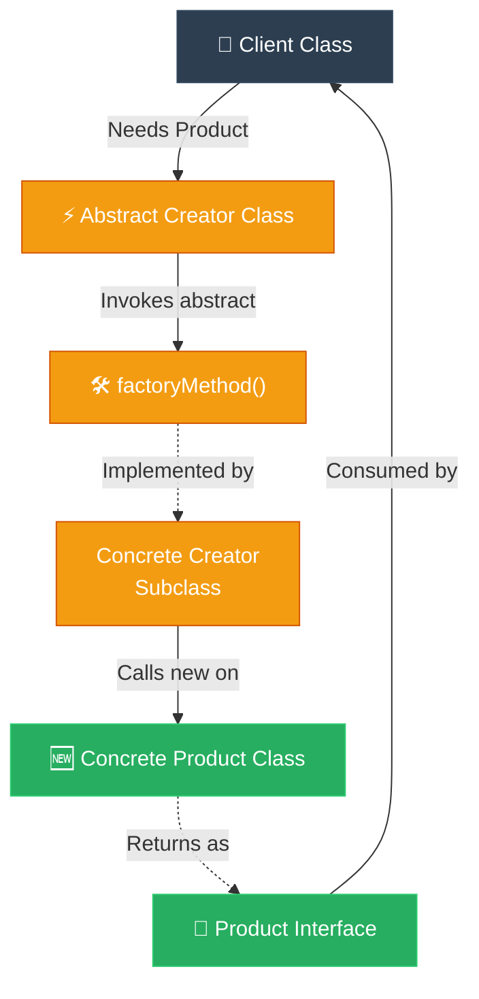

# Journalist: Factory Method (ការបំបែកកូដបង្កើត Object ឱ្យមានសេរីភាពសម្រេចចិត្តលើ Subclass)

**Author:** ichamrong  
**Date:** 2026-05-18  
**Tags:** #journalist #inverted-pyramid #design-patterns #factory-method #clean-code  
**Category:** Concepts / Journalist Inverted Pyramid  
**Read Time:** ~4 min  

---

## 📌 មាតិកា (Table of Contents)
- [១. សេចក្តីសង្ខេបព័ត៌មានបន្ទាន់ (High-Impact Lede)](#១-សេចក្តីសង្ខេបព័ត៌មានបន្ទាន់-high-impact-lede)
- [២. ព័ត៌មានលម្អិត និងកូដគំរូ (Supporting Details & Code Architecture)](#២-ព័ត៌មានលម្អិត-និងកូដគំរូ-supporting-details--code-architecture)
- [៣. ដ្យាក្រាមលំហូរ (Visual Flowchart)](#៣-ដ្យាក្រាមលំហូរ-visual-flowchart)
- [៤. Related Posts](#៤-related-posts)

---

## ១. សេចក្តីសង្ខេបព័ត៌មានបន្ទាន់ (High-Impact Lede)

### English
**SAN FRANCISCO, CA** — Software engineers are completely banning direct client object instantiation (`new`) in production pipelines to comply with the Open-Closed Principle (OCP). The **Factory Method Pattern** has emerged as the leading standard for decoupling, allowing parent classes to define a formal creation flow while delegating the actual concrete instantiation to specialized subclasses at runtime. This architectural shift prevents blast-radius bugs when adding new features and eliminates giant, unmaintainable `if/else` switch statement blocks.

### Khmer
**សានហ្វ្រានស៊ីស្កូ, កាលីហ្វ័រញ៉ា** — ក្រុមវិស្វករកម្មវិធីកំពុងហាមឃាត់ការបង្កើត Object របស់កូនកូដដោយផ្ទាល់ (ការប្រើប្រាស់ `new`) នៅក្នុងខ្សែសង្វាក់ផលិតកម្ម ដើម្បីគោរពតាមគោលការណ៍ Open-Closed Principle (OCP)។ **Factory Method Pattern** បានក្លាយជាស្តង់ដារឈានមុខគេសម្រាប់ការបំបែកកូដ (Decoupling) ដោយអនុញ្ញាតឱ្យ Parent Class កំណត់លំហូរនៃការបង្កើតជាផ្លូវការ ខណៈពេលដែលប្រគល់ការសម្រេចចិត្តបង្កើត Concrete Object ពិតប្រាកដទៅឱ្យ Subclasses ជាក់លាក់នៅពេលដំណើរការ (Runtime)។ ការផ្លាស់ប្តូរស្ថាបត្យកម្មកូដនេះ ជួយការពារកុំឱ្យមានផលប៉ះពាល់ដល់មុខងារចាស់ៗនៅពេលបន្ថែមមុខងារថ្មីៗ និងលុបបំបាត់ប្រអប់លក្ខខណ្ឌ `if/else` switch ដ៏ធំ និងពិបាកគ្រប់គ្រង។

---

## ២. ព័ត៌មានលម្អិត និងកូដគំរូ (Supporting Details & Code Architecture)

### 1. The Core Mechanics (របៀបដែលវាដំណើរការ)
The pattern works by declaring an abstract factory method inside a base creator class. The base class code does not instantiate products directly; instead, it calls the factory method to receive an abstract product. Concrete subclasses override this method to construct and return specific instances.

គំរូនេះដំណើរការដោយការប្រកាស abstract factory method នៅក្នុង base creator class។ កូដ base class មិនបង្កើត product ដោយផ្ទាល់ឡើយ ប៉ុន្តែវាហៅ factory method ដើម្បីទទួលបាន abstract product។ Subclasses ជាក់លាក់នឹងសរសេរលុបលើ Method នេះដើម្បីបង្កើត និងហុចមកវិញនូវ Object ពិតប្រាកដ។

### 2. High-Yield Benefits (អត្ថប្រយោជន៍សំខាន់ៗ)
* **Single Responsibility Principle (SRP):** Object creation code is isolated in one place, leaving business logic clean.
* **Open-Closed Principle (OCP):** Introducing new product variants (e.g., adding `PushNotification` to an existing notification pipeline) requires writing one new subclass, without modifying any active code.

* **គោលការណ៍ទទួលខុសត្រូវតែមួយ (SRP)៖** កូដសម្រាប់បង្កើត Object ត្រូវបានទុកដាច់ដោយឡែកតែមួយកន្លែង ដែលធ្វើឱ្យ business logic មានសភាពស្អាតស្អំ។
* **គោលការណ៍ Open-Closed (OCP)៖** ការណែនាំប្រភេទផលិតផលថ្មីៗ (ដូចជាការបន្ថែម `PushNotification` ទៅកាន់ប្រព័ន្ធផ្ញើសារដែលមានស្រាប់) ទាមទារតែការសរសេរ subclass ថ្មីមួយប៉ុណ្ណោះ ដោយមិនប៉ះពាល់ដល់កូដចាស់ឡើយ។

---

## ៣. ដ្យាក្រាមលំហូរ (Visual Flowchart)

---

## ៤. Related Posts

### 🔗 Explore All Viewpoints:
* 📖 **Read the Parable:** [The CEO and the Regional Managers (នាយកប្រតិបត្តិ និងអ្នកគ្រប់គ្រងតំបន់)](../../parables/77-the-ceo-and-regional-managers.md) — The emotional core of delegating local decisions.
* 🧠 **Read the First Principles Derivation:** [MIT Professor Strategy: Factory Method (គោលការណ៍គ្រឹះដំបូងនៃ Factory Method)](../01-mit-professor/02-factory-method.md) — Derives the pattern step-by-step from base interface dependency laws.
* 👶 **Read the Feynman Simplification:** [Feynman Technique: Factory Method (ការពន្យល់ពី Factory Method ដោយគ្មានពាក្យបច្ចេកទេស)](../02-feynman-technique/06-factory-method.md) — Breaks it down using the hotel cleaner recruitment agency.
* 👦 **Read the ELI5 Metaphor:** [ELI5: Factory Method (ការពន្យល់ពី Factory Method ដូចក្មេងអាយុ ៥ ឆ្នាំ)](../03-eli5/06-factory-method.md) — Teaches a five-year-old using the magic toy machine slot.
* 🌉 **Read the Analogy Bridge:** [Analogy Bridge: Factory Method (ស្ពានប្រៀបធៀបនៃ Factory Method)](../04-analogy-bridge/06-factory-method.md) — Maps regional postal transport hubs to virtual methods, outlining physical limitations.
* 🧐 **Read the Socratic Discovery:** [Socratic Method: Factory Method (ការបង្កើត Object តាមតម្រូវការយឺតយ៉ាវតាមវិធីសាស្ត្រសូក្រាត)](../05-socratic-method/06-factory-method.md) — Socrates guides your discovery out of switch block coupling.
* 📰 **Read the Journalist Summary:** [Journalist: Factory Method (ការបំបែកកូដបង្កើត Object ឱ្យមានសេរីភាពសម្រេចចិត្តលើ Subclass)](../06-journalist-inverted-pyramid/06-factory-method.md) — High-impact news lede, OCP compliance, and SRP isolation details first.
* 🎭 **Read the Storyteller Narrative:** [Storyteller: Factory Method (វីរបុរស Factory Method និងការដោះលែងប្រព័ន្ធផ្ញើសារពីរនរក switch)](../07-storyteller-narrative-arc/06-factory-method.md) — Junior developer Dara's battle to vanquish the switch statement monster on Black Friday.
* ⚙️ **Read the Engineer Spec:** [Engineer: Factory Method (ការបំបែកកូដបង្កើត Object តាមរយៈការវាយតម្លៃតម្រូវការ និងឧបសគ្គកំណត់)](../08-engineer-requirements-constraints-solution/04-factory-method.md) — Technical requirements, ADR candidate matrix, and SLA evaluation.
* 📊 **Read the Pros & Cons:** [Pros & Cons Compared: Factory Method (ការប្រៀបធៀបគុណសម្បត្តិ និងគុណវិបត្តិនៃ Factory Method)](../09-pros-and-cons-compared/03-factory-method.md) — Full trade-off analysis and decision matrix.
* 🛠️ **Read the Code Implementation:** [Creational Patterns: The Art of Instantiation](../../../clean-code/design-patterns/01-creational-patterns.md#the-factory-method) — Production-grade Java with subclass dispatch and Open/Closed Principle.
