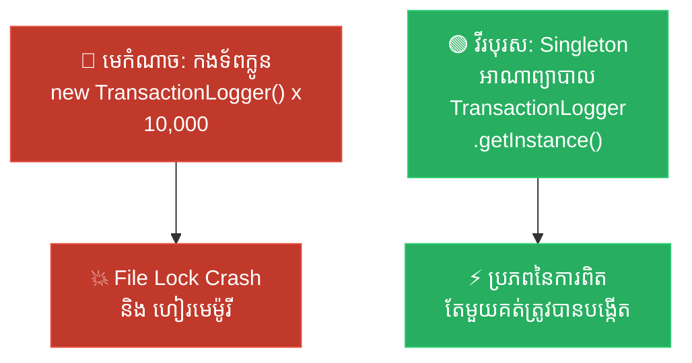

# Storyteller: Singleton (អាណាព្យាបាល​នៃ​សេចក្តី​ពិត និង​កងទ័ពក្លូនបង្កចលាចល)

**Author:** ichamrong  
**Date:** 2026-05-18  
**Tags:** #storyteller #narrative-arc #design-patterns #singleton #clean-code  
**Category:** Concepts / Storyteller  
**Read Time:** ~5 min  

---

## 📌 មាតិកា (Table of Contents)
- [១. តួអង្គ និង​ការ​តស៊ូ (Hero & Conflict)](#១-តួអង្គ-និងការតស៊ូ-hero--conflict)
- [២. ដំណោះស្រាយ​សង្គ្រោះស្ថាន​ការ​ណ៍ (The Resolution)](#២-ដំណោះស្រាយសង្គ្រោះស្ថានការណ៍-the-resolution)
- [៣. ដ្យាក្រាមលំហូរ (Visual Flowchart)](#៣-ដ្យាក្រាមលំហូរ-visual-flowchart)
- [៤. Related Posts](#៤-related-posts)

---

## ១. តួអង្គ និង​ការ​តស៊ូ (Hero & Conflict)

* **វីរបុរស៖** គិរី ជា​អ្នក​អភិវឌ្ឍ​ន៍សូហ្វវែរដ៏​មាន​ទឹកចិត្តម្នាក់ ដែល​កំពុងសាងសង់​ប្រព័ន្ធ​លក់ទំនិញអនឡាញ​ដែល​មាន​ចរាចរណ៍ខ្ពស់។ ប្រព័ន្ធ​នេះ​ត្រូវ​សរសេរ​ប្រវត្តិ​នៃ​ការ​លក់ចូល​ទៅ​ក្នុង​ឯកសារ Log រួមគ្នា​តែ​មួយគត់។
* **មេកំណាច៖** គ្រោះថ្នាក់ដ៏ស្ងប់ស្ងាត់​នៃ​ការ​កើនឡើងហួសប្រមាណ​នៃ **«កងទ័ពក្លូន Object»**។
* **ជម្លោះ៖** គិរី​បាន​រចនា​កម្មវិធី​កត់ត្រា Log របស់​គាត់​ជា Class ធម្ម​តាម​ួយ។ រាល់​ពេល​ដែល Service ផ្សេង ៗ (`UserService`, `CartService`, `PaymentService`) ត្រូវ​កត់ត្រាព្រឹត្តិ​ការ​ណ៍ ពួកវា​តែ​ង​តែ​ហៅ `new TransactionLogger()`។ នៅ​ពេល​ដែល​ប្រព័ន្ធ​រត់​ក្រោម​បន្ទុកដ៏ធ្ងន់ ខ្សែស្រឡាយ​ការ​ងារ (Threads) រាប់ពាន់​បាន​បង្កើត Object Logger ផ្ទាល់ខ្លួនរៀង ៗ ខ្លួន។ ពួកវា​ទាំងអស់​ព្យាយាមបើក និង​សរសេរ​ចូល​ទៅ​ក្នុង​ឯកសារ Log តែ​មួយ​ក្នុង​ពេល​តែ​មួយ។ ប្រព័ន្ធ​ប្រតិបត្តិ​ការ (OS) បាន​បោះកំហុស "File Lock Exceptions" ខ្សែស្រឡាយ​ជា​ប់គាំងរង់ចាំគ្នា (Deadlock) មេម៉ូរី JVM ឡើងប៉ោងពេញ​ដោយ Object ស្ទួន ៗ គ្នា ហើយម៉ាស៊ីនមេ (Server) ក៏​បាន​គាំងទាំងស្រុង​ក្នុង​អំឡុង​ពេល​យុទ្ធនា​ការ​លក់ធំបំផុត។ គិរី​បាន​ធ្លាក់​ក្នុង​ភាពវឹកវរទាំងស្រុង។

---

## ២. ដំណោះស្រាយ​សង្គ្រោះស្ថាន​ការ​ណ៍ (The Resolution)

* **ដំណោះស្រាយ៖** គិរី​បាន​រកឃើញ **Singleton Pattern** — ដែល​ជា​អាណាព្យាបាលដាច់ខាត​នៃ​សេចក្តី​ពិត និង​សណ្តាប់ធ្នាប់។
* គាត់​បាន​ចាក់សោទ្វារសាងសង់ Object ដោយ​កំណត់ Constructor របស់ `TransactionLogger` ឱ្យ​ទៅ​ជា `private` ដោយ​កម្ចាត់កងទ័ពក្លូន​ជា​ដរាប។
* គាត់​បាន​បង្កើត Object static តែ​មួយគត់នៅ​ខាងក្នុង Logger នោះ រួចបើកច្រកទ្វារដ៏​មាន​សុវត្ថិភាពមួយឈ្មោះថា `getInstance()`។
* ពេល​នេះ ជំនួសឱ្យ​ការ​បង្កើត Object ក្លូនស្ទួន ៗ គ្នា Service ទាំងអស់​ត្រូវ​បាន​បង្ខំឱ្យ​ប្រើប្រាស់ Object Logger តែ​មួយគត់រួមគ្នា​នៅក្នុង Memory។
* ការ​សរសេរ​ចូលឯកសារ Log ប្រែ​ជា​មាន​របៀបរៀបរយ និង​សម្របសម្រួល​គ្នា​យ៉ាង​ល្អ​ឥតខ្ចោះ។ ការ​ប្រើប្រាស់​មេម៉ូរីធ្លាក់ចុះ​មក​ស្ទើរ​តែ​សូន្យ ការ​ប៉ះទង្គិចឯកសារ​បាន​រលាយបាត់ ហើយ Server អាចទ្រទ្រង់បន្ទុក​ការ​ងារយក្ស​នោះ​បាន​យ៉ាង​រលូន។ គិរី​បាន​សង្គ្រោះ​ប្រព័ន្ធ និង​ត្រូវ​បាន​តែ​ងតាំង​ជា​ស្ថាបត្យករឆ្នើម!
* **មេរៀន​ជា​ស្នូល៖** នៅ​ពេល​គ្រប់​គ្រងធនធានរួមគ្នា​នៃ​ប្រព័ន្ធ ត្រូវតែ​មាន​អ្នក​ដឹកនាំ​តែ​មួយគត់។ អ្នក​សម្របសម្រួល​ច្រើននឹងបង្ក​ជា​ចលាចលទាំងស្រុង។

---

## ៣. ដ្យាក្រាមលំហូរ (Visual Flowchart)

---

## ៤. Related Posts

### 🔗 Explore All Viewpoints:
* 📖 **Read the Parable:** [The Bank's Only Vault (ទូដែក​តែ​មួយគត់​របស់​ធនាគារ)](../../parables/75-the-banks-only-vault.md) — Explains the emotional core of shared truth.
* 🧠 **Read the First Principles Derivation:** [MIT Professor Strategy: Singleton (គោល​ការ​ណ៍គ្រឹះដំបូង​នៃ Singleton)](../01-mit-professor/01-singleton.md) — Derives the pattern from fundamental computer axioms.
* 👶 **Read the Feynman Simplification:** [Feynman Technique: Singleton (ការ​ពន្យល់​ពី Singleton ដោយ​គ្មាន​ពាក្យបច្ចេកទេស)](../02-feynman-technique/04-singleton.md) — Breaks it down using the central clock tower.
* 👦 **Read the ELI5 Metaphor:** [ELI5: Singleton (ម៉ាស៊ីនខួងខ្មៅដៃ​តែ​មួយគត់​ក្នុង​ថ្នាក់រៀន)](../03-eli5/04-singleton.md) — Teaches it to a five-year-old using classroom pencil sharpeners.
* 🌉 **Read the Analogy Bridge:** [Analogy Bridge: Singleton (ស្ពានប្រៀបធៀប​នៃ​ប្រភព​ពិត​តែ​មួយគត់)](../04-analogy-bridge/04-singleton.md) — Maps it to a hotel front desk and shows where physical limits fail compared to code threads.
* 🧐 **Read the Socratic Discovery:** [Socratic Method: Singleton (ការ​បង្កើត​ប្រព័ន្ធ​ការ​ពិត​តែ​មួយគត់​តាម​វិធីសាស្ត្រសូក្រាត)](../05-socratic-method/04-singleton.md) — Guide your self-discovery through mentor-student dialogue.
* 📰 **Read the Journalist Summary:** [Journalist: Singleton (ការ​ធានាឱ្យ​មាន​ការ​ពិត​តែ​មួយគត់​ក្នុង​ប្រព័ន្ធ​ទាំងមូល)](../06-journalist-inverted-pyramid/04-singleton.md) — Get the high-impact lede, volatile visibility, and thread-safety details first.
* 🎭 **Read the Storyteller Narrative:** [Storyteller: Singleton (អាណាព្យាបាល​នៃ​សេចក្តី​ពិត និង​កងទ័ពក្លូនបង្កចលាចល)](../07-storyteller-narrative-arc/04-singleton.md) — Follow Kiri's heroic journey to vanquish the duplicate logger clone army.
* ⚙️ **Read the Engineer Spec:** [Engineer: Singleton (ការ​សម្របសម្រួល​ប្រភព​ពិត​តែ​មួយគត់ និង​ទប់ស្កាត់​ការ​ខ្ជះខ្​ជា​យធនធាន)](../08-engineer-requirements-constraints-solution/03-singleton.md) — Read the rigorous engineering specification, DCL performance details, and candidate elimination.
* 📊 **Read the Pros & Cons:** [Pros & Cons Compared: Singleton (ការ​ប្រៀបធៀបគុណសម្បត្តិ និង​គុណវិបត្តិ​នៃ Singleton)](../09-pros-and-cons-compared/01-singleton.md) — Full trade-off analysis and decision matrix.
* 🛠️ **Read the Code Implementation:** [Creational Patterns: The Art of Instantiation](../../../clean-code/design-patterns/01-creational-patterns.md#the-singleton) — Production-grade Java with double-checked locking and thread safety.
