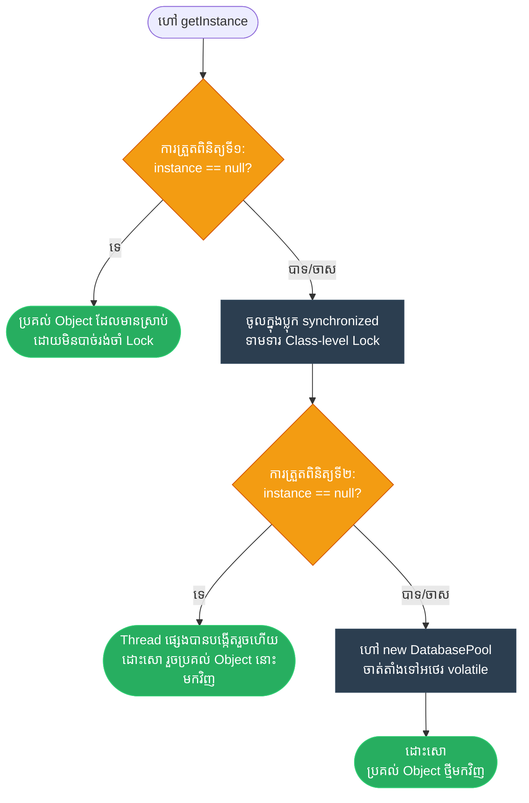

# Engineer: Singleton (ការ​សម្របសម្រួល​ប្រភព​ពិត​តែ​មួយគត់ និង​ទប់ស្កាត់​ការ​ខ្ជះខ្​ជា​យធនធាន)

**Author:** ichamrong  
**Date:** 2026-05-18  
**Tags:** #engineer #requirements-constraints #design-patterns #singleton #clean-code  
**Category:** Concepts / The Engineer  
**Read Time:** ~5 min  

---

## 📌 មាតិកា (Table of Contents)
- [១. តម្រូវ​ការ​បច្ចេកទេស (Requirements)](#១-តម្រូវការបច្ចេកទេស-requirements)
- [២. ឧបសគ្គកំណត់ (Constraints)](#២-ឧបសគ្គកំណត់-constraints)
- [៣. ជម្រើសដោះស្រាយ និង​ការ​លុប​ចោល (Candidates & Elimination)](#៣-ជម្រើសដោះស្រាយ-និងការលុបចោល-candidates-elimination)
- [៤. ដំណោះស្រាយ​ដែល​បាន​ជ្រើសរើស (Chosen Solution)](#៤-ដំណោះស្រាយដែលបានជ្រើសរើស-chosen-solution)
- [៥. ដ្យាក្រាមលំហូរ (Visual Flowchart)](#៥-ដ្យាក្រាមលំហូរ-visual-flowchart)
- [៦. Related Posts](#៦-related-posts)

---

## ១. តម្រូវ​ការ​បច្ចេកទេស (Requirements)

យើង​ត្រូវ​គ្រប់​គ្រងធនធានរួមគ្នា​នៃ​ប្រព័ន្ធ (ដូចជា Database Connection Pool, Feature Flag Registry ឬ Hardware Driver) ដែល​ការ​បង្កើត Object ច្រើននឹងបណ្តាលឱ្យហៀរមេម៉ូរី (Memory Exhaustion) គាំងរន្ធតភ្​ជា​ប់បណ្តាញ (Socket Depletion) បង្កជម្លោះចាក់សោឯកសារ​លើ​ប្រព័ន្ធ​ប្រតិបត្តិ​ការ ឬ​ស្ថានភាព​ទិន្នន័យ​មិន​ស៊ីសង្វាក់គ្នារវាងម៉ូឌុលនីមួយ ៗ ។

---

## ២. ឧបសគ្គកំណត់ (Constraints)

1. **ការ​ធានានូវភាព​តែ​មួយគត់ (Guaranteed Uniqueness):** យើង​ត្រូវតែ​រឹតត្បិត និង​រារាំង​យ៉ាង​ដាច់ខាត​កុំ​ឱ្យម៉ូឌុល​ខាងក្រៅ​អាច​ប្រើប្រាស់​ពាក្យគន្លឹះ `new` បាន។
2. **សុវត្ថិភាពខ្សែស្រឡាយ (Thread Safety):** ការ​បង្កើត Object ត្រូវតែ​មាន​សុវត្ថិភាពទាំងស្រុង​ពេល​រត់ Thread ច្រើន (Thread-safe) ដោយ​ទ្រទ្រង់​ការ​ស្នើសុំដំណាលគ្នាច្រើន​ដោយ​មិន​បណ្តាលឱ្យ​មាន​ការ​បង្កើត Object ស្ទួនគ្នា ឬ​បញ្ហា​ដណ្​តើ​មគ្នាដំណើរ​ការ (Race Conditions) ឡើយ។
3. **ការ​បង្កើត​យឺត (Lazy Initialization):** ធនធាន​នេះ​គួរ​តែ​ត្រូវ​បាន​បង្កើត​ឡើងលុះត្រា​តែ​មាន​ការ​ហៅប្រើ​ជា​លើ​កដំបូងប៉ុណ្ណោះ ដើម្បី​ការ​ពារ​ការ​ពន្យារ​ពេល​ពេល​បើក​កម្មវិធី (Startup Delays) និង​ការ​ប្រើប្រាស់​មេម៉ូរី​ដោយ​មិន​ចាំបាច់។
4. **ចំណុចចូល​ប្រើប្រាស់​ច្បាស់លាស់ (Clean API Entry):** ការ​ចូល​ប្រើប្រាស់​ធនធានរួមគ្នា​នេះ​ត្រូវតែ​សាមញ្ញ និង​មាន​ភាពស៊ីសង្វាក់គ្នា​សម្រាប់​គ្រប់​អ្នក​ហៅប្រើ​ទាំងអស់។

---

## ៣. ជម្រើសដោះស្រាយ និង​ការ​លុប​ចោល (Candidates & Elimination)

| ជម្រើសដោះស្រាយ | ឆ្លើយតប​តម្រូវ​ការ​ទេ? | ឆ្លើយតប​ឧបសគ្គទេ? | ស្ថានភាព / មូលហេតុ​លុប​ចោល |
| :--- | :--- | :--- | :--- |
| **1. Public Global Variable** | ទេ (មិន​អាច​រារាំង​ការ​ហៅ `new`) | បាទ/ចាស (ងាយស្រួលចូលប្រើ) | **❌ លុប​ចោល** |
| **2. Static Utility Class** | បាទ/ចាស (មិន​មាន​ការ​ហៅ `new`) | ទេ (គ្មាន Polymorphism/Interface; ទាមទារឱ្យ Load ទុក​មុន​ជា​និច្ច) | **❌ លុប​ចោល** |
| **3. Basic Lazy Singleton** | បាទ/ចាស (មាន Object តែ​មួយ) | ទេ (គ្មាន Thread-safe; Race conditions នឹង​ធ្វើ​ឱ្យ​បង្កើត Object ស្ទួនគ្នា) | **❌ លុប​ចោល** |
| **4. DCL Singleton (Volatile)** | **បាទ/ចាស (មាន Object តែ​មួយគត់)** | **បាទ/ចាស (Thread-safe, Lazy loading, ប្រសិទ្ធភាពខ្ពស់)** | **✅ ជ្រើសរើស** |

---

## ៤. ដំណោះស្រាយ​ដែល​បាន​ជ្រើសរើស (Chosen Solution)

**Double-Checked Locking (DCL) Singleton** រួមផ្សំនឹង Constructor ជា `private` គឺជា​ដំណោះស្រាយ​វិស្វកម្មដ៏​ល្អ​បំផុត។
* តាមរយៈ​ការ​កំណត់ Constructor ជា `private` យើងទប់ស្កាត់​ការ​ប្រើប្រាស់​ពាក្យគន្លឹះ `new` តាំង​ពី​ដំណាក់កាល Compile-time។
* តាមរយៈ​ការ​ប្រើប្រាស់​អថេរ `volatile` static យើងធានាថា​ការ​ផ្លាស់ប្តូរតម្លៃ Object ត្រូវ​បាន​មើលឃើញភ្លាម ៗ ដោយ​គ្រប់ Thread ទាំងអស់ (ការ​ពារ​ការ​រៀបលំដាប់​កូដ​ឡើងវិញ​របស់ CPU និង​កំហុសទាញយក Object ដែល​មិន​ទាន់សាងសង់រួច​រាល់)។
* ការ​ឆែកលក្ខខណ្ឌដំបូង `if (instance == null)` ជួយឱ្យ Thread ដំណើរ​ការ​លឿន​ដោយ​មិន​បាច់រង់ចាំ Lock ចំណែកឯ​ការ​ឆែកលក្ខខណ្ឌទី​ពី​រ​នៅក្នុង​ប្លុក `synchronized` ជួយធានាសុវត្ថិភាព​ការ​ងារ និង​ដោះស្រាយជម្លោះ​បង្កើត Object ស្ទួនគ្នា។

---

## ៥. ដ្យាក្រាមលំហូរ (Visual Flowchart)

---

## ៦. Related Posts

### 🔗 Explore All Viewpoints:
* 📖 **Read the Parable:** [The Bank's Only Vault (ទូដែក​តែ​មួយគត់​របស់​ធនាគារ)](../../parables/75-the-banks-only-vault.md) — Explains the emotional core of shared truth.
* 🧠 **Read the First Principles Derivation:** [MIT Professor Strategy: Singleton (គោល​ការ​ណ៍គ្រឹះដំបូង​នៃ Singleton)](../01-mit-professor/01-singleton.md) — Derives the pattern from fundamental computer axioms.
* 👶 **Read the Feynman Simplification:** [Feynman Technique: Singleton (ការ​ពន្យល់​ពី Singleton ដោយ​គ្មាន​ពាក្យបច្ចេកទេស)](../02-feynman-technique/04-singleton.md) — Breaks it down using the central clock tower.
* 👦 **Read the ELI5 Metaphor:** [ELI5: Singleton (ម៉ាស៊ីនខួងខ្មៅដៃ​តែ​មួយគត់​ក្នុង​ថ្នាក់រៀន)](../03-eli5/04-singleton.md) — Teaches it to a five-year-old using classroom pencil sharpeners.
* 🌉 **Read the Analogy Bridge:** [Analogy Bridge: Singleton (ស្ពានប្រៀបធៀប​នៃ​ប្រភព​ពិត​តែ​មួយគត់)](../04-analogy-bridge/04-singleton.md) — Maps it to a hotel front desk and shows where physical limits fail compared to code threads.
* 🧐 **Read the Socratic Discovery:** [Socratic Method: Singleton (ការ​បង្កើត​ប្រព័ន្ធ​ការ​ពិត​តែ​មួយគត់​តាម​វិធីសាស្ត្រសូក្រាត)](../05-socratic-method/04-singleton.md) — Guide your self-discovery through mentor-student dialogue.
* 📰 **Read the Journalist Summary:** [Journalist: Singleton (ការ​ធានាឱ្យ​មាន​ការ​ពិត​តែ​មួយគត់​ក្នុង​ប្រព័ន្ធ​ទាំងមូល)](../06-journalist-inverted-pyramid/04-singleton.md) — Get the high-impact lede, volatile visibility, and thread-safety details first.
* 🎭 **Read the Storyteller Narrative:** [Storyteller: Singleton (អាណាព្យាបាល​នៃ​សេចក្តី​ពិត និង​កងទ័ពក្លូនបង្កចលាចល)](../07-storyteller-narrative-arc/04-singleton.md) — Follow Kiri's heroic journey to vanquish the duplicate logger clone army.
* ⚙️ **Read the Engineer Spec:** [Engineer: Singleton (ការ​សម្របសម្រួល​ប្រភព​ពិត​តែ​មួយគត់ និង​ទប់ស្កាត់​ការ​ខ្ជះខ្​ជា​យធនធាន)](../08-engineer-requirements-constraints-solution/03-singleton.md) — Read the rigorous engineering specification, DCL performance details, and candidate elimination.
* 📊 **Read the Pros & Cons:** [Pros & Cons Compared: Singleton (ការ​ប្រៀបធៀបគុណសម្បត្តិ និង​គុណវិបត្តិ​នៃ Singleton)](../09-pros-and-cons-compared/01-singleton.md) — Full trade-off analysis and decision matrix.
* 🛠️ **Read the Code Implementation:** [Creational Patterns: The Art of Instantiation](../../../clean-code/design-patterns/01-creational-patterns.md#the-singleton) — Production-grade Java with double-checked locking and thread safety.
