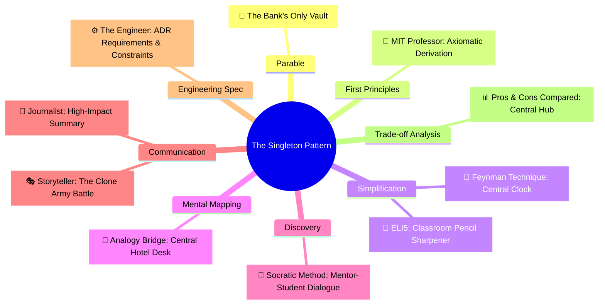

# Pros and Cons Compared: Singleton (ការ​ប្រៀបធៀបគុណសម្បត្តិ និង​គុណវិបត្តិ​នៃ Singleton)

**Author:** ichamrong  
**Date:** 2026-05-18  
**Tags:** #pros-and-cons #trade-offs #design-patterns #singleton #clean-code  
**Category:** Concepts / Pros and Cons Compared  
**Read Time:** ~8 min  

---

> **"The Singleton isn't about laziness — it's about truth. There can only be one source of truth."**

---

## 📌 មាតិកា (Table of Contents)
- [១. ចំណុចប្រឈមស្នូល (The Core Tension)](#១-ចំណុចប្រឈមស្នូល-the-core-tension)
- [២. តារាងប្រៀបធៀបសង្ខេប (Side-by-Side Summary)](#២-តារាងប្រៀបធៀបសង្ខេប-side-by-side-summary)
- [៣. គុណសម្បត្តិលម្អិត (Detailed Pros)](#៣-គុណសម្បត្តិលម្អិត-detailed-pros)
- [៤. គុណវិបត្តិលម្អិត (Detailed Cons)](#៤-គុណវិបត្តិលម្អិត-detailed-cons)
- [៥. ក្របខ័ណ្ឌអនុសាសន៍ និង​ការ​សម្រេចចិត្ត (Recommendations & Decision Matrix)](#៥-ក្របខ័ណ្ឌអនុសាសន៍-និងការសម្រេចចិត្ត-recommendations-decision-matrix)
- [៦. បណ្តាញតភ្​ជា​ប់​ការ​សិក្សាពហុវិមាត្រ (The Learning Nexus)](#៦-បណ្តាញតភ្ជាប់ការសិក្សាពហុវិមាត្រ-the-learning-nexus)

---

## ១. ចំណុចប្រឈមស្នូល (The Core Tension)

គំរូស្ថាបត្យកម្ម Singleton ដោះស្រាយ​បញ្ហា​ពី​រ​ក្នុង​ពេល​តែ​មួយ៖ វា **ធានាឱ្យ​មាន Object តែ​មួយគត់** នៅក្នុង Memory និង​ផ្តល់នូវ **ច្រកចូល​ប្រើប្រាស់​ជា​សកល** ទៅកាន់​វា។ ទោះបី​ជា​វា​មាន​ប្រសិទ្ធភាពខ្ពស់​ក្នុង​ការ​ការ​ពារ​ការ​ខាតបង់ធនធាន និង​ធានាភាពស៊ីសង្វាក់គ្នា​នៃ​ទិន្នន័យ​ក៏​ដោយ វាក៏ល្បីល្បាញខាង​បង្កើត​ស្ថានភាពសកល (Global State) បង្ក​ការ​ចងភ្​ជា​ប់គ្នាស្អិតរមួត (Tight Coupling) និង​បង្កផលលំបាក​ក្នុង​ការ​សរសេរ​កូដ​តេស្ត (Test Pollution) ផងដែរ។

ចំណុចប្រឈមស្នូល​នៃ​ស្ថាបត្យកម្​មក​ូដ គឺ​ការ​ជ្រើសរើសរវាង **ការ​សម្របសម្រួល​ធនធានដ៏​មាន​ប្រសិទ្ធភាព (ការ​ពិត)** និង **ការ​បំបែក​កូដ​ឱ្យដាច់​ពី​គ្នា (លទ្ធភាព​ធ្វើ​តេស្ត)**។

---

## ២. តារាងប្រៀបធៀបសង្ខេប (Side-by-Side Summary)

| 🟢 គុណសម្បត្តិ (Pros / What We Gain) | 🔴 គុណវិបត្តិ (Cons / What We Lose) |
| :--- | :--- |
| **គ្រប់​គ្រង Object តឹងរ៉ឹង៖** ធានាឱ្យ​មាន​ប្រភព​នៃ​ការ​ពិត​តែ​មួយគត់​ក្នុង Memory។ | **កំហុស​ពេល​ធ្វើ​តេស្ត៖** ស្ថានភាពសកលជះឥទ្ធិពល និង​រំខានដល់តេស្តដទៃទៀត។ |
| **សន្សំសំចៃធនធាន៖** ការ​ពារ​ការ​បង្កើត Database Sockets និង Memory ស្ទួនគ្នា។ | **ភ្​ជា​ប់គ្នាស្អិតរមួត៖** អ្នក​ហៅប្រើ​ត្រូវ​ពឹងផ្អែកផ្ទាល់​លើ​ការអនុវត្ត​របស់ Static Class ជា​ក់លាក់។ |
| **បង្កើត​យឺត (Lazy Loading)៖** បង្កើត​ឡើងលុះត្រា​តែ​មាន​ការ​ហៅប្រើ ជួយកាត់បន្ថយ​ពេល​បើក​កម្មវិធី។ | **រំលោភគោល​ការ​ណ៍ SRP៖** Class គ្រប់​គ្រងទាំង Business Logic របស់​វា និង​វដ្តជីវិតខ្លួនឯង។ |
| **ទម្រង់ពហុភាព (Polymorphism)៖** ខុស​ពី Static Class, Singleton អាចទាញយកចំណេះ​ពី Interface បាន។ | **បរាជ័យ​លើ​ប្រព័ន្ធ​ចែកចាយ៖** លក្ខខណ្ឌ "Object តែ​មួយគត់" នឹងបែកបាក់​ក្នុង​ប្រព័ន្ធ Microservices ច្រើន។ |

---

## ៣. គុណសម្បត្តិលម្អិត (Detailed Pros)

### ១. Controlled Access to Sole Instance (ការ​គ្រប់​គ្រង​ការ​ចូល​ប្រើប្រាស់​ធនធាន​តែ​មួយគត់)
ដោយសារ​តែ Class ខ្លួនឯង​ជា​អ្នក​ខ្ចប់ Object តែ​មួយគត់​នោះ វារក្សាសិទ្ធិ​គ្រប់​គ្រង​យ៉ាង​តឹងរ៉ឹង​លើ​វិធីសាស្ត្រ និង​ពេល​វេលា​ដែល Client ចូល​ប្រើប្រាស់​វា។ វាជួយ​ការ​ពារ​ការ​សរសេរ​ទិន្នន័យ​ជា​ន់គ្នា និង​ធានាថាប្រតិបត្តិ​ការ​រួម (ដូចជា​ការ​សរសេរ Log ឬ​ការ​កែប្រែ​ការ​កំណត់​ប្រព័ន្ធ) កើតឡើង​តាម​លំដាប់លំ​ដោយ និង​មាន​សុវត្ថិភាព។

### ២. Memory and Socket Depletion Prevention (ការ​ការ​ពារ​ការ​ហៀរមេម៉ូរី និង​រន្ធតភ្​ជា​ប់បណ្តាញ)
ផ្នែកសំខាន់ ៗ ដែល​ធ្ងន់ ៗ ដូចជា Database Connection Pool ឬ Thread Executor ស៊ីកម្លាំង CPU និង File Handles របស់​ប្រព័ន្ធ​ប្រតិបត្តិ​ការ​ច្រើនណាស់។ ការ​ប្រើប្រាស់ Singleton ការ​ពារ​ប្រព័ន្ធ​កុំ​ឱ្យ​បង្កើត Object Pool ស្ទួន ៗ គ្នា ដែល​ជួយ​លុបបំបាត់​បញ្ហា​អស់ Connection ទៅ database និង​ការ​ស្ទះ​ខ្សែស្រឡាយ​ការ​ងារ។

### ៣. Extensibility via Inheritance (លទ្ធភាពពង្រីកមុខងារ​តាមរយៈ​មរតក​កូដ)
ខុស​ពី Utility Class ដែល​មាន​តែ static methods ធម្មតា Class Singleton អាចអនុវត្ត​តាម (implement) Interface និង​ទទួលមរតក (inherit) ពី Superclass ផ្សេងទៀត​បាន។ វាអនុញ្ញាតឱ្យយើងកំណត់រចនាសម្ព័ន្ធ Singleton ផ្សេង ៗ គ្នានៅ​ពេល​រត់ (Runtime) ដូចជា​ការ​ប្តូររវាង `ProductionConfig` និង `TestConfig` នៅ​ពេល​ដំណើរ​ការ​ប្រព័ន្ធ​ជា​ដើម។

---

## ៤. គុណវិបត្តិលម្អិត (Detailed Cons)

### ១. Tight Coupling and Test Pollution (ការ​ភ្​ជា​ប់គ្នាស្អិតរមួត និង​កំហុស​ការ​ធ្វើ​តេស្តសាកល្បង)
Singleton បង្កើត​ស្ថានភាពសកល (Global State)។ នៅ​ពេល​ដំណើរ​ការ unit tests ក្នុង​ពេល​ដំណាលគ្នា (Parallel) តេស្តមួយ​ដែល​កែប្រែ​ស្ថានភាព Singleton នឹងបង្កផលប៉ះពាល់ និង​ធ្វើ​ឱ្យខូចលទ្ធផលតេស្តផ្សេងទៀត។ ការ​ធ្វើ Mock លើ Singleton គឺ​ពិបាក​ខ្លាំងណាស់​បើ​គ្មាន​បច្ចេកទេស Reflection ដែល​ធ្វើ​ឱ្យវា​ជា​ឧបសគ្គធំ​សម្រាប់​ការ​សរសេរ​កូដ​បែប TDD។

### ២. Violation of the Single Responsibility Principle (ការ​រំលោភ​លើ​គោល​ការ​ណ៍ SRP)
Class Singleton ទទួលបន្ទុក​ការ​ងារ​ពី​រផ្សេងគ្នាទាំងស្រុង៖ ទីមួយ​គឺ​ទទួលខុស​ត្រូវ​លើ Business Logic ជាក់ស្តែង​របស់​វា និង​ទី​ពី​រ​គឺ​ទទួលខុស​ត្រូវ​លើ​ការ​គ្រប់​គ្រងវដ្តជីវិត​នៃ​ការ​បង្កើត និង​មេម៉ូរី​របស់​ខ្លួនឯង។ ការ​ធ្វើ​បែប​នេះ​រំលោភ​លើ «គោល​ការ​ណ៍ទទួលខុស​ត្រូវតែ​មួយ (SRP)» នៅក្នុង SOLID។

### ៣. Failure in Distributed Scales (ការ​បែកបាក់ស្ថាបត្យកម្ម​លើ​ប្រព័ន្ធ​ចែកចាយ)
នៅក្នុង​ស្ថាបត្យកម្ម Microservices ឬ​កម្មវិធី​ខ្លោដ (ដូចជា JVM ច្រើនដំណើរ​ការ​នៅ​ពី​ក្រោយ Load Balancer) លក្ខខណ្ឌ «Object តែ​មួយគត់» របស់ Singleton ត្រូវ​បាន​បែកបាក់។ ម៉ាស៊ីននីមួយ ៗ មាន​ទំហំ Memory ដាច់ដោយឡែក​ពី​គ្នា ដែល​បង្កើត​ឱ្យ​មាន Object Singleton មួយនៅ​លើ​ម៉ាស៊ីននីមួយ ៗ ។ ប្រសិនបើ Singleton នោះ​តំណាងឱ្យធនធានរូបវន្តរួម វានឹងបង្កជម្លោះ​ទិន្នន័យ (Race Conditions) រវាងម៉ាស៊ីន និង​ម៉ាស៊ីន​ជា​មិន​ខាន។

---

## ៥. ក្របខ័ណ្ឌអនុសាសន៍ និង​ការ​សម្រេចចិត្ត (Recommendations & Decision Matrix)

### ពេល​ណាគួរប្រើ Singleton (When to Use Singleton)
1. **ធនធានរួម​មិន​ប្រែប្រួល (Immutable Shared Resources):** ស្ថានភាពរួមគ្នា​ដែល​គ្រាន់​តែ​អាច​អាន​បាន (Read-Only) ឬ​មាន​តម្លៃថេរ​ពេល​កំពុងដំណើរ​ការ (ឧទាហរណ៍៖ static configuration directory loader)។
2. **ផ្នែករឹងតឹងរ៉ឹង / OS Sockets (Strict Hardware / OS Sockets):** នៅ​ពេល​ប្រើប្រាស់​រុំព័ទ្ធឧបករណ៍រូបវន្ត​ដែល​មាន​កំណត់ ដូចជា Audio Driver ឬ Print Spooler interface។
3. **Database Connection Pools:** នៅ​ពេល​វា​ត្រូវ​បាន​គ្រប់​គ្រង​នៅក្នុង Application Framework ដែល​អនុញ្ញាតឱ្យ​មាន Pool តែ​មួយគត់ផ្គត់ផ្គង់ដល់ Thread Pool របស់ Microservice នោះ។

### ពេល​ណាគួរជៀសវាង Singleton (When to Avoid Singleton)
1. **ទិន្នន័យ​អាជីវកម្មប្រែប្រួល (Mutable Business State):** មិន​ត្រូវ​រក្សាទុក User Sessions, ទំនិញ​ក្នុង​កន្ត្រក ឬ​ទិន្នន័យ​ទិញទំនិញ​នៅក្នុង Singleton ដាច់ខាត។
2. **នៅ​ពេល​ការ​ធ្វើ​តេស្ត​មាន​សារៈសំខាន់​ខ្លាំង (When Testing is Critical):** ជៀសវាង​ការ​ហៅប្រើ Singleton ដោយ​ផ្ទាល់​តាមរយៈ Static Method (ឧ. `DatabasePool.getInstance()`)។ ផ្ទុយ​ទៅ​វិញ គួររុំ Class នោះ​ជា Singleton ដែល​គ្រប់​គ្រង​ដោយ **Dependency Injection (DI)** container (ដូចជា Spring `@Bean` ឬ Guice `@Singleton`) ដែល​អនុញ្ញាតឱ្យ Framework ជា​អ្នក​គ្រប់​គ្រង Lifecycle ព្រមទាំងរក្សា​កូដ​របស់​អ្នក​ឱ្យស្អាត និង​ងាយស្រួល​ធ្វើ Mock សម្រាប់​ការ​ធ្វើ​តេស្ត។

---

## ៦. បណ្តាញតភ្​ជា​ប់​ការ​សិក្សាពហុវិមាត្រ (The Learning Nexus)

To master the Singleton Design Pattern from every cognitive and technical angle, explore the full multi-dimensional suite in this repository:

### 🔗 Explore All Viewpoints:
* 📖 **Read the Parable:** [The Bank's Only Vault (ទូដែក​តែ​មួយគត់​របស់​ធនាគារ)](../../parables/75-the-banks-only-vault.md) — Explains the emotional core of shared truth.
* 🧠 **Read the First Principles Derivation:** [MIT Professor Strategy: Singleton (គោល​ការ​ណ៍គ្រឹះដំបូង​នៃ Singleton)](../01-mit-professor/01-singleton.md) — Derives the pattern from fundamental computer axioms.
* 👶 **Read the Feynman Simplification:** [Feynman Technique: Singleton (ការ​ពន្យល់​ពី Singleton ដោយ​គ្មាន​ពាក្យបច្ចេកទេស)](../02-feynman-technique/04-singleton.md) — Breaks it down using the central clock tower.
* 👦 **Read the ELI5 Metaphor:** [ELI5: Singleton (ម៉ាស៊ីនខួងខ្មៅដៃ​តែ​មួយគត់​ក្នុង​ថ្នាក់រៀន)](../03-eli5/04-singleton.md) — Teaches it to a five-year-old using classroom pencil sharpeners.
* 🌉 **Read the Analogy Bridge:** [Analogy Bridge: Singleton (ស្ពានប្រៀបធៀប​នៃ​ប្រភព​ពិត​តែ​មួយគត់)](../04-analogy-bridge/04-singleton.md) — Maps it to a hotel front desk and shows where physical limits fail compared to code threads.
* 🧐 **Read the Socratic Discovery:** [Socratic Method: Singleton (ការ​បង្កើត​ប្រព័ន្ធ​ការ​ពិត​តែ​មួយគត់​តាម​វិធីសាស្ត្រសូក្រាត)](../05-socratic-method/04-singleton.md) — Guide your self-discovery through mentor-student dialogue.
* 📰 **Read the Journalist Summary:** [Journalist: Singleton (ការ​ធានាឱ្យ​មាន​ការ​ពិត​តែ​មួយគត់​ក្នុង​ប្រព័ន្ធ​ទាំងមូល)](../06-journalist-inverted-pyramid/04-singleton.md) — Get the high-impact lede, volatile visibility, and thread-safety details first.
* 🎭 **Read the Storyteller Narrative:** [Storyteller: Singleton (អាណាព្យាបាល​នៃ​សេចក្តី​ពិត និង​កងទ័ពក្លូនបង្កចលាចល)](../07-storyteller-narrative-arc/04-singleton.md) — Follow Kiri's heroic journey to vanquish the duplicate logger clone army.
* ⚙️ **Read the Engineer Spec:** [Engineer: Singleton (ការ​សម្របសម្រួល​ប្រភព​ពិត​តែ​មួយគត់ និង​ទប់ស្កាត់​ការ​ខ្ជះខ្​ជា​យធនធាន)](../08-engineer-requirements-constraints-solution/03-singleton.md) — Read the rigorous engineering specification, DCL performance details, and candidate elimination.

---

### Related
* [← Back to Concepts](../README.md)
* [Strategy 08: The Engineer Strategy](../08-engineer-requirements-constraints-solution/README.md)
* [Strategy 10: Pedagogical Parables](../../parables/README.md)
