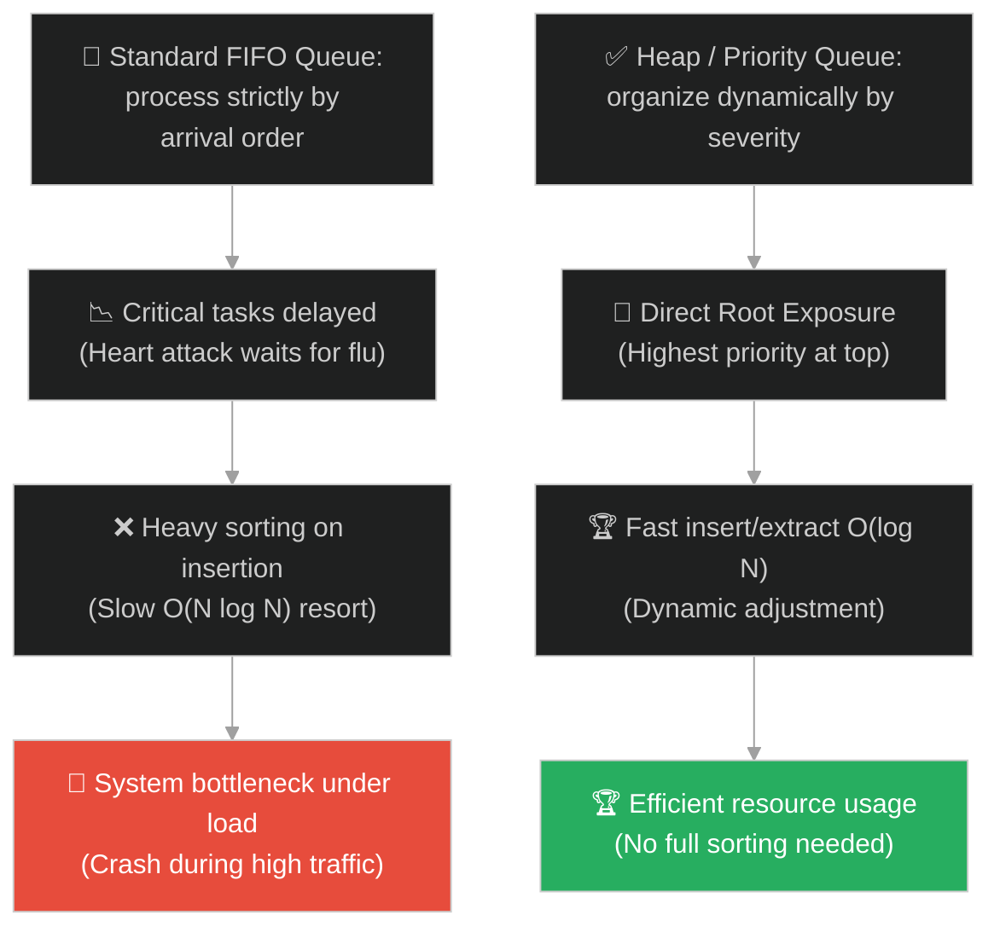
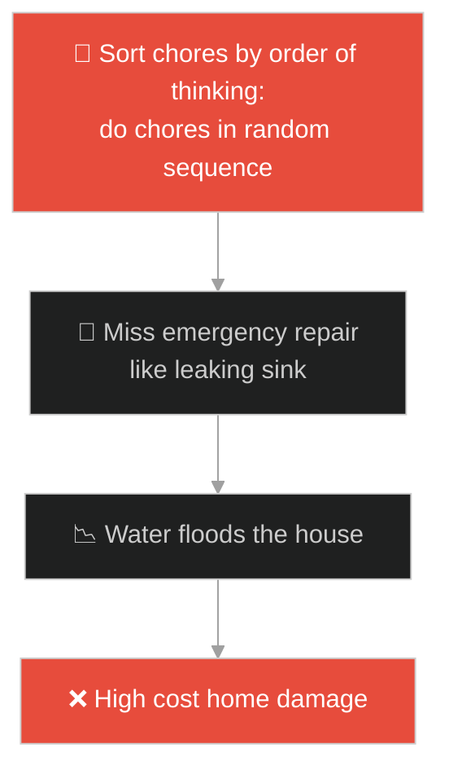
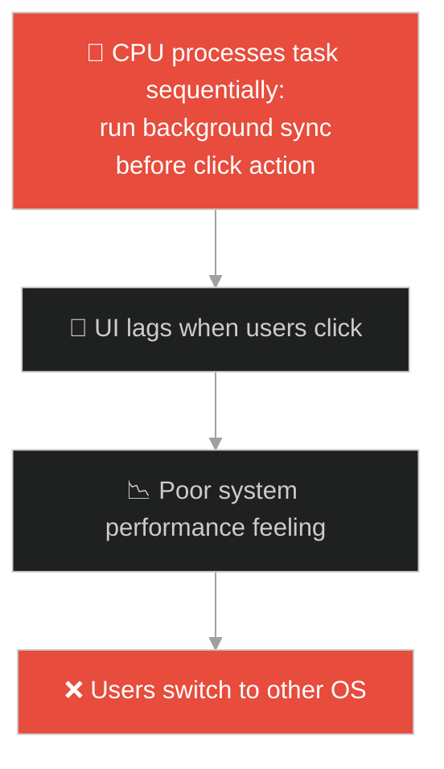
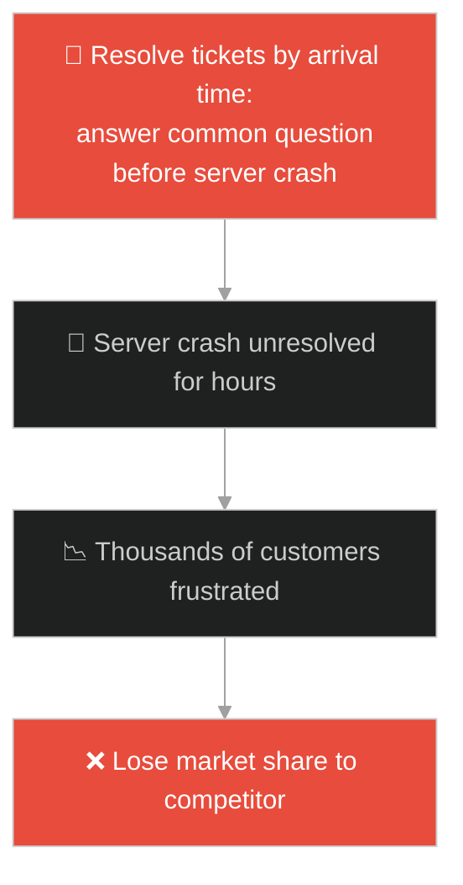
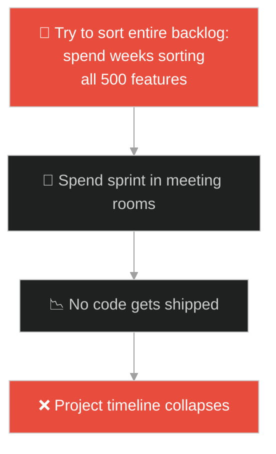
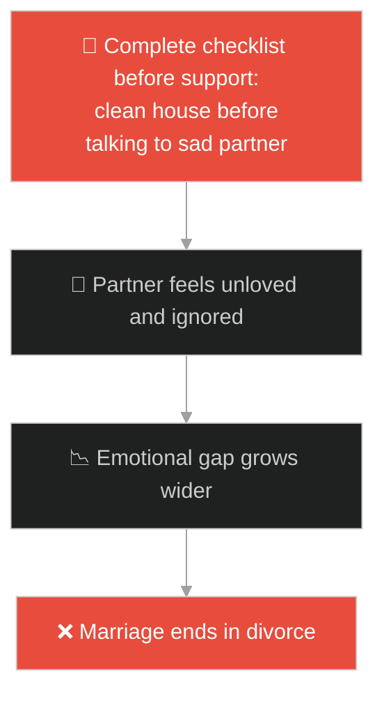
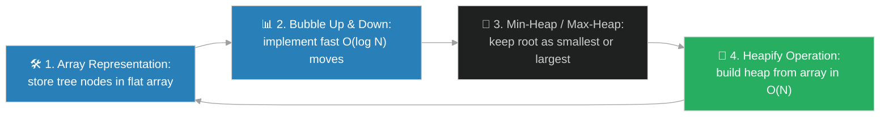

# Heap Data Structure (រចនាសម្ព័ន្ធទិន្នន័យភ្នំដី ឬហ៊ីប)៖ ការវាយតម្លៃអាទិភាពក្នុងបន្ទប់សង្គ្រោះបន្ទាន់ (Heaps & The Emergency Room Triage)

**Author:** ichamrong  
**Date:** 2026-05-28  
**Tags:** #dsa #data-structures #heaps #priority-queue #parable  
**Category:** Concepts / Parables  
**Read Time:** ~15 min  

---

## 📌 មាតិកា (Table of Contents)
- [អន្ទាក់ផ្លូវចិត្ត (The Trap)](#0)
- [១. រឿងព្រេងនិទាន៖ បន្ទប់សង្គ្រោះបន្ទាន់ និងយន្តការវាយតម្លៃកម្រិតជំងឺ (The Legend of the Emergency Room Triage)](#1)
  - [យន្តការរៀបចំអាទិភាពរបស់គិលានុបដ្ឋាយិកា (The Priority Nurse and Heap Operations)](#1-1)
- [២. បញ្ហា៖ ភាពយឺតយ៉ាវនៃការតម្រៀបទិន្នន័យជាប្រចាំ និងការខាតបង់ធនធាន (The Issue: Expensive Re-sorting Overhead and Inflexible Sorting Rules)](#2)
- [៣. ឧទាហមណ៍ជាក់ស្តែងក្នុងពិភពពិត (Real World Examples)](#3)
  - [ឧទាហរណ៍ទី ១ — កម្រិតស្រាល (គ្រួសារ)៖ ការចាត់ចែងកិច្ចការផ្ទះតាមកម្រិតបន្ទាន់ (Dynamic Household Chores Triage)](#3-1)
  - [ឧទាហរណ៍ទី ២ — កម្រិតមធ្យម (បច្ចេកទេស)៖ ប្រព័ន្ធគ្រប់គ្រងការងាររបស់ CPU (CPU Task Scheduler)](#3-2)
  - [ឧទាហរណ៍ទី ៣ — កម្រិតមធ្យម (ធុរកិច្ច)៖ ការដោះស្រាយសំបុត្រគាំទ្រអតិថិជន (Customer Support Ticket Triage)](#3-3)
  - [ឧទាហរណ៍ទី ៤ — កម្រិតមធ្យម (សង្គម/គ្រប់គ្រង)៖ ការរៀបចំកិច្ចការអាទិភាពក្នុង Agile Backlog (Agile Backlog Grooming)](#3-4)
  - [ឧទាហរណ៍ទី ៥ — កម្រិតធ្ងន់ (ទំនាក់ទំនង)៖ ការលះបង់ការងារប្រចាំថ្ងៃដើម្បីគាំទ្រដៃគូក្នុងគ្រាវិបត្តិ (Crisis Support Priority)](#3-5)
- [៤. ដំណោះស្រាយទូទៅ៖ ការអនុវត្ត Binary Heap ក្នុងវិស្វកម្មប្រព័ន្ធ (The General Solution: Binary Heap and Priority Queue Architecture)](#4)
- [សេចក្តីសន្និដ្ឋាន (Conclusion)](#5)
- [ឯកសារយោង (References)](#6)
- [Related Posts](#7)

---

<a id="0"></a>
## អន្ទាក់ផ្លូវចិត្ត (The Trap)

តើអ្នកធ្លាប់ជួបបញ្ហាដែលត្រូវរៀបចំលំដាប់លំដោយកិច្ចការងារដែលមានអាទិភាពខុសៗគ្នា ហើយអ្នកបានចំណាយកម្លាំង CPU ទៅលើការតម្រៀបទិន្នន័យឡើងវិញទាំងស្រុង (Full Sorting) រាល់ពេលមានកិច្ចការថ្មីចូលមកដែរឬទេ?

នៅក្នុងការគ្រប់គ្រងកិច្ចការងារ៖
* **យើងងាយនឹងធ្លាក់ក្នុងអន្ទាក់** នៃការប្រើប្រាស់ FIFO Queue ធម្មតា ឬការសរសេរកូដតម្រៀបទិន្នន័យទាំងស្រុង O(N log N) រាល់ពេលមានការផ្លាស់ប្តូរ ដែលនាំឱ្យខាតបង់ថាមពលគណនា និងពន្យារពេលការងារបន្ទាន់។
* **យើងមើលរំលង** រចនាសម្ព័ន្ធទិន្នន័យ Heap ដែលមិនតម្រៀបទិន្នន័យទាំងអស់ឱ្យស្អាតនោះទេ ប៉ុន្តែធានាថា "ធាតុដែលមានអាទិភាពខ្ពស់បំផុត" តែងតែស្ថិតនៅលើគេបង្អស់ O(1) ជានិច្ច។

ការព្យាយាមតម្រៀបទិន្នន័យទាំងស្រុងគ្រប់ពេលដើម្បីយកតែធាតុធំបំផុត ហៅថា **អន្ទាក់តម្រៀបទិន្នន័យច្រើនលើសលប់ (Over-sorting Trap)**។

ដើម្បីយល់ដឹងពីរបៀបគ្រប់គ្រងអាទិភាពទិន្នន័យប្រកបដោយប្រសិទ្ធភាព នេះជាផែនទីបង្ហាញផ្លូវ៖
1. **រឿងព្រេងនិទាន (The Legend)** — រឿងរ៉ាវរបស់បន្ទប់សង្គ្រោះបន្ទាន់ដែលមិនអាចប្រើជួររង់ចាំ FIFO បានឡើយ ត្រូវប្រើការវាយតម្លៃអាទិភាពលើកំពូលភ្នំ។
2. **បញ្ហា (The Issue)** — ការវិភាគ Binary Heap (Min/Max Heap), ពេលវេលាគណនា O(log N) ក្នុងការបញ្ចូល/លុប និង heapify algorithms។
3. **ឧទាហមណ៍ជាក់ស្តែងក្នុងពិភពពិត (Real World Examples)** — ពិនិត្យមើលគំនិតនេះក្នុងកម្រិតគ្រួសារ បច្ចេកវិទ្យា ធុរកិច្ច ការគ្រប់គ្រង និងទំនាក់ទំនង។
4. **ដំណោះស្រាយទូទៅ (The General Solution)** — ការអនុវត្ត Heap សម្រាប់ការរចនា Priority Queues, Task Schedulers, និង Dijkstra's pathing។



---

<a id="1"></a>
## ១. រឿងព្រេងនិទាន៖ បន្ទប់សង្គ្រោះបន្ទាន់ និងយន្តការវាយតម្លៃកម្រិតជំងឺ (The Legend of the Emergency Room Triage)

កាលពីព្រេងនាយ មានមន្ទីរពេទ្យដ៏មមាញឹកមួយនៅក្នុងទីក្រុង។ ដំបូងឡើយ បុគ្គលិកទទួលអ្នកជំងឺប្រើប្រាស់យន្តការ "អ្នកមកមុន ព្យាបាលមុន" (First-In, First-Out Queue)។

រាល់ព្រឹក៖
* អ្នកជំងឺដែលមកដល់មុនគេ ដូចជាអ្នកជំងឺផ្តាសាយ នឹងទទួលបានការពិនិត្យមុន។
* ថ្ងៃមួយ មានបុរសម្នាក់ដែលជួបគ្រោះថ្នាក់ចរាចរណ៍ធ្ងន់ធ្ងរ ហូរឈាមដាបខ្លួន ត្រូវបានសែងមកដល់មន្ទីរពេទ្យ។
* ប៉ុន្តែដោយសារច្បាប់ជួររង់ចាំ FIFO ដ៏រឹងរូស គាត់ត្រូវឈររង់ចាំនៅខាងក្រោយអ្នកជំងឺផ្តាសាយ និងអ្នកបាក់ដៃស្រាលៗ។
* មុនពេលដល់វេនរបស់គាត់ ជនរងគ្រោះបានបាត់បង់ជីវិតដោយសារការបាត់បង់ឈាមច្រើនពេក។
* ព្រឹត្តិការណ៍នេះបានបង្កឱ្យមានការភ្ញាក់ផ្អើល និងសោកស្តាយទូទាំងទីក្រុង។

---

<a id="1-1"></a>
### យន្តការរៀបចំអាទិភាពរបស់គិលានុបដ្ឋាយិកា (The Priority Nurse and Heap Operations)

ដើម្បីដោះស្រាយគ្រោះមហន្តរាយនេះ គ្រូពេទ្យធំបានបង្កើតយន្តការថ្មីមួយហៅថា **Triage (ការវាយតម្លៃអាទិភាព)**៖
* គាត់បានដាក់គិលានុបដ្ឋាយិកាម្នាក់នៅខាងមុខដើម្បីវាយតម្លៃកម្រិតគ្រោះថ្នាក់ (Priority Score) របស់អ្នកជំងឺភ្លាមៗពេលពួកគេមកដល់។
* អ្នកជំងឺគាំងបេះដូង ឬហូរឈាមធ្ងន់ធ្ងរ ទទួលបានពិន្ទុ ១០០។ អ្នកបាក់ដៃពិន្ទុ ៥០។ អ្នកផ្តាសាយពិន្ទុ ១០។
* ជំនួសឱ្យការតម្រៀបជួរវែងឡើងវិញទាំងអស់ ពួកគេរៀបចំអ្នកជំងឺជាទម្រង់ **ភ្នំកម្រិតជំងឺ (Heap Structure)**៖
  * អ្នកដែលមានពិន្ទុខ្ពស់បំផុត នឹងលោតទៅស្ថិតនៅលើកំពូលភ្នំភ្លាមៗ (Heap Insert operation)។
  * គ្រូពេទ្យដែលទំនេរ នឹងហៅតែអ្នកដែលនៅលើកំពូលភ្នំទៅព្យាបាលមុនគេជានិច្ច (Heap Extract-Max operation)។
* ប្រព័ន្ធថ្មីនេះជួយសង្គ្រោះជីវិតមនុស្សរាប់ម៉ឺននាក់ ព្រោះករណីបន្ទាន់ត្រូវបានដោះស្រាយទាន់ពេលវេលា ទោះបីជាពួកគេមកក្រោយគេក៏ដោយ។

---

<a id="2"></a>
## ២. បញ្ហា៖ ភាពយឺតយ៉ាវនៃការតម្រៀបទិន្នន័យជាប្រចាំ និងការខាតបង់ធនធាន (The Issue: Expensive Re-sorting Overhead and Inflexible Sorting Rules)

នៅក្នុងការអភិវឌ្ឍកម្មវិធី ជារឿយៗយើងត្រូវរៀបចំ Task list ដែលមានអាទិភាពផ្សេងៗគ្នា។ ប្រសិនបើយើងប្រើប្រាស់ List ធម្មតា ហើយហៅ `Collections.sort()` គ្រប់ពេលដែលមានភារកិច្ចថ្មីចូលមក៖

```java
// កូដដែលតម្រៀបទិន្នន័យឡើងវិញទាំងស្រុង O(N log N)
public void addNewTask(Task task, List<Task> tasks) {
    tasks.add(task);
    tasks.sort(Comparator.comparingInt(Task::getPriority).reversed());
    // ការ Sort ឡើងវិញទាំងស្រុងចំណាយពេល O(N log N) ខ្លាំង
}
```

* **Overhead ខ្ពស់ O(N log N)៖** ប្រសិនបើប្រព័ន្ធទទួលបានកិច្ចការថ្មីរាប់ពាន់ដងក្នុងមួយវិនាទី ការ Sort ឡើងវិញទាំងស្រុងនឹងធ្វើឱ្យ CPU ឡើងកម្តៅ ១០០% ភ្លាមៗ នាំឱ្យប្រព័ន្ធគាំង ឬឆ្លើយតបយឺត។
* **ការប្រើប្រាស់ FIFO មិនសមស្រប៖** នៅក្នុងប្រព័ន្ធដែលត្រូវការដោះស្រាយកិច្ចការបន្ទាន់ (ដូចជា CPU Interruption, Network Packet Filtering) ការប្រើប្រាស់ FIFO Queue ធម្មតានឹងធ្វើឱ្យកិច្ចការសំខាន់ៗត្រូវរង់ចាំនៅពីក្រោយកិច្ចការតូចៗ ដែលនាំឱ្យកើតមានបញ្ហាល្បឿនយឺតយ៉ាវធ្ងន់ធ្ងរ (Latency Spikes)។

**Heap Data Structure** ដោះស្រាយបញ្ហានេះដោយប្រើប្រាស់ Complete Binary Tree រក្សាទុកក្នុង Array។ វាមិនតម្រៀបទិន្នន័យឱ្យមានសណ្តាប់ធ្នាប់ទាំងស្រុងនោះទេ ប៉ុន្តែវាធានាថា Parent Node តែងតែធំជាង (ឬតូចជាង) Child Nodes។ រាល់ការបញ្ចូល ឬលុបធាតុចេញ ប្រើពេលត្រឹមតែ O(log N) តាមរយៈការរំកិលធាតុឡើងលើ/ចុះក្រោម (Bubble Up/Down) ធានាល្បឿនលឿន និងសន្សំសំចៃធនធាន CPU ខ្ពស់បំផុត។

---

<a id="3"></a>
## ៣. ឧទាហមណ៍ជាក់ស្តែងក្នុងពិភពពិត

---

<a id="3-1"></a>
### ឧទាហមណ៍ទី ១ — កម្រិតស្រាល (គ្រួសារ)៖ ការចាត់ចែងកិច្ចការផ្ទះតាមកម្រិតបន្ទាន់ (Dynamic Household Chores Triage)

នៅក្នុងផ្ទះមួយ កិច្ចការងារផ្ទះមានច្រើនឥតគណនា ដូចជាការសម្អាតទូសៀវភៅ បោកខោអាវ និងការជួសជុលទុយោទឹកដែលកំពុងធ្លាយ។ ប្រសិនបើម្តាយធ្វើការងារតាមលំដាប់ចៃដន្យ ទឹកនឹងហូរជន់លិចផ្ទះបាត់ទៅហើយ។ គាត់ត្រូវចាត់ចែងកិច្ចការតាមកម្រិតបន្ទាន់៖ ការជួសជុលទុយោទឹក (អាទិភាពខ្ពស់បំផុត) ត្រូវធ្វើភ្លាមៗ រីឯការសម្អាតទូសៀវភៅទុកធ្វើពេលក្រោយ។



---

<a id="3-2"></a>
### ឧទាហមណ៍ទី ២ — កម្រិតមធ្យម (បច្ចេកទេស)៖ ប្រព័ន្ធគ្រប់គ្រងការងាររបស់ CPU (CPU Task Scheduler)

នៅក្នុងប្រព័ន្ធប្រតិបត្តិការ (Windows, Linux) កម្មវិធីរាប់រយកំពុងដំណើរការក្នុងពេលតែមួយ។ ប្រសិនបើ CPU Scheduler ប្រើប្រាស់ FIFO Queue នោះ UI របស់កុំព្យូទ័រនឹងគាំង ឬកន្ត្រាក់ពេលអ្នកប្រើប្រាស់វាយអក្សរ ព្រោះត្រូវរង់ចាំការងារ Background Sync បញ្ចប់។ CPU ប្រើប្រាស់ Priority Queue (Heap) ដើម្បីធានាថា កិច្ចការដែលប៉ះពាល់ដល់បទពិសោធន៍អ្នកប្រើប្រាស់ (UI Threads) ទទួលបានការគណនាមុនគេបង្អស់ O(1) ជានិច្ច។



---

<a id="3-3"></a>
### ឧទាហមណ៍ទី ៣ — កម្រិតមធ្យម (ធុរកិច្ច)៖ ការដោះស្រាយសំបុត្រគាំទ្រអតិថិជន (Customer Support Ticket Triage)

នៅក្នុងក្រុមហ៊ុនលក់ទំនិញធំៗ សំណើគាំទ្រអតិថិជន (Support Tickets) ចូលមកជាប្រចាំ។ ប្រសិនបើប្រព័ន្ធដោះស្រាយតាមលំដាប់លំដោយធម្មតា នោះបញ្ហាធ្ងន់ធ្ងរដូចជា "ប្រព័ន្ធទូទាត់ប្រាក់គាំង (Payment Gateway Down)" នឹងត្រូវរង់ចាំនៅពីក្រោយសំនួរសួររកព័ត៌មានទូទៅ។ ក្រុមហ៊ុនប្រើប្រាស់ប្រព័ន្ធ Triage ផ្អែកលើ Heap ដើម្បីកំណត់អាទិភាព និងដោះស្រាយបញ្ហា P0 (Critical) មុនគេ ដើម្បីចៀសវាងការខាតបង់ចំណូលធ្ងន់ធ្ងរ។



---

<a id="3-4"></a>
### ឧទាហមណ៍ទី ៤ — កម្រិតមធ្យម (សង្គម/គ្រប់គ្រង)៖ ការរៀបចំកិច្ចការអាទិភាពក្នុង Agile Backlog (Agile Backlog Grooming)

នៅក្នុងការគ្រប់គ្រងគម្រោងទន់ (Software Development) ក្រុមការងារជួបបញ្ហាមានតម្រូវការ Feature ថ្មីៗរាប់រយពីអតិថិជន។ ប្រសិនបើព្យាយាមតម្រៀប Feature ទាំងអស់នោះឱ្យល្អឥតខ្ចោះ ក្រុមការងារនឹងចំណាយពេលប្រជុំរាប់សប្តាហ៍ដោយមិនបានសរសេរកូដឡើយ។ Product Owner ប្រើប្រាស់ Heap Priority Concept ដើម្បីចាប់យកតែ Feature សំខាន់ៗចំនួន ១០ (Highest Priority) មកដាក់ក្នុង Sprint បន្ទាប់ ដោយមិនបាច់ខ្វល់ខ្វាយពីការតម្រៀប Feature តូចៗដែលនៅសល់ឡើយ។



---

<a id="3-5"></a>
### ឧទាហមណ៍ទី ៥ — កម្រិតធ្ងន់ (ទំនាក់ទំនង)៖ ការលះបង់ការងារប្រចាំថ្ងៃដើម្បីគាំទ្រដៃគូក្នុងគ្រាវិបត្តិ (Crisis Support Priority)

នៅក្នុងទំនាក់ទំនងផ្ទាល់ខ្លួន សកម្មភាពប្រចាំថ្ងៃដូចជា ការសម្អាតផ្ទះ ការទូទាត់វិក្កយបត្រ ឬការលេងហ្គេម ត្រូវតែត្រូវបានផ្អាកភ្លាមៗ នៅពេលដែលដៃគូជួបប្រទះវិបត្តិផ្លូវចិត្ត ឬគ្រោះថ្នាក់សង្គ្រោះបន្ទាន់។ ការព្យាយាមបញ្ចប់ការងារប្រចាំថ្ងៃជាមុន (Tree sequence) ដោយទុកដៃគូដែលកំពុងមានទុក្ខឱ្យរង់ចាំ នឹងនាំឱ្យបាត់បង់ការជឿជាក់ និងបំផ្លាញចំណងស្នេហ៍ភ្លាមៗ។ វិបត្តិរបស់ដៃគូត្រូវតែលោតទៅកំពូលនៃអាទិភាពជីវិតជានិច្ច។



---

<a id="4"></a>
## ៤. ដំណោះស្រាយទូទៅ៖ ការអនុវត្ត Binary Heap ក្នុងវិស្វកម្មប្រព័ន្ធ (The General Solution: Binary Heap and Priority Queue Architecture)

ដើម្បីគ្រប់គ្រងអាទិភាពទិន្នន័យប្រកបដោយស្ថិរភាព និងល្បឿនលឿន វិស្វករត្រូវអនុវត្ត Binary Heap ឱ្យបានត្រឹមត្រូវ៖



ជំហាននៃការអនុវត្ត៖
1. **ប្រើប្រាស់ Array តំណាងឱ្យ Tree (Array Representation)៖** រក្សាទុក Nodes ទាំងអស់ក្នុង Flat Array ធម្មតា ដើម្បីសន្សំសំចៃ Memory pointer។ ទំនាក់ទំនងត្រូវបានគណនាដោយ៖
   * Parent index នៃ node $i$ គឺ $\text{parent}(i) = \frac{i - 1}{2}$។
   * Left child index គឺ $\text{left}(i) = 2i + 1$។
   * Right child index គឺ $\text{right}(i) = 2i + 2$។
2. **អនុវត្តការរំកិល Bubble Up & Bubble Down (Heapify Operations)៖**
   * **Bubble Up (Shift Up)៖** រំកិលធាតុដែលទើបបញ្ចូលថ្មីឡើងទៅលើ ប្រសិនបើវាមានអាទិភាពខ្ពស់ជាង Parent Node (ប្រើពេល O(log N))។
   * **Bubble Down (Shift Down)៖** រំកិលធាតុដែលនៅកំពូលចុះមកក្រោម ក្រោយពេលដកធាតុធំបំផុតចេញ ដើម្បីរក្សាតុល្យភាព (ប្រើពេល O(log N))។
3. **ជ្រើសរើសប្រភេទ Heap ឱ្យត្រូវនឹងតម្រូវការ៖**
   * **Max-Heap:** ធាតុធំបំផុតនៅលើកំពូល (ល្អសម្រាប់សង្គ្រោះបន្ទាន់ កម្រិត severity P0 ខ្ពស់បំផុត)។
   * **Min-Heap:** ធាតុលំដាប់តូចបំផុតនៅលើកំពូល (ល្អសម្រាប់ស្វែងរកចម្ងាយខ្លីបំផុត ដូចជា Dijkstra's algorithm)។
4. **អនុវត្តការសាងសង់ Heap រហ័ស O(N) (Build Heap / Heapify)៖** នៅពេលមាន Array មិនទាន់តម្រៀបទិន្នន័យ ជំនួសឱ្យការបញ្ចូលធាតុមួយៗម្តងមួយ O(N log N) ត្រូវអនុវត្តការរត់ Bubble Down ពីពាក់កណ្តាល Array ថយក្រោយ ដើម្បីបំប្លែង Array ទាំងមូលឱ្យទៅជា Heap ក្នុងរយៈពេលលឿនបំផុត O(N)។

---

## 🐇 ធ្លាក់ចូលក្នុងរន្ធទន្សាយ (Enter the Rabbit Hole)

ដើម្បីស្វែងយល់ពីរបៀបដែលចៅក្រមក្តី ឬអ្នកស៊ើបអង្កេត អាចស្វែងរកជនសង្ស័យម្នាក់ពីក្នុងបញ្ជីឈ្មោះរៀបចំតាមលំដាប់អក្ខរក្រមរាប់លាននាក់ ដោយមិនចាំបាច់អានឈ្មោះម្តងម្នាក់ៗ និងអាចស្វែងរកបានជោគជ័យក្នុងរយៈពេលត្រឹមតែ ១០ វិនាទី (Binary Search & O(log N) Lookup) សូមបន្តដំណើរទៅកាន់៖

* 🚀 **[ចាប់ផ្តើមដំណើររុករក (Start the Journey) ➔ Binary Search and Dictionary of Secrets](./105-the-dictionary-of-secrets.md)**

---

<a id="5"></a>
## សេចក្តីសន្និដ្ឋាន (Conclusion)

> **«ការផ្តោតលើតែកិច្ចការដែលសំខាន់បំផុតនៅលើកំពូល ជួយយើងឱ្យរួចផុតពីភាពហត់នឿយនៃការរៀបចំសណ្តាប់ធ្នាប់គ្រប់យ៉ាង»**

ការប្រើប្រាស់ Heap និង Priority Queue ជួយឱ្យប្រព័ន្ធដោះស្រាយបញ្ហាអាទិភាពឌីណាមិកបានយ៉ាងរលូន ការពារការកកស្ទះការងារសំខាន់ៗ និងធានាបាននូវការសន្សំសំចៃធនធាន CPU ខ្ពស់បំផុតសម្រាប់ការរចនាប្រព័ន្ធធំៗ។

---

<a id="6"></a>
## ឯកសារយោង (References)

* **Knuth, D. E.** — *The Art of Computer Programming, Volume 3: Sorting and Searching* (1998). Binary heaps, heap sort, and priority queue complexity analyses.
* **Cormen, T. H., Leiserson, C. E., Rivest, R. L., & Stein, C.** — *Introduction to Algorithms* (2009). Heaps, heap operations (insert, extract, heapify), and priority queues.

---

<a id="7"></a>
## Related Posts

* [[DSA: Heaps](../dsa/02-non-linear-structures.md#4-heaps--the-priority-engine)] — ការពន្យល់លម្អិត និងស៊ីជម្រៅអំពី Heaps ក្នុង DSA។
* [[Stack & Queue Data Structure & The Dish Stack](./100-the-dish-stack-and-the-ticket-queue.md)] — ការយល់ដឹងពីលំដាប់លំដោយ FIFO/LIFO ធម្មតាដែលត្រូវអភិវឌ្ឍទៅជា Priority Queue។
