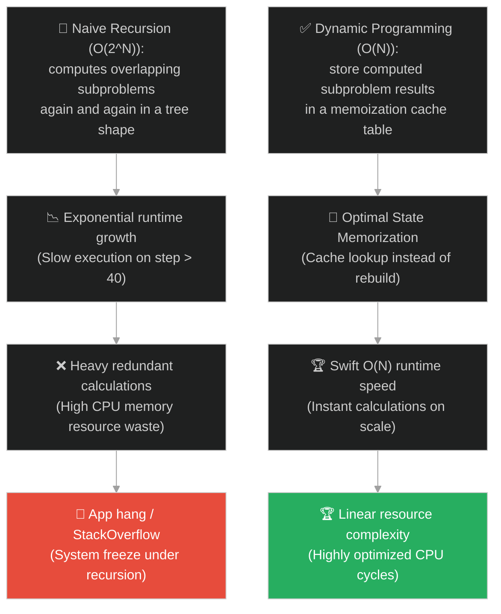
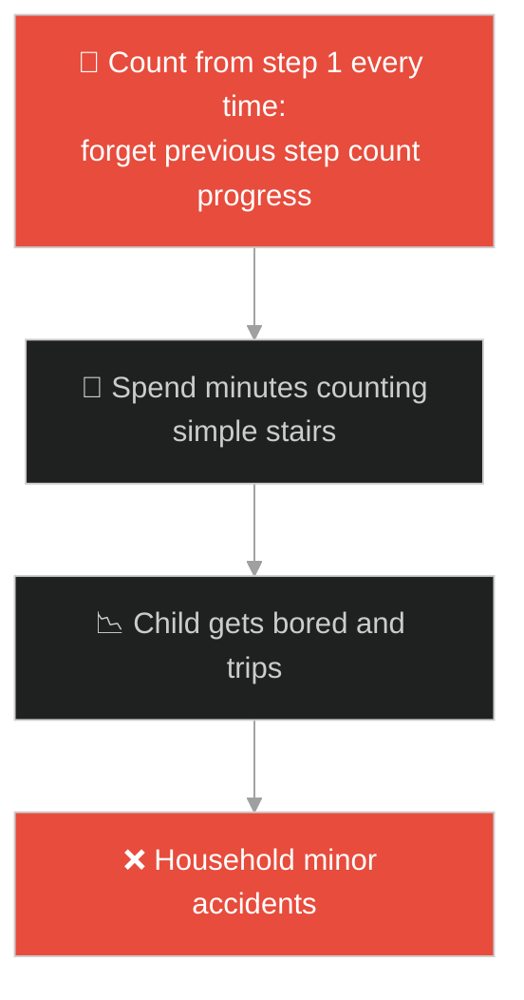
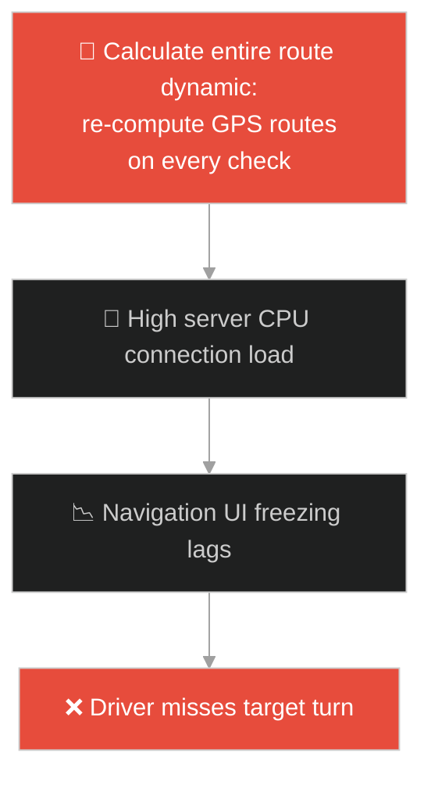
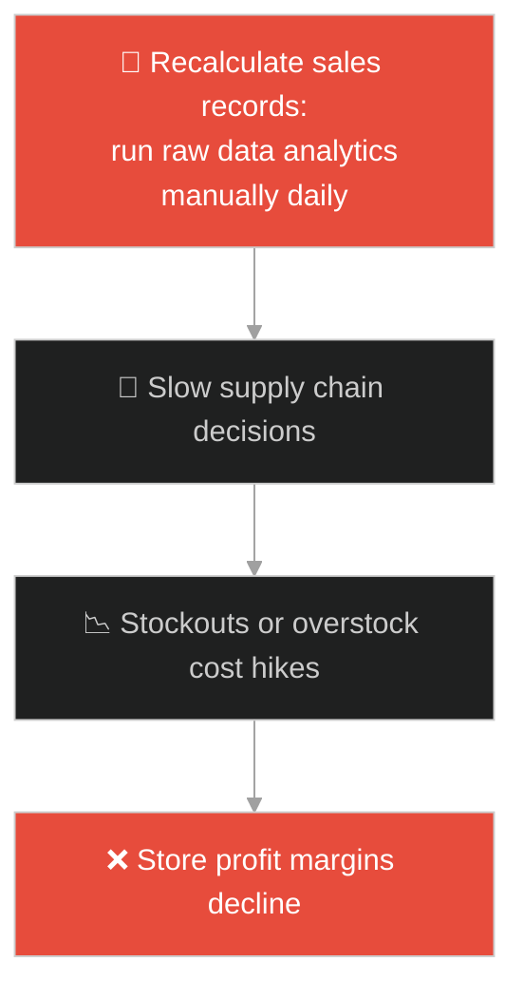
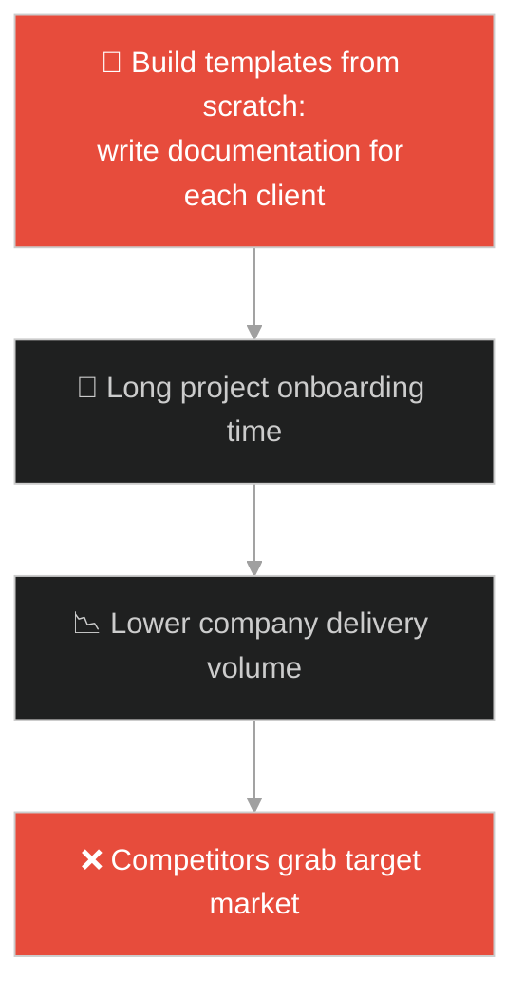
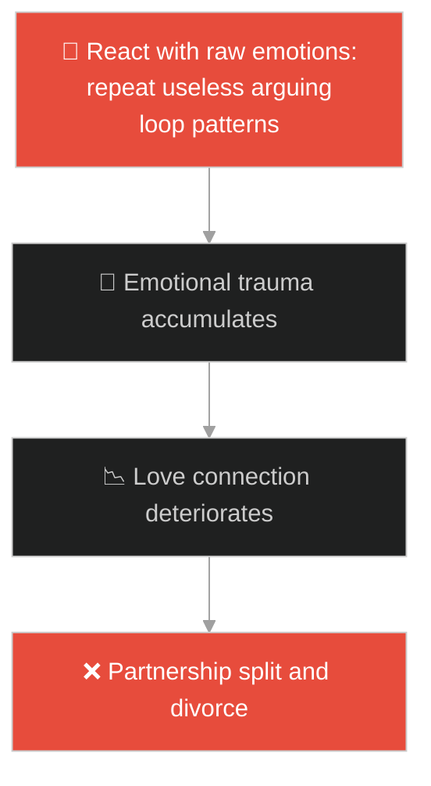
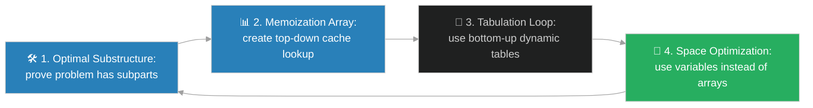

# Dynamic Programming Algorithm (ក្បួនដោះស្រាយកម្មវិធីឌីណាមិក)៖ ជណ្តើរហ្វ៊ីបូណាស៊ី និងសៀវភៅកំណត់ហេតុ (Dynamic Programming & The Fibonacci Staircase)

**Author:** ichamrong  
**Date:** 2026-05-28  
**Tags:** #dsa #algorithms #dynamic-programming #memoization #tabulation #parable  
**Category:** Concepts / Parables  
**Read Time:** ~15 min  

---

## 📌 មាតិកា (Table of Contents)
- [អន្ទាក់ផ្លូវចិត្ត (The Trap)](#0)
- [១. រឿងព្រេងនិទាន៖ អ្នកប្រាជ្ញភ្លេចភ្លាំង និងការឡើងកាំជណ្តើររាប់សិបឆ្នាំ (The Legend of the Forgetful Scholar and the Staircase)](#1)
  - [សៀវភៅកំណត់ហេតុចងចាំចម្លើយ O(N) (The Magic Notebook and Memoization)](#1-1)
- [២. បញ្ហា៖ ដែនកំណត់នៃ Recursion ធម្មតា និងការកើនឡើងល្បឿនជាស្វ័យគុណ O(2^N) (The Issue: Naive Recursion Bottleneck and Exponential Complexity)](#2)
- [៣. ឧទាហមណ៍ជាក់ស្តែងក្នុងពិភពពិត (Real World Examples)](#3)
  - [ឧទាហរណ៍ទី ១ — កម្រិតស្រាល (គ្រួសារ)៖ ការរាប់កម្រិតកម្ពស់ជណ្តើរតាមចំណាំ (Counting Stairs with Previous Step Cache)](#3-1)
  - [ឧទាហរណ៍ទី ២ — កម្រិតមធ្យម (បច្ចេកទេស)៖ ការគណនា GPS និងការទាញយកទិន្នន័យ Cache API (Shortest Path Caching in GPS Navigation)](#3-2)
  - [ឧទាហរណ៍ទី ៣ — កម្រិតមធ្យម (ធុរកិច្ច)៖ ការបង្កើនប្រសិទ្ធភាពបំពេញទំនិញតាមតម្រូវការចាស់ (Optimizing Inventory Based on Cached Forecasts)](#3-3)
  - [ឧទាហរណ៍ទី ៤ — កម្រិតមធ្យម (សង្គម/គ្រប់គ្រង)៖ ការប្រើប្រាស់គំរូគម្រោងចាស់ៗឡើងវិញ (Reusing Project Templates and Design Assets)](#3-4)
  - [ឧទាហរណ៍ទី ៥ — កម្រិតធ្ងន់ (ទំនាក់ទំនង)៖ ការប្រើប្រាស់យុទ្ធសាស្ត្រចាស់ដែលធ្លាប់ដោះស្រាយជម្លោះបានជោគជ័យ (Recalling Effective Conflict Resolution Patterns)](#3-5)
- [៤. ដំណោះស្រាយទូទៅ៖ ការអនុវត្ត Dynamic Programming ក្នុងវិស្វកម្មប្រព័ន្ធ (The General Solution: Memoization vs Tabulation and State Caching)](#4)
- [សេចក្តីសន្និដ្ឋាន (Conclusion)](#5)
- [ឯកសារយោង (References)](#6)
- [Related Posts](#7)

---

<a id="0"></a>
## អន្ទាក់ផ្លូវចិត្ត (The Trap)

តើអ្នកធ្លាប់សរសេរកូដ Recursion ដ៏សាមញ្ញមួយ (ដូចជា ការគណនា Fibonacci ឬ Shortest Path) ហើយនៅពេលទិន្នន័យកើនឡើងបន្តិចបន្តួច កម្មវិធីក៏ចាប់ផ្តើមគាំង ឬដំណើរការយឺតខ្លាំង O(2^N) ដែរឬទេ?

នៅក្នុងការដោះស្រាយ algorithms៖
* **យើងងាយនឹងធ្លាក់ក្នុងអន្ទាក់** នៃការគណនាឡើងវិញនូវកិច្ចការងារតូចៗដដែលៗដែលធ្លាប់បានធ្វើរួចរាល់ហើយ (Overlapping Subproblems) ដោយសារតែខ្វះប្រព័ន្ធរក្សាទុកចម្លើយ។
* **យើងមើលរំលង** សក្តានុពលនៃការរក្សាទុកលទ្ធផលចាស់ (Memoization ឬ Tabulation) ដើម្បីបំប្លែងល្បឿនគណនាពីស្វ័យគុណ O(2^N) មកលីនេអ៊ែរ O(N) វិញ។

ការព្យាយាមដោះស្រាយបញ្ហា overlapping subproblems ដោយប្រើ Recursion សាមញ្ញ ហៅថា **អន្ទាក់គណនា Recursion ស្ទួន (Redundant Recursion Trap)**។

ដើម្បីយល់ដឹងពីរបៀបគណនាក្នុងល្បឿន O(N) នេះជាផែនទីបង្ហាញផ្លូវ៖
1. **រឿងព្រេងនិទាន (The Legend)** — រឿងរ៉ាវរបស់អ្នកប្រាជ្ញភ្លេចភ្លាំងដែលត្រូវគណនាកាំជណ្តើរ តែត្រូវគិតសារចុះសារឡើងឥតឈប់ឈរ រហូតដល់ប្រើកំណត់ហេតុចងចាំ។
2. **បញ្ហា (The Issue)** — ការវិភាគ Dynamic Programming, Optimal Substructure, Memoization (Top-Down) vs Tabulation (Bottom-Up)។
3. **ឧទាហមណ៍ជាក់ស្តែងក្នុងពិភពពិត (Real World Examples)** — ពិនិត្យមើលគំនិតនេះក្នុងកម្រិតគ្រួសារ បច្ចេកវិទ្យា ធុរកិច្ច ការគ្រប់គ្រង និងទំនាក់ទំនង។
4. **ដំណោះស្រាយទូទៅ (The General Solution)** — ការអនុវត្ត DP សម្រាប់ការរចនា Caching Systems, Cost Minimization, និង Knapsack optimization.



---

<a id="1"></a>
## ១. រឿងព្រេងនិទាន៖ អ្នកប្រាជ្ញភ្លេចភ្លាំង និងការឡើងកាំជណ្តើររាប់សិបឆ្នាំ (The Legend of the Forgetful Scholar and the Staircase)

កាលពីព្រេងនាយ មានអ្នកប្រាជ្ញម្នាក់ល្បីខាងគណិតវិទ្យា ប៉ុន្តែគាត់មានជំងឺភ្លេចភ្លាំងធ្ងន់ធ្ងរ។ ថ្ងៃមួយ ព្រះរាជាបានសួរគាត់ថា៖ *"តើមានរបៀបឡើងជណ្តើរប្រវែង ៥ កាំ ចំនួនប៉ុន្មានផ្លូវ ប្រសិនបើអ្នកអាចបោះជំហានម្តង ១ កាំ ឬ ២ កាំ?"*

ដំបូងឡើយ៖
* ដើម្បីគណនាកាំទី៥ គាត់ត្រូវដឹងពីចម្លើយនៃកាំទី៤ និងកាំទី៣ ជាមុនសិន។ គាត់ក៏ដើរទៅគណនាកាំទី៤។
* ប៉ុន្តែកាំទី៤ ក៏បង្ខំឱ្យគាត់គណនាកាំទី៣ និងកាំទី២ ទៀត។
* ដោយសារជំងឺភ្លេចភ្លាំង ក្រោយពេលគណនាកាំទី៣ រួចរាល់ គាត់មិនបានកត់ទុកឡើយ។ ពេលគាត់ត្រលប់មកគណនាកាំទី៤ រួច គាត់ត្រូវបន្តគណនាកាំទី៣ ម្តងទៀតសម្រាប់ផ្នែកកាំទី៥ (Overlapping Computation)។
* គាត់ត្រូវគណនាកាំដដែលៗរាប់រយដង (Exponential O(2^N))។ គាត់ចំណាយពេលរហូតដល់សក់ស្កូវពេញក្បាល ទើបតែរកឃើញចម្លើយនៃកាំជណ្តើរទី ៤០។

---

<a id="1-1"></a>
### សៀវភៅកំណត់ហេតុចងចាំចម្លើយ O(N) (The Magic Notebook and Memoization)

ឃើញសភាពដ៏គួរឱ្យអាណិតនេះ៖
* ទេវតាក៏បានប្រគល់ **សៀវភៅកំណត់ហេតុវេទមន្ត (The Memoization Table)** មួយក្បាលដល់គាត់។
* គាត់បានសន្យានឹងខ្លួនឯងថា៖ *"រាល់ពេលខ្ញុំគណនាឃើញចម្លើយកាំជណ្តើរណាមួយ ខ្ញុំនឹងសរសេរវាទុកក្នុងសៀវភៅនេះភ្លាម"*។
* ឥឡូវនេះ ពេលប្រព័ន្ធតម្រូវឱ្យគាត់គណនាកាំទី៣ សារជាថ្មី គាត់មិនបាច់យកដៃមកគណនាឡើយ។ គាត់គ្រាន់តែបើកមើលទំព័រសៀវភៅរបស់គាត់ ឃើញចម្លើយស្រាប់ គាត់ក៏ឆ្លើយភ្លាម O(1)។
* ល្បឿនការងាររបស់គាត់លឿនដូចផ្លេកបន្ទោរ O(N)។ គាត់អាចគណនាដល់កាំជណ្តើរទី ១០០០០ ក្នុងរយៈពេលត្រឹមតែ ១ វិនាទីប៉ុណ្ណោះ ជួយរំដោះខ្លួនពីការងារដដែលៗពេញមួយជីវិត។

---

<a id="2"></a>
## ២. បញ្ហា៖ ដែនកំណត់នៃ Recursion ធម្មតា និងការកើនឡើងល្បឿនជាស្វ័យគុណ O(2^N) (The Issue: Naive Recursion Bottleneck and Exponential Complexity)

នៅក្នុងការសរសេរកូដ ភាពជំពាក់ជំពិននេះកើតឡើងនៅពេលយើងសរសេរកូដ Recursion គណនា Fibonacci ធម្មតា៖

```java
// កូដ Recursion សាមញ្ញ O(2^N) ដែលធ្វើឱ្យ CPU ឡើងកម្តៅ ១០០%
public int fib(int n) {
    if (n <= 1) return n;
    return fib(n - 1) + fib(n - 2); // ហៅការគណនាស្ទួនគ្នារាប់លានដង
}
```

* **កម្រិតស្មុគស្មាញស្វ័យគុណ O(2^N)៖** ប្រសិនបើ $N = 50$ នោះការហៅ function គណនានឹងឡើងដល់ $2^{50}$ ដង (រាប់រយទ្រីលានដង)។ វានឹងធ្វើឱ្យកុំព្យូទ័រគាំង StackOverflow ឬដំណើរការយឺតខ្លាំង (Hang)។
* **ការខាតបង់ CPU លើបញ្ហា Overlapping៖** នៅក្នុងប្រព័ន្ធស្វែងរកផ្លូវ (GPS Navigations) ឬប្រព័ន្ធវិភាជន៍ធនធាន បញ្ហាតូចៗ (Subproblems) តែងតែជួបគ្នាជាញឹកញាប់។ បើគ្មានការចងចាំ (Caching) ទេ ម៉ាស៊ីន server នឹងធ្លាក់ចុះផលិតភាពជាលំដាប់។

**Dynamic Programming** ដោះស្រាយបញ្ហានេះដោយប្រើ៖
* **Memoization (Top-Down):** រក្សាទុកលទ្ធផលក្នុង Map ឬ Array (`cache[n]`)។ រាល់ពេលហៅ recursion ត្រូវឆែកមើល cache ជាមុន បើមានចម្លើយ ត្រលប់តម្លៃភ្លាម។
* **Tabulation (Bottom-Up):** គណនាពីក្រោមឡើងលើដោយប្រើ Loop ធម្មតា រួចបំពេញទិន្នន័យក្នុងតារាង (`table[i]`) ដែលធានាមិនឱ្យមាន StackOverflow error។

---

<a id="3"></a>
## ៣. ឧទាហមណ៍ជាក់ស្តែងក្នុងពិភពពិត

---

<a id="3-1"></a>
### ឧទាហមណ៍ទី ១ — កម្រិតស្រាល (គ្រួសារ)៖ ការរាប់កម្រិតកម្ពស់ជណ្តើរតាមចំណាំ (Counting Stairs with Previous Step Cache)

នៅក្នុងផ្ទះមួយ ពេលកូនតូចម្នាក់ព្យាយាមរាប់កាំជណ្តើរ ជំនួសឱ្យការត្រលប់ទៅរាប់តាំងពីកាំទី១ ឡើងវិញរាល់ពេលដែលគាត់ឈានដល់កាំទី៥ (Linear re-count) គាត់គ្រាន់តែចាំថា "ឥឡូវខ្ញុំឈរនៅកាំទី៤ រួចហើយ ខ្ញុំគ្រាន់តែបូក ១ បន្ថែមទៀតជាការស្រេច"។ ការប្រើចំណាំចុងក្រោយនេះជួយសន្សំពេលវេលា និងកម្លាំងរបស់ក្មេងបានយ៉ាងច្រើន។



---

<a id="3-2"></a>
### ឧទាហមណ៍ទី ២ — កម្រិតមធ្យម (បច្ចេកទេស)៖ ការគណនា GPS និងការទាញយកទិន្នន័យ Cache API (Shortest Path Caching in GPS Navigation)

ប្រព័ន្ធផែនទី Google Maps ប្រើប្រាស់ Dynamic Programming ដើម្បីគណនាផ្លូវខ្លីបំផុតពីខេត្តមួយទៅខេត្តមួយ។ ជំនួសឱ្យការគណនាផ្លូវតូចៗទាំងអស់ឡើងវិញរាល់ពេល (Dijkstra redundancy) ប្រព័ន្ធគណនាផ្លូវរវាងទីក្រុងសំខាន់ៗទុកជាមុន រួចយកមកផ្គុំគ្នា ដើម្បីផ្តល់ផែនទីលឿនបំផុតជូនអ្នកបើកបរ O(1) cache lookup។



---

<a id="3-3"></a>
### ឧទាហមណ៍ទី ៣ — កម្រិតមធ្យម (ធុរកិច្ច)៖ ការបង្កើនប្រសិទ្ធភាពបំពេញទំនិញតាមតម្រូវការចាស់ (Optimizing Inventory Based on Cached Forecasts)

នៅក្នុងអាជីវកម្មលក់រាយ ម្ចាស់ហាងត្រូវសម្រេចចិត្តទិញទំនិញចូលស្តុកតាមការទស្សន៍ទាយតម្រូវការទីផ្សារ។ ជំនួសឱ្យការគណនាស្ថិតិឡើងវិញទាំងស្រុងរាល់ដង (Full statistics re-sum) ពួកគេប្រើប្រាស់ទិន្នន័យតម្រូវការដែលបានគណនាទុកជាមុន និងរក្សាទុកក្នុង cache ដើម្បីសម្រេចចិត្តទិញទំនិញចូលស្តុកបានភ្លាមៗ និងកាត់បន្ថយការចំណាយលើឃ្លាំង។



---

<a id="3-4"></a>
### ឧទាហមណ៍ទី ៤ — កម្រិតមធ្យម (សង្គម/គ្រប់គ្រង)៖ ការប្រើប្រាស់គំរូគម្រោងចាស់ៗឡើងវិញ (Reusing Project Templates and Design Assets)

នៅក្នុងក្រុមហ៊ុនគ្រប់គ្រងគម្រោង បើមានគម្រោងថ្មីចូលមក ហើយអ្នកគ្រប់គ្រងចាប់ផ្តើមរៀបចំឯកសារកិច្ចសន្យា ផែនការងារ និងការរចនាម៉ាកយីហោតាំងពីសូន្យ (Rebuilding from scratch) វានឹងចំណាយពេលច្រើន និងខាតបង់ធនធាន។ ការប្រើប្រាស់ "គំរូការងារដែលជោគជ័យពីមុន (Project Templates/Assets)" ជួយឱ្យក្រុមហ៊ុនអាចបញ្ចប់គម្រោងថ្មីបានយ៉ាងលឿន និងរក្សាបាននូវស្ដង់ដារការងារខ្ពស់ដដែល។



---

<a id="3-5"></a>
### ឧទាហមណ៍ទី ៥ — កម្រិតធ្ងន់ (ទំនាក់ទំនង)៖ ការប្រើប្រាស់យុទ្ធសាស្ត្រចាស់ដែលធ្លាប់ដោះស្រាយជម្លោះបានជោគជ័យ (Recalling Effective Conflict Resolution Patterns)

នៅក្នុងទំនាក់ទំនងស្នេហា និងគ្រួសារ នៅពេលមានបញ្ហាជម្លោះកើតឡើង ជំនួសឱ្យការសាកល្បងវិធីសាស្ត្រដោះស្រាយថ្មីៗដែលមិនច្បាស់លាស់ ឬការឈ្លោះប្រកែកគ្នាដោយមិនមានក្បួនច្បាប់ (Overlapping emotional loops) គូស្វាមីភរិយាដែលឆ្លាតវៃចងចាំ និងប្រើប្រាស់ "វិធីសាស្ត្រដែលធ្លាប់ដោះស្រាយបញ្ហាបានជោគជ័យពីមុន (Conflict Cache)" ដូចជាការបើកចិត្តនិយាយទល់មុខ ឬការផ្អាកពិភាក្សា ១០ នាទីដើម្បីសម្រួលអារម្មណ៍ ជួយការពារទំនាក់ទំនងបានយ៉ាងល្អ។



---

<a id="4"></a>
## ៤. ដំណោះស្រាយទូទៅ៖ ការអនុវត្ត Dynamic Programming ក្នុងវិស្វកម្មប្រព័ន្ធ (The General Solution: Memoization vs Tabulation and State Caching)

ដើម្បីដោះស្រាយបញ្ហា overlapping subproblems ប្រកបដោយប្រសិទ្ធភាព និងចៀសវាងបញ្ហា StackOverflow វិស្វករត្រូវអនុវត្តគោលការណ៍ខាងក្រោម៖



ជំហាននៃការអនុវត្ត៖
1. **បញ្ជាក់លក្ខខណ្ឌ Optimal Substructure & Overlapping Subproblems៖** មុននឹងសម្រេចចិត្តប្រើប្រាស់ DP ត្រូវធានាថា បញ្ហាធំអាចបំបែកជាបញ្ហាតូចៗ ហើយបញ្ហាតូចៗទាំងនោះកើតឡើងដដែលៗ។ បើគ្មាន subproblems ជាន់គ្នាទេ ការប្រើប្រាស់ DP គ្រាន់តែខាតបង់ Memory ឥតប្រយោជន៍។
2. **អនុវត្តការរចនា Top-Down (Memoization)៖**
   * បង្កើត cache (Array ឬ Map) ដើម្បីរក្សាទុកចម្លើយ។
   * មុននឹងធ្វើការគណនា ត្រូវឆែកមើល `if (cache.containsKey(state)) return cache.get(state);`។
   * ក្រោយពេលគណនារួច ត្រូវរក្សាទុកក្នុង cache មុននឹង return តម្លៃ។
3. **អនុវត្តការរចនា Bottom-Up (Tabulation)៖** ជៀសវាងការប្រើ recursion ករណី $N$ មានតម្លៃធំ ដើម្បីបង្ការ **StackOverflow**។ ត្រូវរចនាជា loop គណនាពីក្រោមឡើងលើ៖
   ```java
   public int fibTabulation(int n) {
       int[] dp = new int[n + 1];
       dp[0] = 0; dp[1] = 1;
       for (int i = 2; i <= n; i++) {
           dp[i] = dp[i-1] + dp[i-2]; // គណនា O(N) time និង O(N) space
       }
       return dp[n];
   }
   ```
4. **កាត់បន្ថយ Space Complexity (Space Optimization)៖** ប្រសិនបើការគណនាបច្ចុប្បន្ន ត្រូវការតែតម្លៃ ២ ជំហានមុន (ដូចជា ក្នុង Fibonacci) មិនបាច់បង្កើត Array ទំហំ $N$ ឡើយ។ ត្រូវជំនួសដោយការរក្សាទុកក្នុងអថេរចំនួន ២ (`prev1`, `prev2`) ដើម្បីកាត់បន្ថយ Space Complexity មក O(1) ជួយសន្សំ Memory ដ៏មានតម្លៃបំផុត។

---

## 🐇 ធ្លាក់ចូលក្នុងរន្ធទន្សាយ (Enter the Rabbit Hole)

ដើម្បីស្វែងយល់ពីរបៀបដែលព្រះសម្មាសម្ពុទ្ធដោះស្រាយបញ្ហាទុក្ខលំបាករបស់មនុស្សជាតិ ដោយការបង្វែរអារម្មណ៍ពីការចោទសួរ និងការវិភាគបែបវិទ្យាសាស្ត្រដែលគ្មានប្រយោជន៍ (Overthinking & Analysis Paralysis) មកផ្តោតលើសកម្មភាពជាក់ស្តែងដើម្បីដោះស្រាយបញ្ហាភ្លាមៗ (Pragmatism vs Over-analysis) សូមបន្តដំណើរទៅកាន់៖

* 🚀 **[ចាប់ផ្តើមដំណើររុករក (Start the Journey) ➔ The Parable of the Poisoned Arrow](./109-buddha-and-the-poisoned-arrow.md)**

---

<a id="5"></a>
## សេចក្តីសន្និដ្ឋាន (Conclusion)

> **«ការចេះចងចាំចម្លើយដែលត្រឹមត្រូវពីមុន ជួយឱ្យយើងមិនបាច់ឆ្លងកាត់ការលំបាកដដែលៗក្នុងជីវិត»**

ការប្រើប្រាស់ Dynamic Programming និង Memoization ជួយបំផ្លាញកម្រិតស្មុគស្មាញស្វ័យគុណ O(2^N) នាំមកនូវល្បឿនលឿន O(N) ធានាស្ថិរភាព និងផលិតភាពខ្ពស់បំផុតសម្រាប់ការរចនាប្រព័ន្ធព័ត៌មានវិទ្យាខ្នាតយក្ស។

---

<a id="6"></a>
## ឯកសារយោង (References)

* **Bellman, R.** — *Dynamic Programming* (1957). Princeton University Press. The mathematical foundations of recursive optimization.
* **Cormen, T. H., Leiserson, C. E., Rivest, R. L., & Stein, C.** — *Introduction to Algorithms* (2009). Dynamic programming, memoization tables, optimal substructure proofs, and tabulation.

---

<a id="7"></a>
## Related Posts

* [[DSA: Dynamic Programming](../dsa/03-algorithms.md#4-dynamic-programming--the-memoization-masterclass)] — ការពន្យល់លម្អិត និងស៊ីជម្រៅអំពី Dynamic Programming ក្នុង DSA។
* [[Binary Search Algorithm & The Dictionary of Secrets](./105-the-dictionary-of-secrets.md)] — របៀបយល់ដឹងពីការបែងចែកបញ្ហាជាពីរ (Divide and Conquer) ប្រៀបធៀបនឹង Dynamic Programming។
