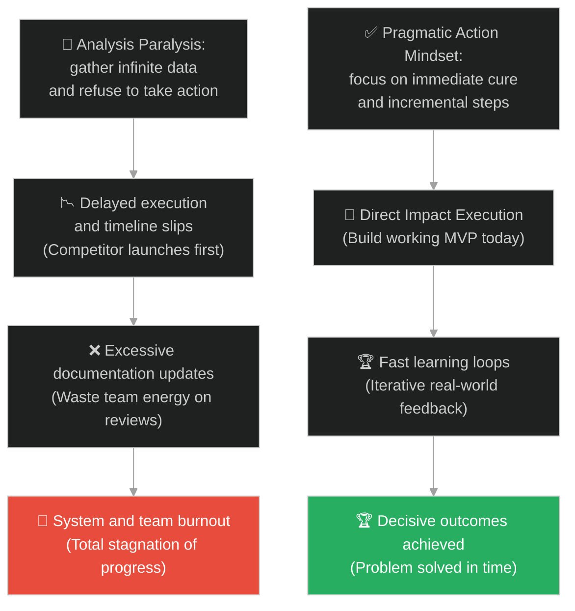
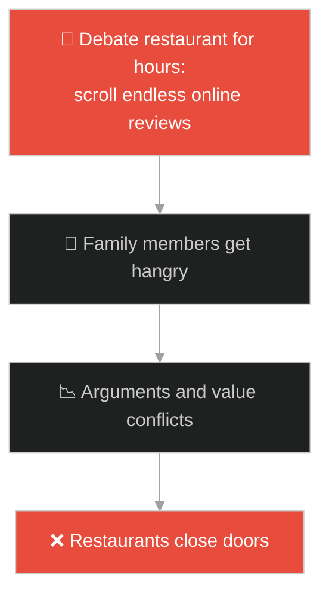
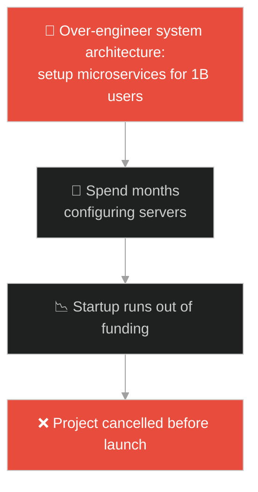
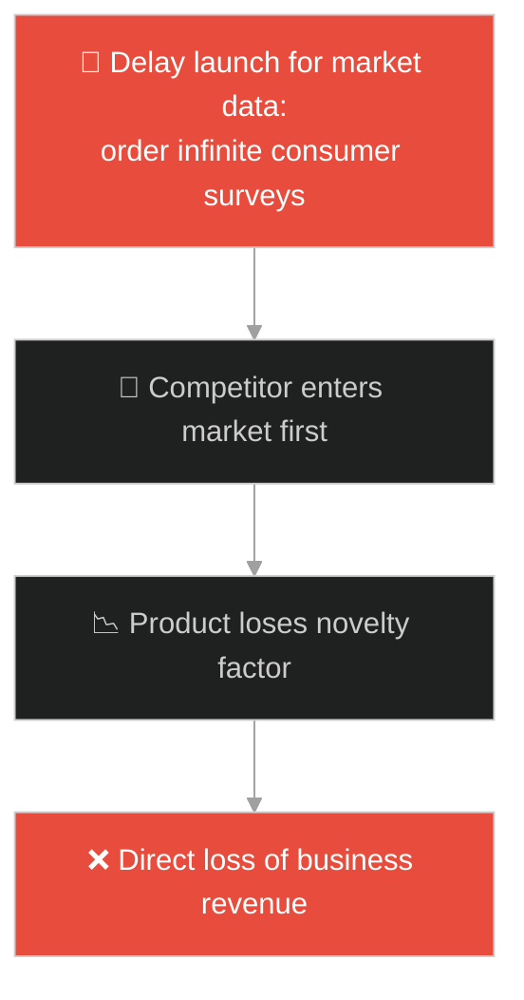
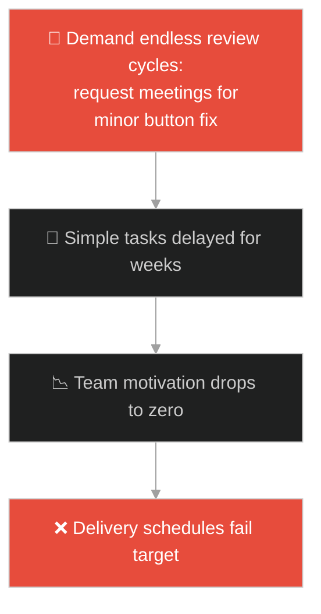
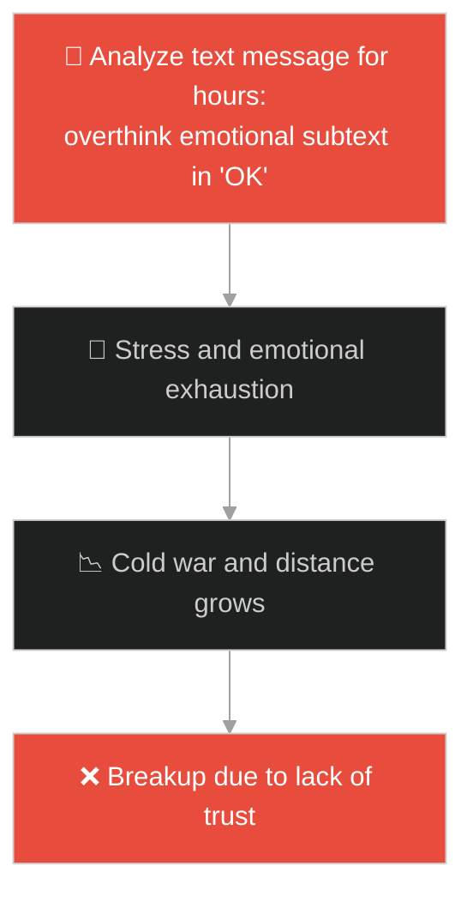
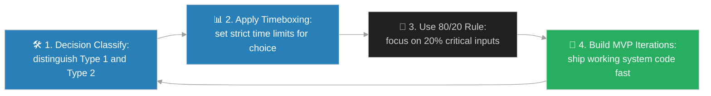

# Pragmatic Action & Analysis Paralysis (សកម្មភាពជាក់ស្តែង និងអន្ទាក់នៃការគិតច្រើនហួសហេតុ)៖ បុរសត្រូវព្រួញពុល (Pragmatism vs Analysis Paralysis & The Poisoned Arrow)

**Author:** ichamrong  
**Date:** 2026-05-28  
**Tags:** #buddhism #pragmatism #analysis-paralysis #mental-models #life-lessons #parable  
**Category:** Concepts / Parables  
**Read Time:** ~15 min  

---

## 📌 មាតិកា (Table of Contents)
- [អន្ទាក់ផ្លូវចិត្ត (The Trap)](#0)
- [១. រឿងព្រេងព្រះពុទ្ធសាសនា៖ បុរសត្រូវព្រួញពុល និងសំណួរឥតប្រយោជន៍ (The Legend of the Poisoned Arrow and Unanswered Questions)](#1)
  - [យន្តការសង្គ្រោះជីវិតជាបន្ទាន់ និងភាពឥតប្រយោជន៍នៃព័ត៌មានមិនចាំបាច់ (Emergency Treatment vs Secondary Metadata Inquiry)](#1-1)
- [២. បញ្ហា៖ វិបត្តិគិតច្រើនពេកមិនបានធ្វើ និងការបាត់បង់ឱកាសជាក់ស្តែង (The Issue: Over-analysis Paralysis and Failure to Take Timely Action)](#2)
- [៣. ឧទាហមណ៍ជាក់ស្តែងក្នុងពិភពពិត (Real World Examples)](#3)
  - [ឧទាហរណ៍ទី ១ — កម្រិតស្រាល (គ្រួសារ)៖ ការឈ្លោះគ្នាជ្រើសរើសហាងអាហារសម្រាប់ញ៉ាំបាយល្ងាច (Wasting Hours Selecting a Dinner Restaurant)](#3-1)
  - [ឧទាហរណ៍ទី ២ — កម្រិតមធ្យម (បច្ចេកទេស)៖ ការរចនាស្ថាបត្យកម្មប្រព័ន្ធស្មុគស្មាញហួសពីតម្រូវការ (Over-engineering DB Schema for Scaling)](#3-2)
  - [ឧទាហរណ៍ទី ៣ — កម្រិតមធ្យម (ធុរកិច្ច)៖ ការពន្យារពេលបញ្ចេញផលិតផលដើម្បីស្រាវជ្រាវទីផ្សារឥតឈប់ (Delaying Product Launch for Infinite Market Data)](#3-3)
  - [ឧទាហរណ៍ទី ៤ — កម្រិតមធ្យម (សង្គម/គ្រប់គ្រង)៖ ដំណើរការត្រួតពិនិត្យឯកសារច្រើនតង់មុនអនុម័តការងារតូចតាច (Manager Requesting Endless Reviews for Safe Changes)](#3-4)
  - [ឧទាហរណ៍ទី ៥ — កម្រិតធ្ងន់ (ទំនាក់ទំនង)៖ ការវិភាគសារ និងការទស្សន៍ទាយអារម្មណ៍ជំនួសឱ្យការសួរត្រង់ៗ (Over-analyzing Partner Messages Instead of Calling)](#3-5)
- [៤. ដំណោះស្រាយទូទៅ៖ ការអនុវត្ត Pragmatic Action ក្នុងប្រព័ន្ធ និងជីវិត (The General Solution: Decisiveness Frameworks and Type 1 vs Type 2 Decisions)](#4)
- [សេចក្តីសន្និដ្ឋាន (Conclusion)](#5)
- [ឯកសារយោង (References)](#6)
- [Related Posts](#7)

---

<a id="0"></a>
## អន្ទាក់ផ្លូវចិត្ត (The Trap)

តើអ្នកធ្លាប់ជួបបញ្ហាដែលត្រូវធ្វើការសម្រេចចិត្តលើកិច្ចការងារណាមួយ ហើយអ្នកបានចំណាយពេលរាប់សប្តាហ៍ស្រាវជ្រាវ និងវិភាគព័ត៌មានលម្អិតឥតឈប់ឈរ រហូតដល់បាត់បង់ឱកាសក្នុងការចាត់វិធានការដោះស្រាយបញ្ហាពិតប្រាកដដែរឬទេ?

នៅក្នុងការដោះស្រាយបញ្ហានិងការងារ៖
* **យើងងាយនឹងធ្លាក់ក្នុងអន្ទាក់** នៃការគិតថា "ការប្រមូលព័ត៌មានកាន់តែច្រើន នាំឱ្យការសម្រេចចិត្តកាន់តែល្អឥតខ្ចោះ" ដែលនាំឱ្យយើងជាប់គាំងក្នុងការគិត (Overthinking) និងមិនហ៊ានបោះជំហានធ្វើសកម្មភាពជាក់ស្តែង។
* **យើងមើលរំលង** ភាពបន្ទាន់នៃស្ថានភាព និងការពិតដែលថា "ការសម្រេចចិត្តមិនល្អឥតខ្ចោះ តែធ្វើឡើងទាន់ពេលវេលា ល្អជាងការសម្រេចចិត្តដ៏ល្អឥតខ្ចោះ តែហួសពេល"។

ការព្យាយាមស្វែងរកភាពល្អឥតខ្ចោះនៃព័ត៌មានមុនពេលធ្វើសកម្មភាព ហៅថា **អន្ទាក់វិភាគរហូតដល់លែងបានធ្វើ (Analysis Paralysis Trap)**។

ដើម្បីយល់ដឹងពីរបៀបធ្វើសកម្មភាពប្រកបដោយប្រសិទ្ធភាព នេះជាផែនទីបង្ហាញផ្លូវ៖
1. **រឿងព្រេងនិទាន (The Legend)** — រឿងរ៉ាវរបស់បុរសត្រូវព្រួញពុលដែលទាមទារចង់ដឹងពីប្រភពព្រួញមុនពេលព្រមឱ្យគ្រូពេទ្យដកវាចេញ។
2. **បញ្ហា (The Issue)** — ការវិភាគចិត្តវិទ្យានៃការគិតច្រើនហួសហេតុ, ផលប៉ះពាល់លើការងារបច្ចេកវិទ្យា និងការបាត់បង់ផលិតភាព។
3. **ឧទាហមណ៍ជាក់ស្តែងក្នុងពិភពពិត (Real World Examples)** — ពិនិត្យមើលបញ្ហានេះក្នុងកម្រិតគ្រួសារ បច្ចេកវិទ្យា ធុរកិច្ច ការគ្រប់គ្រង និងទំនាក់ទំនង។
4. **ដំណោះស្រាយទូទៅ (The General Solution)** — ការអនុវត្តយុទ្ធសាស្ត្រ Timeboxing, គោលការណ៍ 80/20 និងការបែងចែកជម្រើសសម្រេចចិត្ត (Type 1 vs Type 2 Decisions)។



---

<a id="1"></a>
## ១. រឿងព្រេងព្រះពុទ្ធសាសនា៖ បុរសត្រូវព្រួញពុល និងសំណួរឥតប្រយោជន៍ (The Legend of the Poisoned Arrow and Unanswered Questions)

កាលពីសម័យពុទ្ធកាល មានបុរសម្នាក់ត្រូវសត្រូវលបបាញ់មួយព្រួញ ដែលប្រឡាក់ទៅដោយថ្នាំពុលយ៉ាងសាហាវខ្លាំង។ សាច់ញាតិ និងមិត្តភក្តិរបស់គាត់បានប្រញាប់ប្រញាល់សែងគាត់ទៅជួបគ្រូពេទ្យវះកាត់ដ៏ពូកែម្នាក់។

ដំបូងឡើយ៖
* នៅពេលគ្រូពេទ្យរៀបនឹងដកព្រួញចេញ បុរសរងគ្រោះស្រាប់តែស្រែកឃាត់យ៉ាងខ្លាំងថា៖ *"ឈប់សិន! ខ្ញុំមិនទាន់អនុញ្ញាតឱ្យអ្នកដកព្រួញនេះចេញទេ រហូតទាល់តែខ្ញុំដឹងចម្លើយពីសំណួរមួយចំនួន!"*
* គាត់ទាមទារចង់ដឹងថា៖
  * តើនរណាជាអ្នកបាញ់គាត់? តើគេស្ថិតក្នុងវណ្ណៈក្សត្រ ព្រាហ្មណ៍ វេស្សៈ ឬសូទ្រៈ?
  * តើគេមានឈ្មោះអ្វី? មានស្រុកកំណើតនៅឯណា? រាងខ្ពស់ ទាប ឬធាត់ ស្គម?
  * តើធ្នូនោះធ្វើពីឈើអ្វី? ខ្សែធ្នូធ្វើពីសរសៃអ្វី? ស្លាបព្រួញធ្វើពីរោមសត្វស្លាបប្រភេទណា?

---

<a id="1-1"></a>
### យន្តការសង្គ្រោះជីវិតជាបន្ទាន់ និងភាពឥតប្រយោជន៍នៃព័ត៌មានមិនចាំបាច់ (Emergency Treatment vs Secondary Metadata Inquiry)

គ្រូពេទ្យបានដកដង្ហើមធំ ហើយពន្យល់គាត់ថា៖
* *"សំណួរទាំងនេះគ្មានប្រយោជន៍សម្រាប់ដោះស្រាយវិបត្តិសង្គ្រោះបន្ទាន់ចំពោះមុខឡើយ។"*
* *"ប្រសិនបើអ្នកនៅតែរង់ចាំចម្លើយសម្រាប់សំនួរទាំងនេះ ជាតិពុលនឹងជ្រាបចូលទៅដល់បេះដូងរបស់អ្នក ហើយអ្នកប្រាកដជាស្លាប់បាត់បង់ជីវិតមុននឹងរកចម្លើយឃើញជាមិនខាន។"*
* អាទិភាពស្លាប់រស់តែមួយគត់គឺ៖ **ត្រូវដកព្រួញចេញ និងបន្សាបជាតិពុលភ្លាមៗ**។
* ព្រះពុទ្ធសម្មាសម្ពុទ្ធទ្រង់លើកយករឿងនេះ ដើម្បីដាស់តឿនមនុស្សលោកដែលចូលចិត្តចំណាយពេលពេញមួយជីវិតជជែកពិភាក្សាអំពីសំណួរទស្សនវិជ្ជាអរូបីដែលគ្មានទីបញ្ចប់ (ដូចជា ពិភពលោកកើតឡើងដោយរបៀបណា? តើជីវិតក្រោយសេចក្តីស្លាប់មានអ្វីខ្លះ?) ជាជាងការស្វែងយល់ពីរបៀបរំលត់ទុក្ខ និងធ្វើសកម្មភាពល្អៗក្នុងជីវិតបច្ចុប្បន្ន។

---

<a id="2"></a>
## ២. បញ្ហា៖ វិបត្តិគិតច្រើនពេកមិនបានធ្វើ និងការបាត់បង់ឱកាសជាក់ស្តែង (The Issue: Over-analysis Paralysis and Failure to Take Timely Action)

នៅក្នុងការអភិវឌ្ឍកម្មវិធីបច្ចេកវិទ្យា ភាពជំពាក់ជំពិននេះកើតឡើងនៅពេលក្រុមការងារចំណាយពេលរៀបចំផែនការ (Planning Phase) យូរពេក៖

```java
// កូដដែលព្យាយាមដោះស្រាយករណី hypotheticals ទាំងអស់
public void processUserData(User user) {
    if (user == null) throw new IllegalArgumentException();
    // គិតច្រើនពេកលើករណី hypothetical scale 1 billion users 
    // នាំឱ្យសរសេរកូដស្មុគស្មាញហួសហេតុ (Over-engineering)
    // ធ្វើឱ្យយឺតយ៉ាវក្នុងការបញ្ចេញកម្មវិធី MVP
}
```

* **ការខាតបង់ពេលវេលាបញ្ចេញផលិតផល (Time to Market Loss)៖** នៅពេលក្រុមហ៊ុនចំណាយពេលរាប់ខែដើម្បីប្រមូលព័ត៌មាន វិភាគគូប្រកួតប្រជែង និងរចនាមុខងារឱ្យល្អឥតខ្ចោះ គូប្រជែងអាចបញ្ចេញផលិតផលសាមញ្ញមួយ (MVP) ចូលទីផ្សារមុន និងចាប់យកអតិថិជនបានទាំងអស់។
* **ផលិតភាពក្រុមការងារធ្លាក់ចុះ (Team Stagnation)៖** បុគ្គលិកចំណាយពេលប្រជុំពិភាក្សាដេញដោលគ្នារាល់ថ្ងៃអំពី hypothetical cases ជំនួសឱ្យការសរសេរកូដ និងសាកល្បងជាមួយអ្នកប្រើប្រាស់ពិតប្រាកដ ដើម្បីទទួលបាន feedback យកមកកែលម្អ។

**Pragmatic Action Mindset** ដោះស្រាយបញ្ហានេះដោយបង្ខំឱ្យក្រុមការងារផ្តោតលើ "ជំហានបន្ទាប់ដែលជិតបំផុត និងមានឥទ្ធិពលបំផុត"។ ពួកគេបង្កើតសកម្មភាពរហ័ស ធ្វើការសាកល្បង និងកែលម្អរាល់កំហុសជាបន្តបន្ទាប់ (Iterative Development)។

---

<a id="3"></a>
## ៣. ឧទាហមណ៍ជាក់ស្តែងក្នុងពិភពពិត

---

<a id="3-1"></a>
### ឧទាហមណ៍ទី ១ — កម្រិតស្រាល (គ្រួសារ)៖ ការឈ្លោះគ្នាជ្រើសរើសហាងអាហារសម្រាប់ញ៉ាំបាយល្ងាច (Wasting Hours Selecting a Dinner Restaurant)

នៅក្នុងគ្រួសារមួយ សមាជិកទាំង ៤ នាក់ឃ្លានបាយយ៉ាងខ្លាំង។ ប៉ុន្តែជំនួសឱ្យការជ្រើសរើសហាងណាមួយដើម្បីទៅញ៉ាំបាយភ្លាមៗ ពួកគេបានចំណាយពេល ២ ម៉ោងជជែកដេញដោលគ្នានិងឆែកមើល review ហាងរាប់សិប៖ ម្ខាងចង់ញ៉ាំអាហារជប៉ុន ម្ខាងចង់ញ៉ាំអាហារថៃ។ លទ្ធផល៖ ពួកគេឃ្លានឡើងចុកក្រពះ និងឈ្លោះប្រកែកគ្នា រហូតដល់ហាងទាំងអស់ត្រូវបិទទ្វារបាត់អស់។ ពួកគេត្រូវបង្ខំចិត្តញ៉ាំមីកញ្ចប់នៅផ្ទះទាំងអារម្មណ៍មួរម៉ៅ។



---

<a id="3-2"></a>
### ឧទាហមណ៍ទី ២ — កម្រិតមធ្យម (បច្ចេកទេស)៖ ការរចនាស្ថាបត្យកម្មប្រព័ន្ធស្មុគស្មាញហួសពីតម្រូវការ (Over-engineering DB Schema for Scaling)

នៅក្នុងការចាប់ផ្តើមគម្រោង Startup (MVP Phase) វិស្វករម្នាក់ចង់រចនាប្រព័ន្ធ Database ឱ្យមានសមត្ថភាពអាចផ្ទុកទិន្នន័យបាន ១ ប៊ីលាននាក់ និងអាចចែកចាយទិន្នន័យទូទាំងពិភពលោក (Multi-region replication) តាំងពីថ្ងៃដំបូង។ គាត់ចំណាយពេល ៣ ខែបង្កើតប្រព័ន្ធ Kubernetes ស្មុគស្មាញទាំងដែលគ្មានអតិថិជនសូម្បីតែម្នាក់។ គម្រោងត្រូវខកខានការបង្ហាញខ្លួន និងអស់ថវិការត់ការ។



---

<a id="3-3"></a>
### ឧទាហមណ៍ទី ៣ — កម្រិតមធ្យម (ធុរកិច្ច)៖ ការពន្យារពេលបញ្ចេញផលិតផលដើម្បីស្រាវជ្រាវទីផ្សារឥតឈប់ (Delaying Product Launch for Infinite Market Data)

ក្រុមហ៊ុនផលិតភេសជ្ជៈថ្មីមួយចង់ដាក់លក់ផលិតផលរបស់ខ្លួន។ នាយកផ្នែកទីផ្សារបារម្ភពីហានិភ័យខ្លាំងពេក ក៏សម្រេចចិត្តពន្យារពេល launch ដើម្បីជួលភ្នាក់ងារមកស្រាវជ្រាវទីផ្សារម្តងហើយម្តងទៀត (Infinite surveys) ក្នុងរយៈពេល ១ ឆ្នាំ។ ក្នុងកំឡុងពេលនោះ ក្រុមហ៊ុនគូប្រជែងបានបញ្ចេញភេសជ្ជៈស្រដៀងគ្នានោះលក់លើទីផ្សារ និងទទួលបានការគាំទ្រយ៉ាងខ្លាំង ធ្វើឱ្យក្រុមហ៊ុនដំបូងបាត់បង់ឱកាសអាជីវកម្មទាំងស្រុង។



---

<a id="3-4"></a>
### ឧទាហមណ៍ទី ៤ — កម្រិតមធ្យម (សង្គម/គ្រប់គ្រង)៖ ដំណើរការត្រួតពិនិត្យឯកសារច្រើនតង់មុនអនុម័តការងារតូចតាច (Manager Requesting Endless Reviews for Safe Changes)

នៅក្នុងការគ្រប់គ្រងការងាររដ្ឋបាល ប្រសិនបើមានការកែលម្អចំណុចតូចតាចមួយនៅលើគេហទំព័រ (ដូចជាការប្តូរពណ៌ប៊ូតុង) ប៉ុន្តែអ្នកគ្រប់គ្រងតម្រូវឱ្យបុគ្គលិកសរសេររបាយការណ៍ផលប៉ះពាល់ និងឆ្លងកាត់ការពិនិត្យពីគណៈកម្មការ ៥ នាក់ (Endless review cycles)។ ការងារសាមញ្ញដែលគួរចំណាយពេល ១០ នាទី បែរជាអូសបន្លាយដល់ ៣ សប្តាហ៍ ធ្វើឱ្យប្រព័ន្ធទាំងមូលដំណើរការយឺតយ៉ាវ និងបុគ្គលិកបាក់ទឹកចិត្ត។



---

<a id="3-5"></a>
### ឧទាហមណ៍ទី ៥ — កម្រិតធ្ងន់ (ទំនាក់ទំនង)៖ ការវិភាគសារ និងការទស្សន៍ទាយអារម្មណ៍ជំនួសឱ្យការសួរត្រង់ៗ (Over-analyzing Partner Messages Instead of Calling)

នៅក្នុងទំនាក់ទំនងស្នេហា ដៃគូម្នាក់ផ្ញើសារខ្លីមួយមកថា `"OK"`។ ដៃគូម្នាក់ទៀតបានចាប់ផ្តើមគិតបារម្ភ (Overthinking)៖ *"ហេតុអ្វីគេផ្ញើមកខ្លីម៉្លេះ? តើគេខឹងនឹងខ្ញុំរឿងអី? តើកាលពីម្សិលមិញខ្ញុំនិយាយខុសកន្លែងណា?"* គាត់ចំណាយពេលពេញមួយថ្ងៃវិភាគអត្ថន័យ និងពិភាក្សាជាមួយមិត្តភក្តិ ជំនួសឱ្យការចុចទូរស័ព្ទសួរដៃគូត្រង់ៗតែ ២ នាទី។ ភាពតានតឹងផ្លូវចិត្តឥតប្រយោជន៍នេះបង្កជម្លោះធ្ងន់ធ្ងរនាពេលក្រោយ។



---

<a id="4"></a>
## ៤. ដំណោះស្រាយទូទៅ៖ ការអនុវត្ត Pragmatic Action ក្នុងប្រព័ន្ធ និងជីវិត (The General Solution: Decisiveness Frameworks and Type 1 vs Type 2 Decisions)

ដើម្បីលុបបំបាត់អន្ទាក់ Analysis Paralysis និងសម្រេចកិច្ចការងារឱ្យបានលឿន វិស្វករ និងអ្នកគ្រប់គ្រងត្រូវអនុវត្តគោលការណ៍ខាងក្រោម៖



ជំហាននៃការអនុវត្ត៖
1. **បែងចែកប្រភេទនៃការសម្រេចចិត្ត (Type 1 vs Type 2 Decisions)៖**
   * **Type 1 (Irreversible):** ការសម្រេចចិត្តដែលពិបាកកែប្រែឡើងវិញ (ដូចជា ការប្តូរស្ថាបត្យកម្ម Cloud ធំ)។ ត្រូវចំណាយពេលវិភាគឱ្យបានហ្មត់ចត់។
   * **Type 2 (Reversible):** ការសម្រេចចិត្តដែលងាយកែប្រែឡើងវិញបានភ្លាមៗ (ដូចជា ការរចនា UI, ការសរសេរកូដ feature តូចៗ)។ ត្រូវសម្រេចចិត្តឱ្យបានលឿន O(1) ជៀសវាងការខាតពេល។
2. **កំណត់ពេលវេលាសម្រេចចិត្តតឹងរ៉ឹង (Apply Timeboxing)៖** កំណត់រយៈពេលអតិបរមាសម្រាប់ធ្វើការសម្រេចចិត្ត (ឧទាហរណ៍ មិនឱ្យលើសពី ៣០ នាទីក្នុងការពិភាក្សារឿងតូចតាច)។ នៅពេលអស់ម៉ោង ត្រូវតែសម្រេចចិត្តជ្រើសរើសជម្រើសណាមួយភ្លាមៗ។
3. **អនុវត្តច្បាប់ Pareto 80/20 Rule៖** កុំព្យាយាមប្រមូលព័ត៌មាន ១០០% ព្រោះវាត្រូវការធនធានច្រើនពេក។ ត្រូវស្វែងរកព័ត៌មានត្រឹមតែ ២០% ដែលមានឥទ្ធិពលបំផុត ដើម្បីបង្កើតជាចម្លើយសម្រេចចិត្តបាន ៨០% យ៉ាងមានប្រសិទ្ធភាព។
4. **កសាង និងបញ្ចេញកម្មវិធីលឿន (Build & Ship MVP)៖** បង្កើនល្បឿននៃការរៀនសូត្រពីពិភពពិត។ ត្រូវបញ្ចេញកូដដែលដើរការបានជាមុន រួចយក Feedback ពីការប្រើប្រាស់ជាក់ស្តែងមកកែសម្រួលបន្ថែមជាបន្តបន្ទាប់ (Continuous Deployment)។

---

## 🐇 ធ្លាក់ចូលក្នុងរន្ធទន្សាយ (Enter the Rabbit Hole)

ដើម្បីស្វែងយល់ពីរបៀបដែលបុគ្គលិក ឬអ្នកសង្កេតការណ៍ អាចជួបប្រទះការវាយតម្លៃលទ្ធផលខុសគ្នាស្រឡះអំពីរបស់តែមួយ ដោយសារតែពួកគេមើលឃើញព័ត៌មានតែមួយផ្នែកខុសគ្នា ផ្អែកលើទស្សនវិស័យផ្ទាល់ខ្លួន (Contextual Blindness & Single-Perspective Bias) សូមបន្តដំណើរទៅកាន់៖

* 🚀 **[ចាប់ផ្តើមដំណើររុករក (Start the Journey) ➔ The Parable of the Blind Men and the Elephant](./110-buddha-and-the-blind-men.md)**

---

<a id="5"></a>
## សេចក្តីសន្និដ្ឋាន (Conclusion)

> **«ការសម្រេចចិត្តដែលមិនល្អឥតខ្ចោះ តែធ្វើឡើងទាន់ពេលវេលា ល្អជាងការសម្រេចចិត្តដ៏ល្អឥតខ្ចោះ តែហួសពេល»**

ការលុបបំបាត់អន្ទាក់ Analysis Paralysis និងការផ្តោតលើសកម្មភាពជាក់ស្តែង (Pragmatic Action) ជួយឱ្យយើងអាចដោះស្រាយបញ្ហាជីវិត និងវិស្វកម្មប្រព័ន្ធបានទាន់ពេលវេលា ការពារការកកស្ទះការងារ និងសម្រេចបាននូវផលិតភាពខ្ពស់បំផុត។

---

<a id="6"></a>
## ឯកសារយោង (References)

* **Cula-Malunkyovada Sutta** — *Majjhima Nikaya 63*, Buddhist Pali Canon. The classic discourse on speculative thoughts and pragmatism.
* **Schwartz, B.** — *The Paradox of Choice: Why More Is Less* (2004). How choice abundance leads to analysis paralysis and dissatisfaction.

---

<a id="7"></a>
## Related Posts

* [[DSA: Dynamic Programming](../dsa/03-algorithms.md#4-dynamic-programming--the-memoization-masterclass)] — របៀបយល់ដឹងពីការរក្សាទុកចម្លើយចាស់ដើម្បីបង្កើនល្បឿន មុននឹងបោះជំហានធ្វើសកម្មភាពជាក់ស្តែង។
* [[Binary Search Algorithm & The Dictionary of Secrets](./105-the-dictionary-of-secrets.md)] — ការយល់ដឹងពីរបៀបបែងចែកកិច្ចការស្វែងរកជាពីរ ដើម្បីសម្រេចលទ្ធផលបានយ៉ាងឆាប់រហ័ស។
