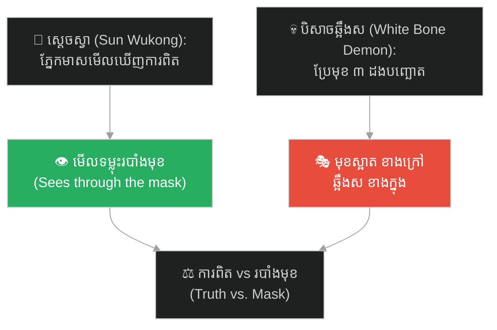
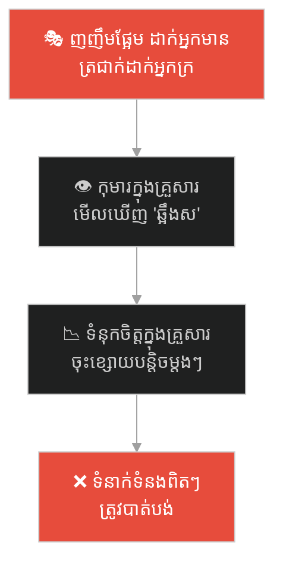
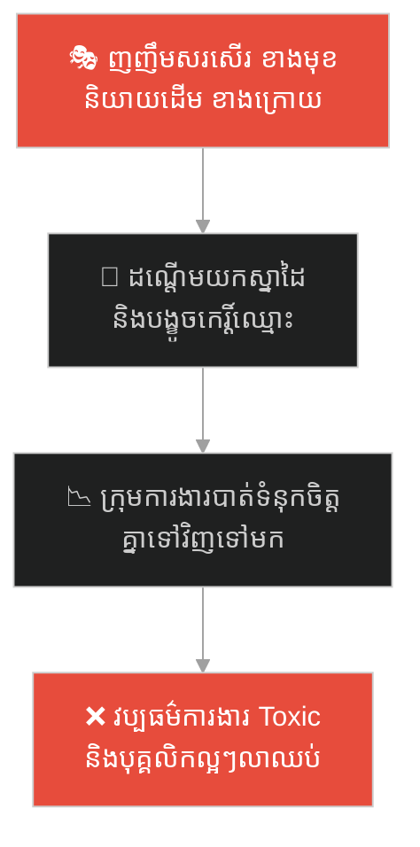
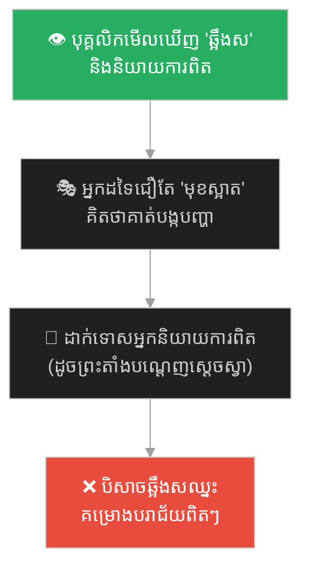
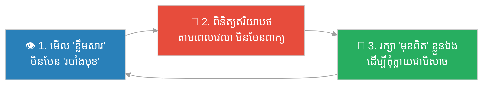

# The Seventy-Two Faces (មុខទាំង៧២)៖ បិសាចឆ្អឹងស និងភ្នែកមាសរបស់ស្តេចស្វា (The White Bone Demon & the Monkey King's Fiery Eyes)

**Author:** ichamrong  
**Date:** 2026-06-04  
**Tags:** #sun-wukong #journey-to-the-west #masks #self-monitoring #goffman #persona #authenticity #parable  
**Category:** Concepts / Parables  
**Read Time:** ~12 min  

---

## 📌 មាតិកា (Table of Contents)
- [អ្នកនិពន្ធដែលយល់ច្បាស់ពីសង្គម (The Author Who Understood Society)](#0)
- [១. រឿងព្រេង៖ បិសាចឆ្អឹងស និងការប្រែក្រឡា ៣ ដង (The Legend: The White Bone Demon's Three Disguises)](#1)
- [២. បញ្ហា៖ មុខទាំង៧២ និងភ្នែកដែលមើលឃើញការពិត (The Issue: 72 Faces & the Eye That Sees Truth)](#2)
- [៣. ឧទាហរណ៍ជាក់ស្តែងក្នុងពិភពពិត (Real World Examples)](#3)
  - [ឧទាហរណ៍ទី ១ — គ្រួសារ៖ មនុស្សដែលផ្លាស់មុខតាមអ្នកមាន (The Two-Faced Relative)](#3-1)
  - [ឧទាហរណ៍ទី ២ — ការងារ៖ មិត្តរួមការងារដែលញញឹមខាងមុខ (The Smiling Colleague)](#3-2)
  - [ឧទាហរណ៍ទី ៣ — អ្នកនិយាយការពិត តែត្រូវគេស្តីបន្ទោស (The Truth-Teller Who Gets Punished)](#3-3)
- [៤. ដំណោះស្រាយ៖ ការចិញ្ចឹមភ្នែកមាសរបស់ខ្លួនឯង (The Solution: Growing Your Own Fiery Eyes)](#4)
- [សេចក្តីសន្និដ្ឋាន (Conclusion)](#5)
- [ឯកសារយោង (References)](#6)
- [Related Posts](#7)

---

## អ្នកនិពន្ធដែលយល់ច្បាស់ពីសង្គម (The Author Who Understood Society)

រឿង *ដំណើរទៅទិសខាងលិច* (西游记) មិនមែនគ្រាន់តែជារឿងព្រេងវេទមន្តទេ។ អ្នកនិពន្ធ **វូ ឆេងអេន (Wu Cheng'en)** នៅសតវត្សរ៍ទី ១៦ បានសរសេរវាជា **ការសើចចំអកដល់សង្គម** (social satire) — ដោយលាក់ការរិះគន់ប្រព័ន្ធការិយាធិបតេយ្យ និងធម្មជាតិមនុស្ស នៅពីក្រោយរឿងស្វា បិសាច និងព្រះ។

*Journey to the West* is not merely a magical legend. Its 16th-century author, **Wu Cheng'en**, wrote it as a **biting satire of society** — hiding sharp critiques of bureaucracy and human nature behind the story of a monkey, demons, and gods. He understood people deeply. Every demon the pilgrims meet is really a mirror of a human flaw.

> នេះជាមូលហេតុដែលរឿងនេះនៅតែពិតរហូតមកដល់សព្វថ្ងៃ៖ វាមិននិយាយពីបិសាចទេ — វានិយាយពី **យើង**។
>
> This is why the story still rings true today: it is not about demons — it is about **us**.

---

## ១. រឿងព្រេង៖ បិសាចឆ្អឹងស និងការប្រែក្រឡា ៣ ដង (The Legend: The White Bone Demon's Three Disguises)

ក្នុងដំណើរធ្វើធម្មយាត្រា ព្រះតាំងសាំងហ្សាង (Tang Sanzang) និងសិស្សរបស់លោករួមមានស្តេចស្វា **ស៊ុនអ៊ូឃុង (Sun Wukong)** បានជួបនឹងបិសាចមួយឈ្មោះ **បៃហ្គូជីង (White Bone Demon / 白骨精)** ដែលជាខ្មោចឆ្អឹងសចង់ស៊ីសាច់ព្រះតាំងដើម្បីបានអមតភាព។

During the pilgrimage, the monk Tang Sanzang and his disciples — including the Monkey King **Sun Wukong** — meet a demon called the **White Bone Demon (白骨精)**, a skeleton-spirit who wants to eat the monk's flesh to gain immortality.

ដោយដឹងថាមិនអាចវាយឈ្នះស្តេចស្វាដោយកម្លាំង បិសាចនេះក៏ប្រើ **ការប្រែក្រឡា** ៣ ដង៖
Knowing she cannot beat the Monkey King by force, the demon uses **shape-shifting** three times:

1. **🧕 ស្ត្រីវ័យក្មេងស្រស់ស្អាត** ដែលនាំម្ហូបមកជូន — *a beautiful young woman bringing food.*
2. **👵 ស្ត្រីចំណាស់** ដែលធ្វើជាម្តាយតាមរកកូនស្រី — *an old woman pretending to search for her daughter.*
3. **👴 បុរសចំណាស់** ដែលធ្វើជាឪពុកតាមរកគ្រួសារ — *an old man pretending to look for his family.*

មុខទាំង៣សុទ្ធតែ **ស្អាត ស្លូត និងគួរឱ្យអាណិត** នៅខាងក្រៅ។ All three faces are *kind, gentle, and pitiful* on the outside.

ប៉ុន្តែ ស្តេចស្វាមាន **ភ្នែកមាសភ្លើង (Fiery Golden Eyes / 火眼金睛)** — ភ្នែកដែលមើលឃើញ **ឆ្អឹងស** ដែលលាក់នៅពីក្រោយរបាំងមុខ។ គាត់មើលឃើញការពិតភ្លាមៗ ហើយវាយបិសាចនោះ។

But the Monkey King has **Fiery Golden Eyes (火眼金睛)** — eyes that see the **white bones** hidden behind the mask. He sees the truth instantly and strikes the demon down.

**តែនេះជាផ្នែកដ៏ឈឺចាប់៖** ព្រះតាំង និងសិស្សដទៃទៀតមើលឃើញតែ «មុខស្អាត» ខាងក្រៅ។ ពួកគេគិតថាស្តេចស្វាបានសម្លាប់មនុស្សស្លូតត្រង់ ៣ នាក់! ដូច្នេះព្រះតាំងក៏ **ដាក់ទោសស្តេចស្វា** ដោយសូត្រមន្តធ្វើឱ្យឈឺក្បាល ហើយ **បណ្តេញគាត់ចេញ**។

**But here is the painful part:** the monk and the other disciples saw only the *beautiful mask* on the outside. They thought the Monkey King had murdered three innocent people! So the monk **punished Sun Wukong** — chanting the spell that tightens the band around his head in agony — and **banished him**.

> **អ្នកដែលមើលឃើញការពិត ត្រូវបានដាក់ទោស។ អ្នកដែលជឿរបាំងមុខ ត្រូវបានបញ្ឆោត។**
>
> **The one who saw the truth was punished. The ones who believed the mask were deceived.**

---

## ២. បញ្ហា៖ មុខទាំង៧២ និងភ្នែកដែលមើលឃើញការពិត (The Issue: 72 Faces & the Eye That Sees Truth)

រឿងនេះបង្ហាញ **ផ្នែកទាំងពីរ** នៃ «ការប្រែក្រឡា» (shape-shifting) ដែលអ្នកនិពន្ធយល់ច្បាស់៖

This story shows **both sides** of shape-shifting, which the author understood perfectly:

| តួអង្គ (Character) | ការប្រែខ្លួន (Their shifting) | អត្ថន័យសង្គម (Social meaning) |
|---|---|---|
| 🐒 **ស្តេចស្វា** | ប្រែ ៧២ មុខ តែ **ចិត្តតែមួយ** | ការសម្របខ្លួនដែលមានសុខភាព — *healthy adaptation; the monkey never forgot he was a monkey* |
| 💀 **បិសាចឆ្អឹងស** | ប្រែ ៣ មុខ ដើម្បី **បញ្ឆោត** | ការប្រែខ្លួនជាអន្ទាក់ — *shape-shifting as deception; a beautiful mask over hollow bones* |
| 👁️ **ភ្នែកមាសភ្លើង** | មិនមែនការប្រែ តែ **ការមើលឃើញ** | ការមើលទម្លុះរបាំងមុខ — *the rare ability to see substance beneath style* |

នេះភ្ជាប់ផ្ទាល់ទៅនឹងទ្រឹស្តីចិត្តវិទ្យា (this connects directly to psychology):

- **Goffman** — មនុស្សគ្រប់គ្នាសម្ដែង «ឆាកខាងមុខ» (front stage)។ បិសាចឆ្អឹងសគឺជាការសម្ដែងដ៏ឥតខ្ចោះ — តែ **គ្មានខ្លឹមសារ** ខាងក្នុង។ *Everyone performs a front stage; the demon was a perfect performance with no substance behind it.*
- **Snyder (Self-Monitoring)** — បិសាចជា «high self-monitor» ដ៏ខ្លាំង — ប្រែខ្លួនបានយ៉ាងលឿនតាមតម្រូវការ។ *The demon is an extreme high self-monitor — shifting form to whatever the moment requires.*
- **Winnicott (False Self)** — មុខស្អាតរបស់បិសាចគឺ «false self» ដ៏គ្រោះថ្នាក់ ដែលលាក់ «ឆ្អឹងស» ខាងក្នុង។ *The demon's pretty face is the dangerous false self, hiding the white bones within.*

**ភាពខុសគ្នាសំខាន់៖** ស្តេចស្វាប្រែ **របៀប** (style) ដោយចិត្តពិតនៅដដែល។ បិសាចប្រែ **ខ្លឹមសារ** (substance) ដើម្បីបោកប្រាស់។ នេះគឺជាខ្សែបន្ទាត់ដែលបំបែក «ការសម្របខ្លួន» ចេញពី «ការក្លែងបន្លំ»។

**The crucial difference:** the monkey changed his *style* while his true heart stayed the same. The demon changed her *substance* to deceive. This is the exact line that separates *adaptation* from *fraud*.

---

## ៣. ឧទាហរណ៍ជាក់ស្តែងក្នុងពិភពពិត (Real World Examples)

---

### ឧទាហរណ៍ទី ១ — គ្រួសារ៖ មនុស្សដែលផ្លាស់មុខតាមអ្នកមាន (The Two-Faced Relative)

សាច់ញាតិម្នាក់ញញឹមផ្អែមល្ហែម គួរសម និងចោមរោមតែអ្នកដែលមានលុយ ឬមានឋានៈក្នុងគ្រួសារ — តែបែរជាធ្វើព្រងើយកន្តើយដាក់អ្នកដែលក្រ ឬគ្មានអំណាច។ មុខស្អាតរបស់គាត់គឺជា **«បិសាចឆ្អឹងស»** តូចមួយក្នុងគ្រួសារ។

A relative is all sweet smiles and politeness around whoever has money or status in the family — yet turns cold to those who are poor or powerless. Their pretty face is a small **White Bone Demon** in the household.

---

### ឧទាហរណ៍ទី ២ — ការងារ៖ មិត្តរួមការងារដែលញញឹមខាងមុខ (The Smiling Colleague)

មិត្តរួមការងារម្នាក់យល់ស្របនឹងអ្នកគ្រប់ពេលនៅក្នុងកិច្ចប្រជុំ ញញឹម និងសរសើរអ្នកនៅចំពីមុខ — តែនៅក្រោយខ្នង គាត់និយាយដើម ដណ្តើមយកស្នាដៃការងាររបស់អ្នក និងនិយាយបង្ខូចកេរ្តិ៍ឈ្មោះអ្នកប្រាប់ប្រធាន។ មុខ «កិច្ចសហការ» គឺជារបាំង។ ឆ្អឹងសខាងក្នុងគឺ «ការប្រកួតប្រជែងលាក់កំបាំង»។

A colleague agrees with everyone in meetings, smiles, and praises you to your face — but behind your back they gossip, take credit for your work, and damage your name to the boss. The "team player" face is the mask. The white bones inside are hidden rivalry.

---

### ឧទាហរណ៍ទី ៣ — អ្នកនិយាយការពិត តែត្រូវគេស្តីបន្ទោស (The Truth-Teller Who Gets Punished)

នេះជាចំណុចដ៏ស៊ីជម្រៅបំផុតនៃរឿង។ បុគ្គលិកម្នាក់ (ដូចស្តេចស្វា) មើលឃើញគម្រោងមួយនឹងបរាជ័យ ឬដៃគូជំនួញម្នាក់ជា «បិសាចឆ្អឹងស» ហើយនិយាយការពិតចេញ។ ប៉ុន្តែ ដោយសារអ្នកដទៃមើលឃើញតែ «មុខស្អាត» ខាងក្រៅ ពួកគេបែរជា **ដាក់ទោសអ្នកនិយាយការពិត** — ហៅគាត់ថា «អវិជ្ជមាន» ឬ «បង្កបញ្ហា» ហើយ «បណ្តេញ» គាត់ចេញពីក្រុម។

This is the most insightful part of the story. An employee (like the Monkey King) sees a project heading for failure, or sees that a business partner is a White Bone Demon — and says the truth out loud. But because everyone else sees only the *pretty mask*, they instead **punish the truth-teller** — calling them "negative" or "a troublemaker," and pushing them out of the group.

នេះជាការព្រមានរបស់អ្នកនិពន្ធ៖ **សង្គមតែងតែដាក់ទោសអ្នកដែលមាន «ភ្នែកមាស» ព្រោះការពិតធ្វើឱ្យអ្នកដែលជឿរបាំងមុខមិនស្រួលចិត្ត។**

This is the author's warning: **society often punishes those with "fiery eyes," because the truth makes those who believe in masks uncomfortable.**

---

## ៤. ដំណោះស្រាយ៖ ការចិញ្ចឹមភ្នែកមាសរបស់ខ្លួនឯង (The Solution: Growing Your Own Fiery Eyes)

ស្តេចស្វាមិនបានកើតមកមានភ្នែកមាសភ្លើងទេ — គាត់ទទួលបានវាបន្ទាប់ពីត្រូវ **ដុតក្នុងភ្លើង ៤៩ ថ្ងៃ** ក្នុងឡរបស់ព្រះ។ ការមើលឃើញការពិតគឺ **ជំនាញដែលត្រូវលត់ដំ** តាមរយៈការឈឺចាប់ និងបទពិសោធន៍។

The Monkey King was not born with fiery eyes — he gained them after being **burned for 49 days** in a god's furnace. Seeing truth is a *skill forged through pain and experience*.

ជំហាននៃការអនុវត្ត (How to apply)៖

1. **មើលឥរិយាបថ មិនមែនពាក្យ (Watch behavior, not words)៖** របាំងមុខបង្ហាញតែខាងមុខ។ ការពិតលេចចេញតាមរយៈ **ទង្វើ ដែលធ្វើម្តងហើយម្តងទៀតតាមពេលវេលា**។ *Masks show only the surface. Truth reveals itself through repeated behavior over time.*
2. **កុំដាក់ទោសអ្នកនិយាយការពិត (Don't punish the truth-teller)៖** នៅពេលនរណាម្នាក់ប្រាប់អ្នកនូវការពិតដែលមិនពិរោះស្ដាប់ កុំក្លាយជាព្រះតាំងដែលបណ្តេញស្តេចស្វា — សួរថា «តើគាត់ឃើញឆ្អឹងសអ្វីដែលខ្ញុំមើលមិនឃើញ?» *When someone tells you an uncomfortable truth, don't be the monk who banishes the monkey — ask what bones they see that you can't.*
3. **រក្សាមុខពិតរបស់ខ្លួនឯង (Keep your own true face)៖** ប្រែ ៧២ មុខបាន — តែកុំក្លាយជាបិសាចឆ្អឹងស។ ចូរធ្វើដូចស្តេចស្វា ដែលមិនដែលភ្លេចថាខ្លួនជាស្វា។ *Wear 72 faces — but never become the White Bone Demon. Be the monkey, who never forgot he was a monkey.*

---

## សេចក្តីសន្និដ្ឋាន (Conclusion)

> **«បិសាចមាន ៣ មុខ ដើម្បីបោកប្រាស់។ ស្តេចស្វាមាន ៧២ មុខ តែចិត្តតែមួយ។ ភាពខុសគ្នាមិនមែននៅចំនួនមុខទេ — តែនៅថាមានចិត្តពិតនៅពីក្រោម ឬគ្មាន។»**
>
> **The demon had 3 faces to deceive. The monkey had 72 faces but one heart. The difference is not in the number of faces — but in whether there is a true self beneath them.**

វូ ឆេងអេន បានយល់ច្បាស់ពីសង្គមកាលពី ៥០០ ឆ្នាំមុន៖ ពិភពលោកពោរពេញដោយ «បិសាចឆ្អឹងស» ដែលមានមុខស្អាត ហើយ «ស្តេចស្វា» ដែលនិយាយការពិតតែងតែត្រូវគេយល់ច្រឡំ។ ភារកិច្ចរបស់យើងគឺ **ចិញ្ចឹមភ្នែកមាសរបស់ខ្លួនឯង** ដើម្បីមើលឃើញការពិត — ហើយ **រក្សាមុខពិតរបស់ខ្លួនឯង** ដើម្បីកុំក្លាយជាបិសាច។

Wu Cheng'en understood society 500 years ago: the world is full of beautiful-faced "White Bone Demons," and the truth-telling "Monkey Kings" are often misunderstood. Our task is to **grow our own fiery eyes** to see the truth — and to **keep our own true face** so we never become the demon.

**ចូរប្រែខ្លួនបាន ដោយមិនបាត់ខ្លួន។ (Shape-shift — without losing yourself.)** 🐒

---

## ឯកសារយោង (References)

* **Wu Cheng'en** — *Journey to the West* (西游记), 16th century. ជំពូក «បីដងវាយបិសាចឆ្អឹងស» (三打白骨精 / "Three Strikes Against the White Bone Demon").
* **Erving Goffman** — *The Presentation of Self in Everyday Life* (1959). Front stage / backstage.
* **Mark Snyder** — *Self-Monitoring of Expressive Behavior* (1974).
* **D.W. Winnicott** — *Ego Distortion in Terms of True and False Self* (1960).
* **Carl Jung** — *The concept of the Persona*, in *Two Essays on Analytical Psychology* (1953).

---

## Related Posts

* **[78 The Seventy-Two Faces of Sun Wukong: Adaptation, Masks & the Self](../articles/78-the-seventy-two-faces-of-sun-wukong.md)** — អត្ថបទវិទ្យាសាស្ត្រដៃគូ៖ ខ្សែបន្ទាត់ពីការសម្របខ្លួនដែលមានសុខភាព ទៅភាពបាត់ខ្លួន (the companion article: the full spectrum from healthy adaptation to self-erasure).
* **[04 The Perfect Banana Illusion](./04-the-perfect-banana-illusion.md)** — ការមើលឃើញតែផ្ទៃខាងក្រៅ (Confirmation Bias & surface appearances).
* **[03 The Angel and Demon Dilemma](./03-angel-and-demon-dilemma.md)** — EQ និងការប្រាស្រ័យទាក់ទង (reading people beneath their words).

---

## Related

- [💡 Concepts README](../README.md)
- [📚 Main Repository README](../../../README.md)
- [Mental Health & Well-being](../../mental-health/README.md)
- [Management & SDLC](../../management/README.md)
