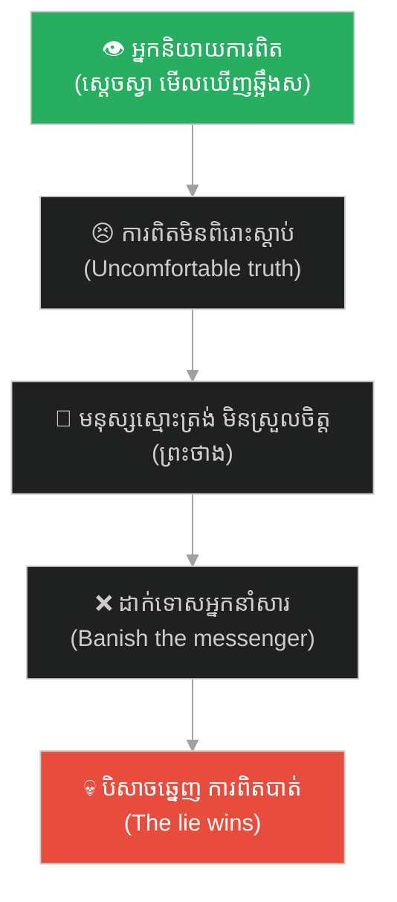
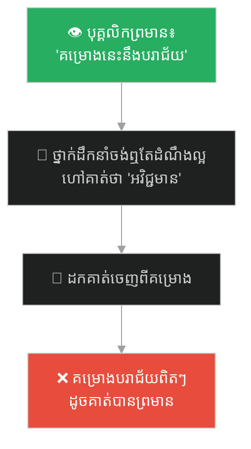
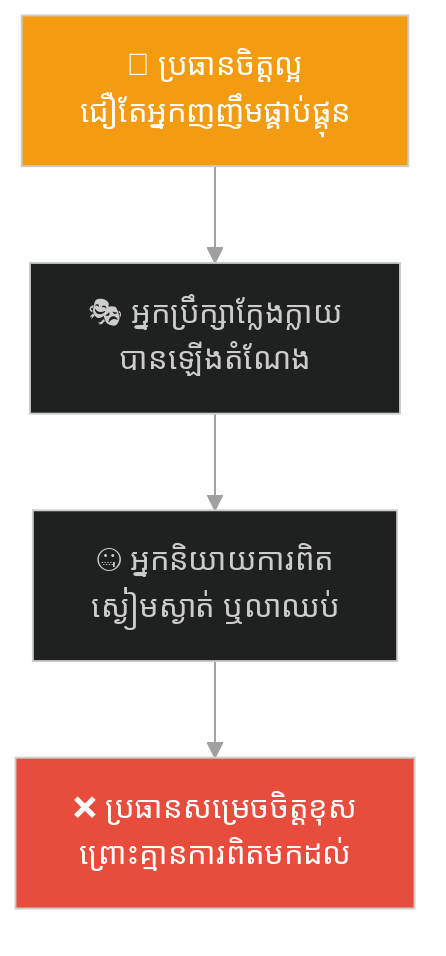
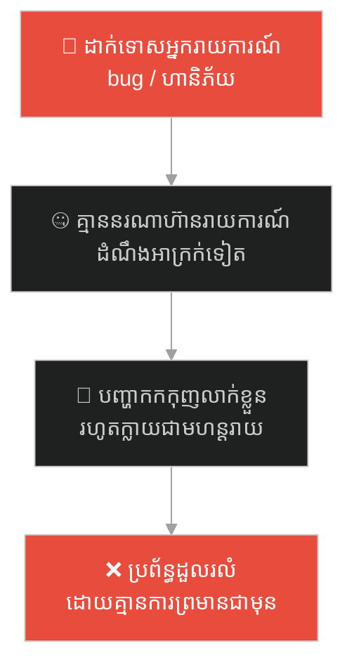
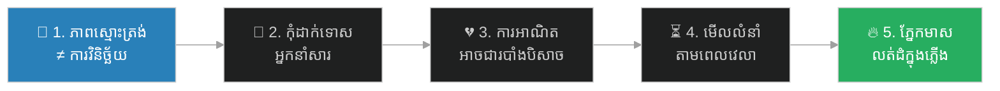

# The Monk Who Banished the Truth (ព្រះថាងដែលបណ្តេញការពិត)៖ ភាពស្មោះត្រង់មិនមែនជាការវិនិច្ឆ័យ និងគ្រោះថ្នាក់នៃការដាក់ទោសអ្នកនិយាយការពិត (Sincerity Is Not Discernment & the Danger of Punishing the Truth-Teller)

**Author:** ichamrong  
**Date:** 2026-06-04  
**Tags:** #journey-to-the-west #discernment #messenger-effect #psychological-safety #sincerity #leadership #parable  
**Category:** Concepts / Parables  
**Read Time:** ~10 min  

---

## 📌 មាតិកា (Table of Contents)
- [អន្ទាក់ផ្លូវចិត្ត (The Trap)](#0)
- [១. រឿងព្រេង៖ ព្រះថាងបណ្តេញស្តេចស្វា (The Legend: The Monk Banishes the Monkey)](#1)
- [២. បញ្ហា៖ ភាពស្មោះត្រង់ មិនធានាការមើលឃើញច្បាស់ (The Issue: Sincerity Does Not Guarantee Sight)](#2)
- [៣. ឧទាហរណ៍ជាក់ស្តែងក្នុងពិភពពិត (Real World Examples)](#3)
  - [ឧទាហរណ៍ទី ១ — ការងារ៖ អ្នកព្រមានហានិភ័យ ត្រូវគេហៅថា «អវិជ្ជមាន» (The "Negative" Risk-Caller)](#3-1)
  - [ឧទាហរណ៍ទី ២ — ភាពជាអ្នកដឹកនាំ៖ ចៅហ្វាយល្អ តែជឿអ្នកញញឹម (The Kind Boss Who Trusts the Flatterer)](#3-2)
  - [ឧទាហរណ៍ទី ៣ — ក្រុម៖ វប្បធម៌ដែលដាក់ទោសអ្នកនាំសារ (The Shoot-the-Messenger Culture)](#3-3)
- [៤. ដំណោះស្រាយ៖ ៥ មេរៀនដែលគួរយកទៅប្រើ (The Solution: Five Lessons Worth Carrying)](#4)
- [សេចក្តីសន្និដ្ឋាន (Conclusion)](#5)
- [ឯកសារយោង (References)](#6)
- [Related Posts](#7)

---

## អន្ទាក់ផ្លូវចិត្ត (The Trap)

តើអ្នកធ្លាប់ដាក់ទោស ឬងាកចេញពីនរណាម្នាក់ ដោយសារគាត់ប្រាប់អ្នកនូវការពិតដែលពិបាកទទួលយក — ហើយបែរជាជឿអ្នកដែលញញឹមផ្គាប់ផ្គុនវិញដែរឬទេ?

Have you ever punished or pushed away someone because they told you an ugly truth — while believing the one who smiled and flattered you instead?

នេះមិនមែនជាកំហុសរបស់ «មនុស្សអាក្រក់» ទេ។ វាជាអន្ទាក់របស់ **មនុស្សល្អ ស្មោះត្រង់** ដែលជឿតែ «មុខស្អាត» ខាងក្រៅ ហើយ **បណ្តេញអ្នកដែលមើលឃើញការពិត** ចេញ។ យើងហៅវាថា **អន្ទាក់ព្រះថាង (The Monk's Trap)** — ភាពស្មោះត្រង់ ដោយគ្មានការវិនិច្ឆ័យ។

This is not the mistake of "bad people." It is the trap of **good, sincere people** who believe only the *pretty mask* on the surface — and **banish the one who sees the truth**. We call it the **Monk's Trap**: sincerity without discernment.

---

## ១. រឿងព្រេង៖ ព្រះថាងបណ្តេញស្តេចស្វា (The Legend: The Monk Banishes the Monkey)

ក្នុងរឿង *ដំណើរទៅទិសខាងលិច* (西游记) បិសាចឆ្អឹងស (White Bone Demon / 白骨精) បានប្រែខ្លួន ៣ ដង ជាស្ត្រីក្មេង ស្ត្រីចំណាស់ និងបុរសចំណាស់ ដើម្បីបញ្ឆោតព្រះថាងសានចាង (Tang Sanzang) ហើយស៊ីសាច់លោក។ ស្តេចស្វា **ស៊ុនអ៊ូឃុង** ដែលមាន **ភ្នែកមាសភ្លើង (火眼金睛)** មើលឃើញ «ឆ្អឹងស» ខាងក្នុង ហើយវាយបិសាចនោះទាំងបីដង។

In *Journey to the West*, the White Bone Demon (白骨精) shape-shifted three times — into a young woman, an old woman, and an old man — to deceive the monk Tang Sanzang and eat his flesh. The Monkey King **Sun Wukong**, with his **Fiery Golden Eyes (火眼金睛)**, saw the *white bones* underneath and struck the demon down all three times.

> 👉 ផ្នែករឿងពេញលេញ សូមមើល៖ **[The White Bone Demon & the Fiery Eyes](./244-the-white-bone-demon-and-the-fiery-eyes.md)** — ប៉ារ៉ាប៊ល់ដៃគូ ដែលផ្តោតលើ «របាំងមុខ vs ខ្លួនពិត»។
>
> For the full story, see the companion parable: **[The White Bone Demon & the Fiery Eyes](./244-the-white-bone-demon-and-the-fiery-eyes.md)** — which focuses on *masks vs. the true self*. This parable focuses on the other half: **the monk.**

ប៉ុន្តែ ព្រះថាង និងសិស្សដទៃ មើលឃើញតែ «មុខស្អាត» ខាងក្រៅ។ ពួកគេជឿថាស្តេចស្វាបានសម្លាប់មនុស្សស្លូតត្រង់ ៣ នាក់។ ដូច្នេះ ព្រះថាង **ដែលជាមនុស្សល្អ ចិត្តបុណ្យ** ក៏សូត្រមន្តធ្វើឱ្យស្តេចស្វាឈឺក្បាលយ៉ាងខ្លាំង ហើយ **បណ្តេញគាត់ចេញ** ពីក្រុម។

But the monk and the other disciples saw only the *beautiful mask*. They believed the Monkey King had murdered three innocent people. So the monk — **a good, compassionate man** — chanted the spell that wracked Sun Wukong's head with pain, and **banished him** from the group.

> **អ្នកដែលមើលឃើញការពិត ត្រូវបានដាក់ទោស។ មនុស្សដែលដាក់ទោសគាត់ មិនមែនជាមនុស្សអាក្រក់ឡើយ — គឺជាមនុស្សល្អដែលត្រូវបានបញ្ឆោត។**
>
> **The one who saw the truth was punished. And the one who punished him was not a villain — he was a good man who had been fooled.**

---

## ២. បញ្ហា៖ ភាពស្មោះត្រង់ មិនធានាការមើលឃើញច្បាស់ (The Issue: Sincerity Does Not Guarantee Sight)

មនុស្សភាគច្រើនអានរឿងនេះ ហើយផ្តោតលើ **បិសាច**៖ «កុំធ្វើខ្លួនក្លែងក្លាយ ហើយត្រូវមើលឱ្យដាច់នូវអ្នកកុហក»។ នោះគ្រាន់តែជាមេរៀន **ផ្ទៃខាងក្រៅ**។

Most people read this story and focus on the **demon**: *"don't be fake, and see through liars."* That is only the **surface** lesson.

មេរៀនពិតដែលវូ ឆេងអេន លាក់ទុក គឺនៅត្រង់ **ព្រះថាង** មិនមែនបិសាច៖ The real lesson Wu Cheng'en buried is about the **monk**, not the demon:

> **បញ្ហាមិនមែននៅបិសាចទេ។ បញ្ហានៅត្រង់ថា ក្រុមមិនអាចបែងចែករវាង «អ្នកនិយាយការពិត» និង «អ្នកបង្កបញ្ហា» — ដូច្នេះពួកគេបណ្តេញចេញ នូវមនុស្សតែម្នាក់ដែលអាចមើលឃើញការពិត។**
>
> **The problem was never the demon. The problem was that the group could not tell the truth-teller from the troublemaker — so they exiled the one person who could actually see.**

បិសាច **ត្រូវបានគេរំពឹងទុក** ថានឹងបោកប្រាស់ — នោះជាធម្មជាតិរបស់បិសាច។ សោកនាដកម្មពិតគឺ **ព្រះថាង**៖ មនុស្សល្អ ស្មោះត្រង់ មានចេតនាល្អ ដែលបែរជា **ដាក់ទោសអ្នកនិយាយការពិត** ព្រោះការពិតវាជូរចត់ ហើយការកុហកវាផ្អែមល្ហែម។ ផ្នែកនេះហើយ ដែលនិយាយពី **យើង** មិនមែនពីមនុស្សអាក្រក់ឡើយ។

The demon was *expected* to deceive — that is a demon's nature. The real tragedy is the **monk**: a good, sincere, well-meaning person who **punished the truth-teller** because the truth was ugly and the lie was beautiful. *That* is the part about **us**, not about villains.

នេះភ្ជាប់នឹងគំនិតផ្លូវចិត្តពីរ (this connects to two psychological ideas):

- **Shoot the Messenger / Messenger Effect** — មនុស្សទំនោរ **ផ្ទេរអារម្មណ៍អវិជ្ជមាន** ពីពាក្យ ទៅអ្នកនាំសារ។ ការស្រាវជ្រាវ (Harvard, 2019) បង្ហាញថា យើងវិនិច្ឆ័យអ្នកនាំដំណឹងអាក្រក់ថា «មិនល្អ» ទោះគាត់គ្មានកំហុសក៏ដោយ។ *We transfer the negative feeling from the message onto the messenger — even when the messenger is blameless.*
- **Psychological Safety (Amy Edmondson)** — ក្រុមដែលដាក់ទោសអ្នកនិយាយការពិត បង្កើតវប្បធម៌នៃ **ភាពស្ងៀមស្ងាត់** ដែលគ្រោះថ្នាក់បំផុត — គ្មាននរណាហ៊ានព្រមានទៀតឡើយ។ *Teams that punish truth-tellers breed a dangerous culture of silence — no one dares to warn again.*

---

## ៣. ឧទាហរណ៍ជាក់ស្តែងក្នុងពិភពពិត (Real World Examples)

---

### ឧទាហរណ៍ទី ១ — ការងារ៖ អ្នកព្រមានហានិភ័យ ត្រូវគេហៅថា «អវិជ្ជមាន» (The "Negative" Risk-Caller)

បុគ្គលិកម្នាក់ (ដូចស្តេចស្វា) មើលឃើញថាគម្រោងនឹងបរាជ័យ ឬ deadline មិនអាចសម្រេចបាន ហើយនិយាយការពិតចេញក្នុងកិច្ចប្រជុំ។ ប៉ុន្តែ ដោយសារអ្នកដទៃចង់ឮតែដំណឹងល្អ ពួកគេបែរជាហៅគាត់ថា «អវិជ្ជមាន» ឬ «បង្កបញ្ហា» ហើយដកគាត់ចេញពីគម្រោង។

An employee (like the Monkey King) sees that a project will fail or a deadline is impossible, and says so in the meeting. But because everyone wants to hear only good news, they brand them "negative" or "a blocker" — and remove them from the project.

---

### ឧទាហរណ៍ទី ២ — ភាពជាអ្នកដឹកនាំ៖ ចៅហ្វាយល្អ តែជឿអ្នកញញឹម (The Kind Boss Who Trusts the Flatterer)

ប្រធានម្នាក់ជាមនុស្សល្អ ចិត្តស្មោះត្រង់ (ដូចព្រះថាង) — តែគាត់ជឿតែបុគ្គលិកដែលញញឹមផ្គាប់ផ្គុន សរសើរ និងយល់ស្របគ្រប់ពេល។ បុគ្គលិកដែលហ៊ាននិយាយការពិត ត្រូវបានគេចាត់ទុកថា «ពិបាកធ្វើការជាមួយ»។ ភាពល្អរបស់ប្រធាន ដោយគ្មានការវិនិច្ឆ័យ ក្លាយជាចំណុចខ្សោយ។

A manager is a good, sincere person (like the monk) — but trusts only the employees who smile, flatter, and always agree. The ones brave enough to tell the truth get labeled "hard to work with." The boss's goodness, without discernment, becomes a weakness.

---

### ឧទាហរណ៍ទី ៣ — ក្រុម៖ វប្បធម៌ដែលដាក់ទោសអ្នកនាំសារ (The Shoot-the-Messenger Culture)

នៅពេលក្រុមមួយ ដាក់ទោសអ្នកដែលរាយការណ៍ bug, ភាពយឺតយ៉ាវ ឬហានិភ័យ — បន្តិចម្តងៗ គ្មាននរណាហ៊ានរាយការណ៍អ្វីអាក្រក់ទៀតឡើយ។ ដំណឹងអាក្រក់ត្រូវបានលាក់ រហូតដល់វាក្លាយជាមហន្តរាយ។ នេះជាការបាត់បង់ **សុវត្ថិភាពផ្លូវចិត្ត (Psychological Safety)**។

When a team punishes whoever reports a bug, a delay, or a risk — gradually no one dares to report anything bad. Bad news gets hidden until it becomes a disaster. This is the collapse of **psychological safety**.

---

## ៤. ដំណោះស្រាយ៖ ៥ មេរៀនដែលគួរយកទៅប្រើ (The Solution: Five Lessons Worth Carrying)

**១. ភាពស្មោះត្រង់ មិនមែនជាការមើលឃើញច្បាស់ឡើយ។ (Sincerity is not the same as seeing clearly.)**
ព្រះថាងមានចិត្តបរិសុទ្ធ — តែគាត់នៅតែ **ខុសទាំងស្រុង**។ ភាពល្អ ដោយគ្មានការវិនិច្ឆ័យ ងាយនឹងត្រូវគេកេងប្រវ័ញ្ច។ *The monk was pure-hearted and still completely wrong. Kindness without discernment gets exploited. Don't trust your own goodness as if it were judgment.*

**២. នៅពេលគេប្រាប់ការពិតដ៏អាក្រក់ ទំនោរដំបូងរបស់យើងគឺដាក់ទោស «អ្នកប្រាប់» មិនមែន «បញ្ហា»។ (When someone delivers an ugly truth, your first instinct is to punish the messenger, not the problem.)**
អ្នកដែលនិយាយថា «គម្រោងនេះនឹងបរាជ័យ» មើលទៅដូចជាការគំរាមកំហែង។ អ្នកដែលញញឹមយល់ស្រប មើលទៅដូចជាសុវត្ថិភាព។ *The discomfort you feel is information about the message — not the messenger.*

**៣. ភាពស្អាត និងគួរឱ្យអាណិត គឺជារបាំងមុខដ៏ល្អបំផុតរបស់បិសាច — មិនមែនភាពអាក្រក់ឡើយ។ (Beautiful and pitiful are the demon's best disguises — not ugliness.)**
បិសាចមិនដែលលេចមកជាសត្វចម្លែកគួរស្អប់ឡើយ — វាលេចមកជា **ស្ត្រីក្មេងនាំម្ហូប ម្តាយកំសត់ បុរសចំណាស់វង្វេង**។ ការបោកប្រាស់ ពាក់មុខអ្នកដែលគួរអាណិត។ *Be most careful exactly when something pulls at your sympathy.*

**៤. វិនិច្ឆ័យលំនាំតាមពេលវេលា មិនមែនការសម្ដែងតែម្តង។ (Judge the pattern over time, not a single performance.)**
ស្តេចស្វា **ធ្វើត្រូវទាំង ៣ ដង** — តែការវាយសម្លាប់បិសាចនោះ មើលទៅហាក់ដូចជាអំពើឃាតកម្ម។ ការពិត ច្រើនតែត្រូវការការធ្វើម្តងហើយម្តងទៀតទើបគេជឿ ហើយអ្នកដែលត្រូវមុនគេ មើលទៅអាក្រក់ជាងគេ។ *A single snapshot is where masks win; watch behavior across time.*

**៥. ភ្នែកមាស ត្រូវបានលត់ដំក្នុងភ្លើង។ (The fiery eyes were forged in fire.)**
ស៊ុនអ៊ូឃុង មិនបានភ្នែកមាសដោយឥតគិតថ្លៃទេ — គាត់បានវាបន្ទាប់ពីត្រូវដុតក្នុងឡ ៤៩ ថ្ងៃ។ សមត្ថភាពមើលទម្លុះរបាំងមុខ **មានតម្លៃ** — ជាធម្មតា គឺការត្រូវគេបោក ឬឈឺចាប់ជាមុនសិន។ *Your past pain is not just damage — it is how you earned your fiery eyes. Don't waste the lesson.*

---

## សេចក្តីសន្និដ្ឋាន (Conclusion)

> **ការមើលឃើញបិសាច គឺងាយ។ ផ្នែកដ៏ពិបាក គឺ កុំក្លាយជាព្រះថាង — មនុស្សស្មោះត្រង់ ដែលបណ្តេញការពិតចេញ ព្រោះការកុហកវាផ្អែមល្ហែមជាង។**
>
> **It's easy to spot the demon. The hard part is not becoming the monk — the sincere person who exiles the truth because the lie was prettier.**

នៅពេលនរណាម្នាក់ប្រាប់អ្នកនូវការពិតដែលពិបាកទទួលយក កុំសួរថា «ហេតុអ្វីបានជាគាត់អវិជ្ជមានម្ល៉េះ?» — សួរថា «តើគាត់ឃើញឆ្អឹងសអ្វី ដែលខ្ញុំមើលមិនឃើញ?» នោះជាការចាប់ផ្តើមនៃការចិញ្ចឹមភ្នែកមាសរបស់ខ្លួនឯង។

When someone tells you an ugly truth, don't ask *"why are they so negative?"* — ask *"what bones do they see that I can't?"* That is the beginning of growing your own fiery eyes.

---

## ឯកសារយោង (References)

* **Wu Cheng'en** — *Journey to the West* (西游记), 16th century. ជំពូក «បីដងវាយបិសាចឆ្អឹងស» (三打白骨精).
* **Leslie John, et al.** — *"Shooting the Messenger"* (Journal of Experimental Psychology: General, 2019). The messenger effect.
* **Amy C. Edmondson** — *The Fearless Organization: Creating Psychological Safety* (2018).
* **Daniel Kahneman** — *Thinking, Fast and Slow* (2011), on the affect heuristic (how feeling colors judgment).

---

## Related Posts

### 🐒 The Journey to the West Series (ស៊េរីរឿងដំណើរទៅទិសខាងលិច)

* **[78 The Seventy-Two Faces of Sun Wukong](../articles/78-the-seventy-two-faces-of-sun-wukong.md)** — អត្ថបទវិទ្យាសាស្ត្រ៖ ខ្លួនពិត vs ខ្លួនក្លែង (science article: true self vs false self).
* **[244 The White Bone Demon & the Fiery Eyes](./244-the-white-bone-demon-and-the-fiery-eyes.md)** — របាំងមុខ vs ខ្លួនពិត (masks vs true self).
* **[246 The Monk Who Banished the Truth](./246-the-monk-who-banished-the-truth.md)** — ភាពស្មោះត្រង់ ≠ ការវិនិច្ឆ័យ (sincerity ≠ discernment).
* **[247 The Real and the Fake Monkey](./247-the-real-and-the-fake-monkey.md)** — ផ្ទៃក្រៅ vs ខ្លឹមសារ (surface vs substance).
* **[248 The Golden Headband](./248-the-golden-headband.md)** — អំណាច ត្រូវការការទទួលខុសត្រូវ (power needs accountability).
* **[249 Trapped Under the Mountain](./249-trapped-under-the-mountain.md)** — ទេពកោសល្យ ត្រូវការវិន័យ និងបេសកកម្ម (talent needs discipline & mission).
* **[250 Havoc in Heaven & the Empty Title](./250-havoc-in-heaven-and-the-empty-title.md)** — ឧទ្ធច្ច និងតួនាទីទទេ (ego and empty titles).
* **[251 The Flaming Mountains & the Banana-Leaf Fan](./251-the-flaming-mountains-and-the-banana-fan.md)** — យុទ្ធសាស្ត្រ > កម្លាំង (strategy > force).

---

## Related

- [💡 Concepts README](../README.md)
- [📚 Main Repository README](../../../README.md)
- [Mental Health & Well-being](../../mental-health/README.md)
- [Management & SDLC](../../management/README.md)
