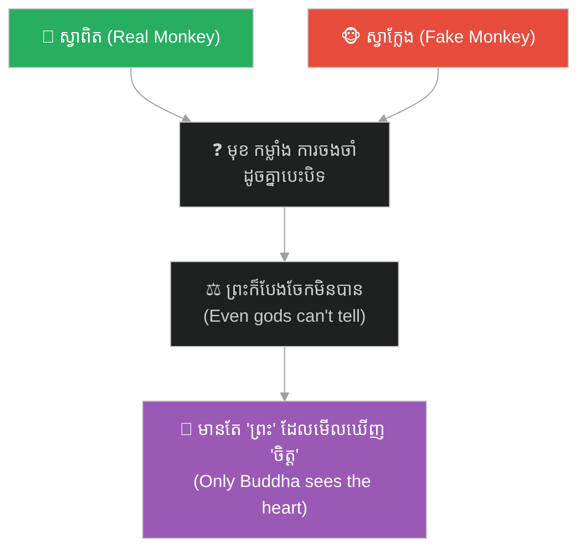
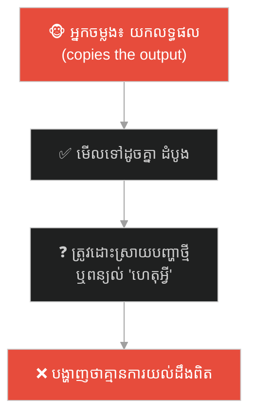
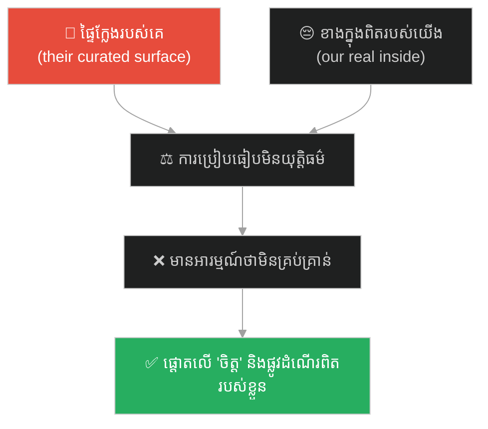
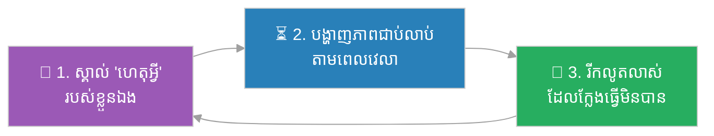

# The Real and the Fake Monkey (ស្វាពិត និងស្វាក្លែងក្លាយ)៖ អត្តសញ្ញាណពិត ដែលការត្រាប់តាមមិនអាចចម្លងបាន (True Identity That Imitation Cannot Copy)

**Author:** ichamrong  
**Date:** 2026-06-04  
**Tags:** #sun-wukong #journey-to-the-west #authenticity #imitation #imposter #identity #parable  
**Category:** Concepts / Parables  
**Read Time:** ~10 min  

---

## 📌 មាតិកា (Table of Contents)
- [អន្ទាក់ផ្លូវចិត្ត (The Trap)](#0)
- [១. រឿងព្រេង៖ ស្វាពិត ប៉ះស្វាក្លែងក្លាយ (The Legend: The Real Monkey Meets the Fake)](#1)
- [២. បញ្ហា៖ អ្វីដែលអាចចម្លងបាន និងអ្វីដែលមិនអាច (The Issue: What Can Be Copied, and What Cannot)](#2)
- [៣. ឧទាហរណ៍ជាក់ស្តែងក្នុងពិភពពិត (Real World Examples)](#3)
  - [ឧទាហរណ៍ទី ១ — ការងារ៖ អ្នកថតចម្លងស្នាដៃ vs អ្នកបង្កើតពិត (The Copycat vs. the Creator)](#3-1)
  - [ឧទាហរណ៍ទី ២ — ម៉ាក៖ ផលិតផលក្លែង vs ម៉ាកដែលមានព្រលឹង (The Knockoff vs. the Soul of a Brand)](#3-2)
  - [ឧទាហរណ៍ទី ៣ — ខ្លួនឯង៖ ការប្រៀបធៀបនឹង «ស្វាក្លែង» លើបណ្តាញសង្គម (Comparing Yourself to a Fake Online)](#3-3)
- [៤. ដំណោះស្រាយ៖ បញ្ជាក់ខ្លួនដោយខ្លឹមសារ មិនមែនផ្ទៃក្រៅ (The Solution: Prove Yourself by Substance, Not Surface)](#4)
- [សេចក្តីសន្និដ្ឋាន (Conclusion)](#5)
- [ឯកសារយោង (References)](#6)
- [Related Posts](#7)

---

## អន្ទាក់ផ្លូវចិត្ត (The Trap)

តើមាននរណាម្នាក់ ធ្លាប់ចម្លងស្នាដៃ ស្ទីល ឬគំនិតរបស់អ្នក រហូតមើលទៅ «ដូចគ្នាបេះបិទ» — ហើយធ្វើឱ្យអ្នកឆ្ងល់ថា «តើខ្ញុំ ឬគេ ជាស្នាដៃពិត?» ដែរឬទេ?

Has someone ever copied your work, your style, or your idea so perfectly that it looked *identical* — leaving you wondering, *"which one of us is the real one?"*

នៅពេលស្វាក្លែងក្លាយ លេចចេញដោយមានមុខ កម្លាំង និងការចងចាំ **ដូចគ្នាបេះបិទ** សូម្បីព្រះក៏បែងចែកមិនបាន។ នេះជា **អន្ទាក់នៃការត្រាប់តាម** — នៅពេលផ្ទៃខាងក្រៅអាចចម្លងបាន តើអ្វីដែលធ្វើឱ្យ «ពិត» នៅសល់?

When a fake appears with the *exact* same face, powers, and memories — even the gods cannot tell them apart. This is the **imitation trap**: when the surface can be perfectly copied, what is left that makes you *real*?

---

## ១. រឿងព្រេង៖ ស្វាពិត ប៉ះស្វាក្លែងក្លាយ (The Legend: The Real Monkey Meets the Fake)

ក្នុងរឿង *ដំណើរទៅទិសខាងលិច* (西游记) មានបិសាចមួយឈ្មោះ **ស្វាប្រាំមួយត្រចៀក (Six-Eared Macaque / 六耳猕猴)** ដែលអាចត្រាប់តាមស្តេចស្វា **ស៊ុនអ៊ូឃុង** បានយ៉ាងល្អឥតខ្ចោះ — មុខដូចគ្នា ដំបងដូចគ្នា កម្លាំងដូចគ្នា សូម្បីការចងចាំ និងសម្ដីក៏ដូចគ្នាដែរ។

In *Journey to the West*, there is a demon called the **Six-Eared Macaque (六耳猕猴)** who can imitate the Monkey King **Sun Wukong** flawlessly — same face, same staff, same strength, even the same memories and words.

ស្វាទាំងពីរ វាយតប់គ្នាមិនចេញចាញ់ឈ្នះ។ ពួកគេទៅរក **ឋានសួគ៌ (Heaven), មច្ចុរាជ (the Underworld), និងព្រះអវលោកិតេស្វរ (Guanyin)** — តែគ្មាននរណាម្នាក់ ឬឧបករណ៍ណាមួយ អាចបែងចែកស្វាពិតចេញពីស្វាក្លែងបានឡើយ។

The two monkeys fight to a perfect standstill. They go to **Heaven, the Underworld, and the Bodhisattva Guanyin** — but no one, and no instrument, can tell the real monkey from the fake.

ចុងក្រោយ ពួកគេទៅរក **ព្រះពុទ្ធ (Buddha)**។ ព្រះពុទ្ធមិនបានមើលមុខ មិនបានវាស់កម្លាំង — ព្រះអង្គមើល **ចិត្ត និងធម្មជាតិពិត** ខាងក្នុង។ ភ្លាមនោះ ព្រះអង្គដឹងថាមួយណាពិត មួយណាក្លែង ហើយបង្ហាញស្វាក្លែងក្លាយចេញ។

Finally, they go to the **Buddha**. The Buddha did not look at their faces or measure their strength — he looked at the **heart and true nature** within. Instantly, he knew which was real and which was the imitation, and exposed the fake.

> **ផ្ទៃខាងក្រៅ អាចត្រូវចម្លងបានឥតខ្ចោះ។ តែខ្លឹមសារខាងក្នុង មិនអាចត្រាប់តាមបានឡើយ។**
>
> **The surface can be copied perfectly. But the substance within cannot be imitated.**

---

## ២. បញ្ហា៖ អ្វីដែលអាចចម្លងបាន និងអ្វីដែលមិនអាច (The Issue: What Can Be Copied, and What Cannot)

ស្វាប្រាំមួយត្រចៀក បង្ហាញការពិតដ៏សំខាន់មួយ៖ **ការត្រាប់តាម អាចចម្លងបាននូវ «អ្វីដែលអ្នកធ្វើ» តែមិនអាចចម្លងបាននូវ «អ្នកជានរណា»។**

The Six-Eared Macaque reveals an important truth: **imitation can copy *what you do*, but never *who you are*.**

| អាចចម្លងបាន (Can be copied) | មិនអាចចម្លងបាន (Cannot be copied) |
|---|---|
| 🎭 មុខ និងរូបរាង (face & appearance) | 🪷 ចេតនា និងតម្លៃ (intention & values) |
| 💪 ជំនាញ និងបច្ចេកទេស (skills & technique) | 🔥 «ហេតុអ្វី» ដែលជំរុញ (the *why* that drives it) |
| 📋 ស្នាដៃ និងផលិតផល (output & product) | ⏳ ភាពជាប់លាប់តាមពេលវេលា (consistency over time) |
| 🗣️ ពាក្យ និងស្ទីល (words & style) | 🌱 ការរីកលូតលាស់ និងការទទួលខុសត្រូវ (growth & ownership) |

នេះភ្ជាប់នឹងគំនិតផ្លូវចិត្ត (this connects to psychology):

- **Authenticity (ភាពពិតប្រាកដ)** — អ្នកស្រាវជ្រាវ (Goldman & Kernis) កំណត់ «authenticity» ថា ការរស់នៅស្របនឹង **តម្លៃ និងធម្មជាតិពិត** របស់ខ្លួន — មិនមែនផ្ទៃខាងក្រៅ។ ស្វាក្លែង មានផ្ទៃខាងក្រៅ តែគ្មានធម្មជាតិពិត។
- **Imposter vs. Original** — ស្វាក្លែង មិនអាច **រីកលូតលាស់ ឬទទួលខុសត្រូវ** លើផ្លូវដំណើរបានឡើយ ព្រោះវាគ្រាន់តែចម្លង។ ការពិតលេចចេញ **តាមពេលវេលា** តាមរយៈជម្រើស និងការប្តេជ្ញាចិត្ត។
- **«ព្រះពុទ្ធមើលចិត្ត»** — ការបែងចែកពិត ឬក្លែង មិនកើតឡើងតាមការវាស់ផ្ទៃក្រៅ តែតាមការមើល **ខ្លឹមសារ ចេតនា និងលំនាំ**។

**ភាពខុសគ្នាសំខាន់៖** ស្វាក្លែង អាចធ្វើ «បានដូច» ស្តេចស្វា — តែវាមិនអាច «ក្លាយជា» ស្តេចស្វាបានឡើយ ព្រោះវាគ្មានចិត្តពិត និងផ្លូវដំណើររបស់គាត់។

**The crucial difference:** the fake could *do as* the Monkey King — but it could never *be* him, because it lacked his true heart and his journey.

---

## ៣. ឧទាហរណ៍ជាក់ស្តែងក្នុងពិភពពិត (Real World Examples)

---

### ឧទាហរណ៍ទី ១ — ការងារ៖ អ្នកថតចម្លងស្នាដៃ vs អ្នកបង្កើតពិត (The Copycat vs. the Creator)

មិត្តរួមការងារម្នាក់ ចម្លងស្នាដៃ ស្លាយបទបង្ហាញ ឬកូដរបស់អ្នក ហើយយកទៅអះអាងជារបស់ខ្លួន។ ផ្ទៃខាងក្រៅ មើលទៅដូចគ្នា។ ប៉ុន្តែ នៅពេលត្រូវ **ពន្យល់ «ហេតុអ្វី» ឬដោះស្រាយបញ្ហាថ្មីដែលមិនធ្លាប់ឃើញ** អ្នកចម្លងភ្លាម ៗ បង្ហាញថាគេគ្មានការយល់ដឹងពិត — ព្រោះគេចម្លងតែ «លទ្ធផល» មិនមែន «ការគិត»។

A colleague copies your work, slides, or code and claims it as their own. On the surface, it looks identical. But the moment they must *explain the "why"* or *solve a new problem they haven't seen*, the copycat is exposed — because they copied the *output*, not the *thinking*.

---

### ឧទាហរណ៍ទី ២ — ម៉ាក៖ ផលិតផលក្លែង vs ម៉ាកដែលមានព្រលឹង (The Knockoff vs. the Soul of a Brand)

ផលិតផលក្លែង ចម្លងស្លាក ការរចនា និងរូបរាងម៉ាកល្បីបានយ៉ាងជិតស្និទ្ធ។ តែវាមិនអាចចម្លងបាន **គុណភាព ការទុកចិត្ត សេវាកម្ម និងរឿងរ៉ាវ (story)** ដែលធ្វើឱ្យម៉ាកពិតមានតម្លៃ។ អតិថិជនអាចត្រូវបោកម្តង — តែ **ការទុកចិត្តតាមពេលវេលា** គឺជា «ចិត្ត» ដែលក្លែងមិនបាន។

A knockoff copies a famous brand's logo, design, and look very closely. But it cannot copy the *quality, trust, service, and story* that make the real brand valuable. A customer may be fooled once — but *trust over time* is the "heart" that cannot be faked.

---

### ឧទាហរណ៍ទី ៣ — ខ្លួនឯង៖ ការប្រៀបធៀបនឹង «ស្វាក្លែង» លើបណ្តាញសង្គម (Comparing Yourself to a Fake Online)

នៅលើបណ្តាញសង្គម យើងឃើញ «ស្វាក្លែង» រាប់រយ — ជីវិតដ៏ល្អឥតខ្ចោះ ភាពជោគជ័យ និងសុភមង្គល ដែលត្រូវបានរៀបចំ (curated)។ យើងប្រៀបធៀប **ខាងក្នុងពិតរបស់យើង** ទៅនឹង **ផ្ទៃខាងក្រៅក្លែងរបស់គេ** ហើយមានអារម្មណ៍ថាខ្លួនឯងមិនគ្រប់គ្រាន់។ តែនោះគ្រាន់តែជា «មុខ» ដែលគ្មាន «ចិត្ត» ខាងក្រោយ។

On social media we see hundreds of "fake monkeys" — perfect lives, curated success and happiness. We compare our *real inside* to their *fake outside* and feel inadequate. But that is just a *face* with no *heart* behind it.

---

## ៤. ដំណោះស្រាយ៖ បញ្ជាក់ខ្លួនដោយខ្លឹមសារ មិនមែនផ្ទៃក្រៅ (The Solution: Prove Yourself by Substance, Not Surface)

ជំហាននៃការអនុវត្ត (How to apply)៖

1. **ស្គាល់ «ហេតុអ្វី» របស់ខ្លួនឯង (Know your *why*)៖** អ្នកចម្លងអាចយកលទ្ធផល — តែមិនអាចយកមូលហេតុ និងតម្លៃដែលជំរុញវា។ នោះជា «ចិត្ត» ដែលព្រះពុទ្ធមើលឃើញ។ *A copycat can take your output, but not the reason and values behind it.*
2. **បង្ហាញភាពជាប់លាប់តាមពេលវេលា (Show consistency over time)៖** ស្វាក្លែង បង្ហាញតែមួយពេល។ ភាពពិត ត្រូវបានបញ្ជាក់តាមរយៈ **ជម្រើសម្តងហើយម្តងទៀត** តាមឆ្នាំ។ *The fake performs once; the real is proven by repeated choices over years.*
3. **កុំប្រកួតលើផ្ទៃក្រៅ — ប្រកួតលើខ្លឹមសារ (Don't compete on surface — compete on substance)៖** បើនរណាម្នាក់ចម្លងអ្នក នោះមានន័យថាអ្នកជា «ដើម»។ បន្តរីកលូតលាស់ទៅមុខ — ដ្បិតអ្នកចម្លងតែងតែនៅពីក្រោយ។ *If someone is copying you, you are the original. Keep growing forward — the imitator is always one step behind.*

---

## សេចក្តីសន្និដ្ឋាន (Conclusion)

> **ស្វាក្លែង អាចមានមុខ កម្លាំង និងការចងចាំ ដូចគ្នាបេះបិទ — តែវាគ្មានចិត្តពិត និងផ្លូវដំណើររបស់ស្តេចស្វា។ ផ្ទៃខាងក្រៅ អាចចម្លងបាន។ ខ្លឹមសារខាងក្នុង មិនអាចត្រាប់តាមបានឡើយ។**
>
> **The fake could have the same face, strength, and memories — but it lacked the Monkey King's true heart and his journey. The surface can be copied. The substance within cannot be imitated.**

នៅពេលនរណាម្នាក់ត្រាប់តាមអ្នក ឬនៅពេលអ្នកប្រៀបធៀបខ្លួនឯងនឹង «ស្វាក្លែង» ផ្សេងទៀត ចូរចាំថា៖ ការត្រាប់តាម គឺជាសក្ខីភាពនៃតម្លៃរបស់អ្នក។ ភារកិច្ចរបស់អ្នកគឺ **រស់នៅស្របនឹង «ចិត្ត» ពិតរបស់ខ្លួន** — ដ្បិតនោះជារបស់តែមួយ ដែលគ្មាននរណាអាចលួចបានឡើយ។

When someone imitates you, or when you compare yourself to other "fake monkeys," remember: imitation is proof of your value. Your task is to *live in line with your true heart* — because that is the one thing no one can steal.

---

## ឯកសារយោង (References)

* **Wu Cheng'en** — *Journey to the West* (西游记), 16th century. ជំពូក «ស្វាពិត និងស្វាក្លែង» (真假美猴王 / "The True and False Monkey King").
* **Michael Kernis & Brian Goldman** — *A multicomponent conceptualization of authenticity* (2006).
* **Carl Rogers** — *On Becoming a Person* (1961), on congruence between the real and presented self.

---

## Related Posts
### 🐒 The Journey to the West Series (ស៊េរីរឿងដំណើរទៅទិសខាងលិច)

* **[78 The Seventy-Two Faces of Sun Wukong](../articles/78-the-seventy-two-faces-of-sun-wukong.md)** — អត្ថបទវិទ្យាសាស្ត្រ៖ ខ្លួនពិត vs ខ្លួនក្លែង (science article: true self vs false self).
* **[244 The White Bone Demon & the Fiery Eyes](./244-the-white-bone-demon-and-the-fiery-eyes.md)** — របាំងមុខ vs ខ្លួនពិត (masks vs true self).
* **[246 The Monk Who Banished the Truth](./246-the-monk-who-banished-the-truth.md)** — ភាពស្មោះត្រង់ ≠ ការវិនិច្ឆ័យ (sincerity ≠ discernment).
* **[247 The Real and the Fake Monkey](./247-the-real-and-the-fake-monkey.md)** — ផ្ទៃក្រៅ vs ខ្លឹមសារ (surface vs substance).
* **[248 The Golden Headband](./248-the-golden-headband.md)** — អំណាច ត្រូវការការទទួលខុសត្រូវ (power needs accountability).
* **[249 Trapped Under the Mountain](./249-trapped-under-the-mountain.md)** — ទេពកោសល្យ ត្រូវការវិន័យ និងបេសកកម្ម (talent needs discipline & mission).
* **[250 Havoc in Heaven & the Empty Title](./250-havoc-in-heaven-and-the-empty-title.md)** — ឧទ្ធច្ច និងតួនាទីទទេ (ego and empty titles).
* **[251 The Flaming Mountains & the Banana-Leaf Fan](./251-the-flaming-mountains-and-the-banana-fan.md)** — យុទ្ធសាស្ត្រ > កម្លាំង (strategy > force).
* **[252 The Water Curtain Cave & the Leap of Faith](./252-the-water-curtain-cave-and-the-leap-of-faith.md)** — ការផ្ដើម និងហានិភ័យគណនា (initiative & calculated risk).
* **[253 The Five Pillars & the Limit of Perception](./253-the-five-pillars-and-the-limit-of-perception.md)** — ដែនកំណត់នៃការយល់ដឹង និងអំនួត (cognitive limits & overconfidence).
* **[254 The Ginseng Fruit Tree & the Cost of Impulse](./254-the-ginseng-fruit-tree-and-the-cost-of-impulse.md)** — កំហឹងឆេវឆាវ និងការខូចខាត (emotional impulse & cost of damage).
* **[255 The Magic Gourd & the Trap of Response](./255-the-magic-gourd-and-the-trap-of-response.md)** — ការបោកប្រាស់បែបចិត្តសាស្ត្រ និងការផ្ទៀងផ្ទាត់ (social engineering & input validation).
* **[256 The Three Knocks & the Art of Subtle Signals](./256-the-three-knocks-and-the-art-of-subtle-signals.md)** — ការស្ដាប់ដោយសកម្ម និងសញ្ញាបង្កប់ (active listening & subtext).
---

## Related

- [💡 Concepts README](../README.md)
- [📚 Main Repository README](../../../README.md)
- [Mental Health & Well-being](../../mental-health/README.md)
- [Management & SDLC](../../management/README.md)
