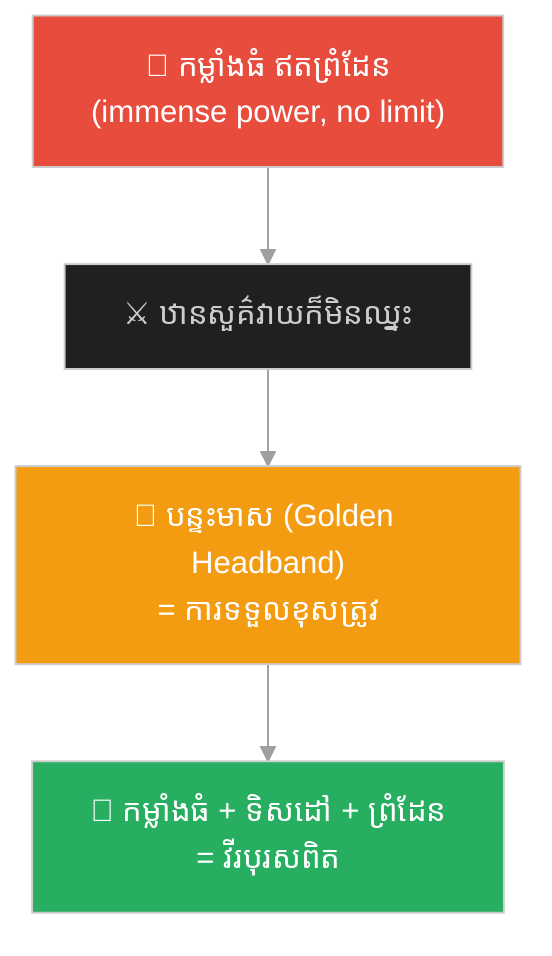
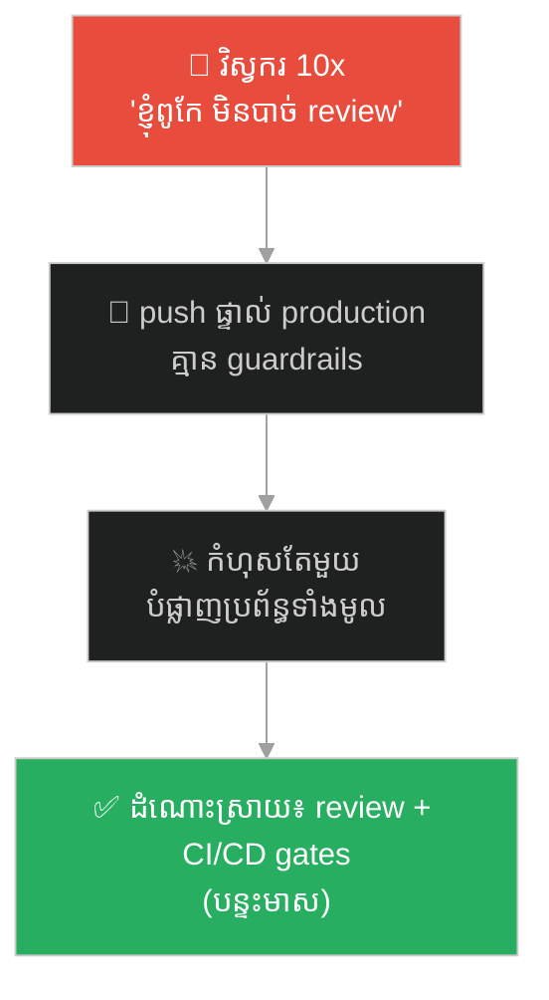
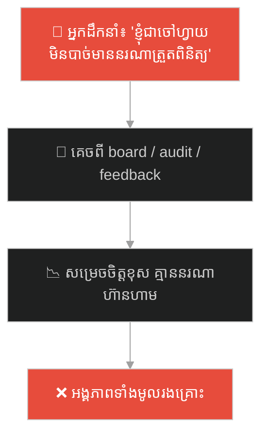

# The Golden Headband (បន្ទះមាសរឹតក្បាល)៖ ហេតុអ្វីអំណាចដ៏ខ្លាំងបំផុត ត្រូវការការទទួលខុសត្រូវ (Why the Greatest Power Needs Accountability)

**Author:** ichamrong  
**Date:** 2026-06-04  
**Tags:** #sun-wukong #journey-to-the-west #accountability #governance #guardrails #leadership #power #parable  
**Category:** Concepts / Parables  
**Read Time:** ~10 min  

---

## 📌 មាតិកា (Table of Contents)
- [អន្ទាក់ផ្លូវចិត្ត (The Trap)](#0)
- [១. រឿងព្រេង៖ បន្ទះមាស ដែលគ្រប់គ្រងស្តេចស្វា (The Legend: The Band That Controls the Monkey King)](#1)
- [២. បញ្ហា៖ កម្លាំង ដោយគ្មានការទប់ស្កាត់ (The Issue: Power Without a Check)](#2)
- [៣. ឧទាហរណ៍ជាក់ស្តែងក្នុងពិភពពិត (Real World Examples)](#3)
  - [ឧទាហរណ៍ទី ១ — ការងារ៖ បុគ្គលិកពូកែ តែគ្មានព្រំដែន (The Brilliant Engineer With No Limits)](#3-1)
  - [ឧទាហរណ៍ទី ២ — បច្ចេកវិទ្យា៖ ប្រព័ន្ធដ៏មានឫទ្ធិ ត្រូវការ Guardrails (Powerful Systems Need Guardrails)](#3-2)
  - [ឧទាហរណ៍ទី ៣ — ភាពជាអ្នកដឹកនាំ៖ អ្នកដឹកនាំ ត្រូវការការត្រួតពិនិត្យ (Even Leaders Need Oversight)](#3-3)
- [៤. ដំណោះស្រាយ៖ បន្ទះមាសល្អ vs បន្ទះមាសអាក្រក់ (The Solution: Good Headbands vs. Bad Headbands)](#4)
- [សេចក្តីសន្និដ្ឋាន (Conclusion)](#5)
- [ឯកសារយោង (References)](#6)
- [Related Posts](#7)

---

## អន្ទាក់ផ្លូវចិត្ត (The Trap)

តើបុគ្គលដ៏មានទេពកោសល្យបំផុត ខ្លាំងបំផុត ឬឆ្លាតបំផុតក្នុងក្រុម — គួរត្រូវ «លើកលែង» ពីច្បាប់ និងការត្រួតពិនិត្យ ដែរឬទេ? មនុស្សជាច្រើនគិតថា «គួរ» ព្រោះគេពូកែ។ នេះជាអន្ទាក់។

Should the most talented, most powerful, or smartest person on a team be *exempt* from rules and oversight? Many think *"yes, because they're that good."* This is the trap.

ស្តេចស្វា ស៊ុនអ៊ូឃុង ខ្លាំងពេក រហូតព្រះនៅឋានសួគ៌ ក៏វាយមិនឈ្នះ។ ដំណោះស្រាយមិនមែនកម្លាំងធំជាង — តែជា **បន្ទះមាសរឹតក្បាល (Golden Headband / 金箍)** ដ៏តូចមួយ ដែលផ្តល់ការទទួលខុសត្រូវ និងព្រំដែន។

The Monkey King was so powerful that even Heaven could not defeat him. The solution was not *more force* — it was one small **Golden Headband (金箍)** that gave him accountability and limits.

---

## ១. រឿងព្រេង៖ បន្ទះមាស ដែលគ្រប់គ្រងស្តេចស្វា (The Legend: The Band That Controls the Monkey King)

ស្តេចស្វា ស៊ុនអ៊ូឃុង មានកម្លាំងធំធេង — គាត់អាចបំផ្លាញឋានសួគ៌ ហើយគ្មាននរណាបង្ខំគាត់បានឡើយ។ ប៉ុន្តែ កម្លាំងធំ ដោយគ្មានការទប់ស្កាត់ បានធ្វើឱ្យគាត់ក្លាយជា **គ្រោះថ្នាក់** — មិនមែនជាវីរបុរស។

The Monkey King had immense power — he could wreck Heaven, and no one could control him. But great power *without a check* made him a **danger**, not a hero.

ដូច្នេះ ព្រះអវលោកិតេស្វរ (Guanyin) បានដាក់ **បន្ទះមាស (Golden Headband)** លើក្បាលគាត់។ នៅពេលគាត់ប្រព្រឹត្តិខុស ឬបាត់បង់ការគ្រប់គ្រងខ្លួន ព្រះតាំងសាមី (his master) អាចសូត្រ **«មន្តរឹតក្បាល»** ដែលធ្វើឱ្យបន្ទះមាសរឹតចូល បង្កការឈឺចាប់ខ្លាំង។

So the Bodhisattva Guanyin placed the **Golden Headband** on his head. Whenever he acted wrongly or lost control, his master could chant the **tightening spell**, making the band constrict and causing him great pain.

នេះមិនមែនជាការ «ដាក់ទណ្ឌកម្ម» ដ៏ឃោរឃៅឡើយ — វាជា **ការទទួលខុសត្រូវ**។ បន្ទះមាស មិនបានកាត់បន្ថយកម្លាំងរបស់គាត់ — វាគ្រាន់តែភ្ជាប់កម្លាំងនោះ ទៅនឹង **ទិសដៅ និងព្រំដែន**។ តាមរយៈវា ស្តេចស្វាដ៏ព្រៃផ្សៃ បានក្លាយជាអ្នកការពារដ៏ពិត លើផ្លូវធម៌។

This was not cruel *punishment* — it was *accountability*. The band did not reduce his power; it simply tied that power to *direction and limits*. Through it, the wild Monkey King became a true protector on the righteous path.

> **កម្លាំង ដោយគ្មានការទទួលខុសត្រូវ គឺជាគ្រោះថ្នាក់។ កម្លាំង ដែលភ្ជាប់នឹងព្រំដែន ក្លាយជាវីរភាព។**
>
> **Power without accountability is a danger. Power bound to limits becomes heroism.**

---

## ២. បញ្ហា៖ កម្លាំង ដោយគ្មានការទប់ស្កាត់ (The Issue: Power Without a Check)

រឿងបន្ទះមាស បង្ហាញគោលការណ៍ដ៏សំខាន់៖ **មនុស្ស ឬប្រព័ន្ធ ដែលខ្លាំងបំផុត គឺត្រូវការការត្រួតពិនិត្យ ច្រើនបំផុត — មិនមែនតិចបំផុតឡើយ។**

The Golden Headband reveals a vital principle: **the most powerful person or system needs the *most* oversight — not the least.**

នេះភ្ជាប់នឹងគំនិតគ្រប់គ្រង និងចិត្តវិទ្យា (this connects to governance & psychology):

- **"Power tends to corrupt" (Lord Acton)** — អំណាច ដោយគ្មានការទប់ស្កាត់ ងាយនាំទៅរកការប្រើខុស។ បន្ទះមាស គឺជា **«checks and balances»** ផ្ទាល់ខ្លួន។
- **Accountability ≠ Distrust** — ការដាក់ព្រំដែនលើមនុស្សពូកែ មិនមែនមានន័យថា «មិនទុកចិត្ត» ឡើយ — វាជាការការពារ **ទាំងគេ និងក្រុម** ពីកំហុសដ៏ធំ។
- **Single Point of Failure** — នៅពេលក្រុមពឹងផ្អែកលើ «ស្តេចស្វា» តែម្នាក់ ដោយគ្មានព្រំដែន នោះជា **ហានិភ័យ** ដ៏ធំ បើគេបាត់ ឬប្រព្រឹត្តិខុស។

**ភាពខុសគ្នាសំខាន់៖** គោលដៅរបស់បន្ទះមាស មិនមែនដើម្បី **ធ្វើឱ្យស្តេចស្វាខ្សោយ** — តែដើម្បី **ធ្វើឱ្យកម្លាំងរបស់គាត់ មានសុវត្ថិភាព និងមានប្រយោជន៍**។ ការទទួលខុសត្រូវ ល្អ មិនកាត់បន្ថយទេពកោសល្យ — វាដឹកនាំទេពកោសល្យ។

**The crucial difference:** the band's goal was not to *weaken* the Monkey King — it was to make his power *safe and useful*. Good accountability does not reduce talent — it directs it.

---

## ៣. ឧទាហរណ៍ជាក់ស្តែងក្នុងពិភពពិត (Real World Examples)

---

### ឧទាហរណ៍ទី ១ — ការងារ៖ បុគ្គលិកពូកែ តែគ្មានព្រំដែន (The Brilliant Engineer With No Limits)

ក្រុមមួយមានវិស្វករ «១០x» ដ៏ពូកែ — តែគេ push code ផ្ទាល់ទៅ production ដោយគ្មាន review, រំលង process និងមិនព្រមធ្វើតាមច្បាប់ក្រុម ព្រោះ «គេពូកែ»។ មួយថ្ងៃ កំហុសតែមួយ បំផ្លាញប្រព័ន្ធទាំងមូល។ ការគ្មាន «បន្ទះមាស» (code review, CI/CD gates) ធ្វើឱ្យកម្លាំងរបស់គេ ក្លាយជាគ្រោះថ្នាក់។

A team has a brilliant "10x" engineer — but they push code straight to production with no review, skip process, and ignore team rules because "they're that good." One day, a single mistake takes down the whole system. The absence of a "Golden Headband" (code review, CI/CD gates) turned their power into a danger.

---

### ឧទាហរណ៍ទី ២ — បច្ចេកវិទ្យា៖ ប្រព័ន្ធដ៏មានឫទ្ធិ ត្រូវការ Guardrails (Powerful Systems Need Guardrails)

ប្រព័ន្ធដ៏មានឫទ្ធិ ដូចជា AI, ឧបករណ៍ deploy ស្វ័យប្រវត្តិ, ឬ admin access ដ៏ធំ — កាន់តែខ្លាំង កាន់តែត្រូវការ **guardrails** (rate limits, permissions, approval gates, kill-switch)។ កម្លាំង ដោយគ្មាន «បន្ទះមាស» គឺជាគ្រោះមហន្តរាយដែលរង់ចាំកើតឡើង។

Powerful systems — AI, automated deploy tools, broad admin access — the more powerful they are, the more they need **guardrails** (rate limits, permissions, approval gates, a kill-switch). Power with no "Golden Headband" is a disaster waiting to happen.

---

### ឧទាហរណ៍ទី ៣ — ភាពជាអ្នកដឹកនាំ៖ អ្នកដឹកនាំ ត្រូវការការត្រួតពិនិត្យ (Even Leaders Need Oversight)

នាយក ឬស្ថាបនិក ដ៏មានអំណាច ក៏ត្រូវការ «បន្ទះមាស» ដែរ — ក្រុមប្រឹក្សាភិបាល (board), សវនកម្ម (audit), ឬ feedback ដ៏ស្មោះត្រង់។ អ្នកដឹកនាំ ដែលគេចពីការត្រួតពិនិត្យទាំងអស់ «ព្រោះខ្ញុំជាចៅហ្វាយ» គឺជាស្តេចស្វា ដែលគ្មានបន្ទះមាស — ហើយ «ឋានសួគ៌» (ក្រុមហ៊ុន) នឹងរងគ្រោះ។

A powerful CEO or founder also needs a "Golden Headband" — a board, audits, or honest feedback. A leader who escapes all oversight "because I'm the boss" is a Monkey King with no band — and "Heaven" (the company) will pay the price.

---

## ៤. ដំណោះស្រាយ៖ បន្ទះមាសល្អ vs បន្ទះមាសអាក្រក់ (The Solution: Good Headbands vs. Bad Headbands)

មិនមែនការទប់ស្កាត់គ្រប់យ៉ាង សុទ្ធតែល្អនោះទេ។ បន្ទះមាស **ល្អ** ដឹកនាំកម្លាំង។ បន្ទះមាស **អាក្រក់** គ្រាន់តែបង្ក្រាបវា។ Not all control is good. A *good* headband directs power; a *bad* one merely suppresses it.

| បន្ទះមាសល្អ (Good guardrail) ✅ | បន្ទះមាសអាក្រក់ (Bad control) ❌ |
|---|---|
| ភ្ជាប់កម្លាំងនឹងទិសដៅ (directs power to a mission) | បង្ក្រាបដោយការភ័យខ្លាច (controls by fear) |
| ច្បាស់លាស់ និងយុត្តិធម៌ (clear & fair) | តាមអំពើចិត្ត (arbitrary) |
| ការពារទាំងបុគ្គល និងក្រុម (protects both person & team) | ការពារតែអំណាចអ្នកគ្រប់គ្រង (protects only the controller) |
| អនុញ្ញាតឱ្យរីកលូតលាស់ (allows growth) | ធ្វើឱ្យអសកម្ម (creates paralysis) |

ជំហាននៃការអនុវត្ត (How to apply)៖

1. **កាន់តែខ្លាំង កាន់តែត្រូវការព្រំដែន (More power → more guardrails)៖** កុំលើកលែងមនុស្ស ឬប្រព័ន្ធដ៏ខ្លាំង ពីការត្រួតពិនិត្យ — នោះជាកន្លែងដែលត្រូវការវាបំផុត។ *Don't exempt your strongest from oversight — that is where it's needed most.*
2. **រចនាបន្ទះមាសដែលដឹកនាំ មិនមែនបង្ក្រាប (Design bands that direct, not crush)៖** គោលដៅគឺ ភ្ជាប់កម្លាំងនឹងទិសដៅ មិនមែនបំផ្លាញវា។ *The goal is to channel power, not destroy it.*
3. **ទទួលយកបន្ទះមាសរបស់ខ្លួនឯង (Accept your own band)៖** អ្នកដឹកនាំពិត **ស្វាគមន៍** ការទទួលខុសត្រូវ — ព្រោះវាការពារគេពីកំហុសដ៏ធំបំផុតរបស់ខ្លួន។ *True leaders welcome accountability — it protects them from their own worst mistakes.*

---

## សេចក្តីសន្និដ្ឋាន (Conclusion)

> **បន្ទះមាស មិនបានកាត់បន្ថយកម្លាំងរបស់ស្តេចស្វាឡើយ — វាគ្រាន់តែភ្ជាប់កម្លាំងនោះ ទៅនឹងទិសដៅ និងព្រំដែន។ កម្លាំង ដោយគ្មានការទទួលខុសត្រូវ គឺជាគ្រោះថ្នាក់។ កម្លាំង ដែលភ្ជាប់នឹងព្រំដែន ក្លាយជាវីរភាព។**
>
> **The Golden Headband did not reduce the Monkey King's power — it simply tied that power to direction and limits. Power without accountability is a danger. Power bound to limits becomes heroism.**

មិនថាអ្នកជា «ស្តេចស្វា» ដ៏ពូកែ ឬជាអ្នកដឹកនាំក្រុមនៃស្តេចស្វាទេ ចូរចាំថា៖ ការទទួលខុសត្រូវ មិនមែនជាសត្រូវនៃទេពកោសល្យឡើយ — វាជាអ្វីដែលប្រែទេពកោសល្យព្រៃផ្សៃ ឱ្យក្លាយជាវីរភាពដ៏ពិត។

Whether you are a brilliant "Monkey King" or you lead a team of them, remember: accountability is not the enemy of talent — it is what turns wild talent into true heroism.

---

## ឯកសារយោង (References)

* **Wu Cheng'en** — *Journey to the West* (西游记), 16th century. បន្ទះមាស (金箍) និងមន្តរឹតក្បាល (緊箍咒).
* **Lord Acton** — *"Power tends to corrupt, and absolute power corrupts absolutely"* (1887).
* **Jim Collins** — *Good to Great* (2001), on disciplined people and disciplined action.

---

## Related Posts

* **[249 Trapped Under the Mountain](./249-trapped-under-the-mountain.md)** — ទេពកោសល្យ ត្រូវការវិន័យ និងបេសកកម្ម (talent needs discipline & a mission).
* **[250 Havoc in Heaven & the Empty Title](./250-havoc-in-heaven-and-the-empty-title.md)** — តួនាទីទទេ ដើម្បីបន្ធូរអំណាច បែរជាបង្កគ្រោះ (empty titles to pacify ambition backfire).
* **[78 The Seventy-Two Faces of Sun Wukong](../articles/78-the-seventy-two-faces-of-sun-wukong.md)** — អត្ថបទវិទ្យាសាស្ត្រដៃគូ (the companion science article).

---

## Related

- [💡 Concepts README](../README.md)
- [📚 Main Repository README](../../../README.md)
- [Mental Health & Well-being](../../mental-health/README.md)
- [Management & SDLC](../../management/README.md)
