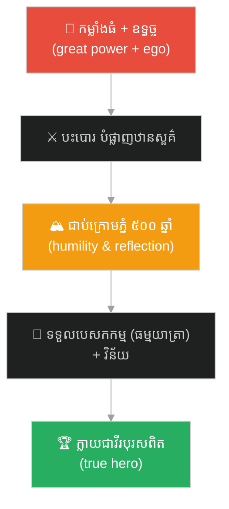
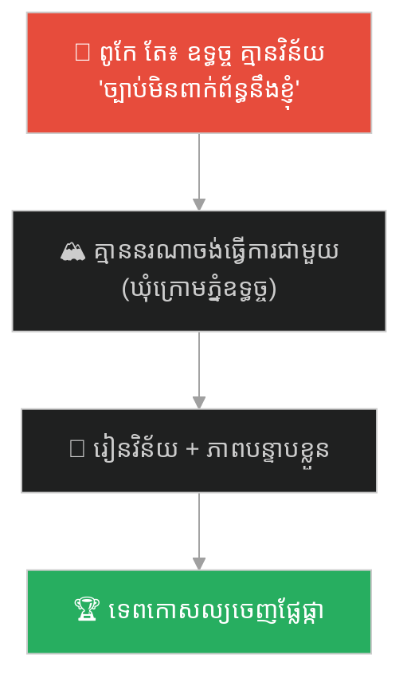
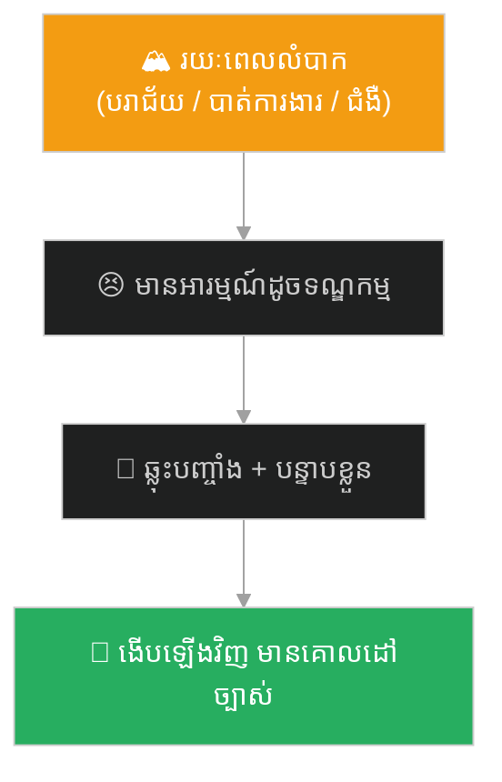
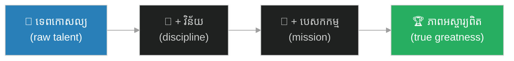

# Trapped Under the Mountain (ជាប់ក្រោមភ្នំ ៥០០ ឆ្នាំ)៖ ទេពកោសល្យព្រៃផ្សៃ ត្រូវការវិន័យ និងបេសកកម្ម (Wild Talent Needs Discipline and a Mission)

**Author:** ichamrong  
**Date:** 2026-06-04  
**Tags:** #sun-wukong #journey-to-the-west #discipline #humility #purpose #growth #ego #parable  
**Category:** Concepts / Parables  
**Read Time:** ~10 min  

---

## 📌 មាតិកា (Table of Contents)
- [អន្ទាក់ផ្លូវចិត្ត (The Trap)](#0)
- [១. រឿងព្រេង៖ ស្តេចស្វា ជាប់ក្រោមភ្នំ ៥០០ ឆ្នាំ (The Legend: 500 Years Under the Mountain)](#1)
- [២. បញ្ហា៖ ទេពកោសល្យ ដោយគ្មានវិន័យ (The Issue: Talent Without Discipline)](#2)
- [៣. ឧទាហរណ៍ជាក់ស្តែងក្នុងពិភពពិត (Real World Examples)](#3)
  - [ឧទាហរណ៍ទី ១ — អាជីព៖ បុគ្គលិកពូកែ ដែលអ្នកដទៃមិនចង់ធ្វើការជាមួយ (The Talented Person Nobody Wants to Work With)](#3-1)
  - [ឧទាហរណ៍ទី ២ — ស្타*ART*អាប៖ ស្ថាបនិកដ៏ឆ្លាត ដែលគ្មានទិសដៅ (The Smart Founder With No Direction)](#3-2)
  - [ឧទាហរណ៍ទី ៣ — ខ្លួនឯង៖ រយៈពេលនៃ «ភ្នំ» ក្នុងជីវិត (Your Own Time Under the Mountain)](#3-3)
- [៤. ដំណោះស្រាយ៖ ពីកម្លាំងព្រៃផ្សៃ ទៅកម្លាំងមានគោលដៅ (The Solution: From Wild Power to Purposeful Power)](#4)
- [សេចក្តីសន្និដ្ឋាន (Conclusion)](#5)
- [ឯកសារយោង (References)](#6)
- [Related Posts](#7)

---

## អន្ទាក់ផ្លូវចិត្ត (The Trap)

តើទេពកោសល្យ និងកម្លាំង គ្រប់គ្រាន់ ដើម្បីជោគជ័យ ដែរឬទេ? មនុស្សជាច្រើនជឿថា «បើខ្ញុំពូកែគ្រប់គ្រាន់ ពិភពលោកនឹងបើកផ្លូវឱ្យខ្ញុំ»។ ស្តេចស្វា ស៊ុនអ៊ូឃុង ក៏ធ្លាប់គិតបែបនេះដែរ — រហូតគាត់ត្រូវជាប់ក្រោមភ្នំ ៥០០ ឆ្នាំ។

Is talent and power *enough* to succeed? Many believe *"if I'm good enough, the world will open up for me."* The Monkey King Sun Wukong believed this too — until he was trapped under a mountain for 500 years.

ស្តេចស្វា មានកម្លាំងគ្រប់គ្រាន់ ដើម្បីបំផ្លាញឋានសួគ៌ — តែ **កម្លាំង ដោយគ្មានវិន័យ និងគោលដៅ** បាននាំគាត់ទៅរក **ការបរាជ័យ មិនមែនភាពអស្ចារ្យ**។ នេះជា **អន្ទាក់នៃទេពកោសល្យព្រៃផ្សៃ**។

The Monkey King had enough power to wreck Heaven — but *power without discipline or purpose* led him to *failure, not greatness*. This is the **trap of wild talent**.

---

## ១. រឿងព្រេង៖ ស្តេចស្វា ជាប់ក្រោមភ្នំ ៥០០ ឆ្នាំ (The Legend: 500 Years Under the Mountain)

នៅដើមរឿង *ដំណើរទៅទិសខាងលិច* (西游记) ស្តេចស្វា ស៊ុនអ៊ូឃុង មានកម្លាំងដ៏អស្ចារ្យ — តែគាត់ពោរពេញដោយ **ឧទ្ធច្ច (ego)**។ គាត់ប្រកាសខ្លួនថា «មហាសិទ្ធិស្មើឋានសួគ៌» បះបោរ និងបំផ្លាញឋានសួគ៌ ដោយគិតថា កម្លាំងរបស់គាត់ ធ្វើឱ្យគាត់នៅពីលើច្បាប់ទាំងអស់។

Early in *Journey to the West*, the Monkey King had astonishing power — but he was full of **ego**. He declared himself "Great Sage Equal to Heaven," rebelled, and wrecked Heaven, believing his power placed him above all rules.

ចុងក្រោយ **ព្រះពុទ្ធ** បានបង្ក្រាបគាត់ — មិនមែនដោយកម្លាំងធំជាងទេ តែដោយប្រាជ្ញា។ ព្រះអង្គ **ឃុំស្តេចស្វា ក្រោមភ្នំប្រាំធាតុ (Five-Elements Mountain) អស់រយៈពេល ៥០០ ឆ្នាំ**។

Finally the **Buddha** subdued him — not with greater force, but with wisdom. He imprisoned the Monkey King **under the Five-Elements Mountain for 500 years**.

រយៈពេល ៥០០ ឆ្នាំនោះ មិនមែនគ្រាន់តែជាទណ្ឌកម្មឡើយ — វាជា **ពេលវេលានៃការ បន្ទាបខ្លួន និងការឆ្លុះបញ្ចាំង**។ នៅពេលគាត់ត្រូវបានដោះលែង គាត់ត្រូវបានផ្ដល់ **បេសកកម្មមួយ** (ការពារព្រះថាងសានចាង លើផ្លូវធម្មយាត្រា) និង **វិន័យ**។ មានតែពេលនោះ ដែលកម្លាំងព្រៃផ្សៃរបស់គាត់ បានក្លាយជាកម្លាំងដ៏អស្ចារ្យ ដែលមានគោលដៅ — ហើយគាត់ក្លាយជាវីរបុរសពិត។

Those 500 years were not mere punishment — they were a time of *humility and reflection*. When released, he was given a *mission* (to protect the monk on the pilgrimage) and *discipline*. Only then did his wild power become great power *with purpose* — and he became a true hero.

> **កម្លាំង បានធ្វើឱ្យគាត់ខ្លាំង។ តែវិន័យ និងបេសកកម្ម ទើបធ្វើឱ្យគាត់អស្ចារ្យ។**
>
> **Power made him strong. But discipline and a mission made him great.**

---

## ២. បញ្ហា៖ ទេពកោសល្យ ដោយគ្មានវិន័យ (The Issue: Talent Without Discipline)

រឿងភ្នំ ៥០០ ឆ្នាំ បង្ហាញការពិតដ៏ឈឺចាប់៖ **ទេពកោសល្យ ដោយគ្មានវិន័យ និងគោលដៅ គឺជាកម្លាំងព្រៃផ្សៃ ដែលបំផ្លាញខ្លួនឯង។**

The 500-years story reveals a painful truth: **talent without discipline or purpose is a wild force that destroys itself.**

នេះភ្ជាប់នឹងគំនិតផ្លូវចិត្ត (this connects to psychology):

- **Talent vs. Discipline (Angela Duckworth — Grit)** — ការស្រាវជ្រាវបង្ហាញថា **ការខិតខំ ប្រកបដោយវិន័យ (effort)** សំខាន់ជាងទេពកោសល្យពីធម្មជាតិ ពីរដង ក្នុងការសម្រេចជោគជ័យ។ ទេពកោសល្យ ប្រាប់ត្រឹមថា «អ្នកអាចទៅឆ្ងាយប៉ុណ្ណា» — វិន័យ ទើបនាំអ្នកទៅដល់ទីនោះ។
- **Purpose (Viktor Frankl)** — កម្លាំង ដោយគ្មាន «ហេតុអ្វី» គឺគ្មានទិសដៅ។ បេសកកម្ម ផ្ដល់ទិសដៅ ដែលប្រែកម្លាំងព្រៃផ្សៃ ឱ្យមានន័យ។
- **The Value of Constraint** — ភ្នំ (constraint) មិនមែនជាសត្រូវ — វាជា **គ្រូ**។ ព្រំដែន បង្ខំឱ្យមានការ ឆ្លុះបញ្ចាំង និងភាពចាស់ទុំ ដែលភាពងាយស្រួល មិនអាចផ្ដល់បាន។

**ភាពខុសគ្នាសំខាន់៖** ស្តេចស្វា មុនពេលជាប់ភ្នំ និងក្រោយ — គឺជាមនុស្សតែម្នាក់ មានកម្លាំងដូចគ្នា។ អ្វីដែលផ្លាស់ប្តូរ មិនមែនកម្លាំង — តែ **វិន័យ បេសកកម្ម និងភាពបន្ទាបខ្លួន**។

**The crucial difference:** the Monkey King before and after the mountain was the same being with the same power. What changed was not his strength — it was his *discipline, mission, and humility*.

---

## ៣. ឧទាហរណ៍ជាក់ស្តែងក្នុងពិភពពិត (Real World Examples)

---

### ឧទាហរណ៍ទី ១ — អាជីព៖ បុគ្គលិកពូកែ ដែលអ្នកដទៃមិនចង់ធ្វើការជាមួយ (The Talented Person Nobody Wants to Work With)

បុគ្គលិកម្នាក់ ពូកែខាងបច្ចេកទេសខ្លាំង — តែគ្មានវិន័យ មិនគោរពពេលវេលា មិនធ្វើការជាក្រុម និងគិតថា «ខ្ញុំពូកែ ដូច្នេះច្បាប់មិនពាក់ព័ន្ធនឹងខ្ញុំ»។ ទេពកោសល្យរបស់គេ ត្រូវបាន «ឃុំក្រោមភ្នំ» នៃ ឧទ្ធច្ច — គ្មាននរណាចង់ផ្ដល់ឱកាសធំៗ ឬដឹកនាំ។ លុះត្រាគេរៀន **វិន័យ និងភាពបន្ទាបខ្លួន** ទើបទេពកោសល្យនោះ ចេញផ្លែផ្កា។

A person is brilliant technically — but undisciplined, ignores deadlines, won't work as a team, and thinks "I'm good, so rules don't apply to me." Their talent is "trapped under a mountain" of ego — no one wants to give them big opportunities or leadership. Only when they learn *discipline and humility* does the talent finally bear fruit.

---

### ឧទាហរណ៍ទី ២ — ក្រុមហ៊ុន Startup៖ ស្ថាបនិកដ៏ឆ្លាត ដែលគ្មានទិសដៅ (The Smart Founder With No Direction)

ស្ថាបនិកម្នាក់ ឆ្លាតវៃ និងពោរពេញដោយថាមពល — តែ លោតពីគំនិតមួយ ទៅគំនិតមួយ គ្មានការផ្ដោត គ្មានបេសកកម្មច្បាស់លាស់។ កម្លាំងច្នៃប្រឌិតរបស់គេ ខ្ជះខ្ជាយ ព្រោះគ្មាន «ភ្នំ» (ការផ្ដោត និងវិន័យ) និងគ្មាន «បេសកកម្ម» ច្បាស់លាស់។ ថាមពលច្រើន ដោយគ្មានទិសដៅ មិននាំទៅរកជោគជ័យឡើយ។

A founder is brilliant and full of energy — but jumps from idea to idea, with no focus, no clear mission. Their creative power is wasted because there is no "mountain" (focus and discipline) and no clear "mission." Lots of energy with no direction does not lead to success.

---

### ឧទាហរណ៍ទី ៣ — ខ្លួនឯង៖ រយៈពេលនៃ «ភ្នំ» ក្នុងជីវិត (Your Own Time Under the Mountain)

រាល់មនុស្ស ធ្លាប់មានរយៈពេល «ភ្នំ» របស់ខ្លួន — ការបរាជ័យ ការបាត់បង់ការងារ ជំងឺ ឬពេលវេលាដ៏លំបាក ដែលបង្ខំឱ្យឈប់ និងឆ្លុះបញ្ចាំង។ ពេលនោះ មានអារម្មណ៍ដូចជាការដាក់ទោស — តែជាញឹកញាប់ វាជា **គ្រូ** ដែលបង្រៀនយើងនូវភាពបន្ទាបខ្លួន ការផ្ដោត និងគោលដៅ ដែលភាពងាយស្រួល មិនអាចបង្រៀនបាន។

Everyone has their own "mountain" period — a failure, a job loss, an illness, or a hard time that forces them to stop and reflect. It feels like punishment — but often it is a *teacher*, instilling the humility, focus, and purpose that easy times can never teach.

---

## ៤. ដំណោះស្រាយ៖ ពីកម្លាំងព្រៃផ្សៃ ទៅកម្លាំងមានគោលដៅ (The Solution: From Wild Power to Purposeful Power)

ជំហាននៃការអនុវត្ត (How to apply)៖

1. **ទេពកោសល្យ គឺគ្រាន់តែជាការចាប់ផ្ដើម (Talent is only the starting line)៖** កុំពឹងផ្អែកលើទេពកោសល្យ តែម្នាក់ឯង។ វិន័យ ប្រកបដោយការខិតខំ ទើបនាំអ្នកទៅឆ្ងាយ។ *Don't rely on talent alone; disciplined effort is what carries you far.*
2. **ស្វែងរក «បេសកកម្ម» របស់អ្នក (Find your mission)៖** កម្លាំង ដោយគ្មាន «ហេតុអ្វី» គឺខ្ជះខ្ជាយ។ បេសកកម្មច្បាស់លាស់ ប្រែថាមពលព្រៃផ្សៃ ឱ្យមានទិសដៅ។ *Power without a "why" is wasted; a clear mission gives it direction.*
3. **ទទួលយក «ភ្នំ» របស់អ្នកជាគ្រូ (Accept your "mountain" as a teacher)៖** រយៈពេលលំបាក និងព្រំដែន មិនមែនជាសត្រូវឡើយ — វាបង្រៀនភាពបន្ទាបខ្លួន និងភាពចាស់ទុំ។ *Hard times and constraints are not enemies — they teach humility and maturity.*

---

## សេចក្តីសន្និដ្ឋាន (Conclusion)

> **ស្តេចស្វា មុន និងក្រោយភ្នំ គឺមនុស្សតែម្នាក់ មានកម្លាំងដូចគ្នា។ អ្វីដែលផ្លាស់ប្តូរ មិនមែនកម្លាំង — តែ វិន័យ បេសកកម្ម និងភាពបន្ទាបខ្លួន។ កម្លាំង បានធ្វើឱ្យគាត់ខ្លាំង។ តែវិន័យ និងបេសកកម្ម ទើបធ្វើឱ្យគាត់អស្ចារ្យ។**
>
> **The Monkey King before and after the mountain was the same being with the same power. What changed was discipline, mission, and humility. Power made him strong — but discipline and a mission made him great.**

បើអ្នកមានទេពកោសល្យ តែមានអារម្មណ៍ថា «ជាប់ក្រោមភ្នំ» ឥឡូវនេះ — ចូរចាំថា នោះអាចជារយៈពេលនៃការ ប្រែខ្លួនរបស់អ្នក។ ទេពកោសល្យ ប្រាប់ត្រឹមថា អ្នកអាចទៅឆ្ងាយប៉ុណ្ណា។ វិន័យ និងគោលដៅ ទើបនាំអ្នកទៅដល់ទីនោះ។

If you have talent but feel "trapped under a mountain" right now — remember, it may be your transformation period. Talent only tells you how far you *can* go. Discipline and purpose are what actually take you there.

---

## ឯកសារយោង (References)

* **Wu Cheng'en** — *Journey to the West* (西游记), 16th century. ភ្នំប្រាំធាតុ (五行山).
* **Angela Duckworth** — *Grit: The Power of Passion and Perseverance* (2016).
* **Viktor Frankl** — *Man's Search for Meaning* (1946), on purpose as the source of resilience.

---

## Related Posts
### 🐒 The Journey to the West Series (ស៊េរីរឿងដំណើរទៅទិសខាងលិច)

* **[78 The Seventy-Two Faces of Sun Wukong](../articles/78-the-seventy-two-faces-of-sun-wukong.md)** — អត្ថបទវិទ្យាសាស្ត្រ៖ ខ្លួនពិត vs ខ្លួនក្លែង (science article: true self vs false self).
* **[244 The White Bone Demon & the Fiery Eyes](./244-the-white-bone-demon-and-the-fiery-eyes.md)** — របាំងមុខ vs ខ្លួនពិត (masks vs true self).
* **[246 The Monk Who Banished the Truth](./246-the-monk-who-banished-the-truth.md)** — ភាពស្មោះត្រង់ ≠ ការវិនិច្ឆ័យ (sincerity ≠ discernment).
* **[247 The Real and the Fake Monkey](./247-the-real-and-the-fake-monkey.md)** — ផ្ទៃក្រៅ vs ខ្លឹមសារ (surface vs substance).
* **[248 The Golden Headband](./248-the-golden-headband.md)** — អំណាច ត្រូវការការទទួលខុសត្រូវ (power needs accountability).
* **[249 Trapped Under the Mountain](./249-trapped-under-the-mountain.md)** — ទេពកោសល្យ ត្រូវការវិន័យ និងបេសកកម្ម (talent needs discipline & mission).
* **[250 Havoc in Heaven & the Empty Title](./250-havoc-in-heaven-and-the-empty-title.md)** — ឧទ្ធច្ច និងតួនាទីទទេ (ego and empty titles).
* **[251 The Flaming Mountains & the Banana-Leaf Fan](./251-the-flaming-mountains-and-the-banana-fan.md)** — យុទ្ធសាស្ត្រ > កម្លាំង (strategy > force).
* **[252 The Water Curtain Cave & the Leap of Faith](./252-the-water-curtain-cave-and-the-leap-of-faith.md)** — ការផ្ដើម និងហានិភ័យគណនា (initiative & calculated risk).
* **[253 The Five Pillars & the Limit of Perception](./253-the-five-pillars-and-the-limit-of-perception.md)** — ដែនកំណត់នៃការយល់ដឹង និងអំនួត (cognitive limits & overconfidence).
* **[254 The Ginseng Fruit Tree & the Cost of Impulse](./254-the-ginseng-fruit-tree-and-the-cost-of-impulse.md)** — កំហឹងឆេវឆាវ និងការខូចខាត (emotional impulse & cost of damage).
* **[255 The Magic Gourd & the Trap of Response](./255-the-magic-gourd-and-the-trap-of-response.md)** — ការបោកប្រាស់បែបចិត្តសាស្ត្រ និងការផ្ទៀងផ្ទាត់ (social engineering & input validation).
* **[256 The Three Knocks & the Art of Subtle Signals](./256-the-three-knocks-and-the-art-of-subtle-signals.md)** — ការស្ដាប់ដោយសកម្ម និងសញ្ញាបង្កប់ (active listening & subtext).
---

## Related

- [💡 Concepts README](../README.md)
- [📚 Main Repository README](../../../README.md)
- [Mental Health & Well-being](../../mental-health/README.md)
- [Management & SDLC](../../management/README.md)
