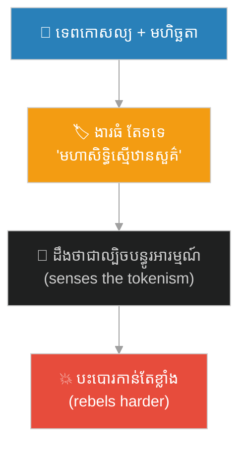
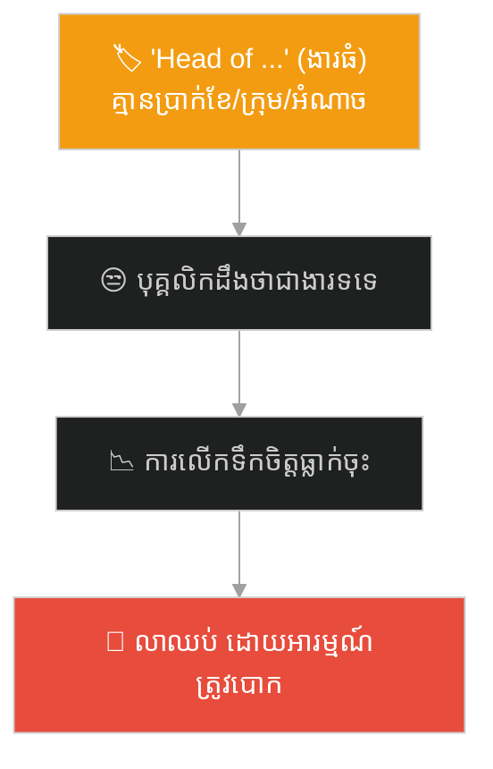

# Havoc in Heaven & the Empty Title (កុបកម្មលើឋានសួគ៌ និងតួនាទីទទេ)៖ ហេតុអ្វីងារទទេ ដើម្បីបន្ធូរមហិច្ឆតា តែងតែបង្កគ្រោះ (Why Empty Titles to Pacify Ambition Always Backfire)

**Author:** ichamrong  
**Date:** 2026-06-04  
**Tags:** #sun-wukong #journey-to-the-west #recognition #titles #tokenism #motivation #leadership #parable  
**Category:** Concepts / Parables  
**Read Time:** ~10 min  

---

## 📌 មាតិកា (Table of Contents)
- [អន្ទាក់ផ្លូវចិត្ត (The Trap)](#0)
- [១. រឿងព្រេង៖ «មហាសិទ្ធិស្មើឋានសួគ៌» ងារដ៏អស្ចារ្យ តែទទេ (The Legend: A Grand but Hollow Title)](#1)
- [២. បញ្ហា៖ ការទទួលស្គាល់ ដោយគ្មានការទទួលខុសត្រូវពិត (The Issue: Recognition Without Real Responsibility)](#2)
- [៣. ឧទាហរណ៍ជាក់ស្តែងក្នុងពិភពពិត (Real World Examples)](#3)
  - [ឧទាហរណ៍ទី ១ — ការងារ៖ ងារធំ ប្រាក់ខែ និងអំណាចតូច (The Big Title, Small Power Promotion)](#3-1)
  - [ឧទាហរណ៍ទី ២ — ក្រុម៖ ការដាក់មនុស្សពិបាក ឱ្យកាន់តួនាទីសុភាព (Sidelining a Difficult Star)](#3-2)
  - [ឧទាហរណ៍ទី ៣ — សង្គម៖ ការទទួលស្គាល់ក្លែងក្លាយ (Token Recognition)](#3-3)
- [៤. ដំណោះស្រាយ៖ ការទទួលស្គាល់ពិត vs ងារទទេ (The Solution: Real Recognition vs. Empty Titles)](#4)
- [សេចក្តីសន្និដ្ឋាន (Conclusion)](#5)
- [ឯកសារយោង (References)](#6)
- [Related Posts](#7)

---

## អន្ទាក់ផ្លូវចិត្ត (The Trap)

នៅពេលនរណាម្នាក់ ដែលមានទេពកោសល្យ និងមហិច្ឆតា ចាប់ផ្ដើមធ្វើឱ្យអ្នកមិនស្រួលចិត្ត — តើដំណោះស្រាយ ល្អ គឺ «ផ្ដល់ងារធំ ប៉ុន្តែទទេ» ដើម្បីបន្ធូរអារម្មណ៍គេ ដែរឬទេ? មនុស្សជាច្រើនធ្វើបែបនេះ។ ស្តេចស្វា បង្ហាញថា វាបង្កគ្រោះ។

When someone talented and ambitious starts to make you uncomfortable — is the *good* solution to "give them a big but empty title" to pacify them? Many people do exactly this. The Monkey King shows it backfires.

ឋានសួគ្គ មិនអាចវាយឈ្នះស្តេចស្វាបាន ដូច្នេះ ជំនួសឱ្យការ ផ្ដល់តួនាទីពិត ពួកគេផ្ដល់ងារ **«មហាសិទ្ធិស្មើឋានសួគ៌» (Great Sage Equal to Heaven)** ដ៏ស្រស់ស្អាត — តែគ្មានអំណាច និងការងារពិត។ លទ្ធផល? គាត់បះបោរ កាន់តែខ្លាំង។

Heaven could not defeat the Monkey King, so instead of giving him a *real* role, they gave him the grand-sounding title **"Great Sage Equal to Heaven"** — with no real power or duties. The result? He rebelled even harder.

---

## ១. រឿងព្រេង៖ «មហាសិទ្ធិស្មើឋានសួគ៌» ងារដ៏អស្ចារ្យ តែទទេ (The Legend: A Grand but Hollow Title)

ស្តេចស្វា ស៊ុនអ៊ូឃុង ខ្លាំងពេក រហូតពលឋានសួគ៌ វាយយកឈ្នះមិនបាន។ ស្ដេចសួគ៌ (Jade Emperor) មិនដឹងធ្វើដូចម្តេច ដូច្នេះមន្ត្រីបានណែនាំ៖ «ផ្ដល់ងារ និងការងារមួយឱ្យគាត់ ដើម្បីបន្ធូរអារម្មណ៍»។

The Monkey King was so powerful that Heaven's army could not win. The Jade Emperor did not know what to do, so an official advised: *"Give him a title and a job to pacify him."*

ដំបូង ពួកគេផ្ដល់ងារ **«អ្នកមើលថែសេះ» (Keeper of the Horses)** — ងារតូចមួយ។ នៅពេលស្តេចស្វាដឹងថា ងារនោះទាបបំផុត គាត់ខឹង និងបះបោរ។ ដូច្នេះ ពួកគេផ្ដល់ងារធំជាង **«មហាសិទ្ធិស្មើឋានសួគ៌»** — ស្ដាប់ទៅអស្ចារ្យ តែគ្មានអំណាច គ្មានការទទួលខុសត្រូវ និងគ្មានការគោរពពិត។ ពួកគេថែមទាំងឱ្យគាត់ **យាមសួនផ្លែប៉េសអមតៈ** ដែលជាការងារ «បន្ធូរអារម្មណ៍» ដ៏គ្មានន័យ។

First they gave him the title **"Keeper of the Horses"** — a lowly post. When the Monkey King realized it was the *lowest* rank, he was furious and rebelled. So they gave him the grander title **"Great Sage Equal to Heaven"** — impressive-sounding, but with no power, no real responsibility, and no genuine respect. They even put him in charge of *guarding the peach garden* — a meaningless "keep-him-busy" job.

ស្តេចស្វា ដឹងភ្លាមៗ ថា ងារនោះគ្រាន់តែជា **ល្បិច** ដើម្បីបន្ធូរអារម្មណ៍គាត់ មិនមែនការគោរពពិតឡើយ។ ដូច្នេះ គាត់ស៊ីផ្លែប៉ែសអមតៈទាំងអស់ លួចទឹកដោះអមតៈ និងបង្ករកុបកម្មលើឋានសួគ៌ទាំងមូល (大鬧天宮)។

The Monkey King immediately understood that the title was just a *trick* to pacify him, not real respect. So he ate all the immortal peaches, stole the elixir, and caused **havoc throughout Heaven (大鬧天宮)**.

> **ការផ្ដល់ងារទទេ ដើម្បីបន្ធូរមហិច្ឆតា មិនបានបន្ធូរអ្វីឡើយ — វាគ្រាន់តែ ផ្ទុះកំហឹង ឱ្យកាន់តែខ្លាំង។**
>
> **Giving an empty title to pacify ambition pacifies nothing — it only makes the resentment explode.**

---

## ២. បញ្ហា៖ ការទទួលស្គាល់ ដោយគ្មានការទទួលខុសត្រូវពិត (The Issue: Recognition Without Real Responsibility)

រឿងកុបកម្មលើឋានសួគ៌ បង្ហាញការពិតដ៏សំខាន់៖ **មនុស្សពូកែ ដឹងភ្លាមៗ ពីភាពខុសគ្នារវាង «ការទទួលស្គាល់ពិត» និង «ងារទទេ ដើម្បីបន្ធូរអារម្មណ៍»។**

The Havoc in Heaven reveals an important truth: **talented people immediately sense the difference between *real recognition* and *an empty title meant to placate them*.**

នេះភ្ជាប់នឹងគំនិតផ្លូវចិត្ត (this connects to psychology):

- **Tokenism (និមិត្តរូបទទេ)** — ការផ្ដល់ងារ ឬការទទួលស្គាល់ ដោយគ្មានអំណាច ឬការផ្លាស់ប្តូរពិត ត្រូវបានគេមើលឃើញ ថាជាការ **មិនគោរព** — មិនមែនជាអំណោយ។
- **Intrinsic Motivation (Daniel Pink — Drive)** — មនុស្សពូកែ ត្រូវការ **ស្វ័យភាព (autonomy), ជំនាញ (mastery), និងគោលបំណង (purpose)** — មិនមែនត្រឹមងារស្អាត ឬការសរសើរ ទទេ។
- **Psychological Contract** — នៅពេលអ្នកសន្យាការគោរព តាមរយៈងារ តែមិនផ្ដល់អំណាចពិត អ្នកបំពាន «កិច្ចសន្យាផ្លូវចិត្ត» — ហើយការទុកចិត្ត ប្រែជាកំហឹង។

**ភាពខុសគ្នាសំខាន់៖** ស្តេចស្វា មិនបានខឹង ព្រោះងារតូចឡើយ — គាត់ខឹង ព្រោះ **ងារនោះ ជាការបោកប្រាស់**។ ការទទួលស្គាល់ ដែលគ្មានខ្លឹមសារ ពិតជា អាក្រក់ជាង ការគ្មានការទទួលស្គាល់ ទាល់តែសោះ — ព្រោះវាបន្ថែម «ការប្រមាថ»។

**The crucial difference:** the Monkey King was not angry because the title was *small* — he was angry because the title was a *deception*. Recognition with no substance is actually *worse* than no recognition at all — because it adds insult.

---

## ៣. ឧទាហរណ៍ជាក់ស្តែងក្នុងពិភពពិត (Real World Examples)

---

### ឧទាហរណ៍ទី ១ — ការងារ៖ ងារធំ ប្រាក់ខែ និងអំណាចតូច (The Big Title, Small Power Promotion)

ក្រុមហ៊ុនមួយ មិនចង់បាត់បុគ្គលិកពូកែ ដូច្នេះ ផ្ដល់ងារធំ ដូចជា «Head of ...» — តែគ្មានការដំឡើងប្រាក់ខែ គ្មានក្រុមឱ្យដឹកនាំ និងគ្មានអំណាចសម្រេចចិត្តពិត។ បុគ្គលិកនោះ ដឹងភ្លាមៗ ថាជា «ងារទទេ» ហើយ ការលើកទឹកចិត្តរបស់គេ ធ្លាក់ចុះ — ហើយចុងក្រោយ ក៏លាឈប់ ដោយអារម្មណ៍ថាត្រូវបោក។

A company doesn't want to lose a talented employee, so it gives them a big title like "Head of..." — but with no raise, no team to lead, and no real decision-making power. The employee immediately senses the "empty title," their motivation drops — and eventually they quit, feeling deceived.

---

### ឧទាហរណ៍ទី ២ — ក្រុម៖ ការដាក់មនុស្សពិបាក ឱ្យកាន់តួនាទីសុភាព (Sidelining a Difficult Star)

ប្រធានម្នាក់ មានបុគ្គលិកពូកែ តែ «ពិបាកគ្រប់គ្រង»។ ជំនួសឱ្យការ ដោះស្រាយ ឬផ្ដល់តួនាទីពិត ប្រធានដាក់គេ ឱ្យកាន់ «គម្រោងពិសេស» ដ៏គ្មានសារៈសំខាន់ ដើម្បីដាក់គេនៅឆ្ងាយ។ បុគ្គលិកនោះ ដឹងថា ត្រូវបានដាក់ក្រៅ ហើយ ក្លាយជា «ស្តេចស្វាបះបោរ» — ផ្សព្វផ្សាយភាពមិនពេញចិត្ត ពេញក្រុម។

A manager has a talented but "hard-to-manage" employee. Instead of addressing it or giving a real role, the manager assigns them an unimportant "special project" to keep them at a distance. The employee knows they've been sidelined and becomes a "rebellious Monkey King" — spreading discontent across the team.

---

### ឧទាហរណ៍ទី ៣ — សង្គម៖ ការទទួលស្គាល់ក្លែងក្លាយ (Token Recognition)

អង្គភាពមួយ ដាក់មនុស្សម្នាក់ ក្នុងគណៈកម្មាធិការ ឬតួនាទី «តំណាង» ដើម្បីបង្ហាញ «ភាពចម្រុះ» ឬ «ការចូលរួម» — តែគ្មានឱ្យសំឡេងគេ មានឥទ្ធិពលពិតឡើយ។ នេះជា **tokenism** ដែលច្រើនតែ បង្ករកំហឹង ច្រើនជាងសុច្ឆន្ទៈ ព្រោះមនុស្ស ដឹងថា ការទទួលស្គាល់នោះ ជាការសម្ដែង មិនមែនការគោរពពិត។

An organization puts someone on a committee or in a "representative" role to show "diversity" or "inclusion" — but gives their voice no real influence. This is **tokenism**, which often breeds *more* resentment than goodwill, because people know the recognition is a performance, not real respect.

---

## ៤. ដំណោះស្រាយ៖ ការទទួលស្គាល់ពិត vs ងារទទេ (The Solution: Real Recognition vs. Empty Titles)

| ការទទួលស្គាល់ពិត (Real recognition) ✅ | ងារទទេ (Empty title) ❌ |
|---|---|
| ងារ + អំណាច + ការទទួលខុសត្រូវ (title + power + responsibility) | ងារ តែគ្មានអ្វីខាងក្រោយ (title with nothing behind it) |
| ស្វ័យភាព និងឥទ្ធិពលពិត (real autonomy & influence) | ការងារ «បន្ធូរអារម្មណ៍» គ្មានន័យ (meaningless busywork) |
| ការគោរពចេញពីចិត្ត (genuine respect) | ល្បិចគ្រប់គ្រង (a control tactic) |
| ផ្គូផ្គងនឹងតម្លៃ និងរង្វាន់ (matched with value & reward) | សន្យាទទេ (hollow promise) |

ជំហាននៃការអនុវត្ត (How to apply)៖

1. **ផ្គូផ្គងងារ ជាមួយអំណាចពិត (Match the title with real power)៖** បើអ្នកផ្ដល់ងារ ផ្ដល់ការទទួលខុសត្រូវ និងស្វ័យភាព ឱ្យ ត្រូវគ្នាផងដែរ។ បើមិនដូច្នោះ កុំផ្ដល់វាសោះ។ *If you give a title, give the matching responsibility and autonomy — otherwise don't give it at all.*
2. **កុំប្រើការទទួលស្គាល់ ជាល្បិចបន្ធូរអារម្មណ៍ (Don't use recognition as a pacifier)៖** មនុស្សពូកែ ដឹងភ្លាមៗ។ ភាពស្មោះត្រង់ ល្អជាងងារស្អាតៗ ដែលទទេ។ *Talented people see through it instantly; honesty beats a hollow title.*
3. **ស្ដាប់ «ហេតុអ្វី» ពិត របស់គេ (Listen to their real "why")៖** ច្រើនដង មនុស្ស ចង់បាន ឥទ្ធិពលពិត ការរីកលូតលាស់ និងគោលបំណង — មិនមែនត្រឹមងារឡើយ។ *Often people want real influence, growth, and purpose — not just a title.*

---

## សេចក្តីសន្និដ្ឋាន (Conclusion)

> **ស្តេចស្វា មិនបានខឹង ព្រោះងារតូចឡើយ — គាត់ខឹង ព្រោះងារនោះ ជាការបោកប្រាស់។ ការផ្ដល់ងារទទេ ដើម្បីបន្ធូរមហិច្ឆតា មិនបានបន្ធូរអ្វីឡើយ — វាគ្រាន់តែ ផ្ទុះកំហឹង ឱ្យកាន់តែខ្លាំង។**
>
> **The Monkey King wasn't angry that the title was small — he was angry that it was a deception. Giving an empty title to pacify ambition pacifies nothing — it only makes the resentment explode.**

បើអ្នកដឹកនាំ មនុស្សពូកែ និងមានមហិច្ឆតា ចូរចាំថា៖ ការទទួលស្គាល់ ដែលគ្មានខ្លឹមសារ អាក្រក់ជាង ការគ្មានទាល់តែសោះ។ ផ្ដល់អំណាចពិត ការទទួលខុសត្រូវពិត និងការគោរពពិត — ឬ កុំធ្វើពុតថាផ្ដល់វាសោះ។

If you lead talented, ambitious people, remember: recognition with no substance is worse than none at all. Give real power, real responsibility, and real respect — or don't pretend to give them at all.

---

## ឯកសារយោង (References)

* **Wu Cheng'en** — *Journey to the West* (西游记), 16th century. កុបកម្មលើឋានសួគ៌ (大鬧天宮) និងងារ «齊天大聖».
* **Daniel H. Pink** — *Drive: The Surprising Truth About What Motivates Us* (2009).
* **Denise Rousseau** — *Psychological Contracts in Organizations* (1995).

---

## Related Posts
### 🐒 The Journey to the West Series (ស៊េរីរឿងដំណើរទៅទិសខាងលិច)

* **[78 The Seventy-Two Faces of Sun Wukong](../articles/78-the-seventy-two-faces-of-sun-wukong.md)** — អត្ថបទវិទ្យាសាស្ត្រ៖ ខ្លួនពិត vs ខ្លួនក្លែង (science article: true self vs false self).
* **[244 The White Bone Demon & the Fiery Eyes](./244-the-white-bone-demon-and-the-fiery-eyes.md)** — របាំងមុខ vs ខ្លួនពិត (masks vs true self).
* **[246 The Monk Who Banished the Truth](./246-the-monk-who-banished-the-truth.md)** — ភាពស្មោះត្រង់ ≠ ការវិនិច្ឆ័យ (sincerity ≠ discernment).
* **[247 The Real and the Fake Monkey](./247-the-real-and-the-fake-monkey.md)** — ផ្ទៃក្រៅ vs ខ្លឹមសារ (surface vs substance).
* **[248 The Golden Headband](./248-the-golden-headband.md)** — អំណាច ត្រូវការការទទួលខុសត្រូវ (power needs accountability).
* **[249 Trapped Under the Mountain](./249-trapped-under-the-mountain.md)** — ទេពកោសល្យ ត្រូវការវិន័យ និងបេសកកម្ម (talent needs discipline & mission).
* **[250 Havoc in Heaven & the Empty Title](./250-havoc-in-heaven-and-the-empty-title.md)** — ឧទ្ធច្ច និងតួនាទីទទេ (ego and empty titles).
* **[251 The Flaming Mountains & the Banana-Leaf Fan](./251-the-flaming-mountains-and-the-banana-fan.md)** — យុទ្ធសាស្ត្រ > កម្លាំង (strategy > force).
* **[252 The Water Curtain Cave & the Leap of Faith](./252-the-water-curtain-cave-and-the-leap-of-faith.md)** — ការផ្ដើម និងហានិភ័យគណនា (initiative & calculated risk).
* **[253 The Five Pillars & the Limit of Perception](./253-the-five-pillars-and-the-limit-of-perception.md)** — ដែនកំណត់នៃការយល់ដឹង និងអំនួត (cognitive limits & overconfidence).
* **[254 The Ginseng Fruit Tree & the Cost of Impulse](./254-the-ginseng-fruit-tree-and-the-cost-of-impulse.md)** — កំហឹងឆេវឆាវ និងការខូចខាត (emotional impulse & cost of damage).
* **[255 The Magic Gourd & the Trap of Response](./255-the-magic-gourd-and-the-trap-of-response.md)** — ការបោកប្រាស់បែបចិត្តសាស្ត្រ និងការផ្ទៀងផ្ទាត់ (social engineering & input validation).
* **[256 The Three Knocks & the Art of Subtle Signals](./256-the-three-knocks-and-the-art-of-subtle-signals.md)** — ការស្ដាប់ដោយសកម្ម និងសញ្ញាបង្កប់ (active listening & subtext).
---

## Related

- [💡 Concepts README](../README.md)
- [📚 Main Repository README](../../../README.md)
- [Mental Health & Well-being](../../mental-health/README.md)
- [Management & SDLC](../../management/README.md)
