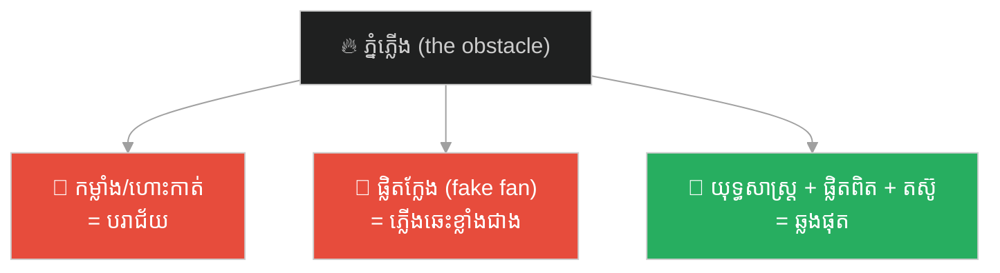
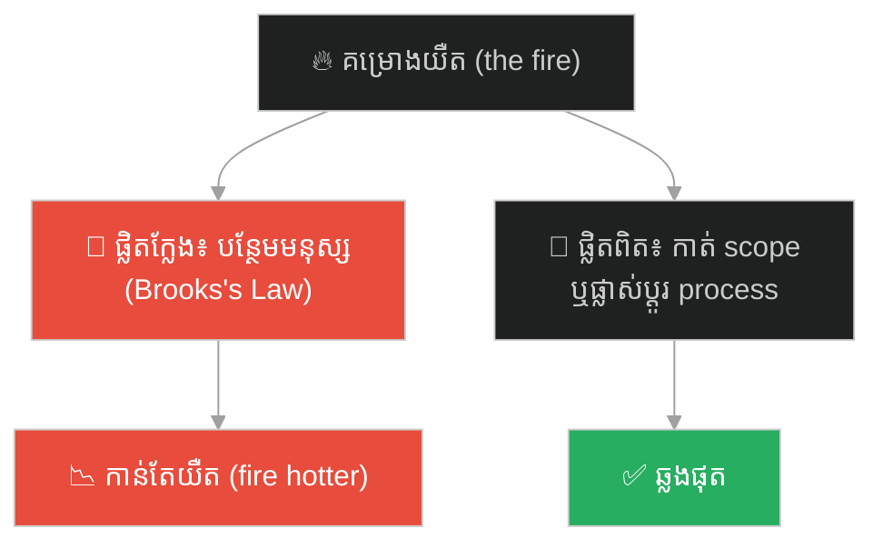
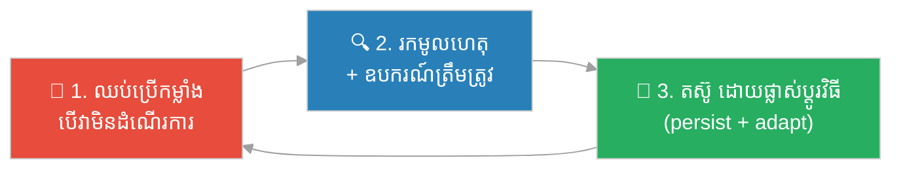

# The Flaming Mountains & the Banana-Leaf Fan (ភ្នំភ្លើង និងផ្លិតស្លឹកចេក)៖ ឧបសគ្គខ្លះ ឈ្នះដោយយុទ្ធសាស្ត្រ មិនមែនកម្លាំង (Some Obstacles Are Won by Strategy, Not Force)

**Author:** ichamrong  
**Date:** 2026-06-04  
**Tags:** #sun-wukong #journey-to-the-west #strategy #problem-solving #persistence #wrong-tool #parable  
**Category:** Concepts / Parables  
**Read Time:** ~10 min  

---

## 📌 មាតិកា (Table of Contents)
- [អន្ទាក់ផ្លូវចិត្ត (The Trap)](#0)
- [១. រឿងព្រេង៖ ភ្នំភ្លើង និងផ្លិតក្លែង (The Legend: The Flaming Mountains and the Fake Fan)](#1)
- [២. បញ្ហា៖ កម្លាំង មិនអាចដោះស្រាយបញ្ហាគ្រប់ប្រភេទ (The Issue: Force Cannot Solve Every Problem)](#2)
- [៣. ឧទាហរណ៍ជាក់ស្តែងក្នុងពិភពពិត (Real World Examples)](#3)
  - [ឧទាហរណ៍ទី ១ — បច្ចេកទេស៖ ការបន្ថែមមនុស្ស ទៅគម្រោងយឺត (Adding People to a Late Project)](#3-1)
  - [ឧទាហរណ៍ទី ២ — ដំណោះស្រាយក្លែង ដែលធ្វើឱ្យអាក្រក់ជាង (The Fake Fix That Makes It Worse)](#3-2)
  - [ឧទាហរណ៍ទី ៣ — ទំនាក់ទំនង៖ ការប៉ុនប៉ងឈ្នះ ដោយកម្លាំង (Trying to "Win" by Force)](#3-3)
- [៤. ដំណោះស្រាយ៖ យុទ្ធសាស្ត្រ ឧបករណ៍ត្រឹមត្រូវ និងការតស៊ូ (The Solution: Strategy, the Right Tool, and Persistence)](#4)
- [សេចក្តីសន្និដ្ឋាន (Conclusion)](#5)
- [ឯកសារយោង (References)](#6)
- [Related Posts](#7)

---

## អន្ទាក់ផ្លូវចិត្ត (The Trap)

នៅពេលជួបឧបសគ្គ តើទម្លាប់ដំបូងរបស់អ្នក គឺ «ប្រើកម្លាំងបន្ថែម» ឬ «ខំប្រឹងខ្លាំងជាងមុន» ដែរឬទេ? ពេលខ្លះ កម្លាំងកាន់តែខ្លាំង ធ្វើឱ្យបញ្ហាកាន់តែអាក្រក់។ ស្តេចស្វា ស៊ុនអ៊ូឃុង ដ៏ខ្លាំង បានរៀនមេរៀននេះ នៅភ្នំភ្លើង។

When you hit an obstacle, is your first instinct to *"use more force"* or *"just try harder"*? Sometimes more force makes the problem *worse*. The mighty Monkey King learned this at the Flaming Mountains.

ភ្នំភ្លើង ជាជញ្ជាំងភ្លើងដ៏ធំ ដែលរារាំងផ្លូវ។ ស្តេចស្វា មិនអាចវាយ ឬហោះកាត់វាបានទេ — គាត់ត្រូវការ **យុទ្ធសាស្ត្រ ការតស៊ូ និងឧបករណ៍ត្រឹមត្រូវ** (ផ្លិតស្លឹកចេក)។ ហើយ លើកដំបូង គាត់ត្រូវបានបោក ឱ្យយក **ផ្លិតក្លែង** ដែលធ្វើឱ្យភ្លើងកាន់តែឆេះខ្លាំង!

The Flaming Mountains were a vast wall of fire blocking the road. The Monkey King could not punch or fly through it — he needed *strategy, persistence, and the right tool* (the Banana-Leaf Fan). And at first, he was tricked into taking a *fake fan* that made the fire burn even hotter!

---

## ១. រឿងព្រេង៖ ភ្នំភ្លើង និងផ្លិតក្លែង (The Legend: The Flaming Mountains and the Fake Fan)

លើផ្លូវធម្មយាត្រា ព្រះថាងសានចាង និងសិស្ស ជួប **ភ្នំភ្លើង (Flaming Mountains / 火焰山)** — ជញ្ជាំងភ្លើងដ៏ក្តៅ ដែលគ្មាននរណាឆ្លងផុតបាន។ ស្តេចស្វា ស៊ុនអ៊ូឃុង ដ៏ខ្លាំង មិនអាចប្រើកម្លាំង វាយ ឬហោះកាត់ភ្លើងនោះបានទេ។

On the pilgrimage, the monk and disciples reach the **Flaming Mountains (火焰山)** — a wall of unbearable fire that no one can cross. The mighty Monkey King could not punch or fly through the flames.

ដំណោះស្រាយតែមួយ គឺ **ផ្លិតស្លឹកចេក (Banana-Leaf Fan / 芭蕉扇)** ដ៏វិសេស របស់ **ព្រះនាងផ្លិតដែក (Princess Iron-Fan)** ដែលអាចបក់ពន្លត់ភ្លើងបាន។ ប៉ុន្តែ ព្រះនាង ស្អប់ស្តេចស្វា ដូច្នេះ នាងបោកគាត់ ឱ្យយក **ផ្លិតក្លែង**។ នៅពេលស្តេចស្វា បក់ភ្នំភ្លើង ដោយផ្លិតក្លែងនោះ — ភ្លើង **ឆេះកាន់តែខ្លាំង**!

The only solution was the magical **Banana-Leaf Fan (芭蕉扇)** of **Princess Iron-Fan**, which could fan the fire out. But the princess hated the Monkey King, so she tricked him into taking a *fake fan*. When he fanned the mountains with it — the fire burned *even hotter*!

ស្តេចស្វា មិនបោះបង់ឡើយ។ គាត់ប្រើ **យុទ្ធសាស្ត្រ** — ប្រែខ្លួនជាសត្វល្អិត លួចចូលពោះព្រះនាង រួមកម្លាំងជាមួយមិត្តភក្តិ និងព្យាយាម **ច្រើនលើក** រហូតបានផ្លិតពិត ហើយ ឆ្លងផុតភ្នំភ្លើងបាន។

The Monkey King did not give up. He used *strategy* — shape-shifting into an insect to sneak inside the princess, teaming up with allies, and trying *many times* until he won the real fan and crossed the Flaming Mountains.

> **កម្លាំង មិនអាចឆ្លងភ្នំភ្លើងបានឡើយ។ ដំណោះស្រាយក្លែង ធ្វើឱ្យវាកាន់តែអាក្រក់។ មានតែយុទ្ធសាស្ត្រ ឧបករណ៍ត្រឹមត្រូវ និងការតស៊ូ ទើបឈ្នះបាន។**
>
> **Force could not cross the fire. A fake solution made it worse. Only strategy, the right tool, and persistence could win.**

---

## ២. បញ្ហា៖ កម្លាំង មិនអាចដោះស្រាយបញ្ហាគ្រប់ប្រភេទ (The Issue: Force Cannot Solve Every Problem)

ភ្នំភ្លើង បង្ហាញការពិតដ៏សំខាន់៖ **បញ្ហាខ្លះ មិនអាចឈ្នះ ដោយ «ខំប្រឹងខ្លាំងជាងមុន» ឬ «កម្លាំងបន្ថែម» ឡើយ — វាត្រូវការ យុទ្ធសាស្ត្រ និងឧបករណ៍ខុសប្រភេទ។**

The Flaming Mountains reveal an important truth: **some problems cannot be won by "trying harder" or "more force" — they require a different *strategy and tool*.**

នេះភ្ជាប់នឹងគំនិតផ្លូវចិត្ត និងគ្រប់គ្រង (this connects to psychology & management):

- **"Law of the Instrument" (Maslow's Hammer)** — «បើអ្នកមានតែញញួរ អ្វី ៗ គ្រប់យ៉ាង មើលទៅដូចជាដែកគោល»។ ស្តេចស្វា ខ្លាំង ដូច្នេះ ទម្លាប់ដំបូងគឺកម្លាំង — តែភ្នំភ្លើង ត្រូវការ «ផ្លិត» មិនមែន «ដំបង»។
- **Working Harder vs. Working Smarter** — ការបន្ថែមកម្លាំង ទៅបញ្ហាខុសប្រភេទ ច្រើនតែ ធ្វើឱ្យអាក្រក់ជាង — ដូចផ្លិតក្លែង ដែលបង្កើនភ្លើង។
- **Persistence + Adaptation (Grit)** — ការតស៊ូ មិនមែនមានន័យថា ធ្វើរឿងដដែល ៗ ម្តងហើយម្តងទៀត — តែ **ព្យាយាមវិធីថ្មី** រហូតរកដំណោះស្រាយត្រឹមត្រូវ។

**ភាពខុសគ្នាសំខាន់៖** ស្តេចស្វា ឈ្នះ មិនមែនព្រោះគាត់ខ្លាំងជាងភ្លើងឡើយ — តែព្រោះគាត់ **ឈប់ប្រើកម្លាំង ហើយចាប់ផ្ដើមប្រើ ប្រាជ្ញា**។ ការ ផ្លាស់ប្ដូរវិធីសាស្ត្រ ទើបជាគន្លឹះ មិនមែនការ បង្កើនកម្លាំង។

**The crucial difference:** the Monkey King won not because he was stronger than fire — but because he *stopped using force and started using wits*. Changing the *method* was the key, not increasing the *force*.

---

## ៣. ឧទាហរណ៍ជាក់ស្តែងក្នុងពិភពពិត (Real World Examples)

---

### ឧទាហរណ៍ទី ១ — បច្ចេកទេស៖ ការបន្ថែមមនុស្ស ទៅគម្រោងយឺត (Adding People to a Late Project)

នៅពេលគម្រោងយឺត ទម្លាប់ដំបូងគឺ «បន្ថែមមនុស្ស» (កម្លាំង)។ តែ ដូច **Brooks's Law** ថា «ការបន្ថែមមនុស្ស ទៅគម្រោងយឺត ធ្វើឱ្យវាកាន់តែយឺត» — ព្រោះត្រូវចំណាយពេលបង្រៀន និងសម្របសម្រួល។ នេះជា «ផ្លិតក្លែង» — កម្លាំងបន្ថែម ដែលធ្វើឱ្យ «ភ្លើង» ឆេះខ្លាំងជាង។ ដំណោះស្រាយពិត គឺ **កាត់បន្ថយវិសាលភាព (scope) ឬផ្លាស់ប្ដូរ process** មិនមែនបន្ថែមមនុស្ស។

When a project is late, the first instinct is "add more people" (force). But as **Brooks's Law** says: *"adding people to a late project makes it later"* — because of onboarding and coordination cost. This is the "fake fan" — more force that makes the "fire" burn hotter. The real fix is to *cut scope or change the process*, not add people.

---

### ឧទាហរណ៍ទី ២ — ដំណោះស្រាយក្លែង ដែលធ្វើឱ្យអាក្រក់ជាង (The Fake Fix That Makes It Worse)

ការ «បិទបាំងរោគសញ្ញា» ដោយ ដំណោះស្រាយរហ័ស (quick fix) ច្រើនតែ ជា «ផ្លិតក្លែង»៖ ការ restart server ដើម្បីលាក់ memory leak, ការខ្ចីបំណុលថ្មី ដើម្បីសងបំណុលចាស់, ឬការ លេបថ្នាំបំបាត់ការឈឺចាប់ ដោយមិនព្យាបាលមូលហេតុ។ ដំណោះស្រាយក្លែង ផ្ដល់ការធូរស្បើយ បណ្ដោះអាសន្ន — តែ ធ្វើឱ្យបញ្ហាឫសគល់ កាន់តែធំ។

"Patching the symptom" with a quick fix is often a "fake fan": restarting a server to hide a memory leak, taking new debt to pay old debt, or taking a painkiller without treating the cause. The fake fix brings temporary relief — but makes the root problem worse.

---

### ឧទាហរណ៍ទី ៣ — ទំនាក់ទំនង៖ ការប៉ុនប៉ងឈ្នះ ដោយកម្លាំង (Trying to "Win" by Force)

ក្នុងជម្លោះ ឬការខ្វែងគំនិត ការប៉ុនប៉ង «ឈ្នះ» ដោយ និយាយខ្លាំងជាង ឬ បង្ខំ ច្រើនតែ ធ្វើឱ្យ «ភ្លើង» ឆេះខ្លាំងជាង — ភាគីម្ខាង កាន់តែការពារខ្លួន។ ដំណោះស្រាយ មិនមែនកម្លាំង — តែ **ការស្ដាប់ ការយល់ និងយុទ្ធសាស្ត្ររកចំណុចរួម**។

In a conflict or disagreement, trying to "win" by talking louder or forcing often makes the "fire" hotter — the other side just gets more defensive. The solution is not force — but *listening, understanding, and the strategy of finding common ground*.

---

## ៤. ដំណោះស្រាយ៖ យុទ្ធសាស្ត្រ ឧបករណ៍ត្រឹមត្រូវ និងការតស៊ូ (The Solution: Strategy, the Right Tool, and Persistence)

ជំហាននៃការអនុវត្ត (How to apply)៖

1. **បើកម្លាំងមិនដំណើរការ ឈប់បន្ថែមកម្លាំង (If force isn't working, stop adding force)៖** ការខំប្រឹងខ្លាំងជាងមុន ទៅវិធីខុស គ្រាន់តែ បន្ថែម «ភ្លើង»។ ឈប់ ហើយ ផ្លាស់ប្ដូរវិធីសាស្ត្រ។ *Trying harder at the wrong method just adds fuel; stop and change the approach.*
2. **រកឧបករណ៍ត្រឹមត្រូវ មិនមែនឧបករណ៍ដែលអ្នកមាន (Find the right tool, not the tool you have)៖** កុំធ្លាក់ក្នុង «ញញួររបស់ Maslow»។ បញ្ហាខុសប្រភេទ ត្រូវការឧបករណ៍ខុសប្រភេទ។ *Don't fall for "Maslow's Hammer"; a different problem needs a different tool.*
3. **ប្រយ័ត្នដំណោះស្រាយក្លែង (Beware the fake fan)៖** quick fix ដែលលាក់ symptom ច្រើនតែ ធ្វើឱ្យឫសគល់ កាន់តែអាក្រក់។ ព្យាបាលមូលហេតុ។ *Quick fixes that hide symptoms usually make the root cause worse; treat the cause.*
4. **តស៊ូ ដោយការសម្រប (Persist by adapting)៖** ស្តេចស្វា ព្យាយាមច្រើនលើក — តែ ផ្លាស់ប្ដូរវិធីរាល់លើក។ ការតស៊ូ មិនមែនការ ធ្វើរឿងដដែល ៗ ។ *Persistence means trying new methods, not repeating the same one.*

---

## សេចក្តីសន្និដ្ឋាន (Conclusion)

> **ស្តេចស្វា ឈ្នះ មិនមែនព្រោះគាត់ខ្លាំងជាងភ្លើងឡើយ — តែព្រោះគាត់ ឈប់ប្រើកម្លាំង ហើយចាប់ផ្ដើមប្រើប្រាជ្ញា។ កម្លាំង មិនអាចឆ្លងភ្នំភ្លើងបានទេ។ ដំណោះស្រាយក្លែង ធ្វើឱ្យវាកាន់តែអាក្រក់។ មានតែយុទ្ធសាស្ត្រ ឧបករណ៍ត្រឹមត្រូវ និងការតស៊ូ ទើបឈ្នះបាន។**
>
> **The Monkey King won not because he was stronger than fire — but because he stopped using force and started using wits. Force could not cross the fire. A fake solution made it worse. Only strategy, the right tool, and persistence could win.**

លើកក្រោយ នៅពេលអ្នកជួប «ភ្នំភ្លើង» របស់ខ្លួន ហើយ កម្លាំង មិនអាចឆ្លងផុត — ចូរ ឈប់ បក់ខ្លាំងជាងមុន។ សួរខ្លួនឯងថា៖ «តើនេះត្រូវការ ឧបករណ៍ខុសប្រភេទ ដែរឬទេ? តើខ្ញុំកំពុង កាន់ផ្លិតក្លែង ដែលធ្វើឱ្យអាក្រក់ជាងឬ?» នោះជាការចាប់ផ្ដើមនៃប្រាជ្ញាពិត។

Next time you face your own "Flaming Mountains" and force can't get you through — stop fanning harder. Ask yourself: *"Does this need a different kind of tool? Am I holding a fake fan that's making it worse?"* That is the beginning of true wisdom.

---

## ឯកសារយោង (References)

* **Wu Cheng'en** — *Journey to the West* (西游记), 16th century. ភ្នំភ្លើង (火焰山) និងផ្លិតស្លឹកចេក (芭蕉扇).
* **Abraham Maslow** — *The Psychology of Science* (1966), "law of the instrument" (Maslow's Hammer).
* **Frederick Brooks** — *The Mythical Man-Month* (1975), Brooks's Law.

---

## Related Posts
### 🐒 The Journey to the West Series (ស៊េរីរឿងដំណើរទៅទិសខាងលិច)

* **[78 The Seventy-Two Faces of Sun Wukong](../articles/78-the-seventy-two-faces-of-sun-wukong.md)** — អត្ថបទវិទ្យាសាស្ត្រ៖ ខ្លួនពិត vs ខ្លួនក្លែង (science article: true self vs false self).
* **[244 The White Bone Demon & the Fiery Eyes](./244-the-white-bone-demon-and-the-fiery-eyes.md)** — របាំងមុខ vs ខ្លួនពិត (masks vs true self).
* **[246 The Monk Who Banished the Truth](./246-the-monk-who-banished-the-truth.md)** — ភាពស្មោះត្រង់ ≠ ការវិនិច្ឆ័យ (sincerity ≠ discernment).
* **[247 The Real and the Fake Monkey](./247-the-real-and-the-fake-monkey.md)** — ផ្ទៃក្រៅ vs ខ្លឹមសារ (surface vs substance).
* **[248 The Golden Headband](./248-the-golden-headband.md)** — អំណាច ត្រូវការការទទួលខុសត្រូវ (power needs accountability).
* **[249 Trapped Under the Mountain](./249-trapped-under-the-mountain.md)** — ទេពកោសល្យ ត្រូវការវិន័យ និងបេសកកម្ម (talent needs discipline & mission).
* **[250 Havoc in Heaven & the Empty Title](./250-havoc-in-heaven-and-the-empty-title.md)** — ឧទ្ធច្ច និងតួនាទីទទេ (ego and empty titles).
* **[251 The Flaming Mountains & the Banana-Leaf Fan](./251-the-flaming-mountains-and-the-banana-fan.md)** — យុទ្ធសាស្ត្រ > កម្លាំង (strategy > force).
* **[252 The Water Curtain Cave & the Leap of Faith](./252-the-water-curtain-cave-and-the-leap-of-faith.md)** — ការផ្ដើម និងហានិភ័យគណនា (initiative & calculated risk).
* **[253 The Five Pillars & the Limit of Perception](./253-the-five-pillars-and-the-limit-of-perception.md)** — ដែនកំណត់នៃការយល់ដឹង និងអំនួត (cognitive limits & overconfidence).
* **[254 The Ginseng Fruit Tree & the Cost of Impulse](./254-the-ginseng-fruit-tree-and-the-cost-of-impulse.md)** — កំហឹងឆេវឆាវ និងការខូចខាត (emotional impulse & cost of damage).
* **[255 The Magic Gourd & the Trap of Response](./255-the-magic-gourd-and-the-trap-of-response.md)** — ការបោកប្រាស់បែបចិត្តសាស្ត្រ និងការផ្ទៀងផ្ទាត់ (social engineering & input validation).
* **[256 The Three Knocks & the Art of Subtle Signals](./256-the-three-knocks-and-the-art-of-subtle-signals.md)** — ការស្ដាប់ដោយសកម្ម និងសញ្ញាបង្កប់ (active listening & subtext).
---

## Related

- [💡 Concepts README](../README.md)
- [📚 Main Repository README](../../../README.md)
- [Mental Health & Well-being](../../mental-health/README.md)
- [Management & SDLC](../../management/README.md)
