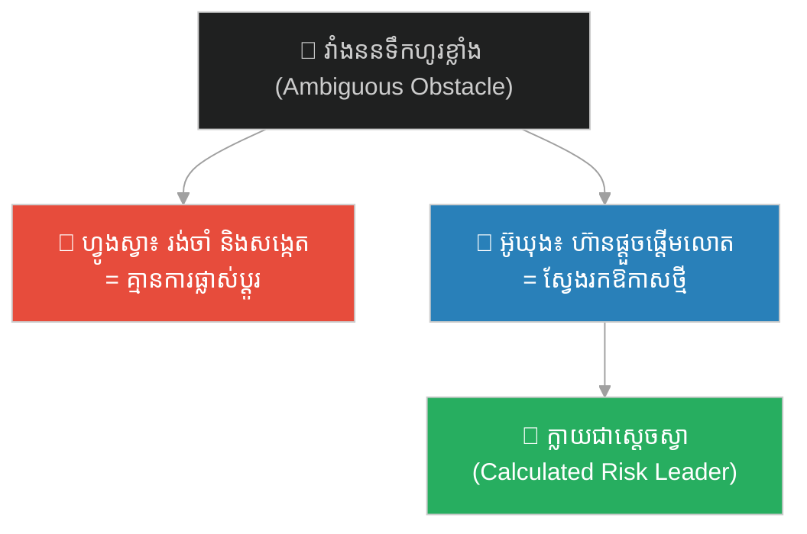
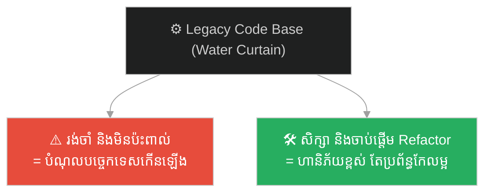
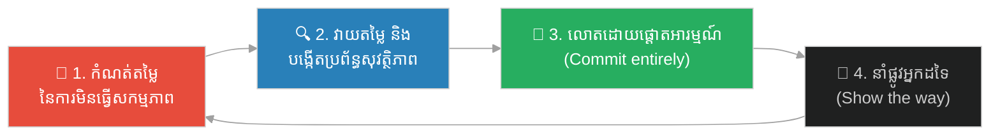

# The Water Curtain Cave & the Leap of Faith (ល្អាងវាំងននទឹក និងការលោតដោយទំនុកចិត្ត)៖ ការផ្ដើម ហានិភ័យគណនា និងការជម្នះការភ័យខ្លាចចំពោះអ្វីដែលមិនស្គាល់ (Initiative, Calculated Risk, and Overcoming Fear of the Unknown)

**Author:** ichamrong  
**Date:** 2026-06-04  
**Tags:** #sun-wukong #journey-to-the-west #initiative #calculated-risk #leadership #courage #bystander-effect #parable  
**Category:** Concepts / Parables  
**Read Time:** ~10 min  

---

## 📌 មាតិកា (Table of Contents)
- [អន្ទាក់ផ្លូវចិត្ត (The Trap)](#0)
- [១. រឿងព្រេង៖ ល្អាងវាំងននទឹក និងស្ដេចស្វា (The Legend: The Water Curtain Cave and the Monkey King)](#1)
- [២. បញ្ហា៖ ហានិភ័យនៃការមិនធ្វើសកម្មភាព និងការភ័យខ្លាចចំពោះអ្វីដែលមិនស្គាល់ (The Issue: The Risk of Inaction and Fear of the Unknown)](#2)
- [៣. ឧទាហរណ៍ជាក់ស្តែងក្នុងពិភពពិត (Real World Examples)](#3)
  - [ឧទាហរណ៍ទី ១ — បច្ចេកទេស៖ ការដោះស្រាយបញ្ហាប្រព័ន្ធចាស់ ដែលគ្មាននរណាហ៊ានប៉ះ (Addressing Legacy Systems No One Dares to Touch)](#3-1)
  - [ឧទាហរណ៍ទី ២ — ធុរកិច្ច៖ ការសាកល្បងទីផ្សារថ្មី មុនពេលមានទិន្នន័យគ្រប់គ្រាន់ (Testing a New Market Before Having Perfect Data)](#3-2)
  - [ឧទាហរណ៍ទី ៣ — ទំនាក់ទំនង៖ ភាពស្រពិចស្រពិល និងការខ្លាចការបដិសេធ (Ambiguity and the Fear of Rejection)](#3-3)
- [៤. ដំណោះស្រាយ៖ ក្របខ័ណ្ឌនៃការលោតដោយគណនា (The Solution: Calculated Leap Framework)](#4)
- [សេចក្តីសន្និដ្ឋាន (Conclusion)](#5)
- [ឯកសារយោង (References)](#6)
- [Related Posts](#7)

---

## អន្ទាក់ផ្លូវចិត្ត (The Trap)

នៅពេលជួបបញ្ហាធំ ឬឧបសគ្គដែលមិនច្បាស់លាស់ តើអ្នកជ្រើសរើសរង់ចាំនរណាម្នាក់ផ្សេងទៀតធ្វើសកម្មភាពមុន ឬអ្នកជាអ្នកលោតទៅមុនគេបង្អស់? ភាគច្រើននៃពួកយើងតែងតែស្ទាក់ស្ទើរនៅចំពោះមុខភាពមិនប្រាកដប្រជា ដោយសារការខ្លាចបរាជ័យ។ ប៉ុន្តែ ភាពអសកម្មក៏ជាហានិភ័យដ៏ធំមួយដែរ។

When faced with a major problem or an ambiguous obstacle, do you choose to wait for someone else to act first, or do you leap before everyone else? Most of us hesitate in the face of uncertainty due to fear of failure. However, inaction itself carries a massive risk.

មុនពេលក្លាយជាស្ដេចស្វា ស៊ុនអ៊ូឃុង គ្រាន់តែជាស្វាធម្មតាម្នាក់នៅក្នុងហ្វូង។ ភាពខុសគ្នាតែមួយគត់ដែលធ្វើឱ្យគាត់ក្លាយជាអ្នកដឹកនាំ គឺការហ៊ានលោតកាត់វាំងននទឹកដ៏ខ្លាំង ដែលគ្មានស្វាណាហ៊ានសាកល្បង។ គាត់បានបង្វែរភាពភ័យខ្លាចជាឱកាស ដោយការគណនាហានិភ័យ និងការផ្ដួចផ្ដើមធ្វើសកម្មភាព។

Before becoming the Monkey King, Sun Wukong was just an ordinary monkey in the troop. The single difference that made him their leader was his willingness to leap through a raging waterfall that no other monkey dared to test. He turned fear into opportunity through calculated risk and active initiative.

---

## ១. រឿងព្រេង៖ ល្អាងវាំងននទឹក និងស្ដេចស្វា (The Legend: The Water Curtain Cave and the Monkey King)

នៅក្នុងសៀវភៅដំណើរទៅទិសខាងលិច ហ្វូងស្វានៅលើភ្នំផ្កានិងផ្លែឈើ បានដើរលេងតាមដងទន្លេ រហូតដល់បានរកឃើញទឹកធ្លាក់ដ៏ធំ និងគួរឱ្យខ្លាចមួយ ដែលហូរធ្លាក់ចុះមកដូចជាវាំងននដែក។ គ្មានស្វាណាម្នាក់ដឹងថាមានអ្វីនៅពីក្រោយទឹកធ្លាក់នោះទេ ដោយសារកម្លាំងទឹកហូរខ្លាំងពេក។

In the *Journey to the West*, the monkey troop on the Mountain of Flowers and Fruit followed a stream up to a massive, roaring waterfall that cascaded down like a heavy iron curtain. None of the monkeys knew what lay behind the rushing water because the torrent was too intimidating.

ហ្វូងស្វាបានព្រមព្រៀងគ្នា និងបោះពាក្យសន្យាថា៖ «នរណាហ៊ានលោតកាត់ទឹកធ្លាក់នេះ ទៅស្វែងរកប្រភពរបស់វា ហើយត្រឡប់មកវិញដោយសុវត្ថិភាព យើងនឹងលើកគេធ្វើជាស្ដេចរបស់យើង!»។ ទោះបីជាមានការសន្យាបែបនេះក៏ដោយ ហ្វូងស្វាទាំងអស់បានត្រឹមតែឈរមើល និងភ័យខ្លាច។

The troop made a pact: "Whoever is brave enough to leap through this waterfall, find its source, and return unharmed, we will crown them as our king!" Despite this promise, all the monkeys merely stared and hesitated out of fear.

ភ្លាមនោះ ថ្មស្វា (អ៊ូឃុង) បានស្រែកឡើងថា «ខ្ញុំនឹងទៅ!»។ គាត់បានបិទភ្នែក បោះជំហាន ហើយលោតយ៉ាងខ្លាំងកាត់កម្លាំងទឹកធ្លាក់។ នៅពីក្រោយវាំងននទឹកនោះ គាត់មិនបានជួបគ្រោះថ្នាក់ឡើយ តែបានរកឃើញល្អាងថ្មដ៏ធំស្អាត មានគ្រឿងសង្ហារឹម និងស្ពានថ្ម ដែលជាកន្លែងរស់នៅដ៏ល្អឥតខ្ចោះ និងមានសុវត្ថិភាពសម្រាប់ហ្វូងស្វាទាំងអស់។ គាត់បានត្រឡប់មកវិញ ហើយដឹកនាំហ្វូងស្វាទាំងអស់ឱ្យទៅរស់នៅទីនោះ ដោយទទួលបានការគោរព និងតែងតាំងជាស្ដេចស្វា។

Suddenly, the Stone Monkey (Wukong) cried, "I will go!" He squeezed his eyes shut, crouched, and leapt straight through the torrent. Behind the water curtain, he found no danger, but a vast stone cave with stone bridges and furniture—a perfect, safe haven for the entire troop. He returned and guided them inside, earning their lifelong allegiance as the Handsome Monkey King.

---

## ២. បញ្ហា៖ ហានិភ័យនៃការមិនធ្វើសកម្មភាព និងការភ័យខ្លាចចំពោះអ្វីដែលមិនស្គាល់ (The Issue: The Risk of Inaction and Fear of the Unknown)

រឿងព្រេងនេះឆ្លុះបញ្ចាំងពីឥរិយាបថរបស់មនុស្សនៅចំពោះមុខភាពស្រពិចស្រពិល (ambiguity)៖

This legend reflects human behavior when facing ambiguity:

- **ឥទ្ធិពលរបស់អ្នកឈរមើល (Bystander Effect) & ភាពអសកម្មជាក្រុម** — ហ្វូងស្វារង់ចាំគ្នាទៅវិញទៅមក ដោយសង្ឃឹមថានរណាម្នាក់ផ្សេងទៀតនឹងសាកល្បងមុន។ នៅក្នុងការងារ និងជីវិត យើងច្រើនតែរង់ចាំអ្នកដទៃផ្ដួចផ្ដើមដោះស្រាយបញ្ហាធំ ៗ ។
- **ការភាន់ច្រឡំហានិភ័យ (Risk Miscalculation)** — ហ្វូងស្វាស្មានថាការលោតកាត់ទឹកធ្លាក់ នឹងនាំទៅរកសេចក្ដីស្លាប់។ ពួកគេគិតតែពីហានិភ័យនៃការធ្វើសកម្មភាព (risk of action) ប៉ុន្តែភ្លេចគិតពីហានិភ័យនៃការមិនធ្វើសកម្មភាព (risk of inaction) ដូចជារស់នៅក្រោមហាលខ្យល់ ហាលភ្លៀង និងគ្រោះថ្នាក់ពីសត្វសាហាវ។
- **ភាពខុសគ្នារវាងការផ្សងព្រេងខ្វះការគិត និងហានិភ័យគណនា (Recklessness vs. Calculated Risk)** — អ៊ូឃុងមិនមែនលោតទៅស្លាប់ដោយគ្មានហេតុផលទេ។ គាត់បានសង្កេត វាយតម្លៃចម្ងាយ និងប្រើប្រាស់កម្លាំងកាយរបស់គាត់ដើម្បីលោត។ ហានិភ័យគឺខ្ពស់ តែរង្វាន់ (reward) គឺការសង្គ្រោះហ្វូងស្វា និងការក្លាយជាអ្នកដឹកនាំ។

**ភាពខុសគ្នាសំខាន់៖** អ្នកដឹកនាំពិតប្រាកដមិនមែនជាមនុស្សដែលគ្មានការភ័យខ្លាចឡើយ តែជាមនុស្សដែល **ហ៊ានធ្វើសកម្មភាព ទាំងកំពុងភ័យខ្លាច** ខណៈពេលដែលអ្នកដទៃបានត្រឹមតែឈរមើល និងស្ទាក់ស្ទើរ។

**The key difference:** true leaders are not those who feel no fear, but those who *act despite their fear* while others remain passive observers.

---

## ៣. ឧទាហរណ៍ជាក់ស្តែងក្នុងពិភពពិត (Real World Examples)

---

### ឧទាហរណ៍ទី ១ — បច្ចេកទេស៖ ការដោះស្រាយបញ្ហាប្រព័ន្ធចាស់ ដែលគ្មាននរណាហ៊ានប៉ះ (Addressing Legacy Systems No One Dares to Touch)

នៅក្នុងក្រុមហ៊ុនបច្ចេកវិទ្យា ច្រើនតែមានកូដចាស់ ៗ (legacy system) ដ៏ស្មុគស្មាញ និងគ្មានឯកសារយោង ដែលគ្រប់គ្នាចាត់ទុកដូចជា «វាំងននទឹកហូរខ្លាំង» — គ្មាននរណាហ៊ានប៉ះព្រោះខ្លាចធ្វើឱ្យប្រព័ន្ធទាំងមូលគាំង។ វិស្វករទូទៅជ្រើសរើសរង់ចាំ ឬបង្វែរដាន។ ប៉ុន្តែ វិស្វករឆ្នើម (អ្នកលោតមុន) ហ៊ានសិក្សា ធ្វើតេស្ត និងចាប់ផ្ដើម refactor វាដោយប្រើប្រព័ន្ធការពារត្រឹមត្រូវ។ នេះជាការលោតដែលនាំទៅរកការកែលម្អប្រព័ន្ធទាំងមូល និងការកើនឡើងកេរ្តិ៍ឈ្មោះក្នុងក្រុម។

In tech companies, there are often complex, undocumented legacy systems that everyone treats like a "roaring waterfall"—no one dares touch it for fear of breaking the build. Average engineers avoid it. But a standout engineer (the leaper) dives in, analyzes, and starts refactoring it with proper safety nets. This calculated leap leads to massive system improvement and establishes their engineering leadership.

---

### ឧទាហរណ៍ទី ២ — ធុរកិច្ច៖ ការសាកល្បងទីផ្សារថ្មី មុនពេលមានទិន្នន័យគ្រប់គ្រាន់ (Testing a New Market Before Having Perfect Data)

នៅក្នុងការធ្វើអាជីវកម្ម ការរង់ចាំរហូតដល់មានទិន្នន័យទីផ្សារល្អឥតខ្ចោះ និងច្បាស់លាស់ ១០០% ច្រើនតែធ្វើឱ្យអ្នកយឺតពេល និងបាត់បង់ឱកាសទៅដៃគូប្រកួតប្រជែង។ ក្រុមហ៊ុន Startup ដែលជោគជ័យ ច្រើនតែធ្វើការលោតកាត់ភាពស្រពិចស្រពិល ដោយការបង្កើត MVP (Minimum Viable Product) ដើម្បីសាកល្បងទីផ្សារយ៉ាងលឿន។ នេះជាហានិភ័យដែលបានគណនា (calculated risk) មិនមែនជាការលោតដោយងងឹតងងល់ឡើយ។

In business, waiting for perfect market data and 100% certainty often means you are too late, losing the opportunity to competitors. Successful startups make a calculated leap into ambiguity by launching an MVP to test the market quickly. This is structured risk-taking, not blind gambling.

---

### ឧទាហរណ៍ទី ៣ — ទំនាក់ទំនង៖ ភាពស្រពិចស្រពិល និងការខ្លាចការបដិសេធ (Ambiguity and the Fear of Rejection)

នៅក្នុងទំនាក់ទំនង ការយល់ច្រឡំ និងការខ្វែងគំនិតគ្នាច្រើនតែកើតឡើងនៅពេលដែលគ្មានភាគីណាម្នាក់ហ៊ានចាប់ផ្ដើមនិយាយមុន។ គ្រប់គ្នារង់ចាំដៃគូម្ខាងទៀតបន្ទន់ឥរិយាបថមុន ដោយសារខ្លាចបាត់បង់អំនួត ឬខ្លាចការបដិសេធ។ នេះជាការរស់នៅក្នុងភាពអសកម្ម។ អ្នកដែលហ៊ាន «លោតមុន» ដោយការបង្ហាញភាពស្មោះត្រង់ និងការសុំទោសមុន គឺជាអ្នកដែលជួយសង្គ្រោះទំនាក់ទំនងនោះ។

In personal relationships, misunderstandings accumulate because neither party wants to initiate the hard conversation first. Everyone waits for the other to soften, fearing a blow to their pride or rejection. The person who "leaps first" by expressing vulnerability and initiating open communication is the one who saves the connection.

---

## ៤. ដំណោះស្រាយ៖ ក្របខ័ណ្ឌនៃការលោតដោយគណនា (The Solution: Calculated Leap Framework)

ជំហាននៃការអនុវត្ត (How to apply):

1. **គណនាតម្លៃនៃភាពស្ងៀមស្ងាត់ (Calculate the cost of inaction)៖** សួរខ្លួនឯងថា «បើខ្ញុំមិនធ្វើអ្វីសោះ តើនឹងមានអ្វីកើតឡើងក្នុងរយៈពេល ៦ ខែខាងមុខ?» ជារឿយ ៗ ភាពអសកម្មមានតម្លៃថ្លៃជាងការសាកល្បងហើយបរាជ័យ។ *Ask yourself: "If I do nothing, what is the cost over the next 6 months?" Inaction often costs more than testing and failing.*
2. **សាងសង់ខ្សែការពារ ឬខ្សែធានាសុវត្ថិភាព (Build a safety net)៖** កុំលោតដោយគ្មានការត្រៀមខ្លួន។ នៅពេលសាកល្បងកូដថ្មី ត្រូវប្រាកដថាមាន test suites ឬ backup; ពេលសាកល្បងទីផ្សារថ្មី ត្រូវកម្រិតវិសាលភាពថវិកា។ *Do not leap blindly. Set up rollbacks, test suites, or budgets to limit the downside of your experiment.*
3. **សម្រេចចិត្តលោតដោយគ្មានការស្ទាក់ស្ទើរ (Commit to the leap)៖** នៅពេលសម្រេចចិត្តធ្វើសកម្មភាព ចូរធ្វើវាឱ្យអស់ពីចិត្ត។ ការស្ទាក់ស្ទើរនៅពាក់កណ្ដាលផ្លូវ គឺជាមូលហេតុចម្បងនៃការធ្លាក់ចុះ។ *Once you decide to act, commit fully. Half-hearted execution is the primary cause of falling short.*
4. **បើកផ្លូវ និងនាំអ្នកដទៃតាមក្រោយ (Document and guide others)៖** ដូចស្តេចស្វាដែលរកឃើញល្អាងហើយត្រឡប់មកនាំហ្វូងស្វា ក្រោយពេលអ្នកដោះស្រាយបញ្ហាបាន ចូរចែករំលែកឯកសារ និងជួយអ្នកដទៃឱ្យដើរតាម។ *Like Wukong returning to guide the troop, once you cross the barrier, document your path and help others transition.*

---

## សេចក្តីសន្និដ្ឋាន (Conclusion)

> **ស្ដេចស្វា មិនមែនកើតមកជាស្ដេចឡើយ។ គាត់បានក្លាយជាស្ដេចព្រោះគាត់ហ៊ានលោតកាត់វាំងននទឹក ខណៈពេលដែលហ្វូងស្វាដទៃទៀតបានត្រឹមតែស្ទាក់ស្ទើរ និងខ្លាចភាពមិនច្បាស់លាស់។ ហានិភ័យខ្ពស់ តែវាជាផ្លូវតែមួយគត់ដើម្បីស្វែងរកល្អាងដ៏មានសុវត្ថិភាព។**
>
> **The Monkey King was not born a king. He became one because he dared to leap through the water curtain while the rest of the troop hesitated in fear of the unknown. The risk was high, but it was the only path to discover their sanctuary.**

លើកក្រោយ នៅពេលអ្នកឃើញ «វាំងននទឹក» នៅក្នុងគម្រោងការងារ អាជីវកម្ម ឬជីវិតផ្ទាល់ខ្លួន — ចូរឈប់រង់ចាំឱ្យអ្នកដទៃលោតមុន។ ចូរគណនាហានិភ័យ រៀបចំខ្សែការពារ ហើយធ្វើការលោតដោយទំនុកចិត្ត។ ភាពក្លាហានរបស់អ្នក មិនត្រឹមតែដោះស្រាយបញ្ហាប៉ុណ្ណោះទេ តែវានឹងបង្កើតសមត្ថភាពដឹកនាំរបស់អ្នក។

Next time you see a "water curtain" blocking progress in your project, career, or personal life—stop waiting for someone else to jump first. Calculate the risk, prepare your safety net, and take the leap. Your initiative will not only solve the problem; it will define your leadership.

---

## ឯកសារយោង (References)

* **Wu Cheng'en** — *Journey to the West* (西游记), 16th century. ជំពូកទី ១៖ ការរកឃើញល្អាងវាំងននទឹក (水帘洞).
* **John Darley & Bibb Latané** — *Bystander Intervention in Emergencies* (1968), on the Bystander Effect.
* **Eric Ries** — *The Lean Startup* (2011), on calculated risk and MVP iteration.

---

## Related Posts
### 🐒 The Journey to the West Series (ស៊េរីរឿងដំណើរទៅទិសខាងលិច)

* **[78 The Seventy-Two Faces of Sun Wukong](../articles/78-the-seventy-two-faces-of-sun-wukong.md)** — អត្ថបទវិទ្យាសាស្ត្រ៖ ខ្លួនពិត vs ខ្លួនក្លែង (science article: true self vs false self).
* **[244 The White Bone Demon & the Fiery Eyes](./244-the-white-bone-demon-and-the-fiery-eyes.md)** — របាំងមុខ vs ខ្លួនពិត (masks vs true self).
* **[246 The Monk Who Banished the Truth](./246-the-monk-who-banished-the-truth.md)** — ភាពស្មោះត្រង់ ≠ ការវិនិច្ឆ័យ (sincerity ≠ discernment).
* **[247 The Real and the Fake Monkey](./247-the-real-and-the-fake-monkey.md)** — ផ្ទៃក្រៅ vs ខ្លឹមសារ (surface vs substance).
* **[248 The Golden Headband](./248-the-golden-headband.md)** — អំណាច ត្រូវការការទទួលខុសត្រូវ (power needs accountability).
* **[249 Trapped Under the Mountain](./249-trapped-under-the-mountain.md)** — ទេពកោសល្យ ត្រូវការវិន័យ និងបេសកកម្ម (talent needs discipline & mission).
* **[250 Havoc in Heaven & the Empty Title](./250-havoc-in-heaven-and-the-empty-title.md)** — ឧទ្ធច្ច និងតួនាទីទទេ (ego and empty titles).
* **[251 The Flaming Mountains & the Banana-Leaf Fan](./251-the-flaming-mountains-and-the-banana-fan.md)** — យុទ្ធសាស្ត្រ > កម្លាំង (strategy > force).
* **[252 The Water Curtain Cave & the Leap of Faith](./252-the-water-curtain-cave-and-the-leap-of-faith.md)** — ការផ្ដើម និងហានិភ័យគណនា (initiative & calculated risk).
* **[253 The Five Pillars & the Limit of Perception](./253-the-five-pillars-and-the-limit-of-perception.md)** — ដែនកំណត់នៃការយល់ដឹង និងអំនួត (cognitive limits & overconfidence).
* **[254 The Ginseng Fruit Tree & the Cost of Impulse](./254-the-ginseng-fruit-tree-and-the-cost-of-impulse.md)** — កំហឹងឆេវឆាវ និងការខូចខាត (emotional impulse & cost of damage).
* **[255 The Magic Gourd & the Trap of Response](./255-the-magic-gourd-and-the-trap-of-response.md)** — ការបោកប្រាស់បែបចិត្តសាស្ត្រ និងការផ្ទៀងផ្ទាត់ (social engineering & input validation).
* **[256 The Three Knocks & the Art of Subtle Signals](./256-the-three-knocks-and-the-art-of-subtle-signals.md)** — ការស្ដាប់ដោយសកម្ម និងសញ្ញាបង្កប់ (active listening & subtext).
---

## Related

- [💡 Concepts README](../README.md)
- [📚 Main Repository README](../../../README.md)
- [Mental Health & Well-being](../../mental-health/README.md)
- [Management & SDLC](../../management/README.md)
