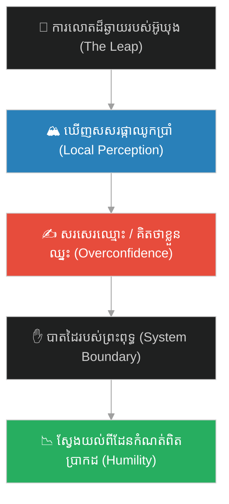
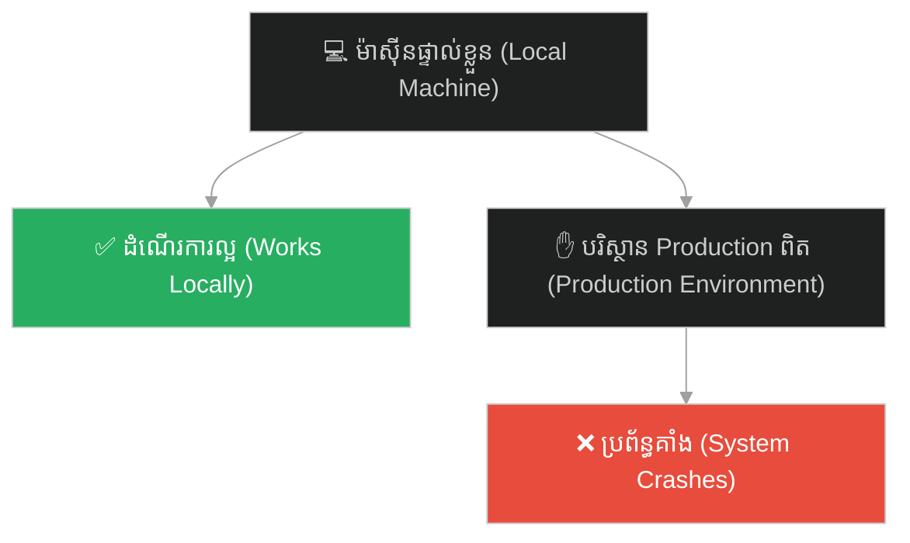
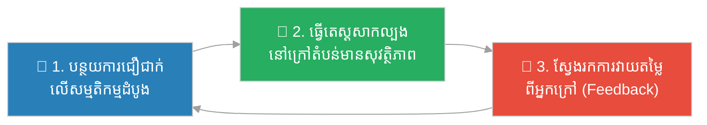

# The Five Pillars & the Limit of Perception (សសរទាំងប្រាំ និងដែនកំណត់នៃការយល់ដឹង)៖ មាយាការនៃការគ្រប់គ្រង និងឥទ្ធិពល Dunning-Kruger (The Illusion of Control and the Dunning-Kruger Effect)

**Author:** ichamrong  
**Date:** 2026-06-04  
**Tags:** #sun-wukong #journey-to-the-west #cognitive-limit #dunning-kruger #illusion-of-control #humility #system-scaling #parable  
**Category:** Concepts / Parables  
**Read Time:** ~10 min  

---

## 📌 មាតិកា (Table of Contents)
- [អន្ទាក់ផ្លូវចិត្ត (The Trap)](#0)
- [១. រឿងព្រេង៖ សសរផ្កាឈូកទាំងប្រាំ និងបាតដៃព្រះសម្មាសម្ពុទ្ធ (The Legend: The Five Pillars and the Buddha's Palm)](#1)
- [២. បញ្ហា៖ ឥទ្ធិពល Dunning-Kruger និងដែនកំណត់នៃការយល់ដឹង (The Issue: The Dunning-Kruger Effect and Limits of Perception)](#2)
- [៣. ឧទាហរណ៍ជាក់ស្តែងក្នុងពិភពពិត (Real World Examples)](#3)
  - [ឧទាហរណ៍ទី ១ — បច្ចេកទេស៖ កូដដែលដំណើរការល្អលើម៉ាស៊ីនផ្ទាល់ខ្លួន (It Works on My Machine Syndrome)](#3-1)
  - [ឧទាហរណ៍ទី ២ — ធុរកិច្ច៖ ការសន្មតថាជោគជ័យដំបូង នឹងពង្រីកខ្លួនដោយគ្មានដែនកំណត់ (The Premature Scaling Assumption)](#3-2)
  - [ឧទាហរណ៍ទី ៣ — ទំនាក់ទំនង៖ ការវាយតម្លៃខ្ពស់លើការយល់ដឹងពីអ្នកដទៃ (The Illusion of Transparent Minds)](#3-3)
- [៤. ដំណោះស្រាយ៖ ការបន្ទាបខ្លួន និងការធ្វើតេស្តព្រំដែន (The Solution: Humility and Boundary Testing)](#4)
- [សេចក្តីសន្និដ្ឋាន (Conclusion)](#5)
- [ឯកសារយោង (References)](#6)
- [Related Posts](#7)

---

## អន្ទាក់ផ្លូវចិត្ត (The Trap)

តើអ្នកធ្លាប់ជឿជាក់ ១០០% ថាអ្នកបានយល់ច្បាស់ពីប្រព័ន្ធមួយ ឬដោះស្រាយបញ្ហាបានទាំងស្រុង តែក្រោយមកទើបដឹងថាអ្នកទើបតែឃើញចំណែកតូចមួយនៃការពិតដ៏ធំធេងដែរឬទេ? នេះជាអន្ទាក់ផ្លូវចិត្តដ៏ عام ដែលកើតឡើងនៅពេលយើងវាយតម្លៃខ្ពស់ហួសហេតុលើដែនកំណត់នៃការយល់ដឹងរបស់យើង។

Have you ever been 100% confident that you completely understood a system or solved a problem, only to realize later that you only saw a tiny fraction of a massive reality? This is a common cognitive trap when we overestimate the boundary of our own knowledge.

ស៊ុនអ៊ូឃុង ដ៏ខ្លាំង មានសមត្ថភាពហោះហើរបានចម្ងាយ ១០៨,០០០ លី (li) ក្នុងការលោតតែមួយដង។ គាត់ជឿជាក់ថាគាត់អាចហោះទៅដល់ចុងបំផុតនៃចក្រវាល និងហួសពីការគ្រប់គ្រងរបស់ព្រះពុទ្ធ។ ប៉ុន្តែ គាត់បានដឹងខ្លួនថា សូម្បីតែការលោតដ៏អស្ចារ្យបំផុតរបស់គាត់ ក៏មិនអាចហួសពីបាតដៃរបស់ព្រះពុទ្ធបានឡើយ។

The mighty Sun Wukong could somersault 108,000 li (miles) in a single leap. He believed he could fly to the edge of the universe, far beyond the reach of the Buddha. But he discovered that even his greatest leaps never left the palm of the Buddha's hand.

---

## ១. រឿងព្រេង៖ សសរផ្កាឈូកទាំងប្រាំ និងបាតដៃព្រះសម្មាសម្ពុទ្ធ (The Legend: The Five Pillars and the Buddha's Palm)

បន្ទាប់ពីបង្កើតចលាចលនៅលើឋានសួគ៌ ស៊ុនអ៊ូឃុង បានជួបនឹងព្រះសម្មាសម្ពុទ្ធ។ អ៊ូឃុងបានអួតអាងពីអំណាចរបស់ខ្លួន និងសមត្ថភាពរបស់គាត់ក្នុងការហោះហើរបានចម្ងាយរាប់ម៉ឺនលីក្នុងមួយប៉ប្រិចភ្នែក។ ព្រះពុទ្ធបានធ្វើការភ្នាល់មួយ៖ «ប្រសិនបើឯងអាចលោតចេញពីបាតដៃស្ដាំរបស់តថាគតបាន តថាគតនឹងលើកឯងឱ្យធ្វើជាអធិរាជឋានសួគ៌»។

After causing havoc in heaven, Sun Wukong confronted the Buddha. Wukong boasted of his supreme power and his ability to travel vast distances in the blink of an eye. The Buddha offered a wager: "If you can leap clean out of my right palm, I will let you claim the Jade Emperor's throne."

អ៊ូឃុងបានសើចចំអកក្នុងចិត្ត ដោយគិតថាបាតដៃព្រះពុទ្ធមានទំហំមិនដល់មួយម៉ែត្រផង។ គាត់បានលោតឡើងលើអាកាស ហោះហើរយ៉ាងលឿនដូចផ្លេកបន្ទោរ ឆ្ពោះទៅមុខឥតឈប់ឈរ រហូតដល់បានឃើញសសរថ្មពណ៌ផ្កាឈូកចំនួនប្រាំឈរនៅចុងបំផុតនៃចក្រវាល។ គាត់បានគិតថា «នេះជាទីបញ្ចប់នៃចក្រវាលហើយ ព្រះពុទ្ធច្បាស់ជាដេញខ្ញុំមិនទាន់ឡើយ»។

Wukong laughed, thinking the Buddha's palm was barely a foot wide. He somersaulted into the air, flying at lightning speed for what felt like eternity, until he reached the edge of the cosmos. There, he saw five pink stone pillars. He thought, "This is the end of the universe. The Buddha could never catch up to me."

ដើម្បីបញ្ជាក់ពីជ័យជម្នះរបស់ខ្លួន អ៊ូឃុងបានសរសេរអក្សរនៅលើសសរកណ្ដាលថា «ស្តេចស្វាដ៏អស្ចារ្យ ស្មើនឹងមេឃ (齐天大圣) បានមកដល់ទីនេះ» រួចបត់នោមដាក់សសរមួយទៀត មុននឹងហោះត្រឡប់មកវិញដោយមោទនភាព។ នៅពេលគាត់មកដល់ គាត់បានទាមទាររាជបល្ល័ង្ក។ ព្រះពុទ្ធបានសើច រួចលើកដៃស្ដាំឡើងបង្ហាញម្រាមដៃរបស់ទ្រង់។ នៅលើម្រាមដៃកណ្ដាល មានសរសេរអក្សរតូចៗដែលអ៊ូឃុងបានសរសេរទុក ហើយនៅគល់ម្រាមចង្អុលមានក្លិនទឹកនោមរបស់គាត់។ អ៊ូឃុងមិនដែលបានចាកចេញពីបាតដៃរបស់ព្រះពុទ្ធឡើយ។

To mark his triumph, Wukong wrote on the middle pillar: "The Great Sage Equal to Heaven was here," and even urinated at the base of another pillar before flying back in triumph. Upon his return, he demanded the throne. The Buddha smiled and raised his right hand. Written on the middle finger were the very words Wukong had left, and the base of his forefinger smelled of monkey urine. Wukong had never left the Buddha's hand.

---

## ២. បញ្ហា៖ ឥទ្ធិពល Dunning-Kruger និងដែនកំណត់នៃការយល់ដឹង (The Issue: The Dunning-Kruger Effect and Limits of Perception)

រឿងព្រេងនេះជានិមិត្តរូបដ៏ល្អឥតខ្ចោះនៃអន្ទាក់ផ្លូវចិត្តពីរ៖

This legend serves as a perfect metaphor for two cognitive traps:

- **ឥទ្ធិពល Dunning-Kruger** — នៅពេលមនុស្សម្នាក់មានចំណេះដឹងតិចតួច ឬមានបទពិសោធន៍តិច ពួកគេតែងតែមានការជឿជាក់ហួសហេតុ (overconfidence)។ ពួកគេស្ថិតនៅលើ «កំពូលភ្នំនៃភាពល្ងង់ខ្លៅ» (Mount Stupid)។ អ៊ូឃុងជឿថាគាត់ដឹងពីទំហំនៃចក្រវាល ព្រោះគាត់ហោះបានលឿន តែគាត់មិនយល់ពីមាត្រដ្ឋានពិតប្រាកដរបស់វាឡើយ។
- **មាយាការនៃការគ្រប់គ្រង (Illusion of Control)** — ការយល់ច្រឡំថា សកម្មភាពរបស់យើងមានឥទ្ធិពលលើលទ្ធផលទាំងស្រុង។ យើងសន្មតថាបច្ចេកវិទ្យា ឬយុទ្ធសាស្ត្ររបស់យើងកំពុងដំណើរការល្អ គ្រាន់តែដោយសារយើងមិនទាន់ជួបប្រទះនឹងការធ្វើតេស្តកម្រិតធំ (scale test)។
- **ដែនកំណត់នៃបរិបទ (Local Context vs. Global Reality)** — សសរទាំងប្រាំដែលអ៊ូឃុងបានឃើញ គឺជាការពិតនៅក្នុងបរិបទមូលដ្ឋានរបស់គាត់ (local context) តែវាជាការយល់ច្រឡំនៅក្នុងបរិបទរួម (global context)។

**ភាពខុសគ្នាសំខាន់៖** មនុស្សដែលមានប្រាជ្ញាពិតប្រាកដ តែងតែដឹងថា «ខ្លួនដឹងតិច» និងព្យាយាមស្វែងយល់ពីដែនកំណត់នៃការយល់ដឹងរបស់ខ្លួនជានិច្ច។

**The crucial difference:** those with true wisdom recognize the boundaries of their knowledge and constantly seek to test their assumptions against a wider reality.

---

## ៣. ឧទាហរណ៍ជាក់ស្តែងក្នុងពិភពពិត (Real World Examples)

---

### ឧទាហរណ៍ទី ១ — បច្ចេកទេស៖ កូដដែលដំណើរការល្អលើម៉ាស៊ីនផ្ទាល់ខ្លួន (It Works on My Machine Syndrome)

វិស្វករសរសេរកូដម្នាក់ បង្កើតមុខងារថ្មីមួយ ហើយធ្វើតេស្តវានៅលើម៉ាស៊ីនរបស់ខ្លួនដោយជោគជ័យ។ គាត់មានអារម្មណ៍ថាខ្លួនដូចជាស៊ុនអ៊ូឃុង ដែលបានគ្រប់គ្រង «ចក្រវាល» ទាំងមូល។ ប៉ុន្តែ នៅពេលកូដនោះត្រូវបានដាក់ឱ្យដំណើរការនៅលើ Production ដែលមានអ្នកប្រើប្រាស់រាប់លាននាក់ក្នុងពេលតែមួយ (បាតដៃព្រះពុទ្ធ) — ប្រព័ន្ធចាប់ផ្ដើមគាំងដោយសារ concurrency, latency និង database locks។ ម៉ាស៊ីនរបស់គាត់ គ្រាន់តែជា «ម្រាមដៃ» មួយប៉ុណ្ណោះ។

A developer writes a new feature, tests it locally, and it runs flawlessly. They feel like Sun Wukong, having conquered their local "universe." But when deployed to a production environment with millions of concurrent users (the Buddha's palm)—the system crashes due to network latency, database locks, and race conditions. Their local machine was just a single "finger."

---

### ឧទាហរណ៍ទី ២ — ធុរកិច្ច៖ ការសន្មតថាជោគជ័យដំបូង នឹងពង្រីកខ្លួនដោយគ្មានដែនកំណត់ (The Premature Scaling Assumption)

សហគ្រិនម្នាក់ បង្កើតអាជីវកម្មលក់ផលិតផលមួយប្រភេទ ហើយទទួលបានការគាំទ្រយ៉ាងខ្លាំងពីមិត្តភក្តិ និងក្រុមគ្រួសារ (សសរទាំងប្រាំ)។ គាត់សន្និដ្ឋានភ្លាមៗថា ផលិតផលនេះនឹងទទួលបានជោគជ័យទូទាំងប្រទេស ហើយសម្រេចចិត្តវិនិយោគទឹកប្រាក់យ៉ាងច្រើនដើម្បីពង្រីកអាជីវកម្មភ្លាមៗ។ គាត់ភ្លេចថា ទីផ្សារពិតប្រាកដ (បាតដៃព្រះពុទ្ធ) មានភាពស្មុគស្មាញ និងមានអាកប្បកិរិយាខុសគ្នាស្រឡះពីក្រុមអតិថិជនដំបូងរបស់គាត់។

An entrepreneur launches a product and receives high praise from friends and family (the five pillars). They immediately assume this translates to nationwide demand and invest heavily to scale operations. They forget that the general market (the Buddha's palm) is vastly more complex and holds different buying behaviors than their initial small test group.

---

### ឧទាហរណ៍ទី ៣ — ទំនាក់ទំនង៖ ការវាយតម្លៃខ្ពស់លើការយល់ដឹងពីអ្នកដទៃ (The Illusion of Transparent Minds)

នៅក្នុងទំនាក់ទំនង យើងជឿជាក់ថា យើង «ស្គាល់» ឬ «យល់ចិត្ត» ដៃគូ ឬសហការីរបស់យើងទាំងស្រុង។ យើងចាប់ផ្ដើមធ្វើសកម្មភាពជំនួសពួកគេ ឬសន្មតគំនិតជំនួសពួកគេ (សរសេរឈ្មោះលើសសរ)។ ប៉ុន្តែ ក្រោយមកទើបយើងដឹងថា គំនិត និងពិភពខាងក្នុងរបស់ពួកគេ មានភាពទូលំទូលាយ និងស្មុគស្មាញជាងអ្វីដែលយើងបានសង្កេតឃើញខាងក្រៅទៅទៀត។

In relationships, we often believe we know our partners or team members inside out. We make decisions on their behalf or assume we know their motives (writing on the pillars). But we eventually learn that their inner world and motivations are far wider and deeper than our shallow observations suggested.

---

## ៤. ដំណោះស្រាយ៖ ការបន្ទាបខ្លួន និងការធ្វើតេស្តព្រំដែន (The Solution: Humility and Boundary Testing)

ជំហាននៃការអនុវត្ត (How to apply):

1. **កុំជឿជាក់លើសម្មតិកម្មដំបូងរបស់ខ្លួនឯង (Question your assumptions)៖** នៅពេលអ្នកមានអារម្មណ៍ថា «នេះជាដំណោះស្រាយល្អបំផុត» ចូរផ្អាក ហើយសួរខ្លួនឯងថា «តើមានកត្តាអ្វីខ្លះដែលខ្ញុំមិនទាន់បានដឹង?» *When you feel absolutely certain, pause and ask: "What variables have I not accounted for yet?"*
2. **ធ្វើតេស្តព្រំដែន និងករណីធ្ងន់ធ្ងរ (Perform load and boundary testing)៖** កុំសរសេរកូដសម្រាប់តែស្ថានភាពល្អ (happy path)។ ត្រូវសាកល្បងវាជាមួយទិន្នន័យខុស ទិន្នន័យធំ និងការប្រើប្រាស់ច្រើនក្នុងពេលតែមួយ។ *Don't test just the happy path. Force failure conditions, heavy loads, and corrupted inputs to find where your system breaks.*
3. **ស្វែងរកអ្នកវាយតម្លៃខាងក្រៅ (Seek peer reviews and external audits)៖** អ៊ូឃុងត្រូវការព្រះពុទ្ធដើម្បីបង្ហាញសរសេរដៃរបស់គាត់។ ចូរដាក់គម្រោង ឬគំនិតរបស់អ្នកឱ្យអ្នកដទៃ (peer reviewers / auditors) ជួយពិនិត្យ ដើម្បីស្វែងរកចំណុចខ្វះខាតដែលអ្នកមើលមិនឃើញ។ *Seek external feedback. Put your design docs, code, or business ideas through peer reviews to surface blind spots.*
4. **អនុវត្តការបន្ទាបខ្លួនខាងវិជ្ជាជីវៈ (Practice intellectual humility)៖** ទទួលស្គាល់ថា មិនថាអ្នករៀនបានច្រើនប៉ុណ្ណាទេ អ្នកតែងតែមានដែនកំណត់នៃការយល់ដឹង។ ត្រៀមខ្លួនជានិច្ចដើម្បីកែប្រែគំនិតពេលជួបទិន្នន័យថ្មី។ *Accept that no matter how much you learn, your perspective is limited. Be ready to pivot when new evidence challenges your view.*

---

## សេចក្តីសន្និដ្ឋាន (Conclusion)

> **ស៊ុនអ៊ូឃុង មិនដែលហោះហួសបាតដៃព្រះពុទ្ធឡើយ។ ដែនកំណត់នៃការយល់ដឹងរបស់គាត់ ត្រូវបានបំបែកនៅពេលគាត់បានឃើញអក្សររបស់ខ្លួននៅលើម្រាមដៃរបស់ទ្រង់។ ភាពជឿជាក់ហួសហេតុនាំទៅរកការបរាជ័យ តែការបន្ទាបខ្លួននាំទៅរកការរៀនសូត្រពិតប្រាកដ។**
>
> **Sun Wukong never flew past the Buddha's palm. The illusion of his boundless reach shattered when he saw his own writing on the Buddha's finger. Overconfidence leads to downfall, but intellectual humility opens the path to true wisdom.**

លើកក្រោយ នៅពេលអ្នកមានអារម្មណ៍ថាបានគ្រប់គ្រង «ចក្រវាល» នៃបញ្ហាមួយទាំងស្រុង — ចូរក្រឡេកមើលសសរទាំងប្រាំរបស់អ្នកឡើងវិញ។ សួរខ្លួនឯងថា៖ «តើនេះជាចុងបញ្ចប់នៃពិភពលោកពិតប្រាកដ ឬវាគ្រាន់តែជាម្រាមដៃរបស់ប្រព័ន្ធដែលធំជាងនេះ?» ការដឹងពីព្រំដែននៃចំណេះដឹងខ្លួនឯង គឺជាចំណុចចាប់ផ្ដើមនៃវិជ្ជាពិត។

Next time you feel you have completely conquered a problem's "universe"—re-examine your five pillars. Ask yourself: *"Is this really the edge of the world, or is it just the finger of a larger system?"* Knowing the boundary of your own knowledge is where wisdom begins.

---

## ឯកសារយោង (References)

* **Wu Cheng'en** — *Journey to the West* (西游记), 16th century. ជំពូកទី ៧៖ អ៊ូឃុងវាយភ្នាល់ជាមួយព្រះពុទ្ធ (赌胜如来).
* **Justin Kruger & David Dunning** — *Unskilled and Unaware of It* (1999), on the Dunning-Kruger Effect.
* **Ellen Langer** — *The Illusion of Control* (1975), on psychological control bias.

---

## Related Posts
### 🐒 The Journey to the West Series (ស៊េរីរឿងដំណើរទៅទិសខាងលិច)

* **[78 The Seventy-Two Faces of Sun Wukong](../articles/78-the-seventy-two-faces-of-sun-wukong.md)** — អត្ថបទវិទ្យាសាស្ត្រ៖ ខ្លួនពិត vs ខ្លួនក្លែង (science article: true self vs false self).
* **[244 The White Bone Demon & the Fiery Eyes](./244-the-white-bone-demon-and-the-fiery-eyes.md)** — របាំងមុខ vs ខ្លួនពិត (masks vs true self).
* **[246 The Monk Who Banished the Truth](./246-the-monk-who-banished-the-truth.md)** — ភាពស្មោះត្រង់ ≠ ការវិនិច្ឆ័យ (sincerity ≠ discernment).
* **[247 The Real and the Fake Monkey](./247-the-real-and-the-fake-monkey.md)** — ផ្ទៃក្រៅ vs ខ្លឹមសារ (surface vs substance).
* **[248 The Golden Headband](./248-the-golden-headband.md)** — អំណាច ត្រូវការការទទួលខុសត្រូវ (power needs accountability).
* **[249 Trapped Under the Mountain](./249-trapped-under-the-mountain.md)** — ទេពកោសល្យ ត្រូវការវិន័យ និងបេសកកម្ម (talent needs discipline & mission).
* **[250 Havoc in Heaven & the Empty Title](./250-havoc-in-heaven-and-the-empty-title.md)** — ឧទ្ធច្ច និងតួនាទីទទេ (ego and empty titles).
* **[251 The Flaming Mountains & the Banana-Leaf Fan](./251-the-flaming-mountains-and-the-banana-fan.md)** — យុទ្ធសាស្ត្រ > កម្លាំង (strategy > force).
* **[252 The Water Curtain Cave & the Leap of Faith](./252-the-water-curtain-cave-and-the-leap-of-faith.md)** — ការផ្ដើម និងហានិភ័យគណនា (initiative & calculated risk).
* **[253 The Five Pillars & the Limit of Perception](./253-the-five-pillars-and-the-limit-of-perception.md)** — ដែនកំណត់នៃការយល់ដឹង និងអំនួត (cognitive limits & overconfidence).
* **[254 The Ginseng Fruit Tree & the Cost of Impulse](./254-the-ginseng-fruit-tree-and-the-cost-of-impulse.md)** — កំហឹងឆេវឆាវ និងការខូចខាត (emotional impulse & cost of damage).
* **[255 The Magic Gourd & the Trap of Response](./255-the-magic-gourd-and-the-trap-of-response.md)** — ការបោកប្រាស់បែបចិត្តសាស្ត្រ និងការផ្ទៀងផ្ទាត់ (social engineering & input validation).
* **[256 The Three Knocks & the Art of Subtle Signals](./256-the-three-knocks-and-the-art-of-subtle-signals.md)** — ការស្ដាប់ដោយសកម្ម និងសញ្ញាបង្កប់ (active listening & subtext).
---

## Related

- [💡 Concepts README](../README.md)
- [📚 Main Repository README](../../../README.md)
- [Mental Health & Well-being](../../mental-health/README.md)
- [Management & SDLC](../../management/README.md)
