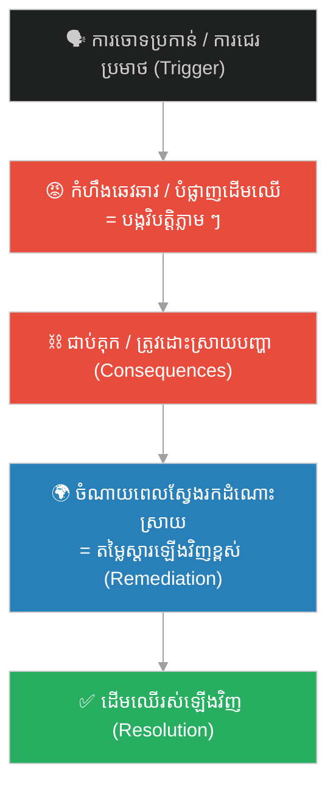
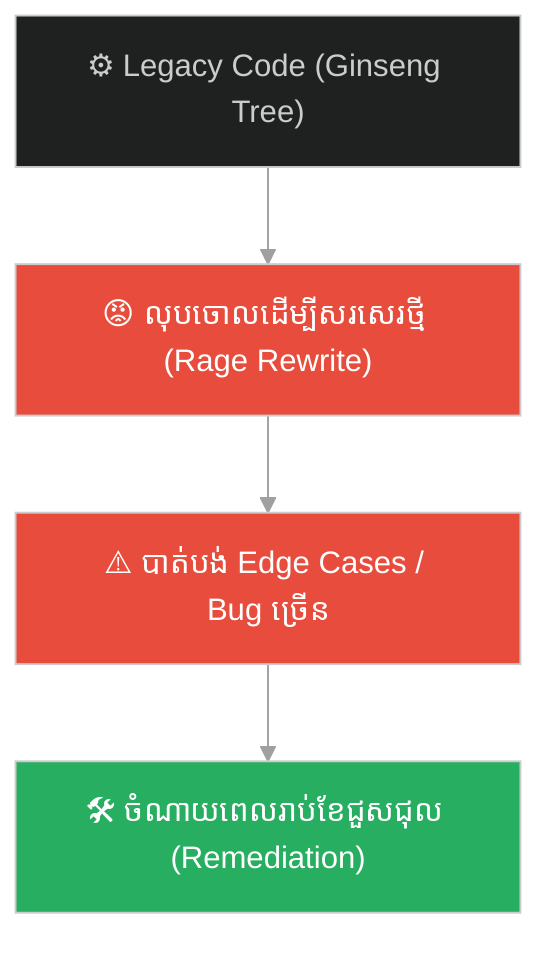
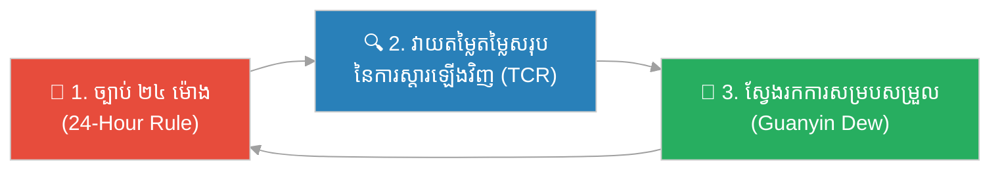

# The Ginseng Fruit Tree & the Cost of Impulse (ដើមឈើផ្លែយិនស៊ិន និងតម្លៃនៃភាពឆេវឆាវ)៖ ភាពឆេវឆាវនៃអារម្មណ៍ និងតម្លៃខ្ពស់នៃការបំផ្លិចបំផ្លាញ/ការស្តារឡើងវិញ (Emotional Impulsiveness and the High Cost of Destruction and Remediation)

**Author:** ichamrong  
**Date:** 2026-06-04  
**Tags:** #sun-wukong #journey-to-the-west #emotional-impulse #remediation #conflict-management #anger #technical-destruction #parable  
**Category:** Concepts / Parables  
**Read Time:** ~10 min  

---

## 📌 មាតិកា (Table of Contents)
- [អន្ទាក់ផ្លូវចិត្ត (The Trap)](#0)
- [១. រឿងព្រេង៖ ការបំផ្លាញដើមយិនស៊ិនវិសេស និងការស្វែងរកថ្នាំព្យាបាល (The Legend: Demolishing the Ginseng Tree and the Search for a Cure)](#1)
- [២. បញ្ហា៖ ភាពងាយស្រួលនៃការបំផ្លាញ និងការលំបាកនៃការស្តារឡើងវិញ (The Issue: Ease of Destruction vs. Cost of Remediation)](#2)
- [៣. ឧទាហរណ៍ជាក់ស្តែងក្នុងពិភពពិត (Real World Examples)](#3)
  - [ឧទាហរណ៍ទី ១ — បច្គេកទេស៖ ការលុបប្រព័ន្ធចោលដើម្បីសរសេរឡើងវិញពីដំបូង (Rage Rewrites and System Deletions)](#3-1)
  - [ឧទាហរណ៍ទី ២ — ធុរកិច្ច/ការដឹកនាំ៖ ការបណ្ដេញបុគ្គលិកសំខាន់ចោលក្នុងពេលខឹង (Anger-Driven Firing of Domain Experts)](#3-2)
  - [ឧទាហរណ៍ទី ៣ — ទំនាក់ទំនង៖ ការដុតកប៉ាល់ចោលដោយសារពាក្យសម្តីមួយម៉ាត់ (Burning Bridges Over Words)](#3-3)
- [៤. ដំណោះស្រាយ៖ ក្របខ័ណ្ឌផ្អាក និងគ្រប់គ្រងអារម្មណ៍ (The Solution: Pause and Contain Framework)](#4)
- [សេចក្តីសន្និដ្ឋាន (Conclusion)](#5)
- [ឯកសារយោង (References)](#6)
- [Related Posts](#7)

---

## អន្ទាក់ផ្លូវចិត្ត (The Trap)

នៅពេលនរណាម្នាក់ចោទប្រកាន់អ្នកដោយអយុត្តិធម៌ ឬធ្វើឱ្យអ្នកខឹង តើអ្នកជ្រើសរើសប្រតិកម្មភ្លាម ៗ ដោយការបំផ្លាញអ្វី ៗ គ្រប់យ៉ាងនៅជុំវិញខ្លួន ឬអ្នកផ្អាកដកដង្ហើម? ការបំផ្លិចបំផ្លាញប្រព័ន្ធមួយចំណាយពេលត្រឹមតែប៉ុន្មានវិនាទីប៉ុណ្ណោះ ប៉ុន្តែការជួសជុល និងស្តារវាឡើងវិញ ត្រូវការពេលវេលា និងថាមពលច្រើនជាងរាប់រយដង។

When someone accuses you unfairly or pushes your buttons, do you react immediately by destroying everything around you, or do you pause and breathe? Demolishing a system takes mere seconds, but repairing and restoring it requires hundreds of times more time and energy.

ស្តេចស្វា ស៊ុនអ៊ូឃុង ដោយខឹងនឹងពាក្យជេរប្រមាថរបស់កូនសិស្សតាវ បានលោតទៅបំផ្លាញ និងគាស់ឫសដើមឈើយិនស៊ិនវិសេស ដែលជាកំណប់ដីដ៏កម្រ។ លទ្ធផលគឺគាត់ត្រូវរត់គេចខ្លួន និងចំណាយពេលធ្វើដំណើររាប់ម៉ឺនលីដើម្បីរកព្រះមកជួយប្រោសដើមឈើឡើងវិញ ដើម្បីដោះស្រាយវិបត្តិដែលគាត់បានបង្កឡើង។

The Monkey King, enraged by the insults of Daoist disciples, knocked down and uprooted the magical Ginseng Fruit Tree, a rare earthly treasure. As a result, he had to flee and travel thousands of miles to find a deity capable of resurrecting the tree to resolve the crisis he created.

---

## ១. រឿងព្រេង៖ ការបំផ្លាញដើមយិនស៊ិនវិសេស និងការស្វែងរកថ្នាំព្យាបាល (The Legend: Demolishing the Ginseng Tree and the Search for a Cure)

នៅលើផ្លូវធម្មយាត្រា ព្រះថាងសានចាង និងសិស្ស បានចូលសម្រាកនៅវិហារវូស៊ាង (Wuzhuang Temple) ដែលជាកន្លែងរបស់តាវស៊ាន ចិនយាន (Zhenyuan)។ នៅក្នុងវិហារនោះ មានដើមឈើយិនស៊ិនវិសេស (Ginseng Fruit Tree) ដែលផ្លែរបស់វាមានរូបរាងដូចកូនក្មេង ហើយអ្នកដែលបានញ៉ាំវានឹងរស់បានរាប់ម៉ឺនឆ្នាំ។ សិស្សតាវបានថ្វាយផ្លែឈើនេះដល់ព្រះថាងសានចាង តែលោកមិនហ៊ានឆាន់ឡើយព្រោះខ្លាច។

On the pilgrimage, the monk Tang Sanzang and his disciples rested at the Wuzhuang Temple, the abode of the Daoist Master Zhenyuan. In the temple grew the magical Ginseng Fruit Tree, whose fruits resembled newborn babies and granted tens of thousands of years of life. The temple acolytes offered the fruit to Tang Sanzang, but he was terrified and refused to eat it.

បន្ទាប់មក ជ្រូក ប៉ាចេ បានដឹងពីរឿងនេះ ហើយបញ្ចុះបញ្ចូលអ៊ូឃុងឱ្យលួចផ្លែឈើនេះមកចែកគ្នាឆាន់។ នៅពេលកូនសិស្សតាវដឹងថាបាត់ផ្លែឈើ ពួកគេបានជេរប្រមាថ និងចោទប្រកាន់ក្រុមធម្មយាត្រាដោយពាក្យសម្តីធ្ងន់ ៗ ។ អ៊ូឃុងមានកំហឹងយ៉ាងខ្លាំង គាត់បានប្រើប្រាស់ដំបងមាសរបស់គាត់វាយកម្ទេចដើមឈើយិនស៊ិន និងគាស់ឫសរបស់វាចោលទាំងស្រុង។

Later, Zhu Bajie discovered this and persuaded Wukong to steal some fruits for them to share. When the acolytes discovered the missing fruits, they insulted and accused the pilgrims with harsh words. Enraged by their insults, Wukong used his golden staff to smash the tree and tear up its roots completely.

នៅពេលលោកម្ចាស់ ចិនយាន ត្រឡប់មកវិញ គាត់បានចាប់ខ្លួនក្រុមធម្មយាត្រាទាំងអស់ទុក។ គាត់បានព្រមានថា បើអ៊ូឃុងមិនអាចធ្វើឱ្យដើមឈើរស់ឡើងវិញទេ ពួកគេនឹងត្រូវស្លាប់។ អ៊ូឃុងគ្មានជម្រើសឡើយ។ គាត់បានហោះហើរទៅកាន់កោះទេវតានានា ដើម្បីស្វែងរកមន្តអាគមប្រោសដើមឈើ តែគ្រប់ទេវតាទាំងអស់សុទ្ធតែបដិសេធ ដោយសារវាជាកំណប់ដីដ៏ពិសិដ្ឋ។ ចុងក្រោយ គាត់ត្រូវសុំអង្វរព្រះម៉ែ គង់ស៊ីអ៊ីម (Guanyin Bodhisattva) ដែលទ្រង់បានប្រើប្រាស់ទឹកមន្តវិសេសដើម្បីប្រោសដើមឈើនោះឱ្យរស់ឡើងវិញ ទើបដោះស្រាយវិបត្តិបាន។

When Master Zhenyuan returned, he easily captured the pilgrims and locked them up. He warned Wukong that if he could not resurrect the tree, they would pay with their lives. Wukong had no choice. He flew to various immortal islands seeking a resurrection spell, but all the deities refused, saying the damage was irreversible. Finally, he begged Guanyin Bodhisattva, who used her sacred sweet dew to heal the tree, resolving the crisis.

---

## ២. បញ្ហា៖ ភាពងាយស្រួលនៃការបំផ្លាញ និងការលំបាកនៃការស្តារឡើងវិញ (The Issue: Ease of Destruction vs. Cost of Remediation)

ភ្នំពេញ និងការបំផ្លាញដើមឈើយិនស៊ិន បង្ហាញពីការពិតជាក់ស្ដែង៖

The destruction of the Ginseng tree highlights a universal truth:

- **ការបំផ្លាញលឿន តែការស្ថាបនាយឺត (Seconds to Destroy, Years to Build)** — អ៊ូឃុងប្រើពេលត្រឹមតែមួយវិនាទីដើម្បីវាយកម្ទេចដើមឈើ តែត្រូវចំណាយពេលរាប់ថ្ងៃ ហោះហើររាប់ម៉ឺនលី និងសុំជំនួយពីព្រះជាច្រើន ដើម្បីជួសជុលវា។ នៅក្នុងស្ថាប័ន កេរ្តិ៍ឈ្មោះ ឬប្រព័ន្ធបច្ចេកវិទ្យា កំហុសឆេវឆាវមួយអាចបំផ្លាញការងារដែលបានកសាងរាប់ឆ្នាំ។
- **តម្លៃនៃការស្តារឡើងវិញខ្ពស់ (High Cost of Remediation)** — នៅពេលយើងធ្វើការសម្រេចចិត្តដោយផ្អែកលើកំហឹង យើងច្រើនតែមើលរំលងតម្លៃសរុបនៃការស្តារឡើងវិញ (Total Cost of Remediation)។ នេះរួមបញ្ចូលទាំងការបាត់បង់ទំនុកចិត្ត ពេលវេលា និងធនធានដែលត្រូវប្រើប្រាស់ដើម្បីដោះស្រាយវិបត្តិ។
- **ការប្រតិកម្មជំនួសការឆ្លើយតប (Reacting vs. Responding)** — ការប្រតិកម្ម (reacting) ជាសកម្មភាពភ្លាម ៗ ដែលដឹកនាំដោយអារម្មណ៍ ចំណែកឯការឆ្លើយតប (responding) ជាសកម្មភាពដែលដឹកនាំដោយការគិត និងយុទ្ធសាស្ត្រ។

**ភាពខុសគ្នាសំខាន់៖** អ្នកដឹកនាំដែលមានវិន័យ តែងតែគ្រប់គ្រងកំហឹងរបស់ខ្លួន និងយល់ថា ជ័យជម្នះបណ្ដោះអាសន្ននៃការបញ្ចេញកំហឹង មិនសមនឹងតម្លៃនៃការស្តារឡើងវិញនោះឡើយ។

**The key difference:** disciplined leaders control their anger because they understand that the temporary satisfaction of lashing out is never worth the high cost of cleaning up the wreckage.

---

## ៣. ឧទាហរណ៍ជាក់ស្តែងក្នុងពិភពពិត (Real World Examples)

---

### ឧទាហរណ៍ទី ១ — បច្ចេកទេស៖ ការលុបប្រព័ន្ធចោលដើម្បីសរសេរឡើងវិញពីដំបូង (Rage Rewrites and System Deletions)

អ្នកសរសេរកូដម្នាក់ មានអារម្មណ៍ធុញទ្រាន់ និងខឹងនឹងប្រព័ន្ធកូដចាស់ (legacy code) ដែលស្មុគស្មាញ និងឧស្សាហ៍មាន bug។ នៅក្នុងភាពខឹងសម្បារ គាត់សម្រេចចិត្តលុប ឬបោះបង់កូដនោះចោលទាំងស្រុង ដើម្បីសរសេរវាឡើងវិញពីបាតដៃទទេ (rage rewrite)។ គាត់គិតថាវាលឿន។ ប៉ុន្តែ ក្រោយមកគាត់ទើបតែដឹងថា កូដចាស់នោះផ្ទុកទៅដោយ edge cases រាប់រយដែលគាត់មិនបានគណនា ដែលធ្វើឱ្យក្រុមការងារត្រូវចំណាយពេលរាប់ខែដើម្បីដោះស្រាយ bug និងស្តារមុខងារចាស់មកវិញ។

A frustrated developer gets fed up with a complex, bug-ridden legacy codebase. In a fit of anger, they decide to delete or discard the code to rewrite it from scratch (a "rage rewrite"), thinking it will be faster. But they soon discover the old code handled hundreds of obscure edge cases they failed to account for, forcing the team to spend months fixing regressions and restoring functionality.

---

### ឧទាហរណ៍ទី ២ — ធុរកិច្ច/ការដឹកនាំ៖ ការបណ្ដេញបុគ្គលិកសំខាន់ចោលក្នុងពេលខឹង (Anger-Driven Firing of Domain Experts)

អ្នកគ្រប់គ្រងម្នាក់ ខឹងនឹងបុគ្គលិកបច្ចេកទេសជាន់ខ្ពស់ម្នាក់ដែលហ៊ានប្រកែក ឬចង្អុលបង្ហាញកំហុសរបស់គាត់នៅក្នុងការប្រជុំ។ ដោយសារតែចង់ការពារអំនួត គាត់សម្រេចចិត្តបណ្ដេញបុគ្គលិកនោះចេញភ្លាម ៗ ។ ជាលទ្ធផល គម្រោងសំខាន់ ៗ របស់ក្រុមហ៊ុនត្រូវគាំងទាំងស្រុង ព្រោះគ្មាននរណាម្នាក់យល់ពីស្ថាបត្យកម្មប្រព័ន្ធក្រៅពីបុគ្គលិកនោះឡើយ។ ក្រុមហ៊ុនត្រូវចំណាយពេល និងលុយកាក់យ៉ាងច្រើនដើម្បីជួលបុគ្គលិកថ្មី និងរង់ចាំការបណ្ដុះបណ្ដាលឡើងវិញ។

A manager fires a senior engineer on the spot during a meeting because the engineer publicly challenged their strategy. To protect their ego, the manager axes them. As a result, critical projects halt because no one else understands the system architecture. The company spends months and massive recruitment fees trying to replace them and train new staff.

---

### ឧទាហរណ៍ទី ៣ — ទំនាក់ទំនង៖ ការដុតកប៉ាល់ចោលដោយសារពាក្យសម្តីមួយម៉ាត់ (Burning Bridges Over Words)

នៅក្នុងការសហការរវាងដៃគូអាជីវកម្ម ការខ្វែងគំនិតគ្នាតិចតួចអាចឈានទៅរកការជជែកវែកញែកដោយកំហឹង។ ភាគីម្ខាងសម្រេចចិត្តផ្តាច់កិច្ចសន្យា និងផ្ដាច់ទំនាក់ទំនងភ្លាម ៗ ដោយសារអារម្មណ៍ឆេវឆាវ។ ពួកគេភ្លេចថា ការកសាងបណ្ដាញទំនាក់ទំនង និងការទុកចិត្តត្រូវការពេលរាប់ឆ្នាំ។ ការស្ដារទំនាក់ទំនងឡើងវិញ ជួនកាលមិនអាចទៅរួចឡើយ ទោះបីជាមានការសុំទោសក្រោយមកក៏ដោយ។

In business partnerships, a minor disagreement can escalate into an angry argument. One party abruptly cancels the contract in a fit of rage, burning the bridge. They forget that building network trust took years. Resurrecting the relationship later is often impossible, even with subsequent apologies.

---

## ៤. ដំណោះស្រាយ៖ ក្របខ័ណ្ឌផ្អាក និងគ្រប់គ្រងអារម្មណ៍ (The Solution: Pause and Contain Framework)

ជំហាននៃការអនុវត្ត (How to apply):

1. **អនុវត្តច្បាប់ ២៤ ម៉ោង (Apply the 24-Hour Rule)៖** នៅពេលអ្នកមានអារម្មណ៍ខឹង ឬចង់ធ្វើសកម្មភាពបំផ្លាញ ចូរផ្អាកការឆ្លើយតបយ៉ាងហោចណាស់ ២៤ ម៉ោង។ កុំផ្ញើ email កុំលុបកូដ និងកុំធ្វើការសម្រេចចិត្តធំ ៗ ក្នុងពេលនោះ។ *When triggered by anger, delay your response for 24 hours. Never write emails, delete code, or make major decisions when emotionally charged.*
2. **វាយតម្លៃតម្លៃសរុបនៃការស្តារឡើងវិញ (Estimate the Total Cost of Remediation)៖** មុននឹងចុចប៊ូតុងលុប ឬបញ្ចប់ទំនាក់ទំនង ចូរសរសេរតម្លៃដែលត្រូវបង់៖ ពេលវេលា លុយកាក់ និងកេរ្តិ៍ឈ្មោះ ដើម្បីដោះស្រាយវាឡើងវិញ។ *Before burning a bridge or deleting a system, calculate the cost: time, money, and reputation required to rebuild it.*
3. **ស្វែងរក «ទឹកមន្តប្រោសដើមឈើ» នៃការសម្របសម្រួល (Seek mediation)៖** នៅពេលមានការខូចខាតកើតឡើងហើយ ចូរឈប់ប្រកែកដើម្បីការពារអំនួត។ ចូរស្វែងរកអ្នកសម្របសម្រួលដែលមានឥទ្ធិពល និងអព្យាក្រឹត (ដូចជាព្រះម៉ែគង់ស៊ីអ៊ីម) ដើម្បីជួយផ្សះផ្សា និងដោះស្រាយបញ្ហា។ *If damage is done, stop fighting to defend your pride. Seek a neutral mediator to help negotiate a resolution and mend the rift.*

---

## សេចក្តីសន្និដ្ឋាន (Conclusion)

> **ការគាស់ឫសដើមឈើយិនស៊ិនចំណាយពេលត្រឹមតែមួយវិនាទី តែត្រូវការកម្លាំងព្រះម៉ែគង់ស៊ីអ៊ីមដើម្បីប្រោសវាឡើងវិញ។ កំហឹងមួយប៉ប្រិចភ្នែក អាចបង្កើតបំណុលនៃការស្តារឡើងវិញដ៏ធំធេង។**
>
> **Uprooting the Ginseng tree took a second, but it required Guanyin's sacred dew to heal. A moment of anger can create a lifetime of remediation debt.**

លើកក្រោយ នៅពេលអ្នកមានអារម្មណ៍ចង់ «វាយកម្ទេចដើមឈើយិនស៊ិន» របស់ខ្លួន — ចូរទម្លាក់ដំបងមាសរបស់អ្នកចុះ។ សួរខ្លួនឯងថា៖ «តើខ្ញុំមានទឹកមន្តវិសេសដើម្បីប្រោសវាឡើងវិញដែរឬទេ? តើខ្ញុំពិតជាចង់ចំណាយពេលរាប់ខែដើម្បីដោះស្រាយវិបត្តិនេះមែនទេ?» នោះជាការចាប់ផ្ដើមនៃភាពចាស់ទុំពិតប្រាកដ។

Next time you feel the urge to "smash the Ginseng tree" in your workspace or life—lower your staff. Ask yourself: *"Do I have the sacred dew to bring this back to life? Am I ready to pay the price of cleaning up this wreckage?"* That is the beginning of emotional maturity.

---

## ឯកសារយោង (References)

* **Wu Cheng'en** — *Journey to the West* (西游记), 16th century. ជំពូកទី ២៥-២៦៖ ការបំផ្លាញដើមឈើយិនស៊ិន (推倒人参果树).
* **Daniel Goleman** — *Emotional Intelligence* (1995), on emotional hijacking and containment.
* **Fred Kofman** — *Conscious Business* (2006), on responding versus reacting in high-stakes environments.

---

## Related Posts
### 🐒 The Journey to the West Series (ស៊េរីរឿងដំណើរទៅទិសខាងលិច)

* **[78 The Seventy-Two Faces of Sun Wukong](../articles/78-the-seventy-two-faces-of-sun-wukong.md)** — អត្ថបទវិទ្យាសាស្ត្រ៖ ខ្លួនពិត vs ខ្លួនក្លែង (science article: true self vs false self).
* **[244 The White Bone Demon & the Fiery Eyes](./244-the-white-bone-demon-and-the-fiery-eyes.md)** — របាំងមុខ vs ខ្លួនពិត (masks vs true self).
* **[246 The Monk Who Banished the Truth](./246-the-monk-who-banished-the-truth.md)** — ភាពស្មោះត្រង់ ≠ ការវិនិច្ឆ័យ (sincerity ≠ discernment).
* **[247 The Real and the Fake Monkey](./247-the-real-and-the-fake-monkey.md)** — ផ្ទៃក្រៅ vs ខ្លឹមសារ (surface vs substance).
* **[248 The Golden Headband](./248-the-golden-headband.md)** — អំណាច ត្រូវការការទទួលខុសត្រូវ (power needs accountability).
* **[249 Trapped Under the Mountain](./249-trapped-under-the-mountain.md)** — ទេពកោសល្យ ត្រូវការវិន័យ និងបេសកកម្ម (talent needs discipline & mission).
* **[250 Havoc in Heaven & the Empty Title](./250-havoc-in-heaven-and-the-empty-title.md)** — ឧទ្ធច្ច និងតួនាទីទទេ (ego and empty titles).
* **[251 The Flaming Mountains & the Banana-Leaf Fan](./251-the-flaming-mountains-and-the-banana-fan.md)** — យុទ្ធសាស្ត្រ > កម្លាំង (strategy > force).
* **[252 The Water Curtain Cave & the Leap of Faith](./252-the-water-curtain-cave-and-the-leap-of-faith.md)** — ការផ្ដើម និងហានិភ័យគណនា (initiative & calculated risk).
* **[253 The Five Pillars & the Limit of Perception](./253-the-five-pillars-and-the-limit-of-perception.md)** — ដែនកំណត់នៃការយល់ដឹង និងអំនួត (cognitive limits & overconfidence).
* **[254 The Ginseng Fruit Tree & the Cost of Impulse](./254-the-ginseng-fruit-tree-and-the-cost-of-impulse.md)** — កំហឹងឆេវឆាវ និងការខូចខាត (emotional impulse & cost of damage).
* **[255 The Magic Gourd & the Trap of Response](./255-the-magic-gourd-and-the-trap-of-response.md)** — ការបោកប្រាស់បែបចិត្តសាស្ត្រ និងការផ្ទៀងផ្ទាត់ (social engineering & input validation).
* **[256 The Three Knocks & the Art of Subtle Signals](./256-the-three-knocks-and-the-art-of-subtle-signals.md)** — ការស្ដាប់ដោយសកម្ម និងសញ្ញាបង្កប់ (active listening & subtext).
---

## Related

- [💡 Concepts README](../README.md)
- [📚 Main Repository README](../../../README.md)
- [Mental Health & Well-being](../../mental-health/README.md)
- [Management & SDLC](../../management/README.md)
